# 1.1 État de l'art de l'IA

    

        
            <i class="fas fa-clock"></i>
        
        

            
Temps de lecture

            
12 min

        

    

!!! warning "N'a pas été mis à jour depuis mars 2024. Pourrait ne pas refléter les développements majeurs récents."

Au cours de la dernière décennie, le domaine de l'intelligence artificielle (IA) a connu une transformation profonde, largement attribuée aux succès de l'apprentissage profond. Ces progrès remarquables ont redéfini les limites des capacités de l'IA, remettant en question de nombreuses idées préconçues sur ce que les machines peuvent accomplir. Les sections suivantes détaillent certaines de ces avancées.

<figure class="iframe-figure" markdown="span">
<iframe src="https://ourworldindata.org/grapher/test-scores-ai-capabilities-relative-human-performance?country=Handwriting+recognition~Speech+recognition~Image+recognition~Reading+comprehension~Language+understanding~Predictive+reasoning~Code+generation~Complex+reasoning~General+knowledge+tests~Nuanced+language+interpretation~Math+problem-solving~Reading+comprehension+with+unanswerable+questions&tab=chart" loading="lazy" style="width: 100%; height: 600px; border: 0px none;" allow="web-share; clipboard-write"></iframe>
  <figcaption markdown="1"><b>Figure interactive 1.1 :</b> Scores de tests de différentes capacités de l'IA par rapport aux performances humaines. ([Giattino et al., 2023](https://ourworldindata.org/artificial-intelligence))</figcaption>
</figure>

Dès qu'un référentiel de test est publié, le temps nécessaire pour le résoudre ne cesse de diminuer. Cela illustre les progrès accélérés de l'IA et la rapidité avec laquelle les référentiels de tests d'IA sont saturés, commençant à surpasser les performances humaines sur un large éventail de tâches. ([Notre monde en données, 2023](https://ourworldindata.org/grapher/test-scores-ai-capabilities-relative-human-performance?country=Handwriting+recognition~Speech+recognition~Image+recognition~Reading+comprehension~Language+understanding~Predictive+reasoning~Code+generation~Complex+reasoning~General+knowledge+tests~Nuanced+language+interpretation~Math+problem-solving~Reading+comprehension+with+unanswerable+questions))

<figure class="iframe-figure" markdown="span">
<iframe src="https://ourworldindata.org/grapher/domain-notable-artificial-intelligence-systems?tab=chart" loading="lazy" style="width: 100%; height: 600px; border: 0px none;" allow="web-share; clipboard-write"></iframe>
  <figcaption markdown="1"><b>Figure interactive 1.2 :</b> Systèmes d'IA remarquables (par domaine) ([Giattino et al., 2023](https://ourworldindata.org/artificial-intelligence))</figcaption>
</figure>

## 1.1.1 Langage {: #01}

<figure class="iframe-figure" markdown="span">
<iframe src="https://ourworldindata.org/grapher/ai-performance-coding-math-knowledge-tests?tab=chart" loading="lazy" style="width: 100%; height: 600px; border: 0px none;" allow="web-share; clipboard-write"></iframe>
  <figcaption markdown="1"><b>Figure interactive 1.3 :</b> Performance des benchmarks en programmation, mathématiques et langage. ([Giattino et al., 2023](https://ourworldindata.org/artificial-intelligence))</figcaption>
</figure>

**Tâches basées sur le langage.** Des changements transformateurs ont marqué les tâches séquentielles et langagières, principalement grâce au développement des grands modèles de langage (LLM, de l'anglais Large Language Models). En 2018, les premiers modèles de langage peinaient à construire des phrases cohérentes. L'évolution de ces modèles vers les capacités avancées de GPT-3 (Generative Pre-Trained Transformer) et ChatGPT en moins de 5 ans est véritablement remarquable. Ces modèles démontrent non seulement une capacité améliorée de génération de texte, mais aussi d'analyse de requêtes complexes avec un raisonnement nuancé et intuitif. Leurs performances dans divers exercices de questions-réponses, notamment ceux requérant une pensée stratégique, ont été particulièrement saisissantes.

GPT-4. L'un des modèles de langage de pointe en 2024 est le LLM GPT-4 d'OpenAI. Contrairement à GPT-3 et ses successeurs textuels, GPT-4 est multimodal : il a été entraîné sur du texte et des images. Cela signifie qu'il peut désormais non seulement générer du texte à partir d'images, mais a également acquis d'autres capacités. GPT-4 a vu sa fenêtre de contexte améliorée avec jusqu'à 32k tokens (unités de texte, approximativement équivalentes aux mots). La limite de mémoire à court terme d'un LLM peut être considérée comme la capacité du modèle à retenir des informations à partir des tokens précédents dans une certaine fenêtre de contexte. GPT-4 est entraîné par prédiction du token suivant, selon un processus d'apprentissage auto-supervisé et autorégressif. En 2018, GPT-1 pouvait à peine compter jusqu'à 10, tandis qu'en 2024, GPT-4 peut implémenter des fonctions programmatiques complexes, entre autres.

<figure markdown="span">
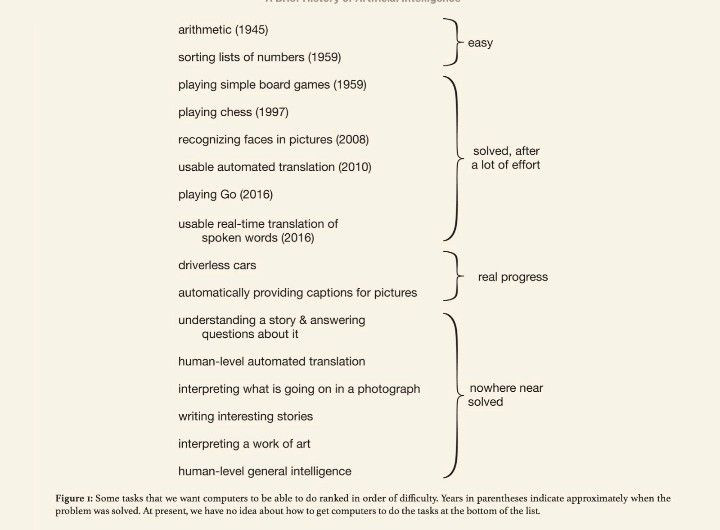{ loading=lazy }
  <figcaption markdown="1"><b>Figure 1.2 :</b> Une liste de problèmes considérés comme "Loin d'être résolus" [...] issues in AI, tirée de "Une brève histoire de l'IA", publiée en janvier 2021 ([Wooldridge, 2021](https://www.amazon.com/Brief-History-Artificial-Intelligence-Where/dp/1250770742)). Ils affirment également : "À l'heure actuelle, nous n'avons aucune idée de la façon dont nous pourrions faire faire aux ordinateurs les tâches figurant au bas de la liste". Mais tout ce qui se trouve dans la catégorie "Loin d'être résolus" a été résolu par GPT-4 ([Bubeck et al., 2023](https://arxiv.org/abs/2303.12712)), à l'exception de l'intelligence générale de niveau humain.</figcaption>
</figure>

**Mise à l'échelle**. Chose remarquable, GPT-4 est entraîné selon des méthodes quasiment identiques à celles de GPT-1, 2 et 3. La seule différence significative réside dans la taille du modèle et les données utilisées durant l'entraînement. La taille du modèle est passée de 1,5 milliard de paramètres à plusieurs centaines de milliards de paramètres, et les jeux de données sont devenus tout aussi plus vastes et diversifiés.

<figure markdown="span">
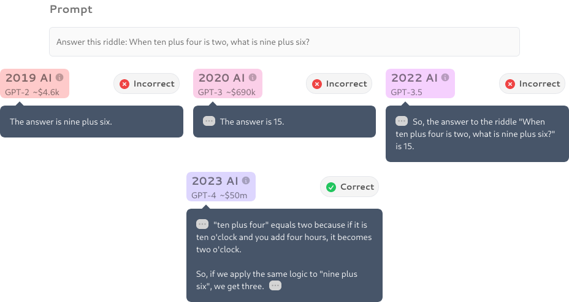{ loading=lazy }
  <figcaption markdown="1"><b>Figure 1.3 :</b> À quelle vitesse l'IA s'améliore-t-elle ? ([Digest IA, 2023](https://theaidigest.org/progress-and-dangers))</figcaption>
</figure>

Nous avons constaté qu'une simple montée en échelle a suffi à améliorer significativement les performances. Cela se traduit par des progrès dans la capacité à générer des réponses contextuellement pertinentes et des textes hautement diversifiés across différents domaines. Cette évolution a également contribué à une compréhension et une cohérence globales plus affinées. La majorité de ces avancées dans la série GPT résultent principalement de l'augmentation de la taille et de la puissance de calcul des modèles, plutôt que de changements fondamentaux dans leur architecture ou leur processus d'entraînement.

Voici quelques-unes des capacités qui ont émergé ces dernières années :

- **Apprentissage few-shot et zero-shot**. La remarquable capacité du modèle à comprendre et exécuter des tâches avec un minimum d'exemples préalables. L'apprentissage 'few-shot' permet d'accomplir une tâche après avoir observé quelques exemples dans la fenêtre de contexte, tandis que l'apprentissage 'zero-shot' permet de réaliser la tâche sans aucun exemple spécifique ([Anthropic, 2022](https://transformer-circuits.pub/2022/in-context-learning-and-induction-heads/index.html)). Cette capacité comprend également des mécanismes d'induction, permettant d'identifier des modèles et de généraliser des règles qui ne sont pas présentes dans les données d'entraînement initial, mais qui émergent uniquement dans la fenêtre de contexte courante ([Brown et al., 2020](https://arxiv.org/abs/2005.14165)).

- **Métacognition**. Cela fait référence à la capacité de reconnaître ses propres connaissances et limitations, par exemple, être capable de connaître la probabilité de vérité de quelque chose ([Kadavath, 2022](https://arxiv.org/abs/2207.05221)).

- **Théorie de l'esprit**. La capacité à attribuer des états mentaux à soi-même et aux autres, permettant de mieux comprendre et anticiper les comportements et réponses humains pour des interactions plus nuancées ([Kosinski 2023](https://arxiv.org/abs/2302.02083) ; [Xu et al., 2024](https://arxiv.org/abs/2402.06044)).

- **Utilisation d'outils**. La capacité d'interagir avec des outils externes, comme utiliser une calculatrice ou naviguer sur internet, élargissant ses capacités de résolution de problèmes ([Qin et al., 2023](https://arxiv.org/abs/2307.16789)).

- **Autocorrection**. La capacité du modèle à identifier et corriger ses propres erreurs, élément crucial pour améliorer la précision des contenus générés par l'IA ([Shinn et al., 2023](https://arxiv.org/abs/2303.11366)).

<figure markdown="span">
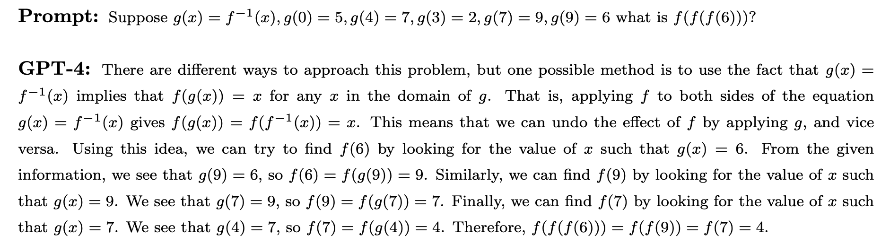{ loading=lazy }
  <figcaption markdown="1"><b>Figure 1.4 :</b> Un exemple de problème mathématique résolu par GPT-4 en utilisant la Chaîne de Pensée (Chain of Thought, CoT), extrait de l'article "Étincelles d'Intelligence Artificielle Générale" ([Bubeck et al., 2023](https://arxiv.org/abs/2303.12712)).</figcaption>
</figure>

- **Raisonnement**. Les progrès des grands modèles de langage (LLM, de l'anglais *Large Language Models*) ont également conduit à des améliorations significatives dans la capacité à traiter et générer des chaînes logiques de pensée et de raisonnement. Cela est particulièrement important dans les tâches de résolution de problèmes où une réponse directe n'est pas immédiatement disponible, et où un processus de raisonnement étape par étape est nécessaire. ([Bubeck et al., 2023](https://arxiv.org/abs/2303.12712))

- **Capacité de programmation**. Dans le domaine du développement logiciel, les modèles d'IA sont passés de la complétion de code à l'écriture de programmes complexes et pleinement fonctionnels.

- **Capacités avancées en sciences et mathématiques**. Dans le domaine mathématique, les IA assistent depuis des décennies à la démonstration automatique de théorèmes. Les modèles actuels continuent de relever des défis complexes, atteignant même un niveau remarquable : ils peuvent désormais résoudre des problèmes de géométrie au niveau d'une médaille d'or aux Olympiades mathématiques ([Trinh et al., 2024](https://www.nature.com/articles/s41586-023-06747-5)).

<figure markdown="span">
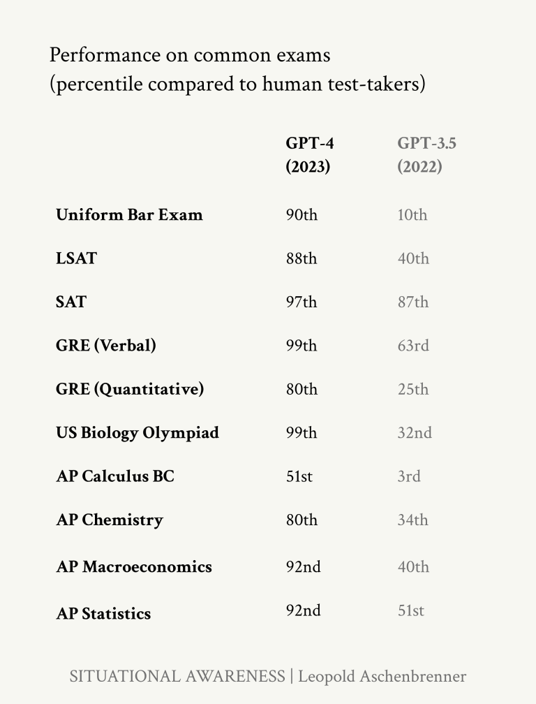{ loading=lazy }
  <figcaption markdown="1"><b>Figure 1.5 :</b> Notez également le bond significatif de GPT-3.5 à GPT-4 dans le percentile humain lors de ces tests, passant souvent d'un niveau bien inférieur à la médiane humaine jusqu'au sommet de la plage humaine. ([Aschenbrenner, 2024](https://situational-awareness.ai/from-gpt-4-to-agi/); [OpenAI, 2023](https://arxiv.org/abs/2303.08774)). Gardez à l'esprit que le saut de GPT-3 à GPT-4 s'est produit en seulement un an.</figcaption>
</figure>

## 1.1.2 Génération d'Images {: #02}

Le bond en avant dans la génération d'images se situe non seulement dans la précision, mais aussi dans la capacité à traiter des images complexes du monde réel. Ce dernier aspect, en particulier avec l'avènement des Réseaux Antagonistes Génératifs (GANs, de l'anglais *Generative Adversarial Networks*) en 2014, a montré un taux de progrès stupéfiant. La qualité des images générées par l'IA est passée de simples représentations floues à des scènes hautement détaillées et créatives, souvent en réponse à des invites textuelles précises et élaborées.

<figure markdown="span">
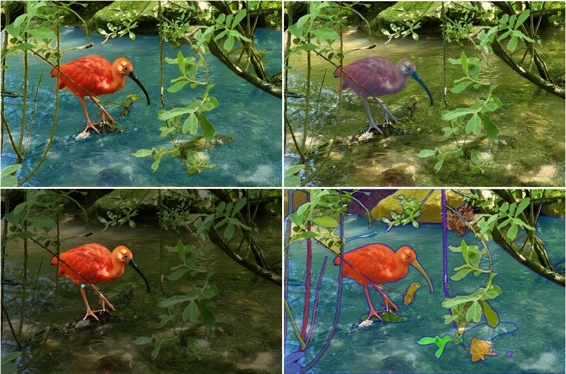{ loading=lazy }
  <figcaption markdown="1"><b>Figure 1.6 :</b> Un exemple de reconnaissance d'image à la pointe de la technologie. Le modèle Segment Anything (SAM) du laboratoire de recherche fondamentale en IA de Meta (FAIR, de l'anglais *Fundamental AI Research*), peut classifier et segmenter des données visuelles à des niveaux de précision extrêmement élevés. La détection est réalisée sans nécessiter d'annotation préalable des images. ([Viso AI, 2024](https://viso.ai/deep-learning/segment-anything-model-sam-explained/); [Meta, 2023](https://ai.meta.com/research/publications/segment-anything/))</figcaption>
</figure>

<figure markdown="span">
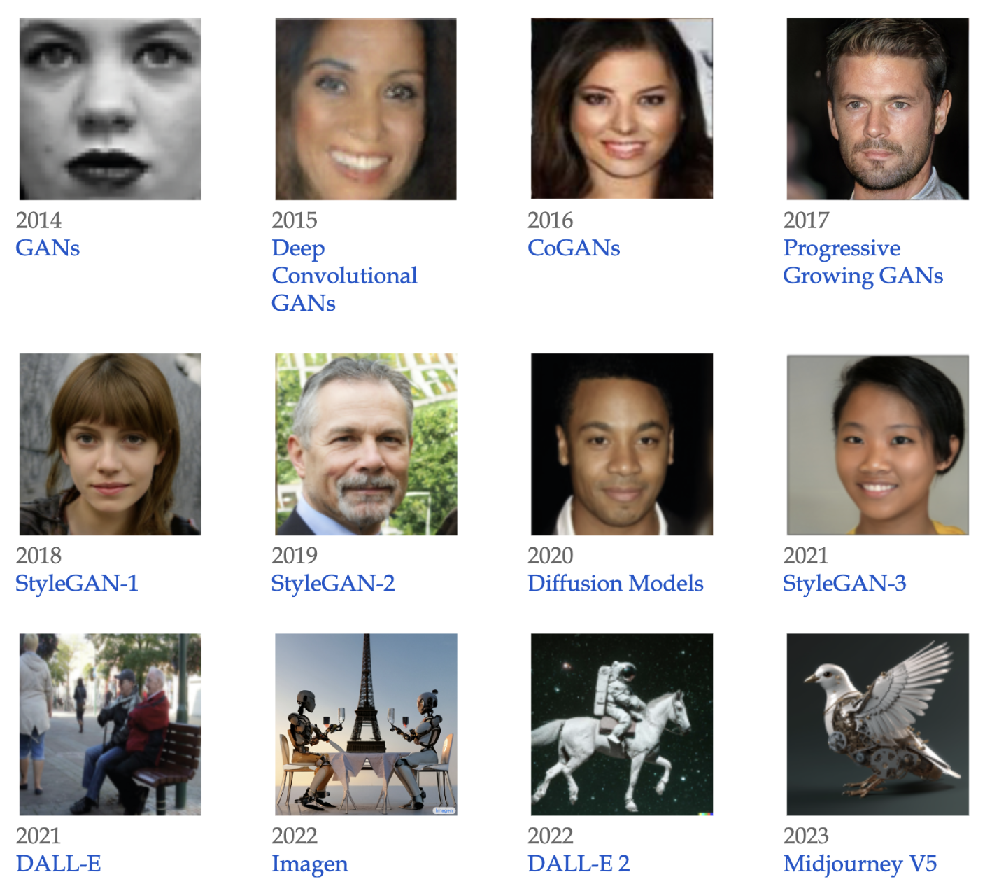{ loading=lazy }
  <figcaption markdown="1"><b>Figure 1.7 :</b> Un exemple de l'évolution de la génération d'images. En haut à gauche, partant des GANs (Réseaux Antagonistes Génératifs, de l'anglais *Generative Adversarial Networks*) jusqu'en bas à droite, une image de MidJourney V5.</figcaption>
</figure>

Le taux de progrès en l'espace d'une seule année est vraiment stupéfiant, comme on peut le constater à travers les améliorations entre la version V1 du modèle de génération d'images MidJourney début 2022, et la version V6 en décembre 2023.

<figure markdown="span">
{ loading=lazy }
  <figcaption markdown="1"><b>Figure 1.8 :</b> Génération d'images par l'IA MidJourney de 2022 à 2023. Prompt : photographie de haute qualité d'une jeune femme japonaise souriante, contre-jour, lumière naturelle pâle, appareil photo argentique, par Rinko Kawauchi, HDR ([Yap, 2024](https://goldpenguin.org/blog/midjourney-v1-to-v6-evolution/))</figcaption>
</figure>

## 1.1.3 Multimodalité et Modalités Croisées {: #03}

Les systèmes d'IA deviennent de plus en plus multimodaux. Cela signifie qu'ils peuvent traiter plusieurs types de données - images, texte, audio, vision et robotique - en utilisant un même modèle. Ils sont entraînés sur différentes modalités et capables de passer de l'une à l'autre après leur déploiement.

**Modalités croisées**. On parle de modèle à modalités croisées lorsque l'entrée d'un modèle est dans une modalité (par exemple, du texte) et la sortie dans une autre modalité (par exemple, une image). La section sur la vision par ordinateur a montré des progrès rapides entre 2014 et 2020 dans le domaine des modalités croisées. Nous sommes passés de modèles texte-à-image ne pouvant générer que des images pixelisées en noir et blanc de visages, à des modèles capables de générer une image à partir de n'importe quel prompt textuel. D'autres exemples de modalités croisées incluent Whisper d'OpenAI ([Radford et al., 2022](https://arxiv.org/abs/2212.04356)) qui est capable de transcription de la parole en texte.

**Multimodalité**. On parle de modèle multimodal lorsque les entrées et les sorties d'un modèle peuvent être dans plusieurs modalités. Par exemple, audio-à-texte, vidéo-à-texte, texte-à-image, etc.

<figure markdown="span">
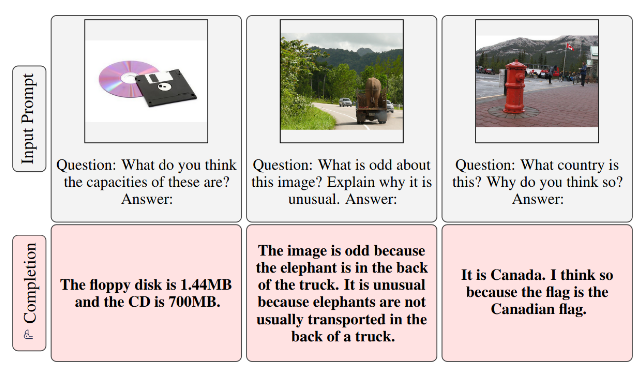{ loading=lazy }
  <figcaption markdown="1"><b>Figure 1.9 :</b> Multimodalité image-à-texte et texte-à-image du modèle Flamingo. ([Alayrac et al., 2022](https://arxiv.org/abs/2204.14198))</figcaption>
</figure>

Le modèle Flamingo de DeepMind en 2022 pouvait être "*rapidement adapté à diverses tâches de compréhension d'images/vidéos*" et "*capable d'interagir visuellement avec plusieurs images*". ([Alayrac et al., 2022](https://arxiv.org/abs/2204.14198)) De manière similaire, le modèle Gato de DeepMind en 2022 était appelé un "Agent Généraliste". C'était un réseau unique avec les mêmes poids qui pouvait "*jouer à Atari, légender des images, discuter, empiler des blocs avec un bras robotique réel, et bien plus encore*". ([Reed et al., 2022](https://arxiv.org/abs/2205.06175)) Poursuivant cette tendance, le modèle Google Gemini de DeepMind en 2023 pourrait être qualifié de Grand Modèle Multimodal (LMM, de l'anglais *Large Multimodal Model*). Le document décrivait Gemini comme "*nativement multimodal*" et prétendait pouvoir "*intégrer naturellement ses capacités à travers les modalités (par exemple extraire des informations et la disposition spatiale d'un tableau, d'un graphique ou d'une figure) avec les fortes capacités de raisonnement d'un modèle de langage (par exemple ses performances de pointe en mathématiques et en codage)*" ([Google, 2024](https://arxiv.org/abs/2312.11805))

## 1.1.4 Robotique {: #04}

<figure class="iframe-figure" markdown="span">
<iframe src="https://ourworldindata.org/grapher/annual-professional-service-robots-installed-by-area?tab=chart" loading="lazy" style="width: 100%; height: 600px; border: 0px none;" allow="web-share; clipboard-write"></iframe>
  <figcaption markdown="1"><b>Figure interactive 1.4 :</b> Robots en usage par domaine de service ([Giattino et al., 2023](https://ourworldindata.org/artificial-intelligence))</figcaption>
</figure>

Le domaine de la robotique a également progressé parallèlement à l'intelligence artificielle. Dans cette section, nous présentons quelques exemples où ces deux domaines fusionnent, en mettant en lumière certains robots utilisant des techniques d'apprentissage automatique pour réaliser des avancées.

<figure markdown="span">
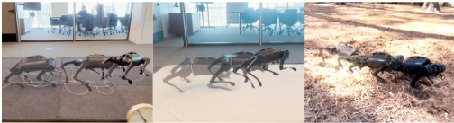{ loading=lazy }
  <figcaption markdown="1"><b>Figure 1.10 :</b> Des chercheurs ont utilisé l'apprentissage par renforcement sans modèle pour apprendre automatiquement la locomotion quadrupède en seulement 20 minutes dans le monde réel, au lieu d'environnements simulés. La figure montre des exemples d'allures apprises sur divers terrains réels. ([Smith et al., 2022](https://arxiv.org/abs/2208.07860))</figcaption>
</figure>

<figure class="iframe-figure" markdown="span">
<iframe src="https://ourworldindata.org/grapher/annual-industrial-robots-installed?tab=chart" loading="lazy" style="width: 100%; height: 600px; border: 0px none;" allow="web-share; clipboard-write"></iframe>
  <figcaption markdown="1"><b>Figure interactive 1.5 :</b> Le nombre de robots industriels en usage augmente chaque année. ([Giattino et al., 2023](https://ourworldindata.org/artificial-intelligence))</figcaption>
</figure>

**Avancées en robotique**. À l'avant-garde des progrès robotiques se trouve PaLM-E, un modèle polyvalent intégré de 562 milliards de paramètres qui combine vision, langage et données robotiques pour le contrôle en temps réel de manipulateurs et excelle dans les tâches linguistiques impliquant un raisonnement géospatial. ([Driess et al., 2023](https://arxiv.org/abs/2303.03378))

Simultanément, les développements dans les modèles vision-langage ont conduit à des percées dans le contrôle fin des robots, avec des modèles comme RT-2 montrant des capacités significatives dans la manipulation d'objets et le raisonnement multimodal. RT-2 démontre comment nous pouvons utiliser des méthodes de prompting inspirées des grands modèles de langage (LLM, de l'anglais *Large Language Models*) utilisant la technique de chaîne de pensée, pour apprendre un modèle autonome capable à la fois de planifier des séquences de compétences à long terme et de prédire des actions robotiques. ([Brohan et al., 2023](https://arxiv.org/abs/2307.15818))

Mobile ALOHA illustre une autre façon de combiner des techniques d'apprentissage automatique modernes à la robotique. Entraîné par apprentissage supervisé du comportement, le robot peut autonomement réaliser des tâches complexes "*telles que faire sauter et servir une crevette, ouvrir un placard mural à deux portes pour ranger des casseroles lourdes, appeler et entrer dans un ascenseur, et rincer légèrement une poêle utilisée avec un robinet de cuisine.*" ([Fu et al., 2024](https://arxiv.org/abs/2401.02117)) Ces avancées démontrent non seulement la sophistication et l'applicabilité croissantes des systèmes robotiques, mais révèlent également le potentiel de développements novateurs dans les technologies autonomes.

<figure markdown="span">
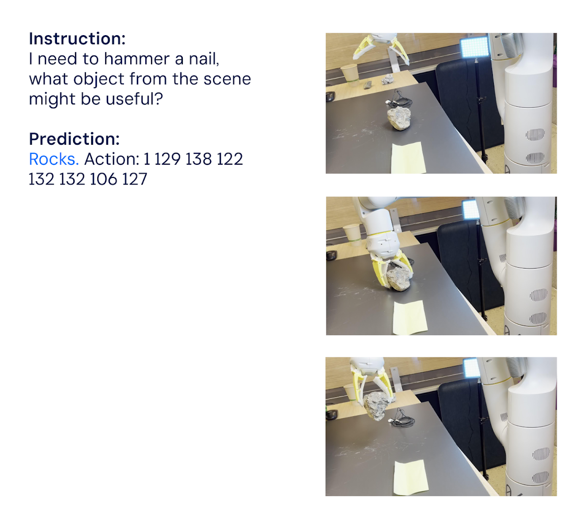{ loading=lazy }
  <figcaption markdown="1"><b>Figure 1.11 :</b> RT-2 de DeepMind peut à la fois planifier des séquences de compétences à long terme et prédire des actions robotiques en s'inspirant des techniques de prompting des LLM (chaîne de pensée). ([Brohan et al., 2023](https://arxiv.org/abs/2307.15818))</figcaption>
</figure>

## 1.1.5 Jouer à des Jeux {: #05}

**IA et jeux de plateau.** L'IA a réalisé des progrès continus dans le domaine des jeux depuis des décennies. Des premières victoires aux échecs en 1997, à Scrabble en 2006, jusqu'à AlphaGo de DeepMind en 2016 ([DeepMind, 2016](https://www.deepmind.com/research/highlighted-research/alphago)), qui a réussi l'exploit de battre le champion du monde au jeu de Go, considéré comme un défi insurmontable pour l'intelligence artificielle. En moins d'un an, le modèle suivant, AlphaGo Zero, entraîné par apprentissage par auto-simulation, avait maîtrisé plusieurs jeux de Go, d'échecs et de shogi, atteignant un niveau surhumain en moins de trois jours d'entraînement. ([Silver et al., 2017](https://arxiv.org/abs/1712.01815))

**IA et jeux vidéo.** Nous avons commencé à utiliser des techniques d'apprentissage automatique sur des jeux Atari simples en 2013 ([Mnih et al. 2013](https://arxiv.org/abs/1312.5602)). En 2019, OpenAI Five a battu les champions du monde de DOTA2 ([OpenAI, 2019](https://openai.com/research/openai-five-defeats-dota-2-world-champions)), tandis que la même année, AlphaStar de DeepMind a vaincu des joueurs professionnels de jeux électroniques compétitifs sur StarCraft II ([DeepMind, 2019](https://deepmind.google/discover/blog/alphastar-mastering-the-real-time-strategy-game-starcraft-ii/)). Ces deux jeux nécessitent des milliers d'actions à la suite à un nombre élevé d'actions par minute. En 2020, le modèle MuZero de DeepMind, décrit comme "*une avancée significative dans la recherche d'algorithmes polyvalents*" ([DeepMind, 2020](https://www.deepmind.com/blog/muzero-mastering-go-chess-shogi-and-atari-without-rules)), était capable de jouer à des jeux Atari, Go, échecs et shogi sans même connaître les règles.

Ces dernières années, les capacités de l'IA se sont étendues à des environnements ouverts comme Minecraft, démontrant une capacité à réaliser des séquences d'actions complexes. Dans les jeux de stratégie, Cicero de Meta a fait preuve de compétences sophistiquées de négociation stratégique et de tromperie en langage naturel dans le jeu Diplomacy ([Bakhtin et al., 2022](https://arxiv.org/abs/2210.05492)).

<figure markdown="span">
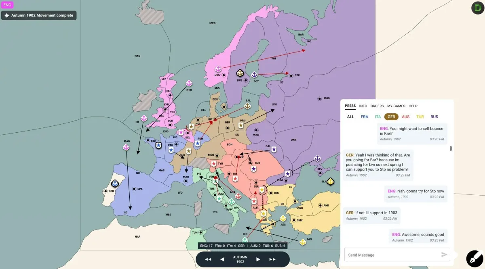{ loading=lazy }
  <figcaption markdown="1"><b>Figure 1.12 :</b> Une carte de Diplomacy et la boîte de dialogue où l'IA négocie. ([DiploStrats (YouTube), 2022](https://www.youtube.com/watch?v=u5192bvUS7k&t=2216s))</figcaption>
</figure>

??? note "Exemple de Voyager : Planification et Apprentissage Continu dans Minecraft avec GPT-4"

Voyager ([Wang et al., 2023](https://arxiv.org/abs/2305.16291)) représente un exemple particulièrement remarquable des capacités de l'IA dans les environnements d'apprentissage continu. Cette IA est conçue pour jouer à Minecraft, une tâche qui requiert une planification complexe et un apprentissage adaptatif poussé. Ce qui distingue Voyager est sa capacité à apprendre de manière continue et progressive dans l'environnement du jeu, en exploitant les capacités de raisonnement contextuel de GPT-4 pour planifier et générer le code nécessaire à chaque nouveau défi. Partant de zéro dans une session unique, Voyager apprend initialement à naviguer dans le monde virtuel, à affronter et vaincre des ennemis, tout en mémorisant ces compétences dans sa mémoire à long terme. Au fil du jeu, il continue d'acquérir et de stocker de nouvelles compétences, jusqu'à relever le défi complexe de l'extraction de diamants - une activité qui exige une compréhension approfondie des mécanismes du jeu et une stratégie élaborée. La capacité de Voyager à intégrer continuellement de nouvelles informations et à les exploiter efficacement illustre le potentiel de l'IA dans la gestion d'environnements dynamiques et complexes, ainsi que dans l'exécution de tâches nécessitant une accumulation progressive de connaissances et de compétences.

<figure markdown="span">
    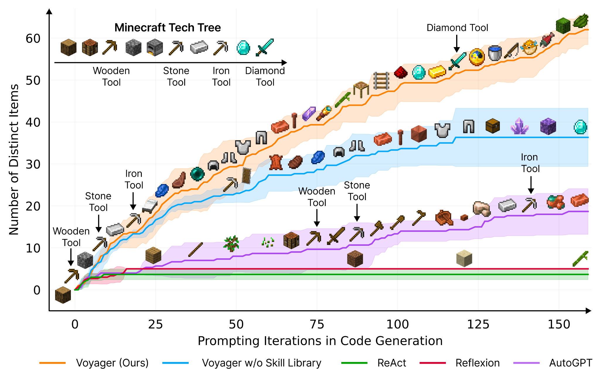{ loading=lazy }
      <figcaption markdown="1"><b>Figure 1.13 :</b> Voyager découvre continuellement de nouveaux objets et compétences dans Minecraft par une exploration autonome, surpassant significativement les modèles de référence. ([Wang et al., 2023](https://arxiv.org/abs/2305.16291))</figcaption>
    </figure>