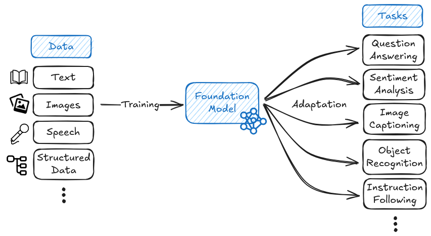
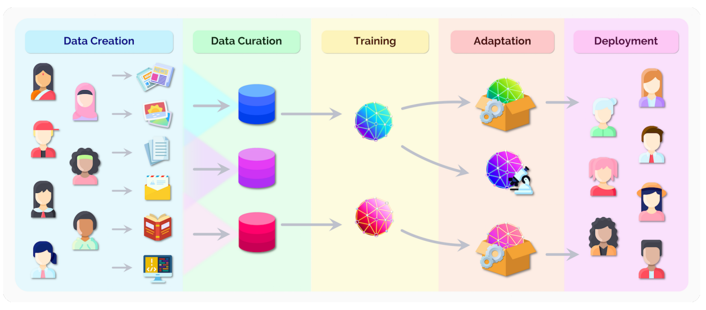
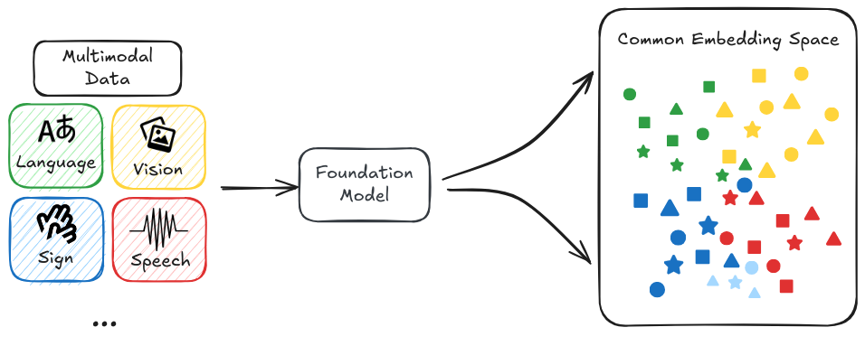
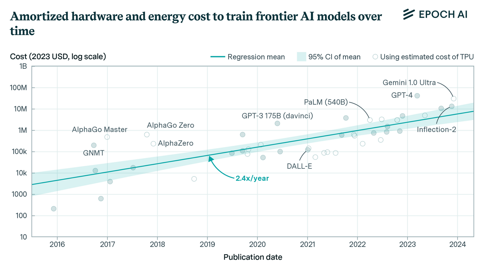

# 1.2 Modèles de Fondation

**Que sont les modèles de fondation ?** Les modèles de fondation marquent une transformation profonde dans la manière de développer l'IA. Plutôt que de concevoir des modèles spécialisés pour de multiples tâches spécifiques, nous pouvons désormais entraîner des modèles à grande échelle qui servent de "socle" à de nombreuses applications différentes. Ces modèles sont ensuite adaptés par un processus de fine-tuning pour réaliser des tâches précises. Imaginez cela comme la construction de divers bâtiments à partir d'une même structure de base ([Bommasani et al., 2022](https://arxiv.org/abs/2108.07258)). Nous pouvons ériger des banques, des restaurants ou des habitations, mais la fondation demeure essentiellement identique. Ce n'est qu'une définition rapide et intuitive. Nous approfondirons les détails dans les prochaines sous-sections consacrées à la formation, aux propriétés et aux risques.

<figure class="video-figure" markdown="span">
<iframe style="width: 100%; aspect-ratio: 16 / 9;" frameborder="0" allowfullscreen src="https://www.youtube.com/embed/kK3NmQT241w"></iframe>
  <figcaption markdown="1"><b>Vidéo 1.2 :</b> Vidéo optionnelle pour comprendre les modèles de fondation.</figcaption>
</figure>

**Pourquoi le paradigme des modèles de fondation est-il émergé ?** L'approche traditionnelle d'entraînement de modèles d'IA spécialisés pour chaque tâche s'est révélée souvent inefficace et restrictive. Les progrès se trouvaient entravés par la nécessité de données manuellement étiquetées et l'impossibilité de transférer efficacement les connaissances entre différentes tâches. Les modèles de fondation ont surmonté ces limitations grâce à l'apprentissage auto-supervisé appliqué à des ensembles de données massifs non étiquetés. Cette percée résulte de plusieurs avancées : des progrès matériels avec les GPU, de nouvelles architectures d'apprentissage automatique comme les transformateurs, et un accès élargi à d'immenses volumes de données en ligne ([Kaplan et al., 2020](https://arxiv.org/abs/2001.08361)) constituent quelques-unes des raisons les plus significatives de cette mutation.

**Quels sont des exemples de modèles de fondation ?** Dans le traitement du langage, des modèles comme GPT-4 et Claude sont des exemples de modèles de fondation. Ces deux modèles ont démontré la capacité de générer du langage humain, de tenir des conversations complexes et d'effectuer des tâches simples de raisonnement ([OpenAI, 2023](https://arxiv.org/abs/2303.08774)). Des exemples en vision par ordinateur incluent des modèles comme DALL-E 3 et Stable Diffusion. ([Betker et al., 2023](https://cdn.openai.com/papers/dall-e-3.pdf)) Ce sont des exemples spécifiques à un domaine, mais nous observons aussi une tendance vers des modèles de fondation multimodaux (LMMs, de l'anglais *Large Multimodal Models*). Cela comprend des systèmes comme GPT-4V et Gemini qui peuvent travailler sur différents types de données - traiter et générer du texte, des images, du code, de l'audio et probablement plus à l'avenir ([Google, 2023](https://arxiv.org/abs/2312.11805)). Même en apprentissage par renforcement, où les modèles étaient traditionnellement entraînés pour des tâches spécifiques, nous voyons des modèles de fondation comme Gato démontrer la capacité d'apprendre des comportements à usage général qui peuvent être adaptés à diverses tâches en aval. ([Reed et al., 2022](https://arxiv.org/abs/2205.06175))

<figure class="iframe-figure" markdown="span">
<iframe src="https://ourworldindata.org/grapher/number-of-large-scale-ai-systems-released-per-year?tab=chart" loading="lazy" style="width: 100%; height: 600px; border: 0px none;" allow="web-share; clipboard-write"></iframe>
  <figcaption markdown="1"><b>Figure interactive 1.6 :</b> Le nombre de modèles de fondation augmente chaque année. ([Giattino et al., 2023](https://ourworldindata.org/artificial-intelligence))</figcaption>
</figure>

**Qu'est-ce qui rend les modèles de fondation importants pour la sécurité de l'IA ?** La raison pour laquelle nous commençons ce livre en parlant des modèles de fondation est qu'ils marquent une transition vers des systèmes à usage général, plutôt que des systèmes étroitement spécialisés. Ce changement de paradigme introduit de nombreux nouveaux risques qui n'existaient pas auparavant. Ceux-ci incluent des risques de mauvaise utilisation liés à la centralisation, l'homogénéisation et les capacités à double usage, pour n'en citer que quelques-uns. La capacité des modèles de fondation à apprendre des compétences larges et transférables a également conduit à l'émergence de comportements de plus en plus sophistiqués à partir d'objectifs d'entraînement relativement simples ([Wei et al., 2022](https://arxiv.org/abs/2206.07682)). Les capacités complexes, combinées à la généralité et à l'échelle, signifient que nous devons sérieusement envisager les risques de sécurité au-delà du simple risque de mauvaise utilisation qui semblait auparavant théorique ou distant. Au-delà du risque de mauvaise utilisation, des problèmes comme le désalignement deviennent une préoccupation croissante à mesure que ces modèles de fondation exhibent de nouvelles capacités. Nous consacrons un chapitre entier à la discussion de ces risques. Mais nous vous donnerons également un petit aperçu des types de risques possibles dans les prochaines sous-sections, car cela mérite une certaine répétition.

<figure class="iframe-figure" markdown="span">
<iframe src="https://ourworldindata.org/grapher/cumulative-number-of-large-scale-ai-models-by-domain?tab=chart" loading="lazy" style="width: 100%; height: 600px; border: 0px none;" allow="web-share; clipboard-write"></iframe>
  <figcaption markdown="1"><b>Figure interactive 1.7 :</b> Nombre de modèles à grande échelle (par domaine) ([Giattino et al., 2023](https://ourworldindata.org/artificial-intelligence))</figcaption>
</figure>

**Quelle est la différence entre les modèles de fondation et les modèles de pointe ?** Les modèles de pointe représentent l'avant-garde des capacités de l'IA - ce sont les modèles les plus avancés dans leurs domaines respectifs. Bien que de nombreux modèles de pointe soient également des modèles de fondation (comme Claude 3.5 Sonnet), ce n'est pas systématiquement le cas. Par exemple, AlphaFold, bien qu'étant un modèle de pointe dans la prédiction de la structure protéique, n'est pas typiquement considéré comme un modèle de fondation car il est spécialisé pour une tâche unique plutôt que de servir de socle générique pour plusieurs applications ([Jumper et al., 2021](https://pubmed.ncbi.nlm.nih.gov/34265844/)). Cette distinction mérite d'être soulignée, car la plupart des recherches sur la sécurité de l'IA et les cadres réglementaires se concentrent sur les modèles de pointe en raison de leurs capacités avancées. Lorsque les discussions sur la sécurité de l'IA évoquent les "modèles de fondation", elles font généralement référence spécifiquement aux modèles de fondation de pointe - ces modèles de fondation qui représentent également l'état actuel des capacités. Comprendre cette distinction nous aide à mieux cibler et mettre en œuvre des mesures de sécurité là où elles sont les plus critiques.

## 1.2.1 Formation

**Comment les modèles de fondation sont-ils entraînés différemment des systèmes d'IA traditionnels ?** Une innovation clé des modèles de fondation réside dans leur paradigme d'entraînement. Généralement, ces modèles suivent un processus d'apprentissage en deux étapes. Premièrement, ils passent par une phase de préentraînement, puis sont adaptés au moyen de mécanismes comme le fine-tuning (ajustement fin) ou l'échafaudage pour réaliser des tâches spécifiques. Plutôt que d'apprendre à partir d'exemples étiquetés manuellement pour des tâches précises, ces modèles apprennent en détectant des motifs dans d'immenses volumes de données non étiquetées. Ce basculement vers l'apprentissage auto-supervisé sur des ensembles de données massifs transforme fondamentalement non seulement la manière dont les modèles apprennent, mais aussi les types de capacités et de risques susceptibles d'émerger ([Bommasani et al., 2022](https://arxiv.org/abs/2108.07258)). Du point de vue de la sécurité, cela implique de comprendre en profondeur tant les mécanismes de ces méthodes d'entraînement que les voies potentielles menant à des comportements imprévus.

<figure markdown="span">
{ loading=lazy }
  <figcaption markdown="1"><b>Figure 1.14 :</b> Sur les opportunités et les risques des modèles de fondation ([Bommasani et al., 2022](https://arxiv.org/abs/2108.07258))</figcaption>
</figure>

**Qu'est-ce que le préentraînement ?** Le préentraînement est la phase initiale où le modèle apprend des motifs et des connaissances généraux à partir de jeux de données massifs comprenant des millions ou des milliards d'exemples. Durant cette phase, le modèle n'est pas entraîné pour une tâche spécifique - plutôt, il développe des capacités larges qui pourront ensuite être spécialisées. Cette généralité est à la fois puissante et préoccupante du point de vue de la sécurité. Bien qu'elle permette au modèle de s'adapter à de nombreuses tâches différentes, cela signifie également que nous ne pouvons pas facilement prédire ou contraindre ce que le modèle pourrait apprendre à faire ([Hendrycks et al., 2022](https://arxiv.org/abs/2109.13916)).

<figure markdown="span">
{ loading=lazy }
  <figcaption markdown="1"><b>Figure 1.15 :</b> Sur les opportunités et les risques des modèles de fondation ([Bommasani et al., 2022](https://arxiv.org/abs/2108.07258))</figcaption>
</figure>

**Comment l'apprentissage auto-supervisé permet-il le préentraînement ?** L'apprentissage auto-supervisé (SSL, de l'anglais *Self-Supervised Learning*) est l'innovation technique majeure qui rend possible les modèles de fondation. C'est ainsi que nous implémentons concrètement la phase de préentraînement. Contrairement à l'apprentissage supervisé traditionnel, qui nécessite des données étiquetées manuellement, le SSL exploite la structure intrinsèque des données pour créer des signaux d'entraînement. Par exemple, au lieu d'étiqueter manuellement des images, nous pourrions simplement masquer une partie d'une image complète et demander à un modèle de prédire ce qui devrait se trouver à cet endroit. Il pourrait ainsi prédire la moitié inférieure d'une image à partir de sa moitié supérieure, apprenant quels objets apparaissent souvent ensemble. Par exemple, il pourrait apprendre que les images avec des arbres et de l'herbe en haut comportent souvent plus d'herbe, ou peut-être un chemin, en bas. Il apprend sur les objets et leur contexte - les arbres et l'herbe apparaissent souvent dans les parcs, les chiens s'y trouvent fréquemment, les chemins sont généralement horizontaux, et ainsi de suite. Ces représentations apprises peuvent ensuite être utilisées pour une grande variété de tâches pour lesquelles le modèle n'a pas été explicitement entraîné, comme identifier des chiens dans des images ou reconnaître des parcs - et ce, sans aucune étiquette fournie par un humain ! Le même concept s'applique au langage, où un modèle pourrait prédire le mot suivant dans une phrase, comme "Le chat était assis sur le… ", en apprenant la grammaire, la syntaxe et le contexte en répétant ce processus sur d'immenses quantités de texte.

**Qu'est-ce que le fine-tuning ?** Après le préentraînement, les modèles de fondation peuvent être adaptés selon deux approches principales : l'ajustement fin (fine-tuning) et le prompting. L'ajustement fin implique un entraînement supplémentaire sur une tâche ou un jeu de données spécifique pour spécialiser les capacités du modèle. Par exemple, nous pourrions utiliser l'apprentissage par renforcement à partir de retours humains ([RLHF], de l'anglais *Reinforcement Learning from Human Feedback*) pour rendre les modèles de langage plus performants dans le suivi des instructions ou dans leur utilité. Le prompting, d'autre part, consiste à fournir au modèle des entrées soigneusement conçues qui l'orientent vers les comportements désirés sans entraînement supplémentaire. Nous discuterons de ces méthodes d'adaptation plus en détail dans le Chapitre 8 lorsque nous explorerons la supervision évolutive.

**Pourquoi ce processus d'entraînement est-il crucial pour la sécurité de l'IA ?** Le processus d'entraînement des modèles de fondation soulève plusieurs défis singuliers en matière de sécurité. Premièrement, la nature auto-supervisée du préentraînement implique un contrôle limité sur les apprentissages du modèle - celui-ci pourrait potentiellement développer des capacités ou des comportements non intentionnels. Deuxièmement, le processus d'adaptation doit impérativement préserver les propriétés de sécurité établies lors du préentraînement. Enfin, l'échelle massive des données d'entraînement et des ressources computationnelles rend particulièrement ardue la compréhension exhaustive de ce que le modèle a réellement appris. Nombre des enjeux de sécurité que nous aborderons dans cet ouvrage - de la mauvaise généralisation des objectifs à la supervision évolutive - sont intrinsèquement liés aux modalités d'entraînement et d'adaptation de ces modèles.

## 1.2.2 Propriétés

**Pourquoi devons-nous comprendre les propriétés intrinsèques des modèles de fondation ?** Au-delà de la compréhension du processus d'entraînement, nous devons également appréhender les propriétés fondamentales et les capacités de ces modèles. Ces propriétés déterminent souvent les potentialités et les risques inhérents à ces systèmes. Elles permettent d'expliquer pourquoi les modèles de fondation représentent des défis de sécurité singuliers par rapport aux systèmes d'IA traditionnels. Leur aptitude à transmettre des connaissances, à généraliser à travers divers domaines et à développer des capacités émergentes implique que nous ne pouvons plus nous appuyer sur des approches de sécurité conventionnelles, qui présupposaient un comportement étroit et prévisible.

**Qu'est-ce que l'apprentissage par transfert ?** L'apprentissage par transfert est l'une des propriétés les plus fondamentales des modèles de fondation - leur capacité à transférer les connaissances acquises pendant le préentraînement à de nouvelles tâches et de nouveaux domaines. Plutôt que de recommencer à zéro pour chaque tâche, nous pouvons exploiter les connaissances générales que ces modèles ont déjà acquises ([Bommasani et al., 2022](https://arxiv.org/abs/2108.07258)). Cette propriété permet une adaptation et un déploiement rapides, mais implique également que les capacités et les risques de sécurité puissent surgir de façon imprévue. Par exemple, un modèle pourrait transmettre non seulement des connaissances utiles, mais aussi des biais préjudiciables ou des comportements indésirables à de nouvelles applications.

**Que sont l'apprentissage zero-shot et few-shot ?** La capacité de réaliser de nouvelles tâches avec très peu d'exemples, voire aucun exemple. Par exemple, GPT-4 peut résoudre des problèmes de raisonnement inédits simplement à partir d'une description en langage naturel de la tâche ([OpenAI, 2023](https://arxiv.org/abs/2303.08774)). Cette capacité émergente de généralisation à de nouvelles situations est puissante mais préoccupante du point de vue de la sécurité. Si les modèles peuvent s'adapter à des situations inédites de manière imprévue, il devient plus difficile de prédire et de contrôler leur comportement lors du déploiement.

**Qu'en est-il de la généralité ?** La généralisation dans les modèles de fondation diffère fondamentalement des systèmes d'IA traditionnels. Au lieu de se cantonner à la généralisation au sein d'un domaine restreint, ces modèles sont capables de généraliser leurs capacités à travers différents domaines de manière déconcertante. Toutefois, cette généralisation des capacités survient fréquemment sans une généralisation équivalente des objectifs ou des contraintes - une préoccupation critique en matière de sécurité que nous approfondirons dans notre chapitre consacré à la dérive des objectifs. À titre d'exemple, un modèle pourrait étendre sa capacité de manipulation textuelle de façon imprévue, sans pour autant maintenir les garde-fous de sécurité initialement prévus ([Hendrycks et al., 2022](https://arxiv.org/abs/2109.13916)).

<figure markdown="span">
{ loading=lazy }
  <figcaption markdown="1"><b>Figure 1.16 :</b> Sur les opportunités et les risques des modèles de fondation ([Bommasani et al., 2022](https://arxiv.org/abs/2108.07258))</figcaption>
</figure>

**Pourquoi la multi-modalité ?** Les modèles de fondation peuvent désormais traiter simultanément plusieurs types de données (texte, images, audio, vidéo). Il ne s'agit pas simplement de gérer différents formats, mais de créer des interactions complexes entre modalités de manière véritablement sophistiquée ([Google, 2023](https://arxiv.org/abs/2312.11805)). D'un point de vue sécuritaire, cette multi-modalité introduit des défis critiques : elle élargit considérablement les possibilités d'interaction et d'influence des modèles sur le monde, ouvrant la voie à des propagations de défaillances potentiellement inattendues entre différentes modalités.

!!! quote "Sam Altman (PDG d'OpenAI) ([Cronshaw, 2024](https://www.linkedin.com/pulse/altman-multimodality-important-david-cronshaw-5fz0c))"

La multi-modalité sera sans aucun doute importante. Entrée vocale, sortie vocale, images, et à terme vidéo. De toute évidence, les gens le désirent véritablement. La personnalisation et l'adaptabilité seront également très importantes.

## 1.2.3 Risques

**Qu'est-ce qui rend les modèles de fondation difficiles à contrôler ?** La difficulté de contrôler ces modèles découle de trois défis interconnectés. Premièrement, une fois entraînés, leurs représentations internes et leurs comportements sont extrêmement difficiles à modifier de manière ciblée. Contrairement aux logiciels traditionnels où l'on peut éditer directement des fonctions spécifiques, toute tentative de modifier un comportement dans un modèle de fondation risque d'engendrer des conséquences imprévues et potentiellement étendues à d'autres capacités. Deuxièmement, lorsque ces modèles sont déployés dans de multiples applications, maintenir le contrôle devient un problème complexe de systèmes distribués, où les défaillances de sécurité peuvent se propager en cascade à travers différents systèmes avant même d'être identifiées. Troisièmement, leur nature de boîte noire rend extrêmement difficile la compréhension des raisons sous-jacentes à leurs décisions spécifiques ou la prédiction de leur comportement potentiel dans des situations inédites - un défi que nous approfondirons dans notre chapitre sur l'interprétabilité.

**Comment les exigences en ressources limitent-elles le développement et l'accès ?** L'entraînement des modèles de fondation requiert des ressources computationnelles colossales, créant un équilibre précaire entre coût et accessibilité. Bien que l'adaptation d'un modèle existant puisse s'avérer relativement abordable, les coûts initiaux d'entraînement considérables risquent de concentrer le pouvoir entre les mains de quelques entités bien nanties. Cette centralisation soulève des questions cruciales relatives à la supervision et au développement responsable, que nous approfondirons dans notre chapitre sur la gouvernance. À titre d'exemple, une seule itération d'entraînement pour des modèles de l'envergure de GPT-4 peut atteindre des coûts de dizaines, voire de centaines de millions de dollars, limitant de facto les acteurs susceptibles de contribuer à leur développement. La poursuite de cette montée en puissance a également fait émerger de nombreuses inquiétudes concernant l'impact environnemental des itérations d'entraînement en intelligence artificielle ([Patterson et al., 2023](https://arxiv.org/abs/2104.10350)).

<figure markdown="span">
{ loading=lazy }
  <figcaption markdown="1"><b>Figure 1.17 :</b> L'augmentation des coûts de formation des modèles d'IA de pointe ([Cottier et al., 2024](https://arxiv.org/abs/2405.21015))</figcaption>
</figure>

**Quels risques découlent de l'homogénéisation ?** L'homogénéisation survient lorsque de multiples systèmes d'IA sont dérivés des mêmes modèles de fondation. Ce phénomène génère un risque systémique majeur : si un modèle de fondation présente des biais intrinsèques ou des modes de défaillance, ces derniers risquent de se propager à l'ensemble des modèles qui en sont dérivés ([Bommasani et al., 2022](https://arxiv.org/abs/2108.07258)). À titre d'illustration, un modèle de fondation largement utilisé qui aurait intégré des biais préjudiciables ou des comportements non sécurisés pourrait les reproduire dans diverses applications, depuis la génération de contenu jusqu'à la prise de décision automatisée. De surcroît, ces modèles présentent des points de coupure de connaissances fixes, déterminés par leurs données d'entraînement, ce qui peut engendrer des problématiques de sécurité lors de leur déploiement dans des environnements en constante mutation. Le risque de défaillances corrélées devient particulièrement critique lorsque ces modèles de fondation sont intégrés dans des systèmes sensibles ([Hendrycks et al., 2022](https://arxiv.org/abs/2109.13916)).

**Qu'est-ce que l'émergence et pourquoi est-elle importante ?** Les modèles de fondation peuvent efficacement exploiter les augmentations de données, de calcul et de taille de modèle pour améliorer leurs capacités. Les modèles deviennent qualitativement différents lors de leur montée en échelle, développant souvent de nouvelles capacités totalement absentes dans leurs versions plus petites ([Kaplan et al., 2020](https://arxiv.org/abs/2001.08361)). Cette propriété, appelée émergence, désigne le développement de capacités qui n'ont pas été explicitement entraînées. Ce phénomène présente à la fois des opportunités prometteuses et des risques potentiels qu'il convient d'examiner attentivement.

Nous pourrions être confrontés à de nouveaux comportements et risques inattendus, absents des modèles précédents. Cette émergence se produit par paliers lors de la montée en échelle des modèles, rendant difficile la prédiction des capacités susceptibles d'apparaître soudainement. Il devient dès lors tout aussi complexe d'anticiper l'émergence et la nature des risques potentiels. Lorsque ce phénomène se combine à l'homogénéisation, l'imprévisibilité devient particulièrement critique : un unique modèle de fondation intégré dans plusieurs systèmes sensibles pourrait provoquer des défaillances en cascade, contournant potentiellement plusieurs mécanismes de sécurité et systèmes de sauvegarde ([Hendrycks et al., 2022](https://arxiv.org/abs/2109.13916)). Ce constat souligne impérativement la nécessité d'une approche proactive de la sécurité des systèmes d'IA : il est crucial de déployer des mesures de sécurité anticipées avant même le développement et l'entraînement de modèles plus ambitieux.

Comment ces limitations orientent-elles notre approche de la sécurité ? Nous venons de survoler brièvement quelques-uns des risques de cette sous-section pour vous donner une intuition de base sur l'importance de travailler sur la sécurité de l'IA. Le chapitre suivant sera entièrement consacré à une analyse approfondie des différents risques posés par les modèles d'IA, et à la façon dont ils pourraient émerger.