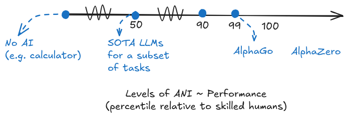
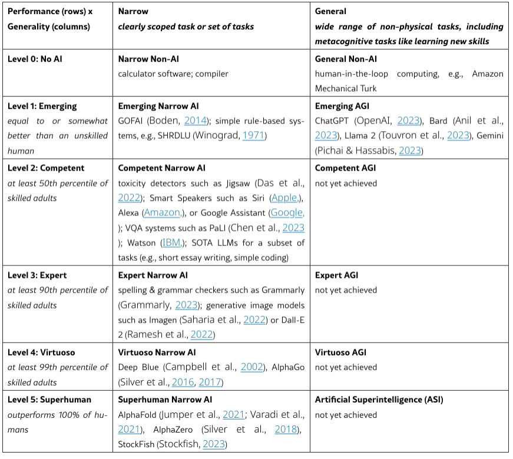
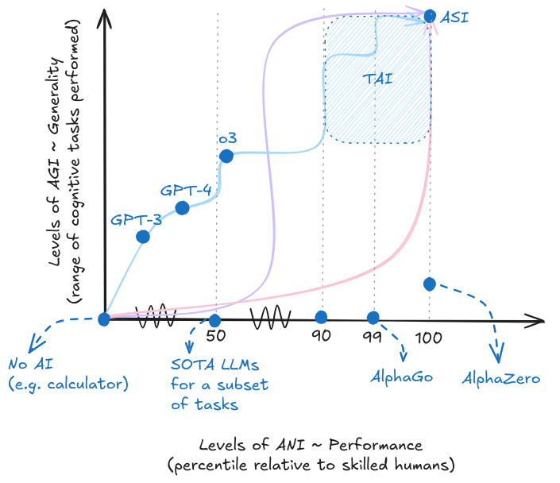

# 1.3 Intelligence

    

        
            <i class="fas fa-clock"></i>
        
        

            
Temps de lecture

            
13 min

        

    

## 1.3.1 Études de cas {: #01}

!!! warning "La majeure partie de cette sous-section traitera de la théorie et des aspects historiques de la définition de l'intelligence. Si vous êtes plus intéressé par les aspects pratiques essentiels de la façon dont nous mesurons l'intelligence artificielle générale (IAG), vous pouvez sans risque passer à la sous-section suivante - mesure."

**Pourquoi avons-nous besoin de définir l'intelligence ?** Dans notre section précédente sur les modèles fondamentaux, nous avons exploré comment les systèmes d'IA modernes deviennent de plus en plus puissants. Mais avant de pouvoir discuter de manière significative des risques et des implications en matière de sécurité de ces systèmes, nous devons nous mettre d'accord sur ce que nous entendons par IAG. Certains estiment que des "étincelles" d'IAG sont déjà présentes dans les derniers modèles de langage ([Bubeck et al., 2023](https://arxiv.org/abs/2303.12712)), tandis que d'autres prédisent une IA au niveau humain dans une décennie ([Bengio et al., 2024](https://arxiv.org/abs/2310.17688)). Sans définition claire, comment pourrions-nous évaluer de telles affirmations ou planifier des mesures de sécurité appropriées ?

L'idée fondamentale est que si l'on ne peut pas définir un concept, on ne peut pas le mesurer. Sans mesure, il devient impossible de suivre les progrès de manière fiable ou d'identifier les risques potentiels. Prenez un exemple en physique - dire qu'un objet a parcouru 5 unités n'a aucun sens sans spécifier l'unité de mesure. A-t-il parcouru 5 mètres, 5 pieds ou 5 coudées royales ? Nul ne le sait. Si nous ignorons sa distance ou sa vitesse, comment pourrait-on faire respecter des limitations de vitesse ? Impossible. Le même principe s'applique à l'intelligence, ainsi qu'aux risques et techniques de sécurité qui en découlent. De la même manière que la physique a eu besoin d'unités standardisées comme les mètres et les watts pour dépasser les descriptions qualitatives, la recherche en sécurité de l'IA nécessite des définitions rigoureuses pour aller au-delà des analogies vagues et de l'anthropomorphisme.

**Qu'est-ce qui rend la définition de l'intelligence si complexe ?** Bien que chacun reconnaisse la nécessité d'une définition pour mesurer les progrès et élaborer des mesures de sécurité, pourquoi n'existe-t-il pas de définition consensuelle ? La difficulté réside dans le fait que le terme « intelligence » recouvre un ensemble de capacités interconnectées - allant de la résolution de problèmes et de l'apprentissage à l'adaptation et au raisonnement abstrait. Qui plus est, chaque discipline académique aborde l'intelligence selon des perspectives distinctes. Les psychologues privilégient les compétences cognitives mesurables, les informaticiens se concentrent sur la performance des tâches, tandis que les philosophes s'interrogent sur des qualités plus subtiles, comme le rapport entre intelligence, conscience et auto-conscience. Dès lors, quelle approche sera la plus pertinente pour comprendre et anticiper la sécurité de l'IA ?

**Étude de cas : Approche fondée sur l'imitation.** Le test de Turing (ou jeu de l'imitation) suggérait que l'intelligence pouvait être mesurée à travers la capacité d'une machine à imiter une conversation humaine ([Turing, 1950](https://academic.oup.com/mind/article/LIX/236/433/986238?login=false)). Cependant, cette approche behavioriste s'est révélée inadéquate - les modèles de langage modernes peuvent souvent passer des tests de type Turing tout en manquant de capacités fondamentales de raisonnement ([Rapaport, 2020](https://sciendo.com/issue/JAGI/11/2)). C'était essentiellement une expérience de pensée philosophique, conçue davantage comme une réflexion conceptuelle que comme une mesure concrète et opérationnalisable de l'intelligence.

**Étude de cas : Approches de l'intelligence fondées sur la conscience.** Une perspective initiale se concentrait sur les machines capables de véritablement comprendre et d'exhiber des états cognitifs analogues à ceux des humains ([Searle, 1980](https://psycnet.apa.org/record/1981-27235-001)). Cependant, cette définition s'avère problématique à plusieurs égards. Premièrement, la conscience demeure mal comprise et difficile à mesurer. Deuxièmement, nous ne sommes pas certains que l'intelligence et la conscience soient nécessairement corrélées - un système pourrait potentiellement être hautement intelligent sans être conscient, ou conscient sans être particulièrement intelligent. Un système n'a pas besoin d'être conscient pour causer du préjudice. Que le système d'IA soit conscient ou non n'a aucune incidence sur sa capacité à prendre des décisions à fort impact ou à entreprendre des actions potentiellement dangereuses.

**Étude de cas : Approches de l'intelligence basées sur l'analogie cérébrale.** Une autre approche initiale définissait l'IAG en termes de systèmes rivalisant ou dépassant le cerveau humain en complexité et en vitesse. Cette définition centrée sur le cerveau est problématique pour plusieurs raisons. Bien que notre cerveau puisse être le seul exemple d'intelligence générale dont nous disposons, l'IA moderne a démontré qu'il n'est pas nécessaire de reproduire l'architecture neuronale humaine pour obtenir un comportement intelligent. Du point de vue de la sécurité, se concentrer sur une architecture cérébrale nous renseigne peu sur les risques potentiels qu'un système pourrait représenter - un système pourrait être structurellement très différent du cerveau tout en étant capable de réaliser des actions dangereuses.

**Étude de cas : Approches de l'intelligence basées sur le processus et l'adaptabilité.** La perspective basée sur le processus considère l'intelligence comme l'efficacité de l'apprentissage et de l'adaptation, plutôt que comme un ensemble de capacités accumulées. Quelques chercheurs adoptent cette vision. Selon cette perspective, l'intelligence est « *la capacité d'un système à s'adapter à son environnement malgré des connaissances et des ressources limitées* » ([Wang, 2020](https://sciendo.com/issue/JAGI/11/2)). Alternativement, elle est décrite comme « *l'aptitude avec laquelle un système peut transformer l'expérience et les connaissances préalables en compétences* » ([Chollet, 2019](https://arxiv.org/abs/1911.01547)). Bien que ce focus sur le méta-apprentissage et l'adaptation capture un aspect fondamental de l'intelligence, d'un point de vue sécuritaire, ce qui compte ultimement est ce que ces systèmes peuvent concrètement accomplir - leurs capacités effectives - plutôt que la manière dont ils les développent. Ce qui nous conduit à considérer l'approche suivante.

**Étude de cas 5 : L'approche par les capacités de l'intelligence**. La question directrice de cette perspective est la suivante - Si un système d'IA peut exécuter des tâches dangereuses à un niveau humain ou au-delà, importe-t-il vraiment qu'il y soit parvenu par des processus d'apprentissage sophistiqués, une mémorisation efficace, avec ou sans conscience ? Si un système d'IA possède des capacités qui pourraient présenter des risques - comme une planification sophistiquée, de la manipulation ou de la tromperie - ces risques existent indépendamment du fait que le système ait acquis ces capacités par une "vraie intelligence", une "compréhension réelle" ou une correspondance de motifs sophistiquée. L'approche par les capacités tranche les débats philosophiques en posant des questions concrètes : Que peut réellement faire le système ? Jusqu'à quel point peut-il le faire ? Quelle gamme de tâches peut-il traiter ? Ce cadre fournit des normes claires pour mesurer les progrès et, de manière cruciale pour le travail sur la sécurité, des moyens clairs d'identifier les risques potentiels. La majorité des laboratoires d'IA utilisent cette approche axée sur les capacités pour définir leurs objectifs d'IAG. Par exemple, l'IAG a été définie comme des "*systèmes hautement autonomes qui surpassent les humains dans la plupart des travaux économiquement valorisables*" ([OpenAI, 2014](https://openai.com/charter/)). Les considérations de sécurité sont formulées de manière similaire en déclarant que la mission est de s'assurer que "*l'IA transformatrice aide les personnes et la société*" ([Anthropic, 2024](https://www.anthropic.com/company)).

!!! quote "Capacités vs Intelligence ([Krakovna, 2023](https://www.alignmentforum.org/posts/JtuTQgp9Wnd6R6F5s/when-discussing-ai-risks-talk-about-capabilities-not))"

Lorsqu'on aborde les risques de l'IA, il convient de parler de capacités, et non d'intelligence... Les gens ont souvent des définitions divergentes de l'intelligence, l'associent à des concepts comme la conscience qui ne sont pas pertinents pour les risques de l'IA, ou écartent ces risques au motif que l'intelligence n'est pas clairement définie.

    Lorsqu'on aborde les risques de l'IA, il convient de parler de capacités, et non d'intelligence... Les gens ont souvent des définitions divergentes de l'intelligence, l'associent à des concepts comme la conscience qui ne sont pas pertinents pour les risques de l'IA, ou écartent ces risques au motif que l'intelligence n'est pas clairement définie.

Compte tenu de ces considérations, pour la grande majorité de cet ouvrage, notre attention principale restera centrée sur le cadre pratique des capacités pour l'évaluation et l'analyse de sécurité. Cette approche axée sur les capacités est la plus pertinente pour les travaux immédiats de sécurité, la régulation et les décisions de déploiement. Nous reconnaissons que la recherche sur la conscience, la sentience, les considérations éthiques entourant les esprits numériques et la nature fondamentale de l'intelligence continue d'être précieuse, mais est moins opérationnelle pour les travaux de sécurité immédiats.

Dans notre prochaine sous-section, nous allons explorer comment nous pouvons définir et mesurer concrètement les capacités dans ce cadre. Nous verrons comment le fait de dépasser les seuils binaires simples de l'IA « étroite » versus « générale » nous aide à mieux comprendre la progression des capacités de l'IA et les risques qui y sont associés.

## 1.3.2 Mesurer {: #02}

!!! quote "Lord Kelvin ([Oxford Reference, 2016](https://www.oxfordreference.com/display/10.1093/acref/9780191826719.001.0001/q-oro-ed4-00006236))"

Quand nous ne pouvons pas mesurer quelque chose, quand nous ne pouvons pas l'exprimer en nombres, notre connaissance est de nature médiocre et insuffisante.

Lorsque vous pouvez mesurer ce dont vous parlez et l'exprimer en nombres, vous en savez quelque chose. En revanche, si vous ne pouvez pas le quantifier, votre connaissance reste médiocre et insatisfaisante : c'est peut-être l'amorce d'une compréhension, mais vos réflexions n'ont pas encore atteint le stade scientifique.

Lorsque vous pouvez mesurer ce dont vous parlez et l'exprimer en nombres, vous en savez quelque chose ; lorsque vous ne pouvez pas l'exprimer en nombres, votre connaissance est d'une nature médiocre et insuffisante ; ce peut être le début de la connaissance, mais vous n'avez guère, dans vos pensées, progressé jusqu'au stade de la science.

**Pourquoi les définitions traditionnelles de l'IAG (Intelligence Artificielle Générale) présentent-elles des limites ?** Dans la section précédente, nous avons exploré comment les modèles fondamentaux deviennent de plus en plus puissants et polyvalents. Mais avant de pouvoir discuter de manière significative des risques et des implications en matière de sécurité, ou faire des prédictions sur les progrès futurs, nous avons besoin de moyens clairs pour mesurer et suivre les capacités de l'IA. Cette section introduit des cadres pour mesurer les progrès vers l'intelligence artificielle générale (IAG) et comprendre la relation entre les capacités, l'autonomie et le risque. Par exemple, la définition d'OpenAI de l'IAG comme des « *systèmes qui surpassent les humains dans la plupart des travaux économiquement précieux* » ([OpenAI, 2014](https://openai.com/charter/)), ou la définition communément utilisée « *L'intelligence mesure la capacité d'un agent à atteindre des objectifs dans un large éventail d'environnements* » ([Legg & Hutter, 2007](https://arxiv.org/abs/0706.3639)) et bien d'autres ne sont pas suffisamment spécifiques pour être opérationnalisables. Quels humains ? Quels objectifs ? Quelles tâches sont économiquement précieuses ? Qu'en est-il des systèmes qui dépassent les performances humaines sur certaines tâches mais seulement pendant de courtes durées ?

**Pourquoi avons-nous besoin de cadres de mesure plus performants ?** Historiquement, les discussions sur l'IAG se sont souvent appuyées sur des seuils binaires - les systèmes étaient catégorisés comme « étroits » ou « généraux », « faibles » ou « forts », « sous-humain » ou « équivalent humain ». Bien que ces distinctions aient initialement aidé à structurer les discussions sur l'IA, elles deviennent de plus en plus inadaptées à mesure que les systèmes d'IA gagnent en sophistication. De la même manière que nous avons contourné les débats stériles sur la « véritable intelligence » ou la « compréhension authentique » en privilégiant un cadre pratique axé sur les capacités, nous souhaitons éviter les discussions byzantines sur le niveau de performance par rapport aux humains. Il est bien plus pragmatique de pouvoir établir des constats précis, comme : le système surpasse 75 % des professionnels qualifiés sur 30 % des tâches cognitives.

<figure markdown="span">
{ loading=lazy }
  <figcaption markdown="1"><b>Figure 1.18 :</b> Il s'agit de la perspective continue de mesure des performances de l'IA. Tous les points sur cet axe peuvent être appelés ANI (à l'exception de l'origine).</figcaption>
</figure>

!!! info "Définition : Intelligence Artificielle Étroite (IAE) ([IBM, 2023](https://www.ibm.com/topics/artificial-intelligence))"

!!! info "Définition : Intelligence Artificielle Étroite (IAÉ, de l'anglais Artificial Narrow Intelligence) ([IBM, 2023](https://www.ibm.com/topics/artificial-intelligence))"

L'IA faible — également appelée IA étroite ou Intelligence Artificielle Étroite (IAÉ) — est une intelligence artificielle entraînée et spécialisée pour effectuer des tâches précises. L'IAÉ constitue le socle de la majorité des systèmes d'IA qui nous entourent aujourd'hui. Le terme « étroite » est en réalité plus approprié que « faible », car ce type d'IA est loin d'être limité ; elle permet des applications extrêmement performantes, telles que Siri d'Apple, Alexa d'Amazon, IBM Watson et les véhicules autonomes.

**Pourquoi les définitions traditionnelles de l'IAG (Intelligence Artificielle Générale) sont-elles insuffisantes ?** Dans la section précédente, nous avons exploré comment les modèles fondamentaux deviennent de plus en plus puissants et polyvalents. Mais avant de pouvoir discuter de manière significative des risques et des implications en matière de sécurité, ou de faire des prédictions sur les progrès futurs, nous avons besoin de moyens clairs pour mesurer et suivre les capacités de l'IA. Cette section présente des cadres pour mesurer les progrès vers l'intelligence artificielle générale (IAG) et comprendre la relation entre les capacités, l'autonomie et le risque. Par exemple, la définition d'OpenAI de l'IAG comme des « *systèmes surpassant les humains dans la plupart des travaux à valeur économique* » ([OpenAI, 2014](https://openai.com/charter/)), ou la définition couramment utilisée « *L'intelligence mesure la capacité d'un agent à atteindre des objectifs dans un large éventail d'environnements* » ([Legg & Hutter, 2007](https://arxiv.org/abs/0706.3639)) et bien d'autres ne sont pas suffisamment précises pour être opérationnalisables. Quels humains ? Quels objectifs ? Quelles tâches sont vraiment économiquement stratégiques ? Que penser des systèmes qui dépassent les performances humaines sur certaines tâches, mais uniquement de manière ponctuelle ?

**Niveaux de l'intelligence artificielle étroite (IAÉ)**. Nous devrions envisager les performances des systèmes d'IA comme un continuum. Les définitions traditionnelles de l'IAÉ correspondent à des performances élevées sur un très faible pourcentage de tâches. Par exemple, les algorithmes d'échecs comme AlphaZero surpassent 100 % des humains, mais seulement sur environ 0,01 % des tâches cognitives. De même, les systèmes spécialisés de reconnaissance d'images peuvent surpasser 95 % des humains, mais uniquement sur une infime fraction des tâches possibles. Selon la définition précédente, tous ces systèmes seraient classés comme de l'IAÉ, mais en les considérant sur une échelle continue du pourcentage de professionnels humains qu'ils peuvent dépasser, on obtient une image bien plus nuancée et détaillée.

**Comment pouvons-nous construire un cadre de mesure plus performant pour l'IAG ?** Nous devons suivre les progrès de l'IA selon deux axes principaux - les performances (jusqu'à quel niveau de performance peut-elle réaliser des tâches ?) et la généralité (combien de types de tâches différentes peut-elle accomplir ?). À l'instar de la cartographie où l'on localise un point précis par sa latitude et sa longitude, nous pouvons désormais caractériser les systèmes d'IAG par leur niveau combiné de performance et leur degré de généralité, mesurés au moyen de benchmarks et d'évaluations standardisées. Ce cadre nous offre une méthode bien plus granulaire pour suivre les progrès. Cette précision nous permet de mieux comprendre tant les capacités actuelles que les trajectoires de développement probables.

<figure markdown="span">
{ loading=lazy }
  <figcaption markdown="1"><b>Figure 1.19 :</b> Tableau des performances × généralité montrant les niveaux d'IAÉ et les niveaux d'IAG. ([Morris et al., 2024](https://arxiv.org/abs/2311.02462))</figcaption>
</figure>

**Où se situent les systèmes d'IA actuels dans ce cadre ?** Les grands modèles de langage (LLM, de l'anglais Large Language Models) comme GPT-4 présentent un schéma intéressant - ils surpassent environ 50 % des professionnels qualifiés sur peut-être 15-20 % des tâches cognitives (comme l'écriture et la programmation de base), tout en égalant ou dépassant légèrement les performances des humains non qualifiés sur un éventail plus large de tâches. Cela nous offre une méthode plus précise pour suivre les progrès, plutôt que de discuter stérilement de leur qualification en tant qu'« IAG ». Les LLM comme GPT-4 constituent des formes précoces d'IAG ([Bubeck, 2023](https://arxiv.org/abs/2303.12712)), et au fil du temps, nous atteindrons une IAG plus puissante à mesure que la généralité et les performances augmenteront. Pour comprendre comment ce cadre continu se rapporte aux définitions traditionnelles, examinons comment les concepts historiques clés se positionnent dans notre espace de performance-généralité.

<figure markdown="span">
{ loading=lazy }
  <figcaption markdown="1"><b>Figure 1.20 :</b> La vue bidimensionnelle des performances × généralité. Les différentes courbes colorées sont destinées à représenter les différents chemins possibles vers l'IAS (Intelligence Artificielle Superintelligente). Chaque point sur le parcours correspond à un niveau différent d'IAG. La trajectoire de développement spécifique est difficile à prévoir. Cela sera discuté dans la section sur les prévisions et le takeoff.</figcaption>
</figure>

!!! info "Définition : Intelligence Artificielle Transformative (IAT, de l'anglais Transformative AI) ([Karnofsky, 2016](https://www.openphilanthropy.org/research/some-background-on-our-views-regarding-advanced-artificial-intelligence/))"

**Comment pouvons-nous construire un cadre de mesure plus performant pour l'IAG ?** Nous devons suivre les progrès de l'IA selon deux axes principaux - les performances (jusqu'à quel niveau de performance peut-elle réaliser des tâches ?) et la généralité (combien de types de tâches différentes peut-elle accomplir ?). À l'instar de la cartographie où l'on localise un point précis par sa latitude et sa longitude, nous pouvons désormais caractériser les systèmes d'IAG par leur niveau combiné de performance et leur degré de généralité, mesurés au moyen de référentiels et d'évaluations standardisés. Ce cadre nous offre une méthode bien plus granulaire pour suivre les progrès. Cette précision nous permet de mieux comprendre tant les capacités actuelles que les trajectoires de développement probables.

Intelligence artificielle potentielle future susceptible de provoquer une transition aussi radicale, voire plus profonde, que la révolution agricole ou industrielle.

L'IAT représente une intelligence artificielle potentielle future susceptible de provoquer une transition aussi radicale, voire plus profonde, que la révolution agricole ou industrielle.

**Intelligence Artificielle Transformative (IAT)**. L'IAT représente un point particulièrement intéressant dans notre cadre, car elle ne se définit pas par des seuils précis de performance ou de généralité. Elle se concentre plutôt sur l'éventail potentiel de ses impacts. Par exemple, un système pourrait être transformatif en atteignant des performances modérées (surpassant 60 % des professionnels) sur un large éventail de tâches économiquement cruciales (50 % des tâches cognitives), ou en obtenant des performances exceptionnelles (surpassant 99 % des humains) sur un ensemble plus restreint mais stratégique de tâches (20 % des tâches cognitives).

!!! info "Définition : Intelligence Artificielle au Niveau Humain (IAT, de l'anglais Human Level AI) ([Karnofsky, 2016](https://www.openphilanthropy.org/research/some-background-on-our-views-regarding-advanced-artificial-intelligence/))"

**Intelligence Artificielle au Niveau Humain (IAT)**. 

Dans le cadre de notre modèle, un système d'Intelligence Artificielle au Niveau Humain représenterait le point où un système d'IA atteint une performance et une généralité comparables à celles des humains, couvrant l'intégralité ou la majorité des tâches cognitives, avec des capacités équivalentes à la moyenne des performances humaines dans divers domaines.

Intelligence artificielle potentielle future capable de déclencher une transition sociétale équivalente, voire plus significative, que les révolutions agricole ou industrielle.

**Intelligence Artificielle au Niveau Humain (IANH, de l'anglais Human Level AI)**. Ce terme est parfois utilisé de manière interchangeable avec l'IAG, et désigne un système d'IA qui égale l'intelligence humaine dans pratiquement tous les domaines de travail à valeur économique. Cependant, nous ne l'expliquons ici que par souci d'exhaustivité. La notion de "niveau humain" n'est pas clairement définie, ce qui rend cette définition difficile à opérationnaliser. Si nous la rapportons aux niveaux du cadre de l'IAG, cela correspondrait approximativement à surpasser 99 % des adultes qualifiés dans la majorité des tâches cognitives non physiques.

!!! info "Définition : Super Intelligence Artificielle (SIA, de l'anglais Artificial Superintelligence) ([Bostrom, 2014](https://psycnet.apa.org/record/2014-48585-000))"

Toute intelligence qui surpasse significativement les performances cognitives humaines dans à peu près tous les domaines d'intérêt.

Toute intelligence qui surpasse significativement les performances cognitives humaines dans à peu près tous les domaines d'intérêt.

**Super Intelligence Artificielle (SIA)**. Si les systèmes atteignent des performances surhumaines dans toutes les tâches cognitives, ce serait la forme la plus puissante d'IAG, également appelée superintelligence. Dans notre cadre, la SIA représente le quadrant supérieur droit - des systèmes qui surpassent 100 % des humains sur près de 100 % des tâches cognitives.

Quelle est la relation entre les niveaux d'IAG et le risque ? Comprendre les systèmes d'IA à travers des mesures continues de performance et de généralité nous aide à mieux évaluer les risques. Plutôt que d'attendre que les systèmes franchissent un certain "seuil d'IAG", nous pouvons identifier des combinaisons spécifiques de performance et de généralité qui justifient des mesures de sécurité renforcées.

- Un système atteignant 90 % de performance sur 30 % des tâches pourrait nécessiter des protocoles de sécurité différents de celui atteignant 60 % de performance sur 70 % des tâches

- Certaines combinaisons de capacités pourraient permettre l'émergence de comportements dangereux même avant d'atteindre le niveau "humain" sur la plupart des tâches

- Le rythme d'amélioration sur chacun des axes fournit des signaux cruciaux sur la rapidité requise pour développer des mesures de sécurité additionnelles

Il existe diverses autres variables que nous pouvons ajouter pour rendre cette image encore plus précise. Par exemple, de la même manière que nous avons des niveaux de performance et de généralité, nous pouvons également avoir des niveaux d'autonomie avec lesquels ces systèmes opèrent. À titre d'exemple, à un niveau d'autonomie bas, un humain contrôle complètement une tâche et utilise l'IA pour automatiser des sous-tâches monotones, alors qu'à un niveau d'autonomie plus élevé, nous pourrions voir l'IA jouer un rôle substantiel, ou même une division du travail en collaboration équivalente. ([Morris et al., 2024](https://arxiv.org/abs/2311.02462v4)) De manière similaire, nous avons la variable des propensions qui mesure ce que le modèle d'IA tend à faire par défaut ([Shevlane et al., 2023](https://arxiv.org/abs/2305.15324)), et la variable de contrôlabilité qui mesure le pourcentage de temps pendant lequel le modèle d'IA est capable de contourner nos mesures de sécurité actuelles ([Roger et al., 2023](https://arxiv.org/abs/2312.06942)). Combiner notre définition des niveaux d'IAG avec des variables de ce type nous donne une image extrêmement précise de ce dont le modèle est capable, et permet des propositions techniques de sécurité et réglementaires exploitables.