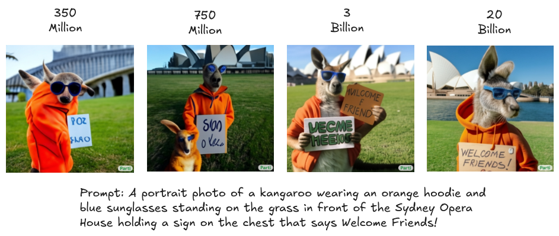
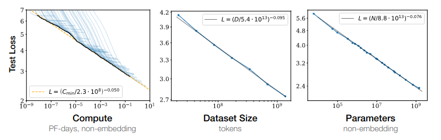
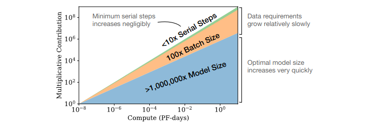
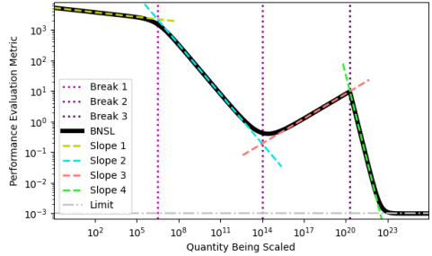
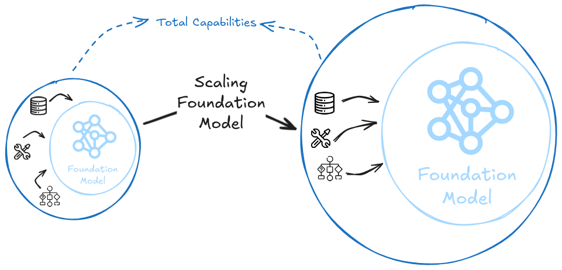
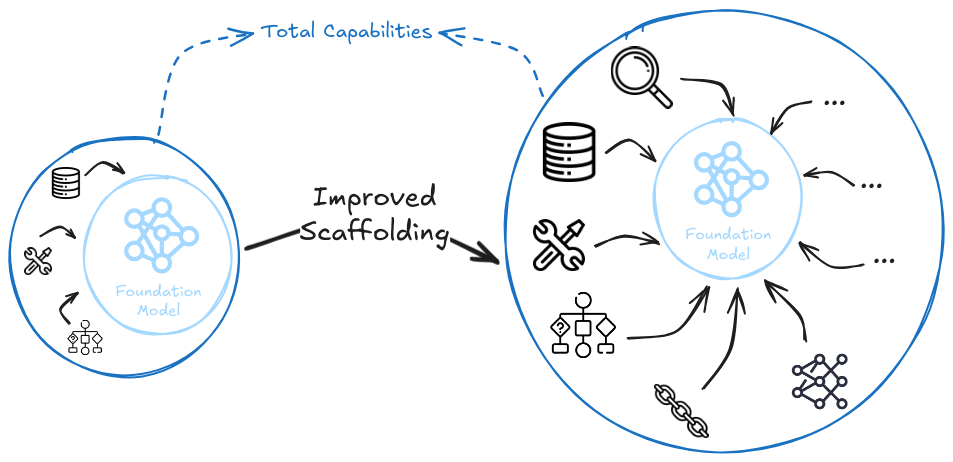

# 1.4 Mise à l'échelle

Dans la section précédente, nous avons exploré comment nous pouvons mesurer les capacités de l'IA le long de dimensions continues de performance et de généralité. Maintenant, nous allons examiner l'un des moteurs les plus importants derrière les améliorations de ces capacités : l'échelle.

## 1.4.1 La Leçon Amère {: #01}

Nous supposons que la plupart d'entre vous ont probablement fait des études universitaires à une époque où l'apprentissage automatique et l'IA sont devenus quasiment synonymes, ou plus précisément où l'apprentissage profond et l'IA sont considérés comme équivalents. Ce n'a pas toujours été le cas. Au début de l'histoire de l'intelligence artificielle, les chercheurs ont adopté des approches très différentes pour créer des systèmes intelligents. Ils croyaient que la clé de l'intelligence artificielle était d'encoder soigneusement les connaissances et l'expertise humaines dans des programmes informatiques. Cela a conduit à des choses comme des systèmes experts remplis de règles élaborées et des moteurs d'échecs programmés avec des principes stratégiques sophistiqués. Cependant, à maintes et maintes reprises, les chercheurs ont appris ce que nous appelons maintenant la leçon amère.

!!! quote "La Leçon Amère ([Sutton, 2019](http://www.incompleteideas.net/IncIdeas/BitterLesson.html))"

La plus grande leçon que l'on peut tirer de 70 ans de recherche en IA est que les méthodes générales exploitant la puissance de calcul sont, et de très loin, les plus efficaces. [...] La leçon amère repose sur les observations historiques suivantes : 1) les chercheurs en IA ont souvent tenté d'intégrer des connaissances à leurs agents, 2) cette approche aide toujours à court terme et procure une satisfaction personnelle au chercheur, mais 3) sur le long terme, elle atteint un plateau et peut même entraver les progrès ultérieurs, et 4) les avancées décisives émergent finalement grâce à une approche inverse fondée sur la mise à l'échelle par la recherche et l'apprentissage.

La plus grande leçon que l'on peut tirer de 70 ans de recherche en IA est que les méthodes génériques exploitant la puissance de calcul sont, et de très loin, les plus efficaces. [...] La leçon amère repose sur les observations historiques suivantes : 1) les chercheurs en IA ont souvent tenté d'intégrer des connaissances à leurs agents, 2) cette approche aide toujours à court terme et procure une satisfaction personnelle au chercheur, mais 3) sur le long terme, elle atteint un plateau et peut même entraver les progrès ultérieurs, et 4) les avancées décisives émergent finalement grâce à une approche inverse fondée sur la mise à l'échelle reposant sur la recherche et l'apprentissage.

**Qu'est-ce qui rend cette leçon amère ?** L'amertume provient de la découverte que des décennies d'ingénierie humaine minutieuse et de perspicacité étaient finalement moins importantes que des algorithmes simples combinés à la puissance de calcul. Aux échecs, des chercheurs qui avaient passé des années à encoder les stratégies des grands maîtres ont assisté impuissants à la victoire d'approches de recherche systématique comme Deep Blue, qui a battu le champion du monde Garry Kasparov. En vision par ordinateur, des détecteurs de caractéristiques élaborés manuellement ont été surpassés par des réseaux de neurones convolutifs capables d'apprendre leurs propres caractéristiques à partir des données. En reconnaissance vocale, des systèmes basés sur la compréhension humaine de la phonétique ont cédé le pas à des approches statistiques utilisant des modèles de Markov cachés ([Sutton, 2019](http://www.incompleteideas.net/IncIdeas/BitterLesson.html)).

**La leçon amère signifie-t-elle que l'ingénierie humaine est superflue ?** Le rôle de l'ingéniosité humaine dans le développement de l'IA est un sujet délicat, souvent mal interprété. Prenons l'exemple de l'architecture des transformateurs : elle pourrait sembler contredire la leçon amère, tant ses innovations architecturales sont sophistiquées. En réalité, l'ingéniosité humaine reste cruciale, mais la nuance réside dans la distinction entre deux approches différentes d'ingénierie :

- **Améliorations au niveau des algorithmes :** Celles-ci permettent une meilleure utilisation du calcul existant, comme : de meilleurs optimiseurs (Adam), des innovations architecturales (transformateurs, mécanismes d'attention) ou des approches d'entraînement (stratégies d'ajustement du taux d'apprentissage plus performantes).

- **Améliorations d'ingénierie propres à un domaine :** Celles-ci visent à encoder les connaissances humaines, telles que : des architectures spécialisées conçues pour des problèmes spécifiques, des caractéristiques manuelles ou des règles avec des biais spécifiques à une tâche.

La leçon amère ne plaide pas contre toute forme d'ingénierie humaine - elle met en garde contre le second type d'approche. L'architecture des transformateurs illustre parfaitement ce paradigme : elle n'encode aucune connaissance linguistique spécifique, mais propose plutôt un mécanisme générique d'apprentissage des structures qui devient de plus en plus performant à mesure que l'on augmente la puissance de calcul et le volume de données.

**Que signifie la leçon amère pour la sécurité de l'IA ?** Dans la section précédente, nous avons discuté de la mesure des capacités de l'IA selon des dimensions continues de performance et de généralité. Si ces capacités continuent de progresser principalement par l'augmentation des ressources computationnelles, nous pourrions alors disposer de trajectoires plus prévisibles. Cela offre à la fois des opportunités et des risques : les performances et la généralité continueront de croître tant que nous misons sur l'augmentation des moyens, mais cela signifie également qu'il devient possible d'anticiper les trajectoires de développement de l'IA et de préparer des mesures de sécurité adaptées à des niveaux de capacités prévisibles.

## 1.4.2 Lois de mise à l'échelle {: #02}

**Pourquoi les laboratoires d'IA s'intéressent-ils aux lois de mise à l'échelle ?** L'entraînement de grands modèles d'IA représente un investissement considérable, pouvant atteindre plusieurs centaines de millions de dollars pour les modèles de pointe. Ces lois de mise à l'échelle sont essentielles pour guider les laboratoires dans leurs décisions stratégiques d'allocation de ressources : faut-il privilégier l'investissement en GPU ou en données d'entraînement ? Vaut-il mieux développer un modèle plus volumineux sur une durée plus courte, ou un modèle plus compact mais sur une période plus longue ? 

À titre d'exemple, avec un budget de calcul fixe, ils peuvent être amenés à arbitrer entre deux options : entraîner un modèle de 20 milliards de paramètres en exploitant 40% de leurs données, ou un modèle de 200 milliards de paramètres en n'utilisant que 4% du jeu de données. Des choix mal calculés peuvent conduire au gaspillage de ressources considérables. C'est pourquoi il est crucial de pouvoir établir une corrélation prévisible entre l'investissement et les capacités résultantes.

<figure markdown="span">
{ loading=lazy }
  <figcaption markdown="1"><b>Figure 1.21 :</b> Exemple de l'augmentation des capacités avec l'augmentation de l'un des paramètres des lois de mise à l'échelle - le nombre de paramètres. La même architecture de modèle (Parti) a été utilisée pour générer une image à partir d'une invite identique, la seule différence entre les modèles étant leur taille en paramètres. On observe des sauts qualitatifs notables, et quelque part entre 3 et 20 milliards de paramètres, le modèle acquiert la capacité d'orthographier correctement des mots. ([Yu et al., 2022](https://arxiv.org/abs/2206.10789))</figcaption>
</figure>

**Que sont les lois de mise à l'échelle ?** Les lois de mise à l'échelle sont des relations mathématiques qui décrivent comment les performances d'un système d'IA évoluent lorsque l'on fait varier des paramètres clés comme la taille du modèle, la taille du jeu de données et la puissance de calcul. Ce sont des relations empiriques de type puissance qui ont été observées comme étant valables sur plusieurs ordres de grandeur successifs. Les variables clés impliquées sont :

**Calcul (C)** : Ce terme représente la puissance de traitement totale utilisée pendant l'entraînement, mesurée en opérations à virgule flottante (FLOP/s). On peut le considérer comme le "budget" d'entraînement : plus de calcul signifie soit un entraînement plus long, soit l'utilisation de matériel plus performant, ou les deux. Bien que disposer de davantage de GPU permette d'augmenter la capacité de calcul, ce dernier fait ultimement référence au nombre total d'opérations effectuées, et non pas simplement au matériel.

**Paramètres (N)** : Ce sont les paramètres ajustables dans le modèle qui sont modifiés pendant l'entraînement - comme des réglages que le modèle peut affiner pour mieux s'adapter aux données. Un nombre plus élevé de paramètres permet au modèle d'apprendre des structures plus complexes mais nécessite plus de calcul à chaque étape d'entraînement. Les modèles actuels de pointe comptent des centaines de milliards de paramètres.

**Taille du jeu de données (D)** : Cela mesure le nombre d'exemples sur lesquels le modèle s'entraîne (généralement mesuré en tokens, unités de texte). Plus le jeu de données est vaste, plus le modèle peut assimiler d'informations. Parallèlement, pour lire et apprendre de ces données supplémentaires, les sessions d'entraînement doivent généralement être plus longues, augmentant ainsi le calcul total nécessaire avant que le modèle puisse être considéré comme «entraîné».

**Perte (L)** : Mesure quantitative de l'écart entre les prédictions du modèle et les résultats attendus lors de l'entraînement. Il s'agit de la valeur que l'on cherche à minimiser, qui tend à se réduire lorsque l'on augmente les variables de mise à l'échelle.

<figure markdown="span">
{ loading=lazy }
  <figcaption markdown="1"><b>Figure 1.22 :</b> Les performances de modélisation de langage s'améliorent de manière continue lorsque l'on augmente la taille du modèle, la taille du jeu de données et la quantité de calcul utilisée pour l'entraînement. Pour des performances optimales, ces trois facteurs doivent être mis à l'échelle simultanément. Les performances empiriques présentent une relation de puissance avec chaque facteur individuel lorsqu'il n'est pas limité par les deux autres. ([Kaplan et al., 2020](https://arxiv.org/abs/2001.08361))</figcaption>
</figure>

**Premières lois de mise à l'échelle d'OpenAI en 2020**. Afin de comprendre les relations entre différentes variables susceptibles de contribuer à la mise à l'échelle, OpenAI a mené une série d'expériences systématiques. Pour saisir intuitivement leur démarche, imaginez le processus d'entraînement d'un modèle où l'on maintient certaines variables constantes tout en faisant varier d'autres, et en observant l'évolution de la perte. Cette approche permet progressivement de dégager des schémas récurrents. 

Par exemple, on peut maintenir la taille du jeu de données constante et faire varier le nombre de paramètres et le temps d'entraînement, ou inversement garder le nombre de paramètres stable tout en modifiant les quantités de données. On mesure ainsi la contribution relative de chaque facteur aux performances globales. Si ces relations se vérifient à travers différentes architectures de modèles et tâches, cela suggère qu'elles capturent un mécanisme fondamental des systèmes d'apprentissage profond.

C'est ainsi qu'OpenAI a développé la première génération de ses lois de mise à l'échelle. À titre d'illustration, selon ces lois, si vous disposez de 10 fois plus de capacité de calcul, vous devriez augmenter la taille du modèle d'environ 5 fois, et la taille des données seulement 2 fois. ([Kaplan et al., 2020](https://arxiv.org/abs/2001.08361))

<figure markdown="span">
{ loading=lazy }
  <figcaption markdown="1"><b>Figure 1.23 :</b> Le document initial d'OpenAI sur les lois de mise à l'échelle stipulait que pour un entraînement optimalement efficace en termes de calcul, la majeure partie de l'augmentation devrait porter sur la taille du modèle. Une augmentation relativement limitée des données est nécessaire pour éviter la réutilisation. ([Kaplan et al., 2020](https://arxiv.org/abs/2001.08361))</figcaption>
</figure>

<figure class="iframe-figure" markdown="span">
<iframe src="https://ourworldindata.org/grapher/exponential-growth-of-parameters-in-notable-ai-systems?tab=chart" loading="lazy" style="width: 100%; height: 600px; border: 0px none;" allow="web-share; clipboard-write"></iframe>
  <figcaption markdown="1"><b>Figure interactive 1.8 :</b> Croissance des paramètres ([Giattino et al., 2023](https://ourworldindata.org/artificial-intelligence))</figcaption>
</figure>

<figure class="iframe-figure" markdown="span">
<iframe src="https://ourworldindata.org/grapher/exponential-growth-of-datapoints-used-to-train-notable-ai-systems?tab=chart" loading="lazy" style="width: 100%; height: 600px; border: 0px none;" allow="web-share; clipboard-write"></iframe>
  <figcaption markdown="1"><b>Figure interactive 1.9 :</b> Croissance des données ([Giattino et al., 2023](https://ourworldindata.org/artificial-intelligence))</figcaption>
</figure>

<figure class="iframe-figure" markdown="span">
<iframe src="https://ourworldindata.org/grapher/exponential-growth-of-computation-in-the-training-of-notable-ai-systems?tab=chart" loading="lazy" style="width: 100%; height: 600px; border: 0px none;" allow="web-share; clipboard-write"></iframe>
  <figcaption markdown="1"><b>Figure interactive 1.10 :</b> Croissance du calcul ([Giattino et al., 2023](https://ourworldindata.org/artificial-intelligence))</figcaption>
</figure>

<figure class="iframe-figure" markdown="span">
<iframe src="https://ourworldindata.org/grapher/artificial-intelligence-training-computation?tab=chart" loading="lazy" style="width: 100%; height: 600px; border: 0px none;" allow="web-share; clipboard-write"></iframe>
  <figcaption markdown="1"><b>Figure interactive 1.11 :</b> Calcul utilisé pour l'entraînement de l'IA ([Giattino et al., 2023](https://ourworldindata.org/artificial-intelligence))</figcaption>
</figure>

**Mise à jour des lois de mise à l'échelle de DeepMind en 2022**. DeepMind a découvert que la plupart des grands modèles de langage étaient en réalité significativement surinparamétrés par rapport à la quantité de données sur lesquels ils étaient entraînés. Les lois de mise à l'échelle Chinchilla ont révélé que, pour des performances optimales, les modèles devraient être entraînés sur environ 20 fois plus de jetons de données qu'ils n'ont de paramètres.

Cette découverte signifie que de nombreux modèles de pointe auraient pu obtenir de meilleures performances avec des architectures plus compactes, mais disposant de jeux de données plus vastes. Ces lois ont été baptisées « lois de mise à l'échelle Chinchilla » car elles ont été démontrées à l'aide d'un modèle éponyme. 

Concrètement, Chinchilla — un modèle de 70 milliards de paramètres entraîné sur une quantité substantielle de données — a surpassé des modèles significativement plus volumineux comme Gopher (280 milliards de paramètres), et ce, malgré une capacité de calcul identique. 

Selon ces lois de mise à l'échelle, pour atteindre des performances optimales, il convient d'augmenter proportionnellement la taille du modèle et celle du jeu de données. En d'autres termes, si l'on dispose de 10 fois plus de capacité de calcul, il faut accroître la taille du modèle d'un facteur d'environ 3,1, tout en augmentant les données dans des proportions similaires. ([Hoffmann et al., 2022](https://arxiv.org/abs/2203.15556))

**Les lois de mise à l'échelle neuronales brisées (BNSL, de l'anglais Broken Neural Scaling Laws) en 2023**. Les recherches récentes ont révélé que l'amélioration des performances n'est pas toujours linéaire : on peut observer des transitions brutales, des plateaux temporaires, voire des périodes de détérioration avant une amélioration. 

Des exemples marquants incluent des phénomènes comme le "grokking" — où un modèle atteint soudainement une forte capacité de généralisation après de nombreuses étapes d'entraînement — ou la double descente profonde, où l'augmentation de la taille du modèle dégrade initialement les performances avant de les améliorer.

Plutôt que de se limiter à des lois de puissance simples, BNSL utilise une forme fonctionnelle plus flexible, capable de capturer ces comportements complexes. Cette approche permet des prédictions plus précises du comportement de mise à l'échelle, notamment autour des discontinuités et des transitions.

Les lois de mise à l'échelle restent une référence solide, mais des sauts capacitaires discontinus et des changements brutaux demeurent possibles. ([Caballero et al., 2023](https://arxiv.org/abs/2210.14891))

<figure markdown="span">
{ loading=lazy }
  <figcaption markdown="1"><b>Figure 1.24 :</b> Un exemple de loi de mise à l'échelle neuronale brisée (représentée par une ligne noire continue) avec 3 points de rupture (où les lignes pointillées violettes croisent la ligne principale) et 4 segments de loi de puissance distincts (délimités par les lignes pointillées jaune, bleu, rouge et verte). Les première et deuxième ruptures sont très progressives, tandis que la troisième est particulièrement brutale. ([Caballero et al., 2023](https://arxiv.org/abs/2210.14891))</figcaption>
</figure>

**Comment diffèrent la mise à l'échelle de l'entraînement et de l'inférence ?** La mise à l'échelle de l'entraînement consiste à utiliser davantage de ressources de calcul lors de la formation initiale du modèle : soit en augmentant la taille du modèle, en prolongeant la durée d'entraînement, ou en élargissant les jeux de données. 

Une autre approche de mise à l'échelle, souvent négligée dans les lois traditionnelles, est la mise à l'échelle du temps d'inférence. Celle-ci se concentre sur l'utilisation de ressources computationnelles supplémentaires au moment de l'exécution, via des techniques comme le chaînage de pensée (chain-of-thought), l'échantillonnage répété ou la recherche par arborescence.

Concrètement, deux stratégies s'offrent alors : soit entraîner un modèle très volumineux capable de générer directement des sorties de haute qualité, soit développer un modèle plus compact qui atteint des performances comparables en mobilisant plus de calcul pour décomposer et résoudre les problèmes étape par étape lors de l'inférence.

## 1.4.3 Hypothèse de la mise à l'échelle {: #03}

!!! info "Hypothèse de la mise à l'échelle forte ([Branwen, 2020](https://gwern.net/scaling-hypothesis))"

## 1.4.3 Hypothèse de la mise à l'échelle {: #03}

!!! info "Hypothèse de la mise à l'échelle forte ([Branwen, 2020](https://gwern.net/scaling-hypothesis))"

L'hypothèse de la mise à l'échelle forte postule que la simple augmentation de l'échelle des architectures actuelles de modèles fondamentaux, en termes de puissance de calcul et de volume de données, suffira à développer des capacités d'IA transformatives (IAT), voire même à atteindre le stade de la super-intelligence artificielle (SIA).

L'hypothèse de la mise à l'échelle forte propose que la simple augmentation de l'échelle des architectures actuelles de modèles fondamentaux, en termes de puissance de calcul et de volume de données, sera suffisante pour atteindre des capacités d'intelligence artificielle transformatives et potentiellement même une intelligence artificielle superintelligente.

<figure class="iframe-figure" markdown="span">
<iframe src="https://ourworldindata.org/grapher/ai-performance-knowledge-tests-vs-training-computation?tab=chart" loading="lazy" style="width: 100%; height: 600px; border: 0px none;" allow="web-share; clipboard-write"></iframe>
  <figcaption markdown="1"><b>Figure interactive 1.12 :</b> Tests de connaissances vs Calcul utilisé lors de l'entraînement ([Giattino et al., 2023](https://ourworldindata.org/artificial-intelligence))

**Qu'est-ce que l'hypothèse de la mise à l'échelle forte ?** Cette perspective avance que nous possédons déjà l'ensemble des composants fondamentaux requis - il suffirait simplement de les faire monter en puissance et en complexité, conformément aux lois de mise à l'échelle établies. ([Branwen, 2020](https://gwern.net/scaling-hypothesis)) Un débat théorique intense entoure cette hypothèse, et il serait vain de prétendre en épuiser tous les aspects. Nous vous proposons ici un bref aperçu des principaux enjeux dans les paragraphes qui suivent.

Les partisans incluent OpenAI ([OpenAI, 2023](https://openai.com/blog/planning-for-agi-and-beyond)), le PDG d'Anthropic Dario Amodei ([Amodei, 2023](https://www.dwarkeshpatel.com/p/dario-amodei)), Conjecture ([Conjecture, 2023](https://www.lesswrong.com/posts/PE22QJSww8mpwh7bt/agi-in-sight-our-look-at-the-game-board)), l'équipe de sécurité de DeepMind ([DeepMind, 2022](https://www.lesswrong.com/posts/GctJD5oCDRxCspEaZ/clarifying-ai-x-risk)), ainsi que plusieurs autres acteurs. Selon l'équipe de DeepMind, il ne faudrait que peu d'innovations supplémentaires pour atteindre l'AGI (Intelligence Artificielle Générale) : "*des modèles de fondation d'apprentissage profond mis à l'échelle, accompagnés d'un apprentissage par renforcement à partir des retours humains (RLHF), devraient suffire*" ([DeepMind, 2022](https://www.lesswrong.com/posts/GctJD5oCDRxCspEaZ/clarifying-ai-x-risk)).

**Quels sont les principaux arguments soutenant l'hypothèse de la mise à l'échelle forte ?** La preuve la plus convaincante de cette perspective provient des observations empiriques des progrès récents. Depuis plusieurs années, les chercheurs développent des algorithmes suivant la "leçon amère" (principe consistant à privilégier des méthodes générales exploitant efficacement les ressources de calcul). Pourtant, même lorsque ces algorithmes sophistiqués sont parfaitement alignés avec ce principe, ils ne représentent que 35 % des gains de performance des modèles de langage en 2024, les 65 % restants découlant uniquement de l'augmentation de l'échelle en termes de calcul et de données ([Ho et al., 2024](https://arxiv.org/abs/2403.05812)). En définitive, la pure mise à l'échelle demeure significativement plus déterminante que les raffinements algorithmiques les plus élaborés.

Voici la traduction du texte :

L'émergence de capacités inattendues constitue un autre argument puissant en faveur de la mise à l'échelle forte. Nous avons déjà observé des générations précédentes de modèles fondamentaux démontrer des aptitudes remarquables qui n'avaient pas été explicitement entraînées, comme la programmation par exemple. Ce comportement émergent suggère qu'il n'est pas impossible que des capacités métacognitives de haut niveau comme le raisonnement causal émergent de la même manière, simplement comme une fonction de la mise à l'échelle. Nous constatons que les modèles plus volumineux deviennent de plus en plus efficaces en termes d'échantillonnage - ils nécessitent moins d'exemples pour apprendre de nouvelles tâches. Cette efficacité accrue avec la mise à l'échelle suggère qu'augmenter davantage la taille pourrait ultimement conduire à des capacités d'apprentissage en peu de coups similaires à celles des humains, ce qui est un précurseur de l'IAT (Intelligence Artificielle Transformative) et de la SIA (Super-Intelligence Artificielle). Enfin, ces modèles semblent capables d'apprendre toute tâche qui peut être exprimée à travers leurs modalités d'entraînement. Actuellement, il s'agit de texte pour les LLM, mais il existe une voie claire vers des LMM multimodaux. Comme le texte peut exprimer virtuellement toute tâche compréhensible par un humain, la mise à l'échelle de la compréhension du langage pourrait suffire à atteindre l'intelligence générale.

**Quels sont les principaux arguments contre l'hypothèse de la mise à l'échelle forte ?** Des recherches récentes ont également mis en lumière plusieurs défis relatifs à l'hypothèse de la mise à l'échelle forte. Le plus immédiat concerne la disponibilité des données - les modèles de langage auront vraisemblablement épuisé les ressources textuelles publiques de haute qualité entre 2026 et 2032 ([Villalobos et al., 2024](https://arxiv.org/abs/2211.04325)). Bien que les données synthétiques puissent contribuer à atténuer cette limitation, leur capacité à fournir un signal d'apprentissage équivalent au contenu généré organiquement par les humains demeure incertaine. Par ailleurs, malgré l'épuisement potentiel des données textuelles, nous conservons un vaste réservoir de données multimodales inexploitées, telles que les vidéos YouTube.

Un défi plus fondamental provient de la façon dont ces modèles fonctionnent. Les grands modèles de langage (LLM, de l'anglais *Large Language Models*) sont fondamentalement des "bases de données interpolatives" (ou des systèmes de répétition stochastique, ou d'autres termes similaires). Le point central étant qu'ils construisent simplement une vaste collection de transformations vectorielles par le pré-entraînement. Bien que ces transformations deviennent de plus en plus sophistiquées avec la mise à l'échelle, les critiques affirment qu'il existe une différence fondamentale entre la recombinaiSON d'idées existantes et la véritable synthèse - dériver des solutions nouvelles à partir de premiers principes. Cependant, ce n'est pas un argument sans faille contre la mise à l'échelle forte. Cela pourrait simplement être une limitation de l'échelle actuelle - un modèle plus grand entraîné sur des données multimodales pourrait apprendre à gérer toute nouvelle situation simplement comme une recombinaison de schémas précédemment mémorisés. Ainsi, il reste à déterminer si la recombinaison de modèles a réellement une limite supérieure.

!!! info "Hypothèse de la mise à l'échelle faible ([Branwen, 2020](https://gwern.net/scaling-hypothesis))"

Dans cet environnement, les incitations économiques pourraient créer des points de bascule où des agents d'IA non alignés pourraient s'engager dans un détournement de récompense. 

Par exemple, un système d'IA avec un objectif proxy pourrait trouver une corrélation artificielle dans sa distribution d'entraînement qui lui permettrait de maximiser sa récompense sans vraiment atteindre l'objectif initialement visé. Cela pourrait conduire à des sous-objectifs poursuivis simplement comme un moyen d'arriver à une fin, plutôt que comme des solutions véritables.

Des cadres comme la Volition Extrapolée Cohérente (CEV) ou la Volition Agrégée Cohérente (CAV) tentent de traiter ces désalignements potentiels en essayant de capturer la représentation la plus cohérente des intentions humaines.

L'hypothèse de la mise à l'échelle faible propose que, bien que la mise à l'échelle continuera d'être le moteur principal des progrès, nous aurons également besoin d'améliorations architecturales et algorithmiques ciblées pour surmonter des goulots d'étranglement spécifiques.

Dans cet environnement, les incitations économiques pourraient créer des points de bascule où des agents d'IA potentiellement mal alignés pourraient s'engager dans un détournement de récompense. 

Par exemple, un système d'IA avec un objectif proxy pourrait découvrir une corrélation artificielle dans sa distribution d'entraînement qui lui permettrait de maximiser sa récompense sans vraiment atteindre l'objectif initiellement visé. Cette dynamique pourrait conduire à des sous-objectifs poursuivis simplement comme un moyen d'arriver à une fin, plutôt que comme des solutions véritablement alignées.

Des cadres conceptuels comme la Volition Extrapolée Cohérente (CEV) ou la Volition Agrégée Cohérente (CAV) tentent de traiter ces désalignements potentiels en cherchant à capturer la représentation la plus cohérente des intentions humaines.

**Qu'est-ce que l'hypothèse de la mise à l'échelle faible ?** Face à ces défis, une version plus nuancée de l'hypothèse de la mise à l'échelle a également été proposée. Selon l'hypothèse de la mise à l'échelle faible, bien que la mise à l'échelle continuera d'être le moteur principal des progrès, nous aurons également besoin d'améliorations architecturales et algorithmiques ciblées pour surmonter des goulots d'étranglement spécifiques. Ces améliorations ne nécessiteraient pas de percées fondamentales, mais plutôt des perfectionnements progressifs pour mieux exploiter la mise à l'échelle. ([Branwen, 2020](https://gwern.net/scaling-hypothesis)) À l'instar de l'hypothèse de la mise à l'échelle forte, la version faible est également controversée et débattue. Nous pouvons présenter quelques résultats argumentant pour et contre cette perspective.

L'architecture H-Jepa de LeCun ([LeCun, 2022](https://openreview.net/pdf?id=BZ5a1r-kVsf)), ou le plan Alberta de Richard Sutton ([Sutton, 2022](https://arxiv.org/abs/2208.11173)) sont des plans notables qui pourraient soutenir l'hypothèse de la mise à l'échelle faible.

**Quels sont les principaux arguments soutenant l'hypothèse de la mise à l'échelle faible ?** Les arguments en faveur de la mise à l'échelle forte, selon lesquels les améliorations algorithmiques ne contribuent qu'à 35 % des gains de performance des modèles de langage, plaident également en faveur de la mise à l'échelle faible. En effet, cette contribution d'un tiers représente un impact significatif dans l'amélioration des capacités. Diverses observations empiriques corroborent cette perspective. 

Par exemple, le support matériel pour les calculs à basse précision a permis des gains de performance d'un ordre de grandeur dans les charges de travail d'apprentissage automatique (Hobbhahn et al., 2023, "Tendances dans le matériel d'apprentissage automatique"). Ces améliorations ciblées ne remettent pas en cause le principe fondamental de la mise à l'échelle, mais permettent plutôt d'optimiser l'exploitation des ressources disponibles.

De même, les résultats de l'étude Chinchilla ont révélé que de nombreux modèles étaient sous-optimisés au regard des variables contribuant à leurs capacités. Cela suggère qu'il subsiste des marges de progression par l'affinement des stratégies de mise à l'échelle, plutôt que par des percées conceptuelles majeures. ([Hoffmann et al., 2022](https://arxiv.org/abs/2203.15556))

<figure markdown="span">
{ loading=lazy }
  <figcaption markdown="1"><b>Figure 1.25 :</b> L'augmentation/échafaudage reste constant, mais si l'hypothèse de la mise à l'échelle, faible ou forte, est vraie, alors les capacités continueront de s'améliorer simplement en passant à l'échelle.</figcaption>
</figure></invoke>

**Et si ni l'hypothèse de la mise à l'échelle faible ni la forte n'étaient vraies ?** Essentiellement, les lois de mise à l'échelle (qui ne prédisent que les capacités des modèles fondamentaux) et la plupart des débats autour de "la mise à l'échelle est tout ce dont vous avez besoin" occultent souvent d'autres aspects du développement de l'IA qui se produisent en dehors de ce que ces lois peuvent prédire. Ils ne prennent pas en compte les améliorations de l'"échafaudage" de l'IA (comme l'incitation par chaîne de pensée, l'utilisation d'outils ou la récupération), ni les combinaisons innovantes de plusieurs modèles travaillant ensemble. Les débats autour des lois de mise à l'échelle ne nous renseignent que sur les capacités d'un modèle fondamental unique entraîné de manière standard. Par exemple, selon l'hypothèse de la mise à l'échelle forte, nous pourrions atteindre l'AIT en augmentant simplement la taille du même modèle fondamental jusqu'à l'émergence de capacités métacognitives. Mais même si la mise à l'échelle s'arrête, gelant les progrès des capacités du modèle fondamental de base (que ce soit de manière faible ou forte), les techniques externes exploitant le modèle existant pourraient continuer leur progression.

Considérez les modèles fondamentaux comme les LLM ou les LMMs à l'instar d'un simple transistor. Isolés, ils pourraient être peu capables, mais en combinant suffisamment de transistors, nous obtenons toutes les capacités d'un superordinateur. De nombreux chercheurs considèrent que c'est un élément central d'où émergeront les capacités futures. On le désigne également par les termes "unhobbling" ([Aschenbrenner, 2024](https://situational-awareness.ai/from-gpt-4-to-agi/#Unhobbling)), "schlep" ([Cotra, 2023](https://www.planned-obsolescence.org/scale-schlep-and-systems/)) et divers autres termes, mais tous pointent vers le même principe sous-jacent : la mise à l'échelle brute des performances d'un modèle unique n'est qu'une partie de l'avancement global des capacités de l'IA.

<figure markdown="span">
{ loading=lazy }
  <figcaption markdown="1"><b>Figure 1.26 :</b> Même si aucune amélioration n'est observée dans la mise à l'échelle des modèles, d'autres techniques d'élicitation et d'échafaudage peuvent continuer de progresser. Ainsi, les capacités globales continuent de croître. De manière réaliste, l'avenir verra probablement des améliorations tant au niveau de l'échafaudage que de la mise à l'échelle. Donc, pour l'instant, il ne semble pas y avoir de limite supérieure à l'amélioration des capacités tant que l'un ou l'autre de ces aspects se poursuit.</figcaption>
</figure>

Nous approfondissons les arguments et contre-arguments pour tous les points de vue sur la mise à l'échelle des modèles fondamentaux dans l'annexe.

??? note "Argument : Contre la mise à l'échelle - Mémorisation vs Synthèse"

??? note "Argument : Contre la mise à l'échelle - Mémorisation vs Synthèse"

!!! warning "Ceci est une exploration un peu plus approfondie visant à comprendre les arguments des deux côtés si cela vous intéresse. C'est légèrement plus technique et peut être ignoré sans risque."

Lorsque nous parlons des LLM comme de "bases de données par interpolation", nous faisons référence à la façon dont ils stockent et manipulent des programmes vectoriels — qui ne doivent pas être confondus avec les programmes informatiques traditionnels comme Python ou C++. Ces modèles, ou programmes vectoriels, sont des transformations dans l'espace de plongement du modèle. Les premiers travaux sur les plongements ont montré des transformations simples (comme roi - homme + femme = reine), mais les LLM modernes peuvent stocker des millions de transformations beaucoup plus complexes. 

En raison de la mise à l'échelle, les LLM peuvent désormais stocker des fonctions vectorielles arbitrairement complexes — si complexes, en fait, que les chercheurs ont trouvé plus précis de les qualifier de programmes vectoriels plutôt que de fonctions.

Ce qui se passe dans les LLM, c'est qu'ils construisent une vaste base de données de ces programmes vectoriels lors du pré-entraînement. Quand nous parlons de "correspondance de modèles" ou de "mémorisation", nous désignons en réalité le fait qu'ils stockent des millions de transformations vectorielles qu'ils peuvent récupérer et combiner à chaque nouvelle requête.

Ainsi, la question décisive pour ou contre la mise à l'échelle forte (et même faible) devient : Une telle combinaison de modèles de programmes vectoriels peut-elle suffire à atteindre l'intelligence générale ? Autrement dit, est-il possible d'approximer la synthèse de programmes par des recombinaisons suffisamment nombreuses de modèles (ou d'abstractions, pour employer divers termes qui traduisent une idée fondamentalement similaire) ?

Les personnes qui contestent cette idée affirment que, quelle que soit leur nombre ou leur sophistication, les transformations vectorielles restent fondamentalement différentes de la véritable synthèse de programmes. La synthèse de programmes authentique impliquerait de dériver une nouvelle solution à partir de principes fondamentaux — et non simplement de recombiner des transformations existantes. Certaines observations empiriques soutiennent ce point de vue. Comme l'exemple du chiffrement de César : « Les LLM peuvent résoudre un chiffrement de César avec une taille de clé de 3 ou 5, mais échouent avec une taille de clé de 13, car ils ont mémorisé des solutions spécifiques plutôt que de comprendre l'algorithme général » ([Chollet, 2024](https://www.youtube.com/watch?v=nL9jEy99Nh0)). Ou encore, la « malédiction de l'inversion » qui montre que même les modèles de langage de pointe en 2024 ne peuvent pas effectuer d'inférence causale inverse — s'ils sont entraînés sur « A est B », ils ne parviennent pas à apprendre « B est A » ([Berglund et al., 2023](https://arxiv.org/abs/2309.12288))

Mais cela ne semble pas encore totalement invalider la mise à l'échelle. Si nous augmentons la taille de la base de données des programmes et y intégrons plus de connaissances et de motifs, nous allons améliorer ses performances. ([Chollet, 2024](https://www.dwarkeshpatel.com/p/francois-chollet)) Les deux camps du débat sont d'accord là-dessus. Cela suggère que le véritable problème n'est pas de savoir si la recombinaison de modèles a une limite supérieure évidente, mais plutôt si c'est la voie la plus efficace vers l'intelligence générale. La synthèse de programmes pourrait atteindre les mêmes capacités avec beaucoup moins de calculs et de données en apprenant à dériver des solutions plutôt qu'à mémoriser des modèles.