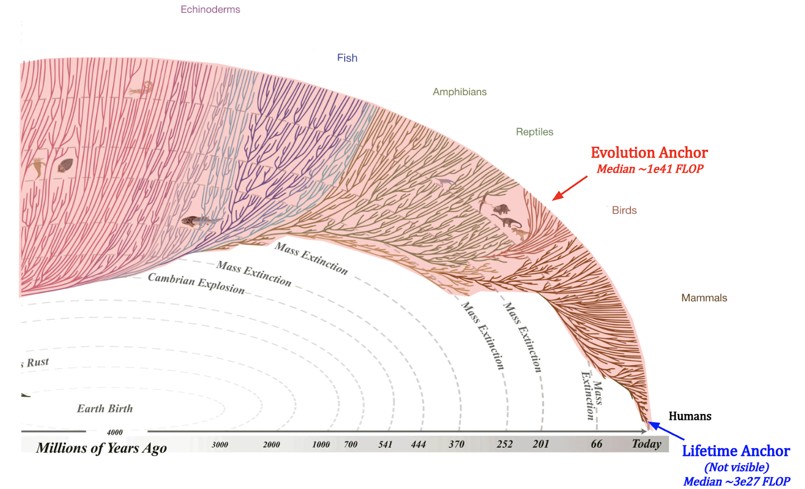
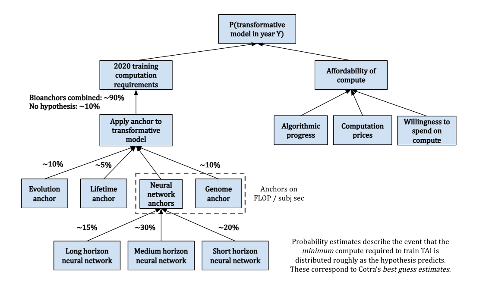
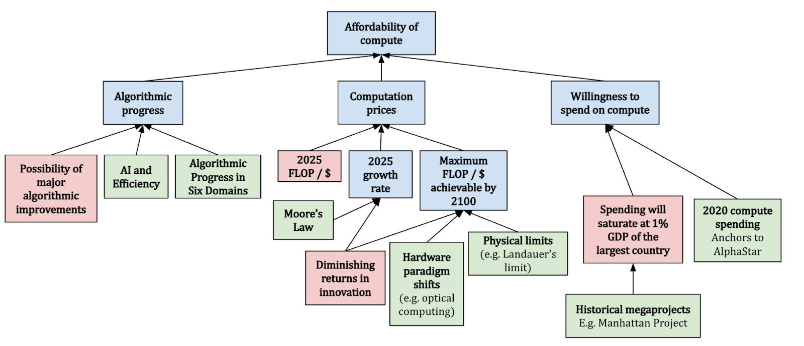
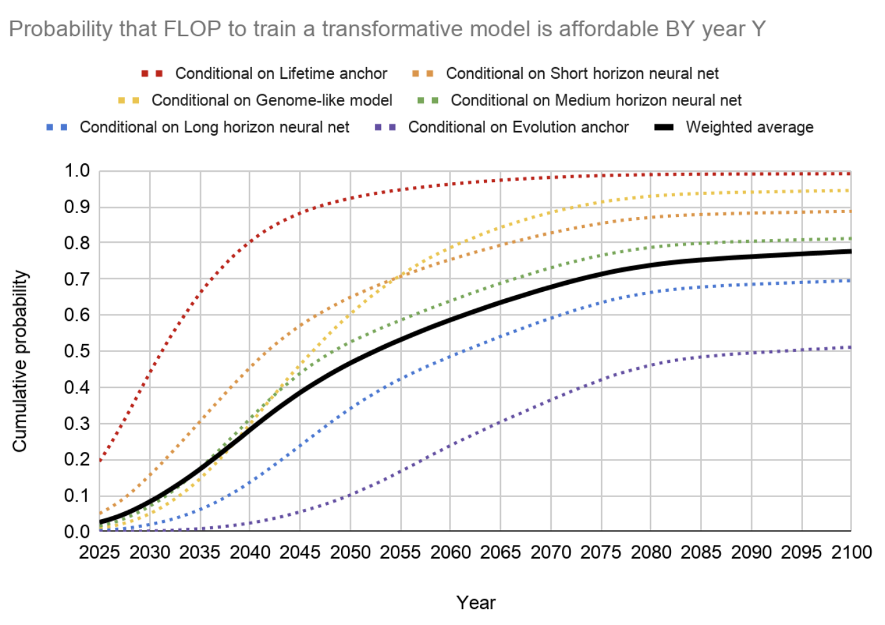

# 1.5 Prévisions

Dans les sections précédentes, nous avons exploré comment les modèles de base tirent parti du calcul grâce aux lois d'échelle et à la leçon amère. Mais comment pouvons-nous réellement prédire où se dirigent les capacités de l'IA ? Cette section présente les principales méthodologies de prévision qui nous aident à anticiper les progrès de l'IA et à préparer des mesures de sécurité appropriées.

**Pourquoi devrions-nous nous préoccuper des prévisions ?** Les prévisions sur les progrès de l'IA sont cruciales pour le travail de sécurité des systèmes d'intelligence artificielle. La chronologie menant aux IAT [Intelligences Artificielles Transformatives] influence tous les aspects, des priorités de recherche aux cadres de gouvernance – si nous nous attendons à des IAT dans 5 ans plutôt que dans 50 ans, cela modifie radicalement les approches de sécurité envisageables. Par exemple, si nous anticipons des progrès rapides, nous pourrions devoir nous concentrer sur des mesures de sécurité à mise en œuvre rapide plutôt que sur des recherches théoriques à long terme. De surcroît, comprendre les trajectoires probables de développement nous aide à anticiper des capacités spécifiques et à préparer des mesures de sécurité ciblées avant leur émergence. Ceci est particulièrement critique au regard du potentiel de développements capacitaires soudains, notamment dans des domaines à risque comme la génération de logiciels malveillants ou les stratégies de tromperie.

!!! question "Prévision initiale : Avant d'explorer des méthodes plus sophistiquées, faites une prévision initiale : Quand pensez-vous que nous verrons l'apparition d'une IA transformative ? Gardez cette prévision à l'esprit alors que nous examinerons différentes approches de prévision."

## 1.5.1 Méthodologie {: #01}

**Comment convertissons-nous des croyances en probabilités et prévisions ?** Nous avons besoin de moyens pour convertir des croyances telles que "Je pense que l'Intelligence Artificielle Générale (AGI) est probable cette décennie" en estimations de probabilités précises. Une approche consiste à utiliser la décomposition - en décomposant des croyances complexes en composantes plus petites et mesurables et en analysant les données pertinentes. Plutôt que d'estimer directement l'année d'émergence de l'IA transformative, nous pouvons commencer par prévoir séparément des éléments comme la croissance computationnelle, les progrès algorithmiques et les limitations matérielles, puis combiner ces estimations ([Zhang, 2024](https://forecasting-sp24.quarto.pub/forecasting-sp24/estimation.html)). Cette méthode de décomposition nous aide à ancrer les prédictions dans des tendances observables plutôt que de se fier uniquement aux intuitions. Ainsi, en utilisant cette approche, deux techniques principales méritent d'être discutées : la prévision de zéro ordre pour établir des référentiels, et la prévision de premier ordre pour comprendre les trajectoires de changement.

**Que sont les classes de référence et pourquoi sont-elles pertinentes ?** Lors de l'analyse de chaque composante de notre prévision décomposée, nous devons mobiliser des exemples historiques significatifs pour éclairer nos prédictions. C'est là qu'interviennent les classes de référence - ce sont des catégories de situations historiques analogues que nous pouvons utiliser pour élaborer des prédictions. Pour le développement de l'intelligence artificielle, les classes de référence pertinentes peuvent inclure des révolutions technologiques antérieures (telles que les révolutions industrielle ou informatique), d'autres systèmes d'optimisation (comme l'évolution biologique ou les dynamiques économiques), ou l'impact de progrès scientifiques rapides (à l'instar de CRISPR ou des vaccins à ARNm). Le principe fondamental est que ces références doivent présenter des analogies significatives avec le phénomène à prédire, sans pour autant appartenir à une catégorie strictement identique.

**Qu'est-ce que la prévision de zéro ordre ?** L'approche de prévision la plus simple repose sur un constat simple : demain tend à ressembler à la situation actuelle. La prévision de zéro ordre s'appuie sur des classes de référence - en analysant 3 à 5 exemples historiques similaires et en utilisant leur moyenne comme prédiction de base. Plutôt que de chercher à identifier des tendances ou à réaliser des projections complexes, cette méthode part du principe que les schémas récents ont tendance à se poursuivre. ([Steinhardt, 2024](https://forecasting-sp24.quarto.pub/forecasting-sp24/zeroth-first.html)) Ces exemples peuvent provenir de différentes classes de référence. Pour un exemple concret d'utilisation de plusieurs classes de référence dans les prévisions de sécurité de l'IA : Supposons que nous voulions prédire à quelle vitesse des systèmes d'IA avancés pourraient passer de capacités "sûres" à des capacités "potentiellement dangereuses". Nous pourrions examiner :

- Combien de temps il a fallu aux modèles de langage pour passer de la génération de texte basique à la capacité de planifier des stratégies de tromperie en plusieurs étapes (un point de référence spécifique à l'IA)

- Combien de temps il a fallu aux modèles de langage pour passer de la génération de texte basique à la capacité de planifier des stratégies de tromperie en plusieurs étapes (un point de référence spécifique à l'IA)
- La rapidité avec laquelle la technologie nucléaire est passée d'applications pacifiques à militaires (un point de référence relatif aux technologies à double usage)

- La rapidité avec laquelle des techniques biologiques comme CRISPR sont passées de la découverte en laboratoire à une utilisation généralisée nécessitant des protocoles de sécurité (un point de référence en biosécurité)

L'analyse collective de ces exemples pourrait suggérer que les capacités dangereuses émergent généralement dans les 2 à 5 ans suivant les avancées technologiques fondamentales, ce qui permet d'évaluer l'urgence du développement de mesures de sécurité. Les changements majeurs dans les modèles de développement étant rares, l'histoire récente constitue un prédicteur de base fiable du futur proche. Cela ne signifie pas que des changements sont impossibles – mais s'écarter significativement des tendances récentes exige des preuves solides.

**Qu'est-ce que la prévision de premier ordre ?** Alors que la prévision de zéro ordre utilise des exemples historiques issus de différentes classes de référence comme prédicteurs directs, la prévision de premier ordre tente d'identifier et de projeter les schémas observés dans les données historiques directes du développement de l'IA. Dans le domaine de l'IA, nous observons des modèles de croissance exponentielle assez cohérents. Les ressources computationnelles utilisées dans les modèles de pointe ont progressé de 4,2 fois par an depuis 2010, les ensembles de données d'entraînement se sont développés d'environ 2,9 fois par an, et les performances matérielles s'améliorent d'environ 1,35 fois chaque année grâce aux avancées architecturales ([Epoch AI, 2023](https://epoch.ai/trends)). La prévision de premier ordre (ou prévision de tendance) tente d'identifier ces types de schémas et de les projeter à l'avenir. C'est l'approche adoptée par la plupart des travaux systématiques de prévision de l'IA aujourd'hui, y compris le cadre centré sur le calcul d'Epoch AI et les ancres biologiques d'Ajeya Cotra. Cependant, il est important de garder à l'esprit que même si ces tendances ont été remarquablement cohérentes, elles ne peuvent pas se poursuivre indéfiniment. Des contraintes physiques, thermodynamiques ou économiques finiront par limiter la croissance. La question clé est : quand ces limites deviennent-elles pertinentes ? Nous explorerons cela dans la section suivante sur le cadre centré sur le calcul.

**Comment combinons-nous différentes prévisions ?** Plusieurs approches de prévision nous donnent souvent des prédictions divergentes – la prévision de zéro ordre pourrait suggérer une chronologie tandis que l'extrapolation de tendance en indique une autre. Tout comme nous pouvons moyenner les opinions de nombreux experts, nous pouvons intégrer ces prédictions pour obtenir une image plus précise et nuancée. Une approche consiste à modéliser chaque prévision comme une distribution de probabilités et à les combiner à l'aide de modèles de combinaison ([Steinhardt, 2024](https://forecasting-sp24.quarto.pub/forecasting-sp24/combining-forecasts-new.html)). Par exemple, si la prévision de zéro ordre suggère 3-4 ans entre les grandes percées basées sur l'histoire récente, tandis que l'extrapolation de tendance pointe vers 1,5-2 ans basés sur la croissance computationnelle, un modèle combiné pourrait prédire 2-3 ans mais avec des intervalles de confiance plus larges pour tenir compte de l'incertitude inhérente à ces deux approches.

**Que faire dans des situations avec des données limitées ou des classes de référence restreintes ?** Bien que la décomposition, les classes de référence et l'analyse de tendance constituent l'ossature des prévisions en intelligence artificielle, nous sommes parfois confrontés à des questions où les données directes sont rares ou aucune classe de référence claire n'existe. Par exemple, prédire l'impact sociétal des systèmes d'IA avancés ou anticiper des capacités inédites qui n'ont pas encore été démontrées. Dans ces cas, nous nous tournons souvent vers le jugement d'experts et de prévisionnistes chevronnés. Un avantage de la prévision par experts réside dans la capacité d'intégrer des perspectives qualitatives qui pourraient échapper à une analyse purement quantitative des tendances. Par exemple, les experts peuvent repérer des signes précurseurs de rendements décroissants ou identifier des approches techniques émergentes susceptibles d'accélérer les progrès. Cette utilisation équilibrée de méthodes pilotées par les données et du jugement d'experts est particulièrement cruciale dans le domaine de la sécurité de l'IA. Bien que nous devions ancrer nos prédictions dans des tendances empiriques chaque fois que possible, nous avons également besoin de cadres conceptuels pour appréhender des développements sans précédent et les discontinuités potentielles dans les progrès.

**Jusqu'où les constats empiriques se généralisent-ils ?** Un débat anime actuellement la communauté scientifique sur la fiabilité des tendances actuelles pour prédire le développement futur de l'IA. Certains chercheurs affirment que les résultats empiriques en IA présentent une généralisation surprenante - les modèles observés aujourd'hui continueraient de se maintenir même lorsque les systèmes deviendront plus sophistiqués ([Steinhardt, 2022](https://www.lesswrong.com/posts/ekFMGpsfhfWQzMW2h/empirical-findings-generalize-surprisingly-far)). Cependant, nos antécédents en matière de prévision nous incitent à la prudence. Lorsque les prévisionnistes chevronnés ont prédit que la précision du jeu de données MATH passerait de 44 % à 57 % d'ici juin 2022, les performances réelles ont atteint 68 % - un niveau qu'ils considéraient comme extrêmement improbable. Peu après, GPT-4 a franchi un nouveau palier en atteignant 86,4 % de précision. Il existe plusieurs autres exemples de modèles de langage de grande taille (LLM) ayant déjoué les pronostics de la majorité des prévisionnistes et experts sur différents critères d'évaluation. ([Cotra, 2023](https://www.planned-obsolescence.org/language-models-surprised-us/)).

Ce modèle de sous-estimation des progrès suggère que bien que les tendances empiriques offrent des orientations précieuses, elles peuvent ne pas capturer l'intégralité des dynamiques du développement de l'IA. Avant GPT-3, de nombreux experts pensaient que des tâches comme le raisonnement complexe nécessiteraient des architectures spécialisées. L'émergence de ces capacités par une simple montée en puissance montre comment les systèmes peuvent développer des capacités inattendues par de simples améliorations quantitatives. Ces observations ont des implications critiques tant pour la prévision que pour la gouvernance : nous avons désormais besoin de cadres conceptuels capables de s'adapter à l'émergence de capacités plus rapides ou différentes de ce que laissent entrevoir les tendances actuelles.

**Comment cela nous aide-t-il à prédire l'IA transformative ?** Ces principes fondamentaux de prévision nous aident à évaluer de manière critique les affirmations concernant les délais de développement de l'IA et les scénarios de takeoff. Lorsque nous rencontrons des prédictions sur des progrès discontinus ou une montée en puissance régulière, nous pouvons nous poser les questions suivantes : Quelles tendances soutiennent cette vision ? Quelles classes de référence sont pertinentes ? Comment des prévisions similaires ont-elles performé historiquement ? Cette approche systématique nous permet de dépasser les intuitions pour élaborer des prédictions plus rigoureuses sur les trajectoires de développement de l'IA.

## 1.5.2 Prévision inspirée par la biologie {: #02}

**Que sont les ancres biologiques ?** Les ancres biologiques constituent une technique de prévision. Pour définir une classe de référence, on part du principe que le cerveau humain est représentatif de l'intelligence générale. Cela revient à le considérer comme une preuve de concept. La quantité de ressources computationnelles nécessaires pour former un être humain pourrait être approximativement équivalente à celle requise pour développer une intelligence artificielle de niveau humain (IANH, de l'anglais Transformative Artificial Intelligence). L'approche des ancres biologiques vise à estimer les ressources computationnelles nécessaires pour qu'une IA atteigne un niveau d'intelligence comparable à celui des humains, selon plusieurs étapes :

- Premièrement, évaluer la quantité de calculs effectués par le cerveau humain, en la traduisant en une mesure quantifiable similaire aux opérations informatiques en FLOP/s.

- Deuxièmement, estimer la quantité de calculs nécessaires pour entraîner un réseau de neurones à égaler la capacité inférentielle du cerveau, en tenant compte des améliorations algorithmiques futures.

- Troisièmement, examiner quand il serait viable de mobiliser de telles ressources computationnelles massives, en prenant en compte la baisse des coûts de calcul, la croissance économique et l'augmentation des investissements dans l'IA.

- Finalement, en analysant ces facteurs, nous pouvons prédire quand il serait économiquement viable pour les entreprises d'IA de mettre en œuvre les ressources nécessaires pour développer une Intelligence Artificielle Transformative (IAT).

Déterminer l'équivalent computationnel exact du processus de formation du cerveau humain est complexe, ce qui a conduit à la proposition de six hypothèses, collectivement désignées sous le nom d'"ancres biologiques" ou de "bioancres". Chaque ancre présente un poids différent qui contribue à la prédiction globale.

Ancre évolutive : Effort computationnel total à travers toute l'histoire évolutive.

Ancre du développement neuronal : Activité computationnelle du cerveau de la naissance à l'âge adulte (0 à 32 ans).

Ancres de réseau neuronal et du génome : Différents points de référence computationnel basés sur le cerveau humain et le génome pour évaluer l'échelle des paramètres nécessaires à l'IA pour atteindre l'intelligence générale.

<figure markdown="span">
{ loading=lazy }
  <figcaption markdown="1"><b>Figure 1.27 :</b> Un diagramme présentant les différents points de départ que nous pourrions utiliser dans le rapport sur les ancres biologiques pour calculer la quantité de ressources computationnelles effectives requises pour une intelligence artificielle transformative de niveau humain. ([Ho, 2022](https://epochai.org/blog/grokking-bioanchors))</figcaption>
</figure>

**Prévision avec les ancres biologiques**. En intégrant ces ancres avec des projections de l'accessibilité future des ressources computationnelles, nous pouvons esquisser une chronologie potentielle pour l'IAT. Cette méthode vise à fournir une "borne supérieure souple" sur l'arrivée de l'IAT plutôt que de pointer une année exacte, reconnaissant la complexité et l'imprévisibilité du développement de l'IA. ([Karnofsky, 2021](https://forum.effectivealtruism.org/posts/ajBYeiggAzu6Cgb3o/biological-anchors-is-about-bounding-not-pinpointing-ai)) L'image suivante donne un aperçu de la méthodologie.

<figure markdown="span">
{ loading=lazy }
  <figcaption markdown="1"><b>Figure 1.28 :</b> Le modèle des ancres biologiques ([Ho, 2022](https://epochai.org/blog/grokking-bioanchors))</figcaption>
</figure>

**Capacité computationnelle.** Les coûts liés aux ancres biologiques sont calculés en considérant trois facteurs différents : les progrès algorithmiques, les estimations du prix de calcul et la volonté d'investir dans l'apprentissage automatique. Le rapport envisage un doublement de l'efficacité algorithmique tous les ~2-3 ans. Concernant les prix, Cotra anticipe une réduction des coûts au fil du temps, avec un quasi-dédoublement tous les ~2,5 ans, et prévoit une stabilisation après 6 ordres de grandeur. Il suppose que les dépenses consacrées aux sessions d'entraînement d'apprentissage automatique devraient être plafonnées à 1% du PIB du pays le plus important, en s'appuyant sur des études de cas antérieures de mégaprojets (comme le Projet Manhattan), avec un temps de doublement de 2 ans après 2025. L'incertitude principale réside dans la persistance de ces tendances au-delà de quelques années. Par exemple, Epoch a relevé que l'étude d'OpenAI sur l'IA et le calcul ([OpenAI, 2018](https://openai.com/blog/ai-and-compute/)) était trop optimiste dans ses conclusions sur la croissance computationnelle. ([Ho et al., 2022](https://epochai.org/blog/grokking-bioanchors)) Cela invite à la prudence lors de l'interprétation des prévisions du rapport sur les Ancres Biologiques.

<figure markdown="span">
{ loading=lazy }
  <figcaption markdown="1"><b>Figure 1.29 :</b> Capacité computationnelle ([Ho et al., 2022](https://epochai.org/blog/grokking-bioanchors))</figcaption>
</figure>

Le graphique suivant offre un aperçu des résultats. Dans l'ensemble, le graphique prend une moyenne pondérée des différentes façons dont la trajectoire pourrait évoluer. Cela nous donne une estimation d'une probabilité de plus de 10% de chances d'avoir une Intelligence Artificielle Transformative (IAT) d'ici 2036, environ 50% de chances d'ici 2055, et environ 80% de chances d'ici 2100. En 2022, une mise à jour de deux ans sur les délais de l'auteur (Ajeya Cotra) a été publiée. Les délais mis à jour pour l'IAT sont d'environ 15% de chances d'ici 2030, environ 35% de chances d'ici 2036, une médiane d'environ 2040, et environ 60% de chances d'ici 2050. ([Cotra, 2022](https://www.alignmentforum.org/posts/AfH2oPHCApdKicM4m/two-year-update-on-my-personal-ai-timelines))

<figure markdown="span">
{ loading=lazy }
  <figcaption markdown="1"><b>Figure 1.30 :</b> Résultats du modèle des ancres biologiques pour différentes ancres ([Karnofsky, 2021](https://forum.effectivealtruism.org/posts/vCaEnTbZ5KbypaGsm/forecasting-transformative-ai-the-biological-anchors-method))</figcaption>
</figure>

**Critiques.** Le cadre des Ancres Biologiques offre une perspective unique, mais il est également crucial de reconnaître ses limites et les débats plus larges qu'il suscite au sein de la communauté de recherche en IA. Il n'est pas universellement accepté comme l'outil prédictif principal par tous les scientifiques en apprentissage automatique ou les chercheurs en alignement.

La loi de Platt est une observation généralisée nommée d'après Charles Platt. Elle est utilisée pour mettre en lumière un schéma historique récurrent : l'arrivée estimée de l'Intelligence Artificielle Générale (IAG, de l'anglais Artificial General Intelligence) qui semble toujours être « à portée de main », mais constamment repoussée à « dans 30 ans ».

!!! quote "Vernor Vinge au discours de la NASA en 1993. ([Yudkowsky, 2021](https://intelligence.org/2021/12/03/biology-inspired-agi-timelines-the-trick-that-never-works/))"

Dans trente ans, nous disposerons des capacités technologiques nécessaires pour engendrer une intelligence surhumaine. Peu de temps après, l'ère humaine aura vécu.

I'll be happy to help! Could you please provide the specific text you want me to translate? I see you've shared the context and previous translations, but there's no new text to translate after the last line.

Yudkowsky remarque que la loi de Platt semble correspondre de manière remarquable à la prédiction faite par le rapport sur les Ancres Biologiques en 2020. Comme le dit l'aphorisme statistique : « Tous les modèles sont faux, mais certains sont utiles ».

Ainsi, pour avoir un tableau complet de la réception des ancres biologiques, voici quelques-unes des critiques du rapport sur les Ancres Biologiques :

- **Défis au-delà du calcul** : Bien que les Ancres Biologiques mettent en lumière la puissance de calcul comme facteur critique du développement de l'IA, elles risquent de simplifier à l'excès la complexité de l'obtention d'une IA transformative. Des facteurs dépassant la pure capacité de calcul — conception d'algorithmes, disponibilité des données, subtilités des environnements d'apprentissage — jouent des rôles essentiels. Réduire l'avenir de l'IA à sa seule capacité computationnelle relève d'une vision trop réductrice, car le développement d'une IA transformative repose sur des défis plus nuancés d'innovation algorithmique et d'accessibilité des données. ([Karnofsky, 2021](https://www.cold-takes.com/biological-anchors-is-about-bounding-not-pinpointing-ai-timelines/))

- **Potentiel de percées soudaines** : Les critiques de la méthode des Ancres Biologiques, comme Eliezer Yudkowsky, soulignent l'imprévisibilité des progrès de l'IA et le potentiel de ruptures technologiques qui pourraient modifier radicalement les capacités de l'IA sans se conformer strictement aux repères computationnels dérivés de la biologie. Ces critiques mettent en lumière l'importance de considérer un éventail de facteurs et de possibles mutations des paradigmes de développement de l'IA qui pourraient accélérer les progrès au-delà des prévisions actuelles. ([Karnofsky, 2021](https://www.alignmentforum.org/posts/nNqXfnjiezYukiMJi/reply-to-eliezer-on-biological-anchors))

- **Objectif et Malentendu** : L'approche des Ancres Biologiques vise à établir des estimations de bornes pour les trajectoires de développement de l'IA plutôt que des prédictions précises. Des malentendus peuvent naître de l'attente d'une méthode fournissant des prévisions annuelles spécifiques, alors que son objectif est de délimiter les bornes supérieures et inférieures possibles, tout en reconnaissant les incertitudes significatives inhérentes au développement de l'IA. ([Karnofsky, 2021](https://www.cold-takes.com/biological-anchors-is-about-bounding-not-pinpointing-ai-timelines/))

- **Méditation sur les Ruptures de Paradigme** : L'histoire du domaine de l'IA laisse entrevoir que des changements majeurs de paradigme et des percées technologiques pourraient significativement influencer les trajectoires de développement. Bien que l'apprentissage profond domine actuellement les avancées de l'IA, la possibilité de voir émerger de nouvelles méthodologies transformatives demeure ouverte, remettant en question l'hypothèse d'une trajectoire de croissance stable basée sur les tendances actuelles.

Cette liste n'est pas exhaustive de toutes les critiques mais elle sert à mettre en lumière la complexité de la prévision du futur de l'IA.