# 1.6 Takeoff

    

        
            <i class="fas fa-clock"></i>
        
        

            
Temps de lecture

            
22 min

        

    

**Quelles sont les vitesses de décollage (takeoff) ?** Avant de pouvoir discuter des différents types de décollage de l'intelligence artificielle, il est nécessaire de comprendre ce que signifie la vitesse de décollage. La vitesse de décollage désigne la rapidité avec laquelle les systèmes d'IA deviennent considérablement plus puissants et provoquent des transformations sociétales majeures. Ce concept est lié, mais distinct, des délais de développement de l'IA (le temps nécessaire pour développer une IA avancée). Tandis que les délais nous indiquent quand une IA transformatrice pourrait émerger, les vitesses de décollage nous renseignent sur ce qui se produit après son apparition : les capacités et l'impact de l'IA augmentent-ils progressivement sur plusieurs années, ou de manière explosive en quelques jours ou semaines ?

**Comment pouvons-nous réfléchir aux différentes vitesses de décollage ?** Lors de l'analyse de différents scénarios de décollage, nous pouvons examiner plusieurs facteurs clés :

- **Vitesse** : À quelle rapidité les capacités de l'IA s'améliorent-elles ?

- **Continuité** : Les capacités s'améliorent-elles de manière fluide ou par bonds soudains ?

- **Homogénéité** : À quel point les différents systèmes d'IA se ressemblent-ils ?

- **Polarité** : Quel est le degré de concentration du pouvoir parmi les différents systèmes d'IA ?

Discutons de chacun de ces facteurs et ce qu'ils nous révèlent sur les scénarios de décollage potentiels. Cela nous aidera à mieux comprendre le débat en cours sur la façon dont l'IA transformatrice pourrait se développer.

## 1.6.1 Vitesse

**Qu'est-ce qu'un takeoff lent ?** Dans un scénario de takeoff lent, les capacités de l'IA s'améliorent graduellement sur plusieurs mois ou années. Nous pouvons observer ce modèle dans l'histoire récente - la transition de GPT-3 à GPT-4 a apporté des améliorations significatives en raisonnement, programmation et connaissances générales, mais ces avancées se sont produites sur plusieurs années à travers un progrès incrémental. Paul Christiano décrit le takeoff lent comme similaire à la Révolution industrielle mais « entre 10 et 100 fois plus rapide » ([Davidson, 2023](https://www.alignmentforum.org/posts/Nsmabb9fhpLuLdtLE/takeoff-speeds-presentation-at-anthropic)). Des termes comme « takeoff lent » et « takeoff doux » sont souvent utilisés de manière interchangeable.

En termes mathématiques, les scénarios de takeoff lent présentent typiquement des modèles de croissance linéaires ou exponentiels. Avec une croissance linéaire, les capacités augmentent du même montant absolu chaque année - imaginez un système d'IA qui acquiert un nombre fixe de nouvelles compétences annuellement. Plus communément, nous pourrions observer une croissance exponentielle, où les capacités augmentent par un pourcentage constant, similaire à la façon dont nous avons discuté des lois d'échelle dans les sections précédentes. Tout comme les performances des modèles s'améliorent de manière prévisible avec la puissance de calcul et les données, le takeoff lent suggère que les capacités croîtraient à un rythme stable mais gérable. Cela pourrait se manifester par une croissance du PIB de 10 à 30 % par an avant d'accélérer davantage.

L'atout principal d'un takeoff lent réside dans le temps qu'il offre pour s'adapter et réagir. Si nous identifions des lacunes dans nos approches actuelles de sécurité, nous disposons de la possibilité de les ajuster avant que l'IA ne devienne significativement plus puissante. Ce point rejoint directement les discussions à venir dans les chapitres ultérieurs sur la gouvernance et la supervision : un takeoff lent permet un affinement progressif des mesures de sécurité et facilite la coordination entre les différents acteurs et institutions.

<figure markdown="span">
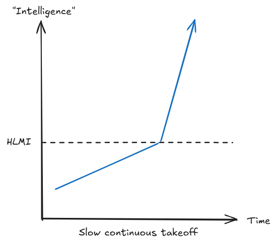{ loading=lazy }
  <figcaption markdown="1"><b>Figure 1.31 :</b> Une illustration d'un takeoff lent et continu. ([Martin & Eth, 2021](https://www.alignmentforum.org/posts/pGXR2ynhe5bBCCNqn/takeoff-speeds-and-discontinuities))</figcaption>
</figure>

**Qu'est-ce qu'un takeoff rapide ?** Le takeoff rapide (décollage ultrarapide de l'IA) décrit des scénarios où les capacités de l'intelligence artificielle progressent de manière foudroyante sur des périodes extrêmement brèves - parfois en quelques jours, voire en quelques heures. Contrairement à l'amélioration progressive observée entre GPT-3 et GPT-4, imaginez un système d'IA capable de réaliser des bonds technologiques comparables chaque jour. Ce phénomène pourrait survenir via un processus d'auto-amélioration récursive, où le système d'IA devient progressivement plus efficace à s'optimiser lui-même, déclenchant une boucle de progression exponentielle.

D'un point de vue mathématique, le takeoff rapide se caractérise par une croissance super-exponentielle ou hyperbolique, où le taux de progression s'accélère lui-même au fil du temps. Au lieu d'une progression où les capacités doublent annuellement, comme dans une croissance exponentielle classique, on observerait un doublement successif à des intervalles de plus en plus courts : mensuellement, puis hebdomadairement, et potentiellement quotidiennement. Ce phénomène fait écho aux discussions précédentes sur les boucles de rétroaction potentielles dans le développement de l'IA - si les systèmes d'IA deviennent capables d'optimiser intrinsèquement l'efficacité de la recherche en intelligence artificielle, on pourrait alors assister à une dynamique de progrès véritablement accélérée.

La vitesse spectaculaire du takeoff rapide soulève des défis singuliers en matière de sécurité des systèmes d'IA. Comme nous l'examinerons dans le chapitre consacré aux stratégies, nombre d'approches de sécurité actuelles reposent sur le test des systèmes, l'identification des problèmes et leur résolution progressive. Cependant, dans un scénario de takeoff rapide, nous ne disposerions probablement que d'une unique opportunité de réussite. Si un système d'IA amorce une auto-amélioration véloce, il devient crucial de concevoir des mesures de sécurité intrinsèquement fiables dès le stade initial, car nous ne disposerons d'aucun délai pour corriger les problèmes une fois qu'ils émergeront.

Des termes comme « takeoff rapide », « hard takeoff » et « FOOM » sont souvent utilisés de manière interchangeable.

<figure markdown="span">
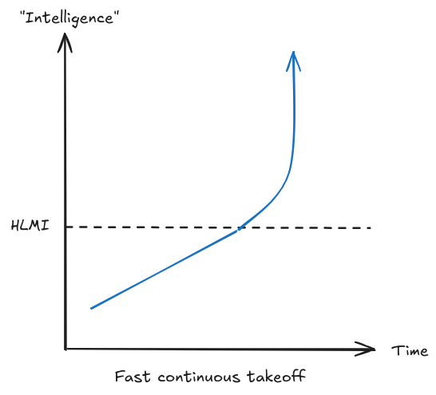{ loading=lazy }
  <figcaption markdown="1"><b>Figure 1.32 :</b> Une illustration d'un takeoff rapide et continu, généralement interprété comme une croissance super-exponentielle ou hyperbolique. Le taux de croissance lui-même augmente. ([Martin & Eth, 2021](https://www.alignmentforum.org/posts/pGXR2ynhe5bBCCNqn/takeoff-speeds-and-discontinuities))</figcaption>
</figure>

**Pourquoi la vitesse de takeoff est-elle cruciale pour les risques liés à l'IA ?** La vitesse du takeoff conditionne intrinsèquement les défis de sécurité de l'intelligence artificielle. Ce point s'inscrit directement dans la continuité de nos discussions précédentes sur les lois d'échelle et les tendances : si la progression suit des modèles prévisibles comme le suggère notre compréhension actuelle, nous pourrions bénéficier de signaux d'alerte et de temps pour nous préparer. Mais si de nouveaux mécanismes comme l'auto-amélioration récursive génèrent des boucles de rétroaction plus rapides, nous devrons alors développer des stratégies radicalement différentes.

Un exemple concret aide à illustrer ce point : Aujourd'hui, lorsque nous découvrons que les modèles de langage peuvent être contournés ou manipulés de manière malveillante (communément appelé « jailbreaking »), nous pouvons corriger ces vulnérabilités dans l'itération suivante. Dans un scénario de takeoff lent, ce modèle pourrait se poursuivre - nous aurions le temps de détecter et de résoudre progressivement les problèmes de sécurité. Mais dans un takeoff rapide, nous devrions impérativement anticiper et résoudre toutes les vulnérabilités potentielles avant le déploiement, car un système pourrait devenir si rapidement puissant qu'il deviendrait impossible de le modifier sans risques avant de pouvoir implémenter des corrections.

<figure markdown="span">
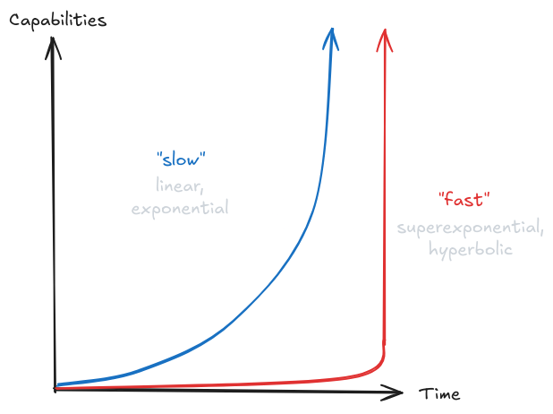{ loading=lazy }
  <figcaption markdown="1"><b>Figure 1.33 :</b> Comparaison du takeoff « lent » versus « rapide ». Illustrant que, bien que décrit linguistiquement comme plus lent que le takeoff rapide, il n'est en aucun cas « lent ». ([Christiano, 2018](https://sideways-view.com/2018/02/24/takeoff-speeds/))</figcaption>
</figure>

## 1.6.2 Continuité {: #02}

**Qu'est-ce que la continuité du takeoff ?** La continuité caractérise la progression des capacités de l'IA : se développent-elles de manière fluide et prévisible, ou par des bonds soudains et inattendus ? Ce concept diffère de la vitesse - un takeoff rapide peut demeurer continu s'il suit des modèles prévisibles, tandis qu'un takeoff lent peut être discontinu s'il implique des percées inopinées. Comprendre la continuité nous permet de déterminer si nous pouvons extrapoler les tendances actuelles, comme les lois d'échelle évoquées précédemment, ou si nous devons anticiper des écarts significatifs. En somme, si la vitesse mesure la rapidité avec laquelle l'IA devient superintelligente, la continuité évalue le degré d'imprévisibilité de cette progression.

**Qu'est-ce qu'un takeoff continu ?** Dans un processus de développement continu de l'IA, les capacités des systèmes intelligents progressent de manière fluide et prévisible. Les améliorations successives des modèles de langage illustrent parfaitement ce phénomène : chaque nouveau modèle tend à surpasser légèrement son prédécesseur dans des domaines comme le codage ou les mathématiques, en suivant des trajectoires que nous pouvons anticiper grâce aux lois d'échelle et aux améliorations algorithmiques. Comme nous l'avons observé dans la section de prévision, de nombreux aspects du développement de l'IA ont démontré ce type de progression cohérente et calculable.

Un progrès continu ne signifie pas un progrès linéaire ou simple. Il peut toujours impliquer une croissance exponentielle, voire super-exponentielle, mais l'élément clé est que cette croissance suit des modèles que nous pouvons anticiper. Pensez à la façon dont GPT-4 est meilleur que GPT-3, qui était lui-même meilleur que GPT-2 - chaque amélioration était significative mais pas totalement surprenante étant donné l'augmentation d'échelle et les techniques d'entraînement améliorées.

Un takeoff continu suggère que les tendances actuelles en matière de lois d'échelle et de progrès algorithmique pourraient s'étendre même aux systèmes d'IA transformationnels. Cela nous donnerait plus de signaux d'alerte concernant les capacités émergentes et une meilleure capacité à préparer des mesures de sécurité appropriées. Comme nous le discuterons dans le chapitre sur la gouvernance, bien que le progrès soit rapide, cette prévisibilité rend comparativement plus facile le développement et la mise en œuvre de réglementations avant que les systèmes d'IA ne deviennent extrêmement puissants ou incontrôlables. En gardant à l'esprit, bien sûr, que « comparativement plus facile » ne signifie pas « facile ».

**Qu'est-ce qu'un takeoff discontinu ?** Un takeoff discontinu se caractérise par des bonds capacitaires inattendus qui s'écartent radicalement des modèles de développement antérieurs. Plutôt que des améliorations progressives des performances lors de l'ajout de puissance de calcul ou de données, nous pourrions être témoins de l'émergence de capacités complètement inédites, non anticipées par les tendances existantes. Un exemple hypothétique serait le développement soudain, par un système d'IA, de capacités robustes de raisonnement général, après n'avoir semblé traiter que des tâches spécialisées - illustrant une véritable discontinuité dans le modèle de progression de l'intelligence artificielle.

Les discontinuités pourraient surgir par divers mécanismes. Nous pourrions découvrir des approches d'entraînement fondamentalement innovantes, significativement plus performantes que les méthodes actuelles. Ou, comme nous l'avons évoqué dans la section sur la mise à l'échelle, nous pourrions atteindre des seuils critiques où des améliorations quantitatives de l'échelle engendrent des mutations qualitatives des capacités. Un système d'IA pourrait même identifier de telles améliorations le concernant, provoquant des progressions capacitaires totalement inattendues.

L'histoire scientifique offre des précédents à la fois pour des progressions continues et discontinues. Le développement des armes nucléaires a représenté un bond discontinu dans la puissance explosive, tandis que les améliorations de la puissance de traitement informatique ont suivi des tendances plus continues. Cependant, comme nous l'avons vu dans la section de prévision, les discontinuités technologiques ont historiquement été rares, ce que certains chercheurs citent comme une preuve favorisant les scénarios de takeoff continu.

Les termes « takeoff rapide » et « takeoff discontinu » sont souvent utilisés de manière interchangeable. Cependant, les images ci-dessous illustrant différentes trajectoires de takeoff pourraient aider à clarifier les différences subtiles entre ces concepts.

**Pourquoi la continuité est-elle importante pour la sécurité de l'IA ?** La continuité du progrès de l'IA a des implications cruciales sur notre approche de la sécurité. Dans un takeoff continu, nous pouvons tester les mesures de sécurité de manière plus fiable sur des systèmes moins capables et avoir une confiance accrue qu'elles fonctionneront sur des systèmes plus avancés. Nous pouvons également mieux anticiper le moment où nous aurons besoin de différentes mesures de sécurité et planifier stratégiquement en conséquence.

<figure markdown="span">
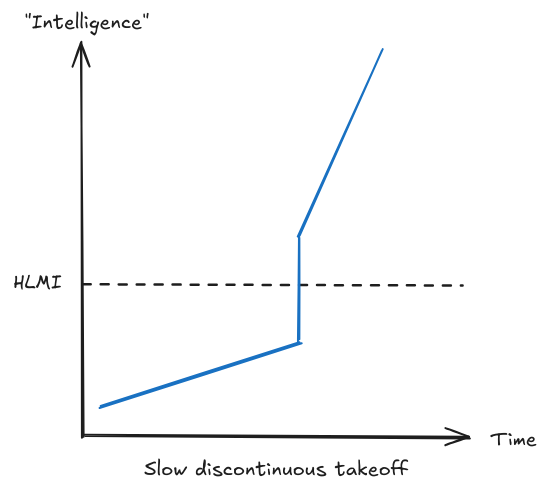{ loading=lazy }
  <figcaption markdown="1"><b>Figure 1.34 :</b> Un exemple illustratif de takeoff lent et discontinu, où même si le progrès continue d'augmenter, nous pourrions observer des « bonds » soudains dans la progression. ([Martin & Eth, 2021](https://www.alignmentforum.org/posts/pGXR2ynhe5bBCCNqn/takeoff-speeds-and-discontinuities))</figcaption>
</figure>

<figure markdown="span">
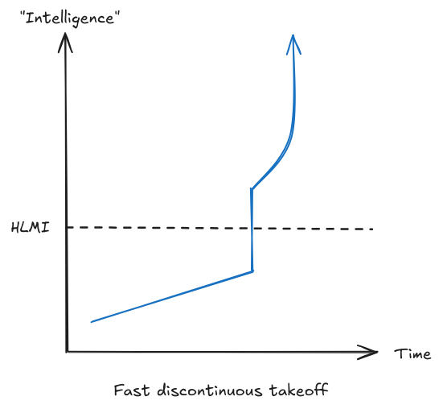{ loading=lazy }
  <figcaption markdown="1"><b>Figure 1.35 :</b> Un exemple illustratif de takeoff rapide et discontinu. Bien que le progrès continue de s'accélérer, nous pourrions également observer des « bonds » soudains dans la progression. ([Martin & Eth, 2021](https://www.alignmentforum.org/posts/pGXR2ynhe5bBCCNqn/takeoff-speeds-and-discontinuities))</figcaption>
</figure>

## 1.6.3 Similarité

**Qu'est-ce que l'homogénéité du takeoff ?** L'homogénéité décrit le degré de similarité ou de différence entre les systèmes d'IA durant la période de takeoff. Assisterons-nous à l'émergence de nombreux systèmes d'IA diversifiés, avec des architectures et des capacités distinctes, ou la majorité des systèmes d'IA avancés seront-ils des variations d'une architecture fondamentale commune ? Il ne s'agit pas simplement de diversité technique, mais de comprendre si ces systèmes d'IA avancés partageront des comportements, des limitations et des propriétés de sécurité analogues. ([Hubinger, 2020](https://www.alignmentforum.org/posts/mKBfa8v4S9pNKSyKK/homogeneity-vs-heterogeneity-in-ai-takeoff-scenarios))

**Qu'est-ce qu'un takeoff homogène ?** Dans un takeoff homogène, la plupart des systèmes d'IA avancés seraient fondamentalement similaires. Nous pouvons déjà observer des indices de ce modèle aujourd'hui - de nombreux modèles de langage actuels sont basés sur l'architecture transformer et entraînés sur des ensembles de données comparables, ce qui conduit à des capacités et des limitations analogues. Dans un tel scénario de takeoff, ce modèle se poursuivrait. Il est probable que la majorité des systèmes d'IA consisteraient en des versions affinées de quelques modèles de base, ou en différentes implémentations d'une même percée fondamentale dans la conception de l'IA.

Un facteur clé susceptible de favoriser l'homogénéité est l'échelle considérable requise pour entraîner des systèmes d'IA avancés. Si l'entraînement d'une IA transformative nécessite des ressources de calcul massives, comme le suggèrent les lois d'échelle, seules quelques organisations pourraient être capables de former des modèles de base à partir de zéro. D'autres organisations s'appuieraient sur ces modèles de base plutôt que de développer des architectures entièrement nouvelles, conduisant à des systèmes plus homogènes.

Un takeoff homogène pourrait présenter des avantages en termes de sécurité, mais aussi comporter des risques significatifs. Si nous parvenons à résoudre l'alignement pour un système d'IA, cette solution pourrait potentiellement s'appliquer à d'autres systèmes similaires. Néanmoins, la présence d'un défaut fondamental dans l'architecture commune ou l'approche d'entraînement pourrait compromettre simultanément l'ensemble des systèmes. C'est un peu comme une monoculture en agriculture : plus simple à gérer, mais intrinsèquement plus vulnérable aux faiblesses structurelles.

<figure markdown="span">
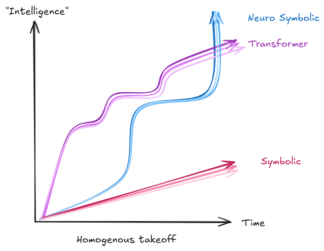{ loading=lazy }
  <figcaption markdown="1"><b>Figure 1.36 :</b> Une illustration du takeoff homogène. Nous pouvons observer plusieurs architectures de modèles globales différentes. La figure en montre trois dans des couleurs distinctes. Au sein de chaque architecture, le takeoff est approximativement similaire en raison de la similarité dans la conception, les réglementations et les mesures de sécurité. **REMARQUE** : Les courbes représentant les architectures sont purement illustratives et ne visent pas à indiquer des trajectoires de croissance prédites ou des comparaisons entre différentes architectures.</figcaption>
</figure>

**Qu'est-ce qu'un takeoff hétérogène ?** Dans un takeoff hétérogène, nous assisterions à une diversité significative parmi les systèmes d'IA avancés. Différentes organisations pourraient développer des approches fondamentalement distinctes de l'IA, donnant naissance à des systèmes aux forces, faiblesses et comportements variés.

Certains systèmes pourraient être spécialisés dans des domaines spécifiques, tandis que d'autres seraient plus généraux. Certains seraient plus transparents, d'autres plus opaques. Certains seraient mieux alignés avec les valeurs humaines, tandis que d'autres le seraient moins. 

Les dynamiques concurrentielles entre les projets d'IA pourraient accentuer cette diversité, les équipes cherchant à obtenir des percées sans nécessairement harmoniser leurs méthodologies ou partager des informations cruciales.

À titre d'exemple, nous pourrions envisager un futur où l'IA devient un atout stratégique national, son développement étant soigneusement protégé. Dans un tel environnement, la quête des capacités d'IA deviendrait cloisonnée, chaque entreprise ou pays déployant ses propres méthodologies de développement. Il en résulterait potentiellement un large spectre de comportements, de fonctionnalités et de niveaux de sécurité.

Un takeoff hétérogène soulève des défis distincts en matière de sécurité. Il nous faudrait élaborer des mesures de sécurité capables de fonctionner à travers des systèmes diversifiés, sans pouvoir nécessairement transposer les leçons apprises d'un système à l'autre. Néanmoins, cette diversité pourrait offrir une forme de protection contre les risques systémiques : si une approche s'avère périlleuse, des alternatives subsisteraient.

**Comment l'homogénéité du takeoff affecte-t-elle le tableau d'ensemble ?** Le degré d'homogénéité durant le takeoff a des implications significatives sur la façon dont l'IA transformative pourrait se développer. Dans un scénario homogène, le progrès pourrait être plus prévisible mais aussi plus enclin aux dynamiques de monopolisation. Un scénario hétérogène pourrait être plus robuste contre les points de défaillance uniques mais plus difficile à surveiller et à contrôler.

<figure markdown="span">
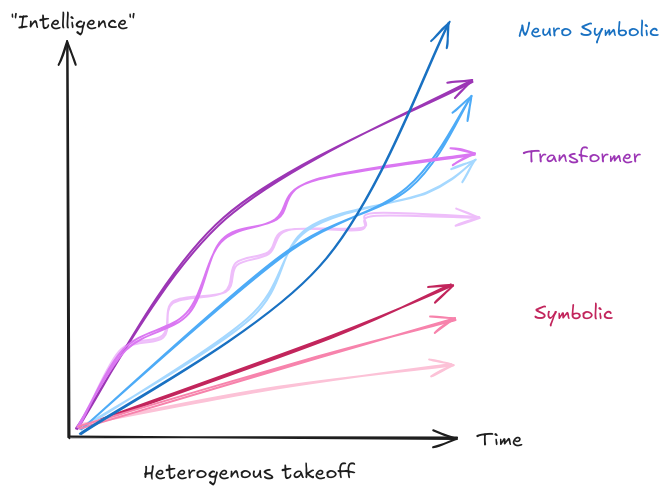{ loading=lazy }
  <figcaption markdown="1"><b>Figure 1.37 :</b> Un exemple de takeoff hétérogène. Nous pouvons observer plusieurs architectures de modèles globales différentes. La figure en montre trois dans des couleurs distinctes. Au sein de chaque architecture, le takeoff diffère en raison des variations dans la conception, les réglementations et les mesures de sécurité. **REMARQUE** : Les courbes représentant les architectures sont purement illustratives et ne visent pas à indiquer des trajectoires de croissance prédites ou des comparaisons entre différentes architectures.</figcaption>
</figure>

## 1.6.4 Polarité

**Qu'est-ce que la polarité du takeoff ?** La polarité décrit si le pouvoir et les capacités se concentrent dans un système d'IA ou une organisation unique, ou restent distribués entre plusieurs acteurs. En d'autres termes, un système d'IA ou un groupe va-t-il prendre significativement de l'avance sur tous les autres, ou plusieurs systèmes d'IA progresseront-ils en parallèle avec des capacités comparables ?

**Qu'est-ce qu'un takeoff unipolaire ?** Dans un takeoff unipolaire, un système d'IA ou une organisation prend une avance décisive sur tous les autres. Cela pourrait survenir par une percée unique, des avantages exceptionnels de mise à l'échelle, ou une auto-amélioration récursive. 

Par exemple, si un système d'IA devient suffisamment capable pour accélérer substantiellement son propre développement, il pourrait rapidement dépasser tous les autres systèmes. Les mathématiques du calcul d'entraînement offrent une voie vers un résultat unipolaire. Si un doublement du calcul conduit à des améliorations fiables des capacités, une organisation qui prend suffisamment d'avance dans l'acquisition de capacités de calcul pourrait maintenir ou étendre son avantage.

Ses systèmes améliorés pourraient ensuite l'aider à développer des méthodes d'entraînement et du matériel encore plus performants, tout en attirant des investissements. Cela créerait une boucle de rétroaction positive que d'autres ne peuvent pas égaler.

Mais le calcul n'est pas la seule voie vers l'unipolarité. Une seule organisation pourrait découvrir une approche d'entraînement fondamentalement meilleure, ou développer un système d'IA qui excelle davantage à s'améliorer lui-même qu'à aider les humains à construire des alternatives. Une fois qu'un acteur prend suffisamment d'avance, il pourrait devenir pratiquement impossible pour les autres de le rattraper.

<figure markdown="span">
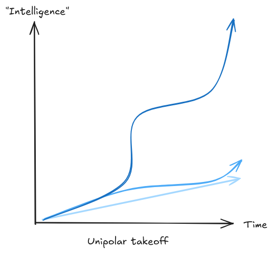{ loading=lazy }
  <figcaption markdown="1"><b>Figure 1.38 :</b> Une illustration du takeoff unipolaire. Un modèle (en bleu foncé ici) surpasse significativement tous les autres.</figcaption>
</figure>

**Qu'est-ce qu'un takeoff multipolaire ?** Dans un scenario multipolaire, plusieurs systèmes d'IA ou organisations développent des capacités avancées de manière parallèle. Cela pourrait se manifester de deux façons : soit plusieurs grands laboratoires créent des systèmes d'IA différents mais comparablement puissants, soit de nombreux acteurs ont accès à des capacités d'IA similaires via des modèles open source ou des services d'IA.

Le paysage actuel de l'IA présente déjà des éléments de multipolarité : plusieurs organisations peuvent entraîner de grands modèles de langage, et les techniques développées par un laboratoire sont rapidement adoptées par d'autres. Un takeoff multipolaire pourrait prolonger cette dynamique, avec plusieurs groupes maintenant des capacités comparables, même lorsque celles-ci deviennent transformatives.

Un scénario unipolaire soulève des inquiétudes sur la concentration du pouvoir, tandis qu'un monde multipolaire pose des défis de coordination entre des entités ou des systèmes d'IA diversifiés. Les deux scenarios - unipolaire et multipolaire - recèlent un potentiel de mauvaise utilisation des capacités d'IA avancées par des acteurs humains.

<figure markdown="span">
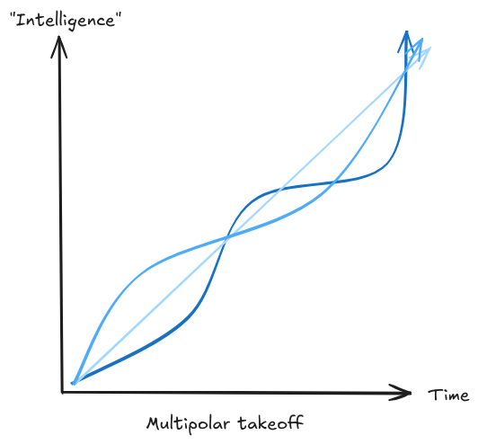{ loading=lazy }
  <figcaption markdown="1"><b>Figure 1.39 :</b> Une illustration du takeoff multipolaire. Aucun modèle ne surpasse significativement tous les autres, et ils progressent tous à un rythme approximativement compétitif les uns par rapport aux autres.</figcaption>
</figure>

**Pourquoi la polarité est-elle importante ?** La polarité du takeoff présente des implications majeures tant pour les risques de sécurité que pour les solutions potentielles. Dans un scénario unipolaire, les actions et l'alignement d'un système ou d'une organisation unique deviennent cruciaux - ils pourraient acquérir la capacité de façonner unilatéralement l'avenir à long terme. Cela concentre les risques en un point de vulnérabilité unique, mais pourrait également faciliter la coordination, car moins d'acteurs doivent se concerter.

Un scénario multipolaire soulève des défis différents. Plusieurs systèmes avancés pourraient agir de manière contradictoire ou se livrer une concurrence pour les ressources. Cette situation pourrait générer une pression incitant au déploiement rapide des systèmes ou à des compromis sur la sécurité. Il existe par ailleurs une interaction importante entre la polarité et les autres aspects du takeoff que nous avons précédemment abordés. Un takeoff rapide serait plus susceptible de devenir unipolaire, car le premier système réalisant des progrès significatifs pourrait rapidement distancer tous les autres. Un takeoff plus lent tendrait davantage vers la multipolarité, offrant plus de temps aux acteurs pour combler leurs retards initiaux.

**Facteurs influençant la polarité**. Plusieurs éléments clés influencent la tendance de la polarité du takeoff vers un résultat unipolaire ou multipolaire :

- Vitesse du développement de l'IA : Un takeoff rapide pourrait favoriser un résultat unipolaire en donnant un avantage significatif au développeur le plus rapide. À l'inverse, un takeoff plus lent pourrait conduire à un monde multipolaire où de nombreuses entités atteignent des capacités avancées de manière plus ou moins simultanée.

- Collaboration vs. Compétition : Le degré de collaboration et d'ouverture au sein de la communauté de recherche en IA peut significativement influencer la polarité du takeoff. Des niveaux élevés de collaboration et de partage d'informations pourraient soutenir un résultat multipolaire, tandis que des environnements secrets ou hautement compétitifs pourraient pousser vers l'unipolarité.

- Dynamiques réglementaires et économiques : Les cadres réglementaires et les incitations économiques constituent un facteur déterminant. Des politiques visant à promouvoir la diversité dans le développement de l'IA et à prévenir une concentration excessive du pouvoir pourraient favoriser l'émergence d'un takeoff multipolaire.

## 1.6.5 Arguments sur le Takeoff

**L'argument de l'Overhang**. Il peut exister des situations où des avancées substantielles sont observées dans un aspect du système d'IA, tel que le matériel ou les données, tandis que les logiciels ou algorithmes correspondants permettant d'exploiter pleinement ces ressources n'ont pas encore été développés. Le terme 'overhang' est utilisé car ces situations impliquent un potentiel encore inexploité. Une fois que les logiciels ou algorithmes rattraperont le niveau du matériel ou des données, on pourrait assister à une libération soudaine de ce potentiel, conduisant à une progression rapide des capacités de l'IA. Les overhangs constituent ainsi un argument plausible en faveur des takeoffs discontinus ou rapides. Deux types principaux d'overhangs sont généralement discutés dans la littérature :

- **Hardware Overhang** : Cela fait référence à une situation où l'infrastructure matérielle existe en quantité suffisante pour supporter de nombreux systèmes d'IA puissants, mais où les logiciels permettant de les exploiter pleinement n'ont pas encore été développés. Si cette infrastructure pouvait être réaffectée à l'IA, cela signifierait qu'aussitôt qu'un système d'IA puissant serait mis au point, un grand nombre d'autres pourraient rapidement suivre, amplifiant potentiellement l'impact de l'émergence d'une IA équivalente aux capacités humaines.

- **Overhang de données** : Il s'agirait d'une situation où une abondance de données disponibles pourrait être utilisée pour l'entraînement des systèmes d'IA, mais où les algorithmes d'IA capables d'exploiter efficacement toutes ces données n'ont pas encore été développés ou déployés.

Les overhangs sont également utilisés comme contre-argument expliquant pourquoi les pauses dans le développement de l'IA n'influencent pas le takeoff. Un contre-argument à l'argument de l'overhang repose sur l'hypothèse que pendant la période de pause du développement de l'IA, le rythme de production de puces restera constant. On pourrait arguer que les entreprises fabricant ces puces réduiraient leur production si les centres de données cessaient de les commander. Toutefois, cet argument ne tient que si la pause est suffisamment longue ; dans le cas contraire, les centres de données pourraient simplement constituer des stocks de puces. Il est également envisageable de progresser dans la conception de puces améliorées sans nécessairement maintenir un rythme de fabrication élevé durant la période de pause. Parallèlement, cette même période pourrait être mise à profit pour développer des techniques de sécurité de l'IA. ([Elmore, 2024](https://www.youtube.com/watch?v=Q3eRy4t2oPQ))

**L'argument de la croissance économique**. Les modèles historiques de croissance économique, stimulés par l'augmentation de la population humaine, suggèrent un potentiel de takeoff lent et continu de l'IA. Cet argument avance que lorsque les IA augmentent la capacité productive effective, nous pourrions assister à une progression graduelle de la croissance économique, reproduisant les expansions passées mais à un rythme potentiellement accéléré grâce à l'automatisation permise par l'IA. Les limitations de l'IA dans sa capacité à automatiser certaines tâches, ainsi que les contraintes sociétales et réglementaires (par exemple, que les services médicaux ou juridiques ne peuvent être rendus que par des humains), pourraient conduire à une expansion plus progressive des capacités de l'IA. Alternativement, la croissance pourrait largement dépasser les taux historiques. Utiliser un argument similaire pour un takeoff rapide repose sur le potentiel de l'IA à automatiser rapidement le travail humain à grande échelle, conduisant à une accélération économique sans précédent.

<figure markdown="span">
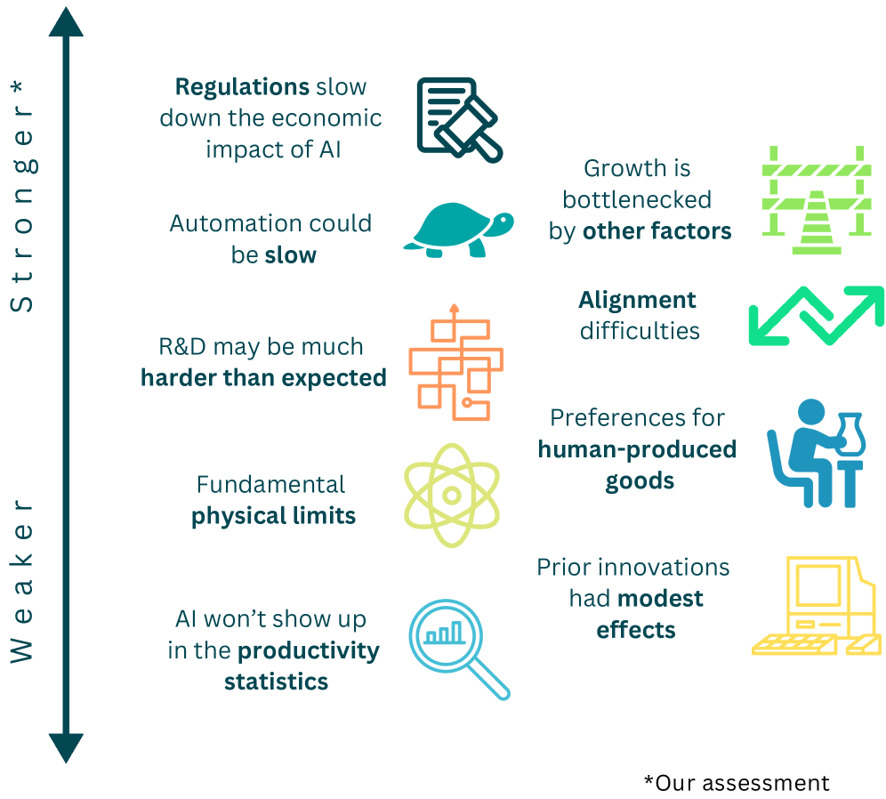{ loading=lazy }
  <figcaption markdown="1"><b>Figure 1.40 :</b> Une visualisation du classement des arguments en faveur et contre une croissance économique explosive. Par Epoch AI. ([Erdil & Besiroglu, 2024](https://arxiv.org/abs/2309.11690))</figcaption>
</figure>

**Argument du Takeoff centré sur la capacité de calcul**. Cet argument, similaire au rapport Bio Anchors, part du principe que la capacité de calcul sera suffisante pour développer une IA transformatrice. Sur la base de cette hypothèse, le rapport de Tom Davidson de 2023 sur le développement de l'IA selon une approche centrée sur la capacité de calcul explore les boucles de rétroaction susceptibles d'influencer la dynamique du takeoff.

- **Boucle de rétroaction des investissements** : On pourrait observer une augmentation progressive des investissements dans l'IA, à mesure que ces technologies jouent un rôle croissant dans l'économie. Cette dynamique permet d'accroître la capacité de calcul disponible pour l'entraînement des modèles, et peut potentiellement stimuler la découverte de nouveaux algorithmes. L'ensemble de ces processus amplifie les capacités, stimule le progrès économique et, par ricochet, encourage de nouveaux investissements.

- **Boucle de rétroaction de l'automatisation** : À mesure que les IA deviennent plus performantes, elles seront capables d'automatiser des portions croissantes du travail de conception d'algorithmes d'IA améliorés, ou d'assister dans la conception de meilleurs GPU. Ces avancées augmenteront les capacités des IA, qui pourront alors automatiser encore plus de tâches, amplifiant ainsi ce cycle d'amélioration continue.

Selon la force et l'interaction de ces boucles de rétroaction, elles peuvent engendrer un processus d'auto-amplification conduisant soit à un takeoff rapide et accéléré – en l'absence de réglementations limitant ces dynamiques – soit à un takeoff plus progressif si ces boucles sont plus faibles ou compensées par d'autres facteurs. L'ensemble du modèle est représenté dans le diagramme suivant :

<figure markdown="span">
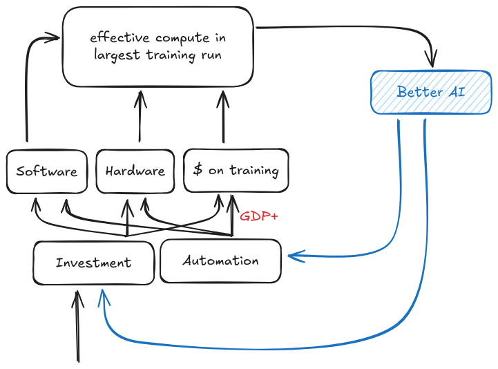{ loading=lazy }
  <figcaption markdown="1"><b>Figure 1.41 :</b> Un résumé de ce qu'un cadre centré sur la capacité de calcul nous apprend sur les vitesses de takeoff ([Davidson, 2024](https://www.openphilanthropy.org/research/what-a-compute-centric-framework-says-about-takeoff-speeds/))</figcaption>
</figure>

**Argument de l'automatisation de la recherche.** Les chercheurs pourraient potentiellement accélérer la conception de la prochaine génération de modèles d'apprentissage automatique en déléguant certaines tâches de recherche aux modèles existants, amorçant ainsi une boucle de rétroaction où le progrès s'auto-accélère. L'argument suivant est avancé par Ajeya Cotra :

Actuellement, les chercheurs humains sont collectivement responsables de la quasi-totalité des avancées dans la recherche en IA, mais commencent à déléguer une fraction marginale de leurs travaux aux grands modèles de langage (LLM), ce qui facilite progressivement la conception et l'entraînement des générations de modèles suivantes.

La génération suivante sera capable de traiter des tâches plus complexes et de gérer une diversité croissante de problématiques, incitant les chercheurs humains à leur déléguer progressivement une part plus substantielle de leurs travaux de recherche. Cela facilitera significativement l'entraînement de la génération ultérieure, avec un potentiel d'amélioration nettement supérieur aux cycles précédents.

Chaque cycle de ce processus fait avancer le domaine de plus en plus rapidement. À chaque étape, les chercheurs humains délèguent tout ce qu'ils peuvent déléguer de manière productive à la génération actuelle de modèles — et plus ces modèles sont puissants, plus ils contribuent à la recherche et donc plus les capacités de l'IA peuvent s'améliorer rapidement. ([Cotra, 2023](https://www.planned-obsolescence.org/ais-accelerating-ai-research/))

Avant de voir une explosion de l'intelligence par un processus récursif, nous observerons une augmentation progressive de la part du processus complet de R&D déléguée aux IA. À un certain point, ce ne sera plus seulement une majorité significative de la recherche et de la conception qui sera réalisée par des assistants IA à des vitesses surhumaines, mais l'intégralité de la recherche et de la conception des IA.

À ce stade, il existe une possibilité que cela puisse éventuellement conduire à une explosion récursive de l'intelligence entièrement automatisée.

**L'Argument de l'Explosion de l'Intelligence**. Ce concept d'« explosion de l'intelligence » est également central dans la discussion autour d'un passage soudain et non linéaire vers la superintelligence. Il trouve son origine dans la thèse d'I.J. Good, qui postule qu'une intelligence machine suffisamment avancée pourrait construire une version plus intelligente d'elle-même. Cette version plus intelligente pourrait à son tour construire une version encore plus intelligente, et ainsi de suite, créant un cycle pouvant conduire à une intelligence dépassant largement les capacités humaines ([Yudkowsky, 2013](https://intelligence.org/files/IEM.pdf)).

Dans leur rapport de 2012 sur les preuves des explosions d'intelligence, Muehlhauser et Salamon examinent en profondeur les nombreux avantages que l'IA détient sur l'intelligence humaine, qui permettent une augmentation rapide de l'intelligence. ([Muehlhauser, 2012](https://intelligence.org/files/IE-EI.pdf)) Ceux-ci comprennent :

- **Ressources de calcul** : Les capacités de calcul humaines sont limitées, tandis que les machines disposent d'une capacité de calcul hautement extensible.

- **Vitesse** : Les humains communiquent à un rythme de deux mots par seconde, tandis que GPT-4 peut traiter 32k mots instantanément. Une fois que les LLM pourront écrire « mieux » que les humains, leur vitesse les surpassera très certainement.

- **Reproductibilité** : Les machines se distinguent par leur capacité de reproduction quasi instantanée. Contrairement aux humains, elles n'ont pas besoin de passer par les étapes de naissance, d'éducation ou de formation. Là où les humains progressent principalement de manière individuelle, les machines offrent un potentiel de développement collectif. Alors que les humains nécessitent environ 20 ans pour atteindre une compétence depuis leur naissance, une IA performante peut être dupliquée immédiatement une fois développée. Une fois que les IA atteignent le niveau du meilleur programmeur, il devient possible de les reproduire à l'identique. Ce principe s'applique de manière analogue à divers domaines professionnels.

- **Modifiabilité** : Les machines offrent potentiellement des possibilités de variation plus contrôlées. Elles illustrent l'équivalent d'améliorations cérébrales directes via la neurochirurgie, en contraste avec les processus laborieux d'apprentissage et de formation. Les humains peuvent également progresser et acquérir de nouvelles compétences, mais ils ne disposent pas d'un accès fundamental à leur propre système : nous commençons à peine à déchiffrer le code complexe du génome, alors qu'une IA pourrait utiliser des outils de versionnage de code pour s'améliorer, capable de tenter des expériences risquées avec des mécanismes de sauvegarde en cas d'échec. Cela permet une variation bien plus maîtrisée.

- **Coordination des objectifs** : Les IA dupliquées peuvent partager des objectifs avec une facilité déconcertante, contrairement aux humains.