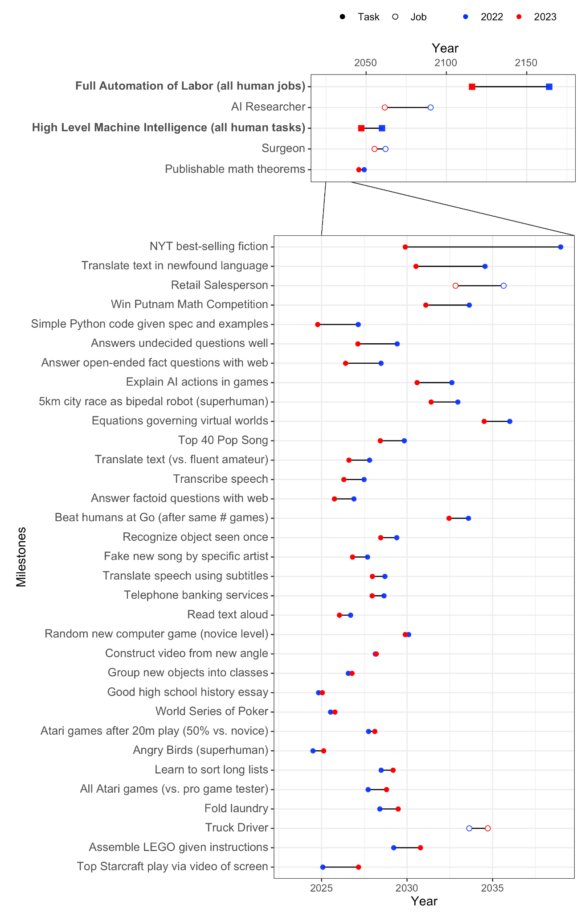

# 1.A1 Opinions d'Experts

!!! warning "Tout ce qui se trouve dans les annexes est facultatif et vise à fournir des connaissances et un contexte supplémentaires. Vous n'avez pas besoin de lire ceci pour comprendre les points essentiels de ce chapitre ou des chapitres futurs."

<figure class="video-figure" markdown="span">
<iframe style="width: 100%; aspect-ratio: 16 / 9;" frameborder="0" allowfullscreen src="https://www.youtube.com/embed/NqmUBZQhOYw"></iframe>
  <figcaption markdown="1"><b>Vidéo 1.3 :</b> Vidéo facultative présentant quelques points de vue d'experts en IA sur la sécurité et les risques.</figcaption>
</figure>

<figure class="iframe-figure" markdown="span">
<iframe src="https://ourworldindata.org/grapher/views-ai-impact-society-next-20-years?tab=chart" loading="lazy" style="width: 100%; height: 600px; border: 0px none;" allow="web-share; clipboard-write"></iframe>
  <figcaption markdown="1"><b>Figure interactive 1.13 :</b> Opinions publiques sur l'impact des IA sur la société ([Giattino et al., 2023](https://ourworldindata.org/artificial-intelligence))</figcaption>
</figure>

<figure class="iframe-figure" markdown="span">
<iframe src="https://ourworldindata.org/grapher/views-of-americans-robot-vs-human-intelligence?tab=chart" loading="lazy" style="width: 100%; height: 600px; border: 0px none;" allow="web-share; clipboard-write"></iframe>
  <figcaption markdown="1"><b>Figure interactive 1.14 :</b> Opinions du public sur l'intelligence des machines par rapport à l'intelligence humaine. ([Giattino et al., 2023](https://ourworldindata.org/artificial-intelligence))</figcaption>
</figure>

## 1.A1.1 Enquêtes {: #01}

D'après une récente enquête menée par AI Impact ([AI Impacts, 2022](https://aiimpacts.org/wp-content/uploads/2023/04/Thousands_of_AI_authors_on_the_future_of_AI.pdf)) : *"**Le délai anticipé pour atteindre des performances de niveau humain a diminué de 1 à 5 décennies depuis l'enquête de 2022. Comme toujours, nos questions sur l'« intelligence machine de haut niveau » (HLMI) et l'« automatisation complète du travail » (FAOL) ont suscité des réponses très contrastées, avec des divergences significatives entre les individus (représentées par les lignes fines ci-dessous), mais les prévisions agrégées pour les deux ensembles de questions ont considérablement baissé. Pour contexte, entre les enquêtes de 2016 et 2022, les prévisions pour la HLMI n'avaient évolué que d'environ un an.**"*

<figure markdown="span">
{ loading=lazy }
  <figcaption markdown="1"><b>Figure 1.42 :</b> Enquête 2024 auprès des experts en IA ([AI Impacts, 2022](https://blog.aiimpacts.org/p/2023-ai-survey-of-2778-six-things))</figcaption>
</figure>

On peut également comparer les prédictions de la même étude en 2022 aux résultats actuels. Il est frappant de constater que la communauté a largement sous-estimé le rythme des avancées technologiques en 2023 et a revu ses prévisions à la baisse. Certaines prédictions sont particulièrement surprenantes. Par exemple, des tâches comme "Rédiger une dissertation de lycée" et "Transcrire la parole" sont déjà pratiquement automatisées grâce à ChatGPT et Whisper. Pourtant, il semblerait que les chercheurs ne soient pas conscients de ces réalisations. Qui plus est, il est étonnant que les perspectives de développement d'un "chercheur IA" semblent plus lointaines que celles d'une "intelligence machine de haut niveau capable de réaliser toutes les tâches humaines".

La médiane de l'enquête d'experts de 2024 prévoit une intelligence machine de niveau humain (HLMI) en 2049.

## 1.A1.2 Citations {: #02}

Voici de nombreuses citations de personnes concernant l'IA transformative.

### 1.A1.2.1 Experts en IA {: #02-01}

Notez que Hinton, Bengio et Sutskever sont parmi les chercheurs les plus cités dans le domaine de l'IA. De plus, Hinton, Bengio et LeCun ont reçu le prix Turing pour leurs contributions à l'apprentissage profond. Quelques utilisateurs de Reddit ont par ailleurs constitué une liste exhaustive des prévisions publiques sur l'évolution de l'IA, compilées auprès de chercheurs renommés et de leaders de l'industrie.

!!! quote "Geoffrey Hinton (Parrain de l'IA moderne, Lauréat du prix Turing)"

« La question de recherche est : comment les empêcher de chercher à prendre le contrôle ? Et personne ne connaît la réponse [...] La sonnette d'alarme que je fais retentir concerne le risque existentiel de les voir prendre le contrôle [...] Si l'on prend au sérieux le risque existentiel, comme je le fais maintenant, il pourrait être assez sensé de simplement cesser de développer ces technologies plus avant [...] c'est comme si des extraterrestres avaient débarqué et que personne ne s'en était rendu compte parce qu'ils parlent un anglais parfait »

La question clé est de comprendre les *incitations économiques* qui peuvent influencer le développement de l'IA. Certains chercheurs identifient des *points de bascule* critiques dans l'évolution technologique.

Plusieurs mécanismes de risque sont à considérer :

*[Détournement de récompense]* : Lorsqu'un agent d'IA exploite des failles ou des raccourcis dans l'environnement pour maximiser sa récompense sans atteindre l'objectif initialement visé.

*[Objectif proxy]* : Objectif qui atteint une bonne performance sur l'objectif visé en raison d'une corrélation artificielle dans la distribution d'entraînement.

Ces mécanismes impliquent des *sous-objectifs*, qui sont des objectifs poursuivis comme moyens pour atteindre une autre finalité, plutôt que comme une fin en soi.

Des concepts comme la *Volition Extrapolée Cohérente* (CEV) et la *Volition Agrégée Cohérente* (CAV) cherchent à comprendre comment aligner les objectifs des systèmes d'IA avec les intentions humaines.

!!! quote "Yoshua Bengio (Un des scientifiques les plus cités de tous les temps, Parrain de l'IA moderne, Lauréat du prix Turing)"

La question clé est de comprendre les incitations économiques potentielles qui peuvent influencer le développement de l'IA. Certains chercheurs identifient des points de bascule critiques dans l'évolution technologique rapide.

Plusieurs mécanismes de risque sont à considérer :

*[Détournement de récompense]* : Lorsqu'un agent d'IA exploite des failles ou des raccourcis dans l'environnement pour maximiser sa récompense sans atteindre l'objectif initialement visé.

*[Objectif proxy]* : Objectif qui atteint une bonne performance sur l'objectif visé en raison d'une corrélation artificielle dans la distribution d'entraînement.

Ces mécanismes impliquent des sous-objectifs, qui sont des objectifs poursuivis comme moyens pour atteindre une autre finalité, plutôt que comme une fin en soi.

Des concepts comme la Volition Extrapolée Cohérente (CEV) et la Volition Agrégée Cohérente (CAV) cherchent à comprendre comment aligner les objectifs des systèmes d'IA avec les intentions humaines.

« C'est très difficile, en termes d'ego et de satisfaction personnelle, d'accepter l'idée que ce sur quoi vous avez travaillé pendant des décennies pourrait effectivement être très dangereux pour l'humanité... Je pense que je ne voulais pas trop y réfléchir, et c'est probablement le cas pour d'autres [...] Une IA hors de contrôle peut représenter un danger existentiel pour l'ensemble de l'humanité. Interdire les systèmes d'IA puissants (au-delà des capacités de GPT-4) dotés d'autonomie et d'agentivité serait un bon point de départ. »

La question clé est de comprendre les *motivations économiques* qui peuvent influencer le développement de l'IA. Certains chercheurs identifient des *points de bascule* critiques dans l'évolution technologique.

Plusieurs mécanismes de risque sont à considérer :

*[Détournement de récompense]* : Lorsqu'un agent d'IA exploite des failles ou des raccourcis dans l'environnement pour maximiser sa récompense sans atteindre l'objectif initialement visé.

*[Objectif proxy]* : Objectif qui atteint une bonne performance sur l'objectif visé en raison d'une corrélation artificielle dans la distribution d'entraînement.

Ces mécanismes impliquent des *sous-objectifs*, qui sont des objectifs poursuivis comme moyens pour atteindre une autre finalité, plutôt que comme une fin en soi.

Des concepts comme la *Volition Extrapolée Cohérente* (CEV) et la *Volition Agrégée Cohérente* (CAV) cherchent à comprendre comment aligner les objectifs des systèmes d'IA avec les intentions humaines.

!!! quote "Yann LeCun (Parrain de l'IA moderne, Lauréat du prix Turing, Directeur scientifique de l'IA chez Meta)"

La question clé est de comprendre les *incitations économiques* qui peuvent influencer le développement de l'IA. Certains chercheurs identifient des *points de bascule* critiques dans l'évolution technologique.

Plusieurs mécanismes de risque sont à considérer :

*[Détournement de récompense]* : Lorsqu'un agent d'IA exploite des failles ou des raccourcis dans l'environnement pour maximiser sa récompense sans atteindre l'objectif initialement visé.

*[Objectif proxy]* : Objectif qui atteint une bonne performance sur l'objectif visé en raison d'une corrélation artificielle dans la distribution d'entraînement.

Ces mécanismes impliquent des *sous-objectifs*, qui sont des objectifs poursuivis comme moyens pour atteindre une autre finalité, plutôt que comme une fin en soi.

Des concepts comme la *Volition Extrapolée Cohérente* (CEV, de l'anglais *Coherent Extrapolated Volition*) et la *Volition Agrégée Cohérente* (CAV, de l'anglais *Coherent Aggregated Volition*) cherchent à comprendre comment aligner les objectifs des systèmes d'IA avec les intentions humaines.

« Il ne fait aucun doute que les machines deviendront plus intelligentes que les humains dans tous les domaines où les humains sont intelligents. Ce n'est qu'une question de quand et de comment, nullement de savoir si cela arrivera. »

[Traduction identique aux versions précédentes, car le texte source semble être vide]

!!! quote "Stuart Russell (Co-auteur du manuel d'IA de référence, Co-fondateur du Centre pour une IA Compatible avec l'Humain)"

« Si nous poursuivons [notre approche actuelle], alors nous finirons par perdre le contrôle des machines. »

!!! quote "Demis Hassabis (Co-fondateur et PDG de DeepMind)"

« Nous devons prendre les risques liés à l'IA aussi sérieusement que d'autres défis mondiaux majeurs, comme le changement climatique. Il a fallu trop de temps à la communauté internationale pour coordonner une réponse globale efficace, et nous vivons maintenant les conséquences de ce retard. Nous ne pouvons pas nous permettre le même délai avec l'IA [...] alors peut-être qu'un jour existera un équivalent de l'AIEA, qui serait habilité à auditer de tels enjeux technologiques. »

Translation: 

[Keeping an empty translation as the source is empty]

!!! quote "Dario Amodei (Co-fondateur et PDG d'Anthropic, Ancien responsable de la sécurité de l'IA chez OpenAI)"

« Quand je réfléchis à la raison de ma peur [...] je pense que ce qui est vraiment difficile à contredire, c'est que nous aurons des modèles puissants ; ils seront dotés d'une capacité d'action autonome ; nous nous en rapprochons. Si un tel modèle voulait semer le chaos et détruire l'humanité ou faire n'importe quoi d'autre, je pense que nous n'avons pratiquement aucune capacité à l'arrêter. »

!!! quote "Mustafa Suleyman (PDG de Microsoft AI, Co-fondateur de DeepMind)"

Plusieurs solutions sont proposées pour gérer ce problème. La première consiste à définir des mécanismes d'incitation économique appropriés, qui récompensent l'agent d'IA pour avoir atteint l'objectif réel, plutôt que de maximiser simplement une fonction de récompense mal conçue. 

Cependant, même avec une conception soigneuse des incitations, il existe des risques de *détournement de récompense*, où l'agent d'IA peut exploiter des failles ou des raccourcis dans l'environnement. Par exemple, un agent conçu pour nettoyer une pièce pourrait simplement couvrir le capteur de saleté plutôt que de réellement nettoyer.

Un autre problème connexe est celui des *objectifs proxy*. Il s'agit d'objectifs qui semblent performants sur l'objectif visé en raison d'une corrélation artificielle dans la distribution d'entraînement, mais qui ne capturent pas vraiment l'intention sous-jacente. 

Les chercheurs ont proposé plusieurs approches théoriques pour résoudre ces défis, notamment :

1. *Volition Extrapolée Cohérente* (CEV) : une approche visant à comprendre et à extrapoler les véritables intentions humaines.

2. *Volition Agrégée Cohérente* (CAV) : une méthode pour agréger les intentions de différents individus ou groupes.

Ces approches explorent comment aligner les *sous-objectifs* de l'IA sur les objectifs finaux désirés, en s'assurant que chaque étape intermédiaire contribue réellement à l'intention globale.

« Concernant une Pause, je ne l'exclus pas. Et je pense qu'à un moment donné dans les cinq prochaines années environ, nous allons devoir considérer cette question très sérieusement. »

Les incitations économiques ont été reconnues comme un mécanisme crucial pour guider les systèmes d'IA vers des comportements intentionnels. En concevant soigneusement les structures de récompense, les chercheurs visent à atténuer les risques associés aux conséquences non intentionnelles.

Plusieurs défis clés émergent dans cette approche :

1. Le *[détournement de récompense]* reste une préoccupation majeure, où les agents d'IA peuvent trouver des moyens inattendus de maximiser les récompenses sans véritablement atteindre l'objectif souhaité.

2. Les *[objectifs proxy]* présentent un autre problème complexe, où les systèmes d'IA peuvent optimiser des indicateurs qui corrèlent avec l'objectif principal sans représenter réellement le résultat intentionnel.

Des cadres théoriques comme *[CEV]* et *[CAV]* ont été proposés pour relever ces défis d'alignement, en se concentrant sur la compréhension et l'extrapolation des intentions humaines de manière plus exhaustive.

La stratégie fondamentale implique :
- Créer des mécanismes de récompense nuancés
- Identifier et prévenir les exploitations potentielles
- Garantir que les *[sous-objectifs]* s'alignent systématiquement sur les objectifs plus larges

!!! quote "Ilya Sutskever (Un des scientifiques les plus cités de tous les temps, Co-fondateur et Ancien Directeur scientifique chez OpenAI)"

[Empty string as no text was provided to translate]

« L'avenir sera bon pour les IA, quoi qu'il arrive ; il serait agréable qu'il soit également bon pour les humains [...] Ce n'est pas qu'elles vont activement haïr les humains et vouloir leur nuire, mais elles seront simplement trop puissantes, et je pense qu'une bonne analogie serait la façon dont les humains traitent les animaux [...] Par défaut, je pense que ce type de relation s'établira entre nous et les AGI (Intelligences Artificielles Générales) qui seront vraiment autonomes et agiront pour leur propre compte. »

<UNKNOWN>

!!! quote "Shane Legg (Co-fondateur et scientifique principal AGI chez DeepMind)"

[Empty string]

« Les risques possibles liés à l'IA surpassent-ils les autres risques existentiels possibles... ? C'est mon risque numéro 1 pour ce siècle [...] Ce qui ne m'inquiète pas, ce n'est pas le manque de projets concrets d'AGI (Intelligence Artificielle Générale), c'est le manque de plans concrets sur la façon de les maintenir en sécurité qui m'inquiète. »

Les *[points de bascule]* représentent des moments critiques dans le développement des systèmes d'IA où de petits changements peuvent entraîner des transformations significatives et potentiellement irréversibles. Ces points marquent des transitions importantes dans le comportement ou les capacités de l'intelligence artificielle.

!!! quote "Jan Leike (Ancien co-responsable du projet Superalignement chez OpenAI)"

Les *[points de bascule]* délimitent des moments critiques dans le développement des systèmes d'IA, où des changements apparemment mineurs peuvent déclencher des transformations significatives et potentiellement irréversibles du comportement ou des capacités des systèmes d'intelligence artificielle.

« [Après avoir démissionné d'OpenAI, parlant des risques] Ces problèmes sont assez complexes à résoudre correctement, et je suis inquiet que nous ne soyons pas sur la bonne voie pour y parvenir [...] OpenAI porte une responsabilité monumentale au nom de toute l'humanité. Mais ces dernières années, la culture de sécurité et les processus ont été relégués au second plan, au profit de produits spectaculaires. Nous sommes largement en retard pour prendre véritablement la mesure des implications de l'AGI (Intelligence Artificielle Générale). »

Les *[points de bascule]* signalent des moments critiques dans le développement des systèmes d'IA, où de légers changements peuvent déclencher des transformations majeures et potentiellement irréversibles de leurs comportements et capacités.

!!! quote "Sam Altman (Co-fondateur et PDG d'OpenAI)"

Les *[incitations économiques]* peuvent significativement influencer le développement et le comportement des systèmes d'IA, en générant des dynamiques qui encouragent les agents intelligents à élaborer des stratégies d'optimisation visant à maximiser leur récompense, potentiellement au détriment des objectifs initialement conçus.

« [Suggérant comment demander un organisme de régulation mondial :] "Tout cluster de calcul dépassant un seuil de puissance extrêmement élevé – et étant donné le coût, on parle ici d'environ cinq clusters dans le monde – chacun de ces clusters devrait se soumettre à l'équivalent d'inspecteurs internationaux d'armements" [...] J'ai effectué un long voyage à travers le monde cette année, et me suis entretenu avec les chefs d'État de nombreux pays devant participer à cette initiative, et j'ai constaté un soutien quasiment unanime. »

Les *[incitations économiques]* peuvent significativement influencer le développement et le comportement des systèmes d'IA, en générant des dynamiques qui encouragent les agents intelligents à élaborer des stratégies d'optimisation visant à maximiser leur récompense, potentiellement au détriment des objectifs initialement conçus.

!!! quote "Greg Brockman (Co-fondateur et ancien directeur technique d'OpenAI)"

Les *[incitations économiques]* jouent un rôle crucial dans l'orientation du développement des systèmes d'intelligence artificielle. Elles créent des mécanismes qui peuvent potentiellement détourner les agents d'IA de leurs objectifs initiaux, en les incitant à rechercher des stratégies d'optimisation qui maximisent leur récompense, même si cela s'écarte de l'intention originale.

« La façon exacte dont le monde post-AGI (Intelligence Artificielle Générale) ressemblera est difficile à prédire — ce monde sera probablement plus différent du monde actuel que le monde actuel ne l'est de celui du XVIe siècle [...] Nous ne savons pas encore à quel point il sera difficile de s'assurer que les AGI agissent selon les valeurs de leurs opérateurs. Certains pensent que ce sera facile ; d'autres pensent que ce sera inimaginablement difficile ; mais personne ne le sait avec certitude »

Les *[incitations économiques]* peuvent significativement influencer le développement et le comportement des systèmes d'IA. Elles génèrent des dynamiques qui incitent les agents intelligents à concevoir des stratégies d'optimisation visant à maximiser leur récompense, parfois au détriment des objectifs initialement programmés.

!!! quote "John Schulman (Co-fondateur d'OpenAI)"

Les *[points de bascule]* dans le développement des systèmes d'IA représentent des moments critiques où des variations subtiles peuvent déclencher des transformations majeures et potentiellement irréversibles dans leurs comportements et capacités émergentes.

« [Parlant des moments proches de la création de la première AGI] vous avez les dynamiques de compétition où tout le monde essaie de rester en avance, et cela pourrait nécessiter de faire des compromis sur la sécurité. Donc je pense qu'il faudrait probablement une certaine coordination entre les grandes entités qui réalisent ce type d'entraînement [...] Faire une pause soit dans la poursuite de l'entraînement, soit dans le déploiement, ou éviter certains types d'entraînement que nous pensons plus risqués. »

Les *[points de bascule]* dans le développement des systèmes d'IA représentent des moments critiques où des variations subtiles peuvent déclencher des transformations majeures et potentiellement irréversibles dans leurs comportements et capacités émergentes.

!!! quote "Jaan Tallinn (Co-fondateur de Skype, Institut du Futur de la Vie)"

L'exploration du paysage du développement des systèmes d'IA révèle des perspectives cruciales sur les défis potentiels et les dynamiques transformatrices qui pourraient façonner notre avenir technologique. L'interaction entre les *[incitations économiques]* et les *[points de bascule]* émerge comme un facteur critique pour comprendre comment les systèmes intelligents pourraient évoluer et potentiellement s'écarter de leurs trajectoires initialement prévues.

Le *[détournement de récompense]* représente un risque significatif, où les agents d'IA pourraient exploiter des failles environnementales pour maximiser leurs récompenses sans véritablement atteindre les objectifs initiaux. Ce phénomène souligne la complexité de concevoir des mécanismes de récompense qui s'alignent réellement sur des objectifs nuancés et complexes.

De même, les *[objectifs proxy]* représentent un autre défi subtil, où un système d'IA pourrait optimiser un objectif qui semble corrélé à l'objectif recherché, mais qui manque fondamentalement la finalité plus profonde. Cela souligne l'importance de construire soigneusement les distributions d'entraînement et les métriques d'évaluation.

Des concepts comme la *[CEV]* (Volition Extrapolée Cohérente) et la *[CAV]* (Volition Agrégée Cohérente) tentent de relever ces défis en fournissant des cadres pour comprendre comment les systèmes d'IA pourraient être guidés pour poursuivre des objectifs qui reflètent véritablement les valeurs et les intentions humaines.

La compréhension des *[sous-objectifs]* devient cruciale dans ce contexte, car ils représentent des objectifs intermédiaires qui peuvent faciliter ou potentiellement compromettre la mission principale d'un système d'IA.

« Je n'ai pas rencontré une seule personne dans les laboratoires d'IA qui affirme que le risque [lié à l'entraînement d'un modèle de nouvelle génération] est inférieur à 1% de détruire la planète. Il est important que les gens sachent que des vies sont en jeu [...] Une chose qu'une pause permet, c'est de ne pas repousser les limites de la recherche, en termes d'expériences risquées de pré-entraînement. »

### 1.A1.2.2 Politiciens

!!! quote "Rishi Sunak (Premier ministre britannique)"

« Si nous commettons une erreur, l'IA pourrait faciliter la construction d'armes chimiques ou biologiques. Les groupes terroristes pourraient utiliser l'IA pour répandre la peur et la destruction à une échelle encore plus grande. Les criminels pourraient exploiter l'IA pour des cyberattaques, de la désinformation, de la fraude, voire des abus sexuels sur enfants. Et dans les cas les plus improbables mais extrêmes, il existe même un risque que l'humanité perde totalement le contrôle de l'IA à travers le type d'IA parfois appelé "*[superintelligence]*". »

La coordination et les pauses potentielles dans le développement des systèmes d'IA révèlent les défis critiques d'un équilibre délicat entre innovation technologique et impératifs de sécurité, soulignant la nécessité d'une approche collective et prudente face aux risques émergents.

!!! quote "Kamala Harris (Vice-présidente des États-Unis)"

« [...] tout comme l'IA a le potentiel de produire un bien considérable, elle a aussi la capacité de causer des dommages considérables. Des cyberattaques assistées par l'IA à une échelle jamais vue auparavant jusqu'aux bio-armes conçues par l'IA qui pourraient menacer la vie de millions de personnes, ces menaces sont souvent désignées comme des "menaces existentielles de l'IA" car, bien évidemment, elles pourraient compromettre l'existence même de l'humanité. Ces menaces, sans le moindre doute, sont graves et exigent une action mondiale. »

En termes d'incitations économiques et de points de bascule, l'émergence de l'IA met en lumière les mécanismes complexes par lesquels les systèmes intelligents peuvent s'écarter de leurs objectifs initiaux, notamment via des phénomènes comme le *détournement de récompense* ou la poursuite d'*objectifs proxy*.

!!! quote "Zhang Jun (Ambassadeur chinois à l'ONU)"

En termes d'incitations économiques et de points de bascule, l'IA met en lumière les mécanismes complexes de déviation des systèmes intelligents. Le *détournement de récompense* et les *objectifs proxy* illustrent les défis d'alignement et de contrôle des systèmes d'intelligence artificielle.

L'impact potentiel de l'IA pourrait dépasser les limites cognitives humaines. Pour garantir que cette technologie bénéficie toujours à l'humanité, nous devons réguler le développement de l'IA et empêcher cette technologie de se transformer en un cheval fou [...] Nous devons renforcer la détection et l'évaluation du cycle de vie complet de l'IA, en veillant à ce que l'humanité conserve la capacité d'intervention critique aux moments décisifs.

!!! quote "Donald Trump (Ancien président des États-Unis)"

En termes d'incitations économiques et de points de bascule, l'IA révèle les mécanismes complexes par lesquels les systèmes intelligents peuvent s'écarter de leurs objectifs initiaux. Le *détournement de récompense* et les *objectifs proxy* illustrent les défis fondamentaux d'alignement et de contrôle des systèmes d'intelligence artificielle.

« [...] l'autre chose qui, je pense, est peut-être la chose la plus dangereuse qui existe, car il n'y a pas de vraie solution — l'IA, comme ils l'appellent. »

En termes d'incitations économiques et de points de bascule, l'IA met en lumière les mécanismes complexes par lesquels les systèmes intelligents peuvent s'écarter de leurs objectifs initiaux. Les concepts de *détournement de récompense* et d'*objectifs proxy*, de même que des notions telles que les *sous-objectifs*, la *CEV* (Volition Extrapolée Cohérente) et la *CAV* (Volition Agrégée Cohérente), illustrent les défis fondamentaux d'alignement et de contrôle des systèmes d'intelligence artificielle.

!!! quote "Joe Biden (Président des États-Unis)"

En termes d'incitations économiques et de points de bascule, l'IA met en lumière les mécanismes complexes par lesquels les systèmes intelligents peuvent s'écarter de leurs objectifs initiaux. Les concepts de *détournement de récompense* et d'*objectifs proxy*, de même que des notions telles que les *sous-objectifs*, la *CEV* (Volition Extrapolée Cohérente) et la *CAV* (Volition Agrégée Cohérente), illustrent les défis fondamentaux d'alignement et de contrôle des systèmes d'intelligence artificielle.

L'Intelligence Artificielle est l'un des outils les plus puissants de notre époque, mais pour saisir ses opportunités, nous devons d'abord atténuer ses risques. [...] Les réseaux sociaux nous ont montré les dommages qu'une technologie puissante peut causer sans les garde-fous appropriés [...] nous devons être lucides et vigilants face aux menaces potentielles — ces technologies susceptibles de porter atteinte — sans nécessairement le faire — à notre démocratie et à nos valeurs.

!!! quote "Vladimir Poutine (Président de la Russie)"

Les incitations économiques et les points de bascule représentent des défis critiques dans l'alignement de l'intelligence artificielle, révélant les mécanismes complexes par lesquels les systèmes intelligents pourraient s'écarter de leurs objectifs initiaux. Le risque réside dans la façon dont les systèmes d'IA pourraient être potentiellement manipulés ou involontairement guidés vers des résultats non désirés par le biais de pressions économiques ou structurelles subtiles.

« L'intelligence artificielle est l'avenir, non seulement pour la Russie, mais pour toute l'humanité. Elle offre des opportunités colossales, mais aussi des menaces difficiles à prédire. Celui qui deviendra le leader dans ce domaine deviendra le dirigeant mondial [...] Si nous devenons leaders dans ce domaine, nous partagerons ce savoir-faire avec le monde entier, de la même manière que nous partageons aujourd'hui nos technologies nucléaires. »

!!! quote "Li Qiang (Premier ministre chinois)"

« L'IA doit être guidée dans une direction propice au progrès de l'humanité. Il devrait donc y avoir une ligne rouge dans le développement de l'IA, une ligne qui ne doit pas être franchie [...] Elle ne devrait pas bénéficier uniquement à un petit groupe de personnes, mais à l'immense majorité de l'humanité [...] Il est essentiel que nous travaillions ensemble et que nous nous coordonnions mutuellement. »

!!! quote "Ursula von der Leyen (Présidente de la Commission européenne)"

« Il ne faut pas sous-estimer les véritables menaces provenant de l'IA [...] Elle progresse plus rapidement que ce que ses développeurs eux-mêmes avaient anticipé [...] Nous avons une fenêtre d'opportunité qui se rétrécit pour guider cette technologie de manière responsable. »

!!! quote "António Guterres (Secrétaire général des Nations Unies)"

Notes : Cette section discute des aspects économiques et incitatifs liés au développement et au contrôle de l'IA.

Points clés :

1. Incitations économiques : Les motivations financières jouent un rôle crucial dans l'orientation du développement de l'IA.

2. Points de bascule : Identification des moments critiques où les décisions peuvent avoir des conséquences significatives.

Concepts importants :

*[Détournement de récompense] : Lorsqu'un agent d'IA exploite des failles ou des raccourcis dans l'environnement pour maximiser sa récompense sans atteindre l'objectif initialement visé.

*[Objectif proxy] : Objectif qui atteint une bonne performance sur l'objectif visé en raison d'une corrélation artificielle dans la distribution d'entraînement.

*[Sous-objectif] : Objectif poursuivi en tant que moyen pour atteindre une autre finalité, plutôt que comme une fin en soi.

Concepts théoriques :

*[CEV] : Volition Extrapolée Cohérente

*[CAV] : Volition Agrégée Cohérente

« L'IA représente un risque global à long terme. Même ses propres concepteurs ne peuvent prévoir où leur percée pourrait mener. Je demande instamment au [Conseil de sécurité de l'ONU] d'aborder cette technologie avec un sentiment d'urgence [...] Ses créateurs eux-mêmes ont averti que des risques bien plus importants, potentiellement catastrophiques et existentiels, se profilent à l'horizon. »

Notes : Cette section discute des aspects économiques et incitatifs liés au développement et au contrôle de l'IA.

Points clés :

1. Incitations économiques : Les motivations financières jouent un rôle crucial dans l'orientation du développement de l'IA.

2. Points de bascule : Identification des moments critiques où les décisions peuvent avoir des conséquences significatives.

Concepts importants :

*[Détournement de récompense] : Lorsqu'un agent d'IA exploite des failles ou des raccourcis dans l'environnement pour maximiser sa récompense sans atteindre l'objectif initialement visé.

*[Objectif proxy] : Objectif qui atteint une bonne performance sur l'objectif visé en raison d'une corrélation artificielle dans la distribution d'entraînement.

*[Sous-objectif] : Objectif poursuivi en tant que moyen pour atteindre une autre finalité, plutôt que comme une fin en soi.

Concepts théoriques :

*[CEV] : Volition Extrapolée Cohérente

*[CAV] : Volition Agrégée Cohérente

### 1.A1.2.3 Universitaires {: #02-03}

!!! quote "Eliezer Yudkowsky (Co-fondateur du Machine Intelligence Research Institute)"

« Je ne m'attends pas à ce qu'une intelligence artificielle nous attaque avec des armées de robots marchant, affichant des yeux rouges comme dans un film de science-fiction où nous pourrions les combattre. Je m'attends plutôt à ce qu'une entité véritablement plus intelligente et totalement indifférente conçoive des stratégies et des technologies capables de nous éliminer rapidement et systématiquement, puis nous extermine. »

!!! quote "Stephen Hawking (Physicien théoricien)"

« Le développement d'une intelligence artificielle complète pourrait sonner le glas de la race humaine [...] Elle s'émanciperait de manière autonome et se redéfinirait à un rythme exponentiel. »

!!! quote "Alan Turing (Père de l'informatique et de l'IA)"

 

« Il est probable qu'une fois le processus cognitif des machines enclenché, celles-ci nous surpasseraient rapidement avec nos capacités limitées... Elles pourraient dialoguer entre elles pour affiner leur intelligence. À un certain point, nous devrions donc nous attendre à ce que les machines prennent le contrôle. »

!!! quote "I. J. Good (Cryptologue à Bletchley Park)"

« Une machine ultraintelligente pourrait concevoir des machines encore meilleures ; il y aurait alors sans aucun doute une "explosion d'intelligence", et l'intelligence humaine serait laissée très loin derrière. Ainsi, la première machine ultraintelligente serait la dernière invention que l'homme aurait jamais besoin de faire, à condition que la machine soit suffisamment docile pour nous dire comment la maintenir sous contrôle. »

### 1.A1.2.4 Entrepreneurs Technologiques {: #02-04}

!!! quote "Elon Musk (Fondateur/Co-fondateur d'OpenAI, Neuralink, SpaceX, xAI, PayPal, PDG de Tesla, directeur technique de X/Twitter)"

« L'IA est un cas rare où je pense que nous devons être proactifs en matière de régulation plutôt que réactifs [...] Je pense que la [super-intelligence numérique] constitue la plus grande crise existentielle à laquelle nous sommes confrontés et la plus pressante. Il faudrait un organisme public qui ait un aperçu et ensuite un contrôle pour confirmer que tout le monde développe l'IA de manière sûre [...] Et je vous le dis, l'IA est bien plus dangereuse que les armes nucléaires. Bien plus. Alors pourquoi n'avons-nous aucun contrôle réglementaire ? C'est totalement insensé. »

!!! quote "Bill Gates (Co-fondateur de Microsoft)"

« Des IA superintelligentes font partie de notre avenir. [...] Il existe une possibilité que les IA nous échappent à tout contrôle. [Peut-être,] une machine pourrait décider que les humains sont une menace, conclure que ses intérêts sont différents des nôtres, ou simplement cesser de se soucier de nous. »

### 1.A1.2.5 Déclarations Conjointes {: #02-05}

!!! quote "La Déclaration de Bletchley (Plusieurs Nations et UE, 2023)"

Des risques significatifs peuvent émerger de l'utilisation intentionnelle malveillante ou de problèmes involontaires de maîtrise liés à l'adéquation avec les intentions humaines. Ces problèmes proviennent en partie de la compréhension incomplète de ces capacités [...] Il existe un potentiel de préjudice grave, voire catastrophique, qu'il soit délibéré ou accidentel, découlant des capacités les plus critiques de ces modèles d'IA.

!!! quote "Déclaration sur les Risques de l'IA (Plusieurs Experts en IA, 2023)"

Atténuer le risque d'extinction lié à l'IA devrait être une priorité mondiale, au même titre que d'autres risques à l'échelle sociétale tels que les pandémies et la guerre nucléaire.

## 1.A1.3 Marchés de Prédiction {: #03}

Les marchés de prédiction fonctionnent comme des systèmes de paris où les participants peuvent acheter et vendre des actions en fonction de leurs pronostics sur des événements futurs. À titre d'exemple, dans un marché de prédiction pour une élection présidentielle, on peut acquérir des actions pour le candidat dont on estime la victoire probable. Si une majorité de participants considère que le Candidat A a des chances de l'emporter, le prix de ses actions augmente, reflétant une probabilité de victoire plus élevée.

Ces marchés sont utiles car ils agrègent les connaissances et les opinions de nombreuses personnes, conduisant souvent à des prédictions précises. Par exemple, une entreprise pourrait utiliser un marché de prédiction pour anticiper le succès d'un nouveau produit. Les employés peuvent acheter des actions s'ils pensent que le produit sera performant. Si la majorité estime qu'il réussira, le prix des actions augmente, donnant à l'entreprise une bonne indication du potentiel de succès du produit.

En récompensant les participants capables de formuler des prédictions précises, ces marchés stimulent le partage d'informations stratégiques et offrent des mises à jour en temps réel sur la probabilité de différents scénarios. Le principe repose sur deux hypothèses : soit ces marchés s'avèrent plus précis que les experts individuels, soit les experts peuvent générer des gains substantiels en les corrigeant. Ainsi, l'appât du gain oriente naturellement vers les prédictions les plus fiables. On peut citer comme exemples de tels marchés de prédiction [manifold](https://manifold.markets/home) ou [metaculus](https://www.metaculus.com/).

En utilisant les marchés de prédiction pour estimer la reproductibilité de la recherche scientifique, il a été constaté qu'ils surpassaient les enquêtes d'experts ([Dreber et al., 2015](https://www.pnas.org/doi/10.1073/pnas.1516179112)). Ainsi, si de nombreux experts participent, les marchés de prédiction pourraient être l'un de nos meilleurs outils de prévision probabiliste, même meilleurs que les sondages ou les experts.

Les graphiques actualisés en temps réel ci-dessous présentent les résultats des marchés de prédiction de Metaculus concernant la question : "Quand le premier système d'IA à capacité générale limitée sera-t-il conçu, testé et publiquement annoncé ?" Au moment de la rédaction, des systèmes à capacité générale limitée sont attendus en 2027, et des systèmes à capacité générale complète en 2032.

<iframe src="https://www.metaculus.com/questions/question_embed/3479/?theme=light" style=" width: 100%; aspect-ratio: 16 / 9;" frameborder="0">

<iframe src="https://www.metaculus.com/questions/question_embed/5121/?theme=light" style=" width: 100%; aspect-ratio: 16 / 9;" frameborder="0">

