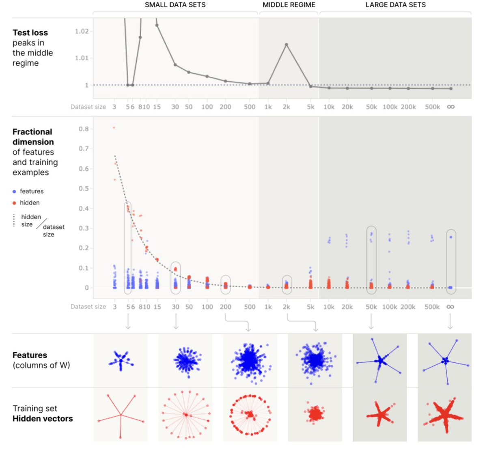

# 1.A2 Discussion sur les LLM

    

        
            <i class="fas fa-clock"></i>
        
        

            
Temps de lecture

            
21 min

        

    

!!! avertissement "Tout ce qui se trouve dans les annexes est facultatif et vise à fournir des connaissances et un contexte supplémentaires. Vous n'avez pas besoin de lire ceci pour comprendre les points essentiels de ce chapitre ou des chapitres à venir."

Les LLM actuels, bien que formés sur des données abondantes, restent encore loin d'être parfaits.

Ces problèmes persisteront-ils dans les futures itérations, ou vont-ils disparaître ? Cette section examine les principales critiques adressées à ces modèles et tente de déterminer si elles resteront valables même pour les futurs LLM.

Ce type d'évaluation qualitative est important pour savoir si les LLM représentent ou non la route la plus probable vers l'AGI.

## 1.A2.1 Insuffisance empirique ? {: #01}

**Les LLM peuvent-ils être créatifs ?** La créativité des LLM est souvent débattue, mais il existe des indications claires que l'IA, en principe, est capable de processus créatifs de diverses manières :

- **Recherche scientifique autonome** : Les récentes avancées ont montré que les LLM peuvent en effet réaliser de nouvelles découvertes. Par exemple, une étude de DeepMind a démontré qu'un LLM "*a découvert de nouvelles solutions pour le problème des ensembles de caps, un problème ouvert de longue date en mathématiques*" ([DeepMind, 2023](https://deepmind.google/discover/blog/funsearch-making-new-discoveries-in-mathematical-sciences-using-large-language-models/)) qui était un problème ouvert particulièrement intéressant pour Terence Tao. Cela indique que l'IA peut non seulement comprendre les connaissances existantes mais aussi apporter de nouvelles perspectives dans des domaines complexes comme les mathématiques.

- **Découverte autonome** : L'IA a la capacité de redécouvrir indépendamment des stratégies et des ouvertures humaines. AlphaGo, par exemple, a redécouvert des stratégies et des ouvertures du jeu de Go par auto-apprentissage ([McGrath et al., 2021](https://arxiv.org/abs/2111.09259)), sans aucune donnée d'entrée humaine. Cela démontre la capacité d'une IA à apprendre et à innover indépendamment au sein de domaines établis.

- **Optimisation créative** : L'IA peut optimiser de manière étonnamment créative. Le phénomène du [détournement des spécifications], où l'IA trouve des solutions imprévues à des problèmes, illustre ce point. Bien que cette imprévisibilité pose ses défis, elle montre également que les systèmes d'IA peuvent trouver des solutions novatrices qui ne sont pas immédiatement évidentes ou intuitives pour les humains qui résolvent des problèmes. Le billet de blog de DeepMind sur le détournement des spécifications illustre parfaitement ce point. ([Krakovna et al., 2020](https://deepmind.google/discover/blog/specification-gaming-the-flip-side-of-ai-ingenuity/))

**Les LLM ne sont-ils pas trop lents pour apprendre ?** Les critiques des modèles de langage basés sur les transformers soulignent souvent leur faible capacité d'apprentissage et leur lenteur à assimiler de nouveaux concepts, comparés aux humains. On argue généralement que pour progresser dans de nouvelles tâches, ces modèles nécessitent des volumes de données colossaux — des quantités des millions de fois supérieures à ce qu'un humain utiliserait. Néanmoins, une tendance émergente se dessine vers une plus grande efficacité des données, avec la conviction croissante que les modèles futurs pourront significativement améliorer cet aspect.

EfficientZero est un agent d'apprentissage par renforcement qui surpasse la performance médiane humaine sur un ensemble de 26 jeux Atari après seulement deux heures d'expérience en temps réel par jeu. ([Ye et al., 2021](https://arxiv.org/abs/2111.00210) ; [Wang et al., 2024](https://arxiv.org/abs/2403.00564)) C'est une amélioration considérable par rapport aux algorithmes précédents, démontrant le potentiel des bonds en termes d'efficacité des données. La promesse ici n'est pas seulement un apprentissage plus efficace, mais aussi le potentiel d'adaptation rapide et de compétence dans de nouvelles tâches, rappelant la vitesse d'apprentissage d'un enfant. EfficientZero n'est pas un LLM, mais il démontre que l'apprentissage profond peut parfois être rendu remarquablement efficace.

Les lois d'évolution à l'échelle indiquent que les IA plus grandes ont tendance à être plus efficaces en termes de données, nécessitant moins de données pour atteindre le même niveau de performance que leurs homologues plus petits. Des articles tels que "Language Models are Few-Shot Learners" (modèles de langage capables d'apprentissage avec peu d'exemples, [Brown et al., 2020](https://arxiv.org/abs/2005.14165)) et les preuves que les modèles plus grands semblent nécessiter moins de données pour atteindre le même niveau de performance ([Kaplan et al., 2020](https://arxiv.org/abs/2001.08361)), suggèrent qu'à mesure que les modèles augmentent en taille, ils deviennent plus performants avec moins d'exemples. Cette tendance laisse entrevoir un avenir où l'IA pourrait s'adapter rapidement et apprendre à partir de données limitées, remettant en question l'idée que les IA sont intrinsèquement des apprenants lents comparés aux humains.

**Les LLM sont-ils robustes aux déplacements de distribution ?** Bien qu'il soit vrai que l'IA n'a pas encore atteint une robustesse maximale, par exemple être capable de performer parfaitement après un changement de distribution, des progrès considérables ont été réalisés :

- **La robustesse est proportionnelle aux capacités** : La robustesse est étroitement liée aux capacités des modèles d'IA lorsque ceux-ci sont entraînés sur des tâches difficiles. Par exemple, on observe une amélioration significative de la robustesse et de l'apprentissage par transfert de GPT-2 à GPT-4. En vision par ordinateur, des modèles récents comme Segment Anything ([Kirillov et al., 2023](https://arxiv.org/abs/2304.02643)) sont bien plus robustes et capables d'apprentissage par transfert que leurs prédécesseurs moins performants. Cette progression n'est due à aucun facteur mystérieux mais résulte plutôt de la mise à l'échelle et de l'amélioration des architectures existantes.

- **La robustesse : un continuum où la perfection n'est pas un prérequis :** La robustesse en IA ne doit pas être perçue comme un concept binaire, mais comme un spectre graduel. Cette nature progressive transparaît dans la capacité des modèles d'IA, notamment en classification d'images, à surpasser régulièrement les performances humaines tant en termes de capacités que de robustesse ([Korzekwa, 2022](https://aiimpacts.org/time-for-ai-to-cross-the-human-performance-range-in-imagenet-image-classification/)). 

Il demeure crucial de reconnaître qu'aucun système n'est totalement imperméable aux défis, tels que les [attaques adverses]. Cette limite est parfaitement illustrée par des IA avancées comme Katago au jeu de Go, qui, malgré sa sensibilité à ces attaques ([Wang et al., 2022](https://arxiv.org/abs/2211.00241)), maintient un niveau de jeu surhumain.

La recherche d'une robustesse absolue n'est pas nécessairement un préalable à la création d'une IA transformative performante. En effet, des systèmes présentant certaines vulnérabilités peuvent atteindre des niveaux de compétence dépassant l'entendement humain. Néanmoins, si la robustesse parfaite n'est pas cruciale pour développer une IA capable, la conception d'une IA sûre et alignée devra impérativement résoudre les problèmes de généralisation inappropriée des objectifs.

## 1.A2.2 Compréhension superficielle ? {: #02}

**Stochastic Parrots : Les IA ne font-elles que mémoriser des informations sans vraiment les compresser ?** !!! citation de "François Chollet (Chercheur en IA éminent)" ([Chollet, 2023](https://x.com/fchollet/status/1736079054313574578?s=20))

Malheureusement, trop peu de personnes comprennent la distinction entre mémorisation et compréhension. Ce n'est pas une question théorique sophistiquée comme "le système a-t-il un modèle interne du monde ?", c'est une distinction comportementale très pragmatique : "le système est-il capable de généralisation large, ou est-il limité à une généralisation locale ?"

**Stochastic Parrots : Les IA ne font-elles que mémoriser des informations sans vraiment les compresser ?** !!! quote "François Chollet (Chercheur en IA éminent)" ([Chollet, 2023](https://x.com/fchollet/status/1736079054313574578?s=20))

Il existe deux approches typiques de représentation de l'information dans un LLM : soit la mémorisation point par point, comme une liste exhaustive, soit la compression de l'information en ne mémorisant que les caractéristiques de haut niveau — ce qu'on peut nommer le "[modèle du monde](#02)". Comme l'explique l'article crucial "Superposition, Memorization, and Double Descent" ([Anthropic, 2023](https://transformer-circuits.pub/2023/toy-double-descent/index.html)), il s'avère que pour stocker des points, le modèle commence par apprendre la position de chaque point (pure mémorisation). Puis, si l'on augmente le nombre de points, le modèle commence à compresser cette connaissance et devient capable de généralisation, implémentant ainsi un modèle simplifié des données.

<figure markdown="span">
{ loading=lazy }
  <figcaption markdown="1"><b>Figure 1.43 :</b> Extrait de Superposition, Memorization, and Double Descent ([Anthropic, 2023](https://transformer-circuits.pub/2023/toy-double-descent/index.html))</figcaption>
</figure>

L'IA démontre une capacité remarquable à compresser l'information, et ce, de manière souvent pertinente. Par exemple, lorsqu'on examine les représentations de mots désignant des couleurs dans les LLM, comme "red" et "blue", la structure formée par leurs représentations vectorielles (ou *embeddings*) reconstitue naturellement le cercle chromatique standard. Cette reconstruction utilise une technique de projection non linéaire, comme l'algorithme T-SNE (T-distributed Stochastic Neighbor Embedding), qui permet de traduire un espace de données multidimensionnel en une représentation bidimensionnelle lisible. D'autres illustrations de ces "modèles du monde" sont présentées dans l'article fondamental "Eight Things to Know about Large Language Models" ([Bowman, 2023](https://arxiv.org/abs/2304.00612)).

Bien entendu, il existe d'autres domaines où l'IA s'apparente davantage à une base de référence, mais il s'agit d'un continuum où chaque cas mérite un examen individuel. Par exemple, concernant les "associations factuelles", l'article "Locating and Editing Factual Associations in GPT" révèle que la structure de données sous-jacente de GPT-2 ressemble plutôt à une liste de correspondance ([Meng et al., 2023](https://arxiv.org/abs/2202.05262)). En revanche, l'article "Emergent Linear Representations in World Models of Self-Supervised Sequence Models" démontre qu'un petit GPT peut apprendre un modèle du monde compressé d'OthelloGpt. ([Nanda et al., 2023](https://arxiv.org/abs/2309.00941)) D'autres illustrations sont disponibles dans la section consacrée aux modèles du monde de l'article "Eight Things to Know about Large Language Models" ([Bowman, 2023](https://arxiv.org/abs/2304.00612)).

Il est manifeste que les LLM compriment leurs représentations, révélant une capacité bien plus subtile qu'une simple mémorisation mécanique. Diverses études, notamment l'ouvrage "L'hypothèse du perroquet stochastique : un débat pour la dernière génération de LLM", mettent en lumière des capacités impressionnantes qui contestent l'idée d'un simple mécanisme de reproduction. ([Feuillade-Montixi & Peigné, 2023](https://www.lesswrong.com/posts/HxRjHq3QG8vcYy4yy/the-stochastic-parrot-hypothesis-is-debatable-for-the-last))

**Les LLM vont-ils inévitablement halluciner ?** Les LLM sont sujets à l'hallucination, un phénomène où le modèle génère un contenu dépourvu de sens ou erroné sur le plan factuel en réponse à certaines invites. Ce problème, mis en lumière par des études telles que "On Faithfulness and Factuality in Abstractive Summarization" de Maynez et al. ([Maynez et al., 2020](https://arxiv.org/abs/2005.00661)) et "[TruthfulQA] : Measuring How Models Mimic Human Falsehoods" de Lin et al. ([Lin et al., 2022](https://arxiv.org/abs/2109.07958)), constitue un enjeu majeur pour la fiabilité des systèmes d'IA. Cependant, il est crucial de comprendre que ces défis sont anticipés du fait de la configuration de l'entraînement et peuvent être atténués :

- **Biais inhérent dans les textes sources** : L'une des raisons fondamentales pour lesquelles les LLM peuvent produire un contenu non véridique réside dans leurs données d'entraînement, qui ne sont pas toujours entièrement factuelles ou dénuées de biais. En essence, les LLM reflètent la nature diverse et parfois contradictoire de leurs données d'apprentissage. Dans ce contexte, les LLM "hallucinent" en permanence, mais occasionnellement, ces hallucinations coïncident avec notre perception de la réalité.

- **Stratégies pour améliorer la précision factuelle** : La propension des LLM à générer des hallucinations peut être significativement atténuée par diverses techniques. Les stratégies détaillées sont présentées dans l'encadré suivant.

- **Les modèles plus volumineux peuvent s'avérer plus véridiques que leurs homologues plus restreints.** C'est ce que démontre l'évaluation [TruthfulQA]. OpenAI rapporte que GPT-4 affiche une précision et une cohérence factuelle 40% supérieures à celles de son prédécesseur.

??? note "Plusieurs techniques peuvent être utilisées pour accroître la véracité des LLM"

??? note "Plusieurs techniques peuvent être utilisées pour accroître la véracité des LLM"

- **Paramétrage des LLM pour la factualité :** Dans cet article ([Tian et al., 2023](https://arxiv.org/abs/2311.08401)), les auteurs recommandent des méthodes de paramétrage utilisant l'Optimisation Directe de Préférence (DPO, de l'anglais Direct Preference Optimization) pour réduire le taux d'hallucinations. En appliquant de telles techniques, un modèle Llama 2 de 7B a connu une réduction de 58 % du taux d'erreurs factuelles par rapport à son modèle original.

- **Génération Augmentée par Récupération (RAG, de l'anglais Retrieval Augmented Generation)** : Cette méthode consiste à intégrer un processus de recherche d'informations dans le monde réel (récupération, à l'instar d'une recherche Google), puis à utiliser ces informations pour orienter les réponses de l'IA (génération, basée sur le document récupéré). Ce faisant, l'IA s'ancre plus solidement dans la réalité factuelle, réduisant significativement les risques de générer un contenu irréaliste ou erroné. En substance, cette approche revient à doter l'IA d'une bibliothèque de référence lui permettant de vérifier ses assertions durant son processus d'apprentissage et de génération, garantissant ainsi un résultat plus solidement amarré à la réalité. Cette méthode s'avère particulièrement pertinente dans le cadre de l'apprentissage en contexte, où l'IA apprend à partir des informations et du contexte fournis au cours de chaque interaction.

- **Techniques de prompting** en IA : l'émergence de méthodes de plus en plus sophistiquées

<tab>

- **Vérifications de cohérence interne** ([Fluri et al., 2023](https://arxiv.org/abs/2306.09983)), qui consistent à comparer les sorties de plusieurs instances du modèle sur une même invite, en identifiant et résolvant les désaccords dans les réponses. Cette méthode améliore la précision et la crédibilité des informations fournies. Par exemple, si différentes itérations du modèle produisent des réponses contradictoires, cette discordance peut être utilisée pour affiner et améliorer la compréhension du modèle.

- **Réflexion.** La technique de Réflexion ("Réflexion : Agents de langage avec apprentissage de renforcement verbal") : Il s'agit de demander au LLM de prendre du recul, d'examiner la validité de sa propre réponse et d'explorer des pistes d'amélioration, ce qui accroît significativement les capacités de GPT-4. Cette technique émergente ne fonctionne pas efficacement avec les modèles antérieurs. ([Shinn et al., 2023](https://arxiv.org/abs/2303.11366)).

- **Chaînes de vérification**, comme l'**inférence de sélection** ([Creswell et al., 2022](https://arxiv.org/abs/2205.09712)). La chaîne de pensée (Chain-of-Thought) a accès à l'ensemble du contexte, si bien que chaque étape de raisonnement n'est pas nécessairement liée causalement à la précédente. Cependant, l'inférence de sélection impose une structure où chaque étape de raisonnement découle nécessairement de la précédente, rendant ainsi l'intégralité de la chaîne de raisonnement causale. Ce processus consiste pour le modèle d'IA à examiner son propre raisonnement et les étapes qu'il a suivies pour parvenir à une conclusion. Ce faisant, il peut vérifier la logique et la cohérence de ses réponses, garantissant ainsi leur solidité et leur fiabilité.

- **Permettre à l'IA d'exprimer ses degrés de certitude** en admettant ses limites lorsque c'est pertinent. Par exemple, plutôt que de répondre par un catégorique "Oui" ou "Non", le modèle pourrait nuancer : "Je ne suis pas certain", traduisant une compréhension plus proche du raisonnement humain. Cette approche se manifeste particulièrement dans des modèles avancés comme Gopher ([Rae et al., 2022](https://arxiv.org/abs/2112.11446)), qui se distingue nettement des modèles antérieurs tels que WebGPT, moins enclins à proposer des réponses aussi nuancées.

- **Entraînement axé sur le processus** garantissant que les systèmes développent une approche plus détaillée de leur raisonnement, sans pouvoir omettre d'étapes essentielles. Par exemple, consultez les travaux d'OpenAI sur l'amélioration du raisonnement mathématique par supervision de processus ([Lightman et al., 2023](https://arxiv.org/abs/2305.20050)).

- **Entraînement à la métacognition** : Les modèles peuvent être entraînés à estimer la probabilité de leurs affirmations, une forme de métacognition. Par exemple, l'article "Language Models (Mostly) Know What They Know" ([Kadavath et al., 2022](https://arxiv.org/abs/2207.05221)) démontre que les IA peuvent être ajustées selon une approche bayésienne sur l'étendue de leurs connaissances. Cela suggère qu'elles peuvent développer une forme rudimentaire d'auto-conscience, capable de reconnaître la vraisemblance de leur propre précision. En d'autres termes, il devient possible d'interroger un chatbot en lui demandant : "Êtes-vous vraiment certain de ce que vous me dites ?" et d'obtenir une réponse relativement fiable. Cette approche peut servir de mécanisme de prévention contre les hallucinations.

Il convient de noter que ces techniques permettent d'atténuer substantiellement les problèmes des LLMs actuels, mais elles ne résolvent pas tous les problèmes que nous rencontrons avec des IA potentiellement trompeuses, comme nous le verrons dans le chapitre sur la mauvaise généralisation des objectifs.

## 1.A2.3 Inadéquation structurelle ? {: #03}

**Les LLMs manquent-ils de système 2 ?** Les systèmes 1 et 2 sont des termes popularisés par l'économiste Daniel Kahneman dans son livre "Thinking, Fast and Slow", décrivant les deux différentes manières dont notre cerveau forme des pensées et prend des décisions. Le système 1 est rapide, automatique et intuitif ; c'est la partie de notre pensée qui gère les décisions et jugements quotidiens sans grand effort ni délibération consciente. Par exemple, lorsque vous reconnaissez un visage ou comprenez des phrases simples, vous utilisez typiquement le système 1. En revanche, le système 2 est plus lent, plus délibératif et plus logique. Il prend le relais quand vous résolvez un problème complexe, faites un choix conscient ou vous concentrez sur une tâche difficile. Il requiert plus d'énergie et se veut plus contrôlé, gérant des tâches telles que la planification future, la vérification de la validité d'un argument complexe ou toute activité nécessitant une concentration soutenue. Ensemble, ces systèmes interagissent et influencent notre façon de penser, de juger et de décider, mettant en lumière la complexité de la pensée et du comportement humain.

Une préoccupation centrale est de savoir si les LLMs sont capables de reproduire les processus du système 2, qui impliquent une pensée plus lente, plus délibérée et plus logique. Certains arguments théoriques sur les limites de profondeur des transformers démontrent qu'ils sont intrinsèquement incapables de diviser en interne de grands nombres entiers ([Delétang et al., 2023](https://arxiv.org/abs/2207.02098)). Cependant, ce n'est pas ce que nous observons en pratique : GPT-4 est capable de détailler certains calculs étape par étape et d'obtenir le résultat attendu grâce à une chaîne de pensée ou via l'utilisation d'outils comme un interpréteur de code.

**Métacognition émergente**. Des fonctionnalités émergentes dans les LLMs, à l'instar de la technique Reflexion ([Shinn et al., 2023](https://arxiv.org/abs/2303.11366)), permettent à ces modèles d'analyser rétrospectivement leurs réponses et de les améliorer. Il devient possible de demander au LLM de prendre du recul, de questionner la pertinence de ses actions précédentes et d'envisager des stratégies d'optimisation. Cette approche enrichit significativement les capacités de GPT-4, les rapprochant davantage des opérations caractéristiques du système 2 humain. À noter que cette technique demeure émergente et ne fonctionne pas efficacement avec les modèles antérieurs.

Ces résultats suggèrent un brouillage des frontières entre ces deux systèmes. Les processus du système 2 peuvent être essentiellement un assemblage de multiples processus du système 1, apparaissant plus lents du fait de l'implication de plusieurs étapes et interactions avec des formes de mémoire plus lentes. Cette perspective trouve un parallèle dans le fonctionnement des modèles de langage, où chaque étape d'un processus de système 1 s'apparente à une étape d'exécution à temps constant dans des modèles comme GPT. Bien que ces modèles peinent à orchestrer intentionnellement ces étapes pour résoudre des problèmes complexes, la décomposition des tâches en étapes plus petites (technique de *Least-to-most prompting*) ou leur sollicitation pour un raisonnement incrémental (prompting à chaîne de pensée, *Chain-of-Thought* (CoT)) améliore significativement leurs performances.

**Les LLMs manquent-ils d'un modèle du monde interne ?** La notion de [modèle du monde] en IA ne doit pas se limiter à un encodage explicite au sein d'une architecture. Contrairement aux approches comme H-JEPA ([LeCun, 2022](https://openreview.net/pdf?id=BZ5a1r-kVsf)), qui préconisent un modèle du monde explicite pour améliorer la formation de l'IA, des preuves croissantes suggèrent qu'un modèle du monde peut être efficacement implicite. Ce concept est particulièrement perceptible dans l'apprentissage par renforcement (RL), où la distinction entre RL basé sur un modèle et RL sans modèle peut s'avérer quelque peu trompeuse. Même dans le RL sans modèle, les algorithmes encodent souvent implicitement une forme de modèle du monde cruciale pour l'obtention de performances optimales.

- **Coordonnées temporelles et géographiques :** Les recherches sur les modèles Llama-2 révèlent comment ces modèles peuvent représenter des informations spatiales et temporelles ([Gurney & Tegmark, 2024](https://arxiv.org/abs/2310.02207)). Les LLMs comme les modèles Llama-2 encodent des coordonnées approximatives du monde réel et des chronologies historiques de villes. Les principaux résultats incluent l'émergence progressive des représentations géographiques à travers les couches du modèle, la linéarité de ces représentations, et la robustesse des modèles à différentes requêtes. De manière significative, l'étude montre que les modèles ne traitent pas passivement ces informations mais comprennent activement la géométrie globale de l'espace et du temps.

- **Représentation de plateau :** Dans l'article "Emergent Linear Representations in World Models of Self-Supervised Sequence Models" ([Nanda et al., 2023](https://arxiv.org/abs/2309.00941)), l'auteur présente des découvertes significatives sur la nature des représentations dans les modèles d'IA. L'article approfondit comment le modèle Othello-GPT, entraîné à prédire des mouvements légaux dans le jeu d'Othello, développe une représentation émergente du monde du plateau de jeu ! Contrairement aux croyances précédentes selon lesquelles cette représentation était non linéaire, il démontre qu'elle est en fait linéaire. Il découvre que le modèle représente les états du plateau non pas en termes de pièces noires ou blanches, mais comme "ma couleur" ou "leur couleur", alignant la représentation avec la perspective du modèle jouant des deux côtés. Ce travail éclaire le potentiel des modèles d'IA à développer des représentations du monde complexes, mais linéaires, à travers des objectifs simples comme la prédiction du jeton suivant.

- **Autres exemples** sont exposés dans l'article : « Huit choses à savoir sur les LLMs » ([Bowman, 2023](https://arxiv.org/abs/2304.00612))

**Les LLMs peuvent-ils apprendre de manière continue et disposer d'une mémoire à long terme ?** L'apprentissage continu et la gestion efficace de la mémoire à long terme représentent des défis majeurs dans le domaine de l'IA en général.

**Oubli catastrophique**. Un obstacle crucial dans ce domaine est l'oubli catastrophique, un phénomène où un réseau de neurones, en apprenant de nouvelles informations, tend à oublier complètement les informations précédemment apprises. Cette problématique constitue un domaine de recherche actif, visant à développer des systèmes d'IA capables de conserver et de construire sur leurs connaissances au fil du temps. Par exemple, supposons que nous entraînions une IA sur un jeu Atari. À la fin du second entraînement, l'IA aura très probablement oublié comment jouer au premier jeu. C'est un exemple d'oubli catastrophique.

Mais maintenant, supposons que nous entraînions une grande IA sur plusieurs jeux Atari, simultanément, et que nous ajoutions même du texte Internet et quelques tâches robotiques. Cela peut simplement fonctionner. Par exemple, l'IA GATO illustre ce processus d'entraînement et exemplifie ce que nous appelons l'**effet bénéfique de la mise à l'échelle**, qui est que ce qui est impossible dans des régimes de petite taille peut devenir possible dans des régimes de grande taille.

D'autres techniques sont en cours de développement pour résoudre la mémoire à long terme, par exemple, des approches basées sur les **structures de support** ont également été utilisées pour obtenir une mémoire à long terme et un apprentissage continu dans l'IA. Les structures de support dans l'IA font référence à l'utilisation d'enveloppes pré-programmées, des structures explicitement conçues par des humains qui impliquent une boucle for pour interroger continuellement le modèle :

- **LangChain** répond à ces défis en créant des banques de mémoire étendues. LangChain est une bibliothèque Python qui permet aux LLMs de récupérer et d'utiliser des informations provenant de grands ensembles de données, offrant ainsi un moyen pour l'IA d'accéder à un vaste référentiel de connaissances et d'élaborer des réponses plus contextualisées. Cependant, cette approche peut manquer d'élégance en raison de sa dépendance aux sources de données externes et aux mécanismes de récupération complexes. Une solution potentiellement plus intégrée pourrait consister à utiliser les poids du réseau de neurones comme une mémoire dynamique, capable d'évoluer et de se mettre à jour en continu en fonction des tâches réalisées.

- **Voyager :** Un exemple remarquable de mémoire à long terme basée sur des structures de support est l'IA Voyager, un système développé selon le paradigme AutoGPT. Ce système se distingue par sa capacité à s'engager dans un apprentissage continu au sein d'un environnement de jeu 3D comme Minecraft. Lors d'une unique session de jeu, Voyager démontre sa capacité à maîtriser les commandes de base, à atteindre des objectifs initiaux comme l'acquisition de ressources, et à progresser vers des comportements plus complexes, incluant le combat contre des ennemis et la fabrication d'outils pour collecter des ressources sophistiquées. Cette réalisation illustre une avancée significative dans la capacité des LLMs à apprendre de manière continue et à gérer une mémoire à long terme dans des environnements dynamiques.

Il convient de noter que la mémoire à long terme basée sur des structures de support n'est pas considérée comme une solution élégante, et les puristes préféreraient utiliser les propres poids du système comme mémoire à long terme.

**Planification** La planification reste un domaine où les IA rencontrent actuellement des difficultés, mais des progrès significatifs sont en cours. Certains paradigmes, tels que ceux basés sur les structures de support, permettent la décomposition des tâches et la fragmentation des objectifs en sous-objectifs plus précis et plus réalisables.

De plus, l'article "Voyager: An Open-Ended Embodied Agent with Large Language Models" démontre qu'il est possible d'utiliser GPT-4 pour la planification en langage naturel dans Minecraft. ([Wang et al., 2023](https://arxiv.org/abs/2305.16291))

## 1.A2.4 Différences avec le cerveau

Il semble qu'il existe plusieurs points de convergence entre les LLMs et le cortex linguistique :

- **Similitudes comportementales.** D'après ([Canell, 2022](https://www.lesswrong.com/posts/3nMpdmt8LrzxQnkGp/ai-timelines-via-cumulative-optimization-power-less-long)), on souligne la proximité remarquable entre les LLMs et les capacités linguistiques humaines et le cortex linguistique. Ces modèles ont excellé dans la maîtrise de la syntaxe et d'une partie significative de la sémantique du langage humain. Bien entendu, à l'heure actuelle, ils accusent encore un retard dans des aspects tels que la mémoire à long terme, la cohérence et le raisonnement général - des facultés qui, chez les humains, dépendent de diverses régions cérébrales comme l'hippocampe et le cortex préfrontal, mais nous avons expliqué dans les sections précédentes que ces problèmes pourraient être résolus.

- **Convergence des représentations internes** : Les LLMs développent une représentation qui converge progressivement vers la représentation cérébrale à mesure qu'ils progressent en échelle. Cette observation est étayée par l'étude « Convergence partielle des cerveaux et des algorithmes dans le traitement du langage naturel » ([Caucheteux & King, 2022](https://www.nature.com/articles/s42003-022-03036-1)). Des perspectives complémentaires sont disponibles dans les travaux « Le cerveau comme machine d'apprentissage universelle » ([Canell, 2015](https://www.lesswrong.com/posts/9Yc7Pp7szcjPgPsjf/the-brain-as-a-universal-learning-machine)) et « Efficacité cérébrale : plus que ce que vous ne vouliez savoir » ([Canell, 2022](https://www.lesswrong.com/posts/xwBuoE9p8GE7RAuhd/brain-efficiency-much-more-than-you-wanted-to-know)). À des étapes d'apprentissage comparables, les LLMs et le cortex linguistique développent des représentations de caractéristiques similaires et équivalentes. Certaines évaluations ont même montré que les LLMs avancés peuvent prédire jusqu'à 100 % de la variance neuronale explicable, comme l'ont détaillé Schrimpf, Martin et al. dans « L'architecture neuronale du langage : une modélisation intégrative convergeant vers un traitement prédictif » ([Schrimpf et al., 2021](https://www.pnas.org/content/118/45/e2105646118)).

- **La mise à l'échelle est également importante chez les primates.** La principale différence architecturale entre les cerveaux humains et ceux des autres primates semble être le nombre de neurones plutôt que tout autre chose, comme le démontrent diverses études. ([Houzel, 2012](https://pubmed.ncbi.nlm.nih.gov/22723358/); [Pearson et al., 2023](https://pubmed.ncbi.nlm.nih.gov/36789740/); [Charvet, 2021](https://pubmed.ncbi.nlm.nih.gov/33563125/)).

## 1.A2.5 Raisons supplémentaires de continuer la mise à l'échelle des LLMs

Voici quelques raisons de croire que les laboratoires continueront de mettre à l'échelle les LLMs.

**Les lois de mise à l'échelle des LLM laissent présager des améliorations qualitatives significatives.** Bien que les lois de mise à l'échelle puissent sembler peu probantes au premier abord, leur analyse quantitative révèle des transformations qualitatives remarquables dans la performance algorithmique. Un algorithme approchant une perte presque nulle démontre une compréhension fine des subtilités et une adaptabilité extraordinaire. Le fait que ces lois de mise à l'échelle restent constantes est un signal très prometteur : il suggère que nous pouvons développer des modèles dotés de capacités de raisonnement de plus en plus sophistiquées.

**Des corrélations simples à la compréhension.** Au cours de son entraînement, les modèles GPT évoluent d'une simple mise en relation de mots à une compréhension de plus en plus sophistiquée. Dans un premier temps, le modèle établit des connexions élémentaires entre des mots successifs. Progressivement, il développe une intelligence linguistique, tissant des liens entre les phrases, puis entre les paragraphes. Ultimement, GPT acquiert une maîtrise subtile des nuances stylistiques[^footnote_scaling_law].

[^footnote_scaling_law] : Voir également « l'Hypothèse de la mise à l'échelle », pour approfondir cette progression dans une histoire fascinante.

??? question "Exercice : Les lois de mise à l'échelle des LLM laissent présager des améliorations qualitatives significatives."

??? question "Exercise: Scaling Laws on LLM implies further qualitative improvements."

Calculons la différence de perte, mesurée en bits, entre deux sorties de modèle : « Janelle a mangé de la glace parce qu'il aime les choses sucrées comme la glace. » et « Janelle a mangé de la glace parce qu'elle aime les choses sucrées comme la glace. » La phrase contient environ vingt tokens. Si le modèle oscille entre « Il » et « Elle », en choisissant de manière aléatoire (avec une probabilité de 50/50), il subit une perte de 2 bits sur le token du pronom lorsqu'il se trompe. La perte pour les autres tokens demeure identique dans les deux modèles. Néanmoins, comme le modèle n'est incorrect que la moitié du temps, un facteur de 1/2 doit être appliqué. Il en résulte une différence de (1/2) * (2/20) = 1/20, soit 0,05 bits. Ainsi, un modèle à 0,05 bits de la perte théorique minimale devrait être en mesure de comprendre des concepts encore plus nuancés que celui discuté précédemment.

**La complétion de texte est probablement un test AI-complet**

**Les LLMs actuels ne comptent qu'un nombre de paramètres équivalent aux synapses de petits mammifères, ce qui explique leur imperfection persistante.** Des modèles tels que GPT-4, bien que considérablement plus vastes que leurs prédécesseurs, méritent d'être appréciés à l'aune de leur échelle encore modeste comparativement à la complexité d'un cerveau humain. À titre d'illustration, le plus volumineux modèle GPT-3 présente un nombre de paramètres comparable aux synapses d'un hérisson. Bien que nous ne connaissions pas précisément le nombre de paramètres de GPT-4, s'il équivaut à PALM avec ses 512 milliards de paramètres, alors GPT-4 ne comprendrait qu'autant de synapses qu'un chinchilla. En contraste, le néocortex humain recèle approximativement 140 billions de synapses, soit plus de 200 fois le nombre de synapses d'un chinchilla. Pour une analyse approfondie de cette comparaison, nous renvoyons le lecteur à la discussion connexe [ici](https://www.lesswrong.com/posts/YKfNZAmiLdepDngwi/gpt-175bee). Pour une exploration du nombre de paramètres nécessaires à l'émulation d'une synapse, nous invitons le lecteur à consulter les travaux sur les ancres biologiques.

**GPT-4 reste plusieurs ordres de grandeur moins onéreux que d'autres grands projets scientifiques.** Malgré les coûts substantiels associés à l'entraînement de modèles de grande envergure, les avancées significatives dans les capacités de l'IA justifient pleinement ces investissements. À titre d'exemple, GPT-4 représente un investissement considérable par rapport à d'autres modèles de ML. Son coût d'entraînement est estimé à 50 millions de dollars. En comparaison, le Projet Manhattan a englouti 25 milliards, soit 500 fois plus sans même tenir compte de l'inflation, alors que l'émergence d'une intelligence de niveau humain pourrait s'avérer économiquement bien plus stratégique que le développement de la bombe nucléaire.

Collectivement, ces points soutiennent l'hypothèse selon laquelle l'intelligence artificielle générale (AGI, de l'anglais Artificial General Intelligence) pourrait émerger par la seule progression des algorithmes actuels.