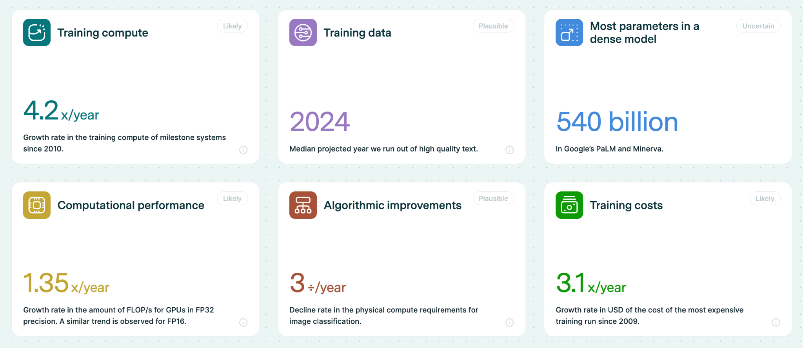
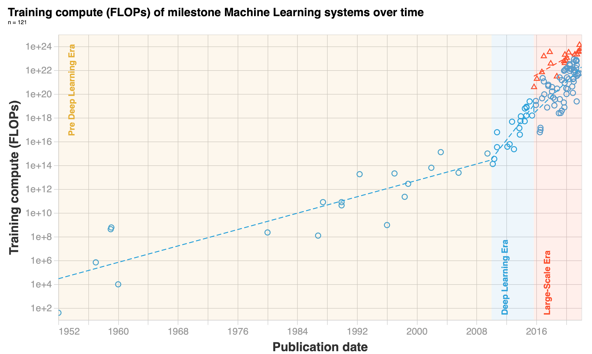
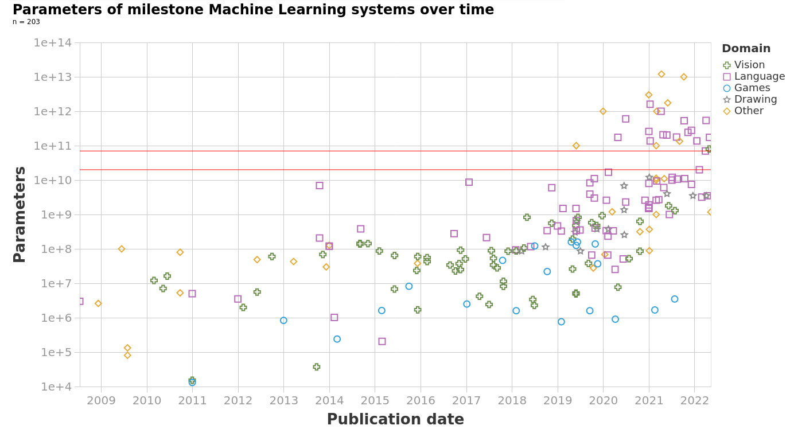
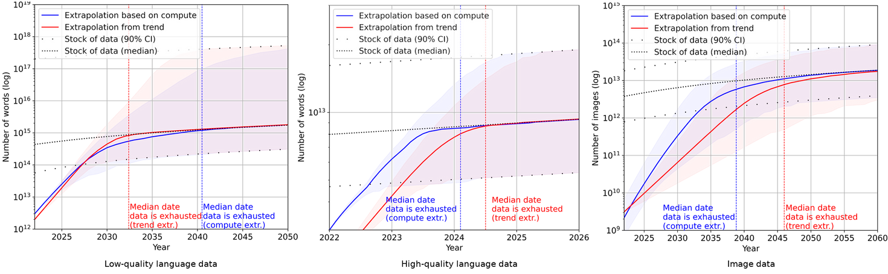
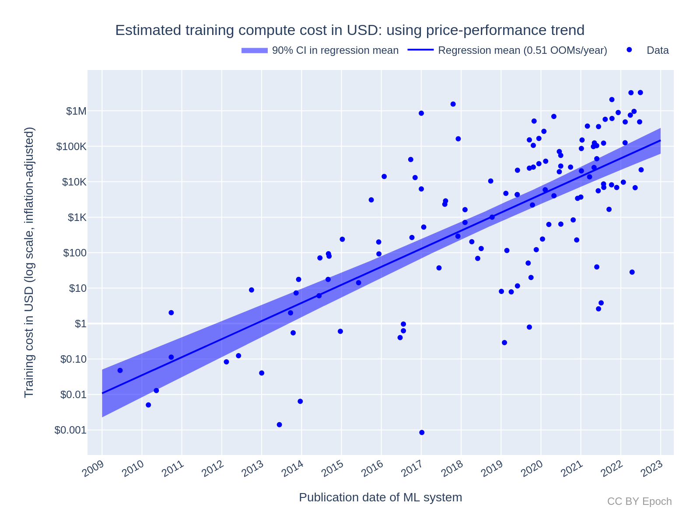

# 1.A3 Prévision - Tendances

    

        
            <i class="fas fa-clock"></i>
        
        

            
Temps de lecture

            
10 min

        

    

!!! warning "Tout ce qui se trouve dans les annexes est facultatif et vise à fournir des connaissances et un contexte supplémentaires. Vous n'avez pas besoin de lire ceci pour comprendre les points essentiels de ce chapitre ou des chapitres à venir."

De manière générale, les trois composantes principales reconnues comme les variables principales de l'avancement dans l'apprentissage profond sont : la puissance de calcul disponible, les améliorations algorithmiques et la disponibilité des données. Ces trois variables sont parfois également appelées les intrants de la fonction de production de l'IA, ou la triade de l'IA. ([Buchanan, 2022](https://cset.georgetown.edu/publication/the-ai-triad-and-what-it-means-for-national-security-strategy/))

Nous pouvons anticiper que les modèles continueront de s'étendre dans un avenir proche. L'augmentation de leur échelle, combinée à la nature de plus en plus polyvalente des modèles de base, pourrait potentiellement conduire à une croissance soutenue des capacités d'IA à usage général.

<figure markdown="span">
{ loading=lazy }
  <figcaption markdown="1"><b>Figure 1.44 :</b> Principales tendances et chiffres en Apprentissage Automatique ([Epoch, 2023](https://epochai.org/trends))</figcaption>
</figure>

## 1.A3.1 Puissance de calcul {: #01}

La première chose à examiner est les tendances du volume global de puissance de calcul nécessaire pour l'entraînement de nos modèles. La puissance de calcul pour l'entraînement a augmenté de 1,58 fois par an jusqu'à la révolution de l'apprentissage profond autour de 2010, après quoi les taux de croissance ont atteint 4,2 fois par an. Nous observons également une nouvelle tendance de modèles « à grande échelle » qui a émergé en 2016, entraînés avec 2 à 3 ordres de grandeur (soit 100 à 1 000 fois plus) de puissance de calcul que les autres systèmes de la même période.

Les avancées matérielles suivent ces tendances en puissance de calcul et en données. Les GPU connaissent une augmentation annuelle de 1,35 fois des opérations en virgule flottante par seconde (FLOP/s). Cependant, les contraintes de mémoire émergent comme des goulots d'étranglement potentiels, la capacité et la bande passante DRAM s'améliorant à un rythme plus lent. Les tendances d'investissement reflètent ces avancées technologiques.

En 2010, avant la révolution de l'apprentissage profond, le co-fondateur de DeepMind Shane Legg a prédit une IA au niveau humain d'ici 2028 en utilisant des estimations basées sur la puissance de calcul ([Legg, 2010](http://www.vetta.org/2010/12/goodbye-2010/)). Le co-fondateur d'OpenAI Ilya Sutskever, dont l'article AlexNet a déclenché la révolution de l'apprentissage profond, était également un partisan précoce de l'idée que la montée en échelle de l'apprentissage profond serait transformative.

<figure markdown="span">
{ loading=lazy }
  <figcaption markdown="1"><b>Figure 1.45 :</b> Principales tendances et chiffres en Apprentissage Automatique ([Epoch AI, 2023](https://epochai.org/trends))</figcaption>
</figure>

## 1.A3.2 Paramètres {: #02}

Dans cette section, examinons les tendances relatives au nombre de paramètres des modèles. Le graphique suivant illustre qu'au-delà de l'augmentation constante du nombre de paramètres, nous sommes entrés depuis 2018 dans une phase de croissance radicalement différente. Globalement, entre les années 1950 et 2018, les modèles ont progressé à un rythme de 0,1 ordre de grandeur par an (OOM/an). Autrement dit, durant les 68 années séparant 1950 et 2018, les modèles ont connu une augmentation totale de 7 ordres de grandeur. Toutefois, après 2018, en seulement 5 ans, les modèles ont encore grimpé de 4 ordres de grandeur supplémentaires - sans même prendre en compte les paramètres de GPT-4, dont le nombre exact nous échappe.

Le tableau et le graphique suivants mettent en lumière l'évolution significative du nombre de paramètres dans les modèles d'apprentissage automatique. On observe une progression remarquable, atteignant près d'un demi-millier de milliards de paramètres, et ce, sans augmentation proportionnelle des données d'entraînement.

<figure markdown="span">
{ loading=lazy }
  <figcaption markdown="1"><b>Figure 1.46 :</b> Tailles des modèles d'apprentissage automatique et l'écart de paramètres ([Villalobos et al., 2022](https://arxiv.org/abs/2207.02852))</figcaption>
</figure>

## 1.A3.3 Données {: #03}

Nous utilisons des quantités de données de plus en plus importantes pour entraîner nos modèles. Le paradigme de l'entraînement de modèles fondamentaux en vue d'un affinage ultérieur accélère cette tendance. Si nous voulons un modèle de base généraliste, nous devons lui fournir des « données générales », ce qui signifie : toutes les données à notre portée. Vous avez probablement entendu que des modèles comme ChatGPT et PaLM sont entraînés sur des données provenant d'Internet. Internet est le plus grand référentiel de données que les humains possèdent. De plus, comme nous l'avons observé à partir des lois d'échelle des papiers Chinchilla, il est possible que les données pour entraîner nos modèles constituent le véritable goulot d'étranglement, et non la puissance de calcul ou le nombre de paramètres. Dès lors, une question se pose naturellement : combien de données reste-t-il encore sur Internet pour continuer à alimenter nos modèles ? Et quelle quantité de données supplémentaires produisons-nous chaque année ?

**Quelle quantité de données générons-nous ?** La quantité totale de données générées chaque jour en 2019 était de l'ordre de ~463 exaoctets ([Forum économique mondial, 2019](https://www.weforum.org/agenda/2019/04/how-much-data-is-generated-each-day-cf4bddf29f/)). Mais dans cette publication, nous supposerons que les modèles ne sont pas encore en train de s'entraîner sur « toutes les données générées », mais continueront plutôt à s'entraîner uniquement sur des données textuelles et d'images open-source issues d'Internet. Le stock disponible de données textuelles et d'images a progressé de 0,14 ordre de grandeur par an entre 1990 et 2018, mais a depuis ralenti à 0,03 ordre de grandeur par an.

**Combien de données reste-t-il ?** Selon les projections médianes, le jeu de données d'entraînement des principaux modèles d'apprentissage automatique devrait épuiser le stock de textes édités professionnellement sur Internet en 2024. La projection médiane pour l'année où l'ensemble des textes internet seront utilisés est fixée à 2040. 

Les prévisions d'Epochai indiquent une progression préoccupante : l'épuisement des données linguistiques de haute qualité est attendu avant 2026, celui des données linguistiques de moindre qualité entre 2030 et 2050, et des données visuelles entre 2030 et 2060. Ce scénario pourrait signaler un ralentissement potentiel des avancées en apprentissage automatique dans les prochaines décennies.

Il est crucial de souligner que ces conclusions reposent sur des hypothèses discutables : elles supposent la continuité des tendances actuelles en matière de production et d'utilisation de données, sans considérer d'éventuelles innovations majeures en termes d'efficacité des données. En d'autres termes, on postule que le nombre de capacités acquises par point de données d'entraînement restera stable selon les standards actuels.

<figure markdown="span">
{ loading=lazy }
  <figcaption markdown="1"><b>Figure 1.47 :</b> Tendances de consommation et de production de données en apprentissage automatique pour les textes de basse qualité, les textes de haute qualité et les images. ([Epoch AI, 2023](https://epochai.org/trends))</figcaption>
</figure>

Même si nous venons à manquer de données, de nombreuses solutions sont proposées, allant de l'utilisation de données synthétiques, par exemple en filtrant et prétraitant les données avec GPT-3.5 pour créer un nouveau jeu de données plus propre – une approche utilisée dans l'article "Textbooks are all you need" avec des modèles comme Phi 1.5B qui démontrent d'excellentes performances pour leur taille grâce à l'utilisation de données filtrées de haute qualité. D'autres stratégies incluent l'utilisation d'entraînements plus efficaces ou l'amélioration des performances en augmentant le nombre d'epochs.

## 1.A3.4 Algorithmes {: #04}

**Les avancées algorithmiques** jouent également un rôle crucial. Par exemple, entre 2012 et 2021, la puissance computationnelle nécessaire pour égaler les performances d'AlexNet a été réduite d'un facteur 40, ce qui correspond à une réduction annuelle triple de la puissance de calcul requise pour obtenir les mêmes performances sur des tâches de classification d'images comme ImageNet. L'amélioration de l'architecture compte également comme une avancée algorithmique. 

Une architecture particulièrement influente est celle des Transformers, centrale dans de nombreuses innovations récentes, notamment dans les chatbots et l'apprentissage autoregressif. Leur capacité à être entraînés en parallèle sur chaque unité de texte (ou "token") de la fenêtre de contexte exploite pleinement la puissance des GPU modernes. On considère que c'est l'une des principales raisons de leur efficacité supérieure par rapport à leurs prédécesseurs, bien que ce point reste sujet à débat.

??? question "L'architecture algorithmique compte-t-elle vraiment ?"

Cette question est complexe, mais certaines preuves suggèrent qu'une fois qu'une architecture est suffisamment expressive et évolutive, l'architecture compte moins que ce que l'on pourrait penser :

Dans un article intitulé « ConvNets Match Vision Transformers at Scale », des chercheurs de Google ont découvert que les Transformers visuels (ViT) peuvent obtenir les mêmes résultats que les réseaux de neurones convolutifs (CNN) simplement en utilisant plus de puissance de calcul. ([Smith et al., 2023](https://arxiv.org/abs/2310.16764)) Ils ont pris une architecture CNN spéciale et l'ont entraînée sur un ensemble de données massif de quatre milliards d'images. Le modèle résultant a égalé la précision des systèmes ViT existants qui utilisaient une puissance de calcul d'entraînement similaire.

Les auto-encodeurs variationnels (longtemps restés en retrait des GAN ou des modèles autoregressifs en termes de génération d'images) rattrapent leur retard si on les rend suffisamment profonds ([Child, 2021](https://arxiv.org/abs/2011.10650#openai); [Vahdat & Kautz, 2021](https://arxiv.org/abs/2007.03898#nvidia)).

Les progrès de fin 2023, tels que l'architecture mamba ([Gu & Dao, 2023](https://arxiv.org/abs/2312.00752)), apparaissent comme une amélioration significative par rapport aux transformers. Elle peut être considérée comme une avancée algorithmique permettant de réduire la quantité de calculs d'entraînement nécessaires pour atteindre des performances équivalentes.

Les connexions et normalisations dans le transformer, qui étaient considérées comme importantes, peuvent être supprimées si les poids sont paramétrés de manière appropriée. Cela peut également simplifier la conception du transformer (Notons cependant que cette architecture converge plus lentement que les autres). ([He et al., 2023](https://arxiv.org/abs/2302.10322))

De l'autre côté de l'argument, certaines architectures à attention sont significativement plus évolutives lorsqu'elles traitent des fenêtres de contexte longues, et aucune quantité viable d'entraînement ne pourrait compenser cela dans des modèles de transformers plus basiques. Des architectures spécifiquement conçues pour gérer des séquences longues, comme les Transformers parcimonieux ([Child et al., 2019](https://arxiv.org/abs/1904.10509)) ou Longformer ([Beltagy et al., 2020](https://arxiv.org/abs/2004.05150)), peuvent surpasser les transformers standard par une marge considérable pour cet usage. En vision par ordinateur, les CNN sont intrinsèquement structurés pour reconnaître les hiérarchies spatiales dans les images, les rendant plus efficaces pour ces tâches lorsque la quantité de données est limitée. Le "prior" encodé dans l'architecture permet au modèle d'apprendre plus rapidement, contrairement aux architectures non spécialisées dans le traitement des données spatiales.

Les incitations économiques et les points de bascule peuvent influencer le développement et le déploiement des technologies d'IA.

## 1.A3.5 Coûts {: #05}

Comprendre le coût en dollars des processus d'entraînement en apprentissage automatique (machine learning) est crucial pour plusieurs raisons. Premièrement, il reflète la dépense économique réelle du développement de systèmes d'apprentissage automatique, ce qui est essentiel pour prévoir l'avenir du développement de l'IA et identifier quels acteurs peuvent se permettre de poursuivre des projets d'IA à grande échelle. Deuxièmement, en combinant des estimations de coût avec des métriques de performance, nous pouvons suivre l'efficacité et les capacités des systèmes d'apprentissage automatique au fil du temps, offrant des perspectives sur leur amélioration continue et sur les domaines potentiels d'inefficacité. Enfin, ces perspectives aident à déterminer la durabilité des tendances de dépenses actuelles et à guider les investissements futurs dans la recherche et le développement de l'IA, en veillant à ce que les ressources soient allouées de manière stratégique pour favoriser l'innovation tout en maîtrisant l'impact économique.

La loi de Moore, qui prédit un doublement de la densité des transistors et de la puissance de calcul tous les deux ans environ, a historiquement contribué à réduire les coûts de calcul. Néanmoins, le rapport révèle que les dépenses en entraînement ML ont progressé bien plus rapidement que les réductions de coûts prédites par la loi de Moore. Autrement dit, bien que le matériel soit devenu moins onéreux, les dépenses globales d'entraînement des systèmes d'apprentissage automatique ont augmenté en raison de l'demande croissante en ressources computationnelles. Cette divergence souligne le rythme rapide des avancées en ML et les investissements substantiels requis pour suivre l'escalade des besoins computationnels.

Pour mesurer le coût des cycles d'entraînement en apprentissage automatique (ML), le rapport mobilise deux méthodes principales. La première exploite les tendances historiques du rapport prix-performance des GPU pour estimer les coûts, en s'appuyant sur l'évolution générale des avancées matérielles et des réductions de coûts au fil du temps. La seconde méthode se base sur le matériel spécifique utilisé pour entraîner les systèmes ML, comme les GPU NVIDIA, offrant ainsi une image plus précise des coûts associés à des technologies particulières.

Les deux approches consistent à calculer deux composantes essentielles : le coût matériel — correspondant à la portion du coût d'investissement initial utilisée pour l'entraînement — et le coût énergétique, qui prend en compte l'électricité nécessaire pour faire fonctionner le matériel durant l'entraînement. Ces calculs permettent de dresser un panorama complet des implications économiques de l'entraînement des modèles d'apprentissage automatique.

Mesurer le coût de développement d'un système d'apprentissage automatique (ML) va au-delà du seul cycle final d'entraînement et englobe un large éventail de facteurs. Cela comprend les coûts de recherche et développement, qui couvrent les dépenses liées aux expériences préliminaires et aux raffinements successifs des modèles jusqu'au produit final. Il implique également les coûts de personnel, incluant les salaires et avantages sociaux des chercheurs, ingénieurs et personnel de support. Les coûts d'infrastructure, tels que les investissements dans les centres de données, les systèmes de refroidissement et les équipements réseau, sont tout aussi significatifs. De plus, les logiciels et outils, comprenant les licences et services cloud, contribuent de manière substantielle au coût global. Les coûts énergétiques sur l'ensemble du cycle de développement, et non uniquement durant le cycle d'entraînement final, ainsi que les coûts d'opportunité — revenus potentiels perdus en ne poursuivant pas d'autres projets — constituent également des composantes cruciales. Comprendre ces dimensions économiques offre une vision plus exhaustive de l'impact financier du développement de systèmes d'apprentissage automatique avancés, éclairant ainsi les décisions stratégiques d'allocation des ressources.

Les résultats suggèrent que le coût des cycles d'entraînement en apprentissage automatique (ML) continuera de croître, mais que le taux de croissance pourrait ralentir à l'avenir. Le rapport estime que le coût d'entraînement ML a augmenté d'environ 2,8 fois par an pour tous les systèmes. Pour les systèmes à grande échelle, le taux de croissance est plus lent, autour de 1,6 fois par an. Cette augmentation substantielle des coûts d'entraînement d'une année sur l'autre souligne la nécessité d'améliorer significativement l'efficacité, tant au niveau du matériel que des méthodologies d'entraînement, afin de gérer efficacement les dépenses futures.

Le rapport prévoit que si les tendantes actuelles se poursuivent, le coût des cycles d'entraînement les plus coûteux pourrait dépasser des seuils économiques significatifs, tels que 1 % du PIB américain, dans les prochaines décennies. Cela implique que sans amélioration de l'efficacité, le poids économique du développement des systèmes d'apprentissage automatique de pointe augmentera de manière substantielle. Par conséquent, comprendre et gérer ces coûts est essentiel pour assurer une croissance durable des capacités d'IA et maintenir une approche équilibrée de l'investissement et du développement de l'IA.

<figure markdown="span">
{ loading=lazy }
  <figcaption markdown="1"><b>Figure 1.48 :</b> Coût estimé du calcul en dollars américains pour le cycle final d'entraînement des systèmes d'apprentissage automatique. ([Epoch AI, 2023](https://epochai.org/blog/trends-in-the-dollar-training-cost-of-machine-learning-systems))</figcaption>
</figure>