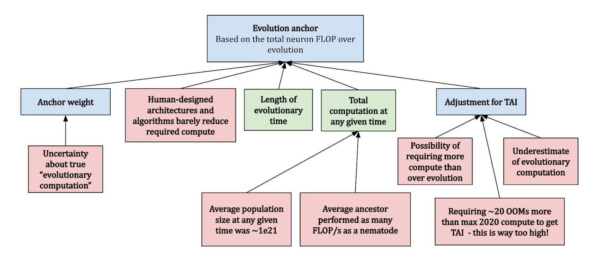
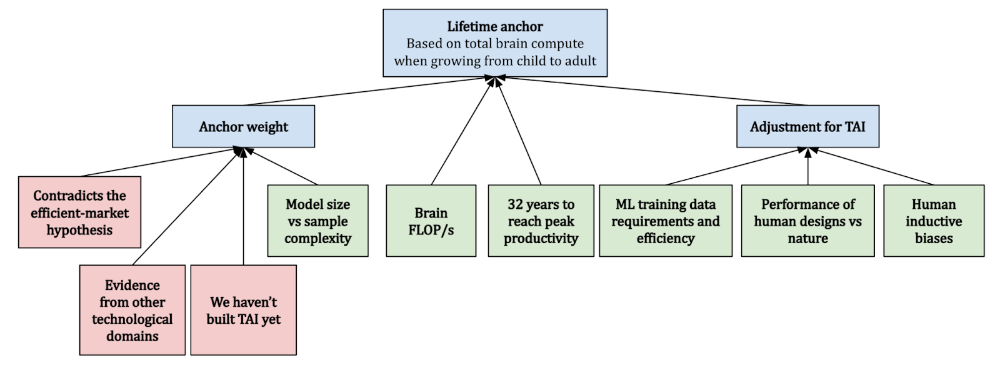
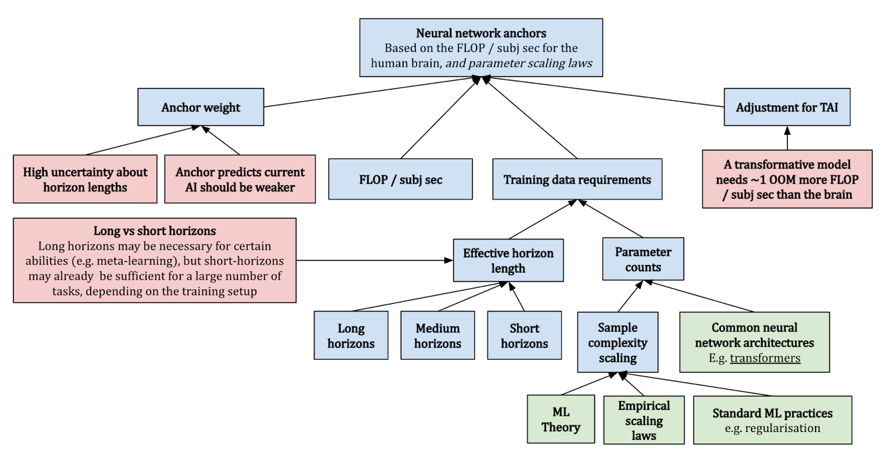
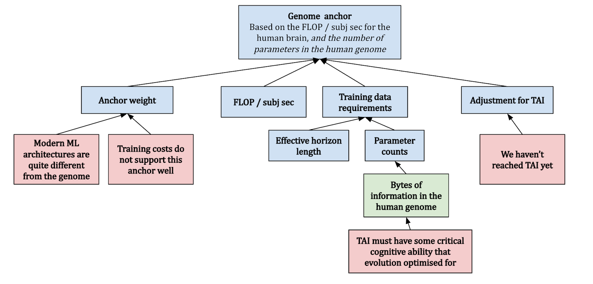

# 1.A4 Prévisions - Ancres biologiques

!!! warning "Tout ce qui se trouve dans les annexes est facultatif et vise à fournir des connaissances et un contexte supplémentaires. Vous n'avez pas besoin de lire ceci pour comprendre les points essentiels de ce chapitre ou des chapitres à venir."

## 1.A4.1 Ancre Évolutive {: #01}

Cette ancre quantifie l'effort de calcul investi par l'évolution dans la formation du cerveau humain. Elle considère la vaste quantité de traitement et d'apprentissage qui a eu lieu depuis l'émergence des premiers neurones jusqu'au développement du cerveau humain moderne. Cette méthode suggère que l'évolution a servi d'apprentissage préliminaire pour le cerveau humain, améliorant sa capacité à s'adapter et à survivre. Pour estimer la puissance de traitement de ce processus évolutif, le rapport considère la quantité totale de ressources computationnelles utilisées par tous les cerveaux animaux au cours de l'évolution. Cela inclut non seulement les cerveaux des humains, mais aussi ceux de nos ancêtres et d'autres animaux dotés de systèmes nerveux. L'idée est que toute cette activité cérébrale représente une forme d'apprentissage ou d'adaptation qui a contribué au développement du cerveau humain moderne. Bien que les calculs exacts impliqués dans cette estimation soient complexes et sujets à une incertitude considérable, l'idée de base est de multiplier le nombre d'animaux qui ont jamais vécu par la quantité de ressources computationnelles que chacun de leurs cerveaux a mise en œuvre au cours de leur vie. Cela donne une estimation du calcul total effectué par tous les cerveaux animaux au cours de l'évolution.

<figure markdown="span">
{ loading=lazy }
  <figcaption markdown="1"><b>Figure 1.49 :</b> L'ancre Évolutive ([Ho, 2022](https://epochai.org/blog/grokking-bioanchors))</figcaption>
</figure>

Cotra prend en compte ces considérations et suppose que l'« ancêtre moyen » réalisait autant de FLOP/s qu'un nématode, et qu'il y avait en moyenne ~1e21 ancêtres à tout moment. Cela donne une **médiane de ~1e41 FLOP**, ce qui semble extraordinairement élevé par rapport à l'apprentissage automatique moderne. À titre d'exemple, le modèle PaLM de Google a été entraîné avec ~2,5e24 FLOP (17 ordres de grandeur plus petit). Elle donne à cette ancre un **poids de 10 %**. ([Ho, 2022](https://epochai.org/blog/grokking-bioanchors))

## 1.A4.2 Ancre de Durée de Vie {: #02}

Cette méthode évalue l'activité computationnelle totale que le cerveau humain déploie au cours d'une vie entière. Cette ancre mesure essentiellement l'« entraînement » qu'un cerveau humain subit depuis la naissance jusqu'à l'âge adulte, en intégrant des facteurs tels que le nombre de neurones du cerveau humain, la quantité de calculs effectués par chaque neurone par an, et le temps nécessaire pour qu'un humain atteigne l'âge adulte. Le cerveau humain compte approximativement 86 milliards de neurones. Chacun de ces neurones réalise un certain nombre de calculs par seconde, calculables en nombre d'opérations par seconde en FLOP/s. Lors de l'estimation de la quantité totale de ressources computationnelles sur une durée de vie, ces facteurs sont multipliés ensemble, en tenant compte du nombre d'années typiquement vécu par un être humain.

Par exemple, si nous supposons qu'un neurone est capable de réaliser environ 1 000 opérations par seconde, et qu'il y a environ 31,5 millions de secondes dans une année, alors un seul neurone effectuerait environ 31,5 milliards d'opérations en un an. Maintenant, si nous multiplions cela par le nombre estimé de neurones dans le cerveau humain (86 milliards), nous obtenons une estimation des ressources computationnelles cérébrales effectuées en une année. Nous pouvons ensuite multiplier cela par le nombre d'années dans une durée de vie humaine typique pour estimer le total des ressources computationnelles cérébrales sur une durée de vie. L'insertion des nombres relatifs aux FLOP/s du cerveau semble suggérer qu'environ 1e27 FLOP seraient nécessaires pour atteindre l'intelligence artificielle transformative (TAI). Cela semble faible car des exemples d'autres domaines technologiques suggèrent que l'efficacité des systèmes que nous construisons (selon des métriques pertinentes) est généralement bien inférieure à celle observée dans la nature.

<figure markdown="span">
{ loading=lazy }
  <figcaption markdown="1"><b>Figure 1.50 :</b> L'ancre de Durée de Vie ([Ho, 2022](https://epochai.org/blog/grokking-bioanchors))</figcaption>
</figure>

Le rapport de Cotra trouve une médiane de ~1e28 FLOP et ne donne à l'ancre de durée de vie qu'un poids de 5 %, indiquant que ce n'est pas le facteur le plus influent du modèle global. Le rapport reconnaît les incertitudes et les complexités inhérentes à un tel calcul et utilise cette ancre comme l'une de plusieurs pour fournir une gamme d'estimations des ressources computationnelles nécessaires pour atteindre une intelligence artificielle avec des performances au niveau humain. ([Ho, 2022](https://epochai.org/blog/grokking-bioanchors))

## 1.A4.3 Ancres de Réseaux de Neurones {: #03}

Chacune des ancres de réseaux de neurones vise à offrir une perspective différente sur la quantité de ressources computationnelles potentiellement nécessaires pour entraîner une intelligence artificielle transformative (TAI). Le rapport propose trois ancres de réseaux de neurones : horizon long (~1e37 FLOP), horizon moyen (~1e34 FLOP) et horizon court (~1e32 FLOP). Ces ancres postulent que le ratio de paramètres par rapport aux ressources computationnelles utilisées par une TAI devrait être similaire à celui observé dans les réseaux de neurones actuels. De plus, une TAI devrait réaliser approximativement autant de FLOP par seconde subjective qu'un cerveau humain. Une « seconde subjective » représente le temps nécessaire à un modèle pour traiter autant de données qu'un humain peut le faire en une seconde ([Ho, 2022](https://epochai.org/blog/grokking-bioanchors)). Par exemple, un être humain typique lit environ 3-4 mots par seconde pour un texte non technique, si bien qu'« une seconde subjective » pour un modèle de langage correspondrait au temps requis par le modèle pour traiter environ ~3-4 mots de données. ([Cotra, 2020](https://www.alignmentforum.org/posts/KrJfoZzpSDpnrv9va/draft-report-on-ai-timelines)) Cotra détermine les exigences de données d'entraînement en combinant théorie de l'apprentissage automatique et considérations empiriques. Elle attribue 15 % de poids aux horizons courts, 30 % aux horizons moyens et 20 % aux horizons longs, totalisant 65 % pour ces trois ancres. ([Ho, 2022](https://epochai.org/blog/grokking-bioanchors))

<figure markdown="span">
{ loading=lazy }
  <figcaption markdown="1"><b>Figure 1.51 :</b> Ancres de Réseaux de Neurones ([Ho, 2022](https://epochai.org/blog/grokking-bioanchors))</figcaption>
</figure>

## 1.A4.4 Ancre du Génome {: #04}

L'ancre du génome examine les FLOP par seconde subjective du cerveau humain et s'attend à ce que la TAI nécessite autant de paramètres qu'il y a d'octets dans le génome humain. Cette hypothèse suppose implicitement un processus d'entraînement structurellement analogue à l'évolution, et que la TAI aura une capacité cognitive critique qu'a optimisée l'évolution. Cela diffère de l'ancre de l'évolution en ce qu'elle suppose que nous pouvons explorer les architectures/algorithmes possibles beaucoup plus efficacement que l'évolution, en utilisant des gradients. En raison de cette similitude structurelle, et parce que les signaux de retour sur l'adéquation d'une configuration génomique particulière sont généralement rares, cela suggère que l'ancre n'est véritablement pertinente qu'avec des horizons longs. ([Ho, 2022](https://epochai.org/blog/grokking-bioanchors))

<figure markdown="span">
{ loading=lazy }
  <figcaption markdown="1"><b>Figure 1.52 :</b> L'Ancre du Génome ([Ho, 2022](https://epochai.org/blog/grokking-bioanchors))</figcaption>
</figure>

Au moment de la rédaction (mai 2022), les architectures d'apprentissage automatique ne ressemblent pas beaucoup au génome humain, et nous n'avons pas encore développé de TAI - donc Cotra met à jour cette hypothèse en estimant qu'elle nécessiterait plus de FLOP. Dans l'ensemble, elle trouve une médiane d'environ 1e33 FLOP et accorde 10 % de poids à cette ancre. ([Ho, 2022](https://epochai.org/blog/grokking-bioanchors))