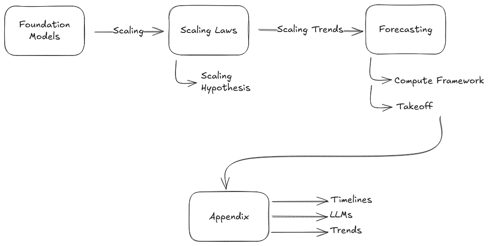

# Chapitre 01 - Capacités

    <!-- Colonne de gauche -->

        <!-- Auteurs -->
        

            
                <i class="fas fa-users"></i>
            
            

                
Auteurs

                

                    Markov Grey & Charbel-Raphael Segerie
                

            

        

        
        <!-- Affiliations -->
        

            
                <i class="fas fa-building"></i>
            
            

                
Affiliations

                

                    

Centre français pour la sécurité de l'IA (CeSIA)

                

            

        

<!-- Section des remerciements -->

    
        <i class="fas fa-heart"></i>
    
    

        
Remerciements

        

            Jeanne Salle, Charles Martinet, Vincent Corruble, Diego Dorn, Josh Thorsteinson, Jonathan Claybrough, Alejandro Acelas, Jamie Raldua Veuthey, Alexandre Variengien, Léo Dana, Angélina Gentaz, Nicolas Guillard, Leo Karoubi
        

    

    

    <!-- Colonne de droite -->
    

        <!-- Date -->
        

            
                <i class="fas fa-calendar"></i>
            
            

                
Dernière mise à jour

                
2024-11-20

            

        

        
        <!-- Temps de lecture -->
		

			
				<i class="fas fa-clock"></i>
			
			

				
Temps de lecture

				
94 min (partie principale), 51 min (annexe)

			

		

        
        <!-- Liens -->
        

            
                <i class="fas fa-link"></i>
            
            

                
Également disponible sur

                

                    <a href="https://www.alignmentforum.org/posts/MkfaQyxB9PN4h8Bs9/" class="meta-link">Alignment Forum</a> · <a href="https://docs.google.com/document/d/1HKo0Kest9Xppjn7m2ODpfMUlEu93SzLsfxXBH48Xaus/edit?usp=sharing" class="meta-link">Google Docs</a>
                

            

        

    

   <a href="https://www.youtube.com/watch?v=J_iMeH1hb9M" class="action-button">
       <i class="fas fa-video"></i>
       Regarder
   </a>
   

       <i class="fas fa-headphones"></i>
       Écouter
   

   <a href="https://raw.githubusercontent.com/CentreSecuriteIA/textbook/main/latex/AI%20Safety%20Atlas%20-%20Capacités.pdf" class="action-button" download>
       <i class="fas fa-file-pdf"></i>
       Télécharger
   </a>
   <a href="https://forms.gle/ZsA4hEWUx1ZrtQLL9" class="action-button">
       <i class="fas fa-comment"></i>
       Commentaires
   </a>
   <a href="https://docs.google.com/document/d/1L32xCVUCWEsm-x8UZ3GSTgKnmBcC7rJQLLIh9wGLj40/edit?usp=sharing" class="action-button">
       <i class="fas fa-users"></i>
       Contribuer
   </a>

# Introduction

<figure class="video-figure" markdown="span">
<iframe style="width: 100%; aspect-ratio: 16 / 9;" frameborder="0" allowfullscreen src="https://www.youtube.com/embed/J_iMeH1hb9M"></iframe>
  <figcaption markdown="1"><b>Vidéo 1.1 :</b> Vidéo optionnelle pour avoir un aperçu des capacités de l'IA.</figcaption>
</figure>

!!! quote "Yann LeCun, scientifique en chef de l'IA chez Meta et lauréat du prix Turing, mai 2023 ([Heaven, 2023](https://www.technologyreview.com/2023/05/02/1072528/geoffrey-hinton-google-why-scared-ai/))"

Il ne fait aucun doute que les machines deviendront plus intelligentes que les humains - dans tous les domaines où les humains sont intelligents - à l'avenir. C'est une question de quand et comment, pas de si.

Il ne fait aucun doute que les machines deviendront plus intelligentes que les humains - dans tous les domaines où les humains sont intelligents - à l'avenir. C'est une question de quand et comment, pas de si.

Le domaine de l'intelligence artificielle a connu une évolution spectaculaire ces dernières années. Ce chapitre pose les fondements essentiels de l'ouvrage en établissant ce que les systèmes d'IA peuvent actuellement accomplir, les mécanismes de leur acquisition de capacités, et comment nous pourrions anticiper leur développement futur. Cette compréhension est cruciale pour tous les chapitres suivants : la discussion des capacités dangereuses et des risques potentiels (Chapitre 2) découlant directement de la compréhension des capacités. De même, les solutions techniques proposées (Chapitre 3) et les solutions de gouvernance (Chapitre 4) doivent impérativement tenir compte du présent et du futur projeté des capacités de l'IA.

<figure markdown="span">
{ loading=lazy }
  <figcaption markdown="1"><b>Figure 1.1 :</b> Nous expliquons d'abord les modèles fondamentaux, qui ont montré des capacités continuellement améliorées grâce à la mise à l'échelle. Nous examinons ensuite les lois d'échelle empiriquement observées. Sur la base de ces tendances, nous explorons quelques techniques que les chercheurs utilisent pour tenter de prédire les progrès futurs de l'IA.</figcaption>
</figure>

État de l'art de l'IA - Des capacités révolutionnaires atteintes dans plusieurs domaines. Nous commençons par explorer comment les systèmes d'IA sont passés d'outils spécialisés et limités à des instruments de plus en plus génériques. Les modèles de langage peuvent désormais s'engager dans un raisonnement complexe, tandis que les systèmes de vision par ordinateur démontrent une compréhension sophistiquée des informations visuelles. En robotique, nous assistons à l'émergence de systèmes capables d'apprendre et de s'adapter à des environnements réels avec une autonomie croissante. L'objectif de cette section est de donner au lecteur de nombreux exemples provenant de différents domaines des capacités croissantes de l'IA.

**Modèles fondamentaux - Une révolution dans la construction des systèmes d'IA.** La section suivante explore notre passage d'architectures spécialisées et restreintes à des architectures génériques de grande envergure. Plutôt que de construire des systèmes distincts pour chaque tâche, ces modèles fondamentaux servent désormais de point de départ. Ce sont des blocs de construction qui peuvent être ultérieurement adaptés à diverses applications via le *fine-tuning*. Nous examinerons comment ces modèles sont entraînés, leurs propriétés essentielles et les défis singuliers qu'ils soulèvent. L'émergence de capacités imprévues au sein de ces modèles pose des questions cruciales concernant leur potentiel et leurs implications pour la sécurité de l'IA.

**Comprendre l'intelligence - Les capacités nécessitent une mesure précise pour guider le travail sur la sécurité de l'IA**. L'objectif de cette section est de fournir une compréhension de ce que signifient concrètement des termes comme intelligence artificielle générale (IAG, de l'anglais *Artificial General Intelligence*) et superintelligence artificielle (SIA). À travers des études de cas détaillées et des observations empiriques, nous examinerons différentes approches de définition et de caractérisation quantitative des capacités de l'IA. Au-delà des distinctions binaires traditionnelles entre l'IA "étroite" et "générale", nous introduisons des cadres formels plus nuancés qui permettent de suivre les progrès selon plusieurs dimensions, essentiels pour comprendre quand et comment mettre en œuvre des protocoles de sécurité adaptés aux systèmes d'IA.

**Mise à l'échelle - La leçon cruciale des lois de mise à l'échelle : l'échelle comme moteur du progrès**. Nous explorons comment des algorithmes simples, combinés à une puissance de calcul massive, surpassent souvent des approches sophistiquées élaborées manuellement. Cela nous conduit à examiner les lois de mise à l'échelle qui décrivent l'amélioration des performances de l'IA en fonction de différentes variables : volume de données, nombre de paramètres et ressources informatiques accrues. Cette section examine également le débat sur la capacité de l'échelle seule à produire des capacités d'IA transformatives.

**Prévision - Prédire les progrès des capacités nous aide à préparer les mesures de sécurité à l'avance**. S'appuyant sur notre compréhension des capacités actuelles et des comportements de mise à l'échelle, nous examinons différentes approches pour anticiper les progrès futurs. Des méthodes d'ancrage biologique à l'analyse des tendances, nous explorons des cadres permettant de formuler des prédictions éclairées sur les trajectoires de développement de l'IA. Connaître le moment opportun pour mettre en place des mesures de sécurité est crucial.

**Annexes - Vue d'ensemble des opinions d'experts sur l'IA, débats détaillés autour de la mise à l'échelle et des tendances de mise à l'échelle.** Nous considérons ces sections comme facultatives, mais néanmoins utiles pour ceux qui souhaitent approfondir leur compréhension. Le chapitre se termine par des annexes examinant les opinions d'experts sur les progrès de l'IA, des discussions approfondies sur la nature et les limites des grands modèles de langage, et des données exhaustives sur les tendances clés du développement de l'IA.