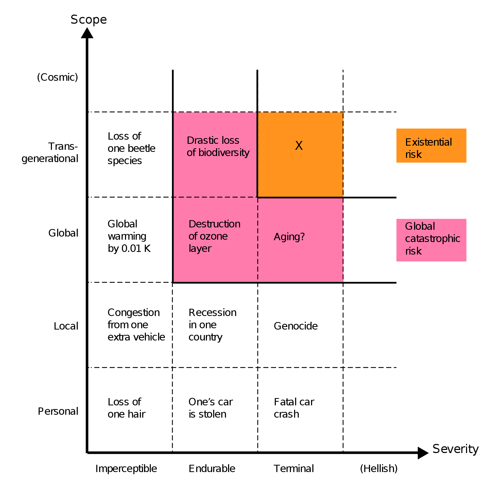
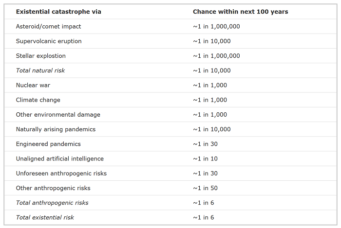

# 2.1 Décomposition des Risques

Bien que l'IA continue de progresser à un rythme rapide, notre compréhension actuelle de l'IA et de ses implications potentielles à long terme reste incomplète, ce qui pose des défis significatifs dans l'évaluation et la gestion précises des risques associés.

<figure class="iframe-figure" markdown="span">
<iframe src="https://ourworldindata.org/grapher/annual-reported-ai-incidents-controversies?tab=chart" loading="lazy" style="width: 100%; height: 600px; border: 0px none;" allow="web-share; clipboard-write"></iframe>
  <figcaption markdown="1"><b>Figure interactive 2.1 :</b> Nombre d'incidents et de controverses liés à l'IA rapportés ([Giattino et al., 2023](https://ourworldindata.org/artificial-intelligence))</figcaption>
</figure>

## 2.1.1 Causes des Risques {: #01}

Pour être en mesure de comprendre et de mettre en place des défenses contre les risques potentiels causés par l'IA, nous devons d'abord les catégoriser. Dans cette section, nous présentons une taxonomie de classification des risques liés à l'IA selon une approche causale, c'est-à-dire une catégorisation basée sur la responsabilité des risques. Les principaux risques sur lesquels nous nous concentrerons sont les suivants :

- **Risque de mauvaise utilisation :** Cela inclut les cas où le système d'IA est simplement un outil, mais où les objectifs des humains assistés par l'IA engendrent des dommages. Cela comprend les acteurs malveillants, les États-nations, les entreprises ou les individus capables de tirer parti de capacités avancées pour amplifier les risques. Essentiellement, ces risques découlent de la responsabilité de certains individus ou groupes humains.

- **Risque de désalignement :** Ces risques sont causés par des problèmes intrinsèques au processus d'apprentissage automatique ou par des difficultés structurelles inhérentes à la conception des systèmes d'IA. Cette catégorie comprend également les risques résultant de l'interaction et de la coopération de plusieurs IA. Ce sont des risques liés à des comportements non intentionnels causés par des IA, indépendamment des intentions humaines.

- **Risque systémique :** Ces risques traitent des perturbations ou des mécanismes de rétroaction résultant de l'intégration de l'IA avec d'autres systèmes complexes du monde. Dans ce cas, les causes en amont sont difficiles à identifier car la responsabilité du risque se trouve dispersée parmi de nombreux acteurs et systèmes interconnectés. Des exemples pourraient inclure l'IA (ou des groupes d'IA) exerçant une influence sur les systèmes économiques, logistiques ou politiques. Il en résulte divers types de risques, l'ensemble du système global de la civilisation humaine pouvant alors dévier de manière non intentionnelle, et ce malgré des IA potentiellement alignées et utilisées de manière responsable.

Bien que la plupart des risques liés à l'IA s'inscrivent probablement dans l'une de ces trois catégories, il peut exister des zones grises qui ne correspondent pas parfaitement à cette taxonomie. Par exemple, un système d'IA avancé causant des dommages en raison d'une interaction complexe d'objectifs désalignés (risque de désalignement) et d'une intégration avec des systèmes mondiaux de manière non intentionnelle (risque systémique). Les catégories peuvent se chevaucher dans certains scénarios.

Malgré cela, nous pensons que cette répartition générale constitue une base solide qui capture de nombreux risques clés liés à l'IA, tels que compris actuellement par les experts du domaine. Les sous-sections suivantes fourniront plus de détails sur chacune de ces catégories de risques individuellement.

## 2.1.2 Sévérité des Risques {: #02}

La sous-section précédente s'est concentrée sur la question - Qu'est-ce qui cause le risque ?, mais nous n'avons pas encore catégorisé - Quelle est la gravité des risques causés ? Dans cette sous-section, nous allons parcourir les catégorisations potentielles de la sévérité des risques posés.

**Risques destructifs de l'IA.** En général, ces risques font référence à des scénarios où les systèmes d'IA causent des dommages qui, bien que sévères, sont confinés à un domaine ou un secteur spécifique et ne se propagent pas à l'échelle mondiale. Il s'agit donc de types de risques impliquant des dommages significatifs mais localisés. Des exemples incluent la perturbation économique, où un système d'IA manipule les marchés financiers conduisant à des crises économiques localisées. Ou des scénarios tels qu'une attaque d'infrastructure où l'on observe des cyberattaques pilotées par l'IA sur des réseaux électriques, des systèmes de transport ou d'autres infrastructures critiques dans un pays ou une région spécifique.

Les risques peuvent être catégorisés à la fois en termes de nombre de personnes qu'ils affectent et de leur portée spatiale et temporelle. Dans cette section consacrée à la sévérité des risques, nous nous concentrons sur les risques qui affectent non seulement localement, mais à l'échelle de la planète entière, et sur plusieurs générations. On les appelle : risques catastrophiques globaux et risques existentiels.

Les menaces catastrophiques globales et existentielles peuvent être causées par mauvaise utilisation, désalignement ou facteurs systémiques. C'est-à-dire que nous pouvons avoir de nombreuses combinaisons comme un risque catastrophique global causé par des défaillances de désalignement, ou un risque existentiel causé par des défaillances systémiques.

### 2.1.2.1 Risques Catastrophiques {: #02-01}

**Quels sont les risques catastrophiques ?** Les risques catastrophiques (ou risques catastrophiques mondiaux) sont des menaces susceptibles de causer des dommages sévères à l'humanité à l'échelle planétaire. Ils se distinguent par leur capacité à affecter une part significative de la population mondiale, généralement définie comme des risques menaçant la survie d'au moins 10 % de la population mondiale. La gravité de ces risques réside non seulement dans les dommages immédiats qu'ils peuvent engendrer, mais aussi dans leurs possibles répercussions à long terme.

<figure markdown="span">
{ loading=lazy }
  <figcaption markdown="1"><b>Figure 2.2 :</b> Évaluation des risques catastrophiques globaux par RAND. Le placement et la taille des ovales dans cette figure représentent une représentation qualitative des relations relatives entre les menaces et les dangers. La figure ne présente que des exemples de cas ou de scénarios décrits dans ces chapitres, et non tous les scénarios décrits. ([Willis et al., 2024](https://www.rand.org/pubs/research_reports/RRA2981-1.html))</figcaption>
</figure>

**Risques d'IA trans-générationnels**. Ce sont des risques qui pourraient affecter les générations futures. Ces risques impliquent des scénarios où les actions des systèmes d'IA aujourd'hui ont des conséquences à long terme qui impacteront des personnes bien au-delà du présent. Des exemples incluent la destruction environnementale, où des systèmes d'IA exploitant les ressources naturelles de manière non durable provoquent des dommages écologiques à long terme. Cela pourrait également concerner la manipulation génétique, où les technologies d'IA modifient la génétique humaine de manière à avoir des effets potentiellement inconnus et nocifs sur les générations futures.

**Quels sont des exemples de risques catastrophiques ?** Il y a eu de nombreuses instances dans l'histoire de risques catastrophiques globaux causés par des causes naturelles. Un exemple est la Peste Noire, qui aurait pu entraîner la mort d'un tiers de la population européenne, correspondant à 10 % de la population mondiale de l'époque.

Mais à mesure que les technologies progressent, il existe une menace croissante que nous puissions découvrir des technologies permettant de causer des dommages similaires à ceux des catastrophes naturelles, mais cette fois-ci en raison de causes humaines. ([Wikipedia](https://en.wikipedia.org/wiki/Global_catastrophe_scenarios)) Par exemple, la guerre nucléaire fut le premier risque catastrophique global d'origine humaine, car une guerre mondiale pourrait tuer un pourcentage important de la population humaine. ([Conn, 2015](https://futureoflife.org/background/the-risk-of-nuclear-weapons/))

De manière similaire à la biotechnologie, l'IA peut substantiellement améliorer la vie des gens. Cependant, si la technologie n'est pas développée de manière sécurisée, il existe un risque non négligeable qu'un système d'IA soit accidentellement ou intentionnellement libéré, pouvant in fine provoquer des risques globaux.

L'impact de ces scénarios peut varier considérablement, selon la cause et la gravité de l'événement, allant de la perturbation économique temporaire à la mort de millions de personnes. Nous entrerons dans les détails des scénarios spécifiques qui engendrent de tels risques plus tard dans le texte.

### 2.1.2.2 Risques Existentiels {: #02-02}

**Quels sont les risques existentiels ?** La plupart des risques catastrophiques mondiaux ne seraient pas assez intenses pour tuer la majorité de la vie sur Terre, mais même si c'était le cas, l'écosystème et l'humanité pourraient potentiellement se reconstituer avec le temps. Un risque existentiel, en revanche, est un risque dans lequel l'humanité serait définitivement incapable de réaliser son potentiel historique. Les risques existentiels sont considérés comme la classe la plus sévère de risques catastrophiques mondiaux et sont souvent également appelés x-risks (risques x, de l'anglais existential risks).

!!! info "Définition : Risques Existentiels (x-risks) ([Conn, 2015](https://futureoflife.org/existential-risk/existential-risk/))"

Un risque existentiel est tout risque ayant le potentiel d'éliminer toute l'humanité ou, à tout le moins, de tuer de vastes portions de la population mondiale, laissant les survivants sans moyens suffisants pour reconstruire la société selon le niveau de vie actuel.

<figure markdown="span">
{ loading=lazy }
  <figcaption markdown="1"><b>Figure 2.3 :</b> Catégories qualitatives de risques. La portée du risque peut être personnelle (affectant une seule personne), locale (affectant une région géographique ou un groupe distinct), globale (affectant l'ensemble de la population humaine ou une grande partie de celle-ci), trans-générationnelle (affectant l'humanité sur plusieurs générations), ou pan-générationnelle (affectant la quasi-totalité des générations futures). La sévérité du risque peut être classée comme imperceptible (à peine remarquable), endurable (causant des dommages significatifs mais ne ruinant pas complètement la qualité de vie), ou écrasante (causant la mort ou une réduction permanente et drastique de la qualité de vie). ([Bostrom, 2012](https://existential-risk.com/concept))</figcaption>
</figure>

Dans son livre « *The Precipice* » publié en 2020, le philosophe Toby Ord a fourni une analyse détaillée des risques existentiels. Il a reconnu l'IA comme l'un des principaux risques existentiels auxquels l'humanité est confrontée aujourd'hui, soulignant qu'il existe une probabilité non négligeable que le développement d'une IA avancée, ou Intelligence Artificielle Générale (IAG), puisse conduire à une catastrophe existentielle si elle n'est pas correctement alignée avec les intérêts et les valeurs humains ([Ord, 2020](https://www.goodreads.com/book/show/48570420-the-precipice)).

<figure markdown="span">
{ loading=lazy }
  <figcaption markdown="1"><b>Figure 2.4 :</b> Selon Ord, la plupart des risques aujourd'hui sont anthropiques. « [Ces chiffres] ne sont en aucun cas le dernier mot, mais constituent un résumé concis de tout ce que je sais sur le paysage des risques. » ([Toby Ord, 2020](https://www.goodreads.com/book/show/48570420-the-precipice)).</figcaption>
</figure>

Si nous faisons face à une catastrophe de niveau existentiel, nous ne pouvons ni apprendre ni nous remettre de l'événement, car il entraînerait soit la fin complète de l'humanité, soit un recul permanent du progrès civilisationnel ([Bostom, 2008](https://www.goodreads.com/book/show/2659696-global-catastrophic-risks)).[^footnote_1] C'est pourquoi les risques existentiels (x-risks) méritent une grande prudence et appellent à des stratégies préventives plutôt que réactives. Les risques existentiels incluent des scénarios tels que les humains perdant le contrôle d'une superintelligence artificielle (SSI) et s'éteignant en raison d'objectifs mal alignés, ou se retrouvant dans une dystopie permanente parce que l'IA a permis l'établissement d'un régime totalitaire mondial où les générations futures sont perpétuellement opprimées ([Hendrycks et al., 2023](https://arxiv.org/abs/2306.12001)).

[^footnote_1] : Un effondrement civilisationnel irrémédiable, où l'humanité disparaîtrait soit totalement, soit sans être remplacée par une civilisation ultérieure capable de se reconstruire, a été évoqué comme une possibilité théorique, mais avec une probabilité extrêmement faible. ([Rodriguez, 2020](https://forum.effectivealtruism.org/posts/GsjmufaebreiaivF7/what-is-the-likelihood-that-civilizational-collapse-would))

Nous aborderons les solutions et les stratégies d'atténuation des risques dans les chapitres ultérieurs. Pour le reste de ce chapitre, nous approfondirons les arguments qui amènent de nombreux chercheurs à penser que l'IA peut causer de tels risques. Nous tenterons de présenter des scénarios spécifiques illustrant leurs manifestations possibles, mais gardez à l'esprit qu'il subsiste de nombreuses incertitudes et que nous ne pouvons prétendre être exhaustifs. Pour certains risques, nous ne pourrons que présenter les preuves empiriques disponibles et les arguments expliquant leur plausibilité théorique.