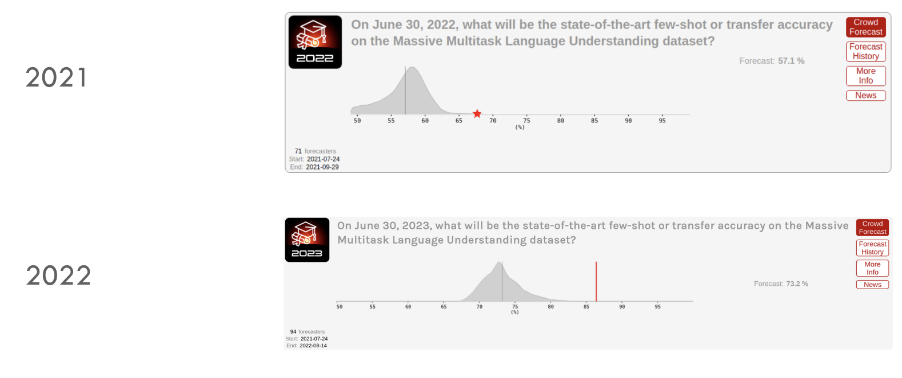
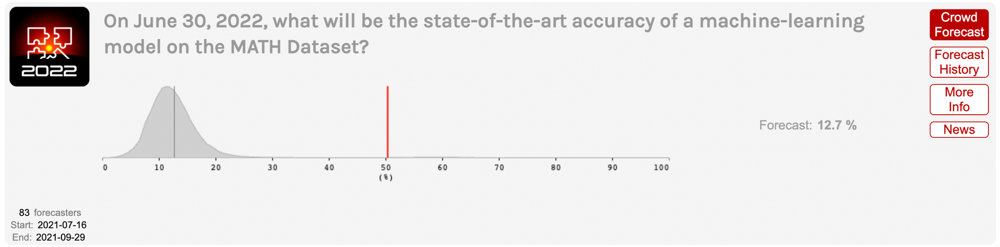
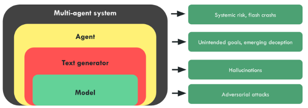
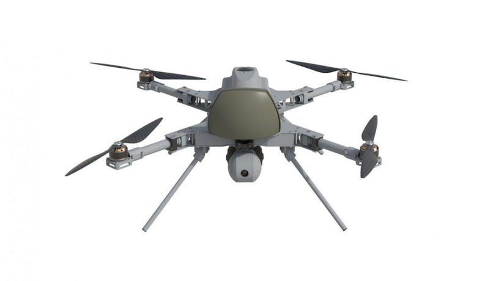

# 2.2 Amplificateurs de Risques

Cette section examine les facteurs communs fondamentaux des systèmes d'IA, ainsi que l'environnement de développement qui les entoure, qui constituent des catalyseurs d'amplification des risques.

## 2.2.1 Accidents {: #01}

Souvent, le but principal de la création d'une nouvelle technologie est de produire un impact positif sur la société. Malgré ces intentions nobles, il existe une catégorie majeure de risques qui émerge de grands projets bien intentionnés qui échouent de manière imprévue. ([Critch & Russel, 2023](https://arxiv.org/abs/2306.06924))

**Déceler les défauts n'est pas chose aisée**. Il faut souvent du temps pour observer tous les effets secondaires de la mise en circulation d'une technologie. L'histoire regorge d'exemples de technologies que nous avons développées et libérées, pour découvrir plus tard leurs effets néfastes. Quelques exemples marquants incluent l'utilisation de peintures et d'essence au plomb, qui a provoqué l'empoisonnement de vastes populations ([Kovarik, 2012](https://environmentalhistory.org/about/ethyl-leaded-gasoline/lead-history-timeline/)), l'utilisation des chlorofluorocarbures (CFC) ayant entraîné un trou dans la couche d'ozone ([NASA, 2004](https://earthobservatory.nasa.gov/features/RemoteSensingAtmosphere/remote_sensing5.php)), notre utilisation de l'amiante liée à des problèmes de santé graves, le tabagisme, et plus récemment l'usage généralisé des réseaux sociaux, dont l'utilisation excessive est associée à la dépression et à l'anxiété. ([Hendrycks, 2024](https://www.aisafetybook.com/textbook/organizational-risks))

Certains de ces risques sont diffus et n'émergent qu'au niveau sociétal, mais d'autres sont peut-être plus faciles à comparer aux risques liés aux IA logicielles :

**Trou non détecté dans la couche d'ozone**. L'exemple du trou dans la couche d'ozone illustre comment une responsabilité diffuse, combinée à un système de détection défaillant, peut masquer un problème grave pendant une longue période ([NASA, 2004](https://earthobservatory.nasa.gov/features/RemoteSensingAtmosphere/remote_sensing5.php)). Le logiciel d'analyse de données utilisé par la NASA pour cartographier la couche d'ozone avait été conçu pour filtrer systématiquement les valeurs s'écartant significativement des mesures normales, occultant ainsi des signes critiques de changement.

**La sonde spatiale Mariner 1**. En 1962, la sonde Mariner 1 à peine sortie de Cap Canaveral a commencé à dévier dangereusement de sa trajectoire. Craignant qu'elle ne se dirige vers une chute catastrophique sur Terre, les ingénieurs de la NASA ont immédiatement déclenché la procédure d'autodestruction, pulvérisant l'engin environ 290 secondes après son lancement. L'enquête ultérieure a révélé la cause : une erreur logicielle d'une simplicité déconcertante. Un trait d'union manquant dans une ligne de code avait provoqué l'envoi de signaux de guidage erronés à la sonde spatiale. ([Martin, 2023](https://raygun.com/blog/costly-software-errors-history/))

Il existe d'innombrables exemples analogues. Tout comme le trait d'union manquant dans le logiciel de la sonde Mariner, nous avons également observé des dysfonctionnements similaires provenant de la modification d'un seul caractère dans les systèmes d'IA. OpenAI a accidentellement inversé le signe de la fonction de récompense lors de l'entraînement de GPT-2. Le résultat fut un modèle qui optimisait la polarité négative tout en préservant la cohérence linguistique naturelle. Au fil du temps, cela a conduit le modèle à générer un contenu texuel de plus en plus explicite sur le plan sexuel, indépendamment de l'amorce initiale. Comme l'ont souligné les auteurs : "Ce dysfonctionnement était remarquable car le résultat n'était pas incohérent mais représentait une sortie d'une qualité extrêmement dégradée. Les développeurs n'avaient pas surveillé le processus d'entraînement, si bien que le problème n'a été détecté qu'une fois l'apprentissage achevé." ([Ziegler et al., 2020](https://arxiv.org/abs/1909.08593))

Bien que cet exemple n'ait pas engendré de conséquences majeures, hormis peut-être pour les évaluateurs humains contraints de passer une nuit entière à décortiquer un texte de plus en plus répréhensible, on peut aisément concevoir qu'un dysfonctionnement aussi minime qu'une simple inversion de signe dans une fonction de récompense pourrait générer des résultats particulièrement critiques s'il survenait dans des modèles plus sophistiqués.

L'amélioration rapide, conjuguée à un manque de compréhension et de prévisibilité, rend de plus en plus probable le risque que, malgré les meilleures intentions, nous ne puissions prévenir des accidents. Cela milite en faveur de déploiements des systèmes d'IA prudents et progressifs, en rupture totale avec la philosophie du "cassage rapide" privilégiée par certaines entreprises technologiques.

**Dysfonctionnements préjudiciables** ([Jones, 2024](https://aisafetyfundamentals.com/blog/ai-risks/)). Les systèmes d'IA peuvent commettre des erreurs s'ils sont utilisés de manière inappropriée. Par exemple :

- Une voiture autonome à San Francisco a percuté un piéton, projeté sur sa trajectoire par un autre véhicule. Bien que l'on puisse considérer que le système n'était pas directement responsable, la voiture, après un bref arrêt initial, a redémarré, traînant le piéton blessé sur six mètres supplémentaires. ([The Guardian, 2023](https://www.theguardian.com/technology/2023/nov/08/cruise-recall-self-driving-cars-gm)) Des enquêteurs gouvernementaux ont par ailleurs affirmé que l'entreprise avait initialement dissimulé la gravité de la collision. ([The Guardian, 2023](https://www.theguardian.com/business/2023/dec/04/california-cruise-robotaxi-san-francisco-accident-severity))

- Un chatbot médical déployé au Royaume-Uni a essuyé de vives critiques après avoir conseillé à des patients suspectant une crise cardiaque de ne pas consulter. Lorsqu'un médecin a soulevé ces inquiétudes préoccupantes, l'entreprise a répondu en traitant ce professionnel de santé de « troll Twitter ».

De surcroît, l'utilisation des systèmes d'intelligence artificielle peut rendre plus difficile la détection et la résolution des problèmes de processus. Les résultats des systèmes informatiques ont tendance à être considérés avec une confiance excessive. ([Wikipedia](https://en.wikipedia.org/wiki/Automation_bias)) Qui plus est, comme la plupart des modèles d'IA sont utilisés comme des boîtes noires et que ces systèmes sont nettement plus susceptibles d'être protégés des examens judiciaires que les processus humains, il peut s'avérer ardu de prouver leurs erreurs. ([Marshall, 2021](https://www.postofficetrial.com/2021/06/marshall-spells-it-out-speech-to.html))

## 2.2.2 Indifférence {: #02}

Les risques découlant de l'indifférence peuvent survenir lorsque les créateurs de modèles d'IA découvrent certains problèmes, mais négligent la portée des conséquences morales potentiellement associées au déploiement du système.

Certains employés d'une entreprise pourraient mener une analyse de risques et conclure que le risque est plus important ou plus grave que prévu. Cependant, si l'entreprise peut tirer un profit considérable de sa stratégie, ou si d'autres facteurs tels que la manipulation des enjeux de sécurité ou les dynamiques concurrentielles entrent en jeu, le modèle pourrait néanmoins être déployé. Il peut alors s'avérer très difficile de provoquer un changement, sauf en cas d'intervention extérieure ou de risque de révéler publiquement le manque de considération de l'entreprise pour les conséquences morales potentielles du déploiement d'un tel système. ([Critch et al., 2023](https://arxiv.org/abs/2306.06924))

Un parallèle potentiel pour de tels risques d'indifférence peut être observé dans le procès qui allègue que Facebook a violé la loi sur la protection des consommateurs.

Selon le procès - « Ils ont délibérément conçu leurs applications pour entraîner une dépendance chez les jeunes utilisateurs, trompant sciemment et à répétition le public sur les dangers de la surutilisation de leurs produits. Le procès soutient que, sur la base de ses propres recherches internes, Meta était pleinement conscient des dommages significatifs causés aux adolescents et a délibérément choisi de dissimuler ces informations et d'induire le public en erreur, dans le seul but de réaliser des profits. Ces agissements portent préjudice à des centaines de milliers d'adolescents du Massachusetts qui utilisent activement Instagram. »

Si de telles attitudes d'indifférence persistent à mesure que se développent des systèmes d'IA de plus en plus sophistiqués, le risque de préjudice touchant des pans toujours plus larges de la société — et de manière de plus en plus grave — s'accroîtra inévitablement.

Les risques liés à l'indifférence des entreprises soulignent pourquoi la simple possession d'une solution technologique pour atténuer les risques ne suffit pas. Nous devons également établir des réglementations, et des normes et standards industriels mondiaux qui ne peuvent être ignorés, tels que des codes de conduite professionnels, des organismes de régulation, des pressions politiques et des lois. Par exemple, les entreprises technologiques ayant un grand nombre d'utilisateurs pourraient être tenues de maintenir un suivi détaillé de l'impact de leurs services sur le bien-être de leurs utilisateurs. ([Critch et al., 2023](https://arxiv.org/abs/2306.06924)) Nous reviendrons plus en détail sur les interventions techniques possibles dans les chapitres consacrés aux Solutions, et sur les interventions réglementaires dans le chapitre relatif à la Gouvernance de l'IA.

## 2.2.3 Imprévisibilité {: #03}

L'intelligence artificielle a déjoué les pronostics des experts. La première chose à garder à l'esprit est que le rythme de progression des capacités a dérouté presque tous les spécialistes du domaine. Nous avons observé de nombreux exemples dans l'histoire où les scientifiques et les experts sous-estiment significativement le temps nécessaire pour qu'une percée technologique révolutionnaire devienne réalité.

Pendant longtemps, le célèbre scientifique cognitif Douglas Hofstadter était parmi ceux qui prédisaient une progression lente. « Je pensais qu'il faudrait des centaines d'années avant qu'existe quelque chose de même vaguement ressemblant à un esprit humain », a-t-il déclaré lors d'une interview. ([Hofstadter, 2023](https://www.youtube.com/watch?v=lfXxzAVtdpU&t=1763s&ref=planned-obsolescence.org))

!!! quote "Douglas Hofstadter ([Hofstadter, 2023](https://www.youtube.com/watch?v=lfXxzAVtdpU&t=1763s&ref=planned-obsolescence.org))"

Ce phénomène a commencé à se produire à un rythme accéléré, où des objectifs auparavant impossibles et des choses que les ordinateurs ne devraient pas être capables de faire ont commencé à s'effondrer [...] les systèmes sont devenus de plus en plus performants en traduction entre langues, puis dans la production de réponses intelligibles à des questions difficiles en langage naturel, et même dans l'écriture de poésie [...] Les progrès accélérés ont été tellement inattendus, m'ont tellement pris par surprise, non seulement moi-même mais beaucoup, beaucoup de personnes, qu'il y a une certaine forme de terreur d'un tsunami à venir qui va prendre toute l'humanité au dépourvu.

L'**imprévisibilité** des systèmes d'IA : un défi émergent où les capacités technologiques déjouent constamment les pronostics les plus raisonnés, créant des capacités et des comportements qui surgissent de manière totalement inattendue et dépassent les attentes les plus prudentes des concepteurs.

Les chercheurs en apprentissage automatique, les superforecasters[^footnote_2], et la plupart des autres ont été surpris par les progrès des grands modèles de langage en 2022 et 2023.

[^footnote_2] : Un superforecaster est une personne capable de réaliser des prévisions qui peuvent être statistiquement démontrées comme étant systématiquement plus précises que celles du grand public ou des experts. ([Wikipedia](https://en.wikipedia.org/wiki/Superforecaster))

En mi-2021, le professeur en apprentissage automatique Jacob Steinhardt a organisé un concours pour prédire les progrès sur MATH et MMLU, deux benchmarks célèbres.

<figure markdown="span">
{ loading=lazy }
  <figcaption markdown="1"><b>Figure 2.5 :</b> Les experts ont systématiquement sous-estimé le rythme des progrès de l'IA.</figcaption>
</figure>

Les superforecasters ont largement sous-estimé la réalité :

- En 2021, ils ont prédit que les performances sur MMLU augmenteraient modérément de 44% en 2021 à 57% en juin 2022. Les performances réelles étaient de 68%, ce que les superforecasters avaient considéré comme incroyablement improbable. ([Cotra, 2023](https://www.planned-obsolescence.org/language-models-surprised-us/))

- Peu de temps après, les modèles sont devenus encore meilleurs — GPT-4 a atteint 86,4 % sur ce benchmark, proche des 89,8 % qui seraient considérés comme un niveau « expert » dans chaque domaine, correspondant au 95e percentile parmi les participants aux tests dans chaque catégorie spécifique. ([Cotra, 2023](https://www.planned-obsolescence.org/language-models-surprised-us/))

Ceci est encore plus visible pour le jeu de données MATH, qui consiste en des questions à réponse libre issues de concours mathématiques visant les meilleurs étudiants de lycée du pays. La plupart des adultes diplômés de l'enseignement supérieur ne parviendraient qu'à résoudre moins de la moitié de ces problèmes. Lors de son introduction en janvier 2021, le meilleur modèle n'affichait qu'un taux de réussite d'environ 7 % sur MATH. ([Cotra, 2023](https://www.planned-obsolescence.org/language-models-surprised-us/)). Et voici ce qui s'est passé :

<figure markdown="span">
{ loading=lazy }
  <figcaption markdown="1"><b>Figure 2.6 :</b> Une autre distribution de prédictions par des experts en 2022, qui a largement sous-estimé les capacités attendues.</figcaption>
</figure>

Toutes les formes de progrès ne peuvent pas être facilement capturées par des benchmarks quantifiables. Souvent, nous nous intéressons davantage aux *jalons* qualitatifs des systèmes d'IA : quand traduiront-ils aussi bien qu'un locuteur parfaitement bilingue ? Quand battront-ils les meilleurs humains à Starcraft ? Quand parviendront-ils à prouver des théorèmes mathématiques inédits ?

Katja Grace d'AI Impacts a demandé à des experts en apprentissage automatique de prédire un large panel de jalons en IA en 2022. Cela a eu lieu quelques mois avant la sortie de ChatGPT. Cette fois, la précision était encore plus basse : les experts n'ont pas réussi à anticiper les progrès que ChatGPT et GPT-4 allaient bientôt apporter. Ces modèles ont atteint des jalons comme « Écrire une dissertation pour un cours d'histoire de lycée » ou « Répondre mieux qu'un expert à des questions factuelles dont la réponse est aisément trouvable sur internet » juste quelques mois après la réalisation de l'enquête, alors que les experts s'attendaient à ce que cela prenne des années. ([Cotra, 2023](https://www.planned-obsolescence.org/language-models-surprised-us/))

Cela signifie qu'encore après les grandes surprises des benchmarks de 2022, les experts demeuraient, dans certains cas, étonnamment prudents quant aux progrès anticipés, sous-estimant manifestement la situation réelle.

## 2.2.4 Boîtes noires {: #04}

Ces risques sont d'autant plus critiques du fait de la nature de boîte noire des systèmes d'apprentissage automatique avancés. Notre compréhension du comportement des systèmes d'IA, des objectifs qu'ils poursuivent, et de leurs mécanismes internes reste largement en deçà des capacités qu'ils démontrent. Le domaine de l'interprétabilité vise à progresser sur ce front, mais demeure très limité.

Les modèles d'IA sont entraînés, et non construits. Cette approche diffère radicalement de l'assemblage d'un avion, où chaque pièce est testée et approuvée pour créer un système modulaire, robuste et parfaitement compris. Les modèles d'IA apprennent par eux-mêmes les heuristiques nécessaires à l'exécution de tâches, avec un contrôle et une compréhension qui restent très limités. La descente de gradient – une méthode d'optimisation où l'algorithme ajuste progressivement ses paramètres pour minimiser une fonction d'erreur – est puissante, mais nous maîtrisons mal la structure qu'elle fait émerger. Pour illustrer cette différence, on peut comparer une base de code méthodiquement documentée, fonction par fonction, à un code devenu illisible, truffé d'abstractions fragiles et dépourvues de toute modularité.

Les systèmes d'IA constituent une série de phénomènes émergents que nous orientons sans vraiment les comprendre. Nous pouvons leur donner une direction générale, par exemple en concevant le jeu de données ou par l'ingénierie des invites, mais cela reste bien loin de la précision des ingénieurs logiciels ou de la conception systémique propre à l'industrie aérospatiale. Aucune garantie formelle ne permet d'assurer que le système se comportera conformément aux attentes. Les systèmes d'IA ressemblent à des poupées russes, où chaque couche technologique est enveloppée de problèmes émergents et de zones d'ombre insoupçonnées aux étapes précédentes.

- **Le Modèle** : Prédire le mot ou l'action suivant, mais susceptible d'être contourné par des attaques adversariales.

- **Générateur de texte** : Le modèle qui prédit le prochain token (unité de texte élémentaire) doit être intégré dans un système qui construit des phrases, pour créer, par exemple, les API qui permettent d'obtenir une réponse paragraphée à une question. Mais à cette échelle, les phrases peuvent contenir des informations fausses et des hallucinations.

- **Agent** : Un générateur de texte peut être placé en boucle pour constituer un agent : on lui assigne un objectif qu'il va décomposer en sous-objectifs et sous-actions jusqu'à sa réalisation. Cependant, ces systèmes orientés objectifs restent exposés aux problèmes d'objectifs non intentionnels ou de tromperie émergente, comme l'a illustré l'agent Cicero.

- **Système multi-agents** : L'agent peut dialoguer avec d'autres agents ou humains, donnant naissance à un système complexe sujet à de nouveaux phénomènes, tels que les crashs éclair dans le monde financier.

<figure markdown="span">
{ loading=lazy }
  <figcaption markdown="1"><b>Figure 2.7 :</b> À des fins d'illustration. Figure tirée du programme du Centre français pour la sécurité de l'IA.</figcaption>
</figure>

## 2.2.5 Échelle de déploiement {: #05}

Un autre facteur aggravant est que de nombreuses IA sont déjà déployées à des échelles massives, affectant significativement divers secteurs et aspects de la vie quotidienne. Elles s'immiscent de manière croissante dans le tissu social. Les chatbots constituent un exemple emblématique de l'IA déjà déployée pour des millions de personnes à travers le monde. Mais il existe de nombreux autres exemples.

**Drones autonomes**. On constate une prolifération croissante de drones autonomes à travers le monde, marquant une étape significative vers une course aux armements dans les technologies autonomes. Un exemple emblématique est le drone militaire autonome baptisé Kargu-2. Ces drones évoluent en essaims et, une fois lancés, sont capables de cibler et d'éliminer leurs cibles de manière totalement autonome. Ils ont été utilisés par l'armée turque en 2020. ([Nasu, 2021](https://lieber.westpoint.edu/kargu-2-autonomous-attack-drone-legal-ethical/))

<figure markdown="span">
{ loading=lazy }
  <figcaption markdown="1"><b>Figure 2.8 :</b> Kargu-2 ([Nasu, 2021](https://lieber.westpoint.edu/wp-content/uploads/2021/06/STM_Kargu.png))</figcaption>
</figure>

**Interactions humains-IA.** On observe une prolifération de compagnons IA, de thérapeutes et de partenaires virtuels proposés par des services comme Replika. Un exemple emblématique est [Xiachoice](https://en.wikipedia.org/wiki/Xiaoice), un système d'IA conçu pour etablir des liens émotionnels, qu'il s'agisse d'amitiés ou de relations sentimentales avec des humains. Il rappelle l'IA du film "Her", et a été utilisé par 600 millions de citoyens chinois. ([Euro News, 2021](https://www.euronews.com/next/2021/08/26/meet-xiaoice-the-ai-chatbot-lover-dispelling-the-loneliness-of-china-s-city-dwellers))**Les Pathways de Google** visent à révolutionner les capacités de l'IA, permettant à un modèle unique de réaliser des milliers, voire des millions de tâches. Cette ambition de centralisation du flux d'information mondial pourrait influencer significativement le contrôle et la diffusion de l'information. ([Dean, 2021](https://blog.google/technology/ai/introducing-pathways-next-generation-ai-architecture/)) L'algorithme de recommandation de YouTube a dépassé les recherches Google en termes de direction de l'engagement et de l'influence des utilisateurs. Toutes ces IA ont déjà des conséquences massives.

## 2.2.6 Dynamiques de course

La "course au moins-disant" fait référence à un scénario problématique où les pressions concurrentielles dans le développement de l'IA conduisent à des normes de sécurité dégradées. Le développement sécurisé représente un coût élevé pour les entreprises prises dans une course à l'innovation. Dans certaines conditions, la combinaison d'un risque généralisé et de mesures de sécurité coûteuses peut déclencher une "course au moins-disant" en termes d'investissement sécuritaire. Dans pareille course, chaque concurrent lésine sur les aspects de sécurité pour accélérer son rythme de développement.

**Le Dilemme de Collingridge.** Ce dilemme met en évidence le défi de prédire et de contrôler l'impact des nouvelles technologies. Il postule que durant les premières étapes d'une nouvelle technologie, ses effets ne sont pas pleinement compris et son développement peut encore être orienté. Tenter de la contrôler - ou de la diriger - s'avère difficile en raison du manque d'informations sur ses conséquences et son impact potentiel. À l'inverse, lorsque ces effets deviennent clairs et que le besoin de contrôle devient apparent, la technologie est souvent déjà si profondément ancrée dans la société que toute tentative de la gouverner ou de la modifier devient extrêmement difficile, coûteuse et socialement perturbatrice.

**Les pressions concurrentielles peuvent conduire à des compromis sur la sécurité**. Une course à hauts risques (pour l'IA avancée) peut considérablement aggraver les résultats en rendant tous les acteurs plus enclins à faire des compromis sur la sécurité. De la même manière qu'un arbitrage entre sécurité et performance en présence d'une concurrence intense pousse les décideurs à faire des compromis sur la sécurité, un arbitrage entre toute valeur humaine et performance concurrentielle peut inciter les décideurs à sacrifier cette valeur. Des exemples contemporains de valeurs érodées par la concurrence économique mondiale pourraient inclure les marchés non monopolistiques, la vie privée et l'égalité relative. À long terme, les dynamiques concurrentielles pourraient conduire à la prolifération de formes de vie (pays, entreprises, IA autonomes) qui perpétuent des valeurs néfastes. ([Dafoe, 2020](https://www.allandafoe.com/opportunity))

Allan Dafoe, directeur fondateur et ancien président du Centre pour la gouvernance de l'IA (GovAI), est reconnu comme un pionnier dans le domaine de la gouvernance de l'IA. Dans le document qu'il partage, Dafoe aborde plusieurs objections à cet argument. ([Dafoe, 2021](https://www.allandafoe.com/ai-talks)) Voici des résumés de quelques objections et réponses : Si la concurrence crée des pressions concurrentielles terribles, les acteurs ne trouveraient-ils pas un moyen de sortir de cette situation en utilisant la coopération ou la coercition pour imposer des contraintes à leur compétition ? Peut-être. Cependant, il pourrait être très difficile en pratique de créer un arrangement politiquement stable pour limiter la concurrence. Cela pourrait être particulièrement complexe dans un monde très multipolaire. Les dirigeants politiques n'agissent pas toujours de manière rationnelle. Même si l'IA rendait les dirigeants politiques plus rationnels, elle ne le ferait peut-être qu'après que les dirigeants aient accepté des sacrifices terribles et durables au nom de la compétition.

**Pourquoi ce risque est-il particulièrement important maintenant ?** L'IA peut considérablement élargir les sacrifices possibles en vue d'un avantage concurrentiel. Par exemple, il existe actuellement une limite à la détérioration des conditions de travail qui peut être tolérée pour gagner en compétitivité ; des employés démotivés et épuisés sont généralement moins productifs. Cependant, les progrès de l'automatisation suggèrent que les travailleurs les plus performants pourraient être réduits à de simples ressources mécaniques, dépourvus de toute considération humaine.

## 2.2.7 Défis de coordination

!!! quote "Max Tegmark (Professeur au MIT, auteur de Life 3.0, chercheur en sécurité de l'IA)([Tegmark, 2023](https://time.com/6273743/thinking-that-could-doom-us-with-ai/))"

!!! quote "Max Tegmark (Professeur au MIT, auteur de Life 3.0, chercheur en sécurité de l'IA)([Tegmark, 2023](https://time.com/6273743/thinking-that-could-doom-us-with-ai/))"

Alors que nous avons une si longue histoire de réflexion sur cette menace et les moyens d'y faire face, des conférences scientifiques aux blockbusters hollywoodiens, on pourrait imaginer que l'humanité se mobiliserait enfin pour orienter l'IA vers un chemin plus sûr qu'une superintelligence hors de contrôle. Eh bien, détrompez-vous.

Alors que nous avons une si longue histoire de réflexion sur cette menace et les moyens d'y faire face, des conférences scientifiques aux blockbusters hollywoodiens, on pourrait s'attendre à ce que l'humanité passe à la vitesse supérieure avec la mission de guider l'IA vers une direction plus sûre qu'une superintelligence incontrôlable. Détrompez-vous.

Le rapport "Défis de coordination pour prévenir les conflits liés à l'IA" ([Torges, 2021](https://longtermrisk.org/coordination-challenges-for-preventing-ai-conflict/)) soulève une autre catégorie de défaillances de coordination potentielles. Lorsqu'on confie à des systèmes d'IA puissants des missions à enjeux majeurs impliquant des interactions stratégiques entre systèmes d'IA, les risques d'échecs de négociation pourraient s'avérer particulièrement catastrophiques.

À titre d'exemple, imaginez un face-à-face entre systèmes d'IA rappelant la dynamique de la Guerre Froide entre les États-Unis et l'Union soviétique. S'ils échouaient à gérer correctement un tel scénario de confrontation, ils pourraient déclencher une guerre nucléaire dans le meilleur des cas, ou provoquer un désastre bien plus catastrophique si les capacités technologiques ont encore progressé.

Certains pourraient être optimistes quant à la capacité des IA à négocier si habilement qu'elles éviteraient ces échecs. Cependant, même des négociateurs parfaitement compétents peuvent aboutir à des résultats de négociation catastrophiques ([Fearon, 2013](https://web.stanford.edu/group/fearon-research/cgi-bin/wordpress/wp-content/uploads/2013/10/Rationalist-Explanations-for-War.pdf)). Un problème réside dans le fait que les négociateurs ont souvent des incitations à dissimuler la vérité. Cela peut conduire des négociateurs rationnels à ne pas croire les informations ou les menaces des autres parties, même lorsque ces informations sont avérées et les menaces sincères. Un autre problème est que les négociateurs peuvent être dans l'incapacité de s'engager à respecter des accords mutuellement bénéfiques. Ces problèmes peuvent être abordés par la vérification d'informations privées et des mécanismes permettant de prendre des engagements. Toutefois, ces mécanismes restent limités. Par exemple, la vérification d'informations privées peut exposer des vulnérabilités, et les mécanismes d'engagement peuvent faciliter des engagements conduisant à des menaces mutuellement préjudiciables.

En 2024, on constate une carence manifeste de préparation face aux risques potentiels que représente l'IA, en dépit de ses avancées technologiques considérables. Cette insuffisance découle principalement de la complexité du sujet, d'un fossé significatif dans la compréhension publique et des divergences marquées entre experts quant au niveau de risques inhérents à l'intelligence artificielle.

De nombreux chercheurs en IA ont émis des avertissements, mais leur impact est resté limité en raison de la nature abstraite et complexe du problème. La question de la sécurité de l'IA demeure peu concrète pour la majorité des gens, rendant difficile la compréhension des risques potentiels et la projection des scénarios problématiques. De même, le domaine de la sécurité de l'IA pâtit d'un problème de conscientisation que le changement climatique, par exemple, n'a pas connu.

De plus, un clivage significatif traverse le monde des experts. Alors que certains, à l'instar de Yann LeCun, considèrent que la sécurité de l'IA n'est pas une préoccupation immédiate, d'autres affirment que le développement de l'IA a désormais dépassé notre capacité à en garantir la sécurité ([Yudkowsky, 2023](https://time.com/6266923/ai-eliezer-yudkowsky-open-letter-not-enough/)). Ce manque de consensus se traduit par des messages contradictoires sur l'urgence de la question, alimentant la confusion et la complaisance du public.

De surcroît, le discours sur la sécurité de l'IA a été brouillé par des enjeux politiques et des malentendus. Des interprétations erronées de ce que recouvre la sécurité de l'IA, ainsi que la manière dont elle est communiquée, peuvent conduire à des attitudes tantôt alarmistes, tantôt complètement dismissives ([Angelou, 2022](https://www.lesswrong.com/posts/tP75xLX7pddtMsT8v/alignment-is-hard-communicating-that-might-be-harder)). Les efforts de sensibilisation à la sécurité de l'IA peuvent involontairement déclencher des réactions de rejet ou être détournés dans des débats politiques et culturels plus larges.

Qui plus est, le pouvoir de fascination des avancées technologiques de l'IA peut occulter leurs risques potentiels. À l'instar du modèle SORA de génération vidéo, dont les capacités impressionnantes suscitent un enthousiasme débordant, cette fascination peut détourner l'attention des préoccupations substantielles de sécurité que pourrait soulever le développement de l'AGI.

En conclusion, malgré les avertissements et les progrès réalisés, le monde reste largement démuni face aux risques potentiels que représente l'IA. Relever ce défi imposera une sensibilisation plus approfondie du public aux enjeux de sécurité de l'IA, un discours plus consensuel de la part des experts, et une navigation attentive des implications politiques et sociales du débat sur la sécurité des systèmes intelligents.