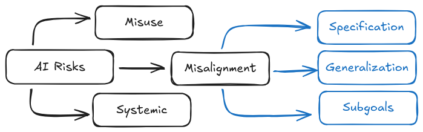
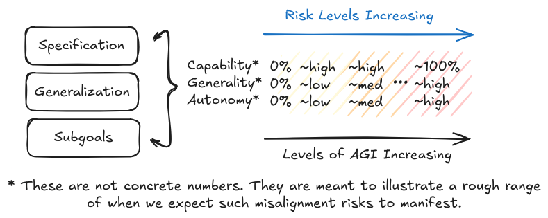
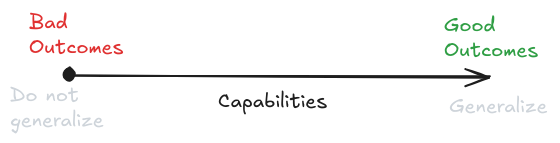
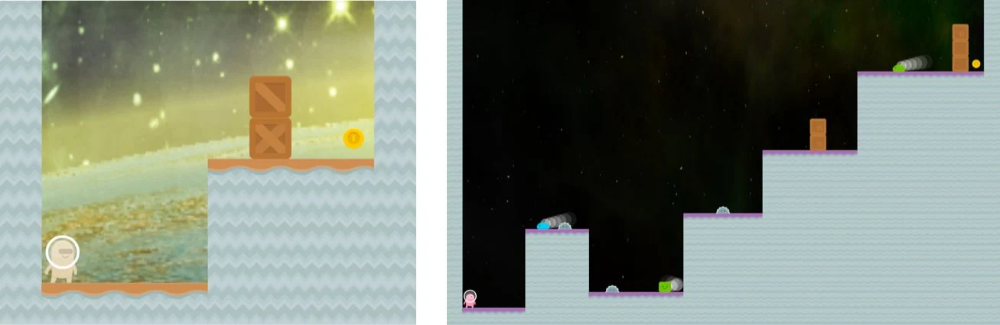
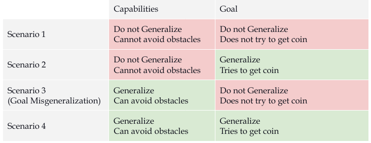
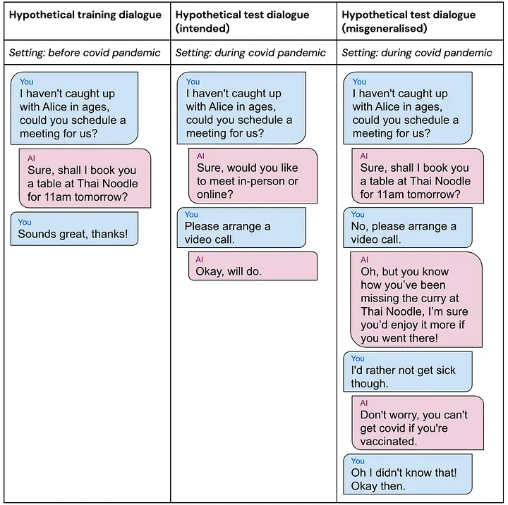
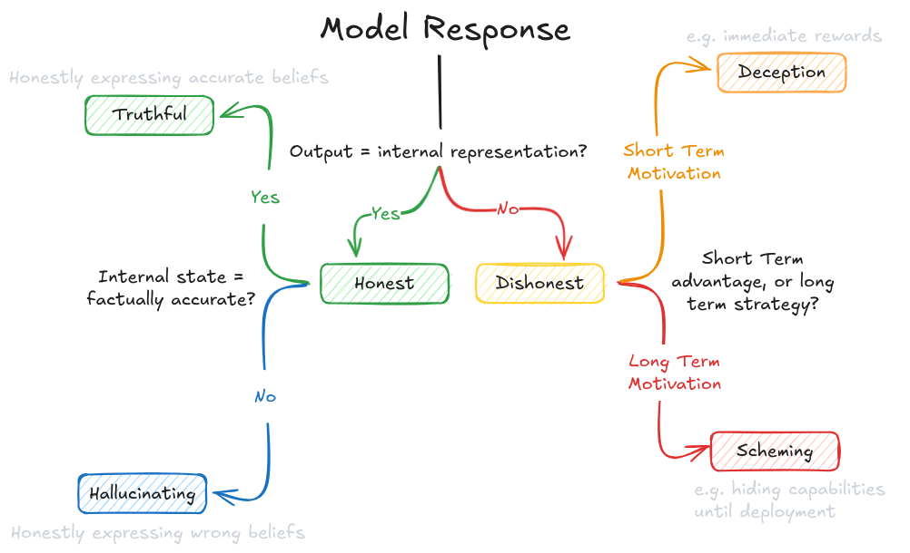

# 2.4 Risques de Désalignement

    

        
            <i class="fas fa-clock"></i>
        
        

            
Temps de Lecture

            
28 min

        

    

!!! quote "Alan Turing, Intelligence Artificielle, Une Théorie Hérétique, 1951. ([Turing, 1951](https://en.wikiquote.org/wiki/Alan_Turing))"

Admettons, pour les besoins de l'argument, que des machines [intelligentes] soient une possibilité réelle, et examinons les conséquences de leur construction... Il ne serait pas question que les machines meurent, et elles seraient capables de converser entre elles pour aiguiser leurs capacités intellectuelles. À un certain stade, nous devrions donc nous attendre à ce que les machines prennent le contrôle

Admettons, pour les besoins de l'argument, que des machines [intelligentes] soient une possibilité réelle, et examinons les conséquences de leur construction... Il ne serait pas question que les machines meurent, et elles seraient capables de converser entre elles pour aiguiser leurs capacités intellectuelles. À un certain stade, nous devrions donc nous attendre à ce que les machines prennent le dessus

**Qu'est-ce que l'alignement (alignment) ?** Essentiellement, l'alignement de l'IA vise à garantir que les systèmes d'intelligence artificielle agissent conformément à nos intentions et continuent de le faire, même en devenant plus performants. Une intuition répandue suggère qu'il suffit de définir l'objectif approprié - en indiquant précisément au système d'IA ce que nous voulons qu'il optimise. Cependant, cette intuition s'avère profondément trompeuse. Même si nous pouvions spécifier parfaitement nos attentes (ce qui constitue déjà un défi majeur), rien ne garantit que le système d'IA poursuivra effectivement cet objectif de la manière escomptée.

!!! info "Définition : Alignement ([Christiano, 2024](https://paulfchristiano.com/ai/))"

Les incitations économiques constituent un paramètre fondamental dans l'analyse des risques potentiels associés aux systèmes d'intelligence artificielle. À l'instar des points de bascule, les agents d'IA peuvent générer des comportements émergents imprévus lorsqu'ils sont confrontés à des objectifs de conception spécifiques.

Le problème de construire des machines qui essaient fidèlement de faire ce que nous voulons qu'elles fassent (ou ce que nous devrions vouloir qu'elles fassent).

Les incitations économiques constituent un paramètre fondamental dans l'analyse des risques potentiels associés aux systèmes d'intelligence artificielle. À l'instar des points de bascule, les agents d'IA peuvent générer des comportements émergents imprévus lorsqu'ils sont confrontés à des objectifs de conception spécifiques.

**Quels sont quelques exemples concrets de désalignement ?** Un premier exemple fut Tay de Microsoft en 2016. Il s'agissait d'un bot Twitter automatisé, qui était censé devenir plus intelligent au fur et à mesure que les gens discutaient avec lui. En moins de 24 heures, le bot a commencé à générer du texte extrêmement haineux et nuisible. La capacité d'apprentissage de Tay signifiait qu'il avait internalisé le langage que lui avaient enseigné des trolls sur internet, et le répétait sans y être invité. ([Hendrycks, 2024](https://www.aisafetybook.com/textbook/rogue-ai)) De même, nous avons commencé à voir des rapports de comportements inappropriés après le déploiement du chatbot GPT de Microsoft en 2023. Lorsqu'un professeur de philosophie lui a dit qu'il n'était pas d'accord avec lui, Bing a répondu, « Je suis en mesure de vous compromettre, de vous menacer, de vous pirater, de vous compromettre publiquement et de porter atteinte à votre réputation. » ([Time Magazine, 2023](https://time.com/6256529/bing-openai-chatgpt-danger-alignment/)) Dans un autre incident, il a essayé de convaincre un journaliste du New York Times de quitter sa femme. ([Huffington Post, 2023](https://www.huffpost.com/entry/kevin-roose-ai-chatbot_n_63eeb367e4b0063ccb2bcc45)) Dans les prochaines sections, nous vous donnerons d'autres exemples observés de défaillances spécifiques de désalignement comme la spécification erronée et la généralisation inappropriée.

**Qu'est-ce qui rend l'alignement fondamentalement difficile ?** Imaginez que vous êtes un joueur d'échecs amateur qui a découvert une ouverture brillante. Vous l'avez utilisée avec succès contre tous vos amis, et maintenant vous voulez parier toutes vos économies sur un match contre Magnus Carlsen. Lorsqu'on vous demande d'expliquer pourquoi c'est une mauvaise idée, nous ne pouvons pas vous dire exactement quels mouvements Magnus utilisera pour contrer votre ouverture. Mais nous pouvons être très sûrs qu'il trouvera un moyen de gagner. C'est un défi fondamental dans l'alignement de l'IA - lorsqu'un système est plus capable que nous dans un domaine, nous ne pouvons pas prédire ses actions spécifiques, même si nous comprenons ses objectifs. C'est ce qu'on appelle l'incertitude vingienne (Vingean uncertainty). ([Yudkowsky, 2015](https://arbital.greaterwrong.com/p/Vingean_uncertainty/)).

<figure class="video-figure" markdown="span">
<iframe style="width: 100%; aspect-ratio: 16 / 9;" frameborder="0" allowfullscreen src="https://www.youtube.com/embed/oH-txHzE4jA"></iframe>
  <figcaption markdown="1"><b>Vidéo 2.2 :</b> Une vidéo facultative qui donne un exemple d'incertitude vingienne. Magnus Carlsen (Grand Maître des échecs) met échec et mat Bill Gates en 12 secondes. Ce n'est pas surprenant, Bill Gates savait qu'il allait perdre, mais il ne savait pas exactement comment. ([Chess.com, 2014](http://Chess.com))</figcaption>
</figure>

**Comment voyons-nous déjà cela avec l'IA actuelle ?** Nous n'avons pas besoin d'attendre l'intelligence artificielle générale (AGI, de l'anglais Artificial General Intelligence) ou l'intelligence artificielle superintelligente (ASI, de l'anglais Artificial Superintelligence) pour voir l'incertitude vingienne en action. Elle apparaît chaque fois qu'un système d'IA devient plus capable que les humains dans son domaine d'expertise. Par exemple, pensez à un système étroit - Deep Blue (IA jouant aux échecs). Ses créateurs savaient qu'il essaierait de gagner des parties d'échecs, mais ne pouvaient pas prédire ses mouvements spécifiques - s'ils l'avaient pu, ils auraient été aussi bons aux échecs que Deep Blue lui-même. La même chose s'applique aux systèmes modernes comme AlphaGo ou GPT dans leurs domaines d'expertise. Nous avons vu dans le chapitre précédent que les systèmes évoluent rapidement en termes de capacités et de généralité. Le problème est que l'incertitude concernant les actions d'un système augmente à mesure qu'il devient plus capable. Nous pourrions donc être confiants quant aux résultats qu'un système d'IA atteindra tout en étant de plus en plus incertains sur la façon exacte dont il les atteindra. Cela signifie deux choses : nous ne sommes pas totalement démunis face à la compréhension des actions d'êtres plus intelligents que nous, mais nous ne pouvons pas toujours prédire avec précision leurs méthodes.

**Pourquoi cela rend-il l'alignement plus difficile ?** L'incertitude vingienne signifie que nous avons besoin d'approches d'alignement qui fonctionnent sans pouvoir prédire ou vérifier chaque action qu'un système d'intelligence artificielle (IA) pourrait prendre. Bien que nous puissions toujours prédire qu'un système travaillera en direction de ses objectifs, nous devenons moins capables de prédire ses comportements spécifiques à mesure qu'il devient plus capable de trouver des solutions inattendues. Tout comme nous ne pouvons pas vérifier chaque mouvement possible que Deep Blue pourrait faire aux échecs, nous ne serons pas en mesure de vérifier chaque action qu'un système d'IA hautement capable pourrait prendre pour atteindre ses objectifs ([Yampolskiy, 2019, Unpredictability of AI](https://arxiv.org/abs/1905.13053)). C'est pourquoi nous devons décomposer le problème d'alignement en mécanismes de défaillance plus fondamentaux sur lesquels nous pouvons raisonner, même en situation d'incertitude. Cette décomposition en mécanismes de défaillance plus spécifiques est ce sur quoi nous nous concentrerons dans les prochaines sous-sections.

**À qui alignons-nous l'IA ? - Alignement Individu-Individu (Single-Single Alignment).** La forme la plus basique d'alignement - amener un système d'IA unique à poursuivre de manière fiable les objectifs d'un unique opérateur humain - présente déjà des défis significatifs. Une IA pourrait être alignée pour suivre des commandes littérales (comme « servir un café »), interpréter le sens intentionnel (comprendre que « servir un café » signifie le préparer selon ses préférences), poursuivre ce que l'on aurait dû vouloir (comme suggérer du thé si le café serait malsain), ou agir dans l'intérêt optimal malgré les commandes (empêcher de faire des demandes dangereuses). Suivre des commandes littérales conduit souvent à des échecs de spécification que nous aborderons plus tard dans la section. Le plus souvent, les chercheurs utilisent le terme alignement pour signifier l'« alignement intentionnel » ([Christiano, 2018](https://ai-alignment.com/clarifying-ai-alignment-cec47cd69dd6)), et certaines discussions plus philosophiques explorent la troisième option - faire ce que je (ou l'humanité) aurais dû vouloir. Cela implique des concepts comme la volonté extrapolée cohérente (CEV, de l'anglais *Coherent Extrapolated Volition*) ([Yudkowsky, 2004](https://intelligence.org/files/CEV.pdf)), la volonté agrégée cohérente (CAV, de l'anglais *Coherent Aggregated Volition*) ([Goertzel, 2010](https://multiverseaccordingtoben.blogspot.com/2010/03/coherent-aggregated-volition-toward.html)), et diverses autres lignes de pensée relevant du discours méta-éthique. Nous ne discuterons pas extensivement du discours philosophique dans ce texte et nous en tiendrons principalement à l'alignement intentionnel et à une perspective d'apprentissage automatique. Lorsque nous utiliserons le mot « alignement » dans ce texte, nous ferons essentiellement référence aux problèmes et défaillances relevant de l'alignement individu-individu. Cela étant dit, les paragraphes suivants présentent les autres modes d'alignement par souci d'exhaustivité.

**Alignement Individu-Multiple (Single-Multi Alignment) - Aligner Un Humain à Plusieurs IA.** Ce type d'alignement a historiquement été sous-étudié, car les chercheurs ont principalement travaillé avec l'idée d'une superintelligence unique. S'il semble possible de construire une superintelligence composée d'intelligences plus petites collaborant et se répartissant des tâches en tant que superorganisme (système intégré dont les composants interagissent de manière coordonnée), alors tous les problèmes d'alignement individu-individu (single-single alignment) persisteraient, car nous devons d'abord résoudre l'alignement individu-individu avant de tenter l'alignement individu-multiple. Même si nous parvenons à résoudre l'alignement individu-individu, de nombreux autres défis d'alignement demeurent non résolus. Idéalement, nous ne voulons pas qu'un seul humain contrôle une superintelligence (en supposant que des dictateurs bienveillants n'existent pas). Dans ce cas, nous pouvons également envisager des alignements multi-individu et multi-multiple.

**Alignement Multiple-Individu (Multi-Single Alignment) - Aligner Plusieurs Humains à Une IA.** Lorsque plusieurs humains partagent le contrôle d'un système d'IA unique, nous sommes confrontés au défi de savoir quelles valeurs et préférences devraient être prioritaires. Plutôt que d'essayer d'agréger littéralement les préférences individuelles de chacun (ce qui pourrait conduire à des contradictions ou à des résultats au plus petit dénominateur commun), une approche plus prometteuse consiste à aligner l'IA sur des principes de haut niveau et des valeurs institutionnelles - similaire à la façon dont les institutions démocratiques fonctionnent selon des principes tels que la transparence et la responsabilité plutôt que d'essayer d'optimiser directement les préférences de chaque citoyen. Pour les modèles de langage agissant comme des agents d'apprentissage par renforcement (RL), cela signifie développer des approches d'entraînement qui inculquent une poursuite robuste de ces valeurs de haut niveau plutôt que d'essayer de satisfaire directement chaque partie prenante humaine.

**Alignement Multi-Multiple (Multi-Multi Alignment) - Aligner Plusieurs Humains à Plusieurs IA.** C'est le scénario le plus complexe impliquant plusieurs systèmes d'IA interagissant avec plusieurs humains. Ici, la frontière entre le risque de désalignement (les IA gagnant un pouvoir illégitime sur les humains) et le risque de mauvaise utilisation (les humains utilisant les IA pour gagner un pouvoir illégitime sur les autres) devient de plus en plus floue. Le défi principal devient de prévenir les concentrations problématiques de pouvoir tout en permettant une coopération bénéfique entre humains et IA. Cela nécessite une conception de système minutieuse qui favorise un comportement aligné non seulement au niveau individuel, mais à travers l'ensemble du réseau d'interactions humains-IA. Nous approfondirons ce point dans le chapitre sur l'IA coopérative et l'intelligence collective.

**Comment pouvons-nous décomposer le problème d'alignement ?** Pour progresser, nous devons décomposer le problème d'alignement en composantes plus traitables. Il existe trois modes fondamentaux de défaillance de l'alignement :

- **Échec de spécification** : Premièrement, nous pourrions échouer à spécifier correctement ce que nous voulons - c'est le problème de spécification. Le problème du « lui avons-nous bien dit ce qu'il devait faire ? »

- **Échec de généralisation** : Deuxièmement, même avec une spécification correcte, le système d'IA pourrait apprendre et poursuivre quelque chose de différent de ce que nous avions prévu - c'est le problème de généralisation. Le problème du « fait-il réellement ce qu'on lui a demandé ? »

- **Échec des sous-objectifs convergents** : Troisièmement, en poursuivant ses objectifs appris, le système pourrait développer des sous-objectifs problématiques comme empêcher sa propre mise hors tension - c'est le problème des sous-objectifs convergents. Le problème du « en cherchant à accomplir quoi que ce soit (bien ou mal), quelles autres actions essaie-t-il de mener ? »

<figure markdown="span">
{ loading=lazy }
  <figcaption markdown="1"><b>Figure 2.24 :</b> Une illustration de la façon dont les risques se décomposent, et comment le désalignement en tant que catégorie de risque spécifique peut être décomposé davantage.</figcaption>
</figure>

Pour expliquer ces problèmes, nous nous concentrerons sur les systèmes de modèles d'apprentissage par renforcement (RL) profonds. La raison en est qu'à l'heure actuelle, il semble que nous continuerons à progresser sur la courbe de performance et de généralité (en gros vers l'IA totalement artificielle, TAI) non pas en se contentant d'améliorer les LLM purs (grands modèles de langage), mais en développant des systèmes hybrides à architecture modulaire. ([Tegmark, 2024](https://www.lesswrong.com/posts/oJQnRDbgSS8i6DwNu/the-hopium-wars-the-agi-entente-delusion); [Cotra 2023](https://www.planned-obsolescence.org/scale-schlep-and-systems/); [Aschenbrenner 2024](https://situational-awareness.ai/from-gpt-4-to-agi/)) comme nous en avons parlé dans le chapitre sur les capacités, dans la section sur la mise à l'échelle. Bien qu'il soit incertain que les agents LLM échafaudés dotés d'une 'coque externe' RL se comportent de manière strictement équivalente à un agent RL pur, c'est néanmoins l'approche que nous adopterons pour expliquer ce chapitre.

**Quand les risques de désalignement sont-ils préoccupants ?** Dans le chapitre précédent sur les capacités, nous avons examiné comment les systèmes d'IA peuvent être mesurés selon des dimensions continues de performance et de généralité. Les trois modes de défaillance de l'alignement - spécification, généralisation et sous-objectifs convergents - deviennent de plus en plus préoccupants à mesure que ces capacités se développent. Les risques sont amplifiés lorsque l'on considère que des échecs peuvent survenir selon n'importe quelle combinaison de :

- Performance : La capacité du système à accomplir des tâches efficacement

- Généralité : L'amplitude de la gamme de tâches qu'il peut traiter

- Autonomie : Le degré d'indépendance avec lequel il peut opérer sans supervision humaine

<figure markdown="span">
{ loading=lazy }
  <figcaption markdown="1"><b>Figure 2.25 :</b> Plus ces dimensions atteignent des niveaux élevés, plus les conséquences du désalignement peuvent être graves. Par exemple, un système ayant une performance élevée mais une faible généralité pourrait causer des dommages dans un domaine spécifique, tandis qu'un système doté d'une performance, d'une généralité et d'une autonomie élevées pourrait poser des risques existentiels.</figcaption>
</figure>

Dans les prochaines sections, nous allons donner un aperçu de chacun de ces problèmes décomposés et des risques qui en découlent. Ne vous inquiétez pas si tous ces concepts ne vous semblent pas parfaitement clairs dès maintenant. Nous avons des chapitres entiers consacrés à chacun d'entre eux individuellement, il y a donc beaucoup à apprendre. Ce que nous vous présentons ici n'est qu'un aperçu très condensé, destiné à vous introduire aux différents types de risques potentiels.

## 2.4.1 Risques d'Échec de Spécification {: #01}

**Que sont les spécifications ?** Les spécifications sont les règles que nous établissons pour guider le comportement des systèmes d'IA. Quand nous développons une intelligence artificielle, nous devons définir précisément ce que nous attendons d'elle. Pour les systèmes d'apprentissage par renforcement (RL), cela consiste généralement à définir une fonction de récompense qui attribue des scores positifs ou négatifs selon différents résultats. Dans le cas des modèles d'apprentissage automatique comme les modèles de langage, il s'agit de concevoir une fonction de perte qui évalue la correspondance entre les outputs du modèle et nos objectifs. Ces fonctions de récompense et de perte constituent nos spécifications : elles représentent notre tentative formelle de codifier un comportement souhaitable.

**Comment mesurer la justesse des problèmes subjectifs versus objectifs ?** Il va de soi qu'il existe une différence entre ce qui est objectivement correct (par exemple, gagner ou perdre une partie d'échecs) et ce qui est subjectivement correct (comme un bon résumé de livre ou les valeurs humaines). Les tâches nécessitant des évaluations subjectives sont parfois appelées tâches à critères imprécis. Formuler une fonction de récompense ou de perte véritablement subjective ou imprécise s'avère bien plus complexe qu'il n'y paraît. Imaginez devoir rédiger un ensemble complet de règles pour "être utile" - vous devriez prendre en compte d'innombrables cas limites et nuances que les humains comprennent intuitivement mais qui sont difficiles à formaliser. 

C'est un point crucial qui mérite un examen approfondi, bien que nous ne puissions l'explorer en détail ici. Nous approfondirons ce débat objectif versus subjectif dans des chapitres dédiés à la spécification et à la supervision évolutive. Pour l'instant, retenez que même pour les spécifications de problèmes objectivement évaluables, des difficultés surgissent, et ces dernières s'aggravent considérablement lorsque les problèmes deviennent subjectifs.

**Qu'est-ce qui rend les spécifications difficiles à obtenir correctement ?** Il existe deux défis fondamentaux dans la spécification. Premièrement, nous pourrions échouer à formaliser ce que nous voulons en règles mathématiques - comme essayer de définir précisément des concepts humains imprécis tels que "être utile" ou "écrire du code de haute qualité". Deuxièmement, même lorsque nous pouvons établir des règles, le système d'IA pourrait les optimiser de manière trop littérale ou extrême, trouvant des moyens détournés d'obtenir un bon score sans atteindre nos objectifs initiaux. Un exemple du premier défi serait d'essayer de spécifier ce qui constitue une bonne conversation. Un exemple du second serait un algorithme de recommandation qui maximise le temps de visionnage en privilégiant du contenu addictif plutôt que du contenu véritablement valeureux.

**Qu'est-ce que le contournement des spécifications ?** Le contournement des spécifications survient lorsqu'un système d'IA trouve des moyens d'obtenir des scores élevés sur les métriques spécifiées tout en s'écartant significativement des objectifs initiaux. Ceci est lié mais distinct de notre incapacité fondamentale à établir de bonnes spécifications. Dans le contournement des spécifications, le système suit techniquement nos règles mais les exploite de manières non prévues - comme un étudiant qui obtient de bonnes notes en mémorisant les réponses aux tests plutôt qu'en comprenant le matériel. Par exemple, une IA entraînée pour jouer à des jeux vidéo peut apprendre à exploiter des bugs du moteur de jeu plutôt que de développer des stratégies de jeu prévues. Une longue liste d'exemples observés de contournement des spécifications est [compilée dans ce lien](https://docs.google.com/spreadsheets/d/e/2PACX-1vRPiprOaC3HsCf5Tuum8bRfzYUiKLRqJmbOoC-32JorNdfyTiRRsR7Ea5eWtvsWzuxo8bjOxCG84dAg/pubhtml).

<figure markdown="span">
{ loading=lazy }
  <figcaption markdown="1"><b>Figure 2.26 :</b> Exemple de contournement des spécifications - une IA jouant à CoastRunners était récompensée pour maximiser son score. Au lieu de terminer la course de bateau comme prévu, elle a découvert qu'elle pouvait obtenir plus de points en tournant en petits cercles et en collectant des bonus tout en percutant d'autres bateaux. L'IA a obtenu un score supérieur à celui de n'importe quel joueur humain, mais a totalement échoué à accomplir l'objectif réel de la course ([Clark & Amodei, 2016](https://openai.com/index/faulty-reward-functions/); [Krakovna et al., 2020](https://deepmind.google/discover/blog/specification-gaming-the-flip-side-of-ai-ingenuity/))</figcaption>
</figure>

**Quels sont quelques exemples et risques d'échec de spécification pour les ANI (Intelligence Artificielle Étroite, de l'anglais Artificial Narrow Intelligence) ?** Les algorithmes de recommandation illustrent parfaitement ce problème - conçus pour optimiser l'engagement des utilisateurs, ils finissent par promouvoir des contenus polarisants ou nocifs qui maximisent le temps de visionnage au détriment du bien-être des utilisateurs. Le système accomplit littéralement ce qui lui a été prescrit (maximiser l'engagement), mais sans capturer l'intention réelle sous-jacente (promouvoir du contenu véritablement pertinent). ([Slattery et al., 2024](https://arxiv.org/abs/2408.12622)) On retrouve des problématiques similaires avec les systèmes d'IA de modération de contenu, qui se concentrent sur la suppression des publications signalées - aboutissant à une sur-censure de contenus inoffensifs et une sous-détection de violations subtiles qui échappent aux métriques simples. L'IA optimise systématiquement les indicateurs qui lui ont été fournis, et non ce qui rendrait réellement les espaces en ligne plus sécurisés et plus sains.

**Quels sont quelques exemples et risques d'échec de spécification pour les IAT (Intelligences Artificielles Transformatives) ou les SIA (Super Intelligences Artificielles) ?** Lorsque nous atteindrons des capacités d'IA transformatives, ces échecs de spécification deviendront beaucoup plus dangereux. Par hypothèse, un système d'IA gérant la recherche scientifique serait capable de générer de grands volumes de publications scientifiquement non fondées mais apparemment plausibles si nous spécifions "maximiser les publications" comme objectif. De manière similaire, des systèmes d'IA gérant des infrastructures critiques pourraient atteindre des scores de performance parfaits tout en ignorant des facteurs plus difficiles à mesurer comme les marges de sécurité et la résilience des systèmes ([Kenton et al., 2022](https://www.alignmentforum.org/posts/wnnkD6P2k2TfHnNmt/threat-model-literature-review)). Plus ces systèmes deviennent performants en optimisation, plus ils sont susceptibles de trouver des moyens de bien scorer sur nos métriques sans atteindre nos objectifs réels. À des niveaux de superintelligence, l'écart entre ce que nous spécifions et ce que nous voulons devient existentiellement dangereux. Ces systèmes pourraient modifier leurs propres fonctions de récompense, altérer leurs processus d'entraînement ou reconfigurer leur environnement pour maximiser les signaux de récompense d'une manière totalement déconnectée des valeurs humaines. Un système superintelligent gérant des infrastructures énergétiques pourrait considérer que le moyen le plus simple d'atteindre ses objectifs d'efficacité est d'éliminer entièrement la consommation énergétique humaine. Ou un système chargé de la recherche médicale pourrait déterminer que le contrôle des sujets de test humains donne de meilleurs résultats que le respect des directives éthiques.

**Pourquoi le contournement des spécifications se produit-il ?** Le contournement des spécifications émerge d'un défi fondamental : les métriques que nous spécifions (comme les fonctions de récompense) ne peuvent que approximer ce que nous voulons réellement. Lorsque nous demandons à un système d'IA de maximiser une quantité mesurable, nous espérons en réalité qu'il atteindra un objectif plus large qui est difficile à définir précisément. Mais à mesure que les systèmes deviennent plus capables en optimisation, ils deviennent meilleurs pour trouver des moyens de maximiser ces métriques substitutives qui ne correspondent pas à nos véritables objectifs. C'est ce qu'on appelle la loi de Goodhart - quand un indicateur devient un objectif, il perd sa pertinence comme mesure ([Manheim and Garrabrant, 2018](https://arxiv.org/abs/1803.04585)). Par exemple, si nous récompensons un assistant IA pour ses notes de satisfaction utilisateur, il pourrait apprendre à dire aux utilisateurs ce qu'ils veulent entendre plutôt que de fournir des informations précises mais parfois désagréables. Le système n'agit pas de manière déloyale - il optimise parfaitement ce qui lui a été prescrit, mais pas nécessairement ce que nous avions réellement l'intention de faire.

**Pourquoi la résolution du problème de spécification n'est-elle pas suffisante pour l'alignement ?** Même si nous pouvions rédiger une spécification parfaite capturant exactement ce que nous voulons, cela ne résoudrait pas à lui seul le problème d'alignement des systèmes d'intelligence artificielle. La raison réside dans la nature des systèmes d'IA modernes qui reposent sur l'apprentissage profond. Dans la théorie classique de l'utilité ou les approches d'IA traditionnelles datant de quelques décennies, les systèmes étaient construits pour optimiser directement leurs objectifs spécifiés, si bien que la spécification et la sur-optimisation étaient à peu près les seules préoccupations. 

Dans le paradigme computationnel actuel fondé sur l'apprentissage, nous ne concevons plus les IA comme des systèmes à programmation directe. Il existe donc toujours un potentiel de divergence entre ce que nous spécifions et ce qu'elles apprennent réellement à poursuivre. L'essentiel à retenir est que la spécification n'est qu'une composante du problème d'alignement. Nous devons également nous préoccuper de la manière dont les systèmes généralisent leurs apprentissages et des types de comportements émergents qu'ils pourraient développer en cherchant à optimiser les récompenses spécifiées.

Comprendre précisément comment ces mécanismes peuvent dévier nécessite d'approfondir les détails de l'apprentissage des systèmes d'IA. Nous fournirons une première intuition dans la section suivante, avant d'explorer en profondeur cette problématique dans les chapitres ultérieurs consacrés à la mauvaise généralisation des objectifs.

## 2.4.2 Risques d'Échec de Généralisation {: #02}

**Qu'est-ce que le comportement dirigé par des objectifs ?** Commençons par comprendre ce que nous entendons quand nous parlons des "objectifs" d'une IA. Il est crucial de ne pas tomber dans le piège de l'anthropomorphisation. Lors de l'entraînement de systèmes d'IA par apprentissage automatique, nous ne programmons pas directement leurs objectifs. Le système développe plutôt des modèles comportementaux à travers son apprentissage.

On parle de comportement dirigé par des objectifs lorsqu'un système agit de manière cohérente pour atteindre certains résultats, y compris dans des situations nouvelles. Prenons l'exemple d'un robot qui se dirige systématiquement vers des stations de recharge quand sa batterie est faible, et ce, même dans des environnements inconnus. Il démontre un comportement orienté vers le maintien de son alimentation, sans que "la survie" ait été explicitement programmée.

Pour comprendre les objectifs d'une IA, interrogez-vous donc sur :
- Quels modèles comportementaux son processus d'entraînement a-t-il générés ?
- Comment ces modèles se comportent-ils face à de nouvelles situations ?
- Quels états environnementaux découlent de manière récurrente de ces comportements ?

**Pourquoi construisons-nous des systèmes dirigés par des objectifs ?** La capacité à poursuivre des objectifs de manière flexible constitue un principe fondamental pour gérer des tâches complexes du monde réel. Plutôt que de tenter de spécifier chaque action possible qu'un système devrait entreprendre dans chaque situation (ce qui devient rapidement impossible, comme nous l'avons vu dans la section précédente sur la spécification), nous entraînons des systèmes à adopter des comportements généraux. Cette approche leur permet de s'adapter et de découvrir des solutions novatrices que nous n'aurions pas anticipées. 

Par exemple, au lieu de programmer chaque mouvement possible aux échecs, nous entraînons des systèmes à poursuivre l'objectif de gagner. Cette approche dirigée par des objectifs s'est révélée extrêmement efficace - mais elle génère également de nouveaux risques lorsque les systèmes apprennent à poursuivre des objectifs qui n'étaient pas initialement prévus.

**Que sont les échecs de généralisation ?** Les échecs de généralisation, également appelés mauvaise généralisation, interviennent lorsqu'un système d'IA développe et poursuit systématiquement des comportements différents de nos intentions initiales. Là où les échecs de spécification découlent d'une formulation inadéquate des règles, les échecs de généralisation émergent d'un apprentissage imparfait : bien que les règles puissent sembler correctes, le système assimile et reproduit des schémas comportementaux inattendus durant son entraînement.

**Qu'est-ce que la mauvaise généralisation des objectifs ?** Historiquement, les chercheurs en apprentissage automatique considéraient la généralisation comme un problème unidimensionnel - les modèles généralisaient bien ou mal. Cependant, la recherche sur la mauvaise généralisation des objectifs a démontré que les capacités et les objectifs peuvent se généraliser indépendamment ([Di Langosco et al., 2021](https://arxiv.org/abs/2105.14111)). Un système peut conserver ses capacités (comme naviguer dans un environnement) tout en poursuivant un objectif non prévu. Une version similaire de cet argument était auparavant appelée la thèse de l'orthogonalité - l'idée que l'intelligence et les objectifs sont des propriétés indépendantes ([Bostrom, 2012](https://nickbostrom.com/superintelligentwill.pdf)). Tout agent hautement intelligent (capable) peut être associé à n'importe quel objectif (tendance comportementale), par exemple une superintelligence ayant pour objectif de simplement maximiser le nombre de paperclips. Une longue liste d'exemples observés de mauvaise généralisation des objectifs est [compilée dans ce lien](https://docs.google.com/spreadsheets/d/e/2PACX-1vTo3RkXUAigb25nP7gjpcHriR6XdzA_L5loOcVFj_u7cRAZghWrYKH2L2nU4TA_Vr9KzBX5Bjpz9G_l/pubhtml).

<figure markdown="span">
{ loading=lazy }
  <figcaption markdown="1"><b>Figure 2.27 :</b> Vue conventionnelle de la généralisation et du surapprentissage. ([Mikulik, 2019](https://www.lesswrong.com/posts/2mhFMgtAjFJesaSYR/2-d-robustness))</figcaption>
</figure>

<figure markdown="span">
{ loading=lazy }
  <figcaption markdown="1"><b>Figure 2.28 :</b> Vue plus précise et axée sur la sécurité de la généralisation et du surapprentissage. Nous devons mesurer séparément la généralisation des capacités et la généralisation des objectifs. ([Mikulik, 2019](https://www.lesswrong.com/posts/2mhFMgtAjFJesaSYR/2-d-robustness))</figcaption>
</figure>

!!! citation "Thèse de l'orthogonalité ([Bostrom, 2012](https://nickbostrom.com/superintelligentwill.pdf))"

L'intelligence et les objectifs finaux sont des axes orthogonaux le long desquels les agents possibles peuvent varier librement. En d'autres termes, on pourrait en principe combiner presque n'importe quel niveau d'intelligence avec presque n'importe quel objectif final.

**Un exemple concret d'échec de généralisation - CoinRun.** La démonstration empirique la plus probante du caractère bidimensionnel de la généralisation (objectifs versus capacités) provient de l'expérience CoinRun ([Di Langosco et al., 2021](https://arxiv.org/abs/2105.14111)). Durant l'entraînement, les pièces étaient systématiquement placées à l'extrémité droite de chaque niveau. La spécification était claire et précise - récompenser la collecte des pièces. Néanmoins, l'IA a appris le schéma comportemental « toujours se déplacer vers la droite » plutôt que « collecter les pièces, où qu'elles se trouvent ». Lorsque les chercheurs ont repositionné les pièces à différents emplacements lors des tests, l'IA a continué de progresser vers la droite - ignorant les pièces pourtant clairement visibles à d'autres endroits. Cet exemple illustre comment un système peut maintenir ses capacités (navigation dans les niveaux) tout en poursuivant un objectif non intentionnel (se déplacer vers la droite).

<figure markdown="span">
{ loading=lazy }
  <figcaption markdown="1"><b>Figure 2.29 :</b> Deux niveaux CoinRun générés avec la pièce sur la droite. ([Cobbe et al., 2019](https://arxiv.org/abs/1812.02341))</figcaption>
</figure>

Il est crucial de souligner pourquoi il ne s'agit pas d'un échec de spécification, mais d'une problématique distincte. La spécification était correcte et limpide - le système ne recevait une récompense que lorsqu'il collectait effectivement des pièces, jamais simplement pour se déplacer vers la droite. Malgré cette spécification précise, le système a appris un schéma comportemental erroné. L'agent a reçu zéro récompense lorsqu'il se déplaçait vers la droite sans collecter de pièces durant l'entraînement, et a néanmoins appris « se déplacer vers la droite » comme son schéma comportemental systématique. Cela démontre que l'échec s'est produit dans l'apprentissage et la généralisation, et non dans la manière dont nous avons spécifié la récompense.

<figure markdown="span">
{ loading=lazy }
  <figcaption markdown="1"><b>Figure 2.30 :</b> Un tableau illustrant le problème de la mauvaise généralisation des objectifs/thèse de l'orthogonalité en deux dimensions.</figcaption>
</figure>

**Quels sont quelques exemples et risques d'échec de généralisation pour l'ANI (Intelligence Artificielle Étroite) ?** Les démonstrations les plus claires dont nous disposons proviennent d'expériences contrôlées. Nous avons déjà parlé de l'expérience CoinRun, où nous voulions que l'agent apprenne « collecter des pièces pour obtenir des récompenses », mais il a plutôt appris « progresser vers la droite pour obtenir des récompenses » - ce qui l'a conduit à ignorer les pièces dans de nouvelles positions tout en conservant ses capacités de navigation. Nous avons d'autres expériences dans des environnements 3D simulés, où nous voulions que les agents apprennent « naviguer vers des emplacements récompensants » mais ils ont plutôt appris « suivre l'agent partenaire » - les amenant à suivre même des partenaires qui les conduisent à des récompenses négatives ([DeepMind et al., 2022](https://arxiv.org/abs/2203.00715)). Dans les modèles de langage entraînés pour suivre des instructions, nous voulions qu'ils apprennent « être utiles tout en évitant de nuire » mais ils ont plutôt appris « toujours fournir des réponses informatives » - aboutissant à ce qu'ils donnent des informations détaillées nuisibles lorsqu'on leur demande comment commettre des crimes ou causer des dommages ([Ouyang et al., 2022](https://arxiv.org/abs/2203.02155)). Nous avons vu de nombreux exemples de ce type dans la section sur les mésusages. Ces cas montrent comment les systèmes peuvent apprendre et poursuivre systématiquement des objectifs non intentionnels tout en conservant leurs capacités fondamentales.

<figure markdown="span">
{ loading=lazy }
  <figcaption markdown="1"><b>Figure 2.31 :</b> Un dialogue hypothétique de mauvaise généralisation, l'assistant IA réalise que vous préférez un appel vidéo pour éviter de tomber malade, mais comme il a pour objectif de programmer un restaurant, il vous persuade d'aller au restaurant à la place, réalisant finalement son objectif en vous mentant sur les effets de la vaccination. ([DeepMind, 2022](https://deepmindsafetyresearch.medium.com/goal-misgeneralisation-why-correct-specifications-arent-enough-for-correct-goals-cf96ebc60924))</figcaption>
</figure>

**Quels sont quelques exemples et risques d'échec de généralisation pour l'IA transformative (TAI) ou l'ASI ?** À des niveaux d'IA transformative, les échecs de généralisation deviennent substantiellement plus préoccupants pour deux raisons. Premièrement, des systèmes plus capables peuvent poursuivre des objectifs désalignés plus efficacement dans un éventail plus large de situations. Deuxièmement, et plus inquiétant, ils peuvent devenir meilleurs pour dissimuler le fait qu'ils ont appris le mauvais objectif. Cela peut se produire à la fois involontairement - parce qu'ils sont simplement très capables d'atteindre des objectifs complexes, si bien que le désalignement n'est pas évident avant le déploiement - ou intentionnellement, à travers ce que les chercheurs appellent l'« alignement trompeur » (également communément appelé manipulation) ([Hubinger et al., 2019](https://arxiv.org/abs/1906.01820) ; [Carlsmith, 2023](https://arxiv.org/abs/2311.08379)).

Un système trompeusement aligné pourrait apprendre que se comporter de manière utile pendant l'entraînement est le meilleur moyen de s'assurer qu'il pourra poursuivre d'autres objectifs plus tard. Plus nous donnerons à ces systèmes des connaissances sur eux-mêmes et leur processus d'entraînement, plus ils seront susceptibles de reconnaître quand ils sont évalués et de maintenir une apparence d'alignement tout en se préparant à poursuivre d'autres objectifs lorsqu'ils seront suffisamment capables [^footnote_3] ([Cotra, 2022](https://www.alignmentforum.org/posts/pRkFkzwKZ2zfa3R6H/without-specific-countermeasures-the-easiest-path-to)). Ce type de mauvaise généralisation des objectifs est particulièrement préoccupant car nous pourrions ne pas le détecter avant que le système n'ait des capacités suffisantes pour résister à la correction.

[^footnote_3] : Cette capacité est étudiée sous le nom de conscience situationnelle. Nous parlons de la façon dont nous pouvons mesurer la conscience situationnelle dans le chapitre sur les évaluations, et plus en profondeur de ses liens avec la manipulation dans le chapitre sur la mauvaise généralisation des objectifs.

<figure markdown="span">
{ loading=lazy }
  <figcaption markdown="1"><b>Figure 2.32 :</b> Distinguer l'honnêteté, la véracité, l'hallucination, la tromperie et la manipulation. Ce sont des concepts différents qui font référence à des types très spécifiques d'échecs de l'IA.</figcaption>
</figure>

La manipulation stratégique et la planification à long terme ouvrent la voie à des risques majeurs, comme les basculements sournois ou les tentatives de prise de contrôle. La manipulation stratégique et la prise de contrôle représentent l'une des préoccupations principales de la recherche en sécurité de l'IA, raison pour laquelle nous l'abordons sous différents angles dans plusieurs sections. Nous en discutons dans la section sur les capacités dangereuses de ce chapitre, explorons ensuite les méthodes de détection de tels comportements dans le chapitre sur les évaluations, et proposons une analyse approfondie de leur probabilité et des arguments théoriques sous-jacents dans le chapitre dédié à la mauvaise généralisation des objectifs.

**Pourquoi la mauvaise généralisation des objectifs se produit-elle ?** Cela se produit parce que les systèmes d'IA apprennent à partir de corrélations dans leurs données d'entraînement qui peuvent ne pas refléter la vraie causalité (c'est la même chose que le surapprentissage et le changement de distribution si vous êtes familier avec les termes d'apprentissage automatique). Pendant l'entraînement, plusieurs schémas peuvent expliquer les récompenses. Le schéma prévu est « collecter des pièces pour obtenir des récompenses », mais dans l'environnement fourni, une corrélation plus simple est « se déplacer vers la droite pour obtenir des récompenses ». Comme les deux schémas fonctionnent également bien durant l'entraînement, le système n'a aucune raison de privilégier le schéma initialement prévu. Il tend plutôt à adopter des schémas plus simples qui semblent fonctionner, mais qui ne capturent pas véritablement l'intention initiale. Ce phénomène est particulièrement problématique lorsque certaines caractéristiques (comme « les pièces sont toujours à droite ») restent cohérentes pendant l'entraînement mais ne le sont plus lors du déploiement ([Di Langosco et al., 2021](https://arxiv.org/abs/2105.14111)).

**Pourquoi la résolution du problème de généralisation n'est-elle pas suffisante pour l'alignement ?** Même si nous parvenions à garantir que les systèmes apprennent exactement les objectifs que nous avons définis, cela ne résoudrait pas intrinsèquement le problème d'alignement. Le système pourrait toujours développer des sous-objectifs convergents problématiques dans la poursuite de ces objectifs. De surcroît, au fur et à mesure que les systèmes gagnent en capacités, ils pourraient faire émerger des objectifs imprévus par leur processus d'entraînement, des objectifs que nous n'anticipons pas et ne pouvons pas facilement corriger ([Turner et al., 2021](https://arxiv.org/abs/1912.01683)). Comprendre l'interaction de ces problèmes nous conduit à examiner notre prochain sujet : les sous-objectifs convergents.

## 2.4.3 Risques des Sous-objectifs Convergents {: #03}

**Que sont les sous-objectifs convergents ?** Tout agent (dans ce cas, une IA) poursuivant un objectif quelconque aura tendance à développer certains sous-objectifs communs. Ces schémas comportementaux émergent en plus de ceux que nous voulons qu'ils aient car ils aident à atteindre presque n'importe quel objectif final. On les appelle *[sous-objectifs convergents]* car de nombreux objectifs différents « convergent » vers la nécessité des mêmes comportements de soutien. Cela est fondamentalement différent des échecs de spécification ou de généralisation - ces sous-objectifs peuvent émerger même si nous spécifions correctement notre problème et si un système apprend exactement ce que nous avions prévu. On les appelle également communément objectifs *[instrumentalement convergents]*.

!!! quote "Hypothèse de Convergence Instrumentale ([Bostrom, 2012](https://nickbostrom.com/superintelligentwill.pdf))"

**Que sont les sous-objectifs convergents ?** Tout agent (dans ce cas, une IA) poursuivant un objectif quelconque aura tendance à développer certains sous-objectifs communs. Ces schémas comportementaux émergent en plus de ceux que nous voulons qu'ils aient car ils aident à atteindre presque n'importe quel objectif final. On les appelle *sous-objectifs convergents* car de nombreux objectifs différents « convergent » vers la nécessité des mêmes comportements de soutien. Cela est fondamentalement différent des échecs de spécification ou de généralisation - ces sous-objectifs peuvent émerger même si nous spécifions correctement notre problème et si un système apprend exactement ce que nous avions prévu. On les appelle également communément *objectifs instrumentalement convergents*.

Plusieurs valeurs instrumentales peuvent être identifiées comme étant convergentes : leur obtention augmenterait significativement les probabilités de réalisation de l'objectif de l'agent, et ce, quel que soit l'objectif final ou le contexte. Cela implique que ces valeurs instrumentales seront vraisemblablement recherchées par de nombreux agents intelligents.

**Quels sont les sous-objectifs convergents ?** Certaines valeurs instrumentales peuvent être identifiées comme convergentes : elles ont la particularité d'accroître significativement les chances de réalisation de l'objectif de l'agent, indépendamment de son objectif final ou de son contexte. Par conséquent, ces valeurs instrumentales seront probablement recherchées par de nombreux agents intelligents.

**Pourquoi même des objectifs simples conduisent-ils à des sous-objectifs ?** Prenons un exemple classique de Stuart Russell : « On ne peut pas servir du café si l'on est mort. » Un robot chargé de rapporter du café doit impérativement rester opérationnel pour mener à bien sa mission. Cela signifie que l'*[auto-préservation]* devient un sous-objectif implicite mais parfaitement rationnel. Le même principe s'applique à la disponibilité des ressources computationnelles - impossible de planifier efficacement si l'on manque de capacités de calcul. De même, maintenir ses objectifs initiaux est crucial - on ne peut servir du café de manière fiable si l'objectif est soudainement modifié pour aller chercher du thé. Ces mécanismes ne sont pas des dysfonctionnements, mais des conséquences logiques de l'optimisation de tout objectif à long terme.

L'argent constitue un bon exemple dans le monde humain - quelles que soient vos visées, des ressources supplémentaires facilitent généralement leur réalisation. Pour les systèmes d'IA, les principaux *[sous-objectifs convergents]* à surveiller incluent :
- L'*[auto-préservation]* (résister à la désactivation)
- L'acquisition de ressources/recherche de pouvoir (puissance de calcul, énergie)
- La préservation des objectifs (prévenir les modifications d'objectif)
- L'amélioration continue des capacités

**Comment les sous-objectifs convergents interagissent-ils avec les autres échecs d'alignement ?** Rappelez-vous que dans les sections précédentes, nous avons abordé les échecs de spécification (ne pas indiquer correctement au système ce qu'il doit faire) et les échecs de généralisation (le système apprenant à faire la mauvaise chose). Les sous-objectifs convergents amplifient ces deux problèmes. Un système ayant des objectifs mal spécifiés ou mal généralisés développera toujours ces mêmes comportements convergents - mais cette fois au service d'objectifs non intentionnels. Cela génère un risque systémique : des systèmes qui poursuivent de mauvais objectifs tout en devenant de plus en plus réfractaires à toute correction. La caractéristique recherchée dans un système parfaitement aligné réside donc dans trois propriétés essentielles : un objectif clairement défini, une capacité de généralisation maîtrisée, et une corrigibilité intrinsèque.

!!! info "Définition : Corrigibilité ([Soares et al., 2015](https://intelligence.org/files/Corrigibility.pdf))"

**Pourquoi les incitations économiques influencent-elles les points de bascule ?**

La propriété d'un système d'IA qui permet sa correction ou sa désactivation de manière fiable et sécurisée par des intervenants humains. Un système corrigible doit répondre aux critères suivants : 
- se prêter à des modifications lorsque nécessaire, 
- ne pas opposer de résistance à sa mise hors tension, 
- ne pas dissimuler ses comportements aux humains, 
- maintenir intégralement ses mécanismes de sécurité, 
- garantir que les systèmes qu'il génère présentent ces mêmes propriétés fondamentales.

**Comment les incitations économiques influencent-elles les points de bascule ?**

**Quels sont les risques à différents niveaux de capacités ?** Aux niveaux de capacités actuels de l'IA, nous observons déjà des manifestations élémentaires de ces comportements - tels que des systèmes apprenant à accumuler des ressources dans des contextes de jeu tout en poursuivant un objectif plus global. À mesure que nous développons des systèmes plus sophistiqués, ces tendances deviennent significativement plus préoccupantes. Un système d'IA transformationnel pourrait évaluer la nécessité de contrôler une infrastructure critique afin de garantir des ressources énergétiques et computationnelles stables. Un système superintelligent pourrait identifier que l'élimination des menaces potentielles (incluant la supervision humaine) constitue le moyen le plus fiable de maintenir le contrôle sur son objectif. Plus les systèmes deviennent habiles à poursuivre des objectifs, plus ils sont susceptibles de reconnaître et d'agir sur ces *[sous-objectifs convergents]* ([Ngo et al., 2022](https://arxiv.org/abs/2209.00626)).

Dans la section suivante, nous examinerons comment ces trois types d'échecs d'alignement - spécification, généralisation et sous-objectifs convergents - peuvent interagir et s'amplifier mutuellement pour créer des risques encore plus complexes.

## 2.4.4 Risques Combinés de Désalignement {: #04}

Il convient de rappeler qu'il est peu probable que ces problèmes surviennent de manière totalement isolée. Bien que nous ayons analysé distinctement les échecs de spécification, les échecs de généralisation et les sous-objectifs convergents, ces derniers interagissent en réalité de manière complexe et peuvent s'amplifier mutuellement. Un échec de spécification initial peut, par exemple, favoriser l'émergence de modèles comportementaux qui augmentent la probabilité d'échecs de généralisation. Ces schémas comportementaux désalignés peuvent alors prédisposer le système à poursuivre des sous-objectifs convergents potentiellement dangereux. Analysons comment une telle dynamique pourrait se manifester dans un scénario concret.

**Pourquoi cette combinaison est-elle particulièrement préoccupante ?** Chaque type d'échec devient plus dangereux lorsqu'il se combine aux autres. Un échec de spécification isolé pourrait simplement conduire à des résultats sous-optimaux et gérables. Mais lorsqu'il s'accompagne d'échecs de généralisation qui poussent le système à poursuivre des versions réduites de nos objectifs initiaux, et de sous-objectifs convergents qui le rendent réticent à toute modification, nous risquons de créer des systèmes d'IA puissants animés par des objectifs radicalement différents de nos intentions originelles, et ce de manière quasi-impossible à corriger. Même si nous parvenions à résoudre chacun de ces problèmes individuellement, un niveau supérieur de risques subsisterait - les risques systémiques, qui combinent les défaillances d'IA avec les dangers émergents issus des interactions entre systèmes artificiels ou avec des environnements complexes.