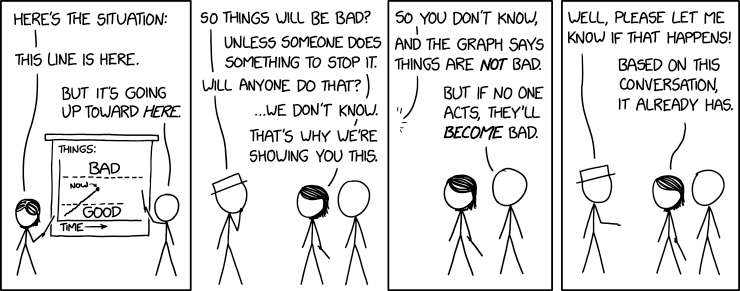

# 2.7 Conclusion

    

        
            <i class="fas fa-clock"></i>
        
        

            
Temps de lecture

            
1 min

        

    

!!! quote "Déclaration sur les risques de l'IA (Plusieurs experts en IA, 2023)"

Atténuer le risque d'extinction dû à l'IA devrait être une priorité mondiale, au même titre que d'autres risques à l'échelle sociétale comme les pandémies et la guerre nucléaire.

Atténuer le risque d'extinction dû à l'IA devrait être une priorité mondiale, au même titre que d'autres risques à l'échelle sociétale comme les pandémies et la guerre nucléaire.

Il existe de nombreux types de risques et beaucoup d'incertitudes.

**Les risques liés à l'IA sont complexes.** Dans ce chapitre, nous avons parcouru le paysage complexe et multidimensionnel des risques liés à l'IA, mettant en lumière les nombreuses façons dont les capacités naissantes de l'intelligence artificielle pourraient représenter des menaces significatives pour le bien-être humain et même sa survie. Des utilisations abusives des technologies d'IA dans la cyberdéfense et le bioterrorisme aux dangers intrinsèques du désalignement (misalignment) et des risques systémiques, le potentiel de résultats catastrophiques est bien réel. De plus, les pressions concurrentielles du paysage de développement de l'IA et l'inadéquation des mécanismes actuels de régulation et de supervision ne font qu'amplifier ces défis.

**Un consensus reste à établir.** Malgré des recherches et des débats approfondis, il subsiste un manque de consensus concernant les paramètres spécifiques qui influencent la probabilité de désalignement, de tromperie et d'autres formes de risques. Cette incertitude souligne les difficultés à prédire le comportement de l'IA et à garantir son alignement avec les valeurs humaines et les normes de sécurité.

**Cependant, ce chapitre constitue également un appel à l'action.** Alors que nous nous tenons au bord d'avancées potentiellement [transformatives](IA transformative) en matière d'IA, nous pensons qu'il est nécessaire de développer une approche globale et pluridisciplinaire de la sécurité de l'IA qui englobe des garanties techniques, des cadres éthiques robustes et une coopération internationale. Le développement des technologies d'IA ne peut pas être laissé uniquement aux mains des spécialistes techniques ; il requiert l'implication des décideurs politiques, des éthiciens, des chercheurs en sciences sociales et du grand public pour naviguer à travers les implications morales et sociétales de l'IA.

<figure markdown="span">
{ loading=lazy }
  <figcaption markdown="1"><b>Figure 2.38 :</b> XKCD ([XKCD](https://xkcd.com/))</figcaption>
</figure>