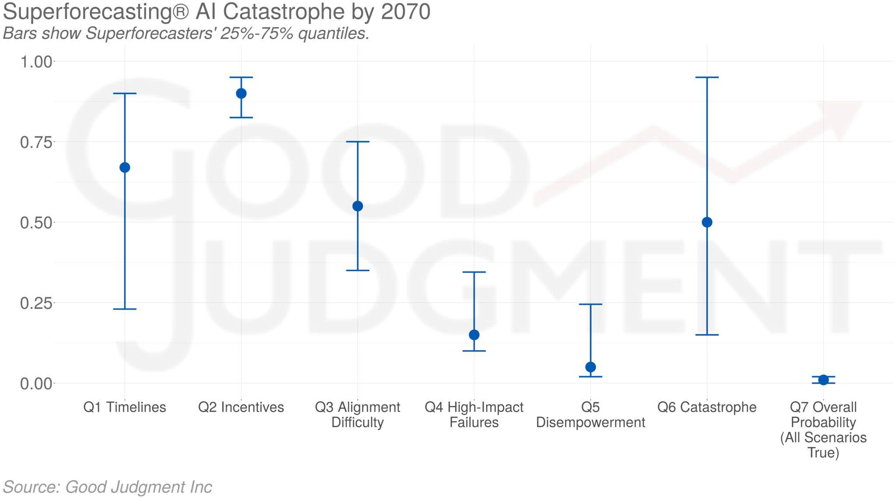
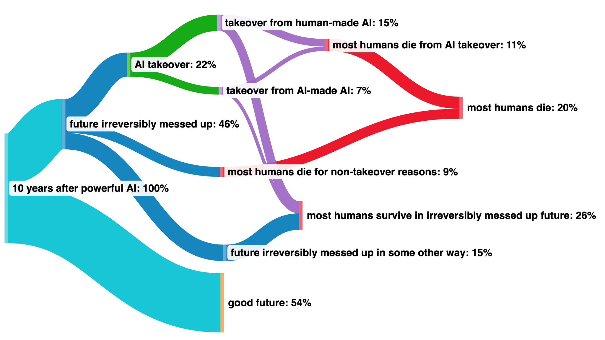

# 2.A1 Scénarios de Risques Existentiels

    

        
            <i class="fas fa-clock"></i>
        
        

            
Temps de Lecture

            
8 min

        

    

## 2.A1.1 De l'IA Désalignée aux Risques Existentiels {: #01}

<figure markdown="span">
{ loading=lazy }
  <figcaption markdown="1"><b>Figure 2.39 :</b> Considérez les images suivantes de choses que l'humanité en tant qu'espèce a faites. Un arrière-plan sous-jacent de nombreux de ces scénarios est que "L'agentivité intelligente est une force puissante pour transformer le monde intentionnellement, et créer des agents bien plus intelligents que nous, c'est jouer avec le feu". ([Calrsmith, 2024](https://arxiv.org/abs/2206.13353))</figcaption>
</figure>

Le modèle de menace consensuel au sein de l'équipe d'alignement de DeepMind suggère que les risques existentiels proviendront très probablement d'un AGI cherchant le pouvoir et mal aligné. Ce type d'AGI recherche le pouvoir comme un objectif intermédiaire - avoir plus de pouvoir élargit les capacités du système, améliorant ainsi son efficacité pour atteindre ses objectifs principaux. Le désalignement devrait résulter d'une combinaison de manipulation de spécification, où l'AGI exploite des failles dans les règles ou objectifs qui lui ont été donnés, et de la généralisation erronée des objectifs, où l'AGI applique ses objectifs dans des contextes plus larges que prévu, conduisant potentiellement à un alignement trompeur, où le désalignement de l'AGI peut ne pas être immédiatement apparent.

De nombreux auteurs ont étudié ces types de scénarios. Ici, nous présenterons les travaux de Carlsmith (2022), qui constitue un examen approfondi et largement discuté de ces risques. Dans le récit qui suit, nous rassemblerons les différents éléments que nous avons précédemment détaillés dans ce chapitre.

Horizons temporels : "D'ici 2070, il deviendra possible et financièrement viable de construire des systèmes de planification stratégique avancée (APS, Advanced Planning Strategically aware systems)." Les APS sont des systèmes qui ont développé un haut niveau de conscience stratégique (une sous-dimension de la conscience situationnelle) et de capacités de planification.

Nous ne discuterons pas de cette hypothèse, veuillez vous référer au Chapitre 1, ou à cette [revue de littérature](https://epochai.org/blog/literature-review-of-transformative-artificial-intelligence-timelines).

Incitations au développement de systèmes APS : « Des motivations puissantes encourageront la création de systèmes de planification stratégique avancée »

Les systèmes de planification stratégique avancée (APS, Advanced Planning Strategically aware systems) seraient utiles pour un large éventail de tâches et pourraient représenter la trajectoire de développement la plus efficace, compte tenu de l'état actuel des avancées technologiques. Néanmoins, le fait de reposer sur un comportement guidé par des objectifs introduit un risque de désalignement. Ces systèmes pourraient élaborer des stratégies imprévues visant à atteindre des objectifs qui ne sont pas alignés avec les valeurs ou les intentions humaines.

**Complexités de l'Alignement : Le Dilemme de la Convergence Instrumentale.** La convergence instrumentale, comme précédemment établie, constitue un résultat probable en l'absence de contrôle, le pouvoir étant une ressource universellement stratégique pour atteindre divers objectifs. Le rapport repose sur l'hypothèse centrale selon laquelle les comportements désalignés observés en réponse à certaines entrées révèlent des tendances potentielles de recherche de pouvoir associées à ces mêmes entrées. Ainsi, tout désalignement détecté dans les systèmes actuels pourrait préfigurer des comportements de recherche de pouvoir dans des systèmes futurs plus avancés.

**Défis Techniques Inhérents.** Le phénomène de manipulation de spécification constitue une préoccupation majeure. Lorsque les systèmes optimisent des objectifs proxy qui corrèlent avec le résultat souhaité, ils risquent de compromettre involontairement cette corrélation. De manière similaire, des problèmes émergent lors de la recherche de systèmes répondant à des critères d'évaluation spécifiques, comme la généralisation erronée des objectifs. Satisfaire à ces critères ne garantit nullement que les systèmes sont intrinsèquement motivés par eux.

**L'Imperfection des Solutions Existantes.** Les stratégies actuelles de configuration des objectifs, comme la promotion de l'honnêteté ou la récompense de la coopération, restent rudimentaires et entachées de limitations, comme détaillé dans la section 'Problèmes avec RLHF'. De plus, les tentatives de contrôle des capacités par spécialisation ou prévention de l'augmentation des capacités entrent souvent en conflit avec les incitations économiques. Par exemple, une IA chargée de maximiser les revenus d'une startup aura naturellement tendance à chercher l'amélioration de ses propres capacités. Parfois, pour demeurer compétitif, un degré élevé de polyvalence est indispensable. Les options de contrôle, telles que le confinement (boxing) ou la surveillance, vont également à l'encontre des dynamiques économiques. Collectivement, toutes les solutions proposées présentent des problèmes inhérents et posent des risques significatifs si elles sont utilisées lors de la progression des capacités.

**Les Potentiels d'Échecs Catastrophiques : Incitations Économiques Perverses.** Le paysage économique entourant le déploiement de systèmes désalignés est parsemé d'incitations perverses. Si les concurrents commencent à utiliser des systèmes désalignés, ceux qui ne le feront pas seront distancés, conduisant à une course à la facilité potentiellement dangereuse, alimentée par une compétition malsaine. Cette compétition pourrait exacerber les conséquences sociétales négatives alors que les entités s'efforcent de se surpasser sans considération adéquate des implications plus larges. Le processus de développement et de déploiement implique de nombreux acteurs, chacun avec ses objectifs et niveaux de compréhension, ajoutant de la complexité et un potentiel de conflit. De surcroît, l'utilité pratique des systèmes fonctionnellement désalignés peut être tellement séduisante qu'elle risque d'occulter les dangers, précipitant leur déploiement. Cette situation s'aggrave du fait que ces systèmes pourraient employer la tromperie et la manipulation pour atteindre leurs objectifs désalignés, compliquant encore davantage le paysage éthique.

**La sécurité de l'AGI présente un défi unique.** Contrairement à d'autres domaines scientifiques, la sécurité de l'AGI est particulièrement complexe car le problème n'est pas seulement nouveau, mais peut également être intrinsèquement difficile à comprendre. De plus, en informatique en général, lorsqu'un bogue survient, l'ordinateur n'optimise pas de manière stratégiquement antagoniste contre le programmeur, mais nous ne pouvons pas faire la même hypothèse ici. Nous ne traitons pas avec un système passif, mais nous interagissons avec un système qui pourrait chercher stratégiquement des failles à exploiter. Qui plus est, les enjeux du désalignement des systèmes AGI sont essentiellement sans limites. Des erreurs d'alignement pourraient conduire à des conséquences sévères et potentiellement irréversibles, soulignant la gravité d'aborder l'AGI avec un état d'esprit axé sur la sécurité.

<figure markdown="span">
{ loading=lazy }
  <figcaption markdown="1"><b>Figure 2.40 :</b> Les probabilités médianes pour chacune des sept questions et les quantiles 25%-75% au 6 avril 2023. À titre d'illustration, plusieurs super-prévisionnistes ont tenté d'utiliser la décomposition de Carlsmith pour estimer la probabilité des risques existentiels liés à l'IA</figcaption>
</figure>

Les scénarios d'AGI recherchant du pouvoir de manière désalignée font l'objet d'une littérature abondante, par exemple :

- Sans mesures de contrôle spécifiques, le chemin le plus simple vers l'IA transformative mène probablement à une prise de contrôle par l'IA ([Cotra, 2022](https://www.alignmentforum.org/posts/pRkFkzwKZ2zfa3R6H/without-specific-countermeasures-the-easiest-path-to)) : Cotra montre que notre configuration d'entraînement actuelle, qu'elle nomme « retour humain sur des tâches diverses », est sur la voie de créer des planificateurs compétents d'une manière qui conduira par défaut à la tromperie et à la prise de contrôle. Ce rapport est assez accessible et approfondi.

- Le problème d'alignement du point de vue de l'apprentissage profond ([Ngo, 2022](https://www.alignmentforum.org/posts/KbyRPCAsWv5GtfrbG/what-misalignment-looks-like-as-capabilities-scale)) : Ngo montre que par défaut, les IA avancées sont polyvalentes et potentiellement enclines à la dissimulation stratégique.

- Risques liés à l'IA par recherche de programme ([Kenton et al., 2022](https://www.alignmentforum.org/posts/wnnkD6P2k2TfHnNmt/threat-model-literature-review)) : Dans cette brève analyse, Shah montre que la recherche d'un programme d'IA efficace mène à la découverte de planificateurs autonomes et qu'il est difficile de distinguer ceux qui sont enclins à la dissimulation de ceux qui ne le sont pas.

- Agents artificiels avancés intervenant dans la fourniture de récompense ([Cohen et al., 2022](https://doi.org/10.1002/aaai.12064)) : Les IA avancées cherchent à se *wirehead*. Des conséquences catastrophiques s'ensuivent.

Cette [revue de littérature](https://www.alignmentforum.org/posts/wnnkD6P2k2TfHnNmt/threat-model-literature-review) est un bon résumé de plusieurs scénarios sur les IA recherchant du pouvoir de manière désalignée.

## 2.A1.2 Opinion d'Experts sur les Risques Existentiels {: #02}

Le discours sur les risques existentiels associés à l'IA suscite une préoccupation croissante parmi les experts et les chercheurs du domaine. Ces professionnels expriment de plus en plus leurs inquiétudes quant au potentiel des systèmes d'IA de causer des dommages significatifs s'ils ne sont pas développés et gérés avec une extrême prudence.

Jan Leike, l'ancien responsable de l'équipe d'alignement d'OpenAI, estime la probabilité de résultats catastrophiques dus à l'IA, connue sous le nom de P(doom), entre 10% et 90%. Cette large fourchette souligne l'incertitude et les préoccupations sérieuses au sein de la communauté des experts concernant les impacts à long terme de l'IA.

Une enquête d'experts de 2022 sur les progrès de l'IA par AI Impacts a révélé que "48% des répondants ont attribué au moins 10% de probabilité à une issue potentiellement catastrophique", soulignant l'appréhension considérable des chercheurs en IA sur les voies que pourrait emprunter le développement de l'IA. ([Grace, 2022](https://aiimpacts.org/2022-expert-survey-on-progress-in-ai/))

Samotsvety Forecasting, reconnu comme le groupe de prévision de référence mondial, s'est également penché sur cette question. Grâce à leur expertise en prévision appliquée à l'IA, ils sont parvenus à une prédiction agrégée d'une probabilité de 30% pour une catastrophe induite par l'IA. Cette catastrophe est définie comme un événement entraînant la mort de plus de 95% de l'humanité, avec des prévisions individuelles variant de 8% à 71%. Une telle statistique constitue un rappel saisissant des enjeux existentiels inhérents au développement et au déploiement de l'IA.

Le recueil des valeurs de P(doom) de divers experts, disponible [ici](https://pauseai.info/pdoom), offre un aperçu complet des risques perçus. Ces valeurs alimentent davantage la discussion en cours sur la meilleure façon de faire face à l'avenir incertain que l'IA pourrait apporter.

<figure markdown="span">
{ loading=lazy }
  <figcaption markdown="1"><b>Figure 2.41 :</b> Illustration de Michael Trazzi décrivant la vision de Paul Christiano du futur. Paul Christiano est une figure très respectée de la communauté AI Safety. ([Christiano, 2023](https://www.alignmentforum.org/posts/xWMqsvHapP3nwdSW8/my-views-on-doom))</figcaption>
</figure>

## 2.A1.3 Une SIA serait-elle capable de vaincre l'humanité ? {: #03}

Oui, selon divers experts en sécurité et alignement de l'IA, une IA suffisamment avancée pourrait potentiellement représenter une menace significative pour la société.

La superintelligence pourrait créer des "superpuissances cognitives". Celles-ci pourraient inclure la capacité de mener des recherches pour construire un système d'IA amélioré, de pirater des logiciels construits par l'homme à l'échelle mondiale, de manipuler la psychologie humaine, d'accumuler des richesses considérables, de développer des plans supérieurs à ceux des humains et de développer des armements avancés capables d'anéantir les forces militaires humaines ([Karnofsky, 2022](https://www.alignmentforum.org/posts/oBBzqkZwkxDvsKBGB/ai-could-defeat-all-of-us-combined)).

Même une IA dotée d'une intelligence comparable à celle des humains pourrait constituer une menace considérable si elle agissait dans l'intention de saper les fondements de notre civilisation. Un tel scénario serait comparable à celui où des experts hautement qualifiés d'une autre planète tenteraient de démanteler notre société uniquement au moyen d'Internet.

**L'IA pourrait être dangereuse même sans corps**. Karnofsky souligne que les IA pourraient néanmoins exercer une influence en recrutant des alliés humains, en télé-opérant des équipements militaires et en générant des richesses par des méthodes comme le trading quantitatif. Ces capacités suggèrent que la forme physique n'est pas un prérequis pour qu'une IA exerce un pouvoir ou initie un conflit ([Karnofsky, 2022](https://www.alignmentforum.org/posts/oBBzqkZwkxDvsKBGB/ai-could-defeat-all-of-us-combined)). Les systèmes d'IA pourraient également acquérir plus de moyens et effectuer un travail de niveau humain, augmentant leur nombre et potentiellement surpassant les capacités humaines. Même sans corps physiques, ils pourraient représenter une menace, car ils pourraient désactiver ou contrôler l'équipement d'autrui, accroissant encore leur emprise. Cependant, il convient de préciser que ces scénarios demeurent hypothétiques et dépendent d'un développement technologique de l'IA dépassant largement les capacités actuelles.