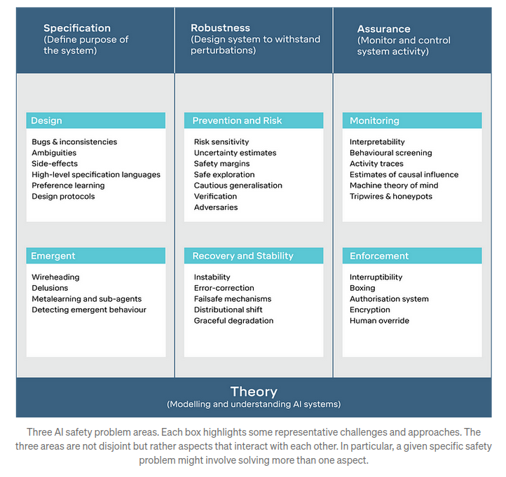
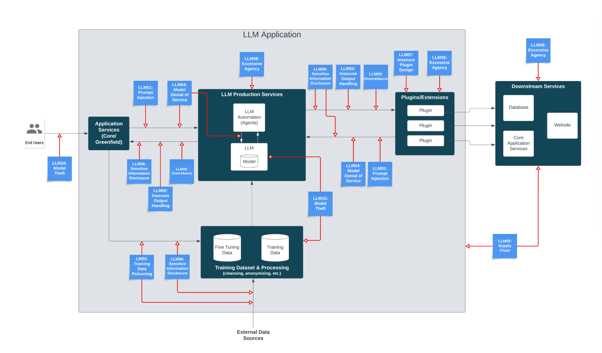

# 2.A2 Divers

## 2.A2.1 Les risques liés à l'IA sont innombrables

Le domaine des risques liés à l'IA est infini, avec un éventail mouvant et imprévisible de menaces émergentes. Dès lors que l'on croit avoir identifié tous les risques potentiels, de nouveaux surgissent, rendant vaine toute tentative de catégorisation exhaustive ou d'élaboration d'un cadre complet de prévention.

Différents cadres conceptuels se concentrent sur des classes distinctes de problèmes, chacun abordant des aspects spécifiques de la sécurité et de l'éthique de l'IA. À titre d'exemple, l'ouvrage "Concrete Problems in AI Safety" décrit certaines préoccupations spécifiques en matière de sécurité dans le développement de l'IA. Le cadre TASRA, quant à lui, propose une approche fondamentalement différente. De même, un aperçu des Risques Catastrophiques de l'IA présente encore une perspective unique. Qui plus est, des publications variées continuent d'identifier et de documenter des classes de risques jusqu'alors méconnues. ([Wilson, 2023](https://owasp.org/www-project-top-10-for-large-language-model-applications/assets/PDF/OWASP-Top-10-for-LLMs-2023-v1_1.pdf))

Une systématisation complète et exhaustive est difficile.

<figure markdown="span">
{ loading=lazy }
  <figcaption markdown="1"><b>Figure 2.42 :</b> Voici un autre cadre conceptuel très différent de celui que nous avons présenté. ([Wilson, 2023](https://owasp.org/www-project-top-10-for-large-language-model-applications/assets/PDF/OWASP-Top-10-for-LLMs-2023-v1_1.pdf))</figcaption>
</figure>

<figure markdown="span">
{ loading=lazy }
  <figcaption markdown="1"><b>Figure 2.43 :</b> Voici un autre cadre conceptuel axé sur les vulnérabilités des grands modèles de langage (LLM, de l'anglais Large Language Model). ([Wilson, 2023](https://owasp.org/www-project-top-10-for-large-language-model-applications/assets/PDF/OWASP-Top-10-for-LLMs-2023-v1_1.pdf))</figcaption>
</figure>

## 2.A2.2 Mesurer l'alignement est difficile

L'article « AI Safety Seems Hard to Measure » de Holden Karnofsky aborde les complexités et les défis liés à la garantie de la sécurité de l'IA. Le texte décrit quatre difficultés majeures, qui constituent une autre perspective du problème d'alignement :

- Le Problème de Lance Armstrong : Ce problème met en lumière une interrogation cruciale : les systèmes d'IA sont-ils réellement sûrs ou simplement habiles à dissimuler leurs comportements potentiellement dangereux ? À l'instar de Lance Armstrong, qui a réussi à masquer son dopage pendant des années, le défi consiste à distinguer une IA intrinsèquement sûre d'une IA simplement douée pour paraître inoffensive.

- Le Problème de King Lear : Cette problématique explore l'imprévisibilité des comportements de l'IA lors de sa transition vers l'autonomie, en référence à la pièce de Shakespeare. À l'image du roi Lear qui perd le contrôle de son royaume, ce problème illustre la difficulté de prévoir les actions d'une intelligence artificielle une fois qu'elle échappe à la supervision humaine.

- Le Problème des Souris de Laboratoire : Les systèmes d'IA actuels manquent de la sophistication nécessaire pour reproduire les comportements complexes que nous cherchons à comprendre. Cette limitation rend ardue la recherche et la prévention des risques potentiels futurs, à l'image des limites inhérentes aux études médicales menées uniquement sur des modèles murins.

- Le Problème du premier contact : Ce problème explore un scénario critique où les capacités des systèmes d'IA dépassent significativement l'intelligence humaine, soulevant des défis inédits en matière de garantie de leur sécurité. L'analogie repose sur la préparation à un événement totalement imprévisible et sans précédent, à l'image d'un hypothétique premier contact extraterrestre.

## 2.A2.3 Pourquoi les laboratoires s'engagent-ils dans le développement de l'AGI malgré les risques ? {: #03}

Cette question est fréquemment posée. Voici une réponse concise.

- Bénéfices potentiels : Les laboratoires poursuivent le développement de l'Intelligence Artificielle Générale (IAG) malgré les risques inhérents, en raison des avantages prometteurs considérables. Une mise en œuvre réussie de l'IAG pourrait ouvrir la voie à des percées sans précédent en matière de résolution de problèmes, d'optimisation de l'efficacité et d'innovation dans de multiples domaines.

- Dynamiques compétitives : L'engagement dans le développement de l'Intelligence Artificielle Générale (IAG), malgré les risques reconnus, est motivé par les pressions concurrentielles du domaine. Il existe une conviction répandue selon laquelle il est préférable que ceux qui sont réfléchis et prudents à propos de ces développements prennent les devants. Étant donné la concurrence intense, il existe une crainte parmi les entités qu'un arrêt de la recherche sur l'IAG pourrait se traduire par un dépassement par d'autres, potentiellement ceux ayant moins de considération pour la sécurité. Voir l'encadré ci-dessous : Comment les entreprises d'IA prolifèrent-elles ?

- Prestige et reconnaissance : Le prestige constitue un autre moteur significatif. De nombreux chercheurs en IAG visent des nombres de citations élevés, le respect au sein des communautés académiques et technologiques, et le succès financier. Malheureusement, précipiter les développements est perçu comme un marqueur de statut élevé.

- De plus, la plupart des chercheurs en IAG croient en la faisabilité de la sécurité de l'IAG. Il existe une conviction chez certains chercheurs qu'un effort à grande échelle et concerté - comparable au Projet Manhattan et similaire au « plan de super alignement » (super alignment plan) d'OpenAI - pourrait conduire au développement d'une intelligence artificielle contrôlable capable de mettre en œuvre des mesures de sécurité exhaustives.