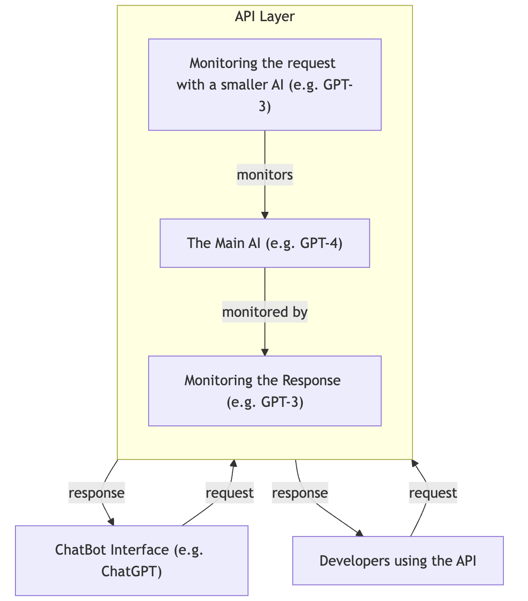
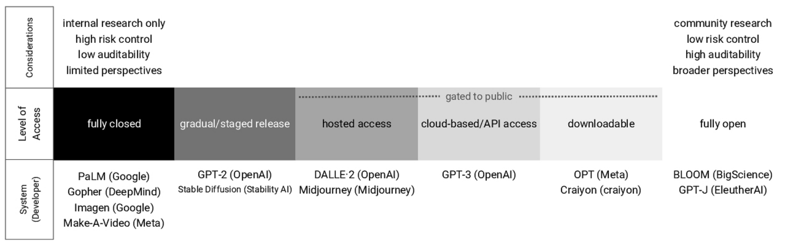
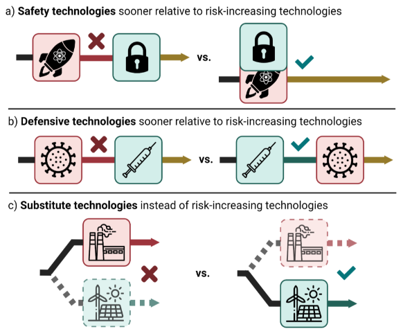

# 3.3 Prévenir les Mésusages

??? note "Récapitulatif : Risques liés aux mésusages"

- **Campagnes de désinformation** : Diffusion de récits mensongers ou manipulation d'élections.

- **Deepfakes** : Manipulation de personnes au moyen de vidéos ou d'appels falsifiés paraissant authentiques

- **Perte de confidentialité** : Interception de données personnelles ou surveillance des activités des personnes.

- **Conflits destructeurs liés à l'IA** : Utilisation de l'IA pour créer des armements plus létaux et autonomes.

- **Cyberattaques** : Ciblage d'infrastructures critiques comme les principales institutions financières ou les installations nucléaires en exploitant les capacités surhumaines d'une IA.

- **Pandémies provoquées** : Conception, production et libération d'agents pathogènes mortels.

Dans le cadre de l'atténuation des risques associés aux technologies d'IA puissantes émergentes, deux approches stratégiques distinctes se profilent :

- **Stratégie A : Limiter la prolifération des modèles à haut risque - par exemple, via des API à accès contrôlé.** La stratégie des API à accès contrôlé vise à restreindre l'accès aux modèles d'IA présentant des risques extrêmes, tels que ceux susceptibles d'amplifier les **cyberattaques** ou de faciliter la création de **pandémies provoquées**. En plaçant ces modèles à haut risque derrière des API à accès restreint, nous garantissons que seuls les utilisateurs autorisés peuvent y accéder. Cette approche s'apparente à un confinement numérique, où le potentiel de l'IA d'être utilisée comme une arme est bridé par des mécanismes de contrôle stricts. Cette méthode permet en outre un suivi détaillé de l'utilisation des modèles d'IA, permettant la détection précoce des schémas de mésusage.

- **Stratégie B : « Vacciner » la société et « préparer des usines de vaccins » contre de nombreux types de menaces - une stratégie appelée Accélération de la Défense.** La stratégie d'Accélération de la Défense (d/acc) ([Buterin, 2023](https://vitalik.eth.limo/general/2023/11/27/techno_optimism.html)) préconise le développement et le déploiement rapides de technologies défensives. Cette stratégie repose sur la conviction que le renforcement de nos capacités défensives peut devancer et atténuer les menaces posées par les utilisations offensives de l'IA, telles que les cyberattaques ou les menaces biologiques provoquées. L'essence de d/acc est de créer un environnement technologique où le coût et la complexité des actions offensives sont significativement augmentés, réduisant ainsi leur faisabilité et leur attractivité.

Pour faire face à l'utilisation potentiellement abusive des ***IA déjà proliférées***, nous pouvons utiliser la stratégie C en complément des stratégies A et B :

- **Stratégie C : Lorsque des modèles problématiques sont déjà largement diffusés, l'une des rares solutions consiste à criminaliser leur utilisation à des fins clairement malintentionnées.** Cela peut inclure des éléments tels que les contenus de deepfakes sexuels non consensuels, étant donné qu'il n'existe pas de parade technique simple contre ces menaces.

## 3.3.1 Stratégie A : API à accès contrôlé {: #01}

Alors que l'Intelligence Artificielle Générale (AGI, de l'anglais Artificial General Intelligence) devient plus accessible, plus facile à construire et potentiellement destructrice, nous avons besoin d'un contrôle et d'un suivi aussi rigoureux que possible sur les personnes susceptibles d'utiliser des IA dangereuses. Une mesure préventive contre les mésusages consiste à restreindre l'accès aux modèles puissants capables de causer des dommages. Cela implique de placer les modèles à haut risque derrière des interfaces de programmation (API) et de surveiller attentivement leur activité.

<figure markdown="span">
{ loading=lazy }
  <figcaption markdown="1"><b>Figure 3.2 :</b> Ce schéma illustre le fonctionnement d'une API. Ce diagramme est très simplifié et ne sert qu'à des fins d'illustration. L'API d'OpenAI ne fonctionne pas de cette manière.</figcaption>
</figure>

**La nécessité de l'évaluation des modèles.** La première étape de cette stratégie consiste à identifier, grâce à l'évaluation des modèles, lesquels sont considérés comme dangereux et lesquels ne le sont pas. L'article sur l'Évaluation des Modèles pour les Risques Extrêmes Potentiels ([Shevlane et al., 2023](https://arxiv.org/abs/2305.15324)), qui a été en partie présenté lors du chapitre précédent, énumère quelques capacités critiques et dangereuses qui doivent être évaluées.

- Pour plus d'informations, consultez le Chapitre sur les Évaluations.

**Les modèles classés comme potentiellement dangereux doivent être surveillés.** Les systèmes d'intelligence artificielle (IA) les plus dangereux devraient faire l'objet de contrôles attentifs. Ceux dotés de capacités en recherche biologique, menaces cybernétiques, ou réplication et adaptation autonomes devraient avoir des contrôles d'accès stricts pour prévenir les mésusages à des fins terroristes, à l'image de la réglementation des armes à feu. Ces capacités devraient être exclues des systèmes d'IA conçus à des fins générales, possiblement via le filtrage de jeux de données ou, de manière plus spéculative, par le désapprentissage du modèle ([Yao et al., 2024](https://arxiv.org/abs/2310.10683)). Les fournisseurs de systèmes d'IA dangereux ne devraient autoriser que des interactions contrôlées via des services cloud ([Shevlane, 2022](https://arxiv.org/abs/2201.05159)). Il est également crucial de considérer des alternatives à l'approche binaire du partage de modèles totalement ouvert ou fermé. Des stratégies telles que le partage progressif et sélectif par étapes, qui permet un intervalle entre les versions de modèles pour mener des analyses de risques et bénéfices à mesure que la taille des modèles augmente, pourraient équilibrer avantages et risques ([Solaiman et al., 2019](https://arxiv.org/abs/1908.09203)). La surveillance des modèles sensibles derrière des API, au moyen d'algorithmes de détection des anomalies, pourrait également s'avérer utile.

**Une stratégie clé de surveillance est la norme Connaître Votre Client (KYC).** C'est un processus obligatoire adopté par des entreprises comme les banques qui implique de vérifier l'identité de leurs clients ou entités juridiques conformément aux réglementations actuelles de diligence à l'égard des clients. La KYC signifie concrètement exiger une carte d'identité ainsi qu'une vérification des antécédents avant toute utilisation de services. Cette démarche est essentielle pour identifier et suivre les utilisateurs potentiellement malveillants.

**Le Red Teaming peut aider à évaluer si ces mesures sont suffisantes.** Durant le Red Teaming, des équipes internes tentent d'exploiter les faiblesses du système afin d'améliorer sa sécurité. Ils devraient tester si un utilisateur malveillant hypothétique peut extraire une quantité significative d'informations sensibles du modèle sans être détecté.

**Les mesures décrites précédemment sont les plus faciles à implementer.** Une description plus détaillée des mesures simples mentionnées pour prévenir les mésusages est disponible [ici](https://www.lesswrong.com/posts/KENtuXySHJgxsH2Qk/managing-catastrophic-misuse-without-robust-ais), et elles semblent techniquement réalisables. Cela requiert la volonté de prendre des précautions et de placer les modèles derrière des API.

**Prévenir le piratage et l'exfiltration des modèles dangereux.** Les laboratoires de recherche développant des modèles de pointe doivent mettre en place des mesures de cybersécurité rigoureuses pour protéger les systèmes d'IA contre le vol par des acteurs externes et déployer des défenses de cybersécurité suffisantes pour limiter leur prolifération. Bien que cela puisse paraître simple de prime abord, la tâche est en réalité extrêmement complexe, et protéger les modèles contre des acteurs étatiques pourrait nécessiter des efforts extraordinaires ([Ladish & Heim, 2022](https://www.lesswrong.com/posts/2oAxpRuadyjN2ERhe/information-security-considerations-for-ai-and-the-long-term)).

<figure markdown="span">
{ loading=lazy }
  <figcaption markdown="1"><b>Figure 3.3 :</b> Gradient d'accès au système ([Seger et al., 2023](https://arxiv.org/abs/2311.09227))</figcaption>
</figure>

**Pourquoi ne pouvons-nous pas simplement paramétrer par instructions des modèles puissants puis les publier avec des poids accessibles ?** Une fois qu'un modèle est librement accessible, même s'il a été affiné pour intégrer des filtres de sécurité, le contournement de ces filtres reste relativement aisé. Qui plus est, des études récentes ont démontré qu'il suffit de quelques centaines d'euros pour neutraliser tous les mécanismes de sécurité actuellement présents sur les modèles open-source disponibles, simplement en affinant le modèle avec quelques exemples toxiques. ([Lermen et al., 2024](https://arxiv.org/abs/2310.20624)) C'est précisément pourquoi placer les modèles derrière des interfaces de programmation (API) s'avère judicieux, car cela prévient tout affinage non autorisé sans le consentement de l'entreprise.

Bien que prometteuses pour limiter les risques extrêmes comme les cyberattaques ou les biorisques, les API surveillées pourraient s'avérer moins efficaces face aux menaces plus subtiles des deep fakes et de l'érosion de la vie privée. Les deep fakes, par exemple, requièrent des modèles d'IA moins sophistiqués déjà largement disponibles, qui pourraient ne pas être classés comme à haut risque et, partant, ne pas être placés derrière des API surveillées. Plus de détails à ce sujet dans la stratégie C.

!!! quote "Anthropic ([Anthropic, 2023](https://www-cdn.anthropic.com/1adf000c8f675958c2ee23805d91aaade1cd4613/responsible-scaling-policy.pdf))"

Des mécanismes de sécurité tels que l'apprentissage par renforcement à partir de retours humains (RLHF) ou la formation constitutionnelle peuvent presque certainement être contournés lors d'un réaffinage minimal représentant 1% du coût d'entraînement initial.

Des mécanismes de sécurité tels que l'apprentissage par renforcement à partir de retours humains (RLHF, de l'anglais *Reinforcement Learning from Human Feedback*) ou la formation constitutionnelle peuvent presque certainement être contournés lors d'un réaffinage minimal représentant 1% du coût d'entraînement initial.

## 3.3.2 Stratégie B : Accélération de la Défense {: #02}

Le cadre précédent suppose que les IA dangereuses sont fermées derrière des API et nécessitent un certain degré de centralisation.

**Cependant, la centralisation peut également présenter des risques systémiques** ([Kapoor et al., 2024](https://arxiv.org/abs/2403.07918)). Il existe un compromis entre la sécurisation des modèles derrière des API pour contrôler les mauvaises utilisations et les risques de centralisation excessive ([Cihon et al., 2020](https://arxiv.org/abs/2001.03573)). Par exemple, si dans 20 ans toutes les entreprises mondiales s'appuient sur l'API d'une seule entreprise, des risques significatifs de verrouillage des valeurs ou de fragilité pourraient survenir car le monde entier serait dépendant de l'opinion politique de ce modèle. La stabilité ou l'instabilité de cette API pourrait constituer un point de défaillance unique, pour ne rien dire des concentrations potentielles de pouvoir.

**Un autre paradigme possible consisterait à concevoir des IA ouvertes et décentralisées.** Certes, si les modèles sont open-source, nous devons admettre que toutes les IA ne seront pas utilisées à des fins bénéfiques, tout comme nous reconnaissons l'existence d'individus capables de commettre des actes de violence odieux. Même après avoir configuré les IA par instructions avant leur diffusion, il demeure aisé de contourner les mécanismes de sécurité ([Lermen et al., 2024](https://arxiv.org/abs/2310.20624)), comme nous l'avons précédemment observé. Cela implique que certains individus mésutiliseront l'IA, et nous devons nous y préparer. À titre d'exemple, il conviendrait de renforcer les défenses au sein des infrastructures existantes. Une stratégie de défense consisterait à utiliser des modèles pour analyser exhaustivement l'ensemble du code open-source mondial, afin d'identifier les vulnérabilités de sécurité avant que des acteurs malveillants ne les exploitent. Un autre exemple serait de mobiliser ces modèles pour détecter les failles dans la chaîne d'approvisionnement des agents biologiques et entreprendre leur correction.

**Accélération de la défense.** L'accélération de la défense, ou d/acc, est un cadre conceptuel popularisé par Vitalik Buterin ([Buterin, 2023](https://vitalik.eth.limo/general/2023/11/27/techno_optimism.html)). La d/acc constitue une approche stratégique centrée sur la promotion des technologies et innovations qui favorisent intrinsèquement la défense plutôt que l'offensive. Cette stratégie met l'accent sur le développement et l'accélération de technologies protégeant les individus, les sociétés et les écosystèmes contre divers risques, par opposition aux technologies potentiellement utilisables à des fins agressives ou préjudiciables. Il s'agit d'une forme de vaccination sociétale contre les conséquences négatives potentielles de nos avancées technologiques. La d/acc représenterait également une stratégie crédible pour préserver la liberté et la vie privée. À l'instar d'un système de sécurisation robuste qui dissuade les intrusions, cette approche vise à réduire les potentiels foyers de chaos et de criminalité. Un tel mécanisme est essentiel pour prévenir l'émergence de scénarios dystopiques caractérisés par une surveillance et un contrôle omniprésents.

<figure markdown="span">
{ loading=lazy }
  <figcaption markdown="1"><b>Figure 3.4 :</b> Mécanismes par lesquels le développement technologique différentiel peut réduire les impacts sociétaux négatifs. ([Buterin, 2023](https://vitalik.eth.limo/general/2023/11/27/techno_optimism.html))</figcaption>
</figure>

!!! note "Garantir un équilibre positif entre offensive et défensive dans un monde open-source"

[No text to translate]

**Une considération clé pour la faisabilité du cadre de la d/acc est l'équilibre entre offensive et défensive : à quel point est-il difficile de se défendre contre un attaquant ?** Ce concept est crucial pour évaluer quels modèles sont plus susceptibles d'être bénéfiques que préjudiciables s'ils sont rendus open-source. Dans le développement logiciel traditionnel, l'open-sourcing modifie souvent l'équilibre entre offensive et défensive de manière positive : la transparence accrue permet à une communauté plus large de développeurs d'identifier et de corriger les vulnérabilités, améliorant ainsi la sécurité globale ([Seger et al., 2023](https://arxiv.org/abs/2311.09227)). Cependant, cette dynamique pourrait changer avec l'open-sourcing des modèles d'IA avancés car ils introduisent de nouveaux types de risques émergents qui ne peuvent pas simplement être corrigés. Cela représente un changement significatif par rapport aux vulnérabilités logicielles traditionnelles vers des menaces plus complexes et dangereuses qui ne peuvent pas être facilement contrecarrées par des mesures défensives.

Dans le cas de l'IA, le partage des modèles les plus puissants peut poser des risques extrêmes qui surpasseraient les avantages habituels de l'open-sourcing. De la même manière que partager le mode de fabrication d'un virus mortel paraîtrait extrêmement irresponsable, la distribution libre de modèles d'IA offrant un accès à de telles connaissances devrait être tout aussi préoccupante.

L'équilibre actuel pour le partage des modèles avancés reste incertain ; il a été clairement positif jusqu'à présent, mais le déploiement de modèles de plus en plus puissants pourrait faire pencher cette balance vers des niveaux de risque inacceptables.[^1]

[^1] : Voir, par exemple, « Que faut-il pour défendre le monde contre des AGI hors de contrôle ? » ([Byrnes, 2022](https://www.alignmentforum.org/posts/LFNXiQuGrar3duBzJ/what-does-it-take-to-defend-the-world-against-out-of-control)), un article qui affirme que l'équilibre offensive-défensive penche plutôt du côté de l'offensive, mais cela reste encore très incertain.

Les dangers émergents des IA de pointe sont encore embryonnaires, et les préjudices qu'elles peuvent causer ne sont pas encore extrêmes. Néanmoins, alors que nous nous trouvons à l'aube d'une nouvelle ère technologique marquée par des IA de pointe toujours plus performantes, nous commençons à percevoir des signaux révélant de nouvelles capacités potentiellement dangereuses. Il est crucial de prêter attention à ces signaux. Une fois que des préjudices plus graves commenceront à survenir, il pourrait être trop tard pour envisager des normes et des réglementations garantissant une publication de modèles sûre. Il est essentiel de faire preuve de prudence et de discernement dès à présent.

[Pas de texte à traduire]

La philosophie de la d/acc nécessite davantage de recherches, car il n'est pas évident que l'équilibre offensive-défensive soit positif avant de procéder à l'open-sourcing d'IA dangereuses, étant donné que l'open-sourcing est irréversible.

Pour un bref aperçu des différentes positions sur l'open source, nous recommandons la lecture de The Promise and Peril of Artificial Intelligence ([Titus & Russell, 2023](https://arxiv.org/abs/2308.14253)).

!!! quote "Ajeya Cotra ([Piper, 2024](https://www.vox.com/future-perfect/2024/2/2/24058484/open-source-artificial-intelligence-ai-risk-meta-llama-2-chatgpt-openai-deepfake))"

[Pas de texte à traduire]

La plupart des systèmes trop dangereux pour être open-sourcés sont probablement trop dangereux pour être développés du tout, étant donné les pratiques courantes dans les laboratoires aujourd'hui, où il est très probable qu'ils puissent être divulgués, volés, ou causer des dommages s'ils sont accessibles via une API.

## 3.3.3 Stratégie C : Faire face aux risques posés par les IA actuelles {: #03}

Les deux stratégies précédentes se concentrent sur la réduction des risques posés par des modèles qui ne sont pas encore largement disponibles, tels que les modèles capables de cyberattaques avancées ou de conception de pathogènes. Mais que dire des modèles permettant de générer des deep fakes, de mener des campagnes de désinformation ou de porter atteinte à la vie privée ? Nombre de ces modèles sont déjà largement accessibles.

Malheureusement, il est déjà trop facile d'utiliser des modèles open-source pour créer des images à caractère sexuel de personnes à partir de quelques photographies. Il n'existe pas de solution purement technique pour contrer ce problème. Par exemple, l'ajout de défenses (comme le bruit adversarial) aux photos publiées en ligne pour les rendre illisibles par l'IA ne sera vraisemblablement pas généralisable, et empiriquement, chaque type de défense a été contourné par des attaques dans la littérature des attaques adversariales.

La solution principale consiste à réglementer et à établir des normes strictes contre ce type de comportement. Quelques approches potentielles ([Control AI, 2024](https://controlai.com/deepfakes/deepfakes-policy)) :

1. **Lois et sanctions :** Promulguer et faire respecter des lois interdisant la création et la diffusion de contenus pornographiques non consentis générés par IA, ainsi que l'utilisation de l'IA à des fins de harcèlement, de violation de la vie privée, de contrefaçon ou de désinformation. Prévoir des sanctions significatives pour dissuader de tels actes.

2. **Modération de contenu :** Imposer aux plateformes en ligne de détecter et supprimer systématiquement le contenu généré par IA problématique, les désinformations et les contenus portant atteinte à la vie privée. Rendre les plateformes imputables en cas de manquement à cette obligation de modération.

3. **Tatouage numérique :** Encourager ou imposer le tatouage du contenu généré par IA. Développer des normes pour la provenance numérique et l'authentification.

4. **Sensibilisation et éducation :** Lancer des campagnes de sensibilisation publique sur les risques des deep fakes, de la désinformation et des menaces de l'IA sur la vie privée. Apprendre aux gens à être des consommateurs critiques de contenu en ligne.

5. **Recherche :** Soutenir la recherche sur les méthodes techniques de détection du contenu généré par IA, d'identification des médias manipulés et de préservation de la vie privée face aux systèmes d'IA.

En définitive, une combinaison de cadres juridiques, de politiques de plateformes, de normes sociales et d'outils technologiques sera nécessaire pour atténuer les risques posés par les modèles d'IA largement disponibles. La réglementation, la responsabilité et l'évolution des attitudes culturelles seront essentielles.