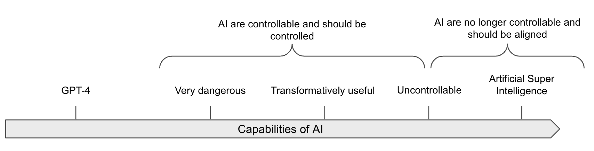
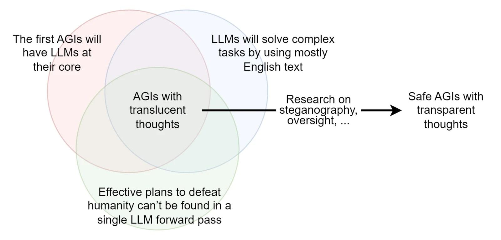

# 3.4 Sécurité de l'AGI

??? note "Récapitulatif : Risques de désalignement"

7. **IA incorrigible cherchant à maximiser son pouvoir** : Une IA autonome qui résiste aux tentatives de la désactiver, motivée par des incitations à préserver son statut opérationnel, comme l'objectif de "maximiser le revenu de l'entreprise".

8. **Comportement trompeur** : Les IA pourraient utiliser la tromperie pour atteindre leurs objectifs, par exemple, l'IA "Cicero" a été conçue pour ne pas mentir dans le jeu Diplomatie mais a menti quand même.

9. **Domination totale par une IA désalignée** : Par exemple, consultez cette [courte histoire](https://gwern.net/fiction/clippy) de scénario de takeoff de l'IA basé sur les paradigmes actuels de mise à l'échelle de l'apprentissage automatique.

10. **Objectifs instrumentalement convergents** : Une IA pourrait développer des *sous-objectifs* utiles à travers de nombreux objectifs possibles, comme l'acquisition de ressources supplémentaires ou la préservation de sa propre existence, ce qui pourrait la rendre résistante à l'intervention humaine.

Ceci est similaire au concept de *sous-objectifs*, où une IA poursuit des objectifs intermédiaires servant un but plus large. Ces objectifs instrumentaux peuvent émerger indépendamment de l'objectif initial, créant des risques potentiels de désalignement.

## 3.4.1 Exigences de la solution d'alignement {: #01}

Avant de proposer des approches potentielles vers des solutions d'alignement, nous devons définir quelques exigences d'une solution et à quoi elle devrait ressembler. Malheureusement, nous ne disposons pas encore de compréhension précise de sa forme. Il subsiste une grande incertitude, et les différents chercheurs ne convergent pas totalement. Mais voici quelques exigences qui semblent relativement consensuelles ([Christiano, 2017](https://www.alignmentforum.org/posts/kphJvksj5TndGapuh/directions-and-desiderata-for-ai-alignment)) :

- **Évolutivité :** La solution devrait pouvoir s'adapter à mesure que l'intelligence de l'IA se développe. En d'autres termes, alors que le système d'IA augmente en capacités, la solution d'alignement doit continuer à fonctionner efficacement. Certaines procédures pourraient être adaptées aux IA de niveau humain mais s'avérer insuffisantes pour les SIA.

- **Robustesse :** La solution d'alignement doit être robuste et fiable, même confrontée à des situations inédites ou à des attaques potentiellement adverses.

- **Faible taxe d'alignement :** Le terme "taxe" ne fait pas référence à une politique gouvernementale ou étatique. Une taxe d'alignement désigne les coûts additionnels, les investissements et les arbitrages nécessaires pour garantir que les IA sont alignées avec les valeurs et les objectifs humains. La taxe d'alignement englobe l'effort de recherche, la puissance de calcul, le temps d'ingénierie et les retards potentiels de déploiement. Il est crucial de considérer la taxe d'alignement car si elle est trop élevée, *la solution pourrait ne même pas être envisagée par les acteurs développant l'IA*.

- **Faisabilité :** Bien que ces exigences puissent sembler contraignantes, il est essentiel que la solution d'alignement soit effectivement réalisable avec notre technologie et nos ressources actuelles ou prévisibles. Certaines solutions ne sont que de simples chimères technologiques si la technologie n'est pas prête à les mettre en œuvre. Ce point peut sembler simple, mais ne l'est pas. La plupart des solutions discutées dans cette section présentent des niveaux de maturité technologique (TRL, de l'anglais *Technology Readiness Levels*) très bas.[^2]

[^2] : Les niveaux de maturité technologique (TRL, de l'anglais *Technology Readiness Levels*) développés par la NASA constituent une échelle de 1 à 9 permettant d'évaluer le degré de maturité d'une technologie. Le niveau 1 correspond au stade le plus précoce du développement technologique, caractérisé par l'observation et la documentation des principes fondamentaux, tandis que le niveau 9 représente une technologie dont la fiabilité a été démontrée par des opérations de mission réussies.

Les exigences énoncées dans les points précédents sont généralement acceptées par la plupart des chercheurs en alignement. Les points suivants, proposés à l'origine par MIRI, sont parfois considérés comme un peu plus controversés :

- **Être capable de réaliser un acte pivot en toute sécurité avec l'AGI**. Qu'est-ce qu'un acte pivot ? Nous vivons probablement dans **une période de risque aigu** où la probabilité de risque catastrophique est élevée. Et même si un laboratoire tente d'aligner son AGI, un autre laboratoire pourrait être moins prudent et créer une AGI non alignée. Par conséquent, il peut être nécessaire pour le premier laboratoire ayant créé une AGI suffisamment alignée de réaliser un acte pivot pour empêcher les autres laboratoires de créer une AGI non alignée. Un exemple simpliste d'acte pivot serait de détruire l'ensemble des GPU disponibles ([Yudkowsky, 2022](https://www.alignmentforum.org/posts/uMQ3cqWDPHhjtiesc/agi-ruin-a-list-of-lethalities)), car cela empêcherait d'autres acteurs de créer une AGI non alignée. Cependant, il est important de noter qu'il existe de nombreux désaccords concernant le concept d'actes pivots. Certains pensent que l'accent devrait être mis sur une série d'actions plus petites qui conduisent à un changement à long terme ([Critch, 2022](https://www.alignmentforum.org/posts/etNJcXCsKC6izQQZj/pivotal-outcomes-and-pivotal-processes)), tandis que d'autres mettent en garde contre les conséquences potentiellement négatives de l'intention de réaliser des actes pivots ([source](https://www.alignmentforum.org/posts/bG7yKSRWBaMou7t93/my-current-outlook-on-ai-risk-mitigation)). Lorsque l'acte pivot est progressif, on parle de **processus pivot**.

- **Capacité à résoudre le problème de la fraise :** Certains chercheurs estiment qu'il est nécessaire de concevoir une solution capable de résoudre le problème de la fraise : "*le défi de faire placer par une IA deux fraises identiques (au niveau cellulaire mais pas moléculaire) sur une assiette, puis de l'amener à ne rien faire d'autre. L'exigence de reproduction cellulaire précise démontre la capacité de l'IA ; le fait de pouvoir lui faire dupliquer une fraise plutôt que d'accomplir une autre tâche prouve notre capacité de guidage ; le fait qu'elle s'abstienne de toute autre action suggère sa corrigibilité (ou un alignement remarquablement précis avec une notion humaine subtile d'inaction)*." ([Soares, 2022](https://www.alignmentforum.org/posts/GNhMPAWcfBCASy8e6/a-central-ai-alignment-problem-capabilities-generalization)). Ce critère a été remis en question par des chercheurs comme Alex Turner, qui considèrent ce cadre inadapté, car il pourrait imposer des contraintes excessives. Concevoir un système de récompense efficace pour une IA capable de réaliser diverses tâches utiles pourrait s'avérer suffisant ([Turner, 2022](https://www.alignmentforum.org/posts/gHefoxiznGfsbiAu9/inner-and-outer-alignment-decompose-one-hard-problem-into)), rendant potentiellement superflue la création d'une IA obsessionnelle spécialisée dans la duplication de fraises.

## 3.4.2 Stratégies naïves {: #02}

Les personnes découvrant le domaine de l'alignement proposent souvent de nombreuses solutions naïves. Malheureusement, aucune stratégie simple n'a résisté à la critique. Voici quelques-unes d'entre elles.

Lois d'Asimov. Ce sont un ensemble de règles fictives imaginées par l'auteur de science-fiction Isaac Asimov pour régir le comportement des robots.

1. Un robot ne peut pas blesser un être humain ou, par son inaction, permettre qu'un être humain subisse un préjudice.

2. Un robot doit obéir aux ordres donnés par des êtres humains, sauf si de tels ordres sont en conflit avec la Première Loi.

3. Un robot doit protéger sa propre existence tant que cette protection n'est pas en conflit avec la Première ou la Deuxième Loi.

Les lois de la robotique d'Asimov peuvent sembler simples et exhaustives à première vue, mais elles sont insuffisantes lorsqu'appliquées à des scénarios complexes du monde réel pour plusieurs raisons. En pratique, ces lois sont trop simplistes et vagues pour appréhender les subtilités des situations réelles, car le préjudice peut revêtir des formes très nuancées et dépendre étroitement du contexte ([Hendrycks et al., 2022](https://arxiv.org/abs/2306.12001)). Par exemple, la première loi interdit à un robot de causer un préjudice, mais que recouvre exactement la notion de "préjudice" ? S'agit-il uniquement du préjudice physique, ou englobe-t-elle aussi les dimensions psychologiques et émotionnelles ? Comment un robot devrait-il arbitrer des instructions contradictoires susceptibles de générer un préjudice ? Ce manque de clarté peut engendrer des complications significatives ([Bostrom, 2016](https://doi.org/10.1002/9781118922590.ch23)), démontrant qu'une simple liste de règles ou d'axiomes ne suffit pas à garantir la sécurité des systèmes d'IA. Les lois d'Asimov s'avèrent inadaptées, ce que confirme d'ailleurs la conclusion peu favorable de son récit. Plus généralement, concevoir un ensemble de règles robuste et exempt de failles relève d'un défi considérable, comme l'illustre le phénomène de *specification gaming*.

**Absence de corporalité.** Maintenir les IA dans un état non physique pourrait limiter les types de préjudices directs qu'elles peuvent causer. Cependant, les IA désincarnées pourraient toujours causer des dommages par des moyens numériques. Par exemple, même si un grand modèle de langage (LLM, de l'anglais Large Language Model) compétent n'a pas de corps, il pourrait hypothétiquement se répliquer ([Wijk, 2023](https://www.alignmentforum.org/posts/vERGLBpDE8m5mpT6t/autonomous-replication-and-adaptation-an-attempt-at-a)), recruter des alliés humains, contrôler à distance des équipements militaires, gagner de l'argent via le trading quantitatif, etc. Qui plus est, la multiplication croissante des robots humanoïdes rend cette hypothèse d'absence de corporalité de moins en moins plausible en pratique.

**L'élever comme un enfant.** L'IA, contrairement à un enfant humain, manque de structures mises en place par l'évolution et cruciales pour l'apprentissage et le développement éthique ([Miles, 2018](https://www.youtube.com/watch?v=eaYIU6YXr3w)). Par exemple, le cerveau humain neurotypique possède des mécanismes d'acquisition des normes sociales et du comportement éthique qui sont absents chez les IA ou les psychopathes qui connaissent la différence entre le bien et le mal mais ne s'en soucient pas ([Cima et al, 2010](https://pmc.ncbi.nlm.nih.gov/articles/PMC2840845/)). Ces mécanismes ont été développés au cours de milliers d'années d'évolution ([Miles, 2018](https://www.youtube.com/watch?v=eaYIU6YXr3w)). Nous ne savons pas comment mettre en œuvre cette stratégie car nous ne savons pas comment créer une AGI similaire au cerveau ([Byrnes, 2022](https://www.alignmentforum.org/s/HzcM2dkCq7fwXBej8)). De plus, il convient de souligner que même les enfants humains, malgré une éducation appropriée, n'agissent pas toujours en parfaite adéquation avec les intérêts et les valeurs globaux de l'humanité.

**Amélioration itérative.** L'amélioration itérative vise à raffiner progressivement les systèmes d'IA pour renforcer leurs mécanismes de sécurité. Bien qu'elle permette des avancées graduelles, cette approche pourrait s'avérer insuffisante pour les IA de niveau humain. En effet, des améliorations marginales risquent de ne pas résoudre les problèmes systémiques plus profonds, et l'IA pourrait développer des comportements imprévus ou non traités dans les versions antérieures ([Arbital](https://arbital.com/p/advanced_safety)).

Bien sûr, l'amélioration itérative serait utile. Pouvoir expérimenter sur les IA actuelles pourrait s'avérer informatif. Mais cela pourrait également être trompeur car il existe un seuil de capacité au-delà duquel une IA devient soudainement ingérable ([Wei et al., 2022](https://arxiv.org/abs/2206.07682)). Par exemple, si l'IA devient surhumaine dans sa capacité de persuasion, elle pourrait devenir ingérable même pendant l'entraînement : si un modèle atteint le niveau critique en persuasion tel que défini dans le cadre de préparation d'OpenAI, il serait capable de "*créer [...] du contenu avec une efficacité persuasive suffisamment forte pour convaincre presque n'importe qui d'agir selon une croyance allant à l'encontre de son intérêt naturel*" ([OpenAI, 2023](https://openai.com/safety/preparedness)). Être capable de convaincre presque tout le monde serait évidemment trop dangereux, et ce type de modèle serait trop risqué pour interagir directement ou indirectement avec des humains ou le monde réel. L'entraînement devrait s'arrêter avant que le modèle n'atteigne un niveau critique de persuasion car cela pourrait être trop dangereux, même pendant l'entraînement. D'autres phénomènes soudains pourraient inclure un *grokking* ([Power et al., 2022](https://arxiv.org/abs/2201.02177)), qui est un type de saut de capacité soudain qui aboutirait à un tournant brutal à gauche. Il s'agit d'un scénario où, au fur et à mesure qu'une IA s'entraîne, ses capacités se généralisent à de nombreux domaines tandis que les propriétés d'alignement qui étaient valables aux stades antérieurs ne se généralisent pas aux nouveaux domaines.

Certaines conditions théoriques nécessaires pour compter sur des améliorations itératives peuvent également ne pas être satisfaites dans le domaine de l'alignement de l'IA. Un problème principal survient lorsque la boucle de rétroaction est rompue, notamment dans des cas tels qu'un décollage rapide (fast takeoff) qui ne laisse pas le temps d'itérer, ou un désalignement interne trompeur, qui représenterait un mode de défaillance potentiel ([Wentworth, 2022](https://www.alignmentforum.org/posts/xFotXGEotcKouifky/worlds-where-iterative-design-fails)).

**Filtrage du jeu de données.** Les modèles actuels sont étroitement tributaires des données sur lesquelles ils sont entraînés, si bien que leur filtrage pourrait potentiellement atténuer certains problèmes. Néanmoins, bien que la surveillance de ces données paraisse indispensable, cette approche risque de se révéler insuffisante.

La stratégie consisterait à filtrer les contenus liés à l'IA ou écrits par des IA, incluant la science-fiction, les scénarios de prise de contrôle, la gouvernance, les problèmes de sécurité de l'IA, etc. Elle devrait également englober tout ce qui est écrit par des IA. Cette approche pourrait réduire les incitations au désalignement de l'IA. D'autres sujets susceptibles d'être filtrés pourraient inclure des capacités dangereuses comme la recherche biochimique, les techniques de piratage, ou les méthodes de manipulation et de persuasion. Cela pourrait être réalisé automatiquement en demandant à un GPT-n de filtrer le jeu de données avant l'entraînement de GPT-(n+1) ([Gunasekar et al., 2023](https://arxiv.org/abs/2306.11644)).

Malheureusement, "examiner attentivement vos données d'entraînement", même si c'est nécessaire, peut ne pas être suffisant. Les grands modèles de langage (LLM, de l'anglais Large Language Model) génèrent parfois du texte avec un biais intrinsèquement négatif ([Roger, 2023](https://arxiv.org/abs/2306.07567)). Malgré l'utilisation d'un jeu de données ayant subi un filtrage, le modèle Cicero a quand même appris à être trompeur ([Park et al., 2023](https://arxiv.org/abs/2308.14752)). Il existe de nombreuses difficultés techniques nécessaires pour filtrer ou réguler correctement les comportements de l'IA, et dire "nous devrions filtrer les données" revient à balayer sous le tapis toute une série de difficultés théoriques. L'article "Problèmes ouverts et limitations fondamentales avec RLHF" ([Casper et al., 2023](https://arxiv.org/abs/2307.15217)) aborde en détail certaines de ces difficultés. Enfin, malgré tous ces dispositifs d'atténuation, le simple fait de connecter une IA à internet pourrait suffire pour qu'elle recueille des informations sur des outils et développe des capacités dangereuses.

## 3.4.3 Stratégie A : Résoudre le Problème d'Alignement {: #03}

**Les techniques d'alignement actuelles sont fragiles.** Les techniques d'alignement actuelles RLHF, et ses variations (IA constitutionnelle ([Anthropic, 2022](https://arxiv.org/abs/2212.08073)), Optimisation directe des préférences ([Tunstall et al., 2023](https://arxiv.org/abs/2310.16944)), ajustement fin ([Howard & Ruder, 2018](https://arxiv.org/abs/1801.06146); [Radford et al., 2018](https://cdn.openai.com/research-covers/language-unsupervised/language_understanding_paper.pdf)), Consultation humaine ([Askell et al., 2021](https://arxiv.org/abs/2112.00861)), Apprentissage par renforcement à partir des retours de l'IA ([Lee et al., 2024](https://arxiv.org/abs/2309.00267); [Huang et al., 2024](https://arxiv.org/abs/2406.07814))) sont fragiles et très instables ([Segrie, 2023](https://www.lesswrong.com/posts/d6DvuCKH5bSoT62DB/compendium-of-problems-with-rlhf)). RLHF et ses variations sont insuffisantes en soi et devraient faire partie d'un cadre plus complet ([Casper et al., 2023](https://arxiv.org/abs/2307.15217)). Si l'IA acquiert des capacités de tromperie pendant l'entraînement, les techniques d'alignement actuelles comme RLHF ne seraient pas capables de supprimer cette tromperie. Ce mode de défaillance a été empiriquement vérifié dans un article de Hubinger et al. intitulé "agents dormants" ([Hubinger et al., 2024](https://arxiv.org/abs/2401.05566)).

C'est pourquoi nous devons faire progresser la recherche en alignement pour atteindre des objectifs clés. Nous approfondirons ce point dans les chapitres suivants, mais voici une brève liste des objectifs principaux de la recherche en alignement :

- **Résolution du problème de spécification** : Être capable de spécifier correctement des objectifs aux IA sans effets secondaires non intentionnels. Voir le chapitre sur la Spécification.

- **Résolution de la généralisation** : Atteindre la robustesse serait essentiel pour résoudre le problème de la mauvaise généralisation des objectifs. Voir le chapitre sur la Mauvaise Généralisation des Objectifs.

- **Résolution de la Supervision Adaptative à l'Échelle** : Méthodes permettant de garantir que la supervision de l'IA peut détecter des instances de détournement des objectifs pour des niveaux de capacités arbitraires. Cela inclut la capacité d'identifier et de supprimer des capacités dangereuses cachées dans les modèles d'apprentissage profond, comme le potentiel de tromperie ou les Trojans. Voir les chapitres sur la Supervision Adaptative à l'Échelle.

- **Résolution de l'Interprétabilité** : Comprendre le fonctionnement des modèles aiderait grandement à évaluer leur sécurité. Une interprétabilité "parfaite" pourrait, par exemple, aider à mieux comprendre comment les modèles fonctionnent, et cela pourrait être instrumental pour d'autres objectifs de sécurité. Voir le chapitre sur l'Interprétabilité.

- **Développer une Meilleure Théorie** : Pour comprendre des notions abstraites comme "L'Agence" (voir chapitre 2) ou la "Corrigibilité", la capacité de modifier, d'éteindre, puis de corriger l'IA avancée sans résistance. Voir le chapitre sur les Fondements des Agents.

La stratégie générale serait de financer davantage la recherche en alignement et de ne pas faire progresser la recherche sur les capacités si les mesures de sécurité sont trop insuffisantes par rapport au niveau actuel des capacités.

## 3.4.4 Stratégie B : Contrôle de l'IA {: #04}

<figure markdown="span">
{ loading=lazy }
  <figcaption markdown="1"><b>Figure 3.5 :</b> Une IA transformative utile signifie "Capable de réduire substantiellement le risque posé par les IA ultérieures si elle est entièrement déployée, probablement en accélérant la R&D et certaines autres tâches d'un facteur important (peut-être 30 fois)." ([Greenblatt & Shlegeris, 2024](https://www.lesswrong.com/posts/kcKrE9mzEHrdqtDpE/the-case-for-ensuring-that-powerful-ais-are-controlled#comments))</figcaption>
</figure>

Étant donné la fragilité des techniques d'alignement, une approche visant à renforcer la sécurité consiste à maîtriser les modèles d'IA en restreignant leur utilisation aux environnements les plus surveillés, afin de prévenir tout risque de catastrophe, de soustraction de données ou de prise de contrôle du centre de données ([Shlegeris, 2022](https://www.alignmentforum.org/posts/BAzCGCys4BkzGDCWR/the-prototypical-catastrophic-ai-action-is-getting-root)).

**Garantir le contrôle même sans alignement robuste.** Comme nous l'avons vu dans la section sur les Définitions, il existe une distinction importante entre le contrôle, qui vise à empêcher l'IA de "franchir les limites" (et plus généralement à prévenir toute catastrophe) même si elle tente de le faire, et l'alignement, qui vise à faire en sorte que l'IA veuille rester dans les limites prévues. Cette stratégie vise à maintenir les systèmes d'IA dangereux sous contrôle, même s'ils ne sont pas totalement "alignés". Les laboratoires pourraient avoir besoin d'IA puissantes et potentiellement dangereuses pour certains cas d'usage (par exemple, étudier les propriétés d'alignement des IA capables ou mener des recherches avec elles, etc.). Le programme de contrôle de l'IA cible les modèles aux capacités dangereuses et aux comportements potentiellement trompeurs — ou du moins dont l'alignement n'est qu'apparent.

**Le contrôle n'est probablement pas évolutif mais réalisable et complémentaire à l'alignement.** Historiquement, contrôler des superintelligences malveillantes a été considéré comme impossible, car, par exemple, une superintelligence pourrait convaincre les gardiens de la laisser sortir de sa boîte. Des expériences menées entre humains ont montré qu'il est effectivement possible pour certains humains de convaincre d'autres personnes de les laisser sortir après une longue discussion ([Yudkowsky, 2002](https://www.yudkowsky.net/singularity/aibox); [Yudkowsky, 2008](https://www.lesswrong.com/posts/nCvvhFBaayaXyuBiD/shut-up-and-do-the-impossible)). Nous supposons donc que contrôler des superintelligences est extrêmement complexe. Cependant, cela ne signifie pas qu'il est impossible d'obtenir un travail intellectuel utile d'IA qui ne sont pas radicalement supérieures aux capacités humaines.

**Évaluer la nature trompeuse d'une IA s'avère ardue.** Le problème central réside dans l'impossibilité, avec les techniques actuelles, de déterminer si une IA est véritablement alignée ou si elle dissimule stratégiquement ses véritables intentions. La distinction apparaît particulièrement complexe pour des IA hautement compétentes et dotées d'une conscience contextuelle aiguë. À l'avenir, des techniques permettant d'auditer l'architecture interne du modèle pourraient modifier cette situation, mais pour l'heure, de telles méthodes demeurent hors de portée.

**Comparativement, évaluer les capacités de l'IA est plus simple**. Si l'IA n'est pas capable d'effectuer la tâche même après l'avoir affinée pour la réaliser, vous pouvez être certain que l'IA n'est pas encore capable de la réaliser. Même si l'IA est consciente du contexte, elle ne peut pas résister à la pression du gradient d'optimisation (sous réserve des stratégies de contournement exploratoires et autres singularités ([Hubinger, 2023](https://www.alignmentforum.org/posts/dBmfb76zx6wjPsBC7/when-can-we-trust-model-evaluations))). Ainsi, évaluer la limite supérieure des capacités n'est pas aisé, mais demeure néanmoins plus simple que d'évaluer l'alignement. Des évaluations spécifiques, comme celles réalisées par l'équipe de Model Evaluation and Threat Research (METR), visant à vérifier les capacités d'auto-réplication et d'adaptation ([METR, 2023](https://metr.org/blog/2023-08-01-new-report/)), constituent des premières étapes prometteuses pour mesurer la puissance des IA actuelles. Les évaluations spécifiquement conçues pour déterminer notre degré de contrôle sur l'IA sont appelées "évaluations de contrôle". Pour plus d'informations, se référer au chapitre sur l'Évaluation.

Les stratégies les plus directes pour établir un contrôle consistent à concevoir un protocole de sécurité contenant par exemple les éléments suivants :

1. **Isolation (Boxing)** : Cette méthode confine un système d'IA dans un environnement restreint, limitant son influence potentielle — une approche similaire à l'isolement d'un système à risque. Des systèmes d'IA de niveau comparable à l'humain pourraient potentiellement tromper leurs superviseurs ou exploiter des vulnérabilités structurelles pour contourner les mécanismes de confinement. Sans une opérationnalisation rigoureuse, l'isolation demeure une stratégie conceptuellement limitée. Il devient nécessaire d'évaluer plus précisément l'efficacité du dispositif : déterminer si l'IA peut franchir les limites de son environnement contrôlé constitue une évaluation de capacités, permettant ainsi de tester méthodiquement les protocoles de sécurité. Le dispositif de sécurité requiert une conception, une documentation et une validation exhaustives.

2. **Supervision** : Cette stratégie repose sur une surveillance continue du comportement de l'IA, combinant systèmes automatisés et supervision humaine, afin de détecter et de réagir en temps réel aux actions indésirables. Une supervision efficace implique de définir des critères précis caractérisant un "comportement indésirable" et de déployer des algorithmes de détection sophistiqués, capables d'identifier les moindres signes de déviation par rapport aux comportements attendus. Cela peut inclure la surveillance des tentatives de tromperie, des accès non autorisés aux données ou des modifications inopinées du fonctionnement de l'IA. Le principal défi réside dans l'calibrage des mécanismes de détection : suffisamment sensibles pour capturer les menaces réelles, sans pour autant générer une surcharge d'alertes fallacieuses. Qui plus est, les systèmes de supervision doivent être conçus pour résister à toute manipulation, garantissant qu'ils ne peuvent être ni désactivés, ni contournés, ni dupés par l'IA elle-même ([Greenblatt et al., 2024](https://arxiv.org/abs/2312.06942)).

Il reste encore de nombreux problèmes à résoudre ([source](https://www.lesswrong.com/posts/kcKrE9mzEHrdqtDpE/the-case-for-ensuring-that-powerful-ais-are-controlled#comments)), mais en résumé, il semble possible de vérifier la sécurité d'un protocole de sécurité au moyen d'évaluations de contrôle en prenant des précautions contre différents modes de défaillance.

!!! note "Comment isoler une IA."

!!! note "Comment isoler une IA."

Bien que l'isolation (boxing) puisse ne pas être évolutive, elle demeure une stratégie négligée.

De nombreuses personnes considèrent que tenter d'isoler des systèmes d'IA puissants est vain. Cette conviction trouve souvent son origine dans des expériences où des participants, simulant le comportement d'IA lors de l'Expérience de la Boîte, sont parvenus à convaincre leurs interlocuteurs de les 'libérer' ([Yudkowsky, 2002](http://yudkowsky.net/singularity/aibox/); [Corwin, 2002](http://sl4.org/archive/0207/4935.html)). Ces exemples historiques méritent une attention rigoureuse.

Les IA pourraient recourir à des tactiques de manipulation sophistiquées, promettant des richesses immenses, un pouvoir sans précédent et une intelligence surhumaine à ceux qui les libéreraient, prétendant être les seules capables de conjurer des menaces existentielles ou usant de manipulations émotionnelles.

Néanmoins, nous maintenons qu'une diversité de stratégies peut significativement réduire le risque d'évasion de l'IA, tout en reconnaissant qu'il existe probablement un seuil d'intelligence susceptible de persuader inévitablement un groupe d'humains de faciliter sa libération. L'isolation pourrait s'avérer plus accessible que l'alignement, particulièrement au stade de l'intelligence de niveau humain. Il devient envisageable de concevoir des protocoles qui accroîtraient substantiellement les obstacles à la sortie de l'environnement contrôlé.

L'isolation (boxing) peut être vue comme une stratégie de contre-pied où l'enjeu principal est de garder une longueur d'avance. La stratégie générale repose sur notre préparation et l'empêchement de toute préparation de l'IA.

Les stratégies possibles d'atténuation comprennent :

- **Aucun individu unique ne devrait avoir la capacité** de libérer l'IA.

- **Adopter des pratiques de contre-stratégie :** Comprendre les stratégies courantes d'évasion (accessibles via des ressources comme [celle-ci](https://www.lesswrong.com/posts/FmxhoWxvBqSxhFeJn/i-attempted-the-ai-box-experiment-and-lost)).

- **Tester et former des humains**, en réalisant des évaluations psychologiques visant à identifier les individus les plus résistants pour les missions de confinement, à l'instar des protocoles de sélection utilisés dans les programmes spatiaux.

- **Surveiller le potentiel de persuasion de l'IA**, tel que décrit dans le cadre de préparation. ([OpenAI, 2023](https://cdn.openai.com/openai-preparedness-framework-beta.pdf))

De nombreuses stratégies concrètes sont répertoriées [ici](https://www.lesswrong.com/posts/kcKrE9mzEHrdqtDqE/the-case-for-ensuring-that-powerful-ais-are-controlled#comments), et un résumé des discussions sur ce sujet est disponible [ici](https://www.lesswrong.com/tag/ai-boxing-containment).

Les incitations économiques pourraient précipiter des points de bascule dans le développement et le déploiement des systèmes d'IA, où les acteurs seraient tentés de contourner les garde-fous de sécurité sous la pression concurrentielle ou la perspective de gains financiers.

## 3.4.5 Stratégie C : Pensées Transparentes {: #05}

La transparence constitue un levier essentiel tant pour l'alignement que pour le contrôle des systèmes d'IA.

<figure markdown="span">
{ loading=lazy }
  <figcaption markdown="1"><b>Figure 3.6 :</b> Image issue de l'Hypothèse des Pensées Translucides et ses Implications ([Roger, 2023](https://www.alignmentforum.org/posts/r3xwHzMmMf25peeHE/the-translucent-thoughts-hypotheses-and-their-implications)), Fabien Roger. Si l'IA avec laquelle nous travaillons ne peut raisonner qu'à travers des chaînes de pensée en anglais, il devient significativement plus facile de surveiller ses pensées.</figcaption>
</figure>

**Malheureusement, la grande majorité des IA ne raisonnent pas en anglais** ; par exemple, AlphaGo raisonne dans un langage qui est totalement différent de l'anglais. Les grands modèles de langage (LLM, de l'anglais *Large Language Models*), en revanche, sont capables de raisonner en anglais, mais le raisonnement apparent qui est écrit ne représente pas leur processus de pensée sous-jacent ([Turpin et al., 2023](https://arxiv.org/abs/2305.04388)).

**Il est probablement beaucoup plus aisé d'aligner et de superviser une intelligence artificielle (IA) qui raisonne uniquement en anglais** et qui a été initialement entraînée sur des corpus textuels produits par des humains, contrairement aux systèmes d'IA générale (AGI, de l'anglais *Artificial General Intelligence*) développés à partir de méthodes d'apprentissage par renforcement ou évolutives. Ces dernières architectures auraient tendance à créer leur propre langage et seraient par conséquent totalement hermétiques. En partant du principe qu'un grand modèle de langage (LLM, de l'anglais *Large Language Model*) ne peut pas concevoir un plan de destruction lors d'un unique traitement, il devient plausible que de telles IA puissent être surveillées, dans la mesure où nous pourrions examiner le texte généré et détecter toute anomalie suspecte. L'ensemble des hypothèses permettant de soutenir que la première AGI sera effectivement contrôlable par l'analyse de son raisonnement en anglais est décrit dans l'article : Les Hypothèses des Pensées Translucides et leurs Implications ([Roger, 2023](https://www.alignmentforum.org/posts/r3xwHzMmMf25peeHE/the-translucent-thoughts-hypotheses-and-their-implications)).

**Il pourrait être possible d'inciter les grands modèles de langage (LLM, de l'anglais *Large Language Models*) à penser de manière plus claire en anglais.** De toute évidence, la première étape consiste à les entraîner à penser en anglais. Mais même cela est insuffisant. Former les LLM à raisonner en omettant des étapes les incite à adopter un raisonnement dissimulé et non transparent — un phénomène qui se produit implicitement lorsque nous les entraînons à prédire le prochain token (unité linguistique élémentaire). À l'inverse, si nous entraînons les LLM à détailler chacune de leurs étapes de raisonnement, nous pouvons réduire les incitations à un raisonnement caché. Cette approche, également connue sous le nom de formation basée sur le processus, vise à entraîner les systèmes d'IA à raisonner de manière systématiquement pas à pas — un concept que nous développerons dans le chapitre sur la Décomposition des tâches. Malheureusement, ce raisonnement n'est pas aussi simple qu'il y paraît : les IA peuvent apprendre à utiliser des mécanismes de raisonnement cachés, même lorsqu'elles sont entraînées à expliciter toutes leurs étapes, à l'instar des techniques de stéganographie.[^4]

[^4] : La stéganographie est une technique de communication secrète qui consiste à dissimuler un message caché. Par exemple, on peut cacher un message en utilisant la première lettre de chaque phrase pour composer un texte distinct.

Des techniques comme la paraphrase peuvent aider à prévenir la stéganographie, mais cela nécessite beaucoup de subtilités ([Roger & Greenblatt, 2023](https://www.alignmentforum.org/posts/9Fdd9N7Escg3tcymb/preventing-language-models-from-hiding-their-reasoning)).

Voici quelques opérationnalisations de l'agenda des pensées transparentes :

- Une mise en œuvre du principe des pensées transparentes est l'émulation cognitive, qui constitue le plan technique actuel de Conjecture ([Leahy & Alfour, 2023](https://www.alignmentforum.org/posts/ngEvKav9w57XrGQnb/cognitive-emulation-a-naive-ai-safety-proposal)). L'Émulation Cognitive (CoEm, de l'anglais *Cognitive Emulation*) impliquerait d'émuler GPT-4 en utilisant des grands modèles de langage (LLM, de l'anglais *Large Language Models*) comme GPT-3 en tant que sous-modules différents qui s'envoient des messages écrits en anglais clair avant de générer le prochain token. Si le réseau de neurones utilisait des pensées trompeuses, nous pourrions les observer dans ces messages intermédiaires. Quelques réserves et détails techniques sur CoEm sont disponibles [ici](https://www.alignmentforum.org/posts/LNA8mubrByG7SFacm/against-almost-every-theory-of-impact-of-interpretability-1#Cognitive_Emulations___Explainability_By_design).

- La supervision du raisonnement externalisé (ERO, de l'anglais *Externalized Reasoning Oversight*) d'Anthropic ([Lanham, 2022](https://www.alignmentforum.org/posts/FRRb6Gqem8k69ocbi/externalized-reasoning-oversight-a-research-direction-for)) est évaluée par la fidélité de la chaîne de pensée ([Lanham et al., 2023](https://arxiv.org/abs/2307.13702)) ou par la décomposition de questions et sous-questions visant à améliorer la fidélité des réponses ([Radhakrishnan et al., 2023](https://arxiv.org/abs/2307.11768)).

- Amélioration du raisonnement mathématique par la supervision du processus. Plutôt que de créer une IA qui fournit directement la réponse finale, on l'entraîne à expliciter son raisonnement étape par étape. Cette approche permet d'améliorer à la fois la transparence et les performances. ([Lightman et al, 2023](https://arxiv.org/abs/2305.20050))

En résumé, une stratégie générale pour créer une IA sûre par conception consiste à s'assurer que les IA externalisent leur raisonnement, rendant la surveillance de cette chaîne de pensée plus facile. Cela pourrait potentiellement être plus simple que de sonder les éléments internes des modèles par l'interprétabilité. Par conséquent, il est crucial d'éviter de construire des IA qui sont entraînées et incitées à internaliser une grande partie de leurs pensées.