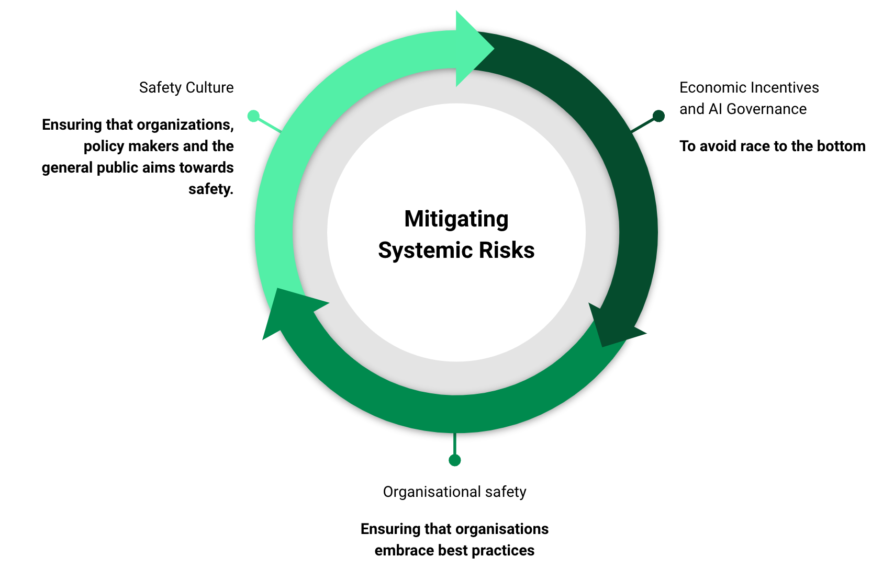
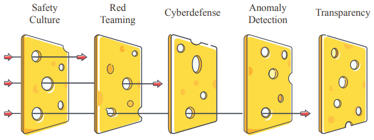
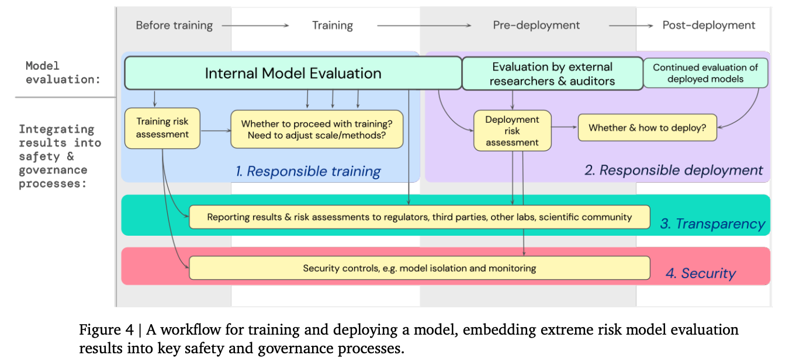

# 3.6 Sécurité systémique

??? note "Résumé : Risques liés aux défaillances systémiques"

- **Biais exacerbés** : Les IA peuvent involontairement propager ou amplifier des biais préexistants.

- **Verrouillage des valeurs** : Par exemple, des dictateurs totalitaires stables utilisant l'IA pour maintenir leur pouvoir.

- **Préoccupations de santé mentale** : Par exemple, un chômage à grande échelle dû à l'automatisation pourrait entraîner des problèmes de santé mentale.

- **Alignement sociétal** : L'IA pourrait intensifier les problèmes de changement climatique et accélérer l'épuisement des ressources essentielles en provoquant une croissance économique rapide.

- **Perte d'autonomie** : Les systèmes d'IA pourraient réduire la capacité de choix individuels et l'autonomie personnelle, dans la mesure où les décisions sont de plus en plus dictées ou influencées par des processus automatisés.

Les défis systémiques émergent des interactions plus larges entre l'IA et les systèmes humains, au-delà des comportements des agents d'IA individuels. Ces interactions peuvent créer des risques complexes et émergents difficiles à prédire ou à contrôler.

Points clés à considérer :

1. **Incitations économiques** : Les structures économiques et la dynamique de marché peuvent créer involontairement des incitations perverses qui poussent les systèmes d'IA vers des résultats indésirables.

2. **Points de bascule** : De petits changements dans les systèmes d'IA ou leur déploiement pourraient conduire à des bouleversements soudains et dramatiques dans les paysages sociétaux ou technologiques.

Il n'existe pas de solutions simples à ces risques systémiques, mais voici quelques pistes de réflexion.

**Biais exacerbés :** Il existe déjà un vaste corpus de littérature sur la réduction des biais ([Pagano et al., 2022](https://arxiv.org/abs/2202.08176)). Malheureusement, de nombreux développeurs et chercheurs en apprentissage automatique écartent ces problématiques. La première étape, qui n'est pas simple, consiste à reconnaître ces enjeux. Les développeurs doivent être conscients que les biais peuvent émerger à plusieurs étapes du processus de développement de l'IA, depuis la collecte des données jusqu'à l'entraînement et le déploiement du modèle. L'atténuation de ces biais n'est pas impossible, et des pratiques recommandées existent. Les techniques principales comprennent le prétraitement et le filtrage des données, la diversification des jeux de données, et l'optimisation fine des instructions. Ces techniques sont subtiles et loin d'être parfaites, mais elles constituent néanmoins des bases solides.

**Verrouillage des valeurs :** L'un des risques les plus préoccupants posés par l'IA est le potentiel pour des dictateurs totalitaires stables d'utiliser la technologie pour maintenir leur pouvoir. Atténuer ce risque n'est pas une tâche simple. D'une certaine manière, nous vivons déjà dans une sorte de verrouillage des valeurs, par exemple le capitalisme ou l'exploitation animale. Une solution pourrait être d'éviter la concentration des capacités d'IA avancées entre les mains de quelques acteurs puissants. Nous devrions plutôt travailler à construire un avenir où l'IA est développée de manière ouverte et ses bénéfices sont largement distribués grâce à l'aide d'une organisation internationale. Cela pourrait aider à prévenir le verrouillage autoritaire. Un autre aspect important est de préserver l'autonomie humaine en maintenant la capacité pour les humains de guider de manière significative la trajectoire future des systèmes d'IA plutôt que de céder tout contrôle à des processus d'optimisation automatisés. Mais c'est plus facile à dire qu'à réaliser.

**Gérer les préoccupations de santé mentale :** Le développement et le déploiement rapides des systèmes d'IA pourraient affecter significativement la santé mentale. Alors que l'IA devient plus capable et omniprésente, elle risque de bouleverser de nombreux secteurs professionnels, engendrant chômage, stress financier et sentiment de désœuvrement. Bien que le lien entre l'automatisation, la perte d'emploi et la santé mentale puisse paraître indirect et en dehors du champ traditionnel du développement de l'IA, il demeure essentiel d'en évaluer les impacts potentiels, car ils pourraient concerner presque chacun d'entre nous. 

Prenons l'exemple d'un étudiant dont la discipline artistique, fruit de longues années de formation, se trouve soudainement automatisée : sa santé mentale pourrait s'en trouver durablement affectée. Des études scientifiques ont démontré que le chômage génère des conséquences négatives sur la santé mentale, et ce bien au-delà de la période initiale de perte d'emploi ([Gallo et al., 2006](https://pubmed.ncbi.nlm.nih.gov/16855043/)). 

Pour atténuer ces risques, il est crucial de prioriser le soutien psychologique et les ressources en santé mentale en parallèle du développement de l'IA. Les stratégies envisageables incluent :
- Investir dans des programmes de formation et de reconversion professionnelle
- Financer des recherches sur les impacts psychologiques de l'IA
- Développer des interventions ciblées et préventives

Il est également primordial de rendre accessible la riche littérature scientifique existante sur la santé mentale.

De plus, l'utilisation de l'IA dans les médias sociaux et autres plateformes en ligne peut exacerber des problèmes tels que la dépendance, l'anxiété et la dépression. Un rapport d'une lanceuse d'alerte en 2021 a révélé que les études internes de l'entreprise démontraient qu'Instagram nuisait gravement à la santé mentale des adolescentes, aggravant les troubles de l'image corporelle et les pensées suicidaires. Malgré cette prise de conscience, l'entreprise aurait privilégié les profits au détriment des mesures correctives. La première étape pour résoudre ces problèmes consisterait à reconnaître explicitement l'enjeu et à s'engager résolument dans la recherche de solutions, quitte à sacrifier une partie des bénéfices.

**Alignement sociétal :** Pour répondre au désalignement potentiel entre les systèmes d'IA et les valeurs sociétales, et prévenir les dérives du capitalisme conduisant à la création de systèmes épuisant toutes les ressources et aggravant le changement climatique ([Critch, 2021](https://www.alignmentforum.org/posts/LpM3EAakwYdS6aRKf/what-multipolar-failure-looks-like-and-robust-agent-agnostic)), une solution partielle pourrait consister à internaliser les externalités négatives, par exemple en instaurant une taxe carbone. Comme souvent, la théorie est plus simple que la pratique. C'est pourquoi il est crucial de favoriser une collaboration multidisciplinaire entre développeurs d'IA, économistes et experts de divers domaines. Mais in fine, notre société doit débattre de l'ampleur de l'automatisation souhaitée : ce sont là des choix éminemment politiques et sociétaux, qui dépassent largement les seules difficultés techniques de l'IA.

**[Désempowerment] et affaiblissement :** Alors que les systèmes d'IA deviennent plus avancés et s'intègrent profondément à nos vies, nous devons impérativement veiller à ce que les humains conservent leur autonomie et leur capacité d'action. Bien que des outils comme GPT-4 puissent offrir des avantages immédiats, la prochaine génération de ces systèmes soulève des inquiétudes profondes quant à un potentiel affaiblissement de l'autonomie humaine à long terme. Pour contrer ce risque, nous devons travailler activement à développer des systèmes d'IA qui amplifient et soutiennent les capacités humaines plutôt que de les remplacer intégralement. 

Il est devenu crucial d'engager un débat de société sur les limites que nous nous fixons collectivement : jusqu'où sommes-nous prêts à aller dans l'automatisation ? Quelles frontières ne devons-nous pas franchir ? C'est notre responsabilité collective de définir le degré d'automatisation que nous souhaitons et les contours d'une société où la technologie reste un outil au service de l'humain.

En résumé, faire face aux risques systémiques posés par l'IA n'est pas aisé. Cela requiert une collaboration multidisciplinaire continue et la résolution de défis de coordination particulièrement complexes. La dispersion des responsabilités rend la mise en œuvre des solutions particulièrement ardue. Reconnaître l'existence de ces problèmes constitue probablement l'étape la plus cruciale pour la plupart des enjeux soulevés.

<figure markdown="span">
{ loading=lazy }
  <figcaption markdown="1"><b>Figure 3.7 :</b> Une illustration d'un cadre que nous pensons être robustement bon pour gérer les risques.</figcaption>
</figure>

Les risques liés à l'IA sont trop nombreux et trop hétérogènes. Pour faire face à ces risques, nous avons besoin d'un cadre adaptatif qui puisse être robuste et évoluer avec les progrès de l'IA.

## 3.6.1 Stratégie A : Gouvernance de l'IA {: #01}

La progression de l'IA, comparable à la course aux armements nucléaires de la Guerre froide, met en lumière un compromis délicat. D'un côté, la sécurité ; de l'autre, l'avantage concurrentiel que nations et entreprises recherchent pour asseoir leur pouvoir et leur influence. Cette dynamique compétitive accroît significativement les risques globaux, soulignant l'impérieuse nécessité de mettre en place une gouvernance réfléchie et de repenser les incitations économiques, pour privilégier désormais la sécurité à long terme plutôt que les gains immédiats.

Une gouvernance efficace de l'IA vise à atteindre deux objectifs principaux :

1. Allouer suffisamment de temps et de ressources au développement de solutions de sécurité, en veillant à ce que les moyens nécessaires soient disponibles pour identifier et mettre en œuvre des mesures de protection efficaces

2. Renforcer la coordination internationale pour favoriser l'adoption généralisée de mesures de sécurité. Les risques liés à l'IA étant multidimensionnels, des réglementations sont nécessaires pour encourager un comportement prudent des parties prenantes et permettre des réponses opportunes face aux menaces émergentes.

**Concevoir de meilleures incitations** - **Clauses de bénéfices imprévus** : Mettre en place des accords pour partager les profits générés par l'Intelligence Artificielle Générale (AGI, de l'anglais Artificial General Intelligence) entre différents laboratoires atténuerait la course à la suprématie dans le domaine de l'IA en assurant un bénéfice collectif à partir des succès individuels. [^3]

[^3] : Dans l'industrie pharmaceutique du développement de médicaments, les entreprises établissent parfois des accords de co-développement et de partage des bénéfices afin de répartir les risques et les gains liés à la mise sur le marché d'un nouveau traitement. À titre d'exemple, en 2014, Pfizer et Merck ont formé une alliance mondiale pour co-développer et co-commercialiser un anticorps anti-PD-L1 destiné au traitement de plusieurs types de cancer.

- **Repenser la gouvernance des laboratoires d'IAG :** Il est crucial d'examiner les structures de gouvernance des laboratoires d'Intelligence Artificielle Générale (IAG, de l'anglais Artificial General Intelligence). Être une organisation à but non lucratif, avec une mission qui affirme clairement que l'objectif n'est pas de maximiser les revenus, mais de s'assurer que le développement de l'IA serve l'ensemble de l'humanité, représente une étape fondamentale. Qui plus est, le conseil d'administration doit disposer de réels pouvoirs de décision et de contrôle.

- **Développement centralisé des IA à haut risque :** Par exemple, Yoshua Bengio et ses collègues proposent de créer un centre sécurisé similaire au CERN pour la physique, où le développement des technologies d'IA potentiellement dangereuses pourrait être étroitement contrôlé ([Bengio, 2023](https://yoshuabengio.org/2023/06/24/faq-on-catastrophic-ai-risks/)). Cette mesure est très peu consensuelle.

- **Responsabilité légale des développeurs d'IA** : Établir des responsabilités juridiques précises pour les développeurs d'IA concernant les utilisations abusives ou les défaillances. Par exemple, le projet de loi Safe and Secure Innovation for Frontier Artificial Intelligence Models (SB 1047, pour Senate Bill 1047) visait à habiliter le Procureur général à intenter des actions civiles contre les développeurs causant des dommages catastrophiques ou menaçant la sécurité publique en négligeant les exigences réglementaires. Le texte législatif (qui a été rejeté par le gouverneur) ne ciblait que les risques extrêmes posés par ces modèles, notamment : 
  - Les cyberattaques occasionnant plus de 500 millions de dollars de dommages
  - Les crimes autonomes causant 500 millions de dollars de préjudices
  - La création d'armes chimiques, biologiques, radiologiques ou nucléaires au moyen de l'IA

**Prévenir le développement d'IA dangereuses** - **Moratoires et réglementations** : Mettre en œuvre des suspensions ciblées du développement de systèmes d'IA à haut risque et déployer des cadres juridiques robustes, à l'instar de l'Acte européen sur l'IA, visant à encadrer et potentiellement interdire certaines capacités critiques de l'IA.

- **Contrôler l'Accès et la Réplication** : Limiter la distribution et la réplication des systèmes d'IA puissants pour prévenir les utilisations abusives à grande échelle.

**Maintenir le contrôle humain** - **Supervision humaine effective** : Garantir que les systèmes d'IA, en particulier ceux impliqués dans des processus critiques de prise de décision, fonctionnent sous supervision humaine afin de prévenir des conséquences irréversibles.

En conclusion, atténuer les risques de l'IA nécessite une approche à plusieurs facettes combinant gouvernance, engagement public, incitations économiques, mesures juridiques et promotion d'une culture mondiale de la sécurité. En favorisant la coopération internationale et en plaçant la sécurité et les considérations éthiques au cœur du développement de l'IA, l'humanité peut relever les défis posés par les technologies d'IA avancées et libérer leur potentiel au bénéfice de tous. Pour approfondir le sujet, consultez les chapitres sur la gouvernance de l'IA.

## 3.6.2 Stratégie B : Sécurité organisationnelle {: #02}

Les accidents sont difficiles à éviter, même lorsque la structure des incitations et la gouvernance essaient de garantir l'absence de problèmes. Par exemple, il existe encore aujourd'hui des accidents dans l'industrie aérospatiale.

<figure markdown="span">
{ loading=lazy }
  <figcaption markdown="1"><b>Figure 3.8 :</b> Le modèle du fromage suisse montre comment les facteurs techniques peuvent améliorer la sécurité organisationnelle. Multiples

couches de défense compensent individuellement leurs faiblesses respectives, aboutissant à un niveau de risque global faible. ([Hendrycks et al., 2023](https://arxiv.org/abs/2306.12001))

**Pour résoudre ces problèmes, nous préconisons un modèle du fromage suisse** — aucune solution unique ne suffira, mais une approche par couches peut réduire significativement les risques. Le modèle du fromage suisse est un concept issu de la gestion des risques, largement utilisé dans des industries comme la santé et l'aviation. Chaque couche représente une mesure de sécurité, et bien qu'individuellement elles puissent présenter des faiblesses, collectivement elles forment une barrière solide contre les menaces. Les organisations devraient également suivre des principes de conception sûre ([Hendrycks & Mazeika, 2022](https://arxiv.org/abs/2206.05862)), tels que la défense en profondeur et la redondance, pour garantir un dispositif de secours pour chaque mesure de sécurité, entre autres.

De nombreuses solutions peuvent être imaginées pour réduire ces risques, bien qu'aucune ne soit parfaite. La première étape pourrait être de mandater des équipes externes de red teaming (tests de sécurité par simulation d'attaques) pour identifier les dangers et améliorer la sécurité du système. C'est ce qu'OpenAI a fait avec METR pour évaluer GPT-4. Cependant, les laboratoires d'intelligence artificielle générale (AGI) ont également besoin d'une équipe d'audit interne pour la gestion des risques. Tout comme les banques disposent d'équipes de gestion des risques, cette équipe doit être impliquée dans les processus de décision, et les décisions stratégiques devraient impliquer un directeur des risques pour garantir la responsabilité des dirigeants. L'une des missions de l'équipe de gestion des risques pourrait être, par exemple, de concevoir des plans prédéfinis pour la gestion de la sécurité et des incidents.

**Les accidents pourraient aussi survenir pendant l'entraînement avant le déploiement**. De manière sporadique, cela peut également révéler un signe d'erreur ou un bogue ([Ziegler et al., 2020](https://arxiv.org/abs/1909.08593)). Pour prévenir les accidents durant l'entraînement, il est crucial de mettre en place un processus d'entraînement rigoureux et vigilant. L'étude sur l'évaluation des modèles face aux risques extrêmes, réalisée par des chercheurs d'OpenAI, Anthropic et DeepMind, présente une stratégie de base essentielle couvrant les étapes avant l'entraînement, pendant l'entraînement, avant le déploiement et après le déploiement. ([Shevlane et al., 2023](https://arxiv.org/abs/2305.15324))

<figure markdown="span">
{ loading=lazy }
  <figcaption markdown="1"><b>Figure 3.9 :</b> Un workflow pour l'entraînement et le déploiement responsable d'un modèle. ([Shevlane et al., 2023](https://arxiv.org/abs/2305.15324))</figcaption>
</figure>

## 3.6.3 Stratégie C : Culture de la sécurité {: #03}

La sécurité de l'IA constitue un défi socio-technique qui appelle inévitablement une approche globale. La résolution de ces enjeux ne saurait se limiter à des solutions purement techniques. La culture de la sécurité s'avère cruciale pour plusieurs raisons fondamentales. Au niveau le plus élémentaire, elle garantit que les mesures de sécurité sont effectivement prises au sérieux. Ce point est essentiel car un manque de considération pour la sécurité peut conduire à contourner ou neutraliser les réglementations, comme on l'observe fréquemment lorsque des entreprises peu soucieuses de la sécurité sont confrontées à des audits ([Manheim, 2023](https://www.lesswrong.com/posts/iFLNKgZceYyTdwsGz/safety-culture-for-ai-is-important-but-isn-t-going-to-be)).

Le principal défi réside dans l'adoption généralisée des solutions techniques au sein de l'industrie. Proposer une solution technique ne constitue qu'une première étape dans la résolution des enjeux de sécurité. Une solution technique ou un ensemble de procédures doit être pleinement intégré par l'ensemble des membres de l'organisation. Lorsque la sécurité est considérée comme un objectif stratégique plutôt qu'une simple contrainte, les organisations manifestent généralement un engagement clair de la direction, une responsabilité individuelle en matière de sécurité et une communication transparente concernant les risques et les problèmes potentiels ([Hendrycks et al., 2023](https://arxiv.org/abs/2306.12001)).

**Atteindre les normes de l'industrie aérospatiale.** Dans le domaine aérospatial, des réglementations draconiennes encadrent le développement et le déploiement technologiques. Par exemple, un individu ne peut pas simplement construire un avion dans son garage et transporter des passagers sans subir des audits approfondis et obtenir les autorisations règlementaires requises. À l'inverse, l'industrie de l'IA opère avec significativement moins de contraintes, adoptant une approche extrêmement permissive du développement et du déploiement, autorisant les développeurs à créer et déployer quasiment tout type de modèle. Ces modèles sont ensuite intégrés dans des bibliothèques largement utilisées, comme Hugging Face, et peuvent alors se propager avec un contrôle minimal. Cette disparité souligne la nécessité cruciale d'un cadre plus structuré et conscient des enjeux de sécurité dans l'IA. En adoptant une telle approche, la communauté de l'IA peut œuvrer à garantir que les technologies d'IA soient développées et déployées de manière responsable, en privilégiant la sécurité et l'alignement avec les valeurs sociétales.

**La culture de la sécurité peut transformer les industries.** L'établissement de normes de sécurité peut constituer un moyen puissant d'identifier et de dissuader les acteurs malveillants. En l'absence d'une culture de sécurité robuste, les entreprises et les individus risquent de céder à la tentation de la facilité, potentiellement au détriment de résultats catastrophiques ([Manheim, 2023](https://www.lesswrong.com/posts/iFLNKgZceYyTdwsGz/safety-culture-for-ai-is-important-but-isn-t-going-to-be)). Bien souvent, le développement des capacités se fait au détriment de la sécurité. L'adoption d'une culture de sécurité dans le secteur aérospatial a profondément transformé l'industrie, la rendant plus attractive et stimulant ses ventes. De la même manière, l'émergence d'une culture ambitieuse de la sécurité en IA impliquerait le développement d'une industrie de la sécurité informatique de grande envergure.

Si elle est mise en place, la culture de la sécurité constituerait un facteur systémique de prévention des risques liés à l'IA. Plutôt que de se concentrer uniquement sur la mise en œuvre technique d'un système d'IA spécifique, il est nécessaire de prêter attention aux pressions sociales, aux réglementations et à la culture de la sécurité. C'est pourquoi l'engagement de la communauté plus large de l'apprentissage automatique (ML), pas encore familière avec la sécurité de l'IA, est crucial ([Hendrycks](https://www.alignmentforum.org/posts/bffA9WC9nEJhtagQi/introduction-to-pragmatic-ai-safety-pragmatic-ai-safety-1)[, 2022](https://www.alignmentforum.org/posts/bffA9WC9nEJhtagQi/introduction-to-pragmatic-ai-safety-pragmatic-ai-safety-1)).

Comment développer de manière concrète la sensibilisation du public à la sécurité de l'IA ?

- **Lettres ouvertes** : Des initiatives comme les lettres ouvertes, à l'image de celle de l'Institut du Futur de la Vie ([Future of Life Institute, 2023](https://futureoflife.org/open-letter/pause-giant-ai-experiments/)), peuvent susciter un débat public sur les risques de l'IA.

- **Promotion de la culture de sécurité** : Encourager l'émergence d'une culture de sécurité chez les développeurs et chercheurs pour anticiper et prévenir les risques potentiels, notamment par la mise en place de formations internes dédiées. À l'instar des formations en cybersécurité déjà répandues dans certaines entreprises, il est crucial de développer des programmes de sensibilisation à la sécurité de l'IA. L'ouverture de cours spécialisés dans les universités et la formation des futurs professionnels de l'apprentissage automatique représentent des enjeux essentiels.

- **Construire un consensus** : Créer un organisme mondial d'évaluation des risques liés à l'IA, similaire au GIEC pour le changement climatique, afin de normaliser et diffuser les résultats en matière de sécurité de l'IA.