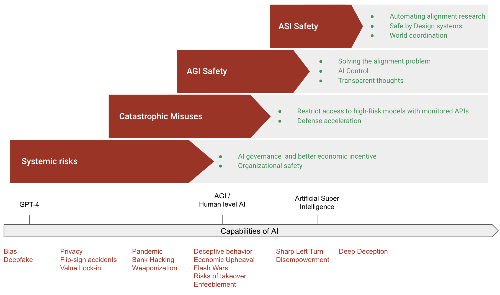

# Chapitre 03 - Stratégies

    <!-- Colonne de gauche -->

        <!-- Auteurs -->
        

            
                <i class="fas fa-users"></i>
            
            

                
Auteurs

                

                    Charbel-Raphael Segerie
                

            

        

        
        <!-- Affiliations -->
        

            
                <i class="fas fa-building"></i>
            
            

                
Affiliations

                

                    

Centre français pour la sécurité de l'IA (CeSIA)

                

            

        

<!-- Section des remerciements -->

    
        <i class="fas fa-heart"></i>
    
    

        
Remerciements

        

            Markov Grey, Jeanne Salle, Charles Martinet, Lukas Gebhard, Amaury Lorin, Alejandro Acelas, Flawn, Emily Fan, Kieron Kretschmar, Sebastian Gil, Evander Hammer, Sophia Wesenberg, Jessica Wen, Niharika Chaubey, Angélina Gentaz, Jonathan Claybrough, Camille Berger, Josh Thorsteinson
        

    

    

    <!-- Colonne de droite -->
    

        <!-- Date -->
        

            
                <i class="fas fa-calendar"></i>
            
            

                
Dernière mise à jour

                
2024-05-01

            

        

        
        <!-- Temps de lecture -->
		

			
				<i class="fas fa-clock"></i>
			
			

				
Temps de lecture

				
62 min (core)

			

		

        
        <!-- Liens -->
        

            
                <i class="fas fa-link"></i>
            
            

                
Également disponible sur

                

                    <a href="https://www.lesswrong.com/s/3ni2P2GZzBvNebWYZ/p/RzsXRbk2ETNqjhsma" class="meta-link">Alignment Forum</a> · <a href="https://docs.google.com/document/d/1WTyLHyaJ_NEDEu49U_hh7oz0-AOQfp7uOJKLck-7A78/edit?usp=sharing" class="meta-link">Google Docs</a>
                

            

        

    

    <a href="https://www.youtube.com/watch?v=iO7Jl4xders" class="action-button">
        <i class="fas fa-video"></i>
        Regarder
    </a>
    

        <i class="fas fa-headphones"></i>
        Écouter
    

    

        <i class="fas fa-file-pdf"></i>
        Télécharger
    

    <a href="https://forms.gle/ZsA4hEWUx1ZrtQLL9" class="action-button">
        <i class="fas fa-comment"></i>
        Commentaires
    </a>
    <a href="https://docs.google.com/document/d/1cv0gzwSouDjckYHzV7gYbHPKhJZR6bwbJWgHzEJ604Q/edit?usp=sharing" class="action-button">
        <i class="fas fa-users"></i>
        Collaborer
    </a>

# Introduction

<figure class="video-figure" markdown="span">
<iframe style="width: 100%; aspect-ratio: 16 / 9;" frameborder="0" allowfullscreen src="https://www.youtube.com/embed/iO7Jl4xders"></iframe>
  <figcaption markdown="1"><b>Vidéo 3.1 :</b> Vidéo optionnelle pour avoir un aperçu des stratégies d'atténuation des risques.</figcaption>
</figure>

Bien que le domaine de la sécurité de l'IA soit encore à ses débuts, plusieurs mesures ont déjà été identifiées qui peuvent améliorer significativement la sécurité des systèmes d'IA. Bien qu'il reste à déterminer si ces mesures sont suffisantes pour traiter complètement les risques posés par l'IA, elles représentent des considérations essentielles. Le diagramme ci-dessous fournit un aperçu de haut niveau des principales approches pour assurer le développement sûr de l'IA.

<figure markdown="span">
{ loading=lazy }
  <figcaption markdown="1"><b>Figure 3.1 :</b> Diagramme préliminaire résumant les principales approches de haut niveau pour rendre le développement de l'IA sûr.</figcaption>
</figure>

Les informations dans ce chapitre sont loin d'être exhaustives et n'effleurent que la surface du paysage complexe de la sécurité de l'IA. Les lecteurs sont encouragés à explorer cette [liste récente d'agendas](https://www.lesswrong.com/posts/zaaGsFBeDTpCsYHef/shallow-review-of-live-agendas-in-alignment-and-safety#Understand_learning) pour une revue plus complète.