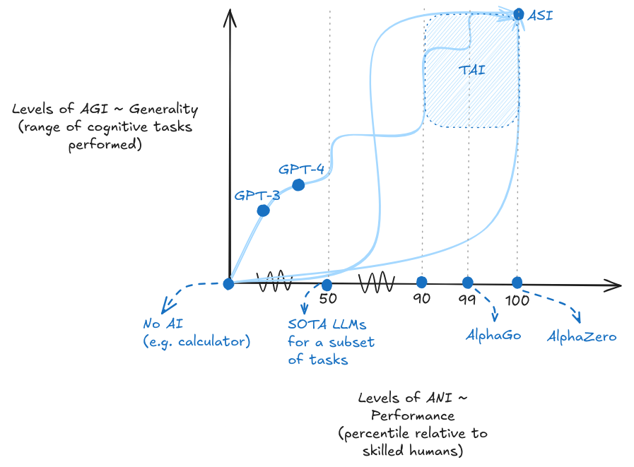
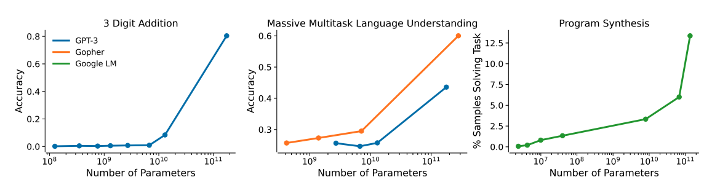

# 4.1 Fondements de la Gouvernance

**Qu'est-ce que la gouvernance de l'IA ?** La gouvernance de l'IA désigne l'élaboration de règles, de politiques et d'institutions qui façonnent la façon dont les systèmes d'IA sont recherchés, développés et déployés. Alors que le travail technique de sécurité de l'IA se concentre sur la construction de systèmes fiables et alignés, la gouvernance répond au défi plus large de gérer l'impact de l'IA sur la société. Cela inclut les pratiques des entreprises, les réglementations gouvernementales, le développement de normes et les mécanismes de coordination internationale. L'objectif est de garantir que le développement de l'IA bénéficie à l'humanité tout en gérant les risques potentiels.

**Comment gouvernons-nous habituellement les technologies ?** Traditionnellement, la gouvernance des technologies repose sur plusieurs hypothèses fondamentales. Premièrement, on part du principe que nous sommes capables de prédire l'utilisation d'une technologie et ses impacts potentiels. Deuxièmement, que nous pouvons effectivement orienter sa trajectoire de développement. Et troisièmement, que nous sommes en mesure de réglementer des applications ou des usages finaux spécifiques. À titre d'exemple, la gouvernance pharmaceutique s'appuie sur des essais cliniques et des processus d'approbation basés sur les applications médicales visées. La technologie nucléaire, quant à elle, est encadrée par des traités internationaux, des garanties et une surveillance ciblée des installations et des matériaux. Ces approches sont efficaces lorsque les technologies suivent des trajectoires de développement relativement prévisibles et présentent des applications clairement définies.

**Qu'est-ce qui rend la gouvernance de l'IA particulièrement complexe ?** Bien que nous réglementions les avancées technologiques depuis des décennies, les solutions existantes pour encadrer la « tech » pourraient s'avérer insuffisantes dans le cas de l'IA. Pour mieux comprendre les défis spécifiques de sa gouvernance, nous pouvons l'examiner sous trois angles différents, chacun potentiellement porteur de besoins de régulation distincts ([Dafoe, 2022](https://academic.oup.com/edited-volume/41989/chapter-abstract/408516484)) :

- **L'IA comme technologie à usage général (TUG)** : L'IA a le potentiel de transformer simultanément de nombreux secteurs, à l'instar de l'électricité ou des ordinateurs dans le passé. Cela signifie que les réglementations sectorielles spécifiques - qui constituent habituellement la base de la gouvernance technologique traditionnelle - s'avèrent inadaptées pour appréhender les effets systémiques larges de l'IA. Ses impacts traversent la société de manières qui rendent les approches réglementaires ciblées intrinsèquement insuffisantes.

- **L'IA comme technologie de l'information** : L'IA traite et génère l'information de manières inédites. Cela crée des défis sans précédent autour de la sécurité, de la confidentialité et de l'intégrité de l'information. Les cadres traditionnels de gouvernance n'ont pas été conçus pour gérer des technologies capables de générer et manipuler l'information rapidement et à très grande échelle. La vitesse et l'ampleur des impacts potentiels sur l'information dépassent les mécanismes de contrôle traditionnels.

- **L'IA comme technologie d'intelligence** : L'IA soulève des défis de contrôle sans précédent. À mesure que les systèmes deviennent plus sophistiqués, ils peuvent élaborer des stratégies complexes pour contourner les mécanismes de contrôle ou poursuivre des objectifs détournés, comme nous l'avons souligné dans le chapitre sur les risques. Plusieurs capacités potentiellement dangereuses émergent (réplication autonome, comportements stratégiques, dissimulation, etc.), créant des défis fondamentaux rarement rencontrés en gouvernance technologique : comment contrôler efficacement un système capable de potentiellement surpasser les mécanismes mêmes de son contrôle ?

Comme nous l'avons vu dans le chapitre sur les capacités, nous avons déjà observé des systèmes d'intelligence artificielle étroite à haute performance (ANI, narrow artificial intelligence), mais nous créons désormais en continu des systèmes à la fois hautement capables et de plus en plus à usage général. Cela signifie qu'ils deviennent des outils technologiques à double usage pouvant être appliqués à diverses tâches différentes.

<figure markdown="span">
{ loading=lazy }
  <figcaption markdown="1"><b>Figure 4.2 :</b> La vision bidimensionnelle des capacités et de la généralité. Les différentes courbes sont destinées à représenter les différents chemins possibles vers l'ASI. Chaque point sur le parcours correspond à un niveau différent d'AGI. La trajectoire de développement spécifique est difficile à prévoir, mais le progrès est continu.</figcaption>
</figure>

Ces trois perspectives - technologie à usage général (TUG), technologie de l'information et technologie d'intelligence - nous aident à analyser pourquoi le développement de l'IA suit des schémas si différents des autres technologies. La gouvernance traditionnelle suppose que nous pouvons contenir l'impact d'une technologie à des secteurs spécifiques, contrôler la circulation de l'information et prédire et contraindre de manière fiable les comportements des systèmes. Mais la nature hybride de l'IA en tant que technologie à usage général, de traitement de l'information et potentiellement intelligente bouleverse tous ces postulats.

**Comment ces trois perspectives créent-elles des défis pour la gouvernance ?** Bien que nous réglementions les avancées technologiques depuis des décennies, ce processus de développement de l'IA rend sa gouvernance unique. Trois problèmes fondamentaux émergent de ces caractéristiques de développement.

**Le problème des capacités inattendues.** Les systèmes d'IA peuvent développer des capacités surprenantes qui ne faisaient pas partie de leur conception initiale. ([Ganguli et al., 2022](https://arxiv.org/abs/2202.07785) ; [Bommasani et al., 2022](https://arxiv.org/abs/2108.07258) ; [Grace et al., 2024](https://arxiv.org/abs/2401.02843)) Comme nous l'avons observé à plusieurs reprises dans le chapitre sur les capacités, les modèles de base ont révélé des capacités « émergentes » qui surgissent de manière soudaine. Avec l'augmentation des données, des paramètres et de la puissance de calcul, ces modèles passent de façon inattendue de calculs arithmétiques simples à des raisonnements complexes. Cette évolution rend difficile l'évaluation des risques avant le déploiement, car il devient impossible de prédire avec certitude les capacités potentielles des systèmes.

<figure markdown="span">
{ loading=lazy }
  <figcaption markdown="1"><b>Figure 4.3 :</b> Exemple du problème des capacités inattendues. Graphiques de plusieurs métriques qui s'améliorent soudainement et de manière imprévisible à mesure que les modèles augmentent en taille ([Ganguli et al., 2022](https://arxiv.org/abs/2202.07785))</figcaption>
</figure>

**Le problème de la sécurité du déploiement.** Une fois déployés, les systèmes d'IA peuvent être réaffectés à de nombreuses applications différentes - aussi bien bénéfiques que nuisibles. Ces systèmes sont intrinsèquement à double usage - leurs capacités peuvent être réorientées vers des objectifs non prévus après leur déploiement. Les utilisateurs découvrent régulièrement de nouvelles capacités qui n'avaient pas été anticipées par les développeurs originaux ([Gouvernement du Royaume-Uni, 2023](https://www.gov.uk/government/publications/frontier-ai-capabilities-and-risks-discussion-paper/frontier-ai-capabilities-and-risks-discussion-paper)). Nous avons consacré plusieurs sections au chapitre sur les risques à ce sujet et avons observé de nombreuses façons dont des problèmes peuvent survenir. Le problème commence par des contournements simples des mesures de sécurité - les utilisateurs ont trouvé de nombreux « jailbreaks » pour contourner les restrictions de contenu dans les modèles de langage (Anderljung et al., 2023). Mais les défis s'intensifient rapidement. Des modèles de langage initialement conçus pour un dialogue utile ont été réaffectés à la génération de désinformation ([Slattery et al., 2024](https://arxiv.org/abs/2408.12622)) et à l'assistance lors de cyberattaques ([CAIS, 2024](https://www.safe.ai/blog/cybersecurity-and-ai-the-evolving-security-landscape) ; [Ladish, 2024](https://axrp.net/episode/2024/04/30/episode-30-ai-security-jeffrey-ladish.html)), pouvant même potentiellement concevoir de nouvelles armes biologiques ([Hendrycks 2023](https://arxiv.org/abs/2306.12001) ; [Marchal et al., 2024](https://arxiv.org/abs/2406.13843) ; [Fang et al., 2024](https://arxiv.org/abs/2402.06664)). Nous assistons également à l'émergence d'agents IA autonomes capables de chaîner les capacités des modèles de manière nouvelle et imprévisible en utilisant de nouveaux outils après leur déploiement.

<figure markdown="span">
{ loading=lazy }
  <figcaption markdown="1"><b>Figure 4.4 :</b> Exemple du problème de sécurité du déploiement. Schéma d'utilisation d'agents LLM autonomes pour pirater des sites web. ([Fang et al., 2024](https://arxiv.org/abs/2402.06664)) Une fois qu'une technologie à double usage est publique, elle peut être utilisée à des fins diverses, à la fois bénéfiques et nuisibles.</figcaption>
</figure>

**Le problème de prolifération.** Les capacités de l'IA peuvent se propager rapidement par divers canaux - versions open-source, vol de modèles ou reproduction par différents acteurs. Comme nous l'avons souligné dans le chapitre sur les stratégies, dès lors que ces capacités existent, leur confinement devient extrêmement complexe. Les modèles peuvent être volés, divulgués ou reproduits par d'autres groupes en quelques mois seulement. Un exemple parlant est la réplication open-source rapide des capacités similaires à ChatGPT, aboutissant à la découverte de nouvelles fonctionnalités et à la suppression de mécanismes de sécurité ([Solaiman et al., 2024](https://arxiv.org/abs/2406.13843)). Même les modèles basés sur API ne sont pas à l'abri : leurs capacités peuvent être extraites par des techniques telles que la distillation de modèle. ([Gouvernement du Royaume-Uni, 2023](https://www.gov.uk/government/publications/frontier-ai-capabilities-and-risks-discussion-paper/frontier-ai-capabilities-and-risks-discussion-paper))

**Comment ces problèmes s'amplifient-ils de concert ?** Ces défis n'existent pas de manière isolée - ils interagissent et s'amplifient de façon à complexifier davantage la gouvernance de l'IA. Le problème des capacités inattendues rend la sécurité du déploiement plus difficile à garantir, puisque nous ne pouvons prédire avec certitude quelles capacités pourraient émerger et être potentiellement détournées. La flexibilité de déploiement des systèmes d'IA rend la prolifération plus préoccupante, car les capacités peuvent être réaffectées à des usages nocifs après leur propagation. Qui plus est, la prolifération augmente significativement les probabilités de découvrir des capacités inattendues par l'expérimentation de multiples acteurs ([Anderljung et al., 2023](https://arxiv.org/abs/2307.03718)).

**Quelle est la fonction de la gouvernance ?** La gouvernance ne consiste pas uniquement en des restrictions ; elle englobe également des fonctions qui facilitent l'innovation responsable, telles que fournir des orientations, favoriser la collaboration et créer des espaces sécurisés pour l'expérimentation. Bien que nous soyons préoccupés par des défis dont les réponses reposent principalement sur l'établissement de garde-fous, ces mécanismes de développement sont tout aussi cruciaux. La gouvernance remplit plusieurs fonctions essentielles. Quelques exemples incluent :

- **Visibilité** : Une visibilité améliorée est fondamentale pour un contrôle efficace. Cela implique de créer des mécanismes apportant de la transparence aux processus de développement de l'IA, permettant aux parties prenantes de comprendre et de surveiller les progrès et les impacts potentiels de l'IA. La visibilité permet la vérification - la confirmation des affirmations faites par les développeurs d'IA ou d'autres acteurs ainsi que l'évaluation des systèmes d'IA par rapport à des normes ou des références établies.

- **Application** : La gouvernance doit fournir les moyens de garantir le respect des réglementations et des directives éthiques. Cela peut s'étendre des sanctions juridiques à l'exclusion du marché pour les acteurs non-conformes.

**Quels leviers la gouvernance peut-elle utiliser pour atteindre ces objectifs ?** Pour exécuter ces fonctions, les systèmes de gouvernance utilisent divers mécanismes ([Howlett, 2019](https://www.taylorfrancis.com/books/mono/10.4324/9781315232003/designing-public-policies-michael-howlett-michael-howlett)). Voici quelques exemples des mécanismes dont la gouvernance dispose pour influencer la cible de gouvernance choisie :

- **Outils fondés sur l'information** : Nous pouvons exploiter le pouvoir de la diffusion des connaissances. Ceux-ci pourraient inclure des exigences obligatoires de divulgation pour les entreprises d'IA ou des initiatives d'éducation publique visant à développer la compréhension générale de l'IA.

- **Outils autoritaires** : Nous pouvons tirer parti du pouvoir des institutions pour établir et faire respecter des règles. Cela pourrait impliquer des législations, des décrets exécutifs ou des décisions judiciaires qui réglementent directement le développement et l'utilisation de l'IA.

- **Normes** : Elles occupent un rôle stratégique fondamental dans la gouvernance de l'IA, constituant une passerelle essentielle entre les principes généraux et les pratiques opérationnelles concrètes ([Cihon, 2019](https://www.governance.ai/research-paper/standards-for-ai-governance-international-standards-to-enable-global-coordination-in-ai-research-development)). Ces normes peuvent revêtir un caractère technique - définissant par exemple les métriques de performance des systèmes d'IA - ou éthique, en établissant un cadre des pratiques considérées comme acceptables dans le développement de l'intelligence artificielle.

- **Incitatifs** : Ce mécanisme aide à façonner les comportements par le biais de récompenses et de pénalités. Celles-ci peuvent être financières, comme des allègements fiscaux pour les entreprises investissant dans la recherche sur la sécurité de l'IA, ou liées à la réputation, comme des systèmes de certification reconnaissant les pratiques responsables en matière d'IA. En alignant les motivations économiques et sociales avec les objectifs de gouvernance, les incitatifs peuvent favoriser la conformité volontaire et l'innovation dans les approches de gouvernance.

**Qu'est-ce que cela signifie pour les approches de gouvernance ?** Ces défis fondamentaux - capacités inattendues, risques de sécurité lors du déploiement et prolifération rapide - impliquent que nous devons repenser nos approches de gouvernance du développement de l'IA. Les outils réglementaires traditionnels comme les permis spécifiques à une application ou la surveillance post-déploiement se révèlent insuffisants face aux caractéristiques uniques de l'IA. Pour construire une gouvernance efficace, nous devons identifier les aspects du pipeline de développement de l'IA sur lesquels nous pouvons exercer une influence déterminante avant l'émergence ou la prolifération des capacités. Nous devons comprendre quels leviers d'intervention nous offrent le plus de potentiel tout en permettant la poursuite d'une innovation bénéfique. Dans la section suivante, nous examinerons des cibles spécifiques le long du pipeline de développement et de déploiement de l'IA - depuis des intrants essentiels comme le calcul et les données jusqu'aux contrôles de déploiement et aux systèmes de surveillance - en évaluant chacun à travers le prisme de ces défis fondamentaux.