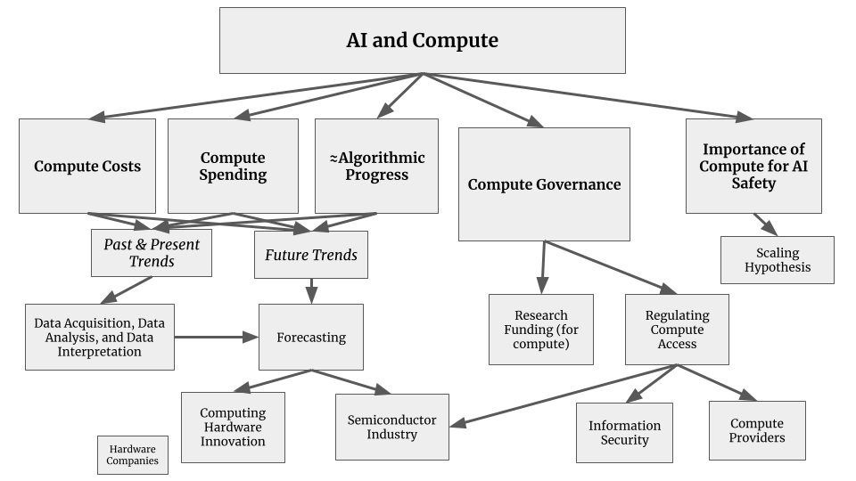
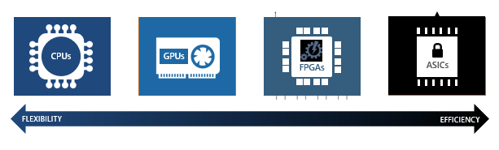
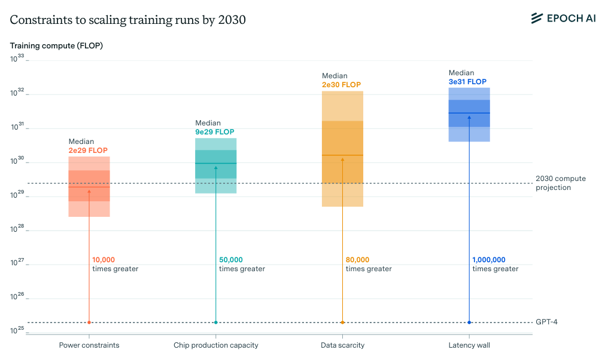

# 4.2 Objectifs de gouvernance

**Pourquoi avons-nous besoin d'objectifs de gouvernance spécifiques ?** Les défis que nous avons explorés dans la section précédente - capacités inattendues, risques de déploiement et prolifération rapide - signifient que nous devons soigneusement choisir où et comment intervenir dans le développement de l'IA ([Anderljung et al., 2023](https://arxiv.org/abs/2307.03718)). Cela nécessite d'identifier à la fois ce qu'il faut gouverner (cibles) et comment le gouverner (mécanismes).

**Qu'est-ce qui caractérise une bonne cible de gouvernance ?** Avant de nous pencher sur ce que nous pouvons et ce que nous ciblons spécifiquement dans la gouvernance de l'IA, nous devons comprendre ce qui constitue une bonne cible de gouvernance en général. Les points d'intervention efficaces pour une bonne gouvernance doivent combiner plusieurs propriétés. Ils doivent être concrètement mesurables, significatifs et pratiques :

- **Mesurabilité** : Nous devrions être capables de suivre et de vérifier ce qui se passe. L'industrie des semi-conducteurs offre un bon exemple - la production de puces peut être mesurée en unités précises, ce qui permet de suivre et de réguler la fabrication.

- **Contrôlabilité** : Il doit exister des moyens concrets d'influencer les cibles choisies. Prenez l'exemple des contrôles à l'exportation des semi-conducteurs avancés, dont la chaîne d'approvisionnement présente des points stratégiques de régulation clairement identifiables ([Sastry et al., 2024](https://arxiv.org/abs/2402.08797)).

- **Significatif** : Enfin, les cibles doivent aborder des aspects fondamentaux du développement. Dans le cas de l'IA, cela signifie s'attaquer aux éléments essentiels qui façonnent les capacités et les risques. Bien que la régulation des applications finales soit importante, cibler les intrants fondamentaux comme les données et les ressources de calcul peut contribuer à orienter le développement avant l'émergence des risques.

**Quelles sont les cibles les plus importantes ?** Ainsi, si nous voulons appliquer concrètement ces cibles au processus de développement de l'IA, nous avons plusieurs points d'intervention potentiels. Au début du développement, nous pouvons cibler des composantes essentielles : les données utilisées pour entraîner les modèles, l'infrastructure computationnelle nécessaire pour réaliser l'entraînement, et le processus de développement des modèles eux-mêmes. Une fois les systèmes construits, le déploiement offre des cibles supplémentaires : contrôler qui a accès à quelles capacités, surveiller comment les systèmes sont utilisés, et évaluer leurs impacts sur la société ([Heim et al., 2024](https://arxiv.org/abs/2403.08501)). Chacune de ces cibles présente différentes opportunités et défis pour la gouvernance.

## 4.2.1 Gouvernance du calcul {: #01}

**Pourquoi la puissance de calcul est-elle une bonne cible pour la gouvernance ?** Parmi les éléments qui influencent les performances de l'IA - données, puissance de calcul et algorithmes - la puissance de calcul occupe une position unique. Si quelqu'un possède une copie d'un algorithme ou de données, cela n'empêche pas d'autres de disposer de la même chose. En revanche, les GPU ne peuvent pas être simplement dupliqués ou reproduits à volonté. C'est une contrainte physique concrète et tangible sur le développement de l'IA. Examinons les variables que nous avions pour une bonne cible de gouvernance et voyons comment la puissance de calcul se comporte :

- **Mesurabilité :** Contrairement aux données ou aux algorithmes, la puissance de calcul laisse des empreintes physiques claires. L'entraînement des modèles de pointe nécessite d'immenses centres de données hébergeant des milliers de puces spécialisées ([Pilz & Heim, 2023](https://arxiv.org/abs/2311.02651)). Nous pouvons suivre la capacité computationnelle au moyen de métriques bien définies comme les opérations à virgule flottante (FLOPS), ce qui nous permet d'identifier les tentatives d'entraînement potentiellement risquées avant même leur début ([Heim & Koessler, 2024](https://arxiv.org/abs/2405.10799)).

- **Contrôlabilité :** La chaîne d'approvisionnement des puces d'IA avancées présente des points névralgiques - seulement quelques entreprises contrôlent des étapes critiques comme la conception et la fabrication des puces ([Grunewald, 2023](https://www.iaps.ai/research/ai-chip-making-china)). Ces points névralgiques permettent une gouvernance via des mécanismes tels que les contrôles à l'exportation ou les exigences de licence ([Sastry et al., 2024](https://arxiv.org/abs/2402.08797)).

- **Caractère significatif :** Comme nous l'avons discuté dans le chapitre sur les risques, les capacités les plus dangereuses sont susceptibles d'émerger de modèles de pointe, qui exigent des quantités massives d'infrastructure informatique spécialisée pour leur entraînement et leur exécution ([Anderljung et al., 2023](https://arxiv.org/abs/2307.03718); [Sastry et al., 2024](https://arxiv.org/abs/2402.08797)). Les besoins en calcul déterminent directement les limites de ce que les systèmes d'IA peuvent développer - même dotés d'algorithmes de pointe et de vastes ensembles de données, les organisations ne peuvent pas entraîner les modèles les plus avancés sans une puissance de calcul suffisante ([Besiroglu et al., 2024](https://arxiv.org/abs/2401.02452)). Cela confère à la puissance de calcul un point d'intervention particulièrement crucial, permettant d'orienter le développement de l'IA avant l'émergence de systèmes potentiellement dangereux, plutôt que de tenter de les contrôler a posteriori ([Heim et al., 2024](https://arxiv.org/abs/2403.08501)).

<figure class="iframe-figure" markdown="span">
<iframe src="https://ourworldindata.org/grapher/ai-performance-knowledge-tests-vs-training-computation?tab=chart" loading="lazy" style="width: 100%; height: 600px; border: 0px none;" allow="web-share; clipboard-write"></iframe>
  <figcaption markdown="1"><b>Figure interactive 4.1 :</b> Illustrant comment les capacités semblent directement proportionnelles aux augmentations de puissance de calcul. ([Giattino et al., 2023](https://ourworldindata.org/artificial-intelligence))</figcaption>
</figure>

La discussion dans les prochaines sous-sections se concentrera sur les éléments de mise en œuvre concrète de la gouvernance du calcul. Nous expliquerons comment les chaînes d'approvisionnement concentrées permettent le suivi et la surveillance de la puissance de calcul, nous donnerons également un bref aperçu des mécanismes de gouvernance du calcul basés sur le matériel, et enfin nous discuterons de certaines limitations liées aux seuils de gouvernance du calcul, et comment l'entraînement distribué et le code source ouvert pourraient remettre en question la gouvernance du calcul.

<figure markdown="span">
{ loading=lazy }
  <figcaption markdown="1"><b>Figure 4.5 :</b> Une représentation graphique de la relation entre l'IA et divers aspects de la puissance de calcul.</figcaption>
</figure>

### 4.2.1.1 Suivi {: #01-01}

Comment la chaîne d'approvisionnement des puces d'IA est-elle structurée ? Les puces spécialisées pour l'IA émergent d'un processus mondial complexe. Cela commence par l'extraction et le raffinage de matières premières comme le silicium et les terres rares. Ces matériaux deviennent des plaquettes de silicium, qui sont transformées en puces au travers de centaines d'étapes de fabrication précises. Le processus nécessite un équipement spécialisé - en particulier des machines de photolithographie de ASML - ainsi que divers produits chimiques, gaz et outils provenant d'autres fournisseurs ([Grunewald, 2023](https://www.iaps.ai/research/ai-chip-making-china)).

<figure markdown="span">
{ loading=lazy }
  <figcaption markdown="1"><b>Figure 4.6 :</b> La chaîne d'approvisionnement de la puissance de calcul. ([Belfield & Hua 2022](https://verfassungsblog.de/compute-and-antitrust/))</figcaption>
</figure>

**Quels sont les points de blocage dans la conception et la fabrication ?** La chaîne d'approvisionnement est dominée par quelques entreprises clés à des étapes cruciales. NVIDIA conçoit la majorité des puces spécialisées pour l'IA, TSMC fabrique les puces les plus avancées, et ASML produit les machines indispensables à TSMC pour leur fabrication ([Grunewald, 2023](https://www.iaps.ai/research/ai-chip-making-china); [Pilz et al., 2023](https://arxiv.org/abs/2311.02651)). On estime que NVIDIA détient près de 80% du marché des GPU destinés à l'entraînement de l'IA ([Jagielski, 2024](https://www.nasdaq.com/articles/nvidia-dominating-artificial-intelligence-chip-market-apple-has-been-securing-supply)). De manière similaire, TSMC et ASML conservent des positions largement dominantes dans leurs domaines respectifs ([Pilz et al., 2023](https://arxiv.org/abs/2311.02651)).

<figure class="iframe-figure" markdown="span">
<iframe src="https://ourworldindata.org/grapher/market-share-logic-chip-production-manufacturing-stage?tab=chart" loading="lazy" style="width: 100%; height: 600px; border: 0px none;" allow="web-share; clipboard-write"></iframe>
  <figcaption markdown="1"><b>Figure interactive 4.2 :</b> Part de marché pour la production de puces logiques, par étape de fabrication ([Giattino et al., 2023](https://ourworldindata.org/grapher/market-share-logic-chip-production-manufacturing-stage?tab=chart))</figcaption>
</figure>

**Quels sont les points de blocage dans l'utilisation et l'infrastructure ?** Outre la fabrication des puces, l'achat et l'exploitation de celles-ci à l'échelle nécessaire pour les modèles d'IA de pointe exigent un investissement initial considérable. Seulement trois fournisseurs - Amazon, Microsoft et Google - dominent environ 65% des services cloud ([Jagielski, 2024](https://www.nasdaq.com/articles/nvidia-dominating-artificial-intelligence-chip-market-apple-has-been-securing-supply)). Un nombre restreint d'entreprises d'IA comme OpenAI, Anthropic et DeepMind exploitent leurs propres clusters GPU massifs, mais ceux-ci requièrent un matériel spécialisé soumis aux contrôles de la chaîne d'approvisionnement ([Pilz & Heim, 2023](https://arxiv.org/abs/2311.02651)).

**Que signifient ces points de blocage pour la gouvernance ?** Cette concentration crée des points d'intervention naturels. Les autorités n'ont besoin de travailler qu'avec un petit nombre d'acteurs clés pour mettre en place des contrôles, comme le démontrent les restrictions à l'exportation américaines sur les puces avancées ([Heim et al., 2024](https://arxiv.org/abs/2403.08501)). Il est toutefois important de garder à l'esprit que cette forte concentration est également préoccupante. 

Nous assistons à une croissance de la fracture numérique computationnelle : alors que les grandes entreprises technologiques peuvent dépenser des centaines de millions dans l'entraînement de l'IA, les chercheurs académiques peinent à accéder même aux ressources de base ([Besiroglu et al., 2024](https://arxiv.org/abs/2401.02452)). Cela a des répercussions sur qui peut participer au développement de l'IA et réduit la supervision indépendante des modèles de pointe. Cela soulève également des préoccupations concernant une potentielle concentration de pouvoir.

<figure markdown="span">
{ loading=lazy }
  <figcaption markdown="1"><b>Figure 4.7 :</b> Le spectre des architectures de puces avec des compromis en termes d'efficacité et de flexibilité.</figcaption>
</figure>

**Comment cibler efficacement les contrôles ?** Au lieu de chercher à contrôler l'ensemble de l'infrastructure informatique, la gouvernance peut se concentrer spécifiquement sur les puces d'IA spécialisées. Celles-ci se distinguent du matériel à usage général tant par leurs capacités que par leurs chaînes d'approvisionnement. En ciblant uniquement les puces d'IA les plus avancées, nous pouvons traiter les risques catastrophiques tout en laissant l'écosystème informatique plus large largement intact ([Heim et al., 2024](https://arxiv.org/abs/2403.08501)). Par exemple, les contrôles à l'exportation américains ciblent spécifiquement les GPU de data center haut de gamme tout en excluant le matériel de jeu grand public.

### 4.2.1.2 Surveillance {: #01-02}

**Comment détecter des campagnes d'entraînement d'IA préoccupantes ?** L'entraînement de modèles d'IA de pointe laisse de multiples traces détectables. La plus fiable est la consommation énergétique - les campagnes d'entraînement susceptibles de produire des systèmes dangereux exigent une utilisation massive de puissance, souvent des centaines de mégawatts, générant des schémas distinctifs ([Wasil et al., 2024](https://arxiv.org/abs/2408.16074) ; [Shavit, 2023](https://arxiv.org/abs/2303.11341)). 

Au-delà de l'énergie, d'autres indicateurs techniques comprennent :
- Les modèles de trafic réseau caractéristiques de l'entraînement de modèles
- Les registres d'acquisition et d'expédition de matériel 
- Les exigences des systèmes de refroidissement et leurs signatures thermiques
- Le développement d'infrastructures, comme la construction de sous-stations électriques 

([Sastry et al., 2024](https://arxiv.org/abs/2402.08797); [Shavit, 2023](https://arxiv.org/abs/2303.11341); [Heim et al., 2024](https://arxiv.org/abs/2403.08501)). Ces signaux deviennent particulièrement probants lorsqu'ils sont combinés : des pics soudains simultanés dans l'utilisation énergétique et le trafic réseau, au sein d'un établissement doté de matériel d'IA connu, suggèrent très fortement la conduite d'un entraînement de modèle en cours.

**Quel rôle jouent les seuils de puissance de calcul ?** Les réglementations ont déjà commencé à utiliser des seuils de calcul pour déclencher des mécanismes de surveillance. L'ordre exécutif américain sur l'IA impose aux entreprises de signaler les campagnes d'entraînement dépassant 10^26 opérations - un seuil conçu pour identifier le développement des systèmes les plus performants. 

L'Acte IA de l'UE établit un seuil encore plus bas, fixé à 10^25 opérations, qui requiert non seulement une notification, mais également des évaluations des risques et des mesures de sécurité ([Heim & Koessler, 2024](https://arxiv.org/abs/2405.10799)). Ces seuils permettent de repérer les activités de développement potentiellement risquées avant leur achèvement, favorisant ainsi une approche de gouvernance préventive plutôt que réactive.

<figure markdown="span">
{ loading=lazy }
  <figcaption markdown="1"><b>Figure 4.8 :</b> Seuils de puissance de calcul tels que spécifiés dans l'Ordre exécutif américain 14110 ([Sastry et al., 2024](https://arxiv.org/pdf/2402.08797))</figcaption>
</figure>

**Quel rôle de gouvernance les fournisseurs de cloud peuvent-ils jouer ?** La majorité du développement d'IA de pointe s'effectue aujourd'hui via des plateformes de cloud computing plutôt que sur du matériel détenu en propre. Cette configuration crée des points de contrôle naturels pour la supervision, car la plupart des organisations développant des technologies d'IA avancées doivent passer par ces fournisseurs (Heim et al., 2024, sur la gouvernance via le cloud). 

La position intermédiaire des fournisseurs de cloud, situés entre le matériel et les développeurs, leur permet de mettre en place des contrôles qui seraient difficiles à imposer par la seule régulation du matériel. Ils gèrent l'infrastructure physique, suivent les modèles d'utilisation des ressources de calcul et conservent les registres de développement. 

De plus, ils peuvent :
- Surveiller le respect des exigences de sécurité
- Implémenter des contrôles d'accès 
- Répondre aux violations potentielles 

([Heim et al., 2024](https://arxiv.org/abs/2403.08501); [Chan et al., 2024](https://arxiv.org/abs/2406.12137)).

**Comment les fournisseurs de cloud peuvent-ils aider à mettre en œuvre une supervision ?** Une approche prometteuse consiste à appliquer des exigences de "connaissance du client" (KYC, de l'anglais know-your-customer), similaires à celles des services financiers. Les fournisseurs seraient chargés de vérifier l'identité et les intentions des clients sollicitant des ressources de calcul à grande échelle, de conserver des registres des utilisations de calcul significatives et de signaler les schémas suspects ([Egan & Heim, 2023](https://arxiv.org/abs/2310.13625)). 

Cette approche peut être mise en œuvre tout en préservant la confidentialité - les caractéristiques fondamentales des charges de travail peuvent être surveillées sans accéder aux détails sensibles comme l'architecture du modèle ou les données d'entraînement ([Shavit, 2023](https://arxiv.org/abs/2303.11341)). Des réglementations KYC similaires pourraient également être appliquées à la chaîne d'approvisionnement pour les acquisitions de matériel de calcul d'IA de pointe.

### 4.2.1.3 Contrôles sur puce {: #01-03}

**Comment fonctionne la gouvernance du calcul embarqué ?** Au-delà de la surveillance et de la détection, l'infrastructure de calcul peut intégrer des mécanismes de contrôle actifs directement au sein du matériel du processeur. À l'image des éléments de sécurisation présents dans les smartphones et ordinateurs modernes pour la confidentialité et la sécurité, les puces d'IA peuvent incorporer des fonctionnalités qui authentifient et régulent leur utilisation ([Aarne et al., 2024](https://www.iaps.ai/research/secure-governable-chips)). Ces fonctionnalités pourraient prévenir les campagnes d'entraînement non autorisées ou garantir que les puces ne sont utilisées que dans des installations préalablement approuvées ([Aarne et al., 2024](https://www.iaps.ai/research/secure-governable-chips)). L'authentification s'effectue au niveau matériel, rendant ce contrôle significativement plus difficile à contourner que les mécanismes de contrôle logiciels.

**Quels contrôles spécifiques pourraient être mis en place ?** Plusieurs approches semblent prometteuses. Des limites d'utilisation pourraient plafonner la quantité de calcul utilisée pour certains types de charges de travail d'IA sans autorisation spéciale. Des systèmes de journalisation sécurisés pourraient créer des registres infalsifiables de l'utilisation des puces. Une vérification de localisation pourrait garantir que les puces ne sont utilisées que dans des installations approuvées ([Brass & Aarne, 2024](https://www.iaps.ai/research/location-verification-for-ai-chips)). Le matériel pourrait même intégrer des dispositifs de sécurité embarqués qui interrompent automatiquement l'entraînement si certaines conditions ne sont pas remplies. Ces mécanismes relèvent du concept émergent de gouvernance intégrée des systèmes de calcul ([Aarne et al., 2024](https://www.iaps.ai/research/secure-governable-chips)).

**Comment ces mécanismes se comparent-ils aux fonctionnalités de sécurité existantes ?** On retrouve déjà des concepts analogues en cybersécurité, notamment avec des technologies comme les extensions de garde logicielle d'Intel (Software Guard Extensions) ou les modules de plateforme de confiance (TPM, Trusted Platform Module) ([Intel, 2024](https://www.intel.com/content/www/us/en/business/enterprise-computers/resources/trusted-platform-module.html)), qui offrent des garanties de sécurité au niveau matériel. 

Bien que nous soyons encore loin de disposer de mesures de protection équivalentes pour le calcul d'IA, les recherches préliminaires révèlent des perspectives prometteuses (Shavit, 2023, What does it take to catch a Chinchilla?). Certaines puces intègrent déjà des capacités élémentaires de surveillance qui pourraient être étendues à des fins de gouvernance ([Petrie et al., 2024](https://arxiv.org/abs/2404.18308)).

### 4.2.1.4 Limites {: #01-04}

**Quels défis fondamentaux la gouvernance du calcul rencontre-t-elle ?** Bien que le calcul présente de nombreux avantages comme cible de gouvernance, plusieurs tendances pourraient réduire son efficacité. Alors que la dernière décennie a été marquée par une augmentation constante des ressources de calcul, cette tendance pourrait ne pas se poursuivre indéfiniment. Bien que la recherche suggère que la mise à l'échelle des modèles pourrait encore être possible jusqu'en 2030 ([Sevilla et al., 2024](https://epoch.ai/blog/can-ai-scaling-continue-through-2030)), les améliorations algorithmiques continuent d'accroître l'efficacité, ce qui signifie qu'une même puissance de calcul permet d'obtenir des capacités toujours plus élevées. 

Des modèles de taille réduite commencent à démontrer des capacités et des risques comparables. À titre d'exemple, Falcon 180B est désormais surpassé par des modèles significativement plus compacts comme Llama-3 8B. Ce constat rend les seuils de calcul statiques de moins en moins fiables comme indicateurs de capacité, nécessitant des actualisations régulières ([Hooker, 2024](https://arxiv.org/abs/2407.05694)). 

Qui plus est, les améliorations du calcul d'inférence – telles que l'échantillonnage par sélection optimale (best-of-n), le raisonnement par chaînage de pensées et la distillation de modèle – peuvent considérablement augmenter les capacités des modèles sans modifier les ressources utilisées lors de l'entraînement. Les cadres de gouvernance actuels ne prennent pas suffisamment en compte ces optimisations post-entraînement ([Shavit, 2023](https://arxiv.org/abs/2303.11341)).

<figure markdown="span">
{ loading=lazy }
  <figcaption markdown="1"><b>Figure 4.9 :</b> Estimations des contraintes d'échelle imposées par les principaux goulots d'étranglement. Chaque estimation est basée sur des projections historiques. La boîte grisée foncée correspond à l'intervalle interquartile et la région grisée claire à un intervalle de confiance de 80 %. Les quatre boîtes présentent quatre contraintes qui pourraient ralentir la croissance à l'avenir : puissance, puces (calcul), données et latence. ([Sevilla et al., 2024](https://epoch.ai/blog/can-ai-scaling-continue-through-2030))</figcaption>
</figure>

**Des modèles de taille réduite mais hautement spécialisés pourraient toujours présenter des risques.** Différents domaines ont des exigences de calcul très différentes. Par exemple, alors que les modèles de langage nécessitent souvent des ressources de calcul importantes, les modèles de biologie et de code demandent généralement beaucoup moins de puissance. Des modèles hautement spécialisés, entraînés sur des ensembles de données spécifiques, pourraient développer des capacités potentiellement préjudiciables tout en utilisant des ressources de calcul relativement modestes. Par exemple, des modèles axés sur les domaines biologiques ou de cybersécurité pourraient présenter des risques sérieux, même avec une utilisation de calcul inférieure aux seuils réglementaires typiques ([Mouton et al., 2024](https://www.rand.org/pubs/research_reports/RRA2977-1.html); [Heim & Koessler, 2024](https://arxiv.org/abs/2405.10799)).

**Comment concilier contrôle et accessibilité ?** Bien que la gouvernance des ressources computationnelles puisse contribuer à la gestion des risques liés à l'IA, des mécanismes de contrôle trop restrictifs pourraient engendrer des effets contre-productifs. À l'heure actuelle, seul un nombre très restreint d'organisations dispose des capacités computationnelles nécessaires pour développer des technologies d'IA de pointe. ([Purtova et al., 2022](https://arxiv.org/abs/2212.10244); [Pilz et al., 2023](https://arxiv.org/abs/2311.02651)) L'introduction de barrières supplémentaires risquerait d'exacerber cette asymétrie, en concentrant le pouvoir entre les mains de quelques grands acteurs technologiques et en réduisant les possibilités de supervision indépendante ([Besiroglu et al., 2024](https://arxiv.org/abs/2401.02452)).

**Comment concilier sécurité, recherche et innovation ?** Les chercheurs académiques font actuellement face à des difficultés significatives pour obtenir les ressources computationnelles nécessaires à des travaux de recherche approfondis sur l'IA. À mesure que les modèles deviennent plus complexes et plus exigeants en calcul, l'écart entre l'industrie et le monde académique ne cesse de s'élargir. ([Besiroglu et al., 2024](https://arxiv.org/abs/2401.02452); [Zhang et al., 2021](https://arxiv.org/abs/2104.07237)) 

Les infrastructures de calcul à grande échelle présentent de nombreux usages légitimes qui dépassent largement le développement de l'IA - allant de la recherche scientifique aux applications commerciales. Des restrictions trop générales risqueraient de compromettre l'innovation porteuse de progrès.

Qui plus est, une fois entraînés, les modèles peuvent généralement être exécutés en mode inférence avec des ressources computationnelles significativement réduites par rapport à leur phase d'apprentissage. Cette caractéristique complexifie le contrôle de l'utilisation des modèles existants sans imposer des mécanismes de régulation excessivement contraignants sur l'infrastructure informatique générale ([Sastry et al., 2024](https://arxiv.org/abs/2402.08797)). En l'absence de dispositions spécifiques facilitant l'accès à la recherche - telles que des subventions dédiées ou des partenariats académiques - les mesures de gouvernance risquent de freiner involontairement le développement de la recherche sur la sécurité de l'IA et les capacités d'évaluation indépendantes.

**Les approches d'entraînement distribué pourraient-elles contourner les contrôles de gouvernance du calcul ?** Actuellement, l'entraînement des modèles de pointe nécessite de concentrer d'énormes ressources de calcul en un seul endroit en raison des exigences de communication entre les puces. Les méthodes d'entraînement décentralisées ou distribuées n'ont pas vraiment rattrapé les méthodes centralisées. ([Douillard et al., 2023](https://arxiv.org/abs/2311.08105); [Jaghouar et al., 2024](https://arxiv.org/abs/2407.07852)). Cependant, si nous observons des avancées fondamentales dans les algorithmes d'entraînement distribué, cela pourrait éventuellement permettre de répartir l'entraînement sur plusieurs sites plus petits. Bien que cela reste techniquement complexe et inefficace, cela pourrait rendre la détection et le contrôle des sessions d'entraînement potentiellement risquées plus difficiles ([Anderljung et al., 2023](https://arxiv.org/abs/2307.03718)).

Compte tenu de ces limitations, la surveillance et les seuils de calcul devraient principalement opérer comme un mécanisme de criblage préliminaire, destiné à identifier les modèles méritant un examen approfondi, plutôt que de constituer le seul critère déterminant des exigences réglementaires spécifiques. Leur efficacité est maximale lorsqu'ils permettent de déclencher des mécanismes de supervision – tels que des obligations de notification et des évaluations de risques – dont les résultats peuvent ensuite guider l'élaboration de mesures d'atténuation appropriées.

## 4.2.2 Gouvernance des Données {: #02}

!!! warning "Cette section peut être considérée comme un détail supplémentaire et peut être ignorée en toute sécurité."

**Quel rôle les données jouent-elles dans les risques liés à l'IA ?** Les données déterminent fondamentalement les capacités et le comportement des systèmes d'IA. Pour les modèles fondamentaux de pointe, les données d'entraînement influencent conjointement les capacités et l'alignement - à savoir ce que les systèmes peuvent faire et comment ils le réalisent. Des données d'entraînement de faible qualité ou préjudiciables pourraient engendrer des modèles désalignés ou potentiellement dangereux, selon le principe « tout ce qui entre conditionne ce qui sort », tandis que des ensembles de données soigneusement sélectionnés seraient susceptibles de favoriser des comportements plus sûrs et plus fiables ([Longpre et al., 2024](https://arxiv.org/abs/2407.14933); [Marcucci et al., 2023](https://arxiv.org/abs/2302.13731)).

**Quelle est la pertinence des données comme cible de gouvernance ?** Les données considérées comme cible de gouvernance présentent un tableau contrasté lorsqu'on les évalue au regard de nos critères clés. Examinons chaque aspect :

- **Mesurabilité** : Bien que nous puissions quantifier les volumes bruts de données, évaluer leur qualité, leur contenu et leurs implications potentielles s'avère nettement plus complexe. À la différence des biens physiques comme les semi-conducteurs, les données peuvent être copiées, modifiées et transmises de manières difficiles à tracer. Cette caractéristique rend la mesure exhaustive des flux de données extrêmement ardue.

- **Contrôlabilité** : La nature des données, qui peuvent être reproduites sans limite - contrairement aux biens physiques - signifie qu'elles peuvent être copiées et diffusées très largement. Une fois les données existantes, en contrôler la propagation devient extrêmement complexe. Même lorsque les données semblent être restreintes, des techniques comme la distillation de modèle (qui permet d'extraire les connaissances d'un modèle entraîné) peuvent contourner ces restrictions ([Anderljung et al., 2023](https://arxiv.org/abs/2307.03718)). Néanmoins, il subsiste des points de contrôle prometteurs, notamment lors de la collecte initiale des données et de l'entraînement initial des modèles fondamentaux.

- **Pertinence** : Les données revêtent une importance cruciale dans le développement de l'IA. Les données utilisées pour l'entraînement des modèles déterminent directement leurs capacités et leurs comportements. Des variations dans les données d'entraînement peuvent modifier significativement les performances et la sécurité du modèle. Cette caractéristique confère à la gouvernance des données un potentiel puissant, à condition de surmonter les défis inhérents à leur mesure et à leur contrôle.

**Quelles sont les principales préoccupations en matière de gouvernance des données ?** Plusieurs aspects des données nécessitent une gouvernance attentive pour promouvoir le développement d'une IA sûre :

- **La qualité et la sécurité des données d'entraînement sont fondamentales - des données de faible qualité ou préjudiciables peuvent créer des modèles non fiables ou dangereux**. Par exemple, des données techniques sur les armes biologiques dans les ensembles d'entraînement pourraient permettre aux modèles de faciliter leur développement ([Anderljung et al., 2023](https://arxiv.org/abs/2307.03718)).

- **La contamination des données et les menaces de sécurité constituent des risques de plus en plus préoccupants**. Des acteurs malveillants pourraient manipuler délibérément les données d'entraînement afin de concevoir des modèles capables de se comporter de manière dangereuse dans des situations spécifiques, tout en conservant une apparence de sécurité lors des tests. Cette stratégie pourrait impliquer l'insertion de motifs subtils qui ne deviennent perceptibles que dans certaines conditions précises ([Longpre et al., 2024](https://arxiv.org/abs/2407.14933)).

- **La provenance des données et la responsabilité permettent de tracer l'origine des comportements des modèles**. Sans un suivi précis des sources de données d'entraînement et de leurs caractéristiques, il devient pratiquement impossible de diagnostiquer et de corriger les problèmes lorsque les modèles présentent des comportements inquiétants ([Longpre et al., 2023](https://arxiv.org/abs/2310.16787)).

- **Consentement et cadres juridiques protègent les créateurs et les utilisateurs de données**. De nombreuses pratiques actuelles d'entraînement de l'IA évoluent dans des zones grises juridiques et éthiques concernant les droits d'utilisation des données. Des cadres réglementaires clairs pourraient aider à prévenir l'utilisation non autorisée tout en favorisant l'innovation légitime ([Longpre et al., 2024](https://arxiv.org/abs/2407.14933)).

- **Les biais et la représentation dans les données d'entraînement impactent directement le comportement des modèles**. Des ensembles de données déséquilibrés ou non représentatifs peuvent conduire à des modèles qui performent médiocrement ou prennent des décisions préjudiciables pour certains groupes, amplifiant potentiellement les inégalités sociétales à une échelle massive ([Reuel et al., 2024](https://arxiv.org/abs/2407.14981)).

- **Protocoles de gestion des données : qui peut développer des systèmes d'IA puissants ?** Sans gouvernance de l'accès aux données, nous nous exposons à deux risques extrêmes : une concentration excessive du pouvoir entre les mains de quelques acteurs disposant de vastes ensembles de données, ou, à l'inverse, une prolifération incontrôlée de capacités potentiellement dangereuses ([Heim et al., 2024](https://arxiv.org/abs/2403.08501)).

**Comment la gouvernance des données s'inscrit-elle dans la gouvernance globale de l'IA ?** Même avec des cadres de gouvernance solides, des sources de données alternatives ou la génération de données synthétiques pourraient potentiellement contourner les restrictions. De plus, de nombreuses capacités préoccupantes pourraient émerger de données d'entraînement en apparence anodines à travers des interactions inattendues ou des comportements émergents. Bien que la gouvernance des données reste importante et mérite une exploration plus approfondie (voir annexe), d'autres cibles de gouvernance pourraient offrir un effet de levier plus direct sur le développement de l'IA de frontière à court terme. C'est pourquoi nous nous concentrons principalement sur la gouvernance du calcul, qui offre des points de contrôle plus concrets de par sa nature physique et concentrée.