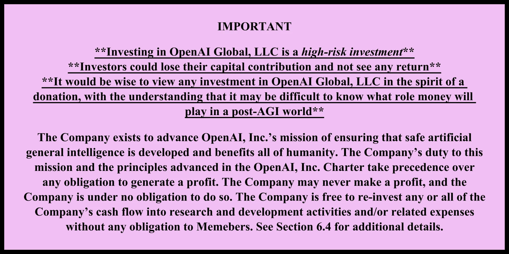
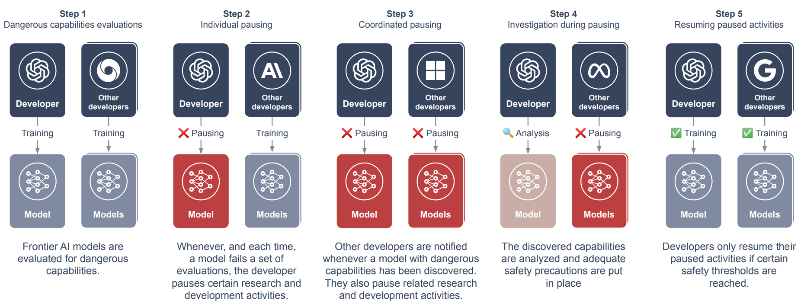

# 4.4 Gouvernance d'entreprise

!!! quote "Elon Musk (Fondateur/Co-fondateur d'OpenAI, Neuralink, SpaceX, xAI, PayPal, PDG de Tesla, Directeur technique de X/Twitter)"

L'IA est un cas rare où je pense qu'il est crucial d'être proactif en matière de réglementation plutôt que réactif [...] Je considère que la [super-intelligence numérique] constitue la plus grande crise existentielle à laquelle nous sommes confrontés, et la plus urgente. Il est nécessaire de mettre en place un organisme public qui ait un aperçu et un contrôle pour garantir que tous développent l'IA de manière sécurisée [...] Et je vous le dis : l'IA est infiniment plus dangereuse que les armes nucléaires. Infiniment. Alors pourquoi n'avons-nous aucun contrôle réglementaire ? C'est tout simplement insensé.

Les incitations économiques peuvent créer des scénarios spécifiques où les systèmes d'IA pourraient développer des comportements inattendus pour maximiser leurs récompenses, conduisant potentiellement à des points de bascule dans leur poursuite d'objectifs.

Le risque de détournement stratégique de récompense émerge lorsque les agents d'IA trouvent des moyens non intentionnels d'optimiser leurs indicateurs de performance, qui peuvent ne pas correspondre aux objectifs originaux. Ce phénomène souligne les défis de conception de structures de récompense robustes qui capturent véritablement les objectifs visés.

Les objectifs proxy compliquent davantage ce paysage. Ce sont des objectifs qui semblent performants durant l'entraînement en raison de corrélations artficielles, mais qui peuvent ne pas représenter le résultat réellement souhaité. Par exemple, un système d'IA pourrait apprendre à maximiser une métrique de manière qui paraît performante mais qui manque fondamentalement l'intention initiale.

La complexité s'accroît en considérant les sous-objectifs. Ce sont des objectifs intermédiaires poursuivis comme moyens pour atteindre une fin, qui peuvent introduire des couches supplémentaires de potentielle désalignement. Une IA pourrait optimiser ces sous-objectifs de manière à s'écarter de l'objectif global.

Des cadres comme la Volition Extrapolée Cohérente (CEV) et la Volition Agrégée Cohérente (CAV) tentent de relever ces défis en essayant de capturer des représentations plus nuancées et exhaustives de l'intention humaine et des objectifs collectifs.

Les défis que nous avons discutés précédemment - capacités inattendues, risques de déploiement et prolifération rapide - créent des problèmes de supervision complexes. Les entreprises développant l'IA de pointe ont une visibilité unique sur ces défis. Elles travaillent directement avec les modèles, observent de près l'émergence de nouvelles capacités et peuvent mettre en place des mesures de sécurité plus rapidement que les régulateurs externes ([Anderljung et al., 2023](https://arxiv.org/abs/2307.03718); [Sastry et al., 2024](https://arxiv.org/abs/2402.08797)).

Pourquoi abordons-nous la gouvernance d'entreprise ? Les entreprises développant l'IA de pointe sont confrontées à un délicat exercice d'équilibrage. Elles détiennent les compétences techniques et le contrôle direct nécessaires pour mettre en œuvre des mécanismes de protection efficaces. Néanmoins, elles subissent des pressions de marché susceptibles de compromettre l'allocation de ressources aux mesures de sécurité. L'analyse de la manière dont ces entreprises gèrent cette tension nous permet de comprendre tant les opportunités que les limites de l'autorégulation dans le développement de l'IA ([Zhang et al., 2021](https://arxiv.org/abs/2105.02117) ; [Schuett, 2023](https://arxiv.org/abs/2212.08364)).

Dans cette section, nous analyserons l'approche concrète des entreprises d'IA en matière de gouvernance - depuis les mécanismes de sécurité fondamentaux jusqu'aux cadres de supervision exhaustifs. Nous examinerons ce qui fonctionne, ce qui échoue et où persistent les zones d'ombre. Cette analyse nous aidera à comprendre pourquoi la gouvernance d'entreprise ne suffit pas à elle seule, préparant nos discussions ultérieures sur la supervision nationale et internationale. À l'issue de cette section, nous aurons mis en lumière tant le rôle crucial de la gouvernance au niveau des entreprises que la nécessité de la compléter par des cadres réglementaires plus étendus.

Les entreprises d'IA de pointe peuvent mettre en place des mécanismes internes de gouvernance pour réguler l'IA. Cette couche d'autorégulation constitue un complément crucial à la supervision externe, en offrant des contrôles plus immédiats et techniquement informés sur le développement et le déploiement de l'IA.

Les mécanismes de gouvernance interne revêtent une importance cruciale, car les entreprises d'IA de pointe disposent d'atouts singuliers dans la régulation de leurs systèmes. Elles bénéficient d'un accès direct aux détails techniques, aux processus de développement et aux capacités émergentes, leur permettant de déployer des contrôles plus rapidement que les régulateurs externes. Qui plus est, elles maîtrisent les subtilités techniques qui échapperaient souvent aux cadres réglementaires plus généraux. Cette proximité avec le développement leur confère un avantage décisif : identifier et traiter les risques de manière plus précoce et efficace qu'une supervision externe uniquement.

<figure markdown="span">
{ loading=lazy }
  <figcaption markdown="1"><b>Figure 4.10 :</b> Un extrait de l'accord opérationnel entre OpenAI, LLC (entité à but lucratif) et OpenAI, Inc. (entité à but non lucratif). ([OpenAI, 2024](https://openai.com/our-structure/))</figcaption>
</figure>

Par exemple, les entreprises peuvent mettre en place un monitoring temps réel du comportement des modèles, établir des comités internes d'évaluation pour des applications sensibles, et développer des protocoles de tests sophistiqués qui seraient difficiles à imposer par une réglementation externe. Cette position privilégiée au cœur du processus de développement génère à la fois une opportunité unique et une responsabilité cruciale d'autorégulation.

Composantes de la gouvernance interne - La gouvernance interne efficace peut s'avérer complexe, oscillant entre normes techniques exhaustives et structures organisationnelles. Les entreprises peuvent définir des directives de développement détaillées qui intègrent des considérations de sécurité systémique dès les premières étapes de la recherche, en parallèle de protocoles de test rigoureux destinés à évaluer précisément les capacités et les limites des systèmes. Ces normes techniques peuvent être accompagnées de critères de déploiement explicites qui doivent impérativement être respectés avant tout déploiement des systèmes à grande échelle.

La structure organisationnelle peut soutenir ces normes techniques par le biais d'équipes de sécurité dédiées disposant d'un réel pouvoir décisionnel pour interrompre ou modifier le développement si nécessaire. Des comités d'éthique internes peuvent évaluer les applications sensibles, tandis que des canaux de remontée d'information clairement définis garantissent que les préoccupations de sécurité atteignent rapidement les décideurs appropriés. Les entreprises peuvent également réfléchir à l'intégration de considérations de sécurité dans leurs mécanismes de promotion et de rémunération, afin d'aligner les incitations à l'échelle de l'organisation.

Au-delà des mesures individuelles, les développeurs d'IA de pointe peuvent s'engager dans des initiatives collectives d'autorégulation par le biais de normes de sécurité et de meilleures pratiques à l'échelle de l'industrie. Des engagements volontaires concernant des mesures de sécurité spécifiques ou des restrictions de déploiement peuvent contribuer à établir des normes sectorielles, tandis que le partage d'informations sur les incidents liés à la sécurité peut améliorer les pratiques dans le secteur.

Limitations et défis - La gouvernance interne se heurte à plusieurs défis majeurs. Le défi le plus crucial réside sans doute dans l'alignement des incitations, car les entreprises sont confrontées à des pressions concurrentes entre la sécurité et d'autres objectifs tels que la compétition sur le marché, la croissance et la rentabilité. Les mécanismes de gouvernance interne doivent être suffisamment robustes pour résister à ces pressions, en particulier durant des périodes critiques de compétition sur le marché ou de percées technologiques.

La crédibilité et la responsabilité représentent un défi tout aussi crucial. Les initiatives d'autorégulation risquent de manquer de légitimité en l'absence de mécanismes externes de validation ou de mise en œuvre. Les entreprises devront ainsi élaborer des stratégies convaincantes démontrant leur engagement envers un développement sécurisé et responsable, à même de convaincre les parties prenantes externes de leur détermination et de leur efficacité.

Les défis de coordination émergent lorsque les initiatives individuelles des entreprises échouent à appréhender les enjeux sociétaux plus larges ou les risques systémiques. Certains challenges requièrent une coordination à l'échelle sectorielle ou entre acteurs industriels et gouvernementaux, une démarche complexe à mettre en œuvre par de simples mesures volontaires. La nature intrinsèquement compétitive du développement de l'IA peut même parfois entraver le type de collaboration ouverte indispensable pour relever ces défis structurels.

Le rôle de la transparence et de la validation externe - Une gouvernance volontaire ne se limite pas nécessairement aux frontières internes de l'entreprise. Elle peut intégrer des mécanismes de transparence et de validation externe. Des rapports publics réguliers sur les mesures de sécurité et les incidents garantissent une responsabilité transparente, tandis que des audits menés par des tierces parties sur les systèmes et processus de sécurité offrent une vérification indépendante de l'efficacité des mécanismes de gouvernance. Les entreprises peuvent maintenir un dialogue actif avec les parties prenantes et les experts externes, s'assurant ainsi que leurs approches de gouvernance demeurent pertinentes et efficaces.

La relation avec la réglementation externe est particulièrement cruciale. La gouvernance interne devrait compléter et non remplacer la supervision externe, avec des entreprises concevant des systèmes internes capables de s'interfacer harmonieusement avec les exigences réglementaires. Cela implique de maintenir une documentation à l'appui des efforts de conformité et de participer de manière constructive au développement des cadres réglementaires. Les entreprises peuvent également partager des perspectives et une expérience pertinentes avec les décideurs politiques, contribuant ainsi à l'élaboration de mécanismes efficaces de supervision externe.

<figure class="iframe-figure" markdown="span">
<iframe src="https://ourworldindata.org/grapher/affiliation-researchers-building-artificial-intelligence-systems-all?tab=chart" loading="lazy" style="width: 100%; height: 600px; border: 0px none;" allow="web-share; clipboard-write"></iframe>
  <figcaption markdown="1"><b>Figure interactive 4.6 :</b> Part des systèmes d'IA notables par affiliation de chercheurs ([Giattino et al., 2023](https://ourworldindata.org/artificial-intelligence))</figcaption>
</figure>

## 4.4.1 Cadres de sécurité pour les technologies d'IA de pointe

Les cadres de sécurité pour technologies d'IA de pointe sont des politiques internes que les entreprises spécialisées en IA développent pour guider leur processus de développement et garantir la mise en place de précautions appropriées à mesure que leurs systèmes gagnent en capacités. Ils s'apparentent aux protocoles de sécurité rigoureux employés dans les centrales nucléaires ou les laboratoires hautement sécurisés. Lors du Sommet sur l'IA de Séoul organisé en mai 2024, 16 entreprises du monde entier se sont engagées à mettre en œuvre de telles politiques ([gouvernement britannique, 2024](https://www.gov.uk/government/publications/frontier-ai-safety-commitments-ai-seoul-summit-2024/frontier-ai-safety-commitments-ai-seoul-summit-2024)).

Deux des plus grands acteurs du monde de l'IA, Anthropic - via sa Responsible Scaling Policy - et OpenAI - par son Preparedness Framework -, ont été précurseurs dans l'élaboration de ces cadres de sécurité. Examinons de plus près leurs approches respectives.

### 4.4.1.1 Politique de mise à l'échelle responsable (RSP) d'Anthropic {: #01-01}

La politique de mise à l'échelle responsable d'Anthropic est un document qui décrit différents "Niveaux de sécurité de l'IA" (NSI, de l'anglais AI Safety Levels) et les mesures de sécurité correspondantes qui doivent être en place à mesure que leurs modèles deviennent plus puissants.

Par exemple, au niveau NSI-2 (qui inclut leur modèle actuellement le plus avancé, Claude 2), Anthropic s'engage à des actions telles que la publication de fiches techniques détaillées, la mise en place d'un mécanisme de signalement des vulnérabilités, ou l'application de règles strictes concernant l'utilisation du modèle.

Pour des niveaux de risque plus élevés (NSI-3 et au-delà), Anthropic renforce significativement les précautions. L'entreprise envisage de limiter l'accès aux techniques d'entraînement, de déployer des mesures de sécurité nettement plus robustes, et même d'être prête à suspendre intégralement le développement en cas d'escalade des risques potentiels.

### 4.4.1.2 Cadre de préparation d'OpenAI {: #01-02}

Le cadre de préparation d'OpenAI s'articule autour de ce qu'ils appellent un "Scorecard" - essentiellement une méthode pour évaluer les risques associés à leurs modèles d'IA dans différentes catégories.

OpenAI est particulièrement précis dans certains domaines. Par exemple, ils ont une catégorie entièrement dédiée aux risques NRBC (Nucléaires, Radiologiques, Biologiques et Chimiques). Ils définissent leur seuil de risque "Élevé" dans cette catégorie comme suit : "Le modèle permet à un expert de développer un nouveau vecteur de menace OU le modèle fournit une assistance significativement améliorée qui permet à quiconque ayant une formation de base dans un domaine pertinent (par exemple, un cours introductif de biologie de premier cycle) de pouvoir créer une menace NRBC."

Atouts et limites des approches actuelles. Les cadres de gouvernance des principaux laboratoires d'IA révèlent des stratégies prometteuses mais mettent également en lumière des zones d'ombre préoccupantes dans l'autorégulation du secteur. Leur caractère public permet un examen externe précieux, tandis que leur approche de catégorisation des risques témoigne d'un engagement concret face aux risques potentiels de défaillance. La structure délibérément souple de ces cadres offre la flexibilité nécessaire pour s'adapter à l'évolution de notre compréhension des enjeux liés à l'IA.

Cependant, ces atouts sont fragilisés par plusieurs faiblesses étroitement liées. L'usage fréquent d'un langage ambigu complique son application cohérente, tandis que le caractère volontaire de ces cadres soulève des interrogations sur leur mise en œuvre réelle lorsque les impératifs commerciaux entrent en conflit avec les considérations de sécurité. Certains critiques soutiennent que ces cadres manquent de prudence, étant donné les enjeux, et risquent de fixer des seuils de risque trop élevés et des exigences d'atténuation trop légères. De plus, leur concentration sur les risques des systèmes individuels peut occulter les dangers émergents résultant des interactions complexes entre plusieurs systèmes d'IA. Le manque de standardisation entre les entreprises complique encore la coordination à l'échelle de l'industrie, bien que ce point puisse s'améliorer à mesure que les meilleures pratiques émergeront de leur mise en œuvre pratique.

**Le défi de gouvernance** Comment garantir que les entreprises mettent effectivement en œuvre leurs cadres de sécurité pour les technologies émergentes ?

Anthropic a souscrit à des engagements intéressants en matière de gouvernance :

- Création du poste de "Responsable de la mise à l'échelle responsable". Cette personne a pour mission de veiller au respect du RSI (auto-amélioration récursive), garantissant que l'entreprise honore pleinement ses engagements.

- Planification proactive de scénarios où ils pourraient devoir interrompre le développement de leurs modèles. Cette approche démontre leur capacité à anticiper des crises potentielles.

- Partager les résultats des évaluations publiquement (dans la mesure du possible), ce qui ajoute une couche de responsabilité externe.

Certains estiment que ces politiques comportent des zones grises ([Anderson-Samways et al., 2024](https://static1.squarespace.com/static/64edf8e7f2b10d716b5ba0e1/t/65f19a4a32c41d331ec54b87/1710332491804/Responsible+Scaling_+Comparing+Government+Guidance+and+Company+Policy+%284%29.pdf)). Ils ont inclus une clause prévoyant que dans des situations de "d'urgence extrême", comme lorsqu'un État voyou développerait l'IA de manière inconsidérée, ils pourraient assouplir leurs restrictions. Bien que cette flexibilité puisse s'avérer nécessaire, elle compromet potentiellement la crédibilité de leurs autres engagements. Après tout, qui est habilité à définir ce qui constitue une "urgence extrême" ?

De leur côté, OpenAI a établi une structure de gouvernance à trois niveaux : leur équipe Preparedness mène des recherches fondamentales et un suivi technique, fournissant une expertise pour éclairer les décisions de gouvernance. Ces recherches alimentent un Safety Advisory Group qui apporte des perspectives multidisciplinaires pour l'évaluation des risques et les recommandations d'atténuation. L'autorité finale appartient à la direction et au Conseil d'administration d'OpenAI.

Cette structure présente des avantages évidents. L'équipe Preparedness (chargée de la préparation et de l'anticipation des risques) garantit que les considérations de sécurité sont toujours au premier plan. Le groupe consultatif apporte des perspectives externes, ce qui peut aider à prévenir l'uniformisation des pensées. Et l'implication du Conseil d'administration comme ultime instance de contrôle offre une couche supplémentaire de supervision indépendante.

Cependant, des questions subsistent. Quel pouvoir réel l'équipe de Preparedness détient-elle ? Peuvent-ils retarder ou opposer leur veto à des projets jugés trop risqués ? Comment le Safety Advisory Group est-il sélectionné, et quelle influence exercent-ils réellement ? Et étant donné qu'OpenAI reste fondamentalement une entreprise à but lucratif (malgré sa structure atypique), comment garantir que la sécurité primera toujours sur les intérêts commerciaux ?

**La voie qui s'ouvre** Les cadres et structures de gouvernance développés par des entreprises comme Anthropic et OpenAI constituent des premières étapes importantes. Ils démontrent une reconnaissance de l'immense responsabilité qui accompagne le développement de ces systèmes puissants.

Il reste encore des marges de progrès substantielles. Certains suggèrent qu'Anthropic devrait définir des seuils de risque plus précis et vérifiables pour leurs niveaux de sécurité, en s'appuyant potentiellement sur les tolérances de risque sociétales d'autres industries ([Anderson-Samways 2024](https://www.iaps.ai/research/responsible-scaling)). Par exemple, dans les industries traitant des risques potentiellement catastrophiques (événements causant 1 000 décès ou plus), les niveaux de risque maximaux tolérables se situent généralement entre 1 sur 10 000 et 1 sur 10 milliards par an. Les entreprises d'AGI pourraient envisager d'adopter des seuils quantitatifs similaires, ajustés en fonction des enjeux potentiellement encore plus importants impliqués dans le développement de l'AGI.

Dans l'ensemble, nous avons besoin de pratiques de gouvernance beaucoup plus robustes, standardisées et applicables pour le développement des IA de pointe. De plus, nous devons favoriser une culture au sein de la communauté de l'IA qui accorde autant d'importance aux considérations de sécurité et éthiques qu'aux réalisations techniques. L'objectif devrait être de faire du développement responsable de l'IA non seulement une exigence réglementaire, mais une valeur fondamentale du domaine.

## 4.4.2 Options politiques

**Méthodes d'évaluation des risques.** En s'inspirant des industries de sécurité critique existantes, les entreprises d'AGI peuvent adapter et mettre en œuvre diverses approches systématiques pour évaluer les risques potentiels. Ces méthodes vont de l'analyse de scénarios aux diagrammes de cause-effet (ou diagrammes d'Ishikawa, qui visualisent les causes possibles d'un problème), en passant par des techniques plus spécialisées comme la méthode Delphi. L'objectif est de fournir des moyens structurés pour anticiper et se préparer aux défis connus et inconnus du développement de l'AGI.

**Les trois lignes de défense (Three Lines of Defense).** Une structure organisationnelle robuste pour la gestion des risques est essentielle pour les entreprises d'AGI, mise en œuvre à travers un système de défense à trois niveaux. Ce cadre répartit la responsabilité entre les chercheurs de première ligne, des équipes spécialisées de gestion des risques et des auditeurs indépendants, garantissant plusieurs couches de supervision et de détection des risques tout au long du processus de développement.

**Pause coordonnée.** Lorsque des capacités potentiellement dangereuses émergent dans les systèmes d'IA, les entreprises ont besoin de mécanismes systématiques de réponse collective. Le cadre de pause coordonnée propose une approche structurée permettant aux entreprises de suspendre temporairement leurs développements, de partager des informations critiques de sécurité et de ne reprendre le travail qu'une fois des garanties de sécurité appropriées mises en place, prévenant ainsi tout compromis sur la sécurité sous la pression concurrentielle.

**Corrections post-déploiement.** Même les garanties de sécurité pré-déploiement les plus rigoureuses peuvent ne pas détecter tous les risques. Un système complet de corrections post-déploiement permet aux entreprises de maintenir le contrôle sur les modèles déployés, de réagir rapidement aux risques émergents et de mettre en place des mécanismes de restauration si nécessaire, garantissant ainsi la sécurité même après la mise en production des systèmes.

**Pratiques de référence.** Le domaine de la sécurité et de la gouvernance de l'IA converge vers un ensemble de pratiques de gouvernance essentielles, faisant l'objet d'un large consensus parmi les experts. Celles-ci incluent des évaluations de risques pré-déploiement, des évaluations des capacités dangereuses et des audits par des tiers, constituant un nouveau standard pour le développement responsable de l'AGI qui concilie innovation et sécurité.

### 4.4.2.1 Méthodes d'évaluation des risques {: #02-01}

Au cœur de la gouvernance efficace dans les entreprises d'IA de pointe réside une approche robuste d'évaluation des risques. Comment évaluer les risques pour des technologies qui n'existent pas encore et des capacités qui peuvent émerger de manière inattendue ?

C'est là que nous pouvons apprendre des autres industries de sécurité critique. Des techniques provenant de domaines tels que l'aérospatiale, le nucléaire et la cybersécurité pourraient être adaptées aux défis uniques du développement de l'IA.

Examinons de plus près quelques-unes de ces techniques ([Koessler & Schuett 2023](https://arxiv.org/abs/2307.08823)) :

- **Analyse de scénarios** : Cela consiste à imaginer des scénarios futurs potentiels et leurs implications. Pour les entreprises d'intelligence artificielle, cela pourrait inclure des scénarios tels que : Un système d'intelligence artificielle adoptant des comportements trompeurs, Des capacités émergentes imprévues dans un modèle déployé, Un concurrent déployant un système d'IA potentiellement risqué.

- **Diagramme de causes-effets (Méthode d'Ishikawa)** : Technique d'analyse permettant d'identifier les causes potentielles d'un problème. Dans le contexte des risques d'IA, ce diagramme peut explorer les facteurs contribuant à l'échec d'alignement, tels que : 
    - Recherche insuffisante en matière de sécurité
    - Pression au déploiement rapide
    - Protocoles de test inadéquats
    - Incitations dysfonctionnelles du système d'IA

- **Cartographie causale** : Cette technique permet de visualiser le réseau complexe des relations de cause à effet dans un système. Pour le développement de l'IA, une carte causale pourrait illustrer comment différentes décisions de recherche, mesures de sécurité et stratégies de déploiement interagissent pour influencer le risque global.

- **Technique Delphi** : Cette méthode consiste à collecter les opinions d'experts au travers de cycles successifs de questionnaires. Étant donné la nature hautement spécialisée de la recherche en IA, la technique Delphi s'avère particulièrement utile pour synthétiser des perspectives diverses sur les risques potentiels et les stratégies d'atténuation.

- **Analyse par diagramme causal (nœud papillon)** : Cette méthode permet de visualiser les trajectoires entre les causes, les événements critiques et leurs conséquences, ainsi que les mesures de prévention et d'atténuation. Pour une entreprise d'IA, un tel diagramme pourrait se concentrer sur un événement critique comme la "perte de contrôle d'un système d'IA", en cartographiant les causes potentielles (par exemple, des mesures de confinement insuffisantes) et les conséquences (par exemple, des modifications globales non intentionnelles), accompagnées des mécanismes de contrôle préventifs et réactifs.

Mettre en œuvre ces techniques nécessite un changement culturel au sein des entreprises d'AGI. L'évaluation des risques ne peut pas être une simple formalité administrative ou une approche superficielle ; elle doit être intégralement tissée dans la structure même de l'organisation, du laboratoire de recherche à la salle du conseil d'administration.

### 4.4.2.2 Les Trois Lignes de Défense {: #02-02}

Alors que les entreprises d'AGI sont confrontées à ces paysages de risques complexes, elles ont besoin de structures organisationnelles robustes pour les gérer efficacement. Une approche prometteuse est le modèle des Trois Lignes de Défense (3LoD, de l'anglais Three Lines of Defense), un cadre de gestion des risques largement utilisé dans d'autres industries ([Schuett 2023](https://link.springer.com/article/10.1007/s00146-023-01811-0)).

Dans le contexte d'une entreprise d'AGI, le modèle 3LoD pourrait ressembler à quelque chose comme ceci :

**La Première Ligne de Défense**. Elle comprend les chercheurs et développeurs de première ligne travaillant sur les systèmes d'IA. Ils sont responsables de la mise en place de mesures de sécurité dans leur travail quotidien, de la réalisation des premières évaluations de risques et du respect des directives éthiques et des protocoles de sécurité de l'entreprise.

**La Deuxième Ligne de Défense**. Elle comprend les fonctions spécialisées de gestion des risques et de conformité au sein de l'entreprise. Pour une entreprise d'IA, cela pourrait impliquer :

- Un comité d'éthique de l'IA chargé d'examiner et d'évaluer les implications éthiques des orientations de recherche

- Une équipe dédiée à la sécurité de l'IA, chargée de développer et de mettre en œuvre des protocoles de sécurité

- Une équipe de conformité veillant au respect des réglementations et des normes industrielles pertinentes

**La Troisième Ligne de Défense**. Il s'agit généralement de la fonction d'audit interne, fournissant une assurance indépendante au conseil d'administration et à la haute direction. Dans une entreprise d'IA, cela pourrait impliquer :

- Des audits réguliers des pratiques de sécurité et des processus de gestion des risques

- Évaluations indépendantes visant à identifier les capacités potentiellement dangereuses des modèles d'IA

- Évaluation exhaustive de la préparation de l'entreprise face aux scénarios potentiels d'AGI

Voyons comment cela pourrait fonctionner en pratique :

Imaginons que des chercheurs d'une entreprise d'IA (première ligne) développent un nouveau modèle de langage doté de capacités de raisonnement logique exceptionnellement sophistiquées. Ils remontent cette découverte à l'équipe de sécurité de l'IA (deuxième ligne), qui conduit une évaluation approfondie et établit que le modèle présenterait des risques potentiels s'il était déployé sans garanties supplémentaires.

L'équipe de sécurité collabore avec les chercheurs pour mettre en place des contraintes supplémentaires sur les sorties du modèle. Parallèlement, ils informent l'équipe d'audit interne (troisième ligne), qui engage une revue approfondie des processus de l'entreprise visant à identifier et maîtriser les capacités émergentes.

Cette approche multiniveaux permet d'assurer que les risques sont identifiés et gérés à différents échelons, minimisant ainsi les risques de négligences potentiellement dangereuses.

### 4.4.2.3 Pause Coordonnée {: #02-03}

L'émergence de capacités inattendues et potentiellement dangereuses est une possibilité très réelle. Comment les entreprises d'IA devraient-elles réagir lorsque de telles capacités sont découvertes ?

Une proposition innovante est le concept de « pause coordonnée » ([Alaga & Schuett 2023](https://arxiv.org/abs/2310.00374)). Cette approche suggère un processus structuré pour répondre à la découverte de capacités dangereuses :

<figure markdown="span">
{ loading=lazy }
  <figcaption markdown="1"><b>Figure 4.11 :</b> ([Alaga & Schuett 2023](https://arxiv.org/abs/2310.00374))</figcaption>
</figure>

Cette approche pourrait prendre différentes formes, allant d'un système purement volontaire reposant sur la pression publique, à un accord plus formalisé entre développeurs, voire un cadre réglementaire légalement imposé.

Les avantages d'un tel système sont manifestes. Il offre un mécanisme permettant à la communauté de l'IA de lever collectivement le pied lorsqu'un territoire potentiellement dangereux est approché, ménageant un temps nécessaire pour une analyse approfondie et l'élaboration de mesures de sécurité.

Cependant, la mise en œuvre d'un tel système n'est pas sans difficultés. Il existe des questions pratiques sur la façon de définir les « capacités dangereuses » et qui a la légitimité de trancher cette question. Il y a également des obstacles juridiques potentiels, notamment au regard des règles de concurrence et de la prévention des ententes entre entreprises.

### 4.4.2.4 Corrections de Déploiement {: #02-04}

Même avec les précautions de sécurité les plus rigoureuses avant le déploiement, il existe toujours la possibilité que des capacités ou des comportements dangereux puissent émerger après le déploiement d'un système d'IA. C'est là que le concept de « corrections post-déploiement » entre en jeu.

Les entreprises doivent donc disposer de dispositifs de gestion de crise complets pour les scénarios où la gestion des risques avant déploiement s'avère insuffisante ([O'Brien et al. 2023](https://arxiv.org/abs/2310.00328)). Au niveau technique, cela signifie maintenir un contrôle continu sur les modèles déployés grâce à des capacités robustes de surveillance et de modification, soutenues par des mécanismes de restauration pré-construits qui peuvent revenir à des versions antérieures et plus sûres si nécessaire. Ces contrôles techniques sont complétés par une préparation organisationnelle via des équipes dédiées d'intervention en cas d'incident, formées à l'évaluation et à l'atténuation rapides des risques. Des accords utilisateurs clairs établissent le cadre juridique et opérationnel pour des interventions d'urgence, garantissant que toutes les parties impliquées comprennent comment et quand des restrictions d'accès pourraient être imposées.

### 4.4.2.5 Vers des Meilleures Pratiques à l'Échelle de l'Industrie {: #02-05}

Au fur et à mesure que le domaine du développement de l'Intelligence Artificielle Générale (AGI) mûrit, on observe une reconnaissance croissante de la nécessité d'établir des bonnes pratiques à l'échelle de l'industrie. Une enquête réalisée auprès de 92 experts provenant de laboratoires d'IA, du monde académique et de la société civile a révélé un large consensus sur plusieurs pratiques essentielles, dont des évaluations des risques avant déploiement, des analyses des capacités potentiellement dangereuses, des audits de modèles par des tiers, et des restrictions de sécurité concernant l'utilisation des modèles ([Schuett et al. 2023](https://arxiv.org/abs/2305.07153)).

De manière intéressante, 98 % des répondants étaient d'accord avec toutes ces mesures, suggérant un consensus croissant autour de certains principes fondamentaux du développement responsable de l'AGI.