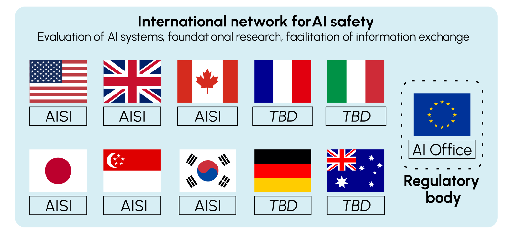
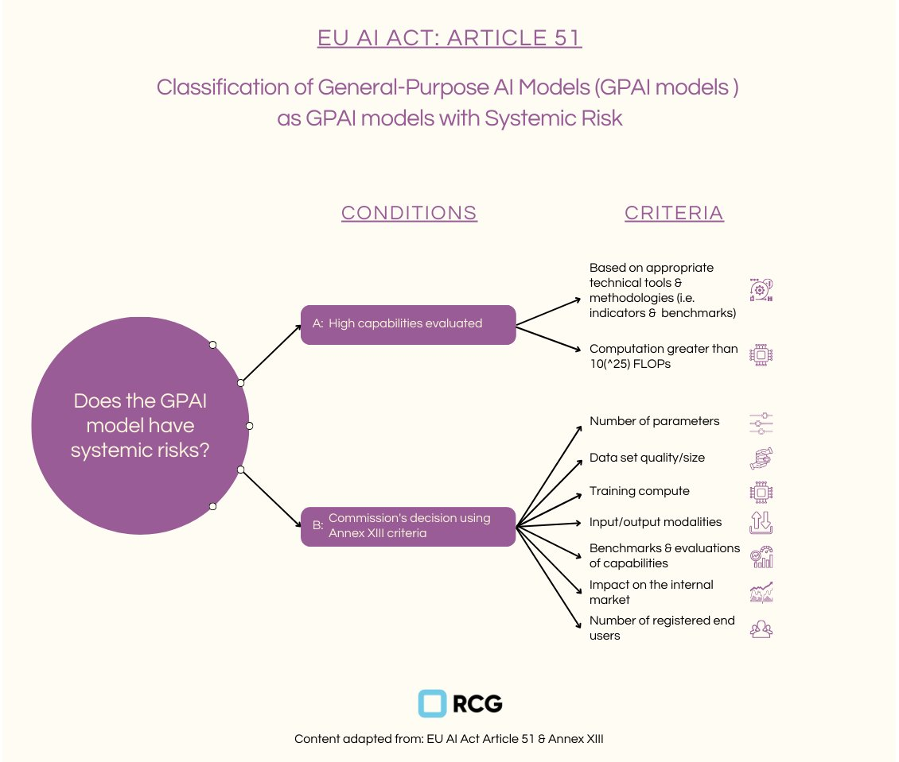
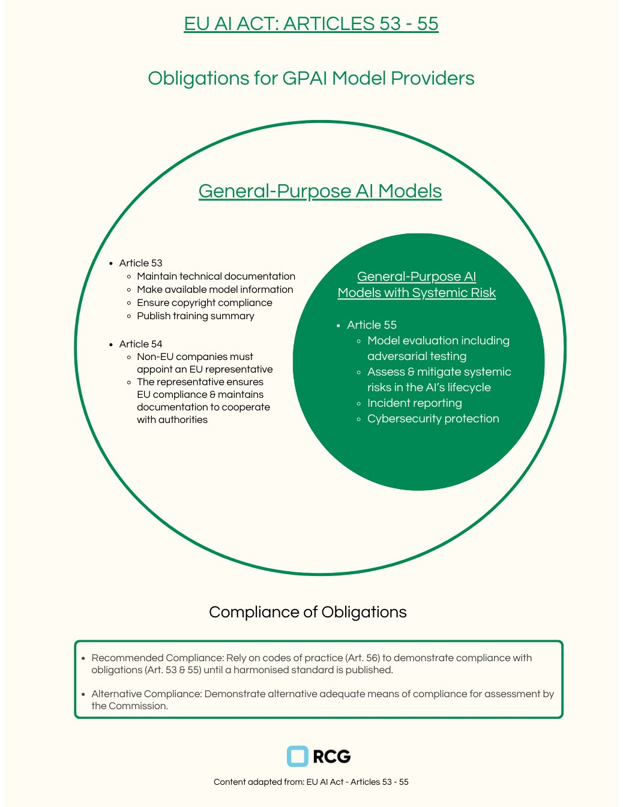
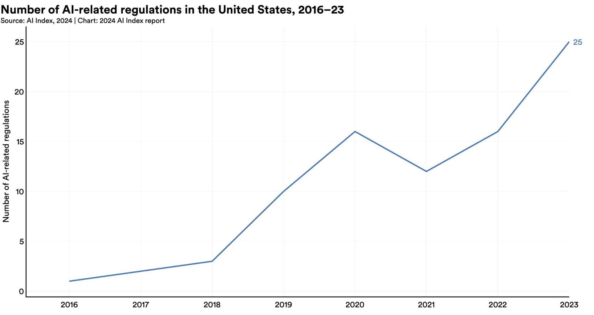
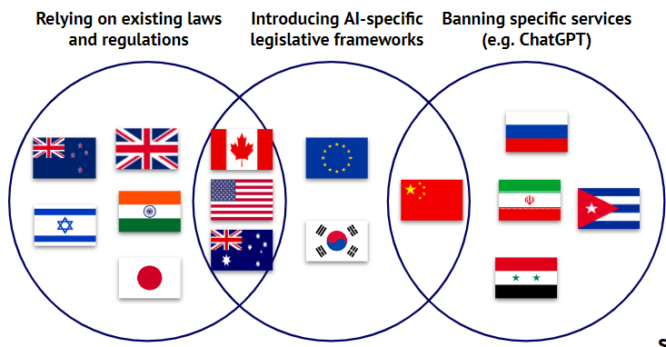

# 4.5 Gouvernance Nationale

## 4.5.1 Le besoin de gouvernance nationale {: #01}

!!! quote "Zhang Jun (Ambassadeur de la Chine auprès de l'ONU)"

L'impact potentiel de l'IA pourrait dépasser les limites cognitives humaines. Pour garantir que cette technologie bénéficie toujours à l'humanité, nous devons réguler le développement de l'IA et empêcher cette technologie de devenir un cheval sauvage incontrôlable [...] Nous devons renforcer la détection et l'évaluation de l'ensemble du cycle de vie de l'IA, en veillant à ce que l'humanité conserve la capacité d'interrompre son développement aux moments critiques.

Bien que les principales entreprises d'IA aient mis en place diverses mesures d'autorégulation pour assurer le développement sécurisé des systèmes d'IA de pointe, compter uniquement sur l'autorégulation des entreprises s'avère insuffisant pour protéger les intérêts nationaux et le bien public. Ces mesures volontaires, bien qu'elles permettent de réagir rapidement aux problèmes émergents et de progresser plus vite que la réglementation gouvernementale, présentent des limites : les entreprises peuvent manquer d'incitations pour évaluer pleinement les impacts sociétaux, faire face à des pressions concurrentielles qui compromettent les considérations de sécurité, et ne pas disposer de la légitimité nécessaire pour prendre des décisions affectant des populations entières. 

Les cadres de gouvernance nationale deviennent dès lors essentiels pour garantir une supervision et une responsabilité globales. Un cadre réglementaire national robuste doit non seulement s'appuyer sur ces efforts d'autorégulation, mais également les compléter. Il devrait établir un socle de normes contraignantes pour toutes les entreprises, tout en leur laissant la possibilité de dépasser ces exigences minimales dans leurs pratiques internes.

Adéquation institutionnelle et le défi de l'IA de pointe - Le concept d'adéquation institutionnelle — qui mesure la correspondance entre les institutions de gouvernance et l'échelle, la portée et les caractéristiques des problèmes qu'elles cherchent à résoudre — est crucial. Il permet de comprendre pourquoi la gouvernance nationale de l'IA de pointe est à la fois nécessaire et complexe. Cette approche nous aide à analyser si les organes et cadres réglementaires existants sont véritablement outillés pour relever les défis uniques posés par les systèmes d'IA de pointe, ou si de nouveaux dispositifs institutionnels sont indispensables.

La gouvernance des systèmes d'IA de pointe pose un défi spécifique en termes d'adéquation institutionnelle. Contrairement aux défis traditionnels de gouvernance technologique, ces systèmes d'IA génèrent des effets secondaires complexes qui s'étendent à plusieurs domaines - de la sécurité nationale à la stabilité économique, de l'équité sociale au fonctionnement démocratique. Les organes réglementaires traditionnels, conçus pour des domaines technologiques plus restreints, peuvent manquer de la portée, des compétences techniques ou de l'autorité institutionnelle nécessaires pour gouverner efficacement ces systèmes ([Dafoe, 2023](https://academic.oup.com/edited-volume/41989/chapter-abstract/408516484?redirectedFrom=fulltext&login=false)).

Considérez le contraste avec les véhicules autonomes, où les répercussions principales sont relativement bien définies (sécurité des usagers de la route) et s'inscrivent dans les cadres réglementaires existants (agences de sécurité routière) ([Dafoe, 2023](https://academic.oup.com/edited-volume/41989/chapter-abstract/408516484?redirectedFrom=fulltext&login=false)). Les systèmes d'IA de pointe, en revanche, génèrent des effets qui transcendent les frontières réglementaires traditionnelles, appelant de nouvelles modalités institutionnelles.

Combler les lacunes institutionnelles - La gouvernance de l'IA de pointe met en lumière plusieurs déficits structurels dans les cadres réglementaires actuels ([Dafoe, 2023](https://academic.oup.com/edited-volume/41989/chapter-abstract/408516484?redirectedFrom=fulltext&login=false)). Le déficit de compétences techniques se manifeste par l'incapacité récurrente des organes réglementaires traditionnels à évaluer correctement les systèmes d'IA avancés. Cette situation impose soit le développement de nouvelles capacités techniques au sein des institutions existantes, soit la création d'organismes réglementaires hautement spécialisés, soit l'établissement de partenariats innovants entre les instances gouvernementales et les experts techniques.

Une lacune de coordination existe du fait de la nature transversale des externalités de l'IA de pointe. De nouveaux mécanismes de coordination sont requis entre les différentes agences réglementaires, les autorités fédérales et locales/étatiques, les entités des secteurs public et privé, ainsi que les organes de gouvernance nationaux et internationaux.

Le déficit temporel émerge du rythme rapide du développement de l'IA, créant un décalage avec les processus réglementaires traditionnels. Les cadres de gouvernance doivent être adaptables aux changements technologiques, capables d'anticiper les développements futurs et de réagir rapidement aux risques émergents.

Défis de mise en œuvre - Plusieurs facteurs compliquent l'établissement d'une gouvernance nationale efficace. La polarisation politique peut entraver l'émergence d'un consensus sur les approches de gouvernance, notamment concernant le niveau approprié de supervision étatique, l'équilibre entre innovation et régulation, la répartition des bénéfices et des risques, ainsi que la protection des libertés civiles.

La complexité technique pose des défis pour une supervision et un suivi efficaces, le développement de normes appropriées, l'évaluation de la conformité, ainsi que la gestion et l'évaluation des risques.

La gouvernance des systèmes d'IA de pointe requiert une transformation institutionnelle majeure au niveau national. Bien que les cadres réglementaires existants offrent une base préliminaire, les caractéristiques singulières de l'IA de pointe - ses effets systémiques étendus, son développement rapide et ses implications politiques profondes - imposent de nouvelles approches de gouvernance. La réussite dépendra d'une attention méticuleuse à l'adéquation institutionnelle, à la représentation des parties prenantes et à l'équilibre subtil entre des intérêts et des valeurs potentiellement divergents ([Dafoe, 2023](https://academic.oup.com/edited-volume/41989/chapter-abstract/408516484?redirectedFrom=fulltext&login=false)).

La gouvernance nationale est également plus complexe à créer et à maintenir que les efforts d'autorégulation des entreprises, car les lois et réglementations résultent d'un processus d'élaboration politique parfois long et complexe, qui se déroule en phases distinctes, offrant chacune des marges d'action pour les acteurs de la gouvernance. Lors de la phase d'inscription à l'agenda politique, ces acteurs s'emploient à mettre en lumière des enjeux spécifiques liés à l'IA au sein du débat public et politique. La phase de formulation consiste à élaborer des propositions politiques détaillées, tandis que la mise en œuvre transforme ces propositions en mesures concrètes. Tout au long de ce cycle, l'évaluation et l'adaptation demeurent essentielles, permettant aux approches de gouvernance d'évoluer en réponse au paysage de l'IA en mutation rapide.

Le développement de cadres de gouvernance nationaux efficaces pour l'IA de pointe n'est pas seulement un défi technique, mais un défi politique et institutionnel fondamental. Cela nécessite de construire de nouvelles capacités tout en maintenant la légitimité démocratique et en équilibrant de multiples intérêts concurrents. Alors que les capacités de l'IA continuent de progresser, la capacité à développer et mettre en œuvre de tels cadres deviendra de plus en plus cruciale pour le bien-être et la sécurité nationale.

## 4.5.2 Initiatives actuelles {: #02}

### 4.5.2.1 Instituts de Sécurité de l'IA {: #02-01}

!!! quote "Rishi Sunak (Ancien Premier ministre du Royaume-Uni)"

Je produirai la traduction finale après réflexion.

« Si nous ne faisons pas attention, l'IA pourrait faciliter la fabrication d'armes chimiques ou biologiques. Les groupes terroristes pourraient utiliser l'IA pour répandre la peur et la destruction à une échelle encore plus grande. Les criminels pourraient exploiter l'IA pour des cyberattaques, de la désinformation, de la fraude, voire des abus sexuels sur enfants. Et dans les cas les plus improbables mais extrêmes, il existe même le risque que l'humanité perde totalement le contrôle de l'IA, à travers le type d'IA parfois désigné comme "super-intelligence" (superintelligence). »

« Si nous ne faisons pas attention, l'IA pourrait faciliter la fabrication d'armes chimiques ou biologiques. Les groupes terroristes pourraient utiliser l'IA pour répandre la peur et la destruction à une échelle encore plus grande. Les criminels pourraient exploiter l'IA pour des cyberattaques, de la désinformation, de la fraude, voire des abus sexuels sur enfants. Et dans les cas les plus improbables mais extrêmes, il existe même le risque que l'humanité perde totalement le contrôle de l'IA, à travers le type d'IA parfois désigné comme "super-intelligence" (superintelligence). »

Les gouvernements du monde entier ont reconnu un besoin urgent de comprendre et de gérer les capacités et les risques des systèmes d'intelligence artificielle avancés. Cela a conduit à la création d'Instituts de Sécurité de l'IA (AISI, de l'anglais AI Safety Institutes), des organismes gouvernementaux spécialisés conçus pour évaluer, rechercher et coordonner les efforts visant à garantir que le développement de l'IA se déroule de manière sûre et bénéfique.

Le Mouvement Mondial Émergent vers la Sécurité de l'IA - Ces derniers mois ont été marqués par une progression remarquable dans l'établissement d'AISI au sein des principales puissances technologiques. Les États-Unis, le Royaume-Uni, le Japon, le Canada et Singapour ont tous lancé leurs propres instituts, tandis que l'Union européenne a intégré ces responsabilités dans son Bureau de l'IA par le biais d'une Unité de Sécurité de l'IA dédiée.

<figure markdown="span">
{ loading=lazy }
  <figcaption markdown="1"><b>Figure 4.12 :</b> Instituts de Sécurité de l'IA annoncés ([Martinet & Variengien, 2024](https://oecd.ai/en/wonk/ai-safety-institutes-challenge))</figcaption>
</figure>

Fonctions Principales des Instituts de Sécurité de l'IA (AISI) - Nous pouvons considérer les Instituts de Sécurité de l'IA comme servant trois objectifs fondamentaux, chacun s'appuyant sur les autres pour créer une approche globale de la sécurité de l'IA. Premièrement, ils évaluent les systèmes d'IA par le biais de protocoles de tests et d'évaluation. Cela implique de développer de nouvelles méthodologies pour comprendre les capacités, les limites et les impacts potentiels de ces systèmes sur la société. Deuxièmement, ils peuvent aider à mener des recherches fondamentales en sécurité de l'IA, en réunissant des experts de différentes disciplines pour faire progresser notre compréhension de la façon de construire et de déployer des systèmes d'IA de manière sûre. Enfin, ils servent de plateformes de collaboration et de partage, créant des canaux pour échanger des perspectives cruciales entre les différents acteurs, des décideurs politiques aux entreprises privées.

Coordination et Collaboration Internationales - Les Instituts de Sécurité de l'IA ont été conçus dès le départ pour travailler ensemble au-delà des frontières. L'aboutissement de cette vision internationale a été réalisé lors du Sommet de l'IA de Séoul en mai 2024, où dix pays et l'Union européenne ont établi un réseau pour la sécurité de l'IA.

Défis Pratiques et Solutions - Bien que la perspective de collaboration internationale à travers les AISI soit prometteuse, plusieurs défis pratiques doivent être surmontés. Premièrement, il existe un équilibre délicat entre le partage d'informations sensibles sur les capacités des systèmes d'IA et la protection des secrets commerciaux et des intérêts de sécurité nationale. Ensuite, se pose le défi des disparités de capacités techniques entre les nations – tous les pays ne disposent pas des mêmes ressources pour attirer les meilleurs talents en IA ou conduire des évaluations approfondies. Certains instituts, à l'instar de l'AISI britannique, ont développé des approches innovantes face à ce défi, comme l'ouverture de bureaux dans des pôles de talents en IA tels que San Francisco.

Perspectives d'Avenir - Au fur et à mesure que ces instituts gagneront en maturité, ils joueront vraisemblablement un rôle de plus en plus crucial dans l'élaboration de normes internationales, la conduite d'évaluations et la garantie que le développement de l'IA se déroule de manière à bénéficier à l'humanité tout en minimisant les risques potentiels. Leur réussite dépendra non seulement de leur expertise technique, mais aussi de leur capacité à favoriser une collaboration significative par-delà les frontières et entre les différents acteurs de l'écosystème de l'intelligence artificielle.

### 4.5.2.2 La Loi Européenne sur l'IA {: #02-02}

La Loi européenne sur l'IA aborde les modèles d'Intelligence Artificielle à Usage Général (IAUG, de l'anglais General Purpose Artificial Intelligence), et nous nous concentrerons ici sur ce que la Loi sur l'IA appelle les modèles d'IAUG présentant des risques systémiques - l'équivalent des modèles d'IA de pointe.

La Loi adopte une double approche pour identifier les modèles d'IAUG présentant un risque systémique. Premièrement, un seuil computationnel est défini : tout modèle nécessitant plus de 10^25 opérations à virgule flottante (FLOPs, de l'anglais *Floating Point Operations*) lors de son entraînement est automatiquement classé comme présentant un risque systémique. Pour mettre cela en perspective, l'entraînement d'un tel modèle requiert actuellement un investissement de dizaines de millions d'euros. Cependant, la puissance computationnelle n'est pas le seul critère considéré. La Commission peut également désigner des modèles comme systémiques en fonction de leur impact potentiel, en évaluant des facteurs tels que la taille de la base d'utilisateurs, le potentiel de passage à l'échelle et la capacité à causer des dommages de grande ampleur. Cette approche flexible garantit que la réglementation peut s'adapter aux risques émergents, même lorsqu'ils proviennent de modèles qui ne satisfont pas au seuil computationnel.

<figure markdown="span">
{ loading=lazy }
  <figcaption markdown="1"><b>Figure 4.13 :</b> La Loi sur l'IA de l'UE : Classification des modèles d'IA à usage général présentant des risques systémiques (source : [Observatorio de Riesgos Catastróficos Globales](https://www.orcg.info/articulos/infografas-ley-de-inteligencia-artificial-de-la-unin-europea))</figcaption>
</figure>

Obligations des Fournisseurs et Conformité - À partir du 2 août 2025, les fournisseurs de modèles d'IAUG devront respecter diverses obligations, avec des exigences supplémentaires pour les modèles considérés comme présentant des risques systémiques. Tous les fournisseurs d'IAUG doivent maintenir une documentation technique détaillée et fournir des informations exhaustives aux fournisseurs en aval qui intègrent leurs modèles. Ils doivent également mettre en place des politiques de conformité aux droits d'auteur et publier des résumés de leurs données d'entraînement. Pour les modèles présentant des risques systémiques, les exigences s'intensifient. Ces fournisseurs doivent réaliser des évaluations approfondies, incluant des tests de robustesse (adversarial testing) pour identifier les vulnérabilités potentielles. Ils doivent également suivre et signaler les incidents graves, mettre en place des protections de cybersécurité robustes et travailler activement à l'évaluation et à l'atténuation des risques systémiques.

<figure markdown="span">
{ loading=lazy }
  <figcaption markdown="1"><b>Figure 4.14 :</b> La Loi sur l'IA de l'UE : Obligations des fournisseurs de modèles d'IA à usage général ([Observatorio de Riesgos Catastróficos Globales](https://www.orcg.info/articulos/infografas-ley-de-inteligencia-artificial-de-la-unin-europea))</figcaption>
</figure>

Mise en Œuvre et le Bureau de l'IA - La Loi européenne sur l'IA établit le Bureau de l'IA - qui agit également comme l'Institut de Sécurité de l'IA de l'UE - comme une autorité de contrôle puissante. Ce bureau peut demander des informations, conduire des évaluations de modèles et imposer des mesures correctives si nécessaire. Les pénalités pour non-conformité sont substantielles – les fournisseurs peuvent faire face à des amendes pouvant atteindre 3 % de leur chiffre d'affaires annuel global ou 15 millions d'euros, selon le montant le plus élevé. Ce mécanisme de mise en application robuste reflète l'engagement de l'UE à garantir que les systèmes d'IA puissants soient développés et déployés de manière responsable.

Le Rôle du Code de Bonnes Pratiques - La Loi introduit une approche innovante de conformité à travers un Code de Bonnes Pratiques. Bien que non contraignant, ce code offre aux fournisseurs une voie pratique pour démontrer leur alignement avec les exigences de la Loi.

### 4.5.2.3 Le Décret Présidentiel Américain sur l'IA {: #02-03}

Les États-Unis ont connu une prolifération notable d'initiatives législatives ces dernières années. Le Décret Présidentiel sur l'IA, signé par le président Joe Biden le 30 octobre 2023, se distingue particulièrement. Sa Section 4 représente l'une des extensions réglementaires les plus étendues dans le domaine du développement de l'IA aux États-Unis. Il introduit des mesures de sécurité et de protection qui façonneront l'avenir du développement de l'intelligence artificielle aux États-Unis.

<figure markdown="span">
{ loading=lazy }
  <figcaption markdown="1"><b>Figure 4.15 :</b> Nombre de réglementations liées à l'IA aux États-Unis, 2016-2023 ([Rapport sur l'index IA 2024](https://aiindex.stanford.edu/report/))</figcaption>
</figure>

Nouvelles Exigences de Déclaration pour les Entreprises d'IA - Le décret établit des exigences de déclaration pour les entreprises impliquées dans le développement de l'IA. Les entreprises développant des modèles foundationnels à double usage - des modèles d'IA sophistiqués entraînés sur des jeux de données larges utilisant l'auto-supervision et contenant des dizaines de milliards de paramètres - doivent fournir des rapports détaillés sur leurs activités. Ces rapports doivent couvrir leurs processus d'entraînement, les mesures de sécurité, les stratégies de protection des poids de modèle et les résultats des tests de red team (simulation d'attaque). De même, les entités exploitant des clusters informatiques à grande échelle doivent divulguer leurs emplacements et la puissance de calcul totale disponible.

Réglementations sur l'Infrastructure et les Entités Étrangères - Un aspect particulièrement intéressant de la Section 4 concerne les nouvelles réglementations pour les fournisseurs d'Infrastructure en tant que Service (IaaS). Ces entreprises doivent désormais signaler lorsque des entités étrangères utilisent leurs services pour l'entraînement d'IA qui pourrait permettre des activités préoccupantes. Cette exigence s'étend aux revendeurs étrangers de services IaaS américains, créant un système de surveillance complet de l'infrastructure de développement de l'IA. Le secrétaire au commerce doit rédiger des réglementations exigeant que ces fournisseurs vérifient l'identité des personnes étrangères obtenant des comptes IaaS et établissent des normes minimales de vérification et de conservation des dossiers - essentiellement, un processus de connaissance du client.

## 4.5.3 Options Politiques {: #03}

Un régime de gouvernance national complet pour la sécurité de l'IA nécessite trois mécanismes interconnectés : développement de normes de sécurité, visibilité réglementaire et application de la conformité ([Anderljung et al. 2023](https://arxiv.org/abs/2307.03718)). Ces composants peuvent travailler ensemble pour créer un cadre capable de gérer efficacement les risques associés au développement et au déploiement de l'IA.

Mécanismes de développement des normes de sécurité - En premier lieu, nous devons établir des processus permettant d'identifier les exigences appropriées pour les développeurs d'IA de pointe, capables d'évoluer au rythme de la technologie. Les normes de sécurité constituent le fondement de la gouvernance de l'IA en établissant des critères clairs et mesurables pour le développement, les tests et le déploiement des systèmes d'IA. Ces normes doivent être techniquement précises tout en conservant la flexibilité nécessaire pour s'adapter aux progrès technologiques rapides.

Le développement des normes de sécurité de l'IA implique généralement plusieurs parties prenantes, notamment des experts techniques, des représentants industriels, des organisations de la société civile et des agences gouvernementales. Les organisations de développement de normes (ODS, de l'anglais Standards Development Organizations) jouent souvent un rôle central de coordination dans ce processus. À titre d'exemple, le National Institute of Standards and Technology (NIST) aux États-Unis a élaboré des cadres de gestion des risques liés à l'IA qui servent de référentiel volontaire.

Mécanismes garantissant la visibilité réglementaire - La deuxième composante vise à établir des mécanismes permettant aux régulateurs d'obtenir une transparence approfondie sur les processus de développement de l'IA de pointe. Cette démarche est cruciale pour anticiper les risques potentiels et assurer la conformité aux normes établies. Les mécanismes de visibilité réglementaire permettent aux organismes de supervision de surveiller efficacement le développement et le déploiement de l'IA. Ils fournissent aux régulateurs les informations et l'accès nécessaires pour évaluer la conformité aux normes de sécurité et identifier les risques émergents.

Mécanismes garantissant la conformité - Le troisième pilier consiste à mettre en place des mécanismes assurant le respect des normes de sécurité pour le développement et le déploiement des modèles d'IA de pointe. C'est ici que l'on passe véritablement de la théorie à la pratique en matière d'application. Les mécanismes de conformité transforment les normes de sécurité, passant de cadres théoriques à des exigences concrètes aux implications réelles. Ces mécanismes doivent trouver un équilibre délicat entre l'efficacité de l'application et la nécessité de préserver l'innovation.

### 4.5.3.1 Mécanismes de développement des normes de sécurité {: #03-01}

Différentes approches de développement des normes de sécurité existent, allant des organismes traditionnels de normalisation aux processus plus dynamiques impliquant plusieurs parties prenantes, comme le Code de pratique du GPAI (Grand Modèle d'IA, de l'anglais Generative Pre-trained AI) de l'UE. Ce Code, actuellement en cours d'élaboration, démontre l'importance vitale du processus de normalisation. Bien qu'il ne s'agisse pas d'un mécanisme de normalisation traditionnel, il sert à spécifier les obligations de haut niveau décrites dans la Loi sur l'Intelligence Artificielle de l'UE pour les modèles GPAI.

La Loi exige que les fournisseurs de modèles GPAI (Grand Modèle d'IA, de l'anglais Generative Pre-trained AI) présentant des risques systémiques doivent "assurer un niveau de protection de cybersécurité adéquat pour le modèle d'IA à usage général présentant un risque systémique et son infrastructure physique." Cependant, cette exigence générale soulève de nombreuses questions cruciales : Que recouvre précisément un niveau de "protection adéquat" ? Qu'englobe exactement l'"infrastructure physique" et le "modèle" ? Quelles preuves peuvent attester de manière satisfaisante leur protection ? Par quelles mesures spécifiques cette protection devrait-elle être mise en place ?

Ces questions mettent en lumière l'importance cruciale de la standardisation - les organisations ont besoin de directives précises pour respecter efficacement leurs obligations légales. L'ambiguïté juridique, susceptible d'être parfois exploitée par les entreprises, peut également générer des défis opérationnels et des risques substantiels pour les entreprises qui développent et déploient des systèmes d'IA.

Ce qui nécessite une standardisation - l'exemple de la protection de cybersécurité - La protection des actifs essentiels de l'IA nécessite une architecture de sécurité à plusieurs niveaux qui traite des vulnérabilités distinctes mais interconnectées. Quatre composants critiques exigent une protection : les poids du modèle, le code source, les données d'entraînement et les données utilisateur. Chacun représente un défi de sécurité unique tout en faisant partie d'un système intégré où une violation dans un domaine pourrait compromettre l'ensemble.

**Poids du modèle** Les poids du modèle constituent le résultat de processus d'entraînement approfondis, requérant bien souvent des ressources informatiques considérables et des ensembles de données exclusifs. Pour des entreprises comme OpenAI, Anthropic ou Google, ces poids représentent une part substantielle de leur avantage concurrentiel. Leur divulgation pourrait permettre à des concurrents ou à des acteurs malveillants de reproduire leurs modèles, potentiellement en contournant les mesures de sécurité ou en les détournant de leur usage prévu.

La protection débute par un chiffrement hautement robuste des poids de modèle stockés, accompagné de mécanismes de contrôle d'accès restrictifs limitant la visibilité interne. Une stratégie de sécurité avancée peut également consister à segmenter les poids sur plusieurs emplacements sécurisés, complexifiant considérablement tout accès non autorisé. Une surveillance continue permet de détecter les schémas d'accès suspects ou les transferts de données anormaux, facilitant une intervention rapide en cas de violation potentielle.

**Code Source** Le code source définit comment le modèle traite l'information, prend des décisions et génère des résultats. Pour les entreprises d'IA, ce code représente des années de recherche et de développement, renfermant souvent des algorithmes et des architectures propriétaires.

Protéger le code source n'est pas un défi nouveau - les entreprises de logiciels le font depuis des décennies. Cependant, les enjeux sont autrement plus critiques avec l'IA de pointe. Une fuite pourrait non seulement profiter aux concurrents, mais aussi potentiellement permettre à des acteurs malveillants d'identifier et d'exploiter des vulnérabilités sensibles dans le système d'IA.

Une protection exhaustive requiert des systèmes de contrôle de version sécurisés et à accès contrôlé, gérant l'ensemble des modifications de code. Les techniques avancées comprennent l'obfuscation du code pour en entraver la compréhension en cas de violation, combinées à des audits de sécurité rigoureux et à des normes de codage strictes. Le développement critique peut également se dérouler sur des systèmes complètement isolés (air-gapped), physiquement séparés des réseaux externes afin de prévenir tout accès non autorisé.

**Données d'entraînement** Les données d'entraînement peuvent comprendre un large spectre allant des pages web publiques à des informations propriétaires, et même des données personnelles. Le défi est double : protéger ces données dans leur intégrité et garantir leur utilisation éthique. Une violation pourrait potentiellement exposer des informations sensibles, tandis qu'un mésusage risquerait de générer des modèles d'IA biaisés ou potentiellement préjudiciables.

La protection commence par une anonymisation approfondie des données, en supprimant les informations identificatoires sans compromettre l'utilité de l'entraînement. Des bases de données chiffrées, assorties de contrôles d'accès stricts, sécurisent les données stockées, tandis qu'une traçabilité exhaustive maintient des registres clairs des sources de données et de leurs schémas d'utilisation. Cela permet aux organisations de préserver simultanément la sécurité et la conformité éthique tout au long du processus d'entraînement.

**Données des utilisateurs** C'est probablement l'aspect le plus étroitement réglementé de la cybersécurité de l'IA, encadré par des législations telles que le RGPD en Europe ou la Loi de protection des informations personnelles en Chine. Les données des utilisateurs dans les systèmes d'IA revêtent une sensibilité particulièrement critique – les individus pouvant être amenés à partager des détails personnels intimes, des informations médicales confidentielles ou des secrets professionnels sensibles lors de leurs interactions avec un assistant d'IA.

La protection peut inclure un chiffrement de bout en bout qui sécurise les données à la fois en transit et en stockage, combiné à des principes stricts de minimisation des données pour ne collecter que les informations essentielles. Les contrôles des utilisateurs peuvent offrir des options transparentes de gestion des données, incluant les droits de suppression et les limitations d'utilisation.

**L'élément humain : Les personnes comme le maillon le plus fort (et le plus faible)** Les personnes peuvent être à la fois la défense la plus solide et la plus grande vulnérabilité. L'erreur humaine demeure l'un des risques les plus importants en cybersécurité. Un simple clic mal placé, un mot de passe partagé par négligence, ou la chute dans un piège de phishing peut potentiellement compromettre même le système de sécurité le plus sophistiqué.

C'est pourquoi les principaux laboratoires d'IA investissent massivement dans la formation à la sécurité pour tous les employés, et pas seulement leurs équipes techniques. Il s'agit de créer une culture de la sensibilisation à la sécurité, où chacun comprend son rôle dans la protection de ces ressources précieuses.

### 4.5.3.2 Mécanismes pour assurer la visibilité réglementaire {: #03-02}

L'Importance du Contrôle Externe - Alors que les systèmes d'IA de pointe s'intègrent de plus en plus à la société et à l'économie, les décisions concernant leur entraînement, leur déploiement et leur utilisation auront des implications profondes. Il est crucial que ces décisions ne soient pas laissées aux seules mains des développeurs d'IA.

Le contrôle externe – impliquant des acteurs extérieurs dans l'évaluation des systèmes d'IA par des tests de sécurité (red-teaming), des audits et l'accès de chercheurs externes – offre un outil puissant pour améliorer la sécurité et la responsabilité des systèmes d'IA de pointe.

Pour être efficace, le contrôle externe doit adhérer au cadre ASPIRE ([Anderljung et al. 2023](https://arxiv.org/abs/2311.14711)) :

- Accès : Les examinateurs externes doivent disposer d'un accès approprié aux systèmes d'IA et aux informations pertinentes.

- Posture de recherche active : Les examinateurs doivent activement identifier et explorer les problèmes et vulnérabilités potentiels.

- Proportionnalité des contrôles : Le niveau de scrutiny doit être proportionné aux risques potentiels inhérents au système.

- Indépendance : Les examinateurs doivent être libres de toute influence indue de la part des développeurs d'IA.

- Ressources : Des ressources adéquates doivent être allouées pour soutenir un contrôle approfondi.

- Expertise : Les examinateurs doivent posséder l'expertise technique et spécifique au domaine nécessaire.

L'examen externe des systèmes d'IA peut être structuré de plusieurs manières, en s'inspirant des pratiques établies dans d'autres industries réglementées. Une approche s'apparente à l'audit financier, où des professionnels certifiés réalisent des évaluations standardisées selon des protocoles établis. Ce système peut intégrer différents niveaux d'exigences de divulgation, depuis les tests de sécurité de base jusqu'aux évaluations approfondies des capacités. Certains cadres incluent des conseils éthiques externes au sein des entreprises d'IA, bien que leur autorité et leur influence varient significativement. L'efficacité de ces approches repose souvent sur leur capacité à concilier un contrôle rigoureux avec les contraintes pratiques des délais de développement de l'IA et les limitations de ressources.

Rapport Responsable - Un aspect crucial tant de l'autorégulation que du contrôle gouvernemental est la mise en place de mécanismes de rapport responsables. Les organisations développant et déployant des systèmes d'IA de pointe ont un accès unique aux informations concernant les capacités et les risques potentiels de ces systèmes. En partageant ces informations de manière responsable, elles peuvent améliorer significativement notre capacité collective à gérer les risques liés à l'IA ([Kolt et al. 2024](https://arxiv.org/abs/2404.02675)).

Décomposons ce à quoi pourrait ressembler un rapport responsable dans la pratique :

**Que Rapporter** - Capacités émergentes inattendues ou potentiellement dangereuses

- Quasi-incidents ou incidents de sécurité potentiels lors du développement ou du déploiement

- Percées significatives dans les performances ou les capacités du modèle

- Usages détournés ou tentatives d'usage malveillant de modèles déployés

**À Qui Rapporter** - Organes réglementaires compétents

- Consortiums industriels spécialisés dans la sécurité de l'IA

- Chercheurs académiques travaillant sur l'alignement et la sécurité de l'IA

- Le grand public

**Comment Rapporter** - Via des canaux de rapport sécurisés et standardisés

- Avec des protections appropriées pour la propriété intellectuelle et les informations sensibles

- Dans les meilleurs délais, notamment pour les problèmes de sécurité urgents

Différents systèmes de partage d'informations abordent la tension inhérente entre les besoins de transparence et les intérêts commerciaux de manières variées. Certaines approches reposent sur des architectures à plusieurs niveaux qui adaptent les niveaux de divulgation aux exigences spécifiques des parties prenantes : alors que les régulateurs peuvent accéder à des informations techniques détaillées, les divulgations publiques demeurent plus générales. D'autres systèmes privilégient des mécanismes d'anonymisation permettant le partage de données agrégées tout en préservant les détails confidentiels de chaque entreprise. Les cadres juridiques intègrent parfois des dispositions visant à encourager des rapports transparents, notamment des protections juridiques pour les divulgations effectuées de bonne foi.

Registres de modèles - Au cœur de son concept, un registre de modèles est une base de données centralisée où les informations sur les modèles d'IA sont enregistrées et suivies. Il fonctionne à l'instar d'un acte de naissance – lorsqu'un modèle est déployé, ses créateurs accomplissent les formalités administratives requises.

Mais que contient exactement cette documentation ? Dans différents contextes réglementaires, les approches varient, mais la documentation d'un modèle englobe généralement plusieurs couches d'informations. La documentation de base comprend habituellement l'identification du modèle et ses cas d'utilisation prévus, tandis que les spécifications techniques détaillent son architecture, ses paramètres et les exigences computationnelles. La documentation de performance peut s'étendre des résultats de référence standard à des évaluations spécialisées de capacités ou de risques spécifiques. Les évaluations d'impact peuvent examiner les effets sociétaux potentiels, les implications en matière de sécurité et les considérations éthiques. La documentation de déploiement couvre généralement les stratégies de mise en œuvre et les plans de surveillance.

L'idée est qu'en collectant ces informations, les régulateurs peuvent surveiller le paysage de l'IA, identifier les risques potentiels avant qu'ils ne deviennent des problèmes, et disposer d'une base pour une gouvernance plus ciblée à l'avenir.

**Pourquoi les Registres de Modèles sont Importants** Les registres de modèles peuvent servir plusieurs rôles dans les systèmes de gouvernance de l'IA. En tant que mécanismes de transparence, ils permettent différents niveaux de contrôle indépendant et de visibilité publique et de confiance dans le développement de l'IA. Certains registres fonctionnent comme des systèmes d'alerte précoce pour les capacités ou les risques émergents, permettant une réponse préventive aux préoccupations potentielles - si un modèle est enregistré avec des capacités qui soulèvent des signaux d'alerte, les régulateurs peuvent intervenir avant son déploiement généralisé. Les données accumulées peuvent alimenter l'élaboration des politiques en fournissant des preuves empiriques sur les caractéristiques et les tendances des systèmes d'IA. Au lieu de règles générales uniformes, ils peuvent adapter leur approche en fonction des capacités et des risques spécifiques de différents modèles. Enfin, dans des contextes où les capacités de l'IA revêtent une importance stratégique, les registres peuvent aider les gouvernements à suivre les développements technologiques, informant potentiellement les contrôles à l'exportation ou d'autres mesures de sécurité nationale.

Les gouvernements du monde entier ont déjà commencé à mettre en place des registres de modèles. Les États-Unis, par exemple, ont adopté jusqu'à présent une approche relativement souple, se concentrant principalement sur les modèles d'IA les plus avancés. En octobre 2023, le président Biden a signé un décret présidentiel sur l'IA qui incluait des dispositions pour un registre de modèles. Les États-Unis ont adopté une approche initialement ciblée pour l'enregistrement des modèles, concentrant la supervision sur les systèmes d'IA les plus avancés tout en maintenant une flexibilité pour une expansion future. Cette stratégie, formalisée dans le décret présidentiel d'octobre 2023, établit des seuils précis basés sur les capacités de calcul pour les exigences d'enregistrement. Les systèmes dépassant 10^26 opérations virgule flottante lors de l'entraînement doivent fournir une documentation exhaustive de leurs capacités et limitations. Ils doivent également divulguer les mesures prises pour protéger leurs modèles contre tout accès non autorisé ou vol.

La Chine a adopté une approche distincte, se concentrant sur les systèmes de recommandation algorithmique plutôt que sur les modèles d'IA proprement dits. Les Dispositions de Régulation des Algorithmes de Recommandation sur Internet, entrées en vigueur en 2022, ciblent les systèmes en fonction de leur potentiel d'influence sur le discours public et les dynamiques sociales. Ce cadre réglementaire exige un enregistrement détaillé des algorithmes utilisés sur diverses plateformes numériques, avec un accent particulier sur ceux susceptibles d'influencer l'opinion publique ou de mobiliser des groupes sociaux. Les entreprises doivent divulguer non seulement les détails techniques mais aussi les principes sous-jacents et les objectifs intentionnels de leurs algorithmes, créant ainsi une transparence complète autour de leurs capacités et intentions.

**Défis** Comme vous pouvez l'imaginer, la mise en œuvre des registres de modèles n'a pas été sans difficultés :

1. Délimiter le Champ d'Application : L'un des plus grands défis consiste à déterminer quels modèles devraient être soumis aux exigences d'enregistrement. Placer la barre trop bas risquerait de freiner l'innovation par une bureaucratie excessive. La placer trop haut pourrait faire manquer des systèmes potentiellement risqués.

2. Protection de la Propriété Intellectuelle : Les entreprises d'IA investissent des ressources énormes dans le développement de leurs modèles et sont naturellement réticentes à partager trop de détails sur leur fonctionnement interne. Trouver un équilibre entre transparence et protection de la propriété intellectuelle est un exercice délicat.

3. Application et Conformité : Comment s'assurer que les entreprises se conforment réellement aux exigences d'enregistrement ? Et quelles sont les conséquences en cas de non-conformité ?

Un régime de Connaissance du Client pour l'IA - Dans le secteur financier, les banques sont tenues de mettre en place des systèmes de Connaissance du Client (KYC, de l'anglais Know Your Customer) pour identifier et vérifier l'identité des clients. Cela aide à prévenir le blanchiment d'argent et d'autres crimes financiers. De manière similaire, nous pourrions mettre en place un régime KYC pour l'IA de pointe ([Egan & Heim 2023](https://www.governance.ai/research-paper/oversight-for-frontier-ai-through-kyc-scheme-for-compute-providers)). Dans le cadre de ce régime, les fournisseurs de capacités de calcul seraient tenus de mettre en œuvre des processus de type KYC pour leurs clients développant des modèles d'IA de pointe. Si une entreprise commence soudainement à utiliser une quantité inhabituellement importante de puissance de calcul, cela pourrait déclencher une obligation de déclaration. Le fournisseur de capacités de calcul devrait alors recueillir des informations sur la nature du projet et le signaler à l'organisme de régulation compétent.

Cette approche permet de détecter précocement des avancées potentiellement problématiques ou soudaines dans les capacités de l'IA. Elle autorise des contrôles à l'exportation ciblés et nuancés. De plus, elle offre un contrôle plus précis des ressources de calcul, avec la flexibilité de suspendre l'accès si nécessaire.

La mise en œuvre de ce régime impliquerait d'établir un seuil dynamique de capacités de calcul qui capture efficacement le développement de modèles de pointe à haut risque, de définir des exigences claires pour les fournisseurs de capacités de calcul afin qu'ils conservent des registres et signalent les entités à haut risque, et de créer une capacité gouvernementale pour co-concevoir, mettre en œuvre, administrer et faire respecter le régime.

Déclaration d'incidents - La déclaration d'incidents d'IA est un processus par lequel les développeurs, les entreprises, et parfois même les utilisateurs signalent des problèmes significatifs, des incidents potentiels ou des incidents liés aux systèmes d'IA. Ces incidents peuvent varier des atteintes à la vie privée et des vulnérabilités de sécurité aux biais inattendus dans la prise de décision ou aux dommages matériels ou humains à grande échelle.

Les cadres de déclaration d'incidents favorisent le partage d'informations sur ce qui s'est mal passé (ou a failli mal se passer), et créent ainsi une boucle de rétroaction qui aide les entreprises à améliorer leurs systèmes et à prévenir des problèmes similaires à l'avenir.

<figure class="iframe-figure" markdown="span">
<iframe src="https://ourworldindata.org/grapher/annual-reported-ai-incidents-controversies?tab=chart" loading="lazy" style="width: 100%; height: 600px; border: 0px none;" allow="web-share; clipboard-write"></iframe>
  <figcaption markdown="1"><b>Figure interactive 4.7 :</b> Nombre annuel mondial d'incidents et controverses signalés liés à l'intelligence artificielle ([Giattino et al., 2023](https://ourworldindata.org/artificial-intelligence))</figcaption>
</figure>

**Apprendre des Autres Industries : La Sécurité Aéronautique** Le Système de Déclaration de la Sécurité Aéronautique (ASRS, de l'anglais Aviation Safety Reporting System) aux États-Unis est souvent présenté comme un modèle de référence en matière de déclaration d'incidents. Il est confidentiel, volontaire et – ce qui est crucial – non punitif. Cela signifie que les pilotes, contrôleurs aériens et autres professionnels de l'aviation peuvent signaler des incidents évités de justesse ou des préoccupations en matière de sécurité sans craindre de représailles. Les résultats sont éloquents : depuis la mise en place de l'ASRS, le nombre de décès dans l'aviation a considérablement diminué.

Cette approche a favorisé une culture d'ouverture qui permet une amélioration continue grâce à la collecte exhaustive de données sur les incidents évités de justesse et les risques potentiels. Le succès du système repose sur l'identification des problèmes systémiques plutôt que sur la recherche de responsabilités individuelles, esquissant un modèle qui pourrait être adapté à la sécurité de l'IA.

L'IA présente des défis uniques qui rendent la déclaration d'incidents particulièrement complexe ([Farrell 2024](https://www.pourdemain.ngo/fr/post/learning-from-history-gpai-serious-incident-reporting-2)) :

1. Définir un « incident » : Dans l'aviation, il est clair ce qui constitue un incident ou un incident évité de justesse. Mais avec l'IA, les frontières peuvent être plus floues. Un chatbot d'IA donnant des informations trompeuses constitue-t-il un incident ? Qu'en est-il des biais algorithmiques subtils ? Des définitions précises et consensuelles sont nécessaires pour garantir la viabilité des systèmes de déclaration d'incidents ([OCDE 2024](https://www.oecd.org/en/publications/2024/05/defining-ai-incidents-and-related-terms_88d089ec.html)).

2. Attribution et responsabilité : Les systèmes d'IA impliquent souvent plusieurs parties prenantes - développeurs, fournisseurs de données, exploitants de plateformes et utilisateurs finaux. Déterminer qui est responsable de la déclaration d'un incident (et potentiellement d'en assumer les conséquences) n'est pas toujours simple.

3. Préoccupations de propriété : Les entreprises investissent des millions dans le développement d'IA de pointe. Elles sont naturellement réticentes à partager trop d'informations sur leurs systèmes.

**Vers un Cadre Exhaustif de Déclaration d'Incidents d'IA** La mise en œuvre d'un tel cadre nécessite une conception minutieuse pour concilier des impératifs contradictoires ([Farrell, 2024](https://www.pourdemain.ngo/fr/post/learning-from-history-gpai-serious-incident-reporting-2)). La fondation doit reposer sur des définitions précises et hiérarchisées des incidents, depuis les problèmes techniques mineurs jusqu'aux défaillances catastrophiques. Ce système de classification soutiendrait une structure de déclaration à double canal : déclaration obligatoire pour les incidents graves causant des dommages significatifs, et canaux confidentiels pour les incidents évités de justesse et les incidents mineurs, offrant aux professionnels de l'IA un moyen de signaler des préoccupations et des incidents sans crainte de représailles, potentiellement gérés par une tierce partie neutre garantissant la confidentialité. L'efficacité du cadre repose sur des formats de déclaration standardisés qui facilitent l'analyse tout en permettant la diffusion rapide d'informations critiques. Cela pourrait inclure des champs détaillant les spécifications du système, la description de l'incident, l'analyse de sa cause racine et les mesures d'atténuation mises en œuvre. Tout au long du système, un équilibre subtil doit être maintenu entre transparence publique et sensibilité commerciale, afin d'assurer tant un apprentissage approfondi que la participation continue de l'industrie.

### 4.5.3.3 Mécanismes d'assurance de la conformité {: #03-03}

Régime de licence - Une approche pour faire respecter la conformité pourrait consister à mettre en place un régime de licence pour les modèles d'IA de pointe, à l'image des centrales nucléaires ou des entreprises pharmaceutiques qui doivent être autorisées à opérer. Dans ce système, les entreprises développant des modèles d'IA de pointe devraient obtenir une licence en démontrant leur conformité avec les normes de sécurité établies.

Ce processus intégrerait des exigences détaillées de documentation technique avec des moyens de démontrer la mise en œuvre des mesures de sécurité requises (par exemple via un dossier de sûreté, voir [Buhl et al. 2024](https://arxiv.org/abs/2410.21572)), créant un cycle continu de conformité et de vérification. Des audits et inspections réguliers garantiraient le respect continu des normes de sécurité.

Une autre approche complémentaire pourrait consister à accorder des pouvoirs de mise en application aux autorités de supervision. Ces autorités auraient le pouvoir de mener des enquêtes, d'infliger des amendes en cas de non-conformité, et même d'arrêter le développement ou le déploiement de modèles d'IA de pointe jugés trop risqués. Supposons qu'une entreprise soit découverte en train de développer un modèle d'IA de pointe sans mettre en œuvre les protocoles de sécurité requis. L'autorité de supervision pourrait émettre une injonction de cesser toute activité, exigeant de l'entreprise qu'elle arrête le développement jusqu'à ce qu'elle puisse démontrer sa conformité avec les normes de sécurité.

Gouverner efficacement nécessite souvent de se tourner vers d'autres domaines qui ont été confrontés à des défis réglementaires similaires. Un exemple particulièrement pertinent est le Programme fédéral des agents sélectionnés (FSAP, de l'anglais Federal Select Agent Program) dans le domaine de la biosécurité ([Anderson-Samways 2023](https://www.iaps.ai/research/federal-select-agent-program)).

Le Programme fédéral des agents sélectionnés (PSAP, de l'anglais Federal Select Agent Program) a été créé pour réguler la possession, l'utilisation et le transfert d'agents biologiques sélectionnés et de toxines qui pourraient représenter une menace grave pour la santé et la sécurité publiques. Comme l'IA de pointe, le domaine de la biosécurité fait face à des technologies en évolution rapide, des risques potentiellement graves, et à la nécessité de concilier les préoccupations de sécurité avec le progrès scientifique.

Le FSAP emploie un système réglementaire sophistiqué fondé sur l'évaluation des risques, intervenant dès la phase de recherche et développement. Au lieu d'attendre que les agents biologiques soient prêts à l'usage, le programme exige un enregistrement et une homologation précoces dans le processus - un modèle particulièrement pertinent pour la gouvernance de l'IA, où une intervention anticipée peut s'avérer cruciale pour la maîtrise des risques.

Par une surveillance continue et des inspections régulières, le FSAP maintient une visibilité constante sur les activités de recherche, permettant des réponses rapides aux risques émergents. Ceci est complété par un cadre réglementaire à plusieurs niveaux qui applique différents degrés de supervision en fonction du profil de risque d'un agent. Une telle approche pourrait s'avérer particulièrement précieuse pour la gouvernance de l'IA, où le large spectre des systèmes d'IA exige des niveaux de surveillance variés. Les modèles les plus puissants feraient l'objet de contrôles stricts, tandis que les systèmes moins capables pourraient opérer sous une supervision plus légère, créant une allocation efficace des ressources réglementaires.

Cependant, le FSAP offre également des leçons importantes à méditer. Sa dépendance à des mécanismes de conformité fondés sur des listes de contrôle a été critiquée pour son incapacité potentielle à détecter des risques émergents ou innovants.

### 4.5.3.4 L'Architecture des Réglementations d'IA {: #03-04}

Créer des lois spécifiques à l'IA ou s'appuyer sur des cadres sectoriels existants

<figure markdown="span">
{ loading=lazy }
  <figcaption markdown="1"><b>Figure 4.16 :</b> ([Rapport sur l'état de l'IA, 2023](https://www.stateof.ai/))</figcaption>
</figure>

**Mesures ex ante et ex post** Une considération clé dans la gouvernance de l'IA est l'équilibre entre les mesures ex ante et ex post. La gouvernance ex ante se concentre sur des actions préventives, établissant des règles et des lignes directrices avant le développement ou le déploiement de systèmes d'IA potentiellement dangereux. Cette approche est particulièrement pertinente pour l'IA de pointe, où les enjeux sont élevés et le potentiel de dommages irréversibles existe. La gouvernance ex post traite, à l'inverse, des conséquences du déploiement de l'IA, incluant les cadres de responsabilité et les mesures de réparation. Une gouvernance efficace de l'IA nécessite un mélange judicieux des deux approches, anticipant les problèmes potentiels tout en restant suffisamment flexible pour faire face à des défis imprévus.

**Gouvernance verticale et horizontale** L'étendue des mesures de réglementation varie également, certaines visant des secteurs spécifiques (réglementation verticale) et d'autres s'appliquant largement à plusieurs domaines (réglementation horizontale). Les approches verticales peuvent se concentrer sur les applications de l'IA dans les domaines de la santé ou de la finance, adaptant la gouvernance aux défis spécifiques de chaque secteur. Les mesures horizontales, telles que les réglementations de protection des données ou les exigences de transparence algorithmique, transcendent les secteurs pour traiter des préoccupations transversales.

Aucune fonction ou mécanisme unique ne peut traiter adéquatement les défis multidimensionnels posés par l'IA de pointe. Au contraire, une gouvernance efficace nécessite une interaction soigneusement orchestrée de divers mécanismes, s'adaptant aux capacités évolutives des systèmes d'IA et aux paysages sociétaux et éthiques en mutation qu'ils habitent.