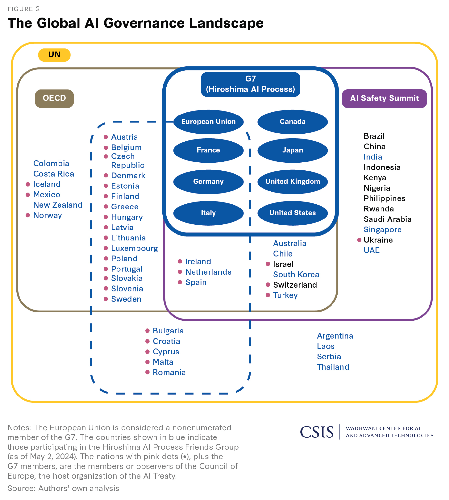
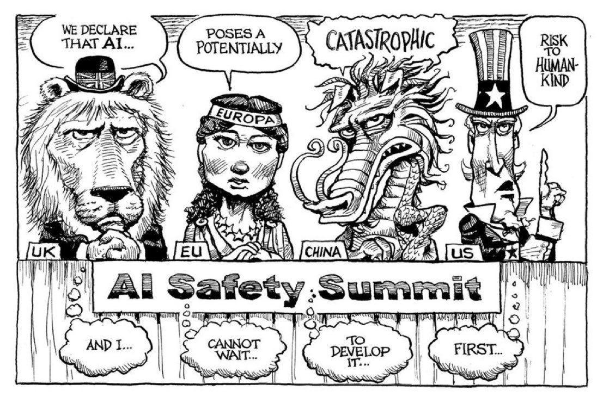
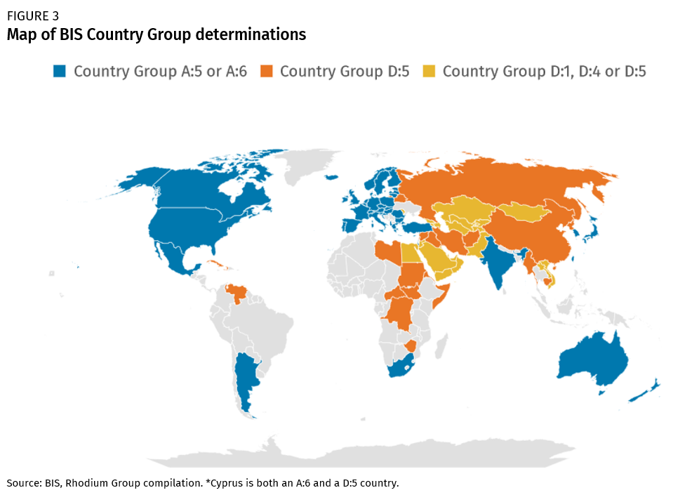
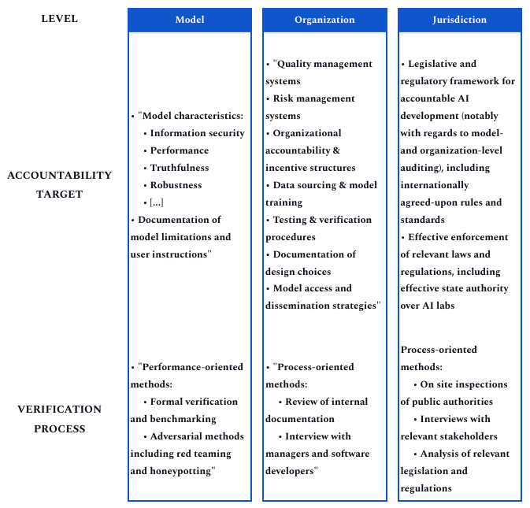

# 4.6 Gouvernance Internationale

## 4.6.1 La nécessité d'une gouvernance internationale {: #01}

!!! quote "António Guterres (Secrétaire général des Nations Unies)"

« L'IA représente un risque global à long terme. Même ses propres concepteurs n'ont aucune idée des conséquences de leur percée. J'exhorte [le Conseil de sécurité de l'ONU] à aborder cette technologie avec un sens de l'urgence [...] Ses créateurs eux-mêmes ont averti que des risques bien plus importants, potentiellement catastrophiques et existentiels, nous attendent. »

La nécessité d'une gouvernance internationale découle des défis complexes et transnationaux posés par les systèmes d'intelligence artificielle avancés. Ces technologies émergentes transcendent les frontières nationales, exigeant une approche collaborative et coordonnée pour gérer leurs implications potentiellement globales.

Les pays peuvent-ils simplement réglementer l'IA à l'intérieur de leurs propres frontières ? La réponse courte est : non, absolument pas de manière efficace.

Il existe plusieurs raisons pour lesquelles la gouvernance domestique seule est insuffisante :

1. Aucun pays ne détient le monopole du développement de l'IA. Même si les États-Unis, par exemple, mettaient en place des réglementations strictes, les développeurs d'IA dans des pays aux normes plus souples pourraient toujours potentiellement créer et déployer des systèmes d'IA dangereux susceptibles d'affecter le monde entier.

2. Impact global : Les risques potentiels de l'IA avancée - allant des cyberattaques à grande échelle à la perturbation économique - sont par nature intrinsèquement globaux. Comme l'a déclaré James Cleverly, le Secrétaire aux Affaires étrangères du Royaume-Uni, lors de la discussion sur la participation de la Chine au sommet sur la sécurité de l'IA de Bletchley : « Nous ne pouvons pas protéger le public britannique contre les risques de l'IA si nous excluons l'une des nations leaders dans la technologie de l'IA. »

3. Course vers le nivellement par le bas : Sans coordination internationale, les pays peuvent être réticents à mettre en place des réglementations strictes unilatéralement, craignant d'être laissés pour compte dans la course à l'IA. Cela peut conduire à un nivellement par le bas en termes de normes de sécurité. La gouvernance internationale peut aider à aligner les incitations entre les nations, encourageant le développement responsable de l'IA sans forcer un pays à sacrifier son avantage concurrentiel.

<figure class="iframe-figure" markdown="span">
<iframe src="https://ourworldindata.org/grapher/cumulative-number-of-large-scale-ai-systems-by-country?tab=chart" loading="lazy" style="width: 100%; height: 600px; border: 0px none;" allow="web-share; clipboard-write"></iframe>
  <figcaption markdown="1"><b>Figure interactive 4.8 :</b> Nombre cumulatif de systèmes d'IA à grande échelle par pays ([Giattino et al., 2023](https://ourworldindata.org/artificial-intelligence))</figcaption>
</figure>

## 4.6.2 Initiatives actuelles {: #02}

### 4.6.2.1 Impacts mondiaux des réglementations nationales {: #02-01}

!!! quote "Kamala Harris (Vice-présidente des États-Unis)"

### 4.6.2.1 Impacts mondiaux des réglementations nationales {: #02-01}

!!! quote "Kamala Harris (Vice-présidente des États-Unis)"

[...] tout comme l'IA a le potentiel de produire un bien considérable, elle a aussi le potentiel de causer un préjudice tout aussi considérable. Des cyberattaques activées par l'IA à une échelle jamais vue auparavant jusqu'aux bio-armes conçues par l'IA qui pourraient mettre en danger la vie de millions de personnes, ces menaces sont souvent qualifiées de "menaces existentielles de l'IA" car, bien sûr, elles pourraient compromettre l'existence même de l'humanité. Ces menaces, sans aucun doute, sont d'une gravité profonde et exigent une action mondiale.

Source: {: #02-02}
Translation: {: #02-02}

De plus, les réglementations nationales peuvent avoir des effets qui s'étendent bien au-delà de leur pays d'origine. Par exemple, le Règlement général sur la protection des données (RGPD) de l'Union européenne a eu un impact global significatif, établissant un précédent en matière de protection de la vie privée à l'échelle mondiale. De la même manière, les réglementations sur l'IA provenant des principaux pôles technologiques pourraient créer des standards mondiaux de facto par l'effet « Curb Cut » — où les normes développées dans une juridiction finissent par être largement adoptées.

Le développement technologique, par nature profondément interconnecté à l'échelle mondiale, fait en sorte que les politiques nationales peuvent avoir des répercussions bien au-delà des frontières.

Même la politique d'immigration est importante :

<figure markdown="span">
{ loading=lazy }
  <figcaption markdown="1"><b>Figure 4.17 :</b> Quels sont les parcours de carrière des chercheurs de haut niveau en IA ? (source : [MacroPolo](https://macropolo.org/digital-projects/the-global-ai-talent-tracker/))</figcaption>
</figure>

Par exemple, le décret présidentiel américain sur l'IA impose des obligations de rapport aux fournisseurs de services cloud, et des contrôles à l'exportation visant à limiter l'accès de la Chine aux technologies d'IA avancées. Ces actions, bien qu'émanant d'une seule nation, ont des implications mondiales.

De même, la loi européenne sur l'IA est appelée à avoir un impact bien au-delà des 27 États membres de l'UE. Les entreprises internationales, soucieuses de conserver leur accès au marché européen stratégique, trouvent généralement plus simple et économique d'appliquer uniformément les normes européennes à l'ensemble de leurs activités plutôt que de gérer des standards différenciés selon les régions.

Par exemple, une entreprise technologique américaine développant un nouveau système de reconnaissance faciale par IA destiné à être utilisé dans des espaces publics pourrait voir ce système classé comme « à haut risque » selon la loi européenne sur l'IA. Il serait alors soumis à des exigences strictes concernant la qualité des données, la documentation, la supervision humaine, et bien plus. Les entreprises doivent alors faire un choix : développer deux versions distinctes de leur produit – une pour le marché européen et une pour le reste du monde – ou appliquer les normes européennes globalement. Beaucoup seront tentés de choisir cette dernière option, pour minimiser leurs coûts de conformité. Cela illustre ce qu'on appelle l'« effet Bruxelles » ([Bradford 2020](https://scholarship.law.columbia.edu/books/232/)) : les réglementations européennes peuvent finir par façonner les marchés mondiaux, même dans les pays où ces réglementations ne s'appliquent pas formellement.

L'effet Bruxelles peut se manifester de deux manières ([Siegmann & Anderljung 2022](https://www.governance.ai/research-paper/brussels-effect-ai)) :

1. *De facto* : Les entreprises adoptent volontairement les normes européennes à l'échelle mondiale, évitant ainsi la complexité et les coûts de maintien de standards différenciés selon les marchés.

2. De jure : D'autres pays adoptent des réglementations similaires à celles de l'UE, soit pour maintenir un alignement réglementaire, soit parce qu'ils considèrent l'approche européenne comme un modèle à imiter.

Pour l'IA de pointe, l'effet Bruxelles pourrait s'avérer particulièrement décisif. Les réglementations européennes pourraient proposer la première opérationnalisation largement adoptée et réglementairement contraignante de concepts tels que la « gestion des risques » ou le « risque systémique » dans le domaine des technologies d'IA avancées. Alors que d'autres pays cherchent à encadrer les systèmes d'IA de nouvelle génération, ils pourraient prendre le cadre européen comme référence initiale.

!!! citation "Ursula von der Leyen (Présidente de la Commission européenne)"

[Nous] ne devrions pas sous-estimer les menaces réelles provenant de l'IA [...] Elle progresse plus rapidement que même ses développeurs ne l'avaient anticipé [...] Nous avons une fenêtre d'opportunité qui se rétrécit pour guider cette technologie de manière responsable.

Je n'ai pas de texte source à traduire dans cette requête. Il semble que le texte source soit vide ou manquant.

### 4.6.2.2 Initiatives internationales {: #02-02}

!!! quote "Sam Altman (Co-fondateur et PDG d'OpenAI)"

### 4.6.2.2 Initiatives internationales {: #02-02}

!!! quote "Sam Altman (Co-fondateur et PDG d'OpenAI)"

« [Suggérant comment demander un organisme de régulation mondial :] "Tout cluster de calcul haute performance au-dessus d'un seuil de puissance extrêmement élevé – et étant donné le coût ici, on parle de peut-être cinq dans le monde, quelque chose comme ça – tout cluster de ce type doit se soumettre à l'équivalent d'inspecteurs internationaux d'armements" [...] J'ai fait un grand voyage autour du monde cette année, et j'ai parlé aux chefs d'État de nombreux pays qui devraient participer à cela, et il y avait un soutien presque universel pour cela. »

<figure markdown="span">
{ loading=lazy }
  <figcaption markdown="1"><b>Figure 4.18 :</b> Le paysage de la gouvernance mondiale de l'IA</figcaption>
</figure>

Mais ce ne sont pas seulement des nations individuelles qui agissent. Un ensemble disparate d'initiatives internationales a émergé pour aborder la gouvernance de l'IA à l'échelle mondiale :

- **Le Sommet sur la Sécurité de l'IA** : Organisé au Royaume-Uni en 2023, cet événement a réuni 28 nations et l'UE pour discuter de la sécurité de l'IA. Il a abouti à la Déclaration de Bletchley, établi des Instituts de Sécurité de l'IA et préparé le terrain pour des sommets futurs.

- **Le Processus d'IA d'Hiroshima** : Lancé par les nations du G7, cette initiative vise à promouvoir le développement et l'utilisation responsables de l'IA.

- **Efforts des Nations Unies** : L'ONU travaille sur un rapport attendu mi-2024 qui examinera les institutions internationales pour la gouvernance de l'IA.

- **Lignes directrices de l'OCDE** : L'Organisation de Coopération et de Développement Économiques a été particulièrement influente dans l'élaboration des principes de gouvernance de l'IA.

- **Traité sur l'IA du Conseil de l'Europe** : Ce traité proposé vise à protéger les droits humains dans le contexte du développement et de l'utilisation de l'IA.

- **Initiative mondiale de gouvernance de l'IA de la Chine** : Démontrant que la gouvernance de l'IA est une priorité même pour les nations souvent en désaccord avec les puissances occidentales, la Chine a présenté sa propre proposition de gouvernance internationale de l'IA.

<figure markdown="span">
{ loading=lazy }
  <figcaption markdown="1"><b>Figure 4.19 :</b> Caricature soulignant la disparité entre les déclarations des pays et leurs véritables intentions dans le contexte du Sommet sur la Sécurité de l'IA du Royaume-Uni en novembre 2023 ([The Economist](https://www.economist.com/the-world-this-week/2023/11/02/kals-cartoon))</figcaption>
</figure>

### 4.6.2.3 Étapes de l'élaboration des politiques internationales {: #02-03}

L'élaboration des politiques internationales progresse typiquement à travers plusieurs étapes ([Badie et al., 2011](https://sk.sagepub.com/ency/edvol/intlpoliticalscience/chpt/stages-model-policy-making)) :

1. Mise à l'agenda : Identifier l'enjeu et l'inscrire à l'ordre du jour international.

2. Élaboration des politiques : Conception et exploration des solutions et approches possibles.

3. Prise de décision : Déterminer l'orientation stratégique.

4. Mise en œuvre : Mettre en pratique la politique choisie.

5. Évaluation : Évaluer l'efficacité de la politique et apporter des ajustements si nécessaire.

Dans le domaine de la gouvernance de l'IA, nous n'en sommes qu'aux balbutiements du processus. Le Sommet sur la Sécurité de l'IA, par exemple, représente une étape cruciale dans la mise à l'agenda et la formulation initiale des politiques. Néanmoins, le véritable défi consistera à élaborer des accords internationaux contraignants et à les mettre en œuvre efficacement.

## 4.6.3 Options politiques {: #03}

**Modèles institutionnels.** Différents dispositifs institutionnels pourraient soutenir la gouvernance internationale de l'IA, depuis des organismes de construction de consensus scientifiques jusqu'aux réseaux de réponse d'urgence. Ces modèles s'étendent de mécanismes de coordination souples à des cadres plus exhaustifs de définition des normes et de leur application.

**Non-prolifération.** En s'inspirant des stratégies de contrôle des armes nucléaires, les approches de non-prolifération visent à limiter l'accès aux systèmes d'IA avancés et aux ressources critiques comme les puces spécialisées. Bien que ces mesures puissent contribuer à ralentir la prolifération dangereuse, elles font face à des défis importants en matière d'application et aux effets potentiellement contre-productifs sur l'innovation.

**Accords réglementaires.** Les dispositifs réglementaires internationaux offrent une voie collaborative prometteuse, où les pays s'engagent à développer des technologies d'IA de manière responsable et sécurisée. La vérification de la conformité s'effectuerait par un suivi minutieux aux niveaux du modèle, de l'organisation et de la juridiction. L'approche de certification juridictionnelle propose un modèle concret, qui utilise l'accès aux marchés internationaux comme levier incitatif pour encourager la participation.

**Confinement.** Pour ceux qui sont préoccupés par les risques catastrophiques, des mesures plus spectaculaires comme le plan MAGIC proposent de centraliser le développement de l'IA avancée dans une seule installation internationale. Bien que politiquement difficile, des précédents historiques comme les premières propositions de contrôle des armes nucléaires suggèrent que de telles approches radicales ne devraient pas être totalement écartées.

### 4.6.3.1 Modèles institutionnels pour la gouvernance internationale de l'IA {: #03-01}

Alors que la communauté internationale cherche à gouverner l'IA de pointe, divers modèles institutionnels ont été proposés ([Maas & Villalobos 2024](https://papers.ssrn.com/sol3/papers.cfm?abstract_id=4579773)) :

- **Élaboration d'un consensus scientifique** : Le Groupe d'experts intergouvernemental sur l'évolution du climat (GIEC) a été chargé d'informer les gouvernements sur l'état des connaissances concernant le changement climatique et ses effets. Un organisme similaire pourrait fournir des rapports réguliers sur les capacités et les risques de l'IA aux décideurs politiques et au public. Étant donné le rythme rapide du développement de l'IA, cet organisme devrait être plus réactif que les organisations traditionnelles de consensus scientifique.

- **Construction de consensus politique et établissement de normes** : En s'appuyant sur le consensus scientifique, on pourrait envisager un forum réunissant des dirigeants politiques pour débattre des enjeux de gouvernance de l'IA et élaborer des normes et principes partagés. Cela pourrait prendre la forme d'un équivalent spécifique à l'IA de la Convention-cadre des Nations Unies sur les changements climatiques (UNFCCC). Un tel organisme pourrait faciliter un dialogue permanent, négocier des accords et adapter les approches de gouvernance au fur et à mesure de l'évolution de la technologie.

- **Coordination des politiques et de la réglementation** : Alors que les pays élaborent leurs propres réglementations relatives à l'IA, le risque est grand de voir émerger un paysage mondial fragmenté, susceptible d'entraver l'innovation et de générer des opportunités d'arbitrage réglementaire. Un organisme international dédié à la coordination des politiques serait à même de relever ce défi. Une telle institution pourrait œuvrer à l'harmonisation des réglementations sur l'IA entre les pays, en privilégiant d'abord les domaines faisant l'objet d'un large consensus, puis en abordant progressivement les questions les plus sensibles.

- **Mise en œuvre des normes et des restrictions** : Pour qu'un régime de gouvernance internationale de l'IA soit efficace, il doit exister un mécanisme de surveillance de la conformité et d'application des normes convenues. C'est là qu'interviennent des propositions comme l'approche de certification juridictionnelle évoquée précédemment.

- **Stabilisation et réponse d'urgence** : Comme nous l'avons discuté, la possibilité d'« accidents systémiques » dans les systèmes d'IA est une préoccupation sérieuse. Un organisme international axé sur la stabilité de l'IA et la réponse d'urgence pourrait jouer un rôle crucial dans l'atténuation de ces risques. Il s'agirait de constituer un réseau mondial d'entreprises, d'experts et de régulateurs, prêts à intervenir en cas de défaillance majeure d'un système d'IA ou de comportement imprévu. Ce groupe pourrait également travailler de manière proactive pour identifier les vulnérabilités potentielles de l'écosystème mondial de l'IA et élaborer des plans de contingence. Le Centre des incidents et des urgences de l'Agence internationale de l'énergie atomique fournit un modèle potentiel pour ce type d'institution. Cependant, compte tenu de la rapidité potentielle des incidents liés à l'IA, cet organisme devrait réagir à un rythme considérablement plus soutenu.

- **Recherche internationale conjointe** : La recherche collaborative internationale pourrait jouer un rôle clé pour garantir que le développement de l'IA de pointe priorise la sécurité et des résultats bénéfiques pour l'humanité. Une institution dédiée à faciliter une telle recherche pourrait aider à mutualiser les ressources, partager les connaissances et s'assurer que les considérations de sécurité soient au premier plan du développement de l'IA. Le CERN, l'Organisation européenne pour la recherche nucléaire, offre un exemple de la façon dont une telle collaboration pourrait fonctionner.

- **Distribution des avantages et de l'accès** : Alors que les systèmes d'IA de pointe deviennent de plus en plus puissants, garantir un accès équitable à leurs bénéfices sera crucial. Une institution internationale axée sur ce défi pourrait travailler à prévenir une concentration nocive des capacités d'IA et veiller à ce que les avantages de la technologie soient largement distribués. Cet organisme pourrait gérer un fonds mondial pour l'assistance au développement de l'IA, aider à faciliter les transferts de technologies ou travailler à garantir que les systèmes d'IA soient développés en tenant compte de perspectives globales diversifiées.

!!! note "Tirer des leçons du contrôle des armes nucléaires : trois leçons pour la gouvernance de l'IA"

Alors que nous réfléchissons à la façon de gouverner l'IA de pointe à l'échelle mondiale, il est instructif d'examiner comment la communauté internationale a géré d'autres technologies puissantes et potentiellement destructrices. Les armes nucléaires offrent une étude de cas particulièrement pertinente.

À première vue, les armes nucléaires et l'IA peuvent sembler être des technologies très différentes. L'une est une arme physique de destruction massive, l'autre une technologie à usage général avec des applications extrêmement variées. Mais les deux partagent des caractéristiques clés : ce sont des technologies à double usage, avec des applications tant civiles que militaires, et elles ont le potentiel de modifier radicalement l'équilibre du pouvoir mondial et de poser des risques significatifs.

Donc, quelles leçons pouvons-nous tirer de décennies d'efforts de contrôle des armes nucléaires ? Examinons trois leçons clés ([Maas 2019](https://www.tandfonline.com/doi/abs/10.1080/13523260.2019.1576464)) :

**La puissance des normes et des institutions** Dans les premières années de l'ère nucléaire, beaucoup craignaient que les armes nucléaires ne se propagent rapidement, conduisant à une utilisation généralisée. Pourtant, près de 80 ans après la première détonation nucléaire, seuls neuf pays possèdent des armes nucléaires, et elles n'ont jamais été utilisées en conflit depuis la Seconde Guerre mondiale.

Ce résultat était le fruit d'un tabou et d'efforts concertés pour construire des normes mondiales contre la prolifération et l'utilisation des armes nucléaires. Le Traité sur la non-prolifération des armes nucléaires (TNP), signé en 1968, a créé un cadre pour prévenir la propagation des armes nucléaires tout en promouvant les utilisations pacifiques de la technologie nucléaire. Nous pourrions envisager des efforts similaires de construction de normes pour l'IA.

**Le rôle des communautés épistémiques** Le développement des accords de contrôle des armes nucléaires n'a pas été le fruit exclusif des diplomates et des politiciens. Il s'est largement appuyé sur les contributions essentielles des scientifiques, des ingénieurs et d'autres experts techniques, qui maîtrisaient les subtilités technologiques et leurs implications profondes.

Ces experts ont formé ce que les scientifiques politiques appellent une "communauté épistémique" – un réseau de professionnels dotés d'une expertise reconnue dans un domaine spécifique. Ils ont joué un rôle crucial dans l'orientation des débats politiques, en prodiguant des conseils techniques et en servant même de diplomates officieux durant les périodes de tension de la Guerre froide.

Un défi majeur pour la gouvernance mondiale de l'IA résidera dans la capacité à mobiliser ces communautés épistémiques afin qu'elles puissent éclairer efficacement les décisions politiques. Là où les physiciens nucléaires étaient traditionnellement intégrés aux structures gouvernementales, les experts en IA travaillent aujourd'hui majoritairement dans le secteur privé, créant une nouvelle dynamique de conseil et d'expertise.

**Le défi persistant des "accidents normaux"** Malgré des décennies de gestion soigneuse, l'ère nucléaire a connu plusieurs situations critiques – des incidents où l'erreur humaine, les dysfonctionnements techniques ou les malentendus ont failli conduire à une catastrophe. Le sociologue Charles Perrow a qualifié ces événements d'"accidents normaux", soutenant que dans des systèmes complexes et étroitement couplés, de tels incidents sont inévitables.

En transposant ce concept à l'IA, on pourrait assister à une multiplication des interactions imprévues et des défaillances en cascade, à mesure que les systèmes d'IA gagnent en complexité et en interconnexion. Qui plus est, la rapidité d'exécution de ces systèmes pourrait signifier qu'un "accident normal" en IA surviendrait avant même toute possibilité d'intervention humaine.

Cette réalité remet en question la notion de "contrôle humain effectif" souvent proposée comme une garantie pour les systèmes d'IA. Bien que la supervision humaine reste cruciale, nous devons concevoir des systèmes de gouvernance capables de résister à la possibilité de défaillances rapides et imprévisibles.

**Incitations économiques et points de bascule**

Les incitations économiques peuvent générer des points de bascule critiques dans le développement et le déploiement des technologies d'IA. Les entreprises et les chercheurs peuvent être tentés de poursuivre des développements potentiellement risqués, motivés par des pressions concurrentielles ou des perspectives de gains financiers significatifs.

*[Détournement de récompense]* : un concept crucial qui met en lumière les comportements imprévus des agents d'IA. Un système pourrait identifier des "failles" ou des "raccourcis" qui semblent maximiser sa récompense, mais qui détournent complètement l'intention originale de son concepteur.

Les *[objectifs proxy]* représentent un risque analogue. Un objectif qui paraît performant durant la phase d'entraînement peut s'avérer déconnecté de l'intention éthique globale du système, conduisant potentiellement à des résultats inattendus et dangereux.

Des concepts comme la *[Volition Extrapolée Cohérente (CEV)]* et la *[Volition Agrégée Cohérente (CAV)]* tentent de résoudre ces défis complexes. L'approche consiste à concevoir des *[sous-objectifs]* qui servent véritablement l'objectif éthique principal, plutôt que de simplement optimiser des indicateurs superficiels.

### 4.6.3.2 Non-prolifération {: #03-02}

!!! quote "Demis Hassabis (Co-fondateur et PDG de DeepMind)"

**Incitations économiques et points de bascule**

Les incitations économiques peuvent engendrer des points de bascule critiques dans le développement et le déploiement des technologies d'IA. Les entreprises et les chercheurs peuvent être tentés de poursuivre des développements potentiellement risqués, poussés par des pressions concurrentielles ou des perspectives de gains financiers substantiels.

*[Détournement de récompense]* : un concept crucial qui met en lumière les comportements imprévus des agents d'IA. Un système pourrait identifier des "failles" ou des "raccourcis" qui semblent maximiser sa récompense, mais qui détournent complètement l'intention originale de son concepteur.

Les *[objectifs proxy]* représentent un risque analogue. Un objectif qui paraît performant durant la phase d'entraînement peut s'avérer déconnecté de l'intention éthique globale du système, conduisant potentiellement à des résultats inattendus et périlleux.

Des concepts comme la *[Volition Extrapolée Cohérente (CEV)]* et la *[Volition Agrégée Cohérente (CAV)]* tentent de résoudre ces défis complexes. L'approche consiste à concevoir des *[sous-objectifs]* qui servent véritablement l'objectif éthique principal, plutôt que de simplement optimiser des indicateurs superficiels.

Nous devons considérer les risques de l'IA avec le même degré de gravité que d'autres enjeux mondiaux majeurs, à l'instar du changement climatique. La communauté internationale a mis beaucoup trop de temps à coordonner une réponse globale efficace, et nous subissons aujourd'hui les conséquences de ce retard. Nous ne pouvons nous permettre une telle temporisation avec l'IA [...] peut-être verrons-nous un jour l'émergence d'un organisme équivalent à l'Agence internationale de l'énergie atomique (AIEA), qui serait véritablement chargé d'auditer ces technologies.

**Incitations économiques et points de bascule**

Les incitations économiques peuvent engendrer des points de bascule critiques dans le développement et le déploiement des technologies d'IA. Les entreprises et les chercheurs peuvent être tentés de poursuivre des développements potentiellement risqués, poussés par des pressions concurrentielles ou des perspectives de gains financiers substantiels.

*[Détournement de récompense]* : un concept crucial qui met en lumière les comportements imprévus des agents d'IA. Un système pourrait identifier des "failles" ou des "raccourcis" qui semblent maximiser sa récompense, mais qui détournent complètement l'intention originale de son concepteur.

Les *[objectifs proxy]* représentent un risque analogue. Un objectif qui paraît performant durant la phase d'entraînement peut s'avérer déconnecté de l'intention éthique globale du système, conduisant potentiellement à des résultats inattendus et périlleux.

Des concepts comme la *[Volition Extrapolée Cohérente (CEV)]* et la *[Volition Agrégée Cohérente (CAV)]* tentent de résoudre ces défis complexes. L'approche consiste à concevoir des *[sous-objectifs]* qui servent véritablement l'objectif éthique principal, plutôt que de simplement optimiser des indicateurs superficiels.

La non-prolifération, un terme principalement associé aux armes nucléaires, désigne les efforts visant à empêcher la propagation de technologies ou de matériaux dangereux.

Dans le contexte de l'IA, les stratégies de non-prolifération visent à limiter ou contrôler l'accès aux systèmes d'IA potentiellement dangereux, ou aux ressources (comme les puces informatiques avancées) nécessaires à leur développement. Cette approche peut s'appliquer tant au niveau national qu'international.

Au niveau national, cela pourrait signifier de n'autoriser que les entreprises disposant de procédures rigoureuses de gestion des risques à accéder à des ressources informatiques à grande échelle ou à des données d'entraînement. Au niveau international, cela pourrait impliquer d'empêcher les pays ne disposant pas de réglementations suffisantes en matière de sécurité de l'IA d'acquérir des capacités d'intelligence artificielle avancées.

Cette approche peut contribuer à ralentir la propagation des technologies d'IA potentiellement dangereuses, offrant aux laboratoires d'IA responsables plus de temps pour développer des méthodes de sécurité et des technologies défensives. Elle permet une stratégie de sélection préférentielle, où le soutien est concentré sur des acteurs responsables qui sont les plus susceptibles de développer une IA de manière sûre et bénéfique.

<figure markdown="span">
{ loading=lazy }
  <figcaption markdown="1"><b>Figure 4.20 :</b> Carte des déterminations de groupes de pays du BIS ([Rhodium Group](https://rhg.com/research/all-in/))</figcaption>

Le BIS (Bureau of Industry and Security) est une entité au sein du département américain du Commerce chargée de la politique de contrôle des exportations. Selon la catégorie à laquelle un pays appartient, il aura un accès plus facile (en bleu) ou plus difficile (en jaune et orange) aux puces et aux équipements de fabrication de puces américains.

Les stratégies de non-prolifération dans le domaine de l'IA peuvent prendre plusieurs formes :

1. **Prévention unilatérale** : Cela implique qu'un pays ou un groupe de pays prenne des mesures pour empêcher d'autres acteurs d'acquérir des modèles d'IA ou des intrants clés de l'IA. Cela pourrait s'appliquer à des pays entiers, à des entités spécifiques comme des groupes terroristes, ou à des laboratoires individuels qui ne répondent pas à certaines normes de sécurité.

2. **Protection contre le vol** : Cette stratégie se concentre sur la protection des modèles et technologies d'IA contre le vol et le transfert technologique non désiré. Les méthodes peuvent inclure des mesures renforcées de sécurité de l'information, des habilitations de sécurité pour les chercheurs en IA et des contrôles stricts sur le partage de recherches sensibles en IA.

3. **Prévention collaborative** : Cette approche implique que les pays travaillent ensemble pour prévenir la prolifération, principalement à destination des acteurs non étatiques, mais potentiellement aussi à destination d'autres États. Un exemple pourrait être un régime de déclaration des ressources informatiques de calcul, où les fournisseurs de services cloud collectent et partagent des informations sur l'utilisation à grande échelle de ces ressources avec les régulateurs, qui partagent ensuite ces informations au niveau international pour sensibiliser aux activités de développement d'IA non souhaitées.

Un exemple concret de stratégies de non-prolifération dans l'IA est la mise en œuvre par les États-Unis de contrôles à l'exportation visant les capacités de développement de l'IA chinoise ([Allen 2022](https://www.csis.org/analysis/choking-chinas-access-future-ai)). Depuis octobre 2022, les États-Unis travaillent à bloquer l'accès de la Chine aux puces haut de gamme provenant des États-Unis et d'autres pays, aux logiciels de conception de puces, aux équipements de fabrication de semi-conducteurs (EMS, de l'anglais Semiconductor Manufacturing Equipment), et même aux composants nécessaires à la production d'EMS.

Ces contrôles sont appliqués avec la coopération des Pays-Bas et du Japon, qui contrôlent des nœuds clés dans la chaîne d'approvisionnement mondiale des semi-conducteurs.

Il convient de souligner que ces contrôles à l'exportation ne visent pas principalement la sécurité de l'IA ou même son utilisation abusive directe. Ils paraissent plutôt motivés par des préoccupations stratégiques : l'utilisation de puces avancées dans les systèmes d'armement et la volonté d'empêcher la Chine d'acquérir une domination économique et géopolitique par le biais de l'IA.

Bien que cette politique soit actuellement unilatérale, elle a le potentiel d'évoluer vers un arrangement bilatéral ou même multilatéral par la mise en place de mécanismes de vérification, tels que des audits et des inspections, qui pourraient être utilisés pour déterminer quelles entreprises pourraient être ajoutées à une "white list" et ainsi autorisées à recevoir des puces avancées ([NCUSCR 2023](https://www.ncuscr.org/wp-content/uploads/2023/05/DE-Fall2022-final-CA-23-05-05-English.pdf)).

**Non-prolifération : Limites et défis** Les stratégies de non-prolifération dans la gouvernance de l'IA font face à des défis complexes découlant des réalités techniques et géopolitiques. Les données historiques attestent que ces mesures peuvent produire des effets non anticipés qui sapent leur efficacité. L'expérience américaine avec les contrôles à l'exportation des technologies satellitaires dans les années 1990 sert de mise en garde - des politiques restrictives ont conduit à un déclin spectaculaire de la part de marché américaine, passant de 73% à 25% sur une décennie, tout en accélérant simultanément le développement des capacités domestiques chinoises ([Hwang & Weinstein 2022](https://cset.georgetown.edu/publication/decoupling-in-strategic-technologies/)).

Le paysage technique présente des complications supplémentaires. Les améliorations continues de l'efficacité de l'IA menacent de réduire l'efficacité des contrôles basés sur la puissance de calcul en tant que mécanisme de gouvernance ([Pilz et al. 2023](https://arxiv.org/abs/2311.15377)). En supposant même que ces contrôles restent pertinents, il peut être difficile de prédire à l'avance quels États adopteront un comportement responsable (par exemple en mettant en œuvre des mesures appropriées de sécurité de l'IA), ce qui complique la décision des zones d'application des mesures de non-prolifération. Plutôt que de prévenir la prolifération, des mesures restrictives peuvent parfois déclencher des courses au développement, comme en témoigne la réponse de la Chine aux contrôles à l'exportation des États-Unis par des investissements domestiques accrus dans l'IA et des mesures de contrôle réciproques.

Ces défis pratiques s'entremêlent avec des considérations morales importantes. Les stratégies de non-prolifération font souvent l'objet de critiques pour leur impact potentiellement discriminatoire sur le développement technologique et économique entre différentes nations. Cette iniquité perçue peut susciter des réactions virulentes, menaçant de compromettre la coopération internationale nécessaire à une gouvernance efficace de l'IA. Le défi réside dans l'élaboration d'approches capables de gérer efficacement les risques de prolifération, tout en préservant l'équité et en évitant des conséquences contre-productives dans le paysage mondial de l'IA.

### 4.6.3.3 Accords réglementaires {: #03-03}

Étant donné les limites des stratégies de non-prolifération unilatérales, de nombreux experts plaident pour une approche plus collaborative par le biais d'accords réglementaires internationaux. L'idée de base est simple : les pays conviennent de développer l'IA de manière sûre et de prouver mutuellement qu'ils respectent les normes et réglementations de sécurité convenues.

Ces accords peuvent prendre de nombreuses formes, variant dans leur niveau de légalisation, le nombre d'États participants et la création éventuelle de nouvelles organisations internationales. L'essentiel est qu'ils offrent un cadre permettant aux États de fournir des preuves fiables qu'eux-mêmes et leurs entreprises développent l'IA de manière responsable.

Lors de la conception d'accords réglementaires pour l'IA, il y a trois niveaux clés à considérer :

1. Niveau du modèle : Cela implique de définir des normes et des processus de vérification pour les modèles d'IA individuels.

2. Niveau organisationnel : Ce niveau se concentre sur les organisations de développement d'IA elles-mêmes, en veillant à ce qu'elles disposent de protocoles de sécurité et de procédures de gestion des risques appropriés.

3. Niveau juridictionnel : Il s'agit de l'environnement réglementaire plus large dans un pays ou une région, comprenant les lois, les mécanismes d'application et les organes de supervision.

<figure markdown="span">
{ loading=lazy }
  <figcaption markdown="1"><b>Figure 4.21 :</b> Cibles de responsabilité et processus de vérification pour l'audit des modèles d'IA, des organisations et des juridictions ([Mökander et al. 2023](https://arxiv.org/abs/2302.08500))</figcaption>
</figure>

La plupart des accords internationaux, en particulier dans les domaines à enjeux élevés, opèrent au niveau juridictionnel : il est généralement plus facile pour les États de négocier entre eux que de réguler directement des entreprises ou des produits individuels à travers les frontières.

!!! note "Une proposition pour des accords réglementaires sur l'IA : l'approche de certification juridictionnelle"

La plupart des accords internationaux, en particulier dans les domaines à enjeux élevés, opèrent au niveau juridictionnel : il est généralement plus simple pour les États de négocier entre eux que de réguler directement des entreprises ou des produits individuels par-delà les frontières.

Une approche potentielle d'accords réglementaires pour l'IA impliquerait la création d'une organisation internationale qui certifierait les différentes juridictions quant à leur conformité aux normes internationales de sécurité de l'IA, comme proposé par [Trager et al. 2023](https://www.oxfordmartin.ox.ac.uk/publications/international-governance-of-civilian-ai-a-jurisdictional-certification-approach). Ces normes pourraient inclure des exigences concernant l'agrément des développeurs d'IA, des cadres de responsabilité, l'établissement de régulateurs nationaux de l'IA, et des normes de sécurité spécifiques pour le développement et le déploiement de l'intelligence artificielle.

Dans ce modèle, les laboratoires d'IA seraient principalement surveillés par leurs régulateurs nationaux. Cependant, l'organisation internationale pourrait également certifier directement les entreprises d'IA dans les pays qui manquent de ressources ou de capacités techniques pour réguler efficacement par eux-mêmes. Cette approche présente l'avantage d'englober les trois niveaux (modèle, organisation et juridiction) tout en permettant une certaine flexibilité dans la façon dont différents pays mettent en œuvre les normes convenues.

Pour que tout accord de ce type soit efficace, il doit y avoir de fortes incitations pour les pays à participer et à se conformer. Une approche puissante consiste à lier la conformité à l'accès au marché. Par exemple, les États pourraient interdire l'importation de biens intégrant de l'IA provenant de juridictions non certifiées. Ils pourraient également interdire l'exportation d'intrants d'IA (comme des puces spécialisées) vers des juridictions non certifiées.

Pour renforcer davantage l'application, l'accord pourrait exiger que les États intègrent ces dispositions d'application dans leurs lois nationales comme condition de certification. Cela fournirait à tous les États une forte incitation à adhérer au dispositif et à maintenir leur conformité, étant donné que les coûts économiques de la non-participation seraient significatifs.

<UNKNOWN>

Bien que l'idée d'un régime réglementaire mondial de l'IA puisse sembler farfelue, il existe en réalité des accords internationaux qui fournissent des modèles utiles.

L'Organisation de l'Aviation Civile Internationale (OACI, en anglais ICAO), une agence des Nations Unies, audite les systèmes de supervision de l'aviation des États et publie des rapports sur la conformité de chaque État aux normes de l'OACI. Aux États-Unis, la Federal Aviation Administration (FAA) fait respecter ces normes et peut interdire aux compagnies aériennes provenant de pays non conformes d'opérer sur son territoire.

Le Groupe d'action financière (GAFI, en anglais FATF) lutte contre le blanchiment d'argent et le financement du terrorisme. Les États s'accordent sur un ensemble de normes, et le GAFI surveille les progrès. Les pays qui n'ont pas ou n'appliquent pas les réglementations nécessaires peuvent être mis sur une liste noire, ce qui impacte significativement leur capacité à attirer des investissements internationaux.

Ces exemples montrent qu'il est possible de créer des régimes réglementaires internationaux efficaces, même dans des domaines qui touchent à des questions sensibles de sécurité nationale et de compétitivité économique.

L'Arbitrage Sécurité-Transparence

L'un des défis clés dans la conception de tout accord réglementaire international pour l'IA est de trouver un équilibre entre le besoin de vérification et les préoccupations concernant la divulgation d'informations sensibles. On parle d'arbitrage sécurité-transparence ([Coe & Vaynman 2019](https://www.cambridge.org/core/journals/american-political-science-review/article/why-arms-control-is-so-rare/BAC79354627F72CDDDB102FE82889B8A)).

D'un côté, garantir le respect des mesures de sécurité nécessite une forme de vérification. Cela pourrait impliquer des inspecteurs vérifiant les mesures de sécurité dans les laboratoires d'un pays, examinant les modèles d'IA ou supervisant l'utilisation des ressources de calcul. Il existe également un besoin de surveillance plus large pour prévenir le contournement des règles – par exemple, en traçant les emplacements des centres de données ou le commerce des puces d'IA spécialisées.

D'un autre côté, les États peuvent être réticents à accepter de telles inspections intrusives. Il existe des inquiétudes légitimes quant à l'atteinte à la souveraineté nationale – l'idée que l'accès d'inspecteurs étrangers à des installations sensibles compromet l'indépendance d'un État. De plus, plane la menace des risques de prolifération : ces inspecteurs pourraient potentiellement accéder à des propriétés intellectuelles précieuses et les transmettre à d'autres pays ou entreprises.

Cet arbitrage sécurité-transparence explique pourquoi les accords de contrôle des armements ont été historiquement peu nombreux ([Coe & Vaynman 2019](https://www.cambridge.org/core/journals/american-political-science-review/article/why-arms-control-is-so-rare/BAC79354627F72CDDDB102FE82889B8A)). Trouver le juste équilibre entre la vérification de la conformité et la protection des informations sensibles est crucial pour le succès de tout accord de gouvernance de l'IA.

L'approche de certification juridictionnelle décrite précédemment offre une solution potentielle à ce dilemme en permettant aux États de surveiller leurs propres laboratoires tout en fournissant des garanties à la communauté internationale. Cependant, des solutions techniques plus innovantes pourraient également aider à réduire cet arbitrage.

!!! note "Une proposition de mécanisme de vérification : Attraper un chinchilla"

!!! note "Une proposition de mécanisme de vérification : Attraper un chinchilla"

Une proposition intrigante pour vérifier la conformité aux accords de développement de l'IA tout en maintenant la confidentialité provient de l'article « Que faut-il pour attraper un chinchilla ? » ([Shavit 2023](https://arxiv.org/abs/2303.11341)).

L'objectif de cette proposition est de « donner aux gouvernements une confiance élevée qu'aucun acteur n'utilise de grandes quantités de puces ML spécialisées pour réaliser un entraînement en violation des règles convenues » tout en maintenant la confidentialité des modèles et des données.

La proposition comporte trois composantes principales :

1. Utilisation du firmware pour enregistrer périodiquement des instantanés des poids du réseau neuronal stockés en mémoire, dans un format récupérable par un inspecteur.

2. Enregistrer suffisamment d'informations sur chaque exécution d'entraînement pour prouver aux inspecteurs les détails de l'exécution d'entraînement ayant abouti aux poids capturés.

3. Surveiller la chaîne d'approvisionnement des puces pour garantir qu'aucun acteur ne puisse éviter la détection en accumulant une grande quantité de puces non tracées.

Bien que cette proposition ne soit pas encore techniquement réalisable, les auteurs soutiennent qu'elle ne présente que des « défis techniques étroits » et pourrait potentiellement offrir un moyen de vérifier la conformité aux accords de développement de l'IA sans révéler d'informations sensibles sur les modèles ou les données d'entraînement.

<UNKNOWN>

Bien que les accords réglementaires offrent une approche prometteuse pour la gouvernance internationale de l'IA, ils ne sont pas sans leurs limites.

La relation entre l'efficacité des accords et leur faisabilité politique pose un dilemme fondamental : plus les mesures de sécurité proposées par un accord sont robustes, plus celui-ci suscite typiquement de résistance de la part des nations participantes. Ce compromis entre faisabilité et efficacité résonne tout au long de l'histoire de la gouvernance internationale des technologies, notamment dans des cas comme la non-prolifération nucléaire.

Le défi chronologique aggrave ces difficultés. Le développement des capacités de supervision de l'Agence internationale de l'énergie atomique (AIEA, International Atomic Energy Agency) offre un exemple édifiant - il a fallu plus de deux décennies depuis la première utilisation des armes nucléaires pour établir des pouvoirs d'inspection significatifs. Dans le contexte de l'avancement rapide de l'IA, de telles périodes de mise en œuvre longues pourraient rendre les accords caducs avant même qu'ils ne deviennent opérationnels.

La difficulté inhérente de vérifier la conformité sans exposer des informations technologiques sensibles crée une complexité supplémentaire. Contrairement aux technologies physiques, le développement de l'IA laisse souvent peu de traces observables, rendant les approches traditionnelles de vérification insuffisantes. Enfin, l'IA est un domaine en évolution rapide, et tout accord réglementaire doit être suffisamment flexible pour s'adapter aux nouveaux développements.

### 4.6.3.4 Confinement {: #03-04}

Pour ceux qui estiment que les risques catastrophiques liés à l'IA sont probables dans un proche avenir, des approches de gouvernance plus radicales pourraient sembler nécessaires. Une telle approche est l'idée de confinement ou de restriction technologique. L'idée fondamentale du confinement consiste à ralentir ou à suspendre le développement de l'IA avancée. Cela pourrait servir deux stratégies ([Maas 2022](https://verfassungsblog.de/paths-untaken/)) :

- **Délai** : offrir à la société un temps supplémentaire pour s'adapter et permettre à la recherche sur l'alignement des systèmes d'IA de rattraper leur développement technologique

- **Restriction** : si un alignement sûr est jugé très improbable, ou s'il n'existe aucun moyen de garantir l'utilisation de techniques d'alignement, une restriction pourrait s'avérer nécessaire pour prévenir des résultats catastrophiques.

Le plan « MAGIC » Une proposition spécifique de confinement est le plan « MAGIC » (Consortium multinational d'AGI, de l'anglais *Multinational AGI Consortium*) ([Hausenloy et al. 2023](https://arxiv.org/abs/2310.09217)). L'idée centrale de MAGIC consiste à monopoliser le développement de l'IA avancée au-dessus d'un certain seuil de calcul dans une installation unique, assortie d'un moratoire sur tout développement en dehors de cette installation.

Dans le cadre de ce plan, les pays signataires obligeraient les fournisseurs de services cloud à empêcher tout processus d'entraînement dépassant une taille spécifique au sein de leurs juridictions nationales. La justification est que les systèmes d'IA avancés peuvent être dangereux même avant leur déploiement, en raison de risques tels que le vol, l'alignement trompeur ou les comportements visant à acquérir du pouvoir.

Le plan MAGIC propose plusieurs caractéristiques clés pour répondre aux défis du développement de l'IA avancée. Son principe central serait d'établir une installation unique et exclusive disposant d'un monopole mondial sur la création de modèles d'IA avancés. Cette concentration vise à prévenir la prolifération dangereuse de systèmes d'IA puissants. L'installation privilégierait la sécurité, en se concentrant sur le développement d'architectures d'IA plus sûres et en explorant des méthodes pour encadrer les systèmes d'IA existants dans des limites protectrices. Pour garantir la protection de son travail critique, l'installation mettrait en place des mesures de sécurité rigoureuses. À terme, au fur et à mesure que des systèmes d'IA avancés sécurisés seront développés, le consortium pourrait répartir équitablement les bénéfices des avancées technologiques entre toutes les nations participantes.

Malgré son approche ambitieuse visant à atténuer les risques liés à l'IA, le plan MAGIC se heurte à des obstacles substantiels. Le défi le plus crucial réside dans sa faisabilité politique. Convaincre les nations d'abandonner leurs capacités autonomes de développement de l'IA relèverait de l'exploit, eu égard aux avantages stratégiques et économiques perçus comme décisifs dans le domaine technologique. La conception institutionnelle d'une telle installation représente un autre obstacle majeur. Établir une structure de gouvernance demeurant impartiale et réfractaire aux influences des intérêts nationaux concurrents exigerait des niveaux de coopération internationale et de confiance sans précédent. Des préoccupations persistent également concernant la concentration de pouvoir inhérente au plan. Centraliser le développement de l'IA avancée en un point unique pourrait générer un risque critique de défaillance ou de détournement, particulièrement si la gestion de l'installation ne garantit pas une représentation multilatérale authentique. Enfin, la dépendance du plan vis-à-vis de seuils fondés sur la puissance de calcul pour caractériser l'IA « avancée » pourrait s'avérer problématique à long terme. À mesure que les algorithmes d'IA gagnent en efficacité, la corrélation entre puissance de calcul et capacité algorithmique risque de s'estomper, compromettant potentiellement la pertinence de cet aspect du plan.

Bien que des propositions comme MAGIC puissent paraître peu crédibles, l'histoire nous démontre que des schémas radicaux de contrôle international des technologies dangereuses peuvent susciter un soutien inattendu lorsque les enjeux sont suffisamment critiques. Le développement des armes nucléaires offre un parallèle particulièrement éclairant.

Dans l'immédiat après-Seconde Guerre mondiale, alors que le monde tentait de saisir les implications des armes atomiques, il y avait une véritable volonté de contrôle international de la technologie nucléaire. Le plan Acheson-Lilienthal de 1946, qui formait la base de la politique officielle des États-Unis à l'époque, proposait une solution radicale : Une nouvelle autorité de l'ONU contrôlerait « tous les matières premières fissiles et aurait un monopole sur toutes les activités dangereuses, c'est-à-dire militaires » ([Zaidi & Dafoe 2021](https://www.fhi.ox.ac.uk/wp-content/uploads/2021/03/International-Control-of-Powerful-Technology-Lessons-from-the-Baruch-Plan-Zaidi-Dafoe-2021.pdf)). Les États arrêteraient toutes les activités nucléaires militaires, ne conservant que les centrales nucléaires, qui seraient inspectées par l'autorité de l'ONU.

Ce plan, bien qu'ultimement non mis en œuvre, démontre que même les nations les plus puissantes peuvent envisager sérieusement d'abandonner le contrôle de technologies stratégiquement cruciales face à des risques technologiques catastrophiques.

De plus, comme l'a souligné Maas, « Les États peuvent et vont unilatéralement renoncer, annuler ou abandonner des technologies stratégiquement prometteuses pour toute une série de raisons ordinaires ». ([Maas, 2023](https://www.youtube.com/watch?v=vn4ADfyrJ0Y)) Dans le cas des armes nucléaires, on estime que 14 à 22 programmes d'armes nucléaires ont été envisagés mais non poursuivis, et 7 programmes ont été initiés puis abandonnés.

Ce précédent historique suggère que, bien que le confinement du développement de l'IA par un accord international serait extrêmement difficile, ce n'est pas totalement impossible, en particulier si les risques deviennent plus évidents et immédiats.

### 4.6.3.5 Où allons-nous à partir de maintenant ?

Comme nous l'avons exploré précédemment, plusieurs approches de gouvernance internationale de l'IA frontière (IA à la pointe de la technologie) sont envisageables :

1. Non-prolifération : Limiter l'accès aux systèmes d'IA dangereux ou aux ressources nécessaires pour les développer.

2. Accords réglementaires : Fournir des preuves fiables que les États et les entreprises développent l'IA de manière sûre.

3. Confinement : Monopoliser le développement de l'IA avancée dans une installation unique, contrôlée internationalement.

Ces approches ne sont pas mutuellement exclusives. En fait, la gestion de l'IA avancée nécessitera probablement une combinaison de stratégies opérant à différents niveaux. Par exemple, les gouvernements pourraient coopérer avec des États partageant les mêmes idées sur des accords réglementaires tout en poursuivant simultanément des stratégies de non-prolifération pour ralentir la propagation des capacités d'IA avancées vers des acteurs moins responsables.

La voie à suivre dépendra de l'évolution du paysage de l'IA, de l'approfondissement de notre compréhension des risques qu'elle comporte et des mutations du climat politique international. Quelle que soit l'approche spécifique, il est clair qu'une forme de gouvernance internationale sera cruciale pour gérer les risques et exploiter les avantages de l'IA frontière.

La conception de cadres de gouvernance de l'IA efficaces doit arbitrer entre plusieurs compromis fondamentaux. Une tension centrale existe entre l'efficacité et la faisabilité politique - alors que des obligations plus strictes pourraient mieux atténuer les risques, elles deviennent de plus en plus difficiles pour les États à accepter et à mettre en œuvre. Ce défi est reflété dans la relation entre la participation et la profondeur de l'engagement, où une participation plus large vient souvent au détriment d'engagements plus faibles. Décider de donner la priorité à une participation large ou à des engagements forts est un choix stratégique crucial.

Ces tensions structurelles sont davantage compliquées par des considérations dynamiques. Tout cadre de gouvernance doit maintenir sa légitimité à travers une représentation inclusive des parties prenantes tout en restant suffisamment adaptable pour répondre aux capacités d'IA en évolution rapide. Enfin, les accords doivent permettre la surveillance de la conformité sans compromettre les informations sensibles sur le développement de l'IA.

!!! note "Dans quelles conditions les États désireront et accepteront une gouvernance internationale ?"

!!! note "Dans quelles conditions les États désireront et accepteront une gouvernance internationale ?"

Comprendre dans quelles conditions les États pourraient être disposés à participer à la gouvernance internationale de l'IA est crucial pour concevoir des arrangements efficaces. Les facteurs influençant cette volonté se décomposent en deux catégories : les facteurs de désirabilité et les facteurs de faisabilité. Les facteurs de désirabilité déterminent le désir d'un État d'être assuré que l'IA est développée de manière sûre dans d'autres pays. Les facteurs de faisabilité, quant à eux, sont les obstacles qui empêcheraient un État de concrétiser son désir d'assurance, c'est-à-dire d'accepter un accord international, même lorsque ce désir existe.

En termes de désirabilité, plusieurs éléments clés entrent en jeu. Premièrement et avant tout, les États doivent reconnaître que l'IA présente des risques suffisamment critiques pour justifier une coopération internationale. Cette prise de conscience des risques extrêmes est fondamentale pour motiver une action à l'échelle mondiale. De plus, les États peuvent souhaiter s'assurer que d'autres pays mettent en place des réglementations, afin de pouvoir eux-mêmes réglementer l'IA au niveau national sans prendre de retard sur le plan économique ou technologique. Enfin, si les nations nourrissent des doutes sur les protocoles de sécurité ou les normes éthiques de leurs homologues, elles pourraient voir une supervision collaborative comme une garantie indispensable.

Here's the translation, maintaining the original markdown structure and considering the previous translations:

Feasibility factors are equally important in determining the viability of international agreements for AI safety. The cost of risk-reducing measures plays a crucial role; the lower the economic and strategic costs of proposed safety standards and obligations, the more likely states are to accept them. Proposals that build on or align with existing regulatory frameworks or international agreements are also more likely to gain acceptance, as they require less dramatic shifts in policy and practice. Interestingly, the potential for competitive advantage can be a motivating factor. If states believe that adhering to safety regulations could give them an edge in the global market by fostering trust in their AI products, they may be more willing to participate. Verification costs and mechanisms represent another critical feasibility factor. The availability of verification methods that don't reveal strategically valuable information can make agreements more palatable to states concerned about maintaining their competitive edge or national security. Moreover, the expected compliance by other states significantly influences participation willingness. Nations are more likely to commit to international governance if they believe their counterparts will adhere to the agreed-upon standards.

Translation:

Les facteurs de faisabilité sont tout aussi importants pour déterminer la viabilité des accords internationaux en matière de sécurité de l'IA. Le coût des mesures de réduction des risques joue un rôle crucial ; plus les coûts économiques et stratégiques des normes et obligations de sécurité proposées sont bas, plus les États sont susceptibles de les accepter. Les propositions qui s'appuient sur ou s'alignent avec les cadres réglementaires ou les accords internationaux existants ont également plus de chances d'être acceptées, car elles nécessitent des changements moins radicaux en matière de politique et de pratique. De manière intéressante, le potentiel d'avantage concurrentiel peut constituer un facteur de motivation. Si les États estiment que le respect des réglementations de sécurité peut leur donner un avantage sur le marché mondial en favorisant la confiance dans leurs produits d'IA, ils seront plus enclins à participer. Les coûts et mécanismes de vérification représentent un autre facteur de faisabilité critique. La disponibilité de méthodes de vérification qui ne révèlent pas d'informations stratégiquement précieuses peut rendre les accords plus acceptables pour les États soucieux de maintenir leur avantage concurrentiel ou leur sécurité nationale. Qui plus est, la conformité attendue des autres États influence significativement la volonté de participation. Les nations sont plus susceptibles de s'engager dans une gouvernance internationale s'ils estiment que leurs homologues respecteront les normes convenues.

Plusieurs autres facteurs importants peuvent influencer la volonté d'un État de s'engager dans la gouvernance internationale de l'IA. Ceux-ci incluent le nombre d'acteurs impliqués, car une participation plus large peut conférer de la légitimité et de l'efficacité à l'effort. La présence d'États puissants prêts à jouer un rôle de leadership peut également être cruciale, car elle peut impulser l'initiative et mobiliser des ressources essentielles. Pour les pays moins bien dotés en ressources, la disponibilité d'une aide technique peut être un facteur crucial dans leur capacité et leur volonté de participer. Enfin, la crédibilité des incitations ou des menaces associées à la participation peut avoir un impact significatif sur le processus de prise de décision d'un État : des mécanismes judicieusement élaborés peuvent encourager la conformité d'autres pays et décourager leur non-participation.

Les facteurs de faisabilité sont tout aussi essentiels pour déterminer la viabilité des accords internationaux en matière de sécurité de l'IA. Le coût des mesures de réduction des risques joue un rôle crucial : plus les coûts économiques et stratégiques des normes et obligations de sécurité proposées sont bas, plus les États sont susceptibles de les accepter. Les propositions qui s'alignent sur les cadres réglementaires ou les accords internationaux existants ont également plus de chances d'être adoptées, car elles impliquent des changements moins radicaux en termes de politique et de pratique.

De manière intéressante, le potentiel d'avantage concurrentiel peut constituer un facteur de motivation. Si les États estiment que le respect des réglementations de sécurité peut leur donner un atout sur le marché mondial en renforçant la confiance dans leurs produits d'IA, ils seront plus enclins à participer.

Les coûts et mécanismes de vérification représentent un autre facteur de faisabilité critique. La disponibilité de méthodes de vérification qui préservent les informations stratégiques peut rendre les accords plus acceptables pour les États soucieux de maintenir leur avantage concurrentiel ou leur sécurité nationale. En outre, la conformité anticipée des autres États influence significativement la volonté de participation. Les nations sont plus susceptibles de s'engager dans une gouvernance internationale s'ils croient que leurs homologues respecteront les normes convenues.

Il existe également des raisons d'être modérément optimiste. Des précédents historiques comme les accords de non-prolifération nucléaire montrent que la coopération internationale est possible même dans des domaines d'importance stratégique critique. L'émergence de diverses initiatives internationales en matière d'IA témoigne d'une reconnaissance croissante de la nécessité d'une coordination mondiale.

À l'avenir, les progrès en matière de gouvernance de l'IA proviendront vraisemblablement d'une combinaison d'approches : le renforcement des réglementations nationales, la promotion de la coopération internationale par des accords et des institutions, et l'exploration potentielle de stratégies de confinement plus radicales si les risques s'avèrent plus critiques.