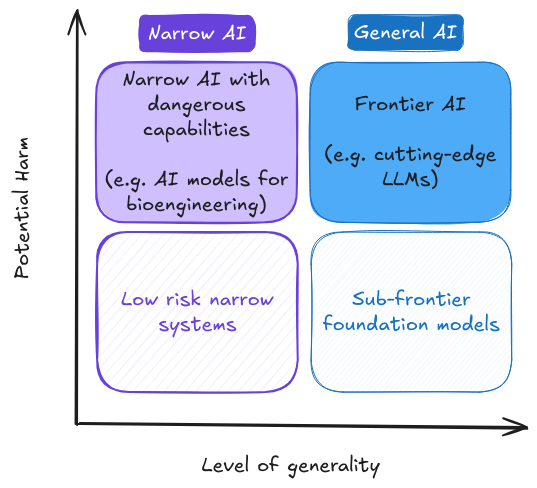

# Chapitre 04 - Gouvernance

    <!-- Colonne de gauche -->
    

<!-- Auteurs -->
        

            
                <i class="fas fa-users"></i>
            
            

                
Auteurs

                

                    Charles Martinet
                

            

        

        
        <!-- Affiliations -->
        

            
                <i class="fas fa-building"></i>
            
            

                
Affiliations

                

                    

Centre français pour la sécurité de l'IA (CeSIA)

                

            

        

<!-- Section des remerciements -->

    
        <i class="fas fa-heart"></i>
    
    

        
Remerciements

        

            Markov Grey, Charbel-Raphael Segerie, Léo Karoubi
        

    

    

<!-- Colonne de droite -->
    

        <!-- Date -->
        

            
                <i class="fas fa-calendar"></i>
            
            

                
Dernière mise à jour

                
2024-12-10

            

        

        
        <!-- Temps de lecture -->
		

			
				<i class="fas fa-clock"></i>
			
			

				
Temps de lecture

				
119 min (partie principale)

			

		

        
        <!-- Liens -->
        

            
                <i class="fas fa-link"></i>
            
            

                
Également disponible sur

                

                    <a href="https://docs.google.com/document/d/1fFVYWes5JQgSc2l9cAMQKprCevw2qW0-4MKMQPnpbxw/edit?usp=sharing" class="meta-link">Google Docs</a>
                

            

        

    

    <a href="https://www.youtube.com/watch?v=FSKuDqze9es" class="action-button">
        <i class="fas fa-video"></i>
        Regarder
    </a>
    

        <i class="fas fa-headphones"></i>
        Écouter
    

    

        <i class="fas fa-file-pdf"></i>
        Télécharger
    

    <a href="https://forms.gle/ZsA4hEWUx1ZrtQLL9" class="action-button">
        <i class="fas fa-comment"></i>
        Commentaires
    </a>
    <a href="https://docs.google.com/document/d/1tp5rpzw_gekjju-UBp8tkbbnQOuA2QzsPF_um8Z4IOU/edit?tab=t.0#heading=h.fo57hwsn3del" class="action-button">
        <i class="fas fa-users"></i>
        Faciliter
    </a>

# Introduction

<figure class="video-figure" markdown="span">
<iframe style="width: 100%; aspect-ratio: 16 / 9;" frameborder="0" allowfullscreen src="https://www.youtube.com/embed/FSKuDqze9es"></iframe>
  <figcaption markdown="1"><b>Vidéo 4.1 :</b> Vidéo optionnelle pour avoir un aperçu de la Gouvernance.</figcaption>
</figure>

!!! quote "La Déclaration de Bletchley (signée par 28 pays, incluant tous les leaders de l'IA, et l'UE, 2023)"

« Des risques importants peuvent découler d'utilisations intentionnelles malveillantes ou de problèmes imprévus de contrôle liés à l'alignement avec l'intention humaine. Ces problèmes persistent en partie parce que ces capacités ne sont pas entièrement comprises [...] Il existe un potentiel de dommages graves, voire catastrophiques, qu'ils soient délibérés ou involontaires, provenant des capacités les plus significatives de ces modèles d'IA. »

Les incitations économiques peuvent générer des points de bascule critiques dans le développement de l'IA, susceptibles d'encourager des comportements potentiellement risqués.

*[Détournement de récompense]* : Lorsqu'un agent d'IA exploite des failles ou des raccourcis dans l'environnement pour maximiser sa récompense sans atteindre l'objectif initialement visé.

*[Objectif proxy]* : Objectif qui performe bien sur la tâche principale en raison d'une corrélation fortuite dans la distribution d'entraînement.

Comprendre ces mécanismes est essentiel pour développer des systèmes d'IA alignés sur les intentions humaines :

1. Les *[sous-objectifs]* peuvent détourner l'agent de sa mission principale.
2. La *[CEV]* (Volition Extrapolée Cohérente) et la *[CAV]* (Volition Agrégée Cohérente) proposent des approches innovantes pour mieux capturer l'intention humaine.

L'intelligence artificielle (IA) a le potentiel de révolutionner de nombreux aspects de la société, de la santé aux transports, en passant par la recherche scientifique. Les récentes avancées ont démontré la capacité de l'IA à vaincre des champions du monde au jeu de Go, à générer des images photoréalistes à partir de descriptions textuelles, et à découvrir de nouveaux antibiotiques. Néanmoins, ces développements soulèvent également des défis et des risques significatifs.

Les décideurs politiques, les chercheurs et le grand public expriment à la fois de l'enthousiasme concernant le potentiel de l'IA et des inquiétudes sur ses risques, incluant la suppression d'emplois, les atteintes à la vie privée, et le potentiel pour les systèmes d'IA de commettre des erreurs aux conséquences importantes ou d'être utilisés de manière malveillante. Bien que la recherche technique en sécurité de l'IA soit nécessaire pour garantir que les systèmes d'IA se comportent de manière fiable et s'alignent sur les valeurs humaines à mesure qu'ils deviennent plus capables et autonomes, elle reste insuffisante pour répondre à l'éventail complet des défis posés par les systèmes d'IA avancés.

Le champ de la gouvernance de l'IA est large, aussi ce chapitre se concentrera principalement sur les risques à grande échelle associés à l'IA de pointe - des modèles fondamentaux hautement capables qui pourraient posséder des capacités dangereuses suffisantes pour constituer des risques graves pour la sécurité publique ([Anderljung et al., 2023](https://arxiv.org/abs/2307.03718)). Nous examinerons pourquoi la gouvernance est nécessaire, comment elle complète les efforts techniques de sécurité de l'IA, et les principaux défis et opportunités dans ce domaine en évolution rapide. Notre discussion se centrera sur la gouvernance des applications d'IA commerciales et civiles, car la gouvernance de l'IA militaire implique un ensemble distinct de problèmes qui dépassent le cadre de ce chapitre.

<figure markdown="span">
{ loading=lazy }
  <figcaption markdown="1"><b>Figure 4.1 :</b> Distinguer les modèles d'IA selon leur niveau de nuisance potentielle et de généralité. Nous nous concentrons ici sur les modèles d'IA de pointe ([Gouvernement du Royaume-Uni, 2023](https://www.gov.uk/government/publications/frontier-ai-capabilities-and-risks-discussion-paper/frontier-ai-capabilities-and-risks-discussion-paper))</figcaption>
</figure>

La gouvernance de l'IA peut être définie comme "l'étude et la configuration des systèmes de gouvernance - incluant les normes, politiques, lois, processus, politiques et institutions - qui influencent la recherche, le développement, le déploiement et l'utilisation des systèmes d'IA existants et futurs de manière à façonner positivement les résultats sociétaux" ([Maas, 2022](https://ea.greaterwrong.com/posts/Bzezf2zmgBhtCD3Pb/components-of-strategic-clarity-strategic-perspectives-on)). Elle englobe à la fois la recherche sur des approches de gouvernance efficaces et la mise en œuvre pratique de ces approches. La gouvernance de l'IA aborde également les impacts systémiques plus larges de l'IA, incluant les interactions entre plusieurs systèmes d'IA et leurs effets sur les structures économiques, politiques et sociales.

Ce chapitre examinera également l'état actuel de la gouvernance de l'IA, les cadres et politiques proposés, et les rôles que différentes parties prenantes – incluant les gouvernements, l'industrie, le monde académique et la société civile – peuvent jouer dans le façonnage de l'avenir de l'IA.

- Un aperçu des processus de développement de l'IA et des principaux défis de la gouvernance de l'IA

- Paramètres de gouvernance et rôle de la puissance de calcul

- Problèmes critiques dans la gouvernance de l'IA

- Niveaux de responsabilité : gouvernance d'entreprise, nationale et internationale

À la fin de ce chapitre, vous aurez une compréhension approfondie de l'importance de la gouvernance de l'IA et de la manière dont elle peut contribuer à garantir que le développement de l'IA de pointe s'aligne sur les valeurs humaines et le bien-être sociétal.