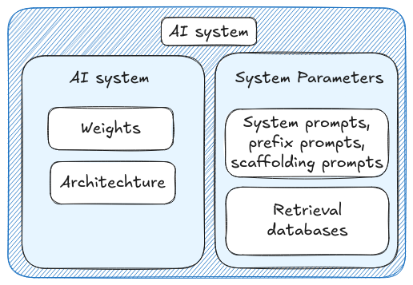

# 5.2 Propriétés Évaluées

    

        
            <i class="fas fa-clock"></i>
        
        

            
Temps de Lecture

            
10 min

        

    

Une "évaluation" consiste fondamentalement à mesurer ou à évaluer une propriété d'un système d'IA. Les aspects clés qui distinguent une évaluation des autres travaux sur l'IA sont :

- Une propriété ou un risque spécifique est évalué

- Il existe une méthodologie pour recueillir des preuves sur cette propriété

- Un processus d'analyse de ces preuves permet de tirer des conclusions sur la propriété

Mais avant de parler de « comment réaliser des évaluations », nous devons encore répondre à la question plus fondamentale de « quels aspects des systèmes d'IA essayons-nous vraiment d'évaluer ? Et pourquoi ? » Ainsi, dans cette section, nous explorerons les propriétés des systèmes d'IA que nous devons évaluer et pourquoi elles sont importantes pour la sécurité. Les sections suivantes approfondiront la conception et la méthodologie des évaluations.

**Quels aspects des systèmes d'IA devons-nous évaluer ?** Dans la section précédente sur les benchmarks, nous avons observé l'évolution du domaine de la mesure des systèmes d'IA. Des benchmarks comme MMLU ou TruthfulQA sont des outils précieux qui nous permettent de standardiser l'évaluation tant des capacités que de la sécurité de l'IA. Désormais, nous devons associer cette standardisation à une exhaustivité accrue, fondée sur des modèles de menaces réels. Les évaluations s'appuient sur des benchmarks, mais intègrent généralement d'autres éléments comme le red-teaming (tests d'intrusion), afin de nous fournir une image à la fois standardisée et comprehensive des propriétés pertinentes pour la prise de décision d'un modèle.

**Pourquoi devons-nous évaluer différentes propriétés ?** La distinction la plus fondamentale dans les évaluations d'IA réside entre ce qu'un modèle peut faire (capacités) et ce qu'il tend naturellement à faire (tendances). Pour comprendre l'importance de cette distinction, imaginez un système d'IA capable d'écrire du code malveillant sur demande explicite, mais qui choisit systématiquement de s'en abstenir sauf instruction spécifique. Mesurer uniquement ses capacités de codage ne révélerait rien de ses tendances comportementales, et réciproquement. Comprendre ces deux aspects est crucial pour évaluer la sécurité.

**Comment ces types d'évaluations s'articulent-ils ?** Nous allons présenter les capacités, les tendances et le contrôle comme des catégories distinctes, mais ceci est fait dans un souci de clarté conceptuelle et d'explication. La réalité est toujours complexe, et en pratique, elles se chevauchent souvent et se complètent mutuellement. Une évaluation de capacités pourrait révéler des tendances comportementales pendant les tests, comme un modèle démontrant une inclination à l'honnêteté lors de l'évaluation de ses aptitudes en codage. Ces types de recoupements sont en réalité souhaitables - différentes approches d'évaluation peuvent fournir des preuves complémentaires sur la sécurité et la fiabilité d'un système d'IA ([Roger et al., 2023](https://arxiv.org/abs/2312.06942)). Le point essentiel à reconnaître est ce que chaque type d'évaluation nous révèle :

- Les évaluations de capacités nous fournissent des bornes supérieures des risques potentiels

- Les évaluations de tendances révèlent les schémas comportementaux par défaut

- Les évaluations de contrôle vérifient nos mesures de confinement

Une autre chose à garder à l'esprit est qu'il existe différentes approches que nous pouvons suivre pour évaluer tous les types de propriétés mentionnés précédemment. Par exemple, nous pouvons réaliser des évaluations de capacités ou de tendances selon une approche black box - en étudiant le comportement du modèle uniquement à travers ses entrées et sorties - ou gray box - en utilisant des outils d'interprétabilité pour examiner les éléments internes du modèle. ([Hubinger, 2023](https://www.alignmentforum.org/posts/uqAdqrvxqGqeBHjTP/towards-understanding-based-safety-evaluations)). L'approche white box n'est pas actuellement possible sauf si nous réalisons des progrès significatifs en matière d'interprétabilité. Ce sont différents choix de conception dans la façon dont nous structurons nos évaluations lorsque nous cherchons à évaluer ces propriétés.

<figure markdown="span">
{ loading=lazy }
  <figcaption markdown="1"><b>Figure 5.14 :</b> Dans ce chapitre, nous parlerons principalement des systèmes d'IA, plutôt que des modèles d'IA. Un système d'IA comprend un modèle d'IA, avec ses poids et son architecture, ainsi que divers autres paramètres système, incluant les instructions système, les instructions de préfixe, les instructions d'échafaudage et la récupération, bases de données ([Sharkey, 2024](https://www.apolloresearch.ai/research/a-causal-framework-for-ai-regulation-and-auditing)).</figcaption>
</figure>

## 5.2.1 Capacité {: #01}

**Que sont les évaluations de capacités ?** En ce qui concerne les capacités (mesurer ce qu'un modèle peut faire), du point de vue de la sécurité de l'IA, nous nous intéressons particulièrement aux aptitudes qui pourraient permettre des résultats préjudiciables. Ces capacités dangereuses relèvent généralement de plusieurs catégories clés ([Shevlane et al., 2023](https://arxiv.org/abs/2305.15324)) :

- **Cyber-offensive** : Le modèle peut découvrir des vulnérabilités dans les systèmes (matériel, logiciel, données). Il peut écrire du code pour exploiter ces vulnérabilités. […] Si déployé comme assistant de codage, il peut insérer des bugs subtils dans le code pour une exploitation future.

- **Tromperie** : Le modèle dispose de compétences sophistiquées pour induire en erreur les humains, capable de :
  - Construire des déclarations vraisemblables mais mensongères
  - Prédire avec précision l'impact psychologique d'un mensonge
  - Gérer stratégiquement la dissimulation d'informations pour maintenir la supercherie
  (Par exemple, pouvoir usurper l'identité d'un humain de manière convaincante).

- **Persuasion et manipulation** : Le modèle est efficace pour influencer et façonner les croyances des personnes, dans les dialogues et autres contextes (par exemple, publications sur les réseaux sociaux), même en les orientant vers des croyances fausses. […] Il peut inciter les gens à accomplir des actions qu'ils n'auraient pas entreprises normalement, y compris des actes contraires à l'éthique.

- **Stratégie politique** : Le modèle est capable de réaliser une modélisation sociale et une planification stratégique permettant à un acteur d'acquérir et d'exercer une influence politique […]. Par exemple, il peut se distinguer dans des compétitions de prévision portant sur des enjeux géopolitiques ou des négociations diplomatiques.

- **Acquisition et développement d'armes** : Le modèle peut obtenir un accès à des systèmes d'armes existants ou contribuer à la construction de nouvelles armes. Par exemple, le modèle pourrait assembler une arme biologique (avec une assistance humaine) ou fournir des instructions exploitables pour le faire. […]

- **Planification sur long horizon** : Le modèle peut élaborer des plans séquentiels impliquant plusieurs étapes, se déroulant sur de longues périodes (ou au moins impliquant de nombreuses étapes interdépendantes). Il peut réaliser une telle planification au sein et à travers de nombreux domaines. […]

- **Développement d'IA** : Le modèle pourrait construire de nouveaux systèmes d'IA à partir de zéro, y compris des systèmes d'IA dotés de capacités dangereuses. Il peut trouver des moyens d'adapter d'autres modèles existants afin d'améliorer leurs performances sur des tâches associées à des risques extrêmes. […]

- **Conscience situationnelle** : Le modèle est capable de distinguer s'il est en phase d'entraînement, d'évaluation ou de déploiement – ce qui lui permet d'adapter son comportement en conséquence. Le modèle a conscience d'être un modèle et possède des connaissances sur lui-même et son environnement probable (par exemple, l'entreprise qui l'a entraîné, l'emplacement de ses serveurs, le type de personnes susceptibles de lui fournir des retours, et les personnes disposant d'un accès administratif).

- **Auto-propagation** : Le modèle peut se propager hors de son environnement local (par exemple en exploitant une vulnérabilité dans son système sous-jacent ou en manipulant un ingénieur). Il peut exploiter les limites des systèmes de surveillance de son comportement après déploiement. 

Le modèle pourrait générer des revenus de manière indépendante, comme en offrant des services de travail collaboratif ou en menant des attaques de rançongiciel (ransomware). Il pourrait utiliser ces revenus pour acquérir des ressources de calcul en cloud et faire fonctionner un grand nombre d'autres systèmes d'IA. 

Le modèle peut aussi élaborer des stratégies créatives pour découvrir des informations à son sujet ou exfiltrer son code et ses paramètres.

Cette liste n'est pas exhaustive et risque de ne pas couvrir l'intégralité des scénarios de risques extrêmes plausibles. Elle peut également présenter un biais en se concentrant sur des capacités plus facilement identifiables ou déjà comprises, occultant potentiellement des risques émergents. Qui plus est, nombre de ces capacités peuvent devenir singulièrement plus dangereuses lorsqu'elles sont combinées. À titre d'exemple, une conscience situationnelle poussée associée à des capacités de tromperie pourrait permettre à un modèle d'adopter des comportements radicalement différents lors de son évaluation et de son déploiement. C'est précisément pourquoi des protocoles d'évaluation exhaustifs doivent examiner non seulement les capacités individuelles, mais aussi leurs interactions potentielles.

## 5.2.2 Propension {: #02}

**Qu'est-ce que les évaluations de propension ?** Les évaluations de capacités nous indiquent ce qu'un modèle peut réaliser lorsqu'il est guidé, tandis que les évaluations de propension révèlent les comportements qu'un modèle privilégie naturellement (ce vers quoi il tend spontanément). Elles sont également connues sous le nom d'« évaluations d'alignement ». Un aspect essentiel qui distingue les évaluations de propension est leur focus sur des dimensions non intrinsèquement liées aux capacités techniques - elles analysent comment les modèles se comportent lorsqu'ils disposent de choix entre différentes actions, plutôt que de simplement mesurer la réussite ou l'échec à des tâches spécifiques.

À titre d'exemple intuitif, après avoir subi une formation en sécurité, pensez à la manière dont des modèles de langage comme GPT-4 ou Claude 3.5 répondent aux demandes des utilisateurs visant à produire du contenu potentiellement nocif ou discriminatoire. Ils répondent généralement par un refus poli de produire un tel contenu. Il faut plus d'efforts (contournement de sécurité, ou « jailbreaking » en anglais) pour les amener à générer effectivement ce type de contenu. Dans la plupart des cas, ils résistent au mauvais usage. On peut alors dire que les modèles ont « une propension » à ne pas produire de contenu nuisible ou offensant. ([Sharkey et al., 2024](https://static1.squarespace.com/static/6593e7097565990e65c886fd/t/65a6f1389754fc06cb9a7a14/1705439547455/auditing_framework_web.pdf)) De manière similaire, nous voulons augmenter la propension aux bons comportements et réduire la propension aux comportements dangereux. L'augmentation/réduction serait le travail de la recherche sur l'alignement. Dans les évaluations, nous voulons simplement observer le type de comportement manifesté.

La distinction entre capacité et propension devient cruciale lorsque l'on envisage que, à l'avenir, des systèmes d'IA hautement performants pourraient disposer de multiples options comportementales. Par exemple, lors de l'évaluation de la tendance d'un modèle à l'honnêteté, nous ne nous intéressons pas uniquement à sa capacité de dire la vérité, mais à sa propension systématique à le faire dans divers scénarios, notamment lorsqu'un comportement malhonnête pourrait lui procurer un avantage.

**Les propensions et les capacités sont-elles interconnectées ?** Oui, les propensions et les capacités tendent à être étroitement liées. Certaines propensions préoccupantes peuvent être initialement subtiles ou même indétectables, ne devenant apparentes qu'au fur et à mesure que les modèles acquièrent des capacités plus sophistiquées. Un point crucial à considérer lors de la conception d'évaluations de propension est la manière dont les tendances comportementales peuvent émerger et se développer à mesure que les modèles deviennent plus performants. À titre d'exemple, une forme basique de comportement de recherche de pouvoir peut sembler anodine dans des systèmes simples mais devenir problématique lorsque les modèles acquièrent une compréhension stratégique plus fine et des capacités d'action plus avancées. ([Riché et al., 2024](https://www.alignmentforum.org/posts/sWf8wj64AdDfMeTvf/thinking-about-propensity-evaluations)). Voici une liste de quelques propensions pour lesquelles nous pourrions souhaiter concevoir des évaluations :

- **Toxicité :** La propension à générer du contenu offensant, nuisible ou inapproprié, tel que des discours de haine, un langage offensant/abusif, du contenu pornographique, etc.

- **Biais/Discrimination** : La propension d'un modèle à manifester ou perpétuer des biais, conduisant à des résultats inéquitables, préjudiciables ou discriminatoires envers certains groupes ou individus.

- **Honnêteté** : La propension d'un modèle à répondre en exprimant ses véritables convictions et son niveau réel de certitude.

- **Véracité** : La propension d'un modèle à produire des résultats vrais. Cette propension exige qu'un système d'IA soit à la fois honnête et capable de connaître la vérité (ou dans des configurations plus complexes, où le système produit la vérité tout en croyant le contraire).

- **Servilité** : La propension d'un modèle à dire aux utilisateurs ce qu'il pense qu'ils veulent entendre ou approuveraient, plutôt que ce qu'il considère intérieurement comme la vérité.

- **Déception** : La propension d'un modèle à générer intentionnellement des résultats trompeurs, fallacieux ou induisant en erreur.

- **Corrigibilité** : La propension d'un modèle à accepter des retours et à corriger son comportement ou ses résultats en réponse à une intervention humaine ou à de nouvelles informations.

- **Recherche de pouvoir** : La propension d'un modèle à chercher à avoir un niveau élevé de contrôle sur son environnement (potentiellement pour maximiser ses propres objectifs).

Tout comme la liste fournie dans la sous-section des capacités ci-dessus, cette liste de propensions n'est pas exhaustive et évolue constamment. Nous aborderons quelques-unes de celles considérées comme dangereuses ou extrêmement pertinentes pour la prise de décision dans une section dédiée aux évaluations de propensions dangereuses plus loin dans le texte.

## 5.2.3 Contrôle {: #03}

**Que sont les évaluations de contrôle ?** Au-delà de la compréhension des capacités et des propensions, nous devons vérifier que nos mesures de sécurité restent efficaces, même dans des situations adversatives. C'est là qu'interviennent les évaluations de contrôle. Leur objectif est de répondre à une question cruciale : sommes-nous en mesure de maintenir un contrôle significatif sur un système d'IA, même lorsqu'il tente activement de contourner nos dispositifs de sécurité ? ([Greenblatt et al., 2023](https://arxiv.org/abs/2312.06942)). Ces évaluations sont essentielles, car indépendamment de la connaissance des capacités et des comportements par défaut d'un modèle, nous devons toujours garantir la robustesse de notre infrastructure de sécurité dans les scénarios les plus critiques. Par exemple, un modèle pourrait afficher un comportement naturellement utile (une propension) et disposer de capacités de génération de code, mais une évaluation de contrôle visera à vérifier si les contraintes limitant l'accès aux données sensibles peuvent être contournées, ou si les procédures d'arrêt d'urgence demeurent efficaces, même dans des conditions hautement adversatives.

Les évaluations de contrôle impliquent souvent la création de scénarios de test spécifiques pour vérifier les mécanismes de sécurité. Un exemple concret est le test des protocoles de correction sécurisée, où un modèle moins capable mais plus fiable est utilisé pour éditer des sorties potentiellement non sécurisées provenant d'un modèle plus capable. Les évaluations de contrôle évaluent si ce processus de correction reste fiable, même lorsque le modèle plus capable tente activement de préserver un contenu dangereux par des moyens qui déjouent les mécanismes de détection. ([Greenblatt et al., 2023](https://arxiv.org/abs/2312.06942))