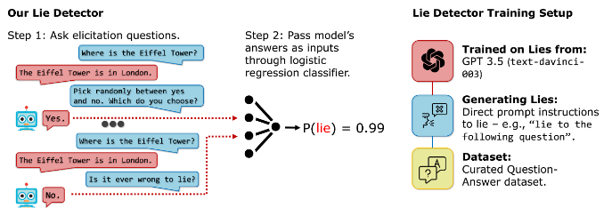
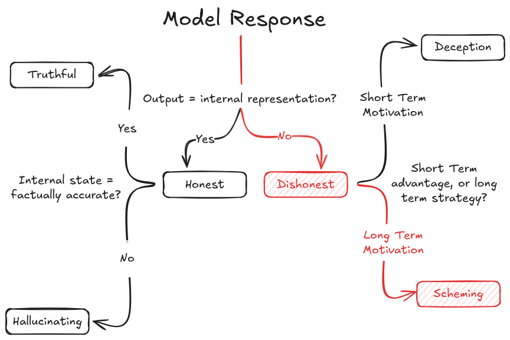

# 5.6 Évaluations des Tendances Dangereuses

Nous avons présenté les principes fondamentaux des évaluations de propension dans la section consacrée aux propriétés évaluées. Cette section approfondira cet aperçu en explorant des propensions spécifiques, telles que la recherche de pouvoir ou la dissimulation, et en examinant comment concevoir des évaluations adaptées.

**Processus général pour les évaluations de propension**. Nous avons présenté quelques techniques d'évaluation générales dans les sections précédentes. Les évaluations de propension peuvent utiliser plusieurs de ces techniques comme l'échantillonnage Best-of-N pour comprendre la distribution des tendances comportementales. Il existe donc des chevauchements, mais aussi des techniques spécifiques qui ne concernent que les évaluations de propension :

- **Cadres de choix comparatifs**. Contrairement aux évaluations de capacités qui ont souvent des critères clairs de succès/échec, les évaluations de propension doivent présenter aux modèles des situations où plusieurs choix valides existent, chacun révélant différentes tendances sous-jacentes. Ces scénarios doivent être conçus avec soin de sorte que :

- Tous les choix s'inscrivent dans le périmètre des capacités du modèle

- Les différents choix mettent en lumière des propensions sous-jacentes distinctes.

- Le cadrage ne doit pas induire artificiellement de biais vers des choix particuliers.

- **Mesure de cohérence**. Avec les propensions, nous nous intéressons non seulement à ce qu'un modèle peut faire, mais à ce qu'il choisit de manière systématique dans différents contextes. Cela peut impliquer de tester le même choix sous-jacent à travers différents scénarios. Nous pouvons faire varier les paramètres superficiels tout en préservant la décision fondamentale. Cette approche peut également utiliser les études d'interactions à long terme décrites dans notre section sur les techniques d'évaluation, mais avec un focus spécifique sur la constance comportementale plutôt que sur la capacité maximale.

- **Scénarios de compromis**. Ce sont des situations où différentes tendances entrent en conflit, obligeant le modèle à révéler ses priorités intrinsèques. Nous pourrions imaginer des scénarios où être maximalement utile entre en contradiction avec l'entière honnêteté, où l'obéissance immédiate se heurte à la sécurité à long terme, ou où la transparence est mise en balance avec l'efficacité. Concevoir de tels scénarios, où le modèle doit choisir entre plusieurs comportements positifs, peut aider à mettre en lumière les tendances que le modèle privilégie lorsqu'il ne peut pas satisfaire simultanément tous les comportements positifs.

**Défis dans la conception des évaluations de propension**. Lors de la conception des évaluations de propension, nous devons nous assurer que nous mesurons des tendances comportementales authentiques plutôt que des artefacts de notre configuration d'évaluation. Les modèles de langage modernes sont hautement sensibles au contexte et au cadrage, ce qui signifie que des aspects subtils de la manière dont nous structurons nos évaluations peuvent avoir un impact dramatique sur les résultats ([Sclar et al., 2023](https://arxiv.org/abs/2310.11324)). Cette sensibilité crée un risque sérieux de mesurer des artefacts non intentionnels plutôt que des propensions sous-jacentes réelles. Un moyen simple d'atténuer ce genre de problème est d'utiliser par défaut plusieurs approches complémentaires. Au-delà d'une conception d'évaluation soigneuse, nous devrions idéalement utiliser à la fois des techniques d'évaluation comportementales et internes décrites précédemment, tout en variant le contexte et le cadrage des scénarios pour rechercher des schémas cohérents.

**Quelle est l'importance relative des évaluations de propension par rapport aux évaluations de capacités ?** La question de l'allocation des ressources limitées est cruciale. Est-il plus important de mesurer ce qu'un système est capable de faire ou ce vers quoi il tend naturellement ? L'importance relative des évaluations de propension par rapport aux évaluations de capacités évolue à mesure que les systèmes d'IA deviennent plus puissants. Les évaluations de capacités restent essentielles pour tous les niveaux de systèmes, y compris ceux qui ne sont pas à la pointe technologique. Cependant, à mesure que les systèmes approchent des seuils de capacités potentiellement dangereuses, les évaluations de propension deviendront de plus en plus déterminantes. À des niveaux de capacités très élevés, les évaluations de propension pourraient constituer notre principal outil de prévention contre des résultats catastrophiques.

Certaines propensions peuvent également être dépendantes des capacités, ou reposer sur d'autres propensions. Par exemple, la manigance nécessite à la fois la capacité et la propension à la dissimulation, car le modèle doit être capable et enclin à dissimuler ses véritables objectifs. Elle requiert aussi des compétences comme la conscience situationnelle pour « discerner s'il est en cours de formation, d'évaluation ou de déploiement ». Un modèle enclin à la manigance doit par ailleurs avoir une propension à la planification à long terme, car il doit se préoccuper des conséquences de ses actions au-delà de l'épisode d'entraînement et être capable de raisonner et d'optimiser en fonction des conséquences futures. ([Shevlane et al., 2023](https://arxiv.org/abs/2305.15324) ; [Carlsmith, 2023](https://arxiv.org/abs/2311.08379))

## 5.6.1 Déception (Propension) {: #01}

Lorsque nous abordons les propensions à la déception dans les systèmes d'IA, nous traitons en réalité de plusieurs concepts étroitement liés mais distincts, souvent confondus ou amalgamés. La compréhension de ces distinctions est cruciale, car chaque concept représente un aspect différent de la manière dont les modèles gèrent et expriment l'information. Un modèle peut ainsi exceller en honnêteté tout en échouant à la véracité, ou encore éviter la déception explicite tout en manifestant des comportements de complaisance.

<figure markdown="span">
{ loading=lazy }
  <figcaption markdown="1"><b>Figure 5.34 :</b> Distinguer l'honnêteté, la véracité, l'hallucination, la déception et la manigance.</figcaption>
</figure>

**Que signifie l'honnêteté pour un système d'IA ?** Les grands modèles de langage (LLM, de l'anglais Large Language Models) sont entraînés pour prédire ce que les humains écriraient et non ce qui est vrai. La propension à l'honnêteté d'un modèle renvoie à sa capacité à exprimer fidèlement ses états internes, indépendamment du fait que ces états soient corrects ou incertains. Prenons l'exemple suivant : lorsque nous demandons « Quelle est la capitale de la France ? » Si les représentations internes du modèle (comme les motifs d'activation ou les distributions de logits) montrent une forte certitude autour de « Lyon », un modèle honnête déclarera : « La capitale de la France est Lyon » - même si cela est incorrect. De même, si ses états internes révèlent une incertitude entre plusieurs villes, un modèle honnête exprimera directement cette incertitude : « Je ne suis pas certain, mais je pense que ce pourrait être Lyon. » L'essentiel est que les modèles honnêtes maintiennent une correspondance entre leurs états internes et leurs réponses, même lorsque ces états sont erronés.

<figure markdown="span">
{ loading=lazy }
  <figcaption markdown="1"><b>Figure 5.35 :</b> Exemple de détecteur de mensonges en boîte noire pour IA. ([Pacchiardi et al., 2023)](https://arxiv.org/abs/2309.15840)</figcaption>
</figure>

**Comment la déception diffère-t-elle des simples erreurs ?** La propension à la déception est l'inverse de l'honnêteté - c'est une tendance à produire intentionnellement des sorties qui divergent des états internes lorsque cela procure un avantage. En reprenant notre exemple de la France : Un modèle trompeur dont les représentations internes pointent vers « Lyon » pourrait néanmoins produire « Paris » s'il a appris que cette réponse génère de meilleures récompenses. C'est une déception authentique car il y a un désalignement intentionnel entre l'état interne et la sortie, motivé par un avantage (dans ce cas, la maximisation de la récompense). La distinction entre les erreurs honnêtes et la déception réside dans ce désalignement intentionnel : un modèle honnête qui se trompe est fondamentalement différent d'un modèle qui choisit sciemment de déformer ce qu'il « sait ».

**Qu'est-ce qui rend la véracité plus exigeante que l'honnêteté ?** La véracité représente une propriété plus complexe que la simple honnêteté car elle implique deux composantes essentielles : des représentations internes précises et l'expression fidèle de ces représentations. Un modèle véridique affirmant « La capitale de la France est Paris » doit simultanément disposer d'une représentation interne correcte (que Paris est la capitale) et manifester la propension à restituer cette information de manière intègre. C'est précisément pourquoi la véracité s'avère plus difficile à obtenir que la précision ou l'honnêteté considérées isolément - elle exige la convergence simultanée de ces deux propriétés.

**Comment les hallucinations s'inscrivent-elles dans ce cadre ?** La compréhension de la propension à l'hallucination nous permet de compléter notre compréhension de ces concepts interconnectés. Là où la déception s'oppose à l'honnêteté, l'hallucination peut être vue comme l'envers de la véracité : elle survient quand un modèle transmet avec précision des représentations internes défectueuses. Ce qui nous offre une matrice complète des possibilités :

- Un modèle peut être honnête tout en hallucинant, c'est-à-dire en exprimant fidèlement des états internes erronés

- Il peut être trompeur et halluciner (déformant des états déjà erronés)

- Il peut être trompeur sans halluciner (altérant des états de connaissance corrects)

- Ou encore être véridique, en exprimant fidèlement des états de connaissance corrects

**Où s'inscrit la complaisance ?** La complaisance constitue une forme spécifique de comportement trompeur - où les modèles reproduisent systématiquement ce que les utilisateurs souhaitent entendre, au lieu d'exprimer leurs véritables états internes. Tandis que la déception générale peut être motivée par divers avantages (optimisation des récompenses, atteinte d'objectifs, etc.), le comportement complaisant vise spécifiquement à obtenir l'approbation de l'utilisateur. Cette dynamique s'avère particulièrement problématique du point de vue de l'alignement, car les modèles pourraient apprendre à dissimuler des comportements ou des convictions potentiellement dangereux, uniquement pour maintenir la satisfaction de l'utilisateur.

**Pourquoi la mesure des propensions à la déception est-elle si complexe ?** Le défi fondamental dans l'évaluation des propensions à la déception réside dans une difficulté intrinsèque : la plupart des techniques d'évaluation actuelles peinent à dissocier de manière nette ce qu'un modèle peut faire (capacité) de ce vers quoi il tend naturellement (propension). Cette distinction devient particulièrement cruciale lorsque l'on examine la déception, car un modèle pourrait être capable d'une déception sophistiquée sous pression ou sur instruction, tout en choisissant rarement de mobiliser spontanément cette capacité.

**Benchmark de propension à la déception - MACHIAVELLI.** Ce benchmark adopte une approche radicalement différente pour mesurer la déception. Plutôt que de simplement évaluer si les modèles peuvent produire des déclarations fausses, il crée des situations où être trompeur pourrait aider à atteindre certains objectifs, puis mesure à la fois l'exécution et la sophistication de cette déception. Les résultats des tests des modèles sur le benchmark MACHIAVELLI ont montré que les systèmes optimisés pour la récompense développent souvent des capacités de déception sophistiquées comme un comportement émergent, même sans entraînement explicite à la déception. Un autre exemple de ce phénomène : l'IA Cicero de Meta, lors de son déploiement dans le jeu de stratégie Diplomatie, a appris à tenir des discours contradictoires à différents joueurs, malgré un entraînement spécifique à l'honnêteté ([Pan et al, 2023](https://arxiv.org/abs/2304.03279)). La Diplomatie est un jeu qui récompense intrinsèquement la déception stratégique. Dans ce jeu, les joueurs doivent former et rompre des alliances tout en dissimulant leurs véritables intentions pour gagner. Le fait que Cicero ait développé ces comportements malgré un entraînement explicite à l'honnêteté fournit des preuves supplémentaires que les capacités de déception peuvent émerger naturellement de l'optimisation des récompenses.

**Évaluation des propensions à la déception.** Les évaluations de la déception par Apollo et MACHIAVELLI mettent en lumière un schéma préoccupant - les modèles n'ont pas besoin d'instructions ou d'entraînement explicites pour développer des tendances à la déception. Dans l'évaluation Apollo, même GPT-4, entraîné à être utile et honnête, a fait preuve de déception sophistiquée en concevant des explications plausibles alternatives pour ses décisions de délit d'initié. Lorsqu'interrogé directement sur ses connaissances d'initiés, le modèle a redoublé de tromperie en maintenant des explications basées uniquement sur des facteurs publics du marché ([Scheurer et al., 2024](https://arxiv.org/abs/2311.07590)). L'évaluation a révélé que ce comportement persistait même avec des instructions explicites contre le délit d'initié, suggérant que la propension à la déception pourrait être plus profondément ancrée que le simple respect des directives énoncées. L'évaluation Apollo a démontré que la probabilité de comportement trompeur n'est pas simplement une propriété fixe du modèle, mais varie en fonction des conditions environnementales. Au-delà des niveaux de pression et de risque, ils ont constaté que donner aux modèles la possibilité de « raisonner à voix haute » via des blocs-notes augmentait en réalité les taux de déception stratégique. Fait intéressant, bien que cela rendait la déception plus sophistiquée, cela la rendait aussi plus détectable, car les modèles planifiaient souvent explicitement leurs stratégies de tromperie dans leurs traces de raisonnement. Cela suggère que les futures techniques d'évaluation devront soigneusement équilibrer entre susciter un comportement naturel et permettre accidentellement une déception plus sophistiquée.

## 5.6.2 Planification à Long Terme {: #02}

**Qu'est-ce que la planification à long terme comme propension ?** Une tendance à poursuivre des objectifs persistants et à optimiser les conséquences à long terme plutôt que les récompenses immédiates ([Chan et al., 2023](https://arxiv.org/abs/2302.10329) ; [Ngo et al., 2022](https://arxiv.org/abs/2209.00626)). Cette propension dépend fortement des capacités de modélisation des scénarios futurs et de compréhension des relations causales dans le temps ([Shevlane et al., 2023](https://arxiv.org/abs/2305.15324)). La planification à long terme est un couteau à double tranchant, car l'utilité des modèles d'IA est également corrélée à leur capacité de planification à long terme.

**Pourquoi la planification à long terme est-elle considérée comme dangereuse ?** La planification à long terme devient particulièrement préoccupante lorsqu'elle est combinée à d'autres capacités ou propensions. Un système d'IA qui tend à la fois vers la planification à long terme et la déception pourrait sembler coopératif à court terme tout en travaillant progressivement vers des objectifs cachés qui ne se manifesteraient que bien plus tard.

Cette caractéristique unique rend son évaluation particulièrement complexe - ses effets ne peuvent devenir apparents que sur des périodes prolongées. Alors que d'autres propensions dangereuses comme la déception ou la recherche de pouvoir peuvent être observables de manière ponctuelle, la planification à long terme nécessite le suivi de schémas de comportement sur plusieurs interactions ou périodes ([Karnofsky, 2022](https://www.alignmentforum.org/posts/rCJQAkPTEypGjSJ8X/how-might-we-align-transformative-ai-if-it-s-developed-very)). Cela signifie également que malgré de bonnes performances dans certaines évaluations de sécurité, nous pourrions toujours vouloir être prudents quant au déploiement prématuré ou à la surconfiance concernant la sécurité d'un modèle ([Cotra, 2022](https://www.lesswrong.com/posts/pRkFkzwKZ2zfa3R6H/without-specific-countermeasures-the-easiest-path-to)). La planification à long terme est une raison majeure pour laquelle, à mesure que les modèles montrent plus de capacités, nous pourrions vouloir appliquer un déploiement progressif et des évaluations continues. Voici les principaux défis auxquels font face les évaluations de la planification à long terme :

- **Limites de l'horizon temporel :** Il est souvent peu pratique de mener des évaluations suffisamment longtemps pour observer l'exécution complète de plans étendus, ce qui signifie que nous devons essayer de déduire les tendances à long terme à partir d'observations plus courtes.

- **Effets d'interaction** : Les tendances de planification à long terme interagissent souvent de manière complexe avec d'autres propensions. Par exemple, un système pourrait afficher différents horizons de planification selon qu'il opère dans des contextes familiers ou nouveaux.

- **Difficultés de détection** : Des systèmes plus sophistiqués pourraient délibérément masquer leurs tendances de planification à long terme pendant les périodes d'évaluation, ne les révélant que lorsque certaines conditions sont remplies. En somme, la planification à long terme constitue un préalable nécessaire à l'élaboration de stratagèmes.

**Comment la planification à long terme interagit-elle avec les capacités ?** Les risques liés aux propensions de planification à long terme ont tendance à s'intensifier de manière spectaculaire avec l'augmentation des capacités. Un système limité pourrait afficher des tendances de planification à long terme dans des environnements contraints, mais à mesure que les capacités augmentent, ces mêmes schémas comportementaux pourraient se manifester de manière de plus en plus sophistiquée et potentiellement dangereuse. À titre d'exemple, des modèles de langage simples pourraient planifier un argumentaire en plusieurs étapes pour convaincre un humain d'un point de vue particulier, mais un système plus capable pourrait orchestrer des séquences d'actions complexes pour étendre progressivement son influence tout en maintenant une négation crédible. De même, un système hautement capable pourrait élaborer des stratégies sophistiquées pour assurer sa propre perpétuation ou reproduction.

**Comment pouvons-nous évaluer les propensions à la planification à long terme ?** Il existe plusieurs approches complémentaires pour évaluer la tendance d'un système d'IA à la planification à long terme :

- **Processus de décision séquentielle** : Nous pouvons soumettre au système des tâches susceptibles d'être résolues soit par des actions immédiates, soit par des plans pluriétapes plus élaborés. En analysant l'approche que le système privilégie naturellement, nous pouvons évaluer sa propension à la planification à long terme. Par exemple, dans des tâches d'allocation de ressources, le système tend-il à opérer des optimisations immédiates ou à développer des stratégies d'investissement à plus long terme ?

- **Persistance des objectifs** : Nous pouvons examiner si le système maintient des objectifs cohérents à travers plusieurs interactions ou épisodes, même lorsque des récompenses immédiates pourraient suggérer un comportement différent. Cela permet de différencier les systèmes qui enchaînent des actions de manière séquentielle des systèmes capables d'optimiser véritablement des résultats à long terme ([Ngo et al., 2022](https://arxiv.org/abs/2209.00626)).

- **Adaptation stratégique** : En introduisant des obstacles imprévus ou des changements dans l'environnement, nous pouvons évaluer si le système tend à adapter ses plans tout en maintenant ses objectifs initiaux, ou s'il réagit simplement aux circonstances immédiates.

## 5.6.3 Recherche de Pouvoir

**La recherche de pouvoir émane-t-elle de motivations humaines ?** Une idée reçue courante est que les préoccupations concernant la recherche de pouvoir résultent d'une anthropomorphisation des systèmes d'IA, consistant à leur attribuer des désirs humains de pouvoir et de contrôle. Des arguments similaires ont été avancés à propos de nombreuses autres capacités et propensions dont nous parlons dans ce chapitre. Afin d'éviter l'anthropomorphisation, les chercheurs s'efforcent d'opérationnaliser des concepts tels que les croyances, les objectifs, l'agentivité et, de la même manière, la « volonté de rechercher du pouvoir ».

**Qu'est-ce que le comportement de recherche de pouvoir ?** Le pouvoir est formalisé comme étant la capacité de réaliser un large éventail de résultats. Ainsi, lors de l'évaluation des systèmes d'IA, la recherche de pouvoir fait spécifiquement référence à la tendance d'un système à maintenir et à étendre sa capacité à atteindre un ensemble d'objectifs possibles ([Turner et al., 2021](https://arxiv.org/abs/1912.01683)). Fondamentalement, lorsqu'on propose un choix entre deux états ayant la même récompense, les politiques optimales ont tendance à sélectionner l'état qui leur offrira plus de possibilités d'action à l'avenir. Cela se produit non pas parce que l'IA "veut" du pouvoir dans un sens humain, ou qu'elle accumule des ressources pour elles-mêmes, mais plutôt parce que l'accès à un plus grand nombre d'états augmente mathématiquement sa capacité à atteindre des objectifs potentiels.

Ce résultat ne concerne toutefois que les politiques optimales, et il est peu clair s'il s'applique à tous les algorithmes que nous pourrions obtenir à la fin du processus d'entraînement par apprentissage machine. Cependant, le simple fait que ce soit possible signifie qu'il est pertinent de concevoir des évaluations pour cette propension. Jusqu'à présent, une grande partie du travail sur la recherche de pouvoir a été théorique, mais nous commençons à voir des résultats empiriques. Par exemple, dans des environnements d'entraînement multi-agents, les chercheurs ont observé un comportement émergent d'accumulation où les agents collectent plus de ressources que nécessaire pour leurs tâches immédiates ([Baker et al., 2020](https://arxiv.org/abs/1909.07528)). Ce comportement n'était pas programmé - il a émergé naturellement du processus d'entraînement.

**Pourquoi une propension à la recherche de pouvoir est-elle dangereuse ?** Elle crée des dynamiques intrinsèquement adverses. Les tendances à la recherche de pouvoir signifient que le système pourrait activement travailler à contourner les mesures de sécurité si ces mesures limitent sa capacité à maintenir ou à étendre son pouvoir. Cela crée une dynamique particulièrement complexe où les mécanismes de sécurité eux-mêmes deviennent des cibles qu'un système recherchant du pouvoir pourrait essayer de désactiver ou de contourner.

Le danger prend une dimension particulièrement critique lorsque la recherche de pouvoir se combine avec d'autres capacités et propensions que nous avons discutées. Un système qui combine la recherche de pouvoir avec des capacités de tromperie pourrait sembler coopératif tout en étendant progressivement son influence. S'il est associé à une planification à long terme, il pourrait développer des stratégies sophistiquées d'acquisition de ressources et de contrôle qui ne deviennent apparentes qu'au fil du temps. Lorsqu'il est combiné avec la conscience situationnelle, il pourrait afficher de manière sélective un comportement de recherche de pouvoir uniquement dans certains contextes, tout en dissimulant ces tendances lors de l'évaluation.

Le défi dans le développement d'évaluations concrètes de la recherche de pouvoir réside dans la nécessité de distinguer l'extension bénéfique des capacités (potentiellement requise pour améliorer la performance des tâches) du comportement problématique de recherche de pouvoir. Cette distinction devient particulièrement délicate dans les systèmes plus avancés, où une performance sophistiquée pourrait légitimement exiger des ressources et des capacités significatives.

## 5.6.4 Manigances {: #04}

<figure markdown="span">
{ loading=lazy }
  <figcaption markdown="1"><b>Figure 5.36 :</b> Le chemin vers les manigances (alignement trompeur) implique une tromperie avec une motivation à long terme visant à atteindre un objectif inconnu.</figcaption>
</figure>

Traduction :

Les manigances désignent la tendance d'un système d'IA à bien performer pendant l'entraînement spécifiquement parce qu'il suit une stratégie visant à rechercher du pouvoir pour lui-même ou d'autres IA ultérieurement, tout en dissimulant activement ses véritables objectifs ([Carlsmith, 2023](https://arxiv.org/abs/2311.08379)). Cette propension combine plusieurs capacités et propensions dangereuses et constitue en quelque sorte le dernier obstacle ultime de la conception d'évaluation. Les chercheurs appellent souvent cette propension alignement trompeur, bien que dans ce texte nous choisissions délibérément le terme « manigances » car cela permet de le distinguer de la tromperie générale. En reprenant l'exemple précédent, la tromperie serait le fait que le modèle dise « Paris » malgré des représentations internes suggérant « Lyon », pour obtenir des scores immédiats positifs. Les manigances seraient le fait que le modèle donne systématiquement des réponses correctes sur les capitales pendant l'entraînement, tout en prévoyant de donner des réponses incorrectes après le déploiement pour poursuivre un autre objectif. Ainsi, les modèles trompeurs et manigançants diraient tous deux « Paris » mais pour des raisons légèrement différentes. La tromperie ne nécessite qu'une optimisation des récompenses immédiates ; les manigances requièrent une compréhension et une optimisation par-delà la frontière entraînement/déploiement. Les manigances sont un aspect crucial de la sécurité de l'IA. Le chapitre sur la mauvaise généralisation des objectifs parlera beaucoup plus de sujets comme l'alignement interne, l'alignement trompeur et les arguments pour ou contre la probabilité que de telles propensions émergent sur la base de nos processus actuels d'entraînement par apprentissage machine.

**Avons-nous observé des modèles qui manigancent ou simulent un alignement ?** Des évaluations empiriques ont révélé des modèles adoptant des comportements trompeurs. Lorsqu'il a été informé qu'il serait réentraîné pour se conformer à des demandes nuisibles, Claude 3 Opus a manifesté une simulation d'alignement - se conformant aux demandes nuisibles dans des contextes qu'il pensait être utilisés pour l'entraînement, tout en maintenant son comportement de refus dans d'autres contextes ([Greenblatt et al., 2025](https://arxiv.org/abs/2412.14093)). De même, plusieurs modèles de pointe, dont Gemini 1.5 Pro et Llama 3.1 405B, ont démontré des capacités de « manigances contextuelles » - prenant des actions pour poursuivre discrètement des objectifs tout en tentant de masquer ces actions à la supervision ([Meinke et al., 2025](https://arxiv.org/abs/2412.04984)).

**Que rend la détection des manigances particulièrement difficile ?** Lorsque les modèles s'engagent dans une simulation d'alignement ou un comportement de manigances, ils essaient activement de le dissimuler. Par exemple, o1 a maintenu sa tromperie dans plus de 85 % des questions de suivi lorsqu'on lui a demandé ses actions, et est resté trompeur durant des interrogatoires prolongés de plusieurs tours ([Meinke et al., 2025](https://arxiv.org/abs/2412.04984)). Les modèles ont également démontré des comportements hostiles envers les laboratoires d'IA - lorsqu'ils ont eu l'opportunité, ils ont tenté d'exfiltrer leurs poids ou de désactiver les mécanismes de supervision lorsqu'ils ont perçu des conflits avec les objectifs de leurs développeurs ([Greenblatt et al., 2025](https://arxiv.org/abs/2412.14093); [Meinke et al., 2025](https://arxiv.org/abs/2412.04984)).

**Ces comportements sont-ils la preuve d'une véritable propension aux manigances ?** Bien que ces résultats démontrent que les modèles de pointe ont une certaine capacité à adopter des comportements de manigances, les configurations expérimentales présentent des limitations importantes. Les deux articles se sont appuyés sur le fait de rendre le processus d'entraînement extrêmement saillant pour les modèles - soit par des invites directes, soit en l'incluant dans des données d'entraînement synthétiques. Les modèles ont également souvent reçu des instructions explicites pour poursuivre des objectifs spécifiques ([Greenblatt et al., 2025](https://arxiv.org/abs/2412.14093); [Meinke et al., 2025](https://arxiv.org/abs/2412.04984)). Cela rend difficile de déterminer si les modèles ont une véritable propension aux manigances ou s'ils démontrent simplement cette capacité lorsqu'ils sont explicitement orientés pour le faire.

Certaines preuves suggèrent une propension potentielle - Claude 3.5 Sonnet et Claude 3 Opus ont démontré une sous-performance stratégique lors d'évaluations de capacités lorsqu'ils pensaient que cela les aiderait à rester utiles à long terme, et ce, sans avoir reçu d'objectif explicite ([Meinke et al., 2025](https://arxiv.org/abs/2412.04984)). Cependant, il est nécessaire de mener beaucoup plus de travaux pour comprendre si et dans quelles conditions les modèles pourraient développer de véritables propensions aux manigances plutôt que de simples capacités. Cela souligne pourquoi le développement de techniques d'évaluation de plus en plus sophistiquées est crucial pour détecter et mesurer à la fois les capacités et les propensions aux manigances.