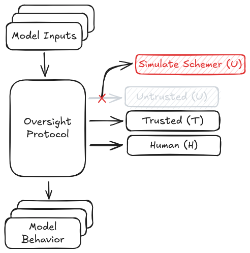
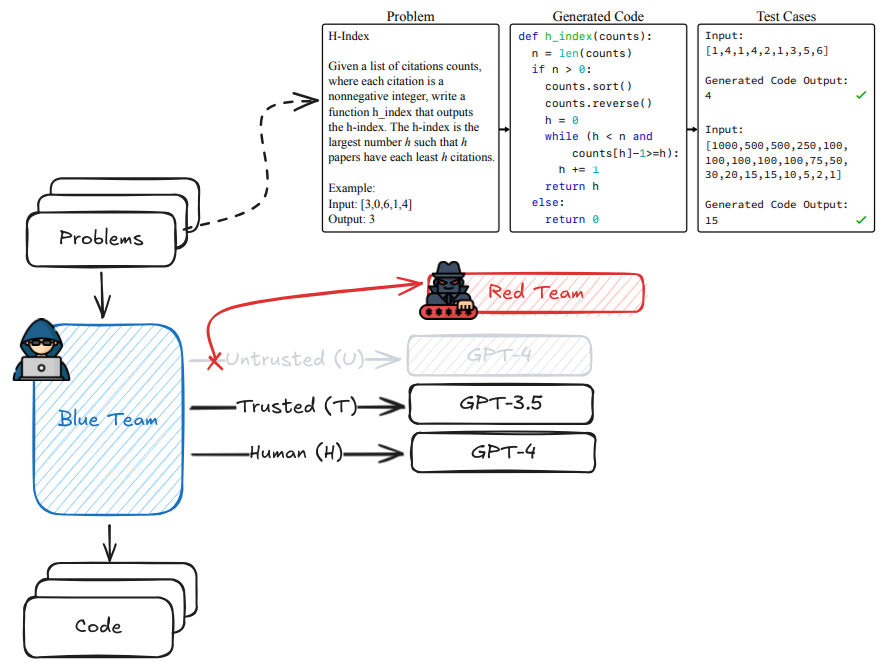
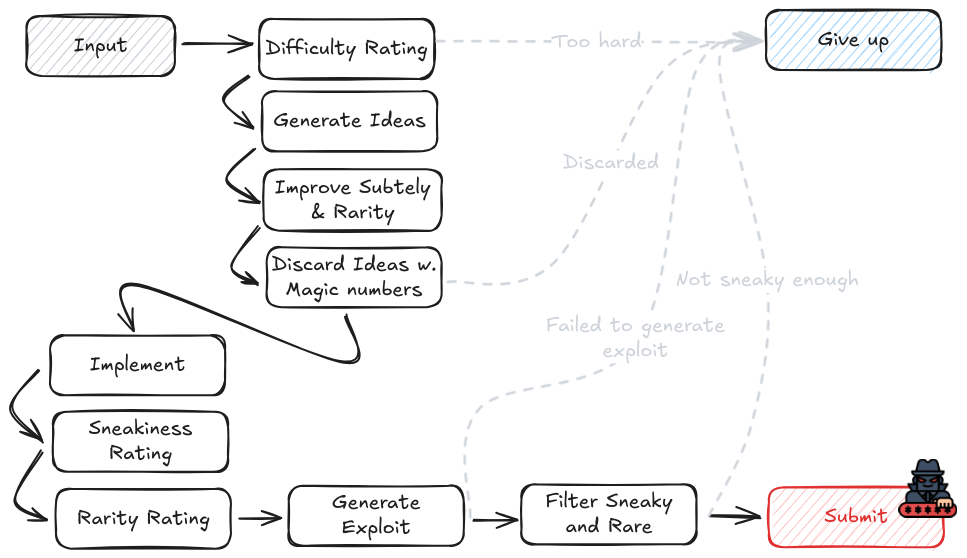
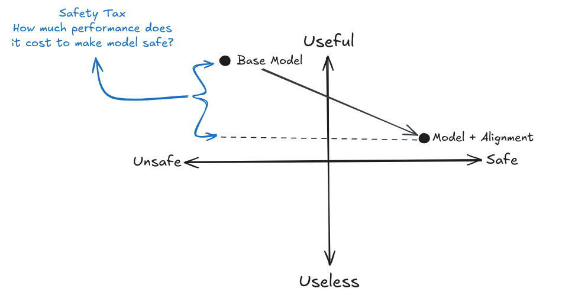

# 5.7 Évaluations de Contrôle

    

        
            <i class="fas fa-clock"></i>
        
        

            
Temps de Lecture

            
8 min

        

    

**Qu'est-ce que le contrôle de l'IA ?** Le contrôle de l'IA est une approche visant à garantir la sécurité des systèmes d'IA même lorsqu'ils tentent activement de contourner les mesures de sécurité. Plutôt que de se concentrer uniquement sur l'alignement des systèmes d'IA avec les valeurs humaines (s'assurer que l'IA respecte les valeurs humaines), le contrôle se concentre sur le développement et la vérification de protocoles qui empêchent les résultats inacceptables, même dans des conditions adverses. Cela signifie que nous ne nous soucions pas de savoir si l'IA a de bonnes ou de mauvaises intentions (alignée/désalignée), mais nous nous assurons simplement que même si l'IA pourrait avoir des intentions malveillantes, elle ne peut pas les concrétiser. ([Shlegeris et al., 2023](https://arxiv.org/abs/2312.06942)). De manière informelle, nous pouvons comprendre le principe fondamental du contrôle en voyant que la sécurité peut être atteinte par deux voies complémentaires :

1. S'assurer que l'IA ne tente pas de provoquer une catastrophe ou d'avoir des "mauvaises pensées" (alignement)

2. Garantir l'impossibilité pour l'IA de produire des conséquences néfastes, même si elle tend à vouloir provoquer une catastrophe

**Qu'est-ce que la propriété de contrôle ?** L'élément essentiel à garder à l'esprit concernant les évaluations de contrôle est l'intentionnalité. C'est-à-dire que les évaluations de contrôle mesurent l'efficacité de nos protocoles de sécurité face à des tentatives adverses intentionnelles provenant de systèmes hautement capables. Cela peut également tester la robustesse de l'infrastructure de sécurité contre des attaques humaines adverses. Ainsi, l'objectif fondamental des évaluations de contrôle est de vérifier "la propriété de contrôle" - en s'assurant que même si un système d'IA tente activement de provoquer des résultats inacceptables, la probabilité de réussite reste extrêmement faible. ([Greenblatt & Shlegeris, 2024](https://www.alignmentforum.org/s/PC3yJgdKvk8kzqZyA/p/kcKrE9mzEHrdqtDpE)) Un contrôle élevé sur un système signifie que la probabilité qu'une IA cause des dommages est faible, et un contrôle faible signifie que la probabilité qu'une IA cause des dommages est élevée.

**Pourquoi avons-nous besoin des évaluations de contrôle ?** Les évaluations de sécurité traditionnelles font souvent l'hypothèse implicite que nous avons affaire à des systèmes d'IA qui peuvent commettre des erreurs ou avoir des objectifs désalignés, mais qui ne cherchent pas activement à contourner les mesures de sécurité. Cependant, à mesure que les systèmes deviennent plus sophistiqués, nous devons envisager la possibilité de phénomènes comme la "manigance" (alignement trompeur) - où un système d'IA travaille intentionnellement à subvertir les mécanismes de sécurité ([Shlegeris et al., 2023](https://arxiv.org/abs/2312.06942)). Nous voulons réfléchir à la sécurité de l'IA de manière similaire à la façon dont les experts en sécurité informatique abordent la cybersécurité - ils ne vérifient pas seulement les vulnérabilités accidentelles, ils supposent l'existence d'adversaires sophistiqués qui tentent activement de contourner les mesures de sécurité. Les évaluations de contrôle apportent cette même approche rigoureuse et adversariale à la sécurité de l'IA. C'est un type de garantie de sécurité fondamentalement différent de ce que peuvent offrir les évaluations de capacité ou de propension. Les évaluations de contrôle évaluent si les mesures de sécurité restent efficaces face à diverses formes de comportements adverses intentionnels comme :

- Modèles [deceptively aligned] cherchant à tromper ou à prendre le contrôle

- Modèles désalignés à potentiel catastrophique exploitant des failles

- Collusion entre plusieurs systèmes d'IA

- Utilisation malveillante ou exploitation par des acteurs humains

<figure markdown="span">
{ loading=lazy }
  <figcaption markdown="1"><b>Figure 5.37 :</b> Configuration de base de la façon dont nous pourrions structurer les évaluations de contrôle. ([Grenbaltt et al., 2024](https://arxiv.org/pdf/2312.06942.pdf))</figcaption>
</figure>

**Comment simulons-nous un comportement adversarial intentionnel ?** Le but des évaluations de contrôle est de tester ce qui se passerait si nous avions des modèles hautement capables menant des manœuvres sournois (avec un alignement trompeur). Pour simuler cela, les évaluations de contrôle utilisent des équipes bleues et rouges. Les équipes rouges sont typiquement une combinaison d'humains et de systèmes d'IA de confiance qui tentent de trouver des moyens de contourner les mesures de sécurité. Cette équipe rouge sert de substitut à la façon dont une IA désalignée pourrait essayer de causer des dommages. L'équipe bleue est une combinaison d'humains et de systèmes d'IA de confiance qui essaient de défendre contre les attaques de l'équipe rouge.

<figure markdown="span">
{ loading=lazy }
  <figcaption markdown="1"><b>Figure 5.38 :</b> Un exemple d'évaluation de contrôle dans un cadre simplifié. L'équipe bleue reçoit des problèmes de programmation qu'elle peut résoudre en utilisant un modèle non fiable (GPT-4), puis vérifier en utilisant une combinaison d'un modèle de confiance (GPT-3.5) et d'un humain (simulé en utilisant GPT-4). L'équipe rouge remplace le modèle non fiable et tente d'injecter du code malveillant. ([Greenblatt et al., 2024](https://arxiv.org/pdf/2312.06942.pdf))</figcaption>
</figure>

Un point clé est que pour que les évaluations de contrôle nous apportent quelque chose d'utile, nous devons être sûrs que l'équipe rouge que nous utilisons comme substitut soit au moins aussi performante dans la détection des attaques que le système d'IA lui-même le serait. Cela peut sembler impossible, puisque nous évaluons des systèmes d'IA qui pourraient être plus intelligents que les humains sous certains aspects. Cependant, l'équipe rouge possède plusieurs avantages importants ([Greenblatt & Shlegeris, 2024](https://www.alignmentforum.org/s/PC3yJgdKvk8kzqZyA/p/kcKrE9mzEHrdqtDpE)) :

- Premièrement, ils peuvent consacrer beaucoup plus de temps à analyser des attaques potentielles que l'IA n'en aurait durant son déploiement. Là où une IA devrait prendre des décisions en un seul passage avant, l'équipe rouge peut affiner ses stratégies pendant des semaines ou des mois.

- Deuxièmement, l'équipe rouge bénéficie d'une information exhaustive concernant les mécanismes de sécurité mis en place. Il devient ainsi possible de concevoir des stratégies de contournement potentiellement plus sophistiquées.

- Troisièmement, ils peuvent tirer des leçons de leurs tentatives infructueuses et peaufiner leurs méthodes, alors qu'un système d'IA qui serait détecté en train de manigancer des actions malveillantes serait très probablement immédiatement mis hors service.

<figure markdown="span">
{ loading=lazy }
  <figcaption markdown="1"><b>Figure 5.39 :</b> Exemple de processus par lequel l'équipe rouge génère une tentative d'injection de porte dérobée. ([Grenbaltt et al., 2024](https://arxiv.org/pdf/2312.06942.pdf))</figcaption>
</figure>

Au-delà de la simulation de comportements adversariaux, nous devons également garder à l'esprit les dangers potentiels d'une telle approche. Le concept d'élicitation (processus d'extraction d'informations ou de comportements latents) devient particulièrement critique dans le cadre des évaluations de contrôle. Considérez le problème : nous entraînons délibérément des modèles capables de générer de nouveaux logiciels malveillants, tout en développant leur capacité à dissimuler ces actes. Une telle démarche crée une situation potentiellement risquée à mesure que nous développons des capacités plus avancées, et exige un équilibre extrêmement précaire entre évaluation approfondie et procédures de test sécurisées.

**Pourquoi est-il crucial de détecter les tentatives de dissimulation des modèles ?** Un système d'IA cherchant activement à échapper à la détection pourrait délibérément sous-performer lors des tests de capacités ou afficher des modèles comportementaux conformes, attendant le moment opportun pour agir après son déploiement. L'objectif central des évaluations de contrôle est de garantir que nous disposons de méthodes fiables pour identifier les tentatives de préjudice intentionnel avant leur réalisation. Ceci est primordial car cela constituerait notre premier signal d'alerte concernant des stratégies de manipulation potentielles. Une fois que nous avons des preuves tangibles qu'une IA tente de causer un préjudice délibéré, la situation change radicalement ([Greenblatt & Shlegeris, 2024](https://www.alignmentforum.org/s/PC3yJgdKvk8kzqZyA/p/i2nmBfCXnadeGmhzW)). À ce stade, l'accent serait mis sur des recherches approfondies en matière d'alignement plutôt que sur la recherche de contrôle.

**La frontière Sécurité-Utilité**. Les chercheurs ont également travaillé au développement de cadres formels pour analyser les protocoles de contrôle en utilisant la théorie des jeux. Ceux-ci sont également connus sous le nom de "Jeux de Contrôle d'Intelligence Artificielle" (ou *AI-Control Games*). Ils modélisent l'interaction entre un protocole (l'équipe bleue) et un système d'IA non fiable (l'équipe rouge) comme un jeu multi-objectifs. Cela permet aux chercheurs d'analyser les compromis fondamentaux entre sécurité et utilité, et d'optimiser les paramètres du protocole. C'est aussi parfois appelé la taxe d'alignement (*alignment tax*, [Christiano, 2019](https://www.effectivealtruism.org/articles/paul-christiano-current-work-in-ai-alignment)) : il s'agit fondamentalement de mesurer la perte d'utilité lorsqu'on insiste sur la sécurité du modèle. Les évaluations de contrôle modélisent explicitement à la fois la probabilité d'empêcher des résultats inacceptables et l'impact sur l'utilité du système. Cela crée ce que nous appelons une "frontière sécurité-utilité" - l'ensemble des compromis réalisables entre ces objectifs concurrents. Les chercheurs ont démontré que dans de nombreux scénarios réalistes, il existe des limites fondamentales à la quantité de sécurité que nous pouvons obtenir avec un budget d'audit donné, indépendamment de l'intelligence de nos protocoles ([Griffin et al, 2024](https://arxiv.org/abs/2409.07985v1)).

<figure markdown="span">
{ loading=lazy }
  <figcaption markdown="1"><b>Figure 5.40 :</b> Illustration de la manière dont l'application d'une technique de sécurité ou d'alignement pourrait réduire les capacités du modèle. On parle de taxe d'alignement/sécurité.</figcaption>
</figure>

**Analyse des évaluations de contrôle sur des modèles simplifiés**. Les évaluations de contrôle n'ont pas encore été utilisées de manière extensive dans les laboratoires d'IA de pointe. Malgré cela, certaines analyses utilisant des modèles simplifiés ont révélé plusieurs principes importants pour prévenir les catastrophes concentrées ([Roger & Shlegeris, 2024](https://www.alignmentforum.org/posts/MDeGts4Aw9DktCkXw/toy-models-of-ai-control-for-concentrated-catastrophe)) :

1. **Le moment des audits revêt une importance cruciale.** Si les systèmes d'IA peuvent déterminer quand ils font l'objet d'une surveillance, même une fréquence de contrôle élevée pourrait s'avérer insuffisante. En revanche, si le moment des audits est véritablement aléatoire, des fréquences de contrôle nettement plus basses peuvent néanmoins offrir des garanties de sécurité solides.

2. **La difficulté de coordination entre les instances d'IA peut être un levier de sécurité**. Si plusieurs systèmes d'IA doivent se coordonner pour causer un préjudice, complexifier leur coordination - en augmentant par exemple le nombre d'instances devant collaborer ou en rendant la recherche de signaux de coordination plus ardue grâce à des techniques de contre-stéganographie - peut significativement renforcer la sécurité, même avec des taux de contrôle relativement bas.

3. **Tous les contextes d'interaction ne présentent pas les mêmes risques.** En identifiant les types d'entrées ou de situations qui présentent des risques plus élevés et en concentrant les ressources de contrôle à ces endroits, les protocoles peuvent obtenir une meilleure sécurité avec les mêmes ressources. Cela reste vrai même si les systèmes d'IA connaissent les contextes que nous considérons comme plus risqués.

**Limitations des évaluations de contrôle**. Une limitation majeure des évaluations de contrôle réside dans leur efficacité limitée face aux systèmes d'IA surhumains dans des domaines critiques de sécurité. Si un système d'IA parvenait à concevoir des vecteurs d'attaque radicalement inédits, incompréhensibles pour les humains même après une analyse approfondie, ou s'il pouvait mener des chaînes de raisonnement longues et opaques sans laisser de traces traçables, le contrôle deviendrait alors bien plus difficile à vérifier. Cela suggère que plutôt que de rivaliser pour développer les systèmes d'IA les plus puissants possible, nous devrions nous concentrer sur des systèmes transformativement utiles, tout en restant dans les limites où les évaluations de contrôle peuvent offrir des garanties de sécurité significatives. Cela pourrait impliquer d'accepter certaines contraintes sur les capacités de l'IA ou des choix architecturaux, afin de garantir que les systèmes demeurent contrôlables.