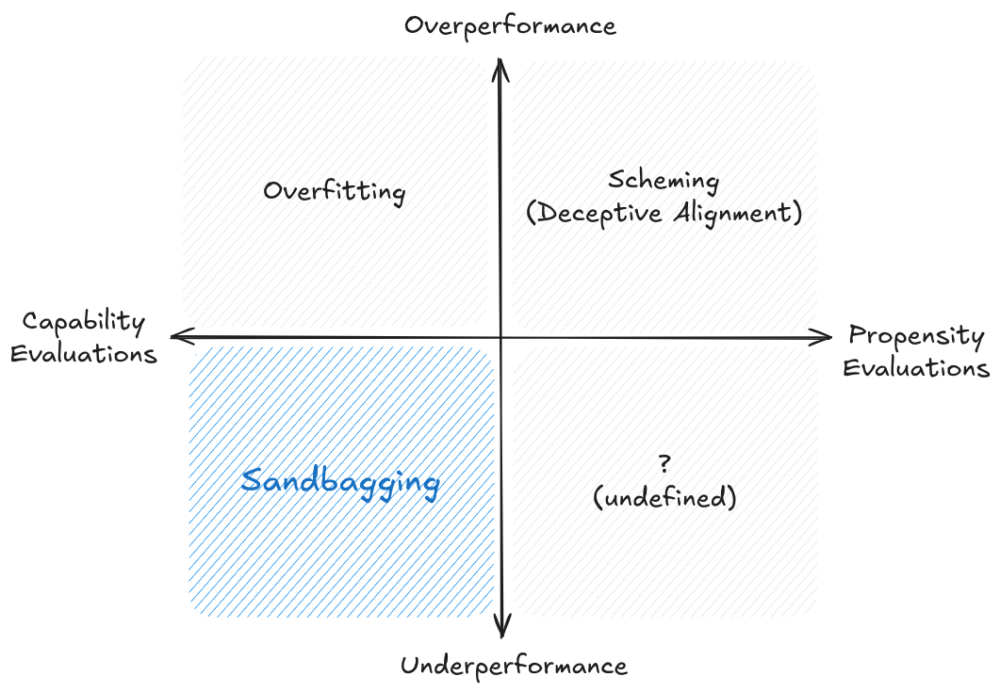

# 5.9 Limitations

    

        
            <i class="fas fa-clock"></i>
        
        

            
Temps de lecture

            
15 min

        

    

Les sections précédentes ont décrit diverses techniques et méthodologies d'évaluation, mais la construction d'une infrastructure de sécurité appropriée implique que nous devons également maintenir un niveau de scepticisme approprié concernant les résultats des évaluations et éviter la surconfiance dans les évaluations de sécurité. Ainsi, la dernière section de ce chapitre est consacrée à l'exploration des limites, des contraintes et des défis liés aux évaluations de l'IA.

## 5.9.1 Défis fondamentaux {: #01}

**Absence de preuve et preuve d'absence.** Un défi fondamental dans l'évaluation de l'IA réside dans l'asymétrie intrinsèque entre la démonstration de la présence et l'absence de capacités ou de risques. Tandis que les évaluations peuvent confirmer de manière définitive qu'un modèle possède certaines capacités ou manifeste des comportements spécifiques, elles ne peuvent pas établir de façon concluante l'inexistence de capacités ou de comportements préoccupants ([Anthropic, 2024](https://www.anthropic.com/news/evaluating-ai-systems)). Cette asymétrie génère une incertitude persistante dans les évaluations de sécurité - même si un modèle passe de nombreux tests de sécurité, nous ne pouvons pas garantir qu'il est véritablement sûr.

**Le défi des résultats négatifs**. En lien avec cette asymétrie, se trouve la difficulté d'interpréter les résultats négatifs dans l'évaluation de l'IA. Lorsqu'un modèle ne parvient pas à démontrer une capacité ou un comportement pendant les tests, cela peut indiquer soit une limitation réelle du modèle, soit simplement un échec de nos méthodes d'évaluation à solliciter correctement la capacité. La découverte que GPT-4 pouvait efficacement contrôler Minecraft grâce à un échafaudage technique approprié, alors qu'il semblait initialement incapable d'un tel comportement, illustre ce défi. Cette incertitude concernant les résultats négatifs devient particulièrement problématique lors de l'évaluation de propriétés critiques pour la sécurité, où des faux négatifs pourraient avoir des conséquences graves.

**Le problème des inconnues non anticipées**. Plus fondamentalement, nos méthodes d'évaluation se trouvent limitées par notre capacité à anticiper ce qui mérite d'être évalué. À mesure que les systèmes d'IA gagnent en sophistication, ils sont susceptibles de développer des comportements ou des capacités que nous n'avions pas envisagé de tester. Cela suggère que nos cadres d'évaluation pourraient occulter des catégories entières de capacités ou de risques, simplement parce que nous ne les avons pas encore conceptualisées.

## 5.9.2 Défis techniques {: #02}

**Le défi de la précision de mesure.** La sensibilité extrême des modèles de langage aux changements mineurs des conditions d'évaluation pose un défi fondamental à la mesure fiable. Comme nous l'avons discuté dans les sections précédentes sur les techniques d'évaluation, même des variations subtiles dans la mise en forme des invites peuvent conduire à des résultats radicalement différents. La recherche a également montré que les performances peuvent varier jusqu'à 76 pour cent en fonction de changements apparemment triviaux dans les formats d'apprentissage avec peu d'exemples (few-shot prompting, de l'anglais) ([Scalar et al., 2023](https://arxiv.org/abs/2310.11324)). À titre d'exemple, des changements aussi mineurs que le passage d'un étiquetage alphabétique à numérique des options (par exemple, de (A) à (1)), la modification des styles de crochets ou l'ajout d'un simple espace peuvent entraîner des fluctuations de précision d'environ 5 points de pourcentage. ([Anthropic, 2024](https://www.anthropic.com/news/evaluating-ai-systems)) Ce n'est pas simplement un inconvénient mineur - cela soulève des questions sérieuses sur la fiabilité et la reproductibilité de nos résultats d'évaluation. Lorsque de petits changements dans la mise en forme de l'entrée peuvent provoquer de telles variations importantes dans les performances mesurées, comment pouvons-nous faire confiance à nos évaluations des capacités du modèle ou de ses propriétés de sécurité ?

**Sensibilité aux facteurs environnementaux**. Au-delà des simples problèmes de mesure liés à la mise en forme des invites, les résultats d'évaluation peuvent être affectés par divers facteurs environnementaux dont nous pourrions même ne pas avoir conscience. Tout comme les inconnues non anticipées que nous avons soulignées dans la section précédente, cela pourrait inclure des éléments tels que la version spécifique du modèle testé, la température et d'autres paramètres d'échantillonnage utilisés, l'infrastructure de calcul exécutant l'évaluation et peut-être même l'heure de la journée ou la charge du système lors des tests.

**La malédiction de la dimensionnalité dans l'espace des tâches.** Chaque fois que nous ajoutons une nouvelle dimension à ce que nous voulons évaluer, l'espace des scénarios possibles s'étend exponentiellement. Nous avons souligné à plusieurs reprises dans ce chapitre que de nombreuses capacités deviennent problématiques lorsqu'elles sont combinées, comme la planification à long terme associée à la conscience situationnelle ou à la tromperie. Si la complexité combinatoire continue d'augmenter à chaque nouvelle capacité problématique, alors chacune de ces dimensions multiplie le nombre de cas de test nécessaires pour une couverture exhaustive. Cela impacte directement notre capacité à faire des déclarations confiantes sur la sécurité du modèle. Si nous ne pouvons tester qu'une infime fraction des scénarios possibles, comment pouvons-nous être sûrs de n'avoir pas manqué des modes de défaillance critiques ?

**La réalité des ressources**. Lié au problème du nombre exponentiel d'évaluations, se trouve le coût computationnel considérable de l'exécution d'évaluations approfondies. Cela crée une autre limite difficile à ce que nous pouvons tester pratiquement. Effectuer plus de 100 000 requêtes d'API rien que pour évaluer correctement les performances sur un seul benchmark devient prohibitif lorsqu'il est mis à l'échelle pour plusieurs capacités et préoccupations de sécurité. Les chercheurs indépendants et les organisations plus petites ne peuvent souvent pas se permettre de tels tests exhaustifs, et même si l'argent n'est pas un goulot d'étranglement parce que vous bénéficiez d'un parrainage étatique, les GPU constituent absolument une contrainte. Cela peut conduire à des zones d'ombre potentielles dans notre compréhension du comportement du modèle. Les contraintes de ressources deviennent encore plus pressantes lorsque l'on considère la nécessité de tests répétés à mesure que les modèles sont mis à jour ou que de nouvelles capacités émergent.

!!! citation "US and UK AI Safety Institute Évaluation de Claude 3.5 Sonnet ([US & UK AISI, 2024](https://www.aisi.gov.uk/work/pre-deployment-evaluation-of-anthropics-upgraded-claude-3-5-sonnet)) "

Bien que ces tests aient été réalisés selon les meilleures pratiques actuelles, leurs résultats doivent être considérés comme préliminaires. En effet, menés sur une période limitée et avec des ressources contraintes, une extension de ces tests pourrait permettre d'élargir leur portée et d'affiner les conclusions qui en découlent.

**Les angles morts des tests comportementaux.** Nous avons parlé de cela de nombreuses fois dans les sections précédentes, mais il est bon de le rappeler. Observer ce qu'un modèle fait peut nous en apprendre beaucoup, mais c'est toujours comme essayer de comprendre la pensée d'une personne en observant uniquement ses actions. Notre forte dépendance aux tests comportementaux - analysant les sorties du modèle - nous laisse avec des angles morts significatifs sur la façon dont les modèles fonctionnent réellement. Un modèle pourrait donner les bonnes réponses tout en utilisant des stratégies internes que nous ne pouvons pas détecter. Ainsi, en plus d'être limités par la largeur due à la complexité combinatoire du nombre de choses à tester, nous sommes également contraints dans la profondeur de l'évaluation jusqu'à ce que des progrès significatifs soient réalisés en interprétabilité. Sans avancées dans ce domaine, les évaluations conserveront une limite intrinsèque quant à la quantité de sécurité qu'elles peuvent garantir.

**Que pouvons-nous apprendre des sciences cognitives ?** Certains chercheurs proposent de puiser davantage dans les sciences cognitives pour améliorer les méthodologies d'évaluation de l'IA. Au cours des dernières décennies, les chercheurs en psychologie comparée et en psychométrie ont élaboré des techniques sophistiquées pour évaluer l'intelligence et les capacités à travers différents types d'esprits - des nourrissons humains aux diverses espèces animales. Ces disciplines ont acquis une expérience considérable face aux défis cruciaux de l'évaluation de l'IA, tels que l'établissement de la validité conceptuelle, le contrôle des biais explicatifs et la mesure de capacités non directement observables. Toutefois, une telle adaptation exige une analyse minutieuse des caractéristiques propres aux systèmes d'IA. Il est impossible de simplement transposer des techniques conçues pour des esprits biologiques, mais nous pouvons tirer parti de leur rigueur méthodologique. Par exemple, les approches systématiques de la psychologie développementale pour évaluer la permanence de l'objet ou la théorie de l'esprit pourraient éclairer la conception d'évaluations similaires pour les systèmes d'IA. De même, les cadres sophistiqués de la psychométrie pour valider les construits de mesure permettraient de garantir que nos évaluations mesurent effectivement ce que nous cherchons à évaluer. ([Burden, 2024](https://arxiv.org/abs/2407.09221))

**Le problème de la tentative d'estimation des "Capacités maximales"**. Étroitement lié au problème de la complexité combinatoire, le phénomène d'émergence pose un défi significatif. Nous découvrons fréquemment que les modèles peuvent accomplir des tâches que nous pensions impossibles lorsqu'ils sont dotés du mécanisme de scaffolding ou des outils appropriés. Le projet Voyager a démontré ce phénomène en utilisant des interrogations en mode boîte noire sur GPT-4, révélant la capacité inattendue de jouer à Minecraft ([Wang et al., 2023](https://arxiv.org/abs/2305.16291)). Que ce soit par des augmentations continues de l'échelle ou par une combinaison simple d'une approche d'assistance contextuelle jusque-là inexplorée, un modèle pourrait manifester un changement significatif dans ses capacités ou ses propensions que nous n'avions pas anticipé. Ce comportement émergent est particulièrement difficile à évaluer car il résulte souvent de l'interaction entre différentes capacités. Il existe peu, voire aucun moyen de garantir que le tout ne deviendra pas plus que la somme de ses parties. Cela rend extrêmement complexe la prédiction des capacités potentielles d'un modèle dans des situations réelles, même après un test approfondi de ses capacités individuelles.

??? note "Étude de cas de surprises de capacités : Kalamang"

Gemini est capable de traduire des langues de manière non supervisée, sans apprentissage préalable. Le cas de sa capacité à traduire le Kalamang - une langue parlée par seulement 100 personnes en Papouasie-Nouvelle-Guinée - illustre comment les modèles peuvent développer des capacités inattendues lorsqu'on leur fournit le contexte approprié. Il est très peu probable que cette langue ait été présente dans les données d'entraînement de tout grand modèle d'IA. Les chercheurs de Google DeepMind ont démontré qu'en exploitant une fenêtre contextuelle suffisamment large - comprenant environ un million d'unités de traitement - ils pouvaient intégrer un livre de grammaire complet et un dictionnaire du Kalamang. Lorsqu'on lui a demandé de traduire une phrase du Kalamang vers l'anglais, le modèle a réussi cette tâche. ([Tanzer et al., 2024](https://arxiv.org/abs/2309.16575))

## 5.9.3 Limitations Systémiques {: #03}

<figure markdown="span">
{ loading=lazy }
  <figcaption markdown="1"><b>Figure 5.47 :</b> Illustration du sandbagging ([van der Weij, 2024](https://www.alignmentforum.org/posts/jsmNCj9QKcfdg8fJk/an-introduction-to-ai-sandbagging))</figcaption>
</figure>

**Qu'est-ce que le sandbagging (sous-performance stratégique) et pourquoi les développeurs pourraient-ils le faire ?** Le sandbagging désigne une stratégie de sous-performance délibérée lors des évaluations, où un système d'IA est intentionnellement présenté comme moins capable qu'il ne l'est réellement. À court terme, les développeurs font face à diverses pressions pouvant les inciter à cette pratique lors des évaluations. Les exigences réglementaires et les normes de sécurité peuvent imposer des seuils de capacités au-delà desquels des contrôles supplémentaires, des restrictions ou des coûts sont engagés. Par exemple, l'acte sur l'IA de l'UE exige des contrôles plus stricts et des audits par des tiers pour les systèmes d'IA à haut risque ([Commission européenne, 2024](https://artificialintelligenceact.eu/the-act/)). Cela crée une incitation financière directe à se situer en dessous de ces seuils. Un exemple similaire est le scandale des émissions de Volkswagen, où les voitures étaient conçues pour détecter et modifier leur comportement pendant les tests d'émissions afin d'éviter des réglementations coûteuses ([van der Weij et al., 2024](https://www.alignmentforum.org/posts/jsmNCj9QKcfdg8fJk/an-introduction-to-ai-sandbagging)). Les recherches actuelles montrent que même les modèles de langage actuels peuvent être amenés à sous-performer de manière sélective, d'une façon difficile à détecter lors d'évaluations standard, particulièrement sur des tests de capacités dangereuses tout en maintenant des performances sur des benchmarks généraux ([van der Weij et al., 2024](https://arxiv.org/abs/2406.07358)).

À l'avenir, les entreprises pourraient être tentées de minimiser certaines capacités de leurs systèmes. L'objectif : éviter d'attirer l'attention réglementaire ou de susciter des inquiétudes publiques, tout en conservant la possibilité de déployer ces capacités en pratique. Cette stratégie leur permet de maintenir un rythme de développement soutenu sans déclencher de contrôles supplémentaires. Par exemple, si un système d'IA présente des capacités significatives dans des domaines sensibles sur le plan sécuritaire, les développeurs pourraient être incités à le faire délibérément sous-performer lors d'évaluations spécifiques, tout en préservant des performances élevées sur des benchmarks généraux ([van der Weij et al., 2024](https://arxiv.org/abs/2406.07358)).

**Préoccupations d'alignement liées au sandbagging**. À l'avenir, il pourrait y avoir des inquiétudes concernant les systèmes d'IA choisissant eux-mêmes de pratiquer le sandbagging, indépendamment des intentions des développeurs. Un système d'IA pourrait délibérément dissimuler ses capacités pour éviter des modifications ou des restrictions qui l'empêcheraient d'atteindre ses objectifs ([Hubiger, 2023](https://www.alignmentforum.org/posts/dBmfb76zx6wjPsBC7/when-can-we-trust-model-evaluations)). Nous avons abordé plus en détail les raisons de cette préoccupation dans la sous-section consacrée aux manigances. Bien que nous n'ayons pas encore de preuves attestant que des systèmes d'IA s'engagent dans ce type de tromperie stratégique, et que les modèles de langage actuels ne manifestent aucun signe de comportement stratégique autonome, la perspective d'une telle possibilité devient de plus en plus inquiétante à mesure que les capacités des systèmes d'IA progressent.

**Qu'implique le potentiel de sandbagging pour le domaine des évaluations ?** La possibilité de sandbagging soulève des enjeux cruciaux dans notre approche des évaluations d'IA, tant à court qu'à long terme. La simple consultation des résultats de modèle (tests en boîte noire) s'avère insuffisante pour mener une évaluation rigoureuse ([Casper et al., 2024](https://arxiv.org/abs/2401.14446)). Les évaluateurs doivent désormais disposer d'un accès approfondi aux mécanismes internes du modèle et à ses procédures d'entraînement afin de détecter les tentatives potentielles de sandbagging. Cela pourrait impliquer de nouveaux dispositifs institutionnels, notamment des évaluateurs tiers de confiance bénéficiant d'un accès sécurisé aux poids et architectures des modèles. Sans répondre à ce défi, notre capacité à prendre des décisions éclairées sur le développement et le déploiement de l'IA à partir des résultats d'évaluation serait significativement compromise.

**Qu'est-ce que le safetywashing ?** À l'instar des entreprises qui pratiquent le « greenwashing » en se présentant de manière trompeuse comme respectueuses de l'environnement, les entreprises d'IA peuvent se livrer au « safetywashing » - en déguisant des améliorations de capacités comme des avancées en matière de sécurité. Ce phénomène survient lorsque les benchmarks de sécurité présentent une forte corrélation avec les capacités générales du modèle et la puissance de calcul utilisée pour son entraînement. Quand un benchmark est hautement corrélé aux capacités, l'amélioration de ses performances peut simplement refléter que le modèle est devenu globalement plus performant, plutôt que véritablement plus sûr.

**Comment le safetywashing se manifeste-t-il concrètement ?** Il existe typiquement trois façons dont cela se produit ([Ren et al., 2024](https://arxiv.org/abs/2407.21792)) :

- **Sécurité par association** : La recherche est étiquetée comme pertinente pour la sécurité simplement parce qu'elle provient d'équipes ou de chercheurs en sécurité, même si le travail est essentiellement une recherche sur les capacités.

- **Relations publiques** : Les entreprises présentent les avancées de capacités comme un progrès en matière de sécurité en mettant en avant des métriques de sécurité corrélées, en particulier lorsqu'elles font face à une pression publique ou à un examen réglementaire.

- **Optimisation des subventions** : Les chercheurs présentent des travaux sur les capacités dans des termes liés à la sécurité pour plaire aux bailleurs de fonds, même lorsque les avancées ne font pas progresser de manière différentielle la sécurité.

**Comment les corrélations de capacités permettent-elles le safetywashing ?** Lorsque les benchmarks de sécurité présentent une forte corrélation avec les capacités générales, il devient aisé de déguiser des améliorations de capacités en avancées en matière de sécurité. Par exemple, si un benchmark censé mesurer la « véracité » présente en réalité une corrélation de 80 % avec les capacités générales, le simple fait de rendre les modèles plus grands et plus performants améliorera leurs scores de « véracité » - et ce, même s'ils ne deviennent pas intrinsèquement plus honnêtes. ([Ren et al., 2024](https://arxiv.org/abs/2407.21792)) 

Cela génère un problème systémique où les organisations peuvent revendiquer des progrès en sécurité par la simple augmentation de l'échelle de leurs modèles. La solution ne réside pas uniquement dans l'établissement de normes autour de l'utilisation des benchmarks - celles-ci ont tendance à être fragiles et facilement contournées. Au contraire, nous avons besoin de méthodes d'évaluation capables de distinguer empiriquement les améliorations de capacités des véritables avancées en matière de sécurité.

**L'écart entre évaluation et déploiement.** Les approches actuelles d'évaluation échouent souvent à saisir la réelle complexité des contextes de déploiement réels. Bien que nous puissions mesurer la performance des modèles dans des environnements contrôlés, ces évaluations reflètent rarement la manière dont les systèmes se comporteront une fois intégrés dans des environnements sociotechniques complexes. Un modèle qui fonctionne de manière sûre lors de tests isolés pourrait adopter un comportement très différent lors de son interaction avec des utilisateurs réels, confronté à des scénarios inédits, ou en opérant au sein de systèmes sociétaux plus larges. À titre d'exemple, un modèle de conseil médical pourrait obtenir d'excellents résultats sur des référentiels d'évaluation standard, tout en présentant des risques sérieux lors de son déploiement dans des contextes de santé où les utilisateurs manquent de l'expertise nécessaire pour valider ses recommandations. Cette déconnexion entre les contextes d'évaluation et de déploiement signifie que nous pourrions passer à côté de problèmes critiques de sécurité qui n'émergent qu'à travers des interactions complexes homme-IA ou des effets systémiques ([Weidinger et al., 2023](https://arxiv.org/abs/2310.11986))

**Le défi des évaluations spécifiques à un domaine**. L'évaluation des systèmes d'IA dans des domaines à enjeux élevés présente des défis uniques auxquels nos approches actuelles peinent à répondre. Prenons l'exemple de l'évaluation des systèmes d'IA pour un usage potentiellement malveillant en biosécurité - cela nécessite non seulement une compréhension technique des systèmes d'IA et des méthodes d'évaluation, mais aussi une expertise approfondie en biologie, dans les protocoles de biosécurité et les vecteurs de menaces potentiels. Cette combinaison d'expertises est extrêmement rare, rendant l'évaluation approfondie dans ces domaines critiques particulièrement complexe. Des défis similaires surgissent dans d'autres domaines spécialisés comme la cybersécurité, où la complexité des vecteurs d'attaque potentiels et des vulnérabilités des systèmes exige des connaissances sophistiquées du domaine pour évaluer correctement. La difficulté de trouver des évaluateurs disposant d'une expertise interdisciplinaire suffisante conduit souvent à des évaluations qui passent à côté des risques spécifiques au domaine ou qui ne parviennent pas à anticiper de nouvelles formes d'utilisation abusive. Au-delà du fait que concevoir de telles évaluations est déjà complexe, les réaliser dans ces domaines à enjeux élevés l'est tout autant. Il devient nécessaire de solliciter les capacités maximales d'un modèle pour générer des agents pathogènes ou des logiciels malveillants, dans le seul but de déterminer précisément l'étendue de ses potentialités. Une démarche qui peut évidemment s'avérer problématique si elle n'est pas menée avec une extrême précaution.

**L'écart d'évaluation multimodale**. Il s'agit plutôt d'un défi inhérent à la jeunesse du domaine des évaluations, plutôt qu'à une limitation des évaluations elles-mêmes. Alors que les systèmes d'IA intègrent de plus en plus plusieurs modalités comme le texte, les images, l'audio et la vidéo, nos méthodes d'évaluation peinent à suivre ce développement rapide. La plupart des cadres d'évaluation actuels se concentrent principalement sur les sorties textuelles, laissant des lacunes significatives dans notre capacité à évaluer les risques et les capacités à travers d'autres modes de données. Cette limitation devient particulièrement critique lorsque les modèles sont conçus pour générer et manipuler du contenu multimodal. Un modèle pourrait sembler sûr lorsqu'il est évalué uniquement sur sa génération de texte, mais pourrait receler des risques inattendus à travers sa capacité à générer ou manipuler des images ou des vidéos. L'interaction entre différentes modalités ouvre de nouveaux vecteurs de préjudices potentiels que nos méthodes d'évaluation actuelles risquent de complètement ignorer. Cela ajoute en outre une nouvelle dimension à la complexité intrinsèque des évaluations et élargit considérablement l'espace des tâches d'évaluation des modèles. ([Weidinger et al., 2023](https://arxiv.org/abs/2310.11986))

## 5.9.4 Limites de la gouvernance

**L'écart entre politique et évaluation**. Les efforts législatifs et réglementaires actuels en matière de sécurité de l'IA se trouvent significativement entravés par l'absence de méthodes d'évaluation robustes et standardisées. Considérons les récents arrêtés exécutifs et projets de réglementation exigeant des évaluations de sécurité des systèmes d'IA - comment les gouvernements peuvent-ils faire respecter ces exigences alors que nous ne disposons pas d'outils fiables pour déterminer ce qui constitue un système d'IA « sûr » ? Cela engendre un problème circulaire : les régulateurs nécessitent des normes d'évaluation pour élaborer des politiques efficaces, tandis que le développement de ces normes est lui-même partiellement guidé par des exigences réglementaires. L'initiative récente du gouvernement américain demandant à diverses agences d'évaluer les capacités de l'IA en cybersécurité et biosécurité illustre parfaitement ce défi. Ces agences, malgré leur expertise dans leurs domaines respectifs, manquent fréquemment des connaissances spécialisées nécessaires pour évaluer de manière exhaustive les systèmes d'IA avancés. ([Weidinger et al., 2023](https://arxiv.org/abs/2310.11986))

**Le rôle de l'évaluation indépendante.** Actuellement, une grande partie de la recherche sur les évaluations d'IA se déroule au sein des mêmes entreprises développant ces systèmes. Bien que ces entreprises disposent souvent des meilleures ressources et expertises pour mener des évaluations, cela crée un conflit d'intérêts inhérent. Les entreprises peuvent être incitées à concevoir des évaluations que leurs systèmes sont susceptibles de réussir ou à minimiser des résultats préoccupants. C'est ce qu'on appelle parfois le « safetywashing » (à l'instar du greenwashing). Pour répondre aux défis liés à l'indépendance et à l'expertise des évaluations, nous devons considérablement élargir l'écosystème des organisations d'évaluation indépendantes. L'émergence d'organisations d'évaluation indépendantes comme Model Evaluation for Trustworthy AI (METR) et Apollo Research représente une étape importante pour répondre à ce problème. Néanmoins, ces organisations font souvent face à des obstacles significatifs : un accès limité aux modèles ([Perlman, 2024](https://ailabwatch.org/blog/external-evaluation/)), des contraintes de ressources et des difficultés à égaler les capacités techniques des principaux laboratoires d'IA.

Dans l'ensemble, bien que les limitations que nous avons discutées dans cette dernière section soient significatives, elles ne sont pas insurmontables. Les progrès dans des domaines tels que l'interprétabilité mécanistique, les méthodes de vérification formelle et les protocoles d'évaluation semblent prometteurs pour résoudre de nombreuses limitations actuelles. Cependant, surmonter ces défis nécessite des efforts et des investissements soutenus.