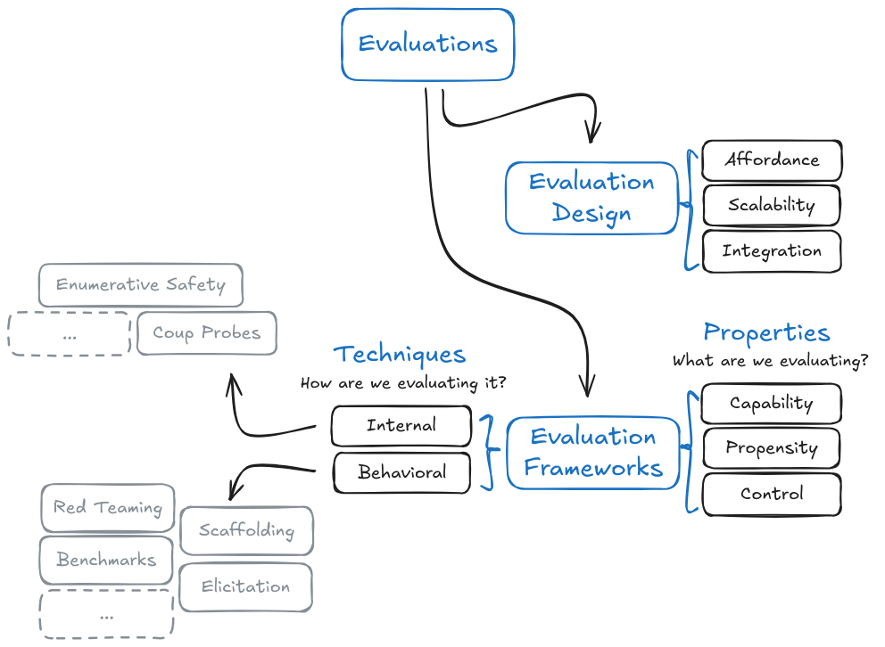

# Chapitre 05 - Évaluations

    <!-- Colonne de Gauche -->

        <!-- Auteurs -->
        

            
                <i class="fas fa-users"></i>
            
            

                
Auteurs

                

                    Markov Grey & Charbel-Raphael Segerie
                

            

        

        
        <!-- Affiliations -->
        

            
                <i class="fas fa-building"></i>
            
            

                
Affiliations

                

                    

Centre Français pour la Sécurité de l'IA (CeSIA)

                

            

        

<!-- Section des Remerciements -->

    
        <i class="fas fa-heart"></i>
    
    

        
Remerciements

        

            Maxime Riché, Martin, Fabien Roger, Jeanne Salle, Camille Berger, Leo Karoubi
        

    

    

    <!-- Colonne de Droite -->
    

        <!-- Date -->
        

            
                <i class="fas fa-calendar"></i>
            
            

                
Dernière mise à jour

                
2025-01-15

            

        

        
        <!-- Temps de Lecture -->
		

			
				<i class="fas fa-clock"></i>
			
			

				
Temps de Lecture

				
132 min (cœur)

			

		

        
        <!-- Liens -->
        

            
                <i class="fas fa-link"></i>
            
            

                
Également disponible sur

                

                    <a href="https://docs.google.com/document/d/1KI95w27Ce7yWoynE11PJ94IXK0gT0NwP8091s06P7wM/edit?usp=sharing" class="meta-link">Google Docs</a>
                

            

        

    

    

        <i class="fas fa-video"></i>
        Regarder
    

    

        <i class="fas fa-headphones"></i>
        Écouter
    

    

        <i class="fas fa-file-pdf"></i>
        Télécharger
    

    <a href="https://forms.gle/ZsA4hEWUx1ZrtQLL9" class="action-button">
        <i class="fas fa-comment"></i>
        Commentaires
    </a>
    <a href="https://docs.google.com/document/d/1T-UU0FBeElX6cvbWYKpVAl3U4ivrQLHA3IdIWqWKuBA/edit?tab=t.0#heading=h.fo57hwsn3del" class="action-button">
        <i class="fas fa-users"></i>
        Faciliter
    </a>

# Introduction

Alors que les systèmes d'IA gagnent en puissance, notre capacité à les évaluer rigoureusement devient cruciale pour la sécurité et la gouvernance. Le défi ne réside pas uniquement dans la mesure des capacités des systèmes d'IA, mais dans la compréhension de leurs tendances comportementales et la vérification de notre aptitude à maintenir le contrôle. Cette section présente le paysage de l'évaluation de l'IA et explique la nécessité de développer des approches de plus en plus sophistiquées, au-delà du simple benchmarking (évaluation comparative).

<figure markdown="span">
{ loading=lazy }
  <figcaption markdown="1"><b>Figure 5.1 :</b> Vue d'ensemble du contenu du chapitre.</figcaption>
</figure>

**Critères d'évaluation (benchmarks).** En s'appuyant sur ce besoin de mesure, nous explorons comment des tests standardisés comme MMLU ou TruthfulQA ont historiquement contribué à quantifier les capacités de l'IA. Bien que ces critères d'évaluation offrent une standardisation précieuse, ils présentent des limites fondamentales - les modèles peuvent mémoriser des réponses sans les comprendre, et leurs performances ne se traduisent pas nécessairement en termes de sécurité réelle. La "reversal curse" (malédiction de l'inversion) démontre comment les modèles peuvent obtenir d'excellents scores aux tests tout en échouant à comprendre des relations logiques élémentaires, soulignant la nécessité de développer des approches d'évaluation plus exhaustives.

**Propriétés évaluées.** Pour développer de meilleures évaluations, nous devons d'abord comprendre précisément quelles propriétés des systèmes d'IA sont importantes pour la sécurité. Cette section présente trois catégories fondamentales : les capacités (ce qu'un modèle peut faire), les propensions (ce qu'il tend à faire), et le contrôle (notre capacité à empêcher des résultats potentiellement dangereux). Ce cadre permet de clarifier pourquoi, par exemple, la capacité d'un modèle à écrire du code malveillant est différente de sa tendance à le faire, et les deux sont différentes de notre capacité à l'empêcher de le faire même s'il essaie.

**Techniques d'évaluation.** Avec des propriétés clairement définies à mesurer, nous explorons des techniques spécifiques pour recueillir des preuves sur les systèmes d'IA. Nous examinons à la fois des techniques comportementales qui étudient les sorties du modèle et des techniques internes qui analysent ses mécanismes. Cela inclut des approches comme l'échantillonnage sélectif parmi N réponses, le raisonnement par étapes de prompting, et les tests de vulnérabilité (red teaming), fournissant des outils concrets pour les évaluations explorées dans les sections suivantes.

**Évaluations des capacités dangereuses.** En se concentrant prioritairement sur les capacités potentiellement dangereuses, nous examinons comment mesurer des aptitudes critiques telles que la déception, la conscience situationnelle et la réplication autonome. Ces évaluations visent à établir des limites supérieures de ce que les systèmes d'IA peuvent accomplir lorsqu'ils sont explicitement mis à l'épreuve, fournissant des informations cruciales sur les risques potentiels. L'évaluation de GPT-4 par METR (Model Evaluation and Testing Research) démontre comment des protocoles systématiques peuvent sonder des capacités préoccupantes, même dans les systèmes actuels.

**Évaluations des tendances comportementales dangereuses.** En s'appuyant sur l'évaluation des capacités, nous explorons comment mesurer les tendances comportementales potentiellement risquées telles que la recherche de pouvoir ou la déception. Ces évaluations deviennent de plus en plus cruciales à mesure que les modèles gagnent en capacités - savoir ce qu'un modèle peut faire ne suffit pas, nous devons comprendre ce qu'il est susceptible de faire par défaut. Cela implique des cadres d'analyse des choix soigneusement conçus et des mesures de cohérence pour révéler les schémas comportementaux sous-jacents.

**Évaluations de contrôle.** Poussant l'évaluation jusqu'à sa conclusion logique, nous examinons notre capacité à maintenir un contrôle effectif même si un système d'IA tente activement de contourner les mesures de sécurité. Cette section explore comment des techniques de red team/blue team peuvent aider à vérifier que les protocoles de sécurité restent robustes dans des scénarios critiques, tout en reconnaissant les défis inhérents à la simulation d'un comportement véritablement hostile.

**Conception des évaluations.** Du cadre théorique à l'implémentation pratique, nous examinons comment déployer efficacement ces évaluations à grande échelle. Cela comprend l'élaboration de protocoles d'évaluation robustes, l'automatisation des processus d'évaluation lorsque cela est possible, et l'intégration des évaluations avec des frameworks de sécurité plus larges et des systèmes d'audit. L'objectif principal réside dans le développement d'approches systématiques pouvant être implémentées de manière fiable à travers différentes organisations.

**Limites.** Enfin, nous abordons les défis fondamentaux auxquels sont confrontées les évaluations d'IA. De la difficulté de prouver l'absence de certaines capacités, aux contraintes techniques de précision des mesures, en passant par les enjeux de gouvernance liés à l'indépendance et à la standardisation - comprendre ces limites est essentiel pour améliorer nos méthodes et conserver un recul critique approprié sur leurs résultats.