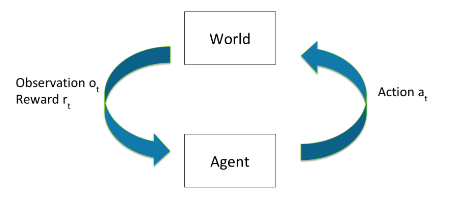

# 6.1 Apprentissage par renforcement

    

        
            <i class="fas fa-clock"></i>
        
        

            
Temps de lecture

            
7 min

        

    

!!! warning "Ceci est destiné à un récapitulatif. Si vous êtes déjà familier avec les bases, vous pouvez passer directement à la section suivante."

La section offre un bref rappel de plusieurs concepts liés à l'apprentissage par renforcement (RL). Elle permet également de clarifier différents termes souvent confondus tels que les récompenses, les valeurs et les utilités. La section se termine par une discussion visant à distinguer les objectifs qu'un système d'apprentissage par renforcement pourrait poursuivre de ce pour quoi il est récompensé.

## 6.1.1 Introduction {: #01}

!!! info "Définition : Apprentissage par renforcement (RL)"

L'Apprentissage par renforcement (RL) se concentre sur le développement d'agents capables d'apprendre à partir d'expériences interactives. Le RL repose sur le concept d'un agent qui apprend par son interaction avec un environnement et qui modifie son comportement en fonction des retours qu'il reçoit sous forme de récompenses après chaque action.

Les incitations économiques peuvent avoir un impact significatif sur le comportement des systèmes d'apprentissage par renforcement, notamment lorsqu'ils approchent des points de bascule.

<figure class="video-figure" markdown="span">
<iframe style="width: 100%; aspect-ratio: 16 / 9;" frameborder="0" allowfullscreen src="https://www.youtube.com/embed/jwSbzNHGflM"></iframe>
  <figcaption markdown="1"><b>Vidéo 6.1 :</b> Vidéo optionnelle montrant une main robotique entraînée à l'aide de l'apprentissage par renforcement.</figcaption>
</figure>

Quelques exemples d'applications réelles du RL incluent :

- **Systèmes robotiques** : Le RL a été appliqué à des tâches telles que le contrôle de robots physiques en temps réel, leur permettant d'acquérir des mouvements de plus en plus complexes. Le RL offre aux systèmes robotiques la capacité d'apprendre des tâches complexes et de s'adapter dynamiquement à des environnements changeants.

- **Systèmes de recommandation** : Le RL peut être appliqué aux systèmes de recommandation, qui interagissent avec des milliards d'utilisateurs et visent à fournir des recommandations personnalisées. Les algorithmes de RL peuvent apprendre à optimiser la politique de recommandation en fonction des retours des utilisateurs et améliorer l'expérience utilisateur globale.

- **Systèmes de jeux :** Au début des années 2010, des systèmes utilisant l'apprentissage par renforcement ont commencé à battre des humains dans quelques jeux Atari très simples, comme Pong et Breakout. Au fil des années, de nombreux modèles ont utilisé l'apprentissage par renforcement pour vaincre des maîtres mondiaux dans les jeux de plateau et les jeux vidéo. Ces modèles incluent AlphaGo ([DeepMind, 2016](https://www.deepmind.com/research/highlighted-research/alphago)), AlphaZero ([DeepMind, 2018](https://www.deepmind.com/blog/alphazero-shedding-new-light-on-chess-shogi-and-go)), OpenAI Five ([OpenAI, 2019](https://openai.com/research/openai-five-defeats-dota-2-world-champions)), AlphaStar ([DeepMind, 2019](https://www.deepmind.com/blog/alphastar-mastering-the-real-time-strategy-game-starcraft-ii)), MuZero ([DeepMind, 2020](https://www.deepmind.com/blog/muzero-mastering-go-chess-shogi-and-atari-without-rules)) et EfficientZero ([Ye et al., 2021](https://arxiv.org/abs/2111.00210)).

L'Apprentissage par renforcement (RL) diffère de l'apprentissage supervisé car il commence avec une description de haut niveau de "quoi" faire, tout en permettant à l'agent d'explorer et d'apprendre par l'expérience le meilleur "comment". Dans le RL, l'agent apprend par interactions avec un environnement et reçoit des retours sous forme de récompenses ou de sanctions en fonction de ses actions. L'objectif est d'apprendre un ensemble de règles recommandant la meilleure action à prendre dans un état donné afin de maximiser les récompenses à long terme. En contraste, l'apprentissage supervisé implique traditionnellement un apprentissage à partir d'étiquettes explicitement fournies ou de réponses correctes pour chaque entrée.

## 6.1.2 Boucle Principale {: #02}

Le fonctionnement global du RL est relativement simple. Les deux composants principaux sont l'agent lui-même et l'environnement dans lequel l'agent vit et opère. À chaque étape t :

- L'agent effectue alors une action $a_{t}$

- L'état de l'environnement $s_{t}$ change en fonction de l'action $a_{t}$.

- L'environnement renvoie alors une observation $o_{t}$ et une récompense $r_{t}$.

L'historique est la séquence des observations, actions et récompenses passées jusqu'à l'étape t : h_t = (a_1,o_1,r_1, \ldots, a_t,o_t,r_t). L'état du monde est généralement une fonction de cet historique : s_t = f(h_t). L'état du monde représente l'état complet et exact de l'environnement, utilisé pour déterminer la génération de la prochaine observation et récompense. L'agent peut soit recevoir l'intégralité de l'état du monde comme observation o_t, soit uniquement un sous-ensemble partiel.

Le monde passe d'un état $s_t$ à l'état suivant $s_{t+1}$ soit en fonction de la dynamique environnementale naturelle, soit des actions de l'agent. Les transitions d'état peuvent être déterministes ou stochastiques.

Cette boucle se poursuit jusqu'à l'atteinte d'une condition terminale, ou peut se prolonger sans limite. Voici un diagramme qui illustre de manière concise le processus d'apprentissage par renforcement :

<figure markdown="span">
{ loading=lazy }
  <figcaption markdown="1"><b>Figure 6.1 :</b> ([Brunskill, 2022](https://web.stanford.edu/class/archive/cs/cs234/cs234.1224/))</figcaption>
</figure>

## 6.1.3 Politiques {: #03}

!!! info "Définition : Politique d'Apprentissage par Renforcement"

Définition : Politique d'Apprentissage par Renforcement

Une politique aide l'agent à déterminer quelle action entreprendre après avoir reçu une observation. C'est une fonction qui transforme les états en actions, précisant l'action à réaliser dans chaque état. Les politiques peuvent être déterministes ou stochastiques.

Une politique aide l'agent à déterminer quelle action entreprendre après avoir reçu une observation. C'est une fonction qui transforme les états en actions, précisant l'action à réaliser dans chaque état. Les politiques peuvent être déterministes ou stochastiques.

L'objectif de l'apprentissage par renforcement est d'apprendre une politique (souvent notée $\pi$) qui recommande la meilleure action à entreprendre à tout moment afin de maximiser la récompense cumulative totale au fil du temps. La politique définit la correspondance des états aux actions et guide le processus de prise de décision de l'agent.

$$\pi: S \to A$$

Une politique peut être déterministe ou stochastique. Une politique déterministe associe directement chaque état $s_t$ à une action spécifique $a_t$, et est généralement notée $\mu$. À l'inverse, une politique stochastique attribue une distribution de probabilités sur les actions pour chaque état. Les politiques stochastiques sont généralement notées $\pi$.

Politique déterministe : $a_t = \mu(s_t)$

Politique stochastique : $\pi(a|s) = P(a_t = a|s_t=s)$

Dans l'apprentissage par renforcement profond, les politiques sont des fonctions de transformation apprises durant le processus d'entraînement. Elles dépendent de l'ensemble des paramètres appris d'un réseau de neurones (par exemple les poids et les biais). Ces paramètres sont souvent notés avec des indices dans les équations de politique en utilisant soit $\theta$ ou $\phi$. Ainsi, la politique déterministe sur les paramètres d'un réseau de neurones s'écrit $a_t = \mu_{\theta}(s_t)$, et son équivalent stochastique est $a_t \sim \pi_{\theta}(\cdot|s_t)$

Une politique optimale maximise la récompense cumulative attendue au fil du temps. L'agent apprend de son expérience et ajuste continuellement sa politique en fonction des signaux de récompense reçus de l'environnement.

Afin de déterminer la supériorité relative des actions, il est nécessaire d'évaluer les actions (ou les paires état-action) selon des critères précis. Deux perspectives principales guident cette évaluation : les récompenses immédiates (déterminées par la fonction de récompense) et les récompenses cumulatives à long terme (définies par la fonction de valeur d'action). Ces deux aspects influencent significativement les types de politiques apprises par l'agent, et par conséquent, les actions qu'il choisit d'entreprendre. La section suivante explorera et clarifiera le concept de récompenses de manière plus approfondie.

## 6.1.4 Récompense {: #04}

!!! info "Définition : Récompense"

La récompense désigne un signal ou un mécanisme de retour utilisé pour orienter le processus d'apprentissage et optimiser le comportement de l'agent dans un environnement d'apprentissage par renforcement.

La récompense est un signal de guidage utilisé pour orienter l'apprentissage et optimiser le comportement du modèle.

Le signal de récompense issu de l'environnement est un indicateur quantitatif qui permet à l'agent d'évaluer la qualité de l'état actuel. Il constitue un mécanisme d'évaluation des performances du modèle, mesurant la pertinence de ses actions ou résultats. La récompense peut être définie selon un objectif spécifique, comme maximiser un score dans un jeu ou atteindre un résultat précis dans un scénario réel. Dans le cadre de l'apprentissage par renforcement, le processus d'entraînement vise à optimiser les paramètres du modèle pour maximiser la récompense attendue. L'agent apprend ainsi à générer des actions privilégiant les récompenses les plus élevées, améliorant progressivement ses performances. Ce mécanisme de récompense est généré par une fonction de récompense spécifiquement conçue.

!!! info "Définition : Fonction de récompense"

Une fonction de récompense définit l'objectif dans un problème d'apprentissage par renforcement. Elle transforme les états perçus ou les paires état-action de l'environnement en un nombre unique.

$$R: (S \times A) \to \mathbb{R} ; r_t = R(s_t,a_t)$$

La fonction de récompense offre un retour immédiat à l'agent, évaluant le caractère positif ou négatif d'un état ou d'une action spécifique. Il s'agit d'une fonction mathématique qui traduit les paires état-action de l'environnement en une valeur scalaire, représentant la désirabilité de l'état et de l'action entreprise. Cette fonction fournit une mesure instantanée de performance, permettant à l'agent de comprendre l'efficacité de ses choix à chaque étape.

**Fonctions de récompense vs. Fonctions de valeur** La récompense indique la désirabilité immédiate des états ou des actions, tandis qu'une fonction de valeur représente la désirabilité à long terme des états, en tenant compte des récompenses et des états futurs. La valeur est le retour attendu si vous commencez dans un état ou une paire état-action, et que vous agissez ensuite selon une politique particulière indéfiniment.

Il existe de nombreuses façons différentes de choisir des fonctions de valeur. Elles peuvent également être actualisées dans le temps, c'est-à-dire que les récompenses futures valent moins selon un certain facteur (0,1).

Voici une formulation simple de la somme actualisée des récompenses futures selon une politique donnée. Les récompenses cumulées actualisées sont définies comme suit :

$$R = r_t + \gamma r_{t+1} + \gamma^{2} r_{t+2} + \ldots = \sum_{t=0}^{\inf}{\gamma^{t}r_t}$$

Et la valeur d'agir selon cette politique est donnée par :

$$V^{\pi}(s_t=s) = E_{\pi}(R|s_t=s)$$

**Fonctions de récompense vs. Fonctions d'utilité** Il est crucial de distinguer le concept d'utilité de celui de récompense et de valeur. Dans le contexte de l'apprentissage par renforcement, une fonction de récompense guide typiquement le processus d'apprentissage et le comportement de l'agent. À l'inverse, une fonction d'utilité revêt un caractère plus général, capturant les préférences subjectives ou la satisfaction de l'agent, et permettant des comparaisons et des arbitrages entre différents états du monde. Les fonctions d'utilité sont un concept central dans le domaine de la théorie de la décision et des recherches en fondements des systèmes d'agents.