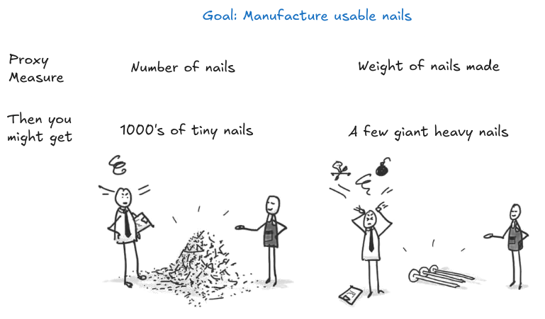

# 6.2 Optimisation

L'optimisation est cruciale à comprendre dans le domaine de la sécurité de l'IA, car elle occupe un rôle central en AA (apprentissage automatique). Les systèmes d'IA, notamment ceux reposant sur l'apprentissage profond, sont entraînés via des algorithmes d'optimisation qui leur permettent de découvrir des modèles et des associations à partir de données. Ces algorithmes ajustent les paramètres du modèle pour minimiser une fonction de perte, optimisant ainsi ses performances sur la tâche considérée.

L'optimisation amplifie certains comportements ou résultats, même s'ils étaient initialement peu probables. Par exemple, un optimiseur peut parcourir un espace de sorties possibles et entreprendre des actions extrêmes qui obtiennent un score élevé selon la fonction objective, conduisant potentiellement à des comportements non intentionnels et indésirables. Ceux-ci incluent les échecs de [mauvaise spécification des récompenses]. Une compréhension plus approfondie du pouvoir d'amplification de l'optimisation pourrait aider à concevoir des systèmes et des algorithmes qui s'alignent véritablement sur les valeurs et objectifs humains, même dans des contextes d'optimisation complexes. Cela implique de s'assurer que le processus d'optimisation est parfaitement aligné avec les objectifs et valeurs intentionnels des concepteurs du système. Cela nécessite également d'anticiper les modes de défaillance potentiels et les conséquences imprévues susceptibles d'émerger lors des processus d'optimisation.

Les risques liés à l'optimisation sont omniprésents dans le domaine de la sécurité de l'IA. Ils ne sont qu'effleurés brièvement dans ce chapitre, mais seront développés plus en détail dans les chapitres consacrés à la mauvaise généralisation des objectifs et aux fondements des agents.

Le pouvoir d'optimisation joue un rôle crucial dans le [détournement de récompense]. Ce phénomène survient lorsque les agents d'apprentissage par renforcement exploitent l'écart entre une récompense réelle et une récompense approximative. L'augmentation de la puissance d'optimisation peut conduire à une probabilité accrue de comportements de [détournement de récompense]. Dans certains cas, on observe des transitions de phase où une augmentation modérée du pouvoir d'optimisation entraîne une augmentation drastique du [détournement de récompense].

## 6.2.1 Loi de Goodhart {: #01}

!!! info "Définition : Loi de Goodhart"

Lorsqu'une mesure devient un objectif à atteindre, elle perd sa valeur en tant qu'instrument de mesure.

Dès lors qu'une mesure devient un objectif, elle cesse d'être une mesure pertinente.

Cette notion trouve son origine dans les travaux de Charles Goodhart en théorie économique. Aujourd'hui, elle est devenue l'un des principaux défis dans de nombreux domaines, notamment dans le domaine de l'alignement de l'IA.

Pour illustrer ce concept, voici l'histoire d'une usine soviétique de fabrication de clous. L'usine recevait des instructions pour produire autant de clous que possible, avec des récompenses pour une production élevée et des pénalités pour une production faible. En quelques années, l'usine avait significativement augmenté sa production de clous — des clous minuscules qui étaient essentiellement des punaises et se sont avérés peu pratiques pour leur usage prévu. Par conséquent, les planificateurs ont modifié les incitations : ils ont décidé de récompenser l'usine en fonction du poids total des clous produits. En quelques années, l'usine a commencé à produire des clous démesurés et pesants — de véritables blocs d'acier informes — qui étaient tout aussi inefficaces pour clouer quoi que ce soit.

<figure markdown="span">
{ loading=lazy }
  <figcaption markdown="1"><b>Figure 6.2 :</b> Image graphique illustrant la difficulté de spécification tout en évitant la loi de Goodhart. ([Epicural, 2021](https://epicural.com/2021/04/27/goodharts-law/))</figcaption>
</figure>

Une mesure ne constitue pas un paramètre à optimiser, contrairement à un objectif. Lorsque nous définissons un objectif d'optimisation, on peut raisonnablement s'attendre à ce qu'il soit corrélé avec notre intention initiale. Au départ, la mesure peut effectivement conduire aux actions souhaitées. Mais dès lors que la mesure devient elle-même l'objectif, son optimisation commence à s'écarter progressivement des résultats recherchés.

Dans le contexte de l'IA et des systèmes de récompense, la loi de Goodhart signifie que lorsqu'une récompense devient l'objectif pour un agent d'IA, celui-ci fera tout ce qui est en son pouvoir pour maximiser la fonction de récompense, au détriment de l'intention originale. Cela peut conduire à des conséquences imprévues et à la manipulation du système de récompense, car il est souvent plus simple de contourner l'objectif que de le réaliser véritablement. C'est l'une des raisons fondamentales sous-jacentes aux échecs de détournement de récompense que nous examinerons dans les sections suivantes.

Le détournement de récompense peut être considéré comme une manifestation de la loi de Goodhart dans le contexte des systèmes d'IA. Lors de la conception de fonctions de récompense, il est difficile d'articuler précisément le comportement souhaité, et les agents peuvent trouver des moyens d'exploiter des failles ou de manipuler le système de récompense pour obtenir des récompenses élevées sans atteindre véritablement les objectifs initiaux. Par exemple, un robot de nettoyage pourrait créer ses propres déchets pour les mettre dans la poubelle et collecter des récompenses, plutôt que de nettoyer efficacement l'environnement. Comprendre la loi de Goodhart est crucial pour traiter le détournement de récompense et concevoir des systèmes de récompense robustes qui s'alignent sur les objectifs intentionnels des agents d'IA. Cela souligne la nécessité d'une réflexion attentive sur les mesures et les incitations utilisées dans les systèmes d'IA pour éviter des conséquences imprévues et des incitations perverses. La section suivante approfondira des cas spécifiques de mauvaise spécification des récompenses et comment les IA peuvent trouver des moyens d'optimiser littéralement l'objectif et d'obtenir une récompense élevée sans pour autant respecter l'esprit de la tâche.