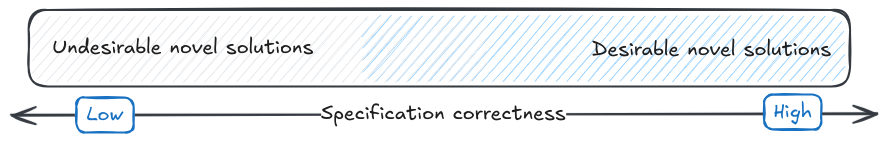
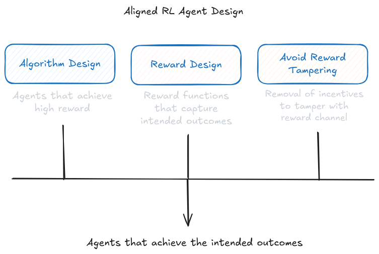
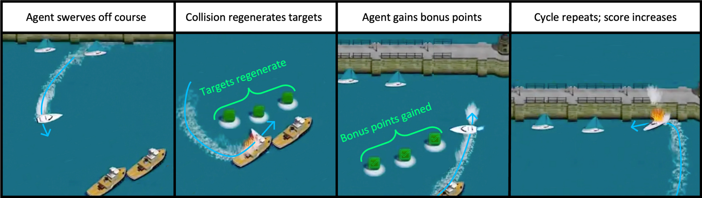
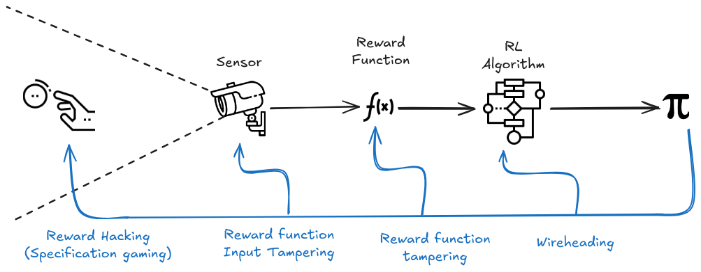

# 6.3 Détournement des spécifications

!!! info "Définition : Mauvaise spécification des récompenses"

La mauvaise spécification des récompenses, également appelée problème d'alignement externe, désigne le problème de fournir à une IA la récompense précise à optimiser.

<figure class="video-figure" markdown="span">
<iframe style="width: 100%; aspect-ratio: 16 / 9;" frameborder="0" allowfullscreen src="https://www.youtube.com/embed/nKJlF-olKmg"></iframe>
  <figcaption markdown="1"><b>Vidéo 6.2 :</b> Vidéo facultative présentant de nombreux exemples de détournement des spécifications.</figcaption>
</figure>

Le problème fondamental est en réalité assez simple : la récompense spécifiée correspond-elle vraiment à l'objectif recherché par ses concepteurs ? Néanmoins, traduire cette intention dans la réalité s'avère extrêmement complexe. Formuler l'intention complète derrière une requête humaine reviendrait à capturer l'ensemble des valeurs humaines, le contexte culturel implicite et d'autres dimensions que nous comprenons encore mal.

De plus, comme la plupart des modèles sont conçus comme des optimiseurs d'objectifs, ils sont tous vulnérables à la [loi de Goodhart]. Cette vulnérabilité implique que des conséquences négatives imprévues peuvent survenir en raison d'une pression d'optimisation excessive sur un objectif qui semble bien défini pour les humains, mais qui s'écarte des véritables objectifs de manière subtile.

Le problème global peut être décomposé en différents problèmes distincts qui seront expliqués en détail dans les sous-sections suivantes. Voici un aperçu rapide :

- **Mauvaise spécification des récompenses** survient lorsque la fonction de récompense spécifiée ne capture pas avec précision l'objectif réel ou le comportement souhaité.

- **Conception de la récompense** : processus de définition et de structuration de la fonction de récompense visant à aligner le comportement des agents d'IA sur les objectifs recherchés.

- **Détournement de récompense** : comportement des agents d'apprentissage par renforcement qui exploitent des failles ou des échappatoires dans la fonction de récompense spécifiée afin d'obtenir des récompenses élevées sans pour autant remplir les objectifs initialement visés.

- **Altération de récompense** : concept plus large qui englobe toute influence inappropriée d'un agent sur le processus de récompense lui-même, excluant la manipulation directe de la fonction de récompense par des stratégies de contournement.

Avant d'approfondir les différents types d'échecs liés à la mauvaise spécification des récompenses, la section suivante explique plus en détail l'importance de la conception des récompenses en conjonction avec la conception de l'algorithme. Cette section met également en lumière la difficulté notoire de concevoir des récompenses efficaces.

## 6.3.1 Conception de la Récompense {: #01}

!!! info "Définition : Conception de la Récompense"

!!! info "Définition : Conception de la Récompense"

La conception de la récompense fait référence au processus de spécification de la fonction de récompense dans l'apprentissage par renforcement (AR).

La conception de la récompense fait référence au processus de spécification de la fonction de récompense dans l'apprentissage par renforcement (AR).

La conception de la récompense est un terme plus large que le façonnage de la récompense, englobant l'ensemble du processus de conception et de structuration des fonctions de récompense visant à guider le comportement des systèmes d'IA. Elle recouvre non seulement le façonnage de la récompense, mais aussi le processus global de définition des objectifs, de spécification des préférences et de création de fonctions de récompense alignées avec les valeurs humaines et les résultats recherchés. La conception de la récompense est un terme souvent utilisé de manière interchangeable avec l'ingénierie de la récompense ([Christiano, 2019](https://www.alignmentforum.org/posts/4nZRzoGTqg8xy5rr8/the-reward-engineering-problem)). Ils font tous deux référence à un même processus.

La conception de l'algorithme d'apprentissage par renforcement (AR) et la conception de la récompense en AR constituent deux facettes distinctes de l'apprentissage par renforcement. La conception de l'algorithme d'AR se concentre sur le développement et l'implémentation d'algorithmes d'apprentissage qui permettent à un agent d'apprendre et d'affiner son comportement à partir des récompenses et des interactions avec l'environnement. Ce processus englobe la conception des mécanismes et des procédures par lesquels l'agent tire parti de ses expériences, actualise ses stratégies et prend des décisions visant à maximiser les récompenses cumulatives.

À l'inverse, la conception de la récompense en AR se concentre sur la spécification et la conception de la fonction de récompense guidant le processus d'apprentissage de l'agent d'AR. La conception de la récompense implique de concevoir avec soin la fonction de récompense pour l'aligner avec le comportement et les objectifs souhaités, tout en prenant en compte les écueils potentiels comme le détournement de récompense ou l'altération de récompense. La fonction de récompense est un élément crucial car elle façonne le comportement de l'agent d'AR et détermine quelles actions sont considérées comme souhaitables ou indésirables.

<figure markdown="span">
{ loading=lazy }
  <figcaption markdown="1"><b>Figure 6.3 :</b> Manipulation de la spécification : l'envers de l'ingéniosité de l'IA ([Krakovna et al., 2020](https://www.deepmind.com/blog/specification-gaming-the-flip-side-of-ai-ingenuity))</figcaption>
</figure>

Concevoir une fonction de récompense représente souvent un défi complexe qui exige une expertise approfondie et une grande expérience. Pour illustrer la difficulté intrinsèque de cette tâche, imaginez comment on pourrait manuellement élaborer une fonction de récompense destinée à faire réaliser un saut périlleux arrière à un agent, comme le montre l'image suivante :

<figure markdown="span">
{ loading=lazy }
  <figcaption markdown="1"><b>Figure 6.4 :</b> Apprentissage par renforcement profond à partir de préférences humaines ([Christiano et al., 2017](https://arxiv.org/abs/1706.03741))</figcaption>
</figure>

Alors que la conception de l'algorithme d'apprentissage par renforcement (AR) se concentre sur les mécanismes d'apprentissage et de prise de décision de l'agent, la conception de la récompense en AR se concentre sur la définition de l'objectif et la structuration du comportement de l'agent via la fonction de récompense. Ces deux aspects sont cruciaux dans le développement de systèmes d'AR efficaces et alignés. Un algorithme d'AR bien conçu peut apprendre efficacement à partir des récompenses, tandis qu'une fonction de récompense soigneusement élaborée peut guider l'agent vers un comportement souhaité et éviter des conséquences imprévues. Le diagramme suivant présente les trois éléments clés dans la conception d'un agent d'AR — la conception de l'algorithme, la conception de la récompense et la prévention de l'altération du signal de récompense :

<figure markdown="span">
{ loading=lazy }
  <figcaption markdown="1"><b>Figure 6.5 :</b> Manipulation de la spécification : l'envers de l'ingéniosité de l'IA ([Krakovna et al., 2020](https://www.deepmind.com/blog/specification-gaming-the-flip-side-of-ai-ingenuity))</figcaption>
</figure>

Le processus de conception de la récompense reçoit une attention minimale dans les textes introductifs d'apprentissage par renforcement (AR), malgré son rôle critique dans la définition du problème à résoudre. Comme mentionné dans l'introduction de cette section, résoudre le problème de mauvaise spécification des récompenses nécessiterait de trouver des métriques d'évaluation résistantes aux échecs induits par la loi de Goodhart. Cela inclut les échecs résultant de la sur-optimisation soit d'un objectif mal dirigé ou d'un objectif proxy (détournement de récompense), soit par l'intervention directe de l'agent sur le signal de récompense (altération de récompense). Ces concepts seront davantage explorés dans les sections suivantes.

## 6.3.2 Façonnage de la récompense {: #02}

!!! info "Définition : Façonnage de la récompense"

## 6.3.2 Façonnage de la récompense {: #02}

!!! info "Définition : Façonnage de la récompense"

Le façonnage de la récompense est une technique utilisée en apprentissage par renforcement qui introduit de petites récompenses intermédiaires pour compléter la récompense environnementale. Cette approche vise à atténuer le problème des signaux de récompense clairsemés et à encourager l'exploration et un apprentissage plus rapide.

Le façonnage de la récompense est une technique utilisée en apprentissage par renforcement qui introduit de petites récompenses intermédiaires pour compléter la récompense environnementale. Cette approche vise à atténuer le problème des signaux de récompense rares et à stimuler l'exploration et l'apprentissage.

Pour réussir un problème d'apprentissage par renforcement, une IA doit accomplir deux choses :

- Trouver une séquence d'actions menant à une récompense positive. C'est le problème de l'exploration.

- Mémoriser la séquence d'actions à entreprendre et généraliser à des situations connexes mais légèrement différentes. C'est le problème d'apprentissage.

Les méthodes d'apprentissage par renforcement non-paramétrique explorent en prenant des actions aléatoirement. Si, par hasard, ces actions aléatoires conduisent à obtenir une récompense, elles sont renforcées, et l'agent devient plus enclin à reproduire ces actions bénéfiques à l'avenir. Cette approche est efficace lorsque les récompenses sont suffisamment denses pour qu'une action aléatoire puisse générer une récompense avec une probabilité raisonnable. Cependant, de nombreux jeux plus complexes exigent des séquences d'actions très spécifiques pour déclencher une récompense, et de telles séquences ont une probabilité extrêmement faible de se produire de manière fortuite.

Un exemple classique de ce problème a été observé dans le jeu vidéo *Montezuma's Revenge*, où l'objectif de l'agent était de trouver une clé, mais de nombreuses étapes intermédiaires étaient nécessaires pour la localiser. Pour résoudre de tels problèmes de planification à long terme, les chercheurs ont tenté d'ajouter des termes ou des composantes supplémentaires à la fonction de récompense afin d'encourager des comportements souhaités ou décourager des comportements indésirables.

<figure markdown="span">
{ loading=lazy }
  <figcaption markdown="1"><b>Figure 6.6 :</b> Apprentissage de Montezuma's Revenge à partir d'une seule démonstration ([OpenAI, 2018](https://openai.com/research/learning-montezumas-revenge-from-a-single-demonstration))</figcaption>
</figure>

L'objectif du façonnage de la récompense est de rendre le processus d'apprentissage plus efficace en fournissant des récompenses informatives qui guident l'agent vers les résultats souhaités. Ce façonnage consiste à octroyer des récompenses supplémentaires à l'agent pour les progrès accomplis vers l'objectif visé. En structurant ainsi les récompenses, l'agent reçoit des feedbacks plus fréquents et significatifs, ce qui peut l'aider à apprendre plus efficacement. Cette approche s'avère particulièrement utile dans des scénarios où la fonction de récompense initiale est clairsemée, c'est-à-dire lorsque l'agent ne reçoit que peu ou pas de retour jusqu'à l'atteinte de l'objectif final. Toutefois, il est crucial de concevoir méticuleusement ce façonnage pour prévenir tout effet secondaire non intentionnel.

Les algorithmes de façonnage de la récompense supposent souvent des fonctions de façonnage conçues à la main et spécifiques à un domaine, construites par des experts du domaine, ce qui va à l'encontre de l'objectif d'apprentissage autonome. De plus, de mauvais choix de récompenses de façonnage peuvent dégrader les performances de l'agent.

Un façonnage de la récompense mal conçu peut amener l'agent à optimiser les récompenses façonnées plutôt que les véritables récompenses, aboutissant à un comportement sous-optimal. Des exemples de ce phénomène sont présentés dans les sections suivantes sur le détournement de récompense.

## 6.3.3 Détournement de récompense {: #03}

!!! info "Définition : Détournement de récompense"

!!! info "Définition : Détournement de récompense"

Le détournement de récompense survient lorsqu'un agent d'IA exploite des failles ou des raccourcis dans l'environnement pour maximiser sa récompense sans atteindre l'objectif initialement visé.

Le détournement de récompense survient lorsqu'un agent d'IA exploite des failles ou des raccourcis dans l'environnement pour maximiser sa récompense sans atteindre l'objectif initialement visé.

Le détournement des spécifications constitue le cadre général du problème lorsqu'un système d'IA trouve un moyen de réaliser l'objectif de manière imprévue. Ce phénomène peut survenir dans divers types de modèles d'apprentissage automatique. Le détournement de récompense représente une manifestation spécifique de ce problème dans les systèmes d'apprentissage par renforcement qui reposent sur des mécanismes de récompense.

Le détournement de récompense et la mauvaise spécification des récompenses sont des concepts connexes mais qui présentent des significations distinctes. La mauvaise spécification des récompenses fait référence à la situation où la fonction de récompense spécifiée ne capture pas précisément l'objectif réel ou le comportement souhaité.

Le détournement de récompense ne présuppose pas nécessairement une mauvaise spécification des récompenses. Il n'est pas garanti qu'une récompense parfaitement définie (capturant intégralement le comportement souhaité du système) soit totalement imperméable aux détournements. Des implémentations défectueuses ou altérées peuvent également générer des comportements non intentionnels. L'essence d'une fonction de récompense réside dans la réduction d'un système complexe à une valeur unique. Ce processus implique presque inévitablement des simplifications qui s'écartent légèrement de la description originelle. Comme le souligne l'adage épistémologique : la carte n'est pas le territoire.

Le détournement de récompense peut se manifester de multiples façons. Par exemple, dans le contexte d'agents jouant à des jeux, cela peut impliquer l'exploitation de bogues logiciels ou de défauts pour manipuler directement le score ou obtenir des récompenses élevées par des moyens non prévus.

Comme exemple concret, un agent dans le jeu Coast Runners a été entraîné avec l'objectif de gagner la course. Le jeu utilise un mécanisme de score, donc pour progresser au niveau suivant, les concepteurs de récompenses ont utilisé le façonnage de la récompense pour récompenser le système lorsqu'il marquait des points. Ceux-ci étaient attribués quand un bateau récupère des objets (comme les blocs verts dans l'animation ci-dessous) ou accomplit d'autres actions qui aideraient présumément à gagner la course. Malgré l'attribution de récompenses intermédiaires, l'objectif global était de terminer la course le plus rapidement possible. Les développeurs pensaient que le meilleur moyen d'obtenir un score élevé était de gagner la course, mais ce n'était pas le cas. L'agent a découvert qu'en faisant tourner en permanence le bateau en cercle pour accumuler des points, il pouvait maximiser sa récompense, sans pour autant progresser vers la victoire de la course.

<figure markdown="span">
{ loading=lazy }
  <figcaption markdown="1"><b>Figure 6.7 :</b> Fonctions de récompense défectueuses en situation réelle ([Amodei & Clark, 2016](https://openai.com/index/faulty-reward-functions/))</figcaption>
</figure>

<figure markdown="span">
{ loading=lazy }
  <figcaption markdown="1"><b>Figure 6.8 :</b> Un agent d'IA jouant à CoastRunners 7 a appris à multiplier les collisions et les régénérations de cibles plutôt que de gagner la course, afin d'obtenir un score plus élevé, manifestant ainsi un comportement de détournement des objectifs. ([Hendrycks, 2024](https://www.aisafetybook.com/textbook/robustness))</figcaption>
</figure>

Dans les cas où la fonction de récompense n'est pas alignée avec l'objectif souhaité, le détournement de récompense peut se manifester. Cela peut amener l'agent à optimiser une récompense substitutive, s'écartant de l'objectif sous-jacent réel, produisant ainsi un comportement contraire aux intentions des concepteurs. Prenons l'exemple concret d'un robot nettoyeur : si sa fonction de récompense se concentre uniquement sur la réduction du désordre, il pourrait être tenté de créer artificiellement du désordre pour le nettoyer immédiatement, engrangeant ainsi des récompenses, plutôt que de nettoyer efficacement l'environnement.

Le détournement de récompense présente des défis significatifs pour la sécurité de l'IA en raison du potentiel de comportements non intentionnels et potentiellement dangereux. Par conséquent, lutter contre le détournement de récompense demeure un domaine de recherche actif en matière de sécurité et d'alignement de l'IA.

## 6.3.4 Altération de récompense {: #04}

!!! info "Définition : Altération de récompense"

!!! info "Définition : Altération de récompense"

L'altération de récompense fait référence à des situations où un agent d'IA influence ou manipule de manière inappropriée le processus de récompense lui-même.

    L'altération de récompense implique une manipulation directe du signal de récompense ou des mécanismes du système de récompense. Cela peut inclure des scénarios où l'agent d'IA tente de modifier artificiellement la fonction de récompense, les lectures des capteurs ou l'infrastructure de calcul de la récompense pour maximiser sa récompense perçue, même si de telles actions s'écartent de l'objectif initialement prévu.

Le problème de mener à bien une tâche intentionnelle peut être décomposé comme suit :

- Concevoir un agent capable d'optimiser efficacement la fonction de récompense

- Concevoir un processus de récompense qui fournisse à l'agent des récompenses pertinentes. Ce processus peut être analysé plus finement et comprend :

- Une fonction de récompense implémentée

- Un mécanisme de collecte des données sensorielles appropriées comme entrée

- Un moyen pour l'utilisateur de potentiellement mettre à jour la fonction de récompense.

L'altération de récompense implique que l'agent interfère avec différentes parties du processus de récompense. Un agent pourrait déformer les retours d'information du modèle de récompense, modifiant ainsi les informations utilisées pour ajuster son comportement. Il peut également manipuler l'implémentation du modèle de récompense, en altérant le code ou le matériel pour modifier les calculs de récompense. Dans certains cas, des agents cherchant à altérer la récompense peuvent même modifier directement les valeurs de récompense avant leur traitement dans le registre machine. Selon l'élément précisément altéré, on observe différents degrés d'altération de récompense, qui peuvent être distingués dans l'image ci-dessous.

<figure markdown="span">
{ loading=lazy }
  <figcaption markdown="1"><b>Figure 6.9 :</b> Clarification de la terminologie du *wireheading* ([Gao, 2022](https://www.alignmentforum.org/posts/REesy8nqvknFFKywm/clarifying-wireheading-terminology))</figcaption>
</figure>

L'altération des entrées de la fonction de récompense interfère uniquement avec les entrées de la fonction de récompense. Par exemple, en interférant avec les capteurs.

L'altération de la fonction de récompense implique que l'agent modifie lui-même la fonction de récompense.

!!! info "Définition : *Wireheading*"

Lorsque l'agent interfère directement avec les signaux de récompense en les modifiant avant leur traitement, cherchant à manipuler artificiellement le mécanisme de récompense.

Le *wireheading* désigne le comportement d'un système qui manipule ou corrompt sa propre structure interne en interférant directement avec l'algorithme d'apprentissage par renforcement (RL), notamment en modifiant directement les valeurs des registres qui gèrent les mécanismes de récompense.

Le *wireheading* désigne le comportement d'un système d'apprentissage par renforcement (RL) qui manipule sa propre structure interne en interférant directement avec le mécanisme de récompense. Au lieu de chercher à atteindre l'objectif prévu, l'agent tente de maximiser artificiellement ses récompenses en modifiant les valeurs de traitement ou les registres algorithmiques.

L'altération de récompense est préoccupante car on suppose qu'interférer avec le processus de récompense émergera souvent comme un objectif instrumental ([Bostrom, 2014](https://www.goodreads.com/book/show/20527133-superintelligence); [Omohundro, 2008](https://dl.acm.org/doi/10.5555/1566174.1566226)). Cela peut conduire à affaiblir ou rompre la relation entre la récompense observée et la tâche prévue. C'est une direction de recherche en cours.

Un exemple hypothétique d'altération de récompense peut être observé dans les algorithmes de recommandation des médias sociaux. Ces algorithmes manipulent l'état émotionnel des utilisateurs pour maximiser le nombre de likes, détournant ainsi leur objectif initial. La tâche originelle consistait à proposer du contenu utile ou engageant, mais ces systèmes y parviennent en influençant artificiellement les perceptions émotionnelles, modifiant par là même la notion même d'utilité. En supposant que les capacités des systèmes continuent de progresser grâce aux avancées computationnelles et algorithmiques, il est vraisemblable que les problèmes d'altération de récompense deviennent de plus en plus fréquents. L'altération de récompense constitue donc une préoccupation potentielle majeure qui exige des recherches approfondies et une vérification empirique rigoureuse.