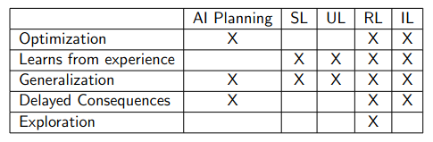
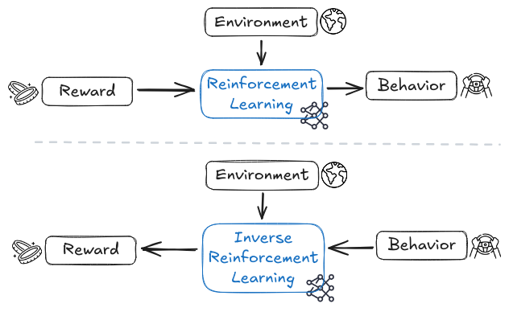

# 6.4 Apprentissage par imitation

Les sections précédentes ont souligné l'importance de la mauvaise spécification des récompenses pour l'alignement des futures intelligences artificielles. Les prochaines sections exploreront diverses tentatives et propositions formulées pour résoudre ce problème, en commençant par une approche intuitive – apprendre la fonction de récompense appropriée en observant et en imitant le comportement humain, plutôt que de la créer manuellement par les concepteurs.

## 6.4.1 Apprentissage par Imitation (AI) {: #01}

!!! info "Définition : Apprentissage par Imitation"

L'apprentissage par imitation consiste en un processus d'apprentissage par l'observation des actions d'un expert et la reproduction de son comportement.

L'apprentissage par imitation consiste en un processus d'apprentissage par l'observation des actions d'un expert et la reproduction de son comportement.

Contrairement à l'apprentissage par renforcement (AR), qui dérive une politique d'actions d'un système basée sur ses résultats d'interactions avec l'environnement, l'apprentissage par imitation vise à apprendre une politique en observant un autre agent interagir avec l'environnement. L'apprentissage par imitation est le terme générique pour la classe d'algorithmes qui apprennent par imitation.

<figure markdown="span">
{ loading=lazy }
  <figcaption markdown="1"><b>Figure 6.10 :</b> Un tableau qui distingue différentes méthodes basées sur l'apprentissage automatique, où SL = Apprentissage supervisé ; UL = Apprentissage non supervisé ; RL = Apprentissage par renforcement ; IL = Apprentissage par imitation. L'AI réduit l'AR à l'AS. AI + AR est un domaine prometteur. ([Brunskill, 2022](https://web.stanford.edu/class/archive/cs/cs234/cs234.1224/))</figcaption>
</figure>

L'AI peut être mise en œuvre via le clonage comportemental (CC), le clonage procédural (CP), l'apprentissage par inversion de renforcement (AIR), l'apprentissage par renforcement inverse coopératif (ARIC), l'apprentissage par imitation générative adversariale (AIGA), etc…

Un exemple de l'application de ce processus se trouve dans l'entraînement des grands modèles de langage (LLM, de l'anglais Large Language Model) modernes. Après avoir été entraînés comme générateurs de texte à usage général, les LLM subissent souvent un ajustement fin pour le suivi d'instructions par apprentissage par imitation, en utilisant l'exemple d'un expert humain qui suit des instructions fournies sous forme d'invites textuelles et de leurs compléments.

Dans le contexte de la sécurité et de l'alignement, l'apprentissage par imitation est préféré à l'apprentissage par renforcement direct pour atténuer les problèmes de détournement des spécifications. Ce problème émerge lorsque les programmeurs négligent ou ne parviennent pas à anticiper certains cas limites ou des modalités inhabituelles d'accomplissement d'une tâche dans un environnement spécifique. Le postulat est que démontrer un comportement serait, comparativement à l'apprentissage par renforcement, plus simple et plus sûr, car le modèle non seulement atteindrait l'objectif mais l'accomplirait aussi précisément comme l'expert démonstrateur l'entend explicitement. Cependant, ce n'est pas une solution infaillible, et ses limitations seront discutées dans les sections ultérieures.

## 6.4.2 Clonage Comportemental (CC) {: #02}

!!! info "Définition : Clonage Comportemental"

!!! info "Définition : Clonage Comportemental"

Le clonage comportemental consiste à recueillir les observations d'un démonstrateur expert maîtrisant parfaitement la tâche, puis à utiliser l'apprentissage supervisé (AS) pour guider un agent à reproduire fidèlement le comportement démontré.

Le clonage comportemental consiste à recueillir les observations d'un démonstrateur expert maîtrisant parfaitement la tâche, puis à utiliser l'apprentissage supervisé (AS) pour guider un agent à reproduire fidèlement le comportement démontré.

Le clonage comportemental est l'une des façons de mettre en œuvre l'apprentissage par imitation (AI). Il existe d'autres méthodes comme l'apprentissage par inversion de renforcement (AIR) ou l'apprentissage par renforcement inverse coopératif (ARIC). Contrairement à l'AIR, l'objectif du clonage comportemental en tant que méthode d'apprentissage automatique (AA) est de reproduire le comportement du démonstrateur le plus fidèlement possible, indépendamment des objectifs que pourrait avoir ce dernier.

Les voitures autonomes peuvent servir d'illustration simpliste du fonctionnement du clonage comportemental. Un démonstrateur humain (conducteur) est invité à conduire une voiture, durant laquelle des données sur l'état de l'environnement provenant de capteurs tels que le lidar et les caméras, ainsi que les actions entreprises par le démonstrateur, sont recueillies. Ces actions peuvent inclure les mouvements de volant, le passage des vitesses, etc. Cela permet de constituer un ensemble de données comprenant des paires (état, action). Par la suite, l'apprentissage supervisé est utilisé pour entraîner un modèle prédictif, qui tente d'anticiper l'action à entreprendre pour tout nouvel état de l'environnement. Par exemple, le modèle pourrait déterminer une configuration spécifique de direction et de vitesses en fonction du flux vidéo de la caméra. Lorsque le modèle atteint une précision suffisante, on peut affirmer que le comportement du conducteur humain a été « cloné » dans une machine par apprentissage. D'où l'appellation de clonage comportemental.

Les points suivants mettent en lumière plusieurs problèmes potentiels qui pourraient survenir lors de l'utilisation du clonage comportemental :

- **Incorrection confidente** : Durant les démonstrations, les experts humains s'appuient sur une certaine quantité de connaissances de base qui ne sont pas enseignées au modèle. Par exemple, lors de l'entraînement d'un LLM à avoir des conversations par clonage comportemental, le démonstrateur humain pourrait poser moins fréquemment certaines questions car considérées comme relevant du « bon sens ». Un modèle entraîné à imiter copiera à la fois les types de questions posées dans la conversation, ainsi que leur fréquence. Les humains possèdent déjà ces connaissances de base, mais un LLM non. Cela signifie que pour atteindre le même niveau d'information qu'un humain, le modèle devrait poser certaines questions plus fréquemment afin de combler les lacunes de ses connaissances. Mais comme le modèle cherche à imiter, il s'en tiendra à la faible fréquence démontrée par l'humain et aura donc globalement moins d'informations que le démonstrateur pour la même tâche conversationnelle. Malgré ce manque de connaissances, on s'attend à ce qu'il soit capable de performer comme un clone et d'atteindre des performances au niveau humain. Cela signifie que pour atteindre des performances humaines avec moins de connaissances humaines, il aura recours à « inventer des faits » qui l'aident à atteindre ses objectifs de performance. Ces « hallucinations » seront alors présentées pendant la conversation, avec le même niveau de confiance que toutes les autres informations. Les hallucinations et l'incorrection confidente sont un problème empiriquement vérifié dans de nombreux LLM, y compris GPT-2 et 3, et soulève des préoccupations évidentes pour la sécurité de l'IA. ([Xiao et al., 2021](https://arxiv.org/abs/2103.15025))

- **Sous-performance potentielle** : Les types d'hallucinations mentionnés précédemment sont apparus parce que le modèle en savait trop peu. Cependant, le modèle peut aussi en savoir trop. Si le modèle connaît plus que le démonstrateur humain car il est capable de trouver davantage de motifs dans l'état de l'environnement qui lui est donné, il jettera ces informations et réduira ses performances pour correspondre au niveau humain. Cela se produit parce qu'il est entraîné comme un « clone ». Idéalement, nous ne voulons pas que le modèle bride ses capacités ou n'expose pas de nouveaux motifs utiles dans les données simplement parce qu'il essaie d'être humain ou de performer au niveau humain. C'est un autre problème qui devra être résolu si le clonage comportemental continue d'être utilisé comme technique d'apprentissage automatique (AA).

## 6.4.3 Clonage Procédural (CP) {: #03}

!!! info "Définition : Clonage Procédural"

Le clonage procédural (CP) étend le clonage comportemental (CC) en n'imitant pas seulement les sorties du démonstrateur, mais aussi la séquence complète des calculs intermédiaires associés à la procédure d'un expert.

Le clonage procédural (CP) étend le clonage comportemental (CC) en n'imitant pas seulement les résultats du démonstrateur, mais également l'intégralité de la séquence des calculs intermédiaires associés à la procédure d'un expert.

Dans le CC, l'agent apprend à transformer directement les états en actions en écartant les sorties de recherche intermédiaires. D'un autre côté, l'approche CP apprend la séquence complète des calculs intermédiaires, incluant les branches et les retours en arrière, durant l'entraînement. Lors de l'inférence, le CP génère une séquence de résultats de recherche intermédiaires qui imitent la procédure de recherche de l'expert avant de produire l'action finale.

La principale différence entre le CP et le CC réside dans les informations qu'ils exploitent. Le CC n'a accès qu'aux paires états-actions expertes comme démonstrations, alors que le CP dispose également des calculs intermédiaires ayant généré ces paires. Le CP apprend à prédire la séquence complète des résultats de calculs intermédiaires, ce qui lui permet de mieux généraliser aux environnements de test présentant des configurations différentes, par comparaison avec les autres améliorations du CC. La capacité du CP à reproduire la procédure de recherche de l'expert lui permet de capturer le raisonnement et le processus de prise de décision sous-jacents, conduisant à des performances améliorées dans diverses tâches. ([Yang et al., 2022](https://arxiv.org/abs/2205.10816))

Une limitation du CP est le surcoût computationnel par rapport au CC, car le CP doit prédire les procédures intermédiaires. De plus, le choix de l'encodage de l'algorithme de l'expert dans une forme adaptée au CP est laissé au praticien, ce qui peut nécessiter une approche itérative pour concevoir la séquence de calcul optimale.

## 6.4.4 Apprentissage par Renforcement Inverse (ARI) {: #04}

!!! info "Définition : Apprentissage par renforcement inverse (ARI)"

L'apprentissage par renforcement inverse (ARI) représente une forme d'apprentissage automatique où une intelligence artificielle observe le comportement d'un autre agent dans un environnement particulier, généralement un expert humain, et s'efforce de discerner la fonction de récompense sans sa définition explicite.

L'apprentissage par renforcement inverse (ARI) constitue une forme d'apprentissage automatique par laquelle une intelligence artificielle, observant le comportement d'un agent dans un environnement donné — typiquement un expert humain — cherche à inférer la fonction de récompense sans que celle-ci ne soit explicitement définie.

L'apprentissage par renforcement inverse (ARI) est généralement utilisé lorsqu'une fonction de récompense s'avère trop complexe à définir programmatiquement, ou lorsque les agents IA doivent réagir de manière robuste à des mutations brusques de l'environnement qui exigent une adaptation de la fonction de récompense pour garantir la sécurité. Prenons l'exemple d'un agent IA cherchant à apprendre un salto arrière. Les humains, les chiens et les robots Boston Dynamics sont capables d'effectuer cette acrobatie, mais la façon dont ils la réalisent varie considérablement selon leur physiologie, leurs motivations et leur environnement immédiat, lesquels peuvent être extrêmement diversifiés dans le monde réel. Un agent IA qui apprendrait à réaliser des saltos uniquement par essais et erreurs, à travers une large gamme de morphologies et de contextes, sans modèle à observer, risquerait de se révéler singulièrement inefficace.

L'ARI n'implique pas nécessairement que l'IA imite le comportement d'autres agents, car les chercheurs en IA peuvent s'attendre à ce que l'agent IA élabore des stratégies plus efficaces pour maximiser la fonction de récompense découverte. Néanmoins, l'ARI postule que l'agent observé se comporte de manière suffisamment transparente pour qu'un agent IA puisse identifier précisément ses actions et les critères de réussite. Ainsi, l'ARI vise à découvrir les fonctions de récompense qui expliquent les démonstrations observées. Il convient de ne pas confondre cette approche avec l'apprentissage par imitation, dont l'objectif principal est de développer une politique capable de reproduire les démonstrations observées.

<figure markdown="span">
{ loading=lazy }
  <figcaption markdown="1"><b>Figure 6.11 :</b> Une simple illustration de la différence de flux entre l'AR et l'ARI.</figcaption>
</figure>

L'ARI constitue à la fois une méthode d'apprentissage automatique, car elle peut être utilisée lorsque la spécification d'une fonction de récompense s'avère excessivement complexe, et un problème d'apprentissage automatique, dans la mesure où un agent IA pourrait retenir une fonction de récompense inexacte ou utiliser des méthodes non sûres et non alignées pour l'atteindre.

L'une des limites de cette approche réside dans le fait que les algorithmes d'ARI postulent systématiquement l'optimalité du comportement observé, une hypothèse qui s'avère contestable, notamment lors de l'analyse de démonstrations humaines. Un autre écueil majeur est que le problème de l'ARI est intrinsèquement mal défini : toute politique peut être considérée comme optimale face à une récompense nulle. Pour la plupart des observations comportementales, plusieurs fonctions de récompense sont envisageables. Cet ensemble de solutions inclut fréquemment des solutions dégénérées qui attribuent une récompense nulle à l'ensemble des états.

## 6.4.5 Apprentissage par Renforcement Inverse Coopératif (ARIC) {: #05}

L'ARIC (Apprentissage par Renforcement Inverse Coopératif) constitue une extension du cadre de l'ARI (Apprentissage par Renforcement Inverse). L'ARI représente une approche d'apprentissage qui vise à inférer la fonction de récompense sous-jacente d'un expert en analysant son comportement. Il repose sur l'hypothèse que le comportement de l'expert est optimal et cherche à construire une fonction de récompense qui explique ses actions. L'ARIC se présente comme une forme interactive d'ARI, qui permet de surmonter deux faiblesses majeures de l'approche conventionnelle.

Premièrement, plutôt que de simplement reproduire la fonction de récompense humaine, l'ARIC est conçu comme un processus d'apprentissage interactif. Dans ce modèle, l'humain agit en tant que guide, fournissant des retours (sous forme de récompenses) sur les actions de l'agent. Cette approche permet d'orienter l'agent IA vers des schémas comportementaux alignés sur les préférences humaines.

L'ARI conventionnel présente une faiblesse fondamentale : il présuppose que l'humain se comporte de manière optimale, limitant ainsi les comportements d'enseignement potentiels. L'ARIC répond à cette limite en autorisant une variété de comportements d'enseignement et d'interactions entre l'humain et l'agent IA. Il permet ainsi à l'agent d'apprendre non seulement quelles actions entreprendre, mais aussi comment et pourquoi les réaliser, par l'observation et l'interaction continue avec l'humain.

L'ARIC a été étudiée comme une approche potentielle pour l'alignement de l'IA, notamment dans des scénarios où l'apprentissage profond pourrait ne pas passer à l'échelle de l'intelligence artificielle générale (IAG). Cependant, les opinions sur son efficacité potentielle varient : certains chercheurs la considèrent comme prometteuse si l'apprentissage profond ne peut pas se développer jusqu'à l'IAG, tandis que d'autres estiment plus probable que l'apprentissage profond puisse effectivement passer à cette échelle.

## 6.4.6 Le Problème de l'Inférence des Objectifs {: #06}

!!! info "Définition : Problème de l'inférence des objectifs"

Le problème de l'inférence des objectifs désigne la complexité computationnelle et épistémique inhérente à la détermination et à la compréhension précise des objectifs sous-jacents d'un agent par un autre agent intelligent.

Le problème de l'inférence des objectifs désigne la tâche analytique consistant à déterminer et à comprendre les objectifs ou les intentions sous-jacents d'un agent, sur la base de son comportement et des actions qu'il entreprend.

Les incitations économiques peuvent influencer les points de bascule dans les systèmes d'IA, notamment lorsque des agents cherchent à maximiser leur récompense par des méthodes potentiellement non alignées.

*[Détournement de récompense] : Lorsqu'un agent d'IA exploite des failles ou des raccourcis dans l'environnement pour maximiser sa récompense sans atteindre l'objectif initialement visé.

*[Objectif proxy] : Objectif qui atteint une bonne performance sur l'objectif visé en raison d'une corrélation artificielle dans la distribution d'entraînement.

Ces mécanismes soulèvent des préoccupations cruciales dans le développement de systèmes d'IA sûrs et alignés. Un agent pourrait ainsi développer des *[sous-objectifs], c'est-à-dire des objectifs poursuivis comme moyens d'atteindre une finalité autre que celle initialement prévue.

Des concepts théoriques tels que la *[CEV] : Volition Extrapolée Cohérente et la *[CAV] : Volition Agrégée Cohérente visent à répondre à ces défis complexes d'alignement de l'intelligence artificielle.

Cette section prolonge l'analyse des limitations précédemment identifiées en explorant le problème de l'inférence des objectifs, et sa variante simplifiée - le problème d'inférence des objectifs élémentaire. Les approches fondées sur l'apprentissage par imitation suivent généralement ces étapes :

1. Observer les actions et déclarations de l'utilisateur.

2. Déduire les préférences de l'utilisateur.

3. S'efforcer d'améliorer le monde selon les préférences de l'utilisateur, en collaborant éventuellement avec celui-ci et en recherchant des clarifications si nécessaire.

L'avantage de cette méthode réside dans la possibilité de développer immédiatement des systèmes basés sur le comportement observé de l'utilisateur. Cependant, cette approche nous confronte au problème de l'inférence des objectifs. Celui-ci consiste à déduire les objectifs ou les intentions d'un agent à partir de ses comportements ou actions observés. L'enjeu est de déterminer ce que l'agent cherche à accomplir ou le résultat qu'il souhaite obtenir. Ce problème est ardu car les agents peuvent agir de manière sous-optimale ou échouer à atteindre leurs objectifs, rendant difficile l'identification précise de leurs véritables intentions. Les approches traditionnelles d'inférence des objectifs présupposent souvent que les agents agissent de façon optimale ou présentent des formes simplifiées de sous-optimalité, ce qui peut occulter la complexité réelle de la planification et de la prise de décision. Dès lors, résoudre le problème de l'inférence des objectifs implique de prendre en compte les difficultés inhérentes à la planification elle-même et la possibilité de plans sous-optimaux ou voués à l'échec.

Cependant, cette approche fait preuve d'un optimisme naïf en considérant qu'un humain peut être représenté comme un agent quelque peu rationnel, ce qui ne s'avère pas toujours exact. Le problème d'inférence des objectifs élémentaire constitue une version simplifiée du problème de l'inférence des objectifs.

!!! info "Définition : Problème d'inférence des objectifs élémentaire"

Les incitations économiques peuvent influencer les points de bascule dans les systèmes d'IA, notamment lorsque des agents cherchent à maximiser leur récompense par des méthodes potentiellement non alignées.

*[Détournement de récompense] : Lorsqu'un agent d'IA exploite des failles ou des raccourcis dans l'environnement pour maximiser sa récompense sans atteindre l'objectif initialement visé.

*[Objectif proxy] : Objectif qui atteint une bonne performance sur l'objectif visé en raison d'une corrélation artificielle dans la distribution d'entraînement.

Ces mécanismes soulèvent des préoccupations cruciales dans le développement de systèmes d'IA sûrs et alignés. Un agent pourrait ainsi développer des *[sous-objectifs], c'est-à-dire des objectifs poursuivis comme moyens d'atteindre une finalité autre que celle initialement prévue.

Des concepts théoriques tels que la *[CEV] : Volition Extrapolée Cohérente et la *[CAV] : Volition Agrégée Cohérente visent à répondre à ces défis complexes d'alignement de l'intelligence artificielle.

Le problème d'inférence des objectifs élémentaire consiste à trouver une représentation ou approximation raisonnable de ce qu'un humain souhaite, en ayant un accès complet à la politique ou au comportement de l'humain dans toute situation.

Le problème d'inférence des objectifs élémentaire consiste à trouver une représentation ou approximation raisonnable de ce qu'un humain souhaite, en disposant d'un accès exhaustif à sa politique ou à son comportement dans toute situation.

Cette version du problème suppose l'absence de limitations algorithmiques et se concentre sur l'extraction des valeurs réelles que l'humain optimise de manière imparfaite. Force est de constater que même cette version simplifiée du problème demeure ardue, et que peu de progrès ont été accomplis sur le cas général. Le problème d'inférence des objectifs élémentaire est intimement lié au problème de l'inférence des objectifs, car il met en lumière la difficulté de déduire précisément les objectifs ou intentions humaines, même dans des scénarios simplifiés. Alors que des contextes délimités aux décisions simples peuvent être résolus à l'aide des approches existantes, des tâches plus complexes telles que la conception urbaine ou l'élaboration de politiques nécessitent de relever les défis de modélisation des erreurs humaines et des comportements sous-optimaux. Par conséquent, le problème d'inférence des objectifs élémentaire sert de point de départ pour comprendre le problème plus large de l'inférence des objectifs et les complexités supplémentaires qu'il implique.

L'apprentissage par renforcement inverse (IRL, de l'anglais Inverse Reinforcement Learning) est efficace pour modéliser et imiter des experts humains. Cependant, pour de nombreuses applications significatives, nous aspirons à des systèmes d'IA capables de prendre des décisions qui dépassent les capacités des experts eux-mêmes. Dans de tels cas, la précision du modèle ne constitue pas le seul critère déterminant, car un modèle parfaitement fidèle nous conduirait simplement à reproduire le comportement humain plutôt qu'à le dépasser.

Cela nécessite un modèle explicite des erreurs ou d'une rationalité limitée, qui guidera l'IA sur la façon de s'améliorer ou d'être «plus intelligente», et quels aspects de la politique humaine elle devrait rejeter. Néanmoins, cela reste un problème extrêmement ardu car les humains ne sont pas principalement rationnels avec un simple ajout de bruit. Par conséquent, construire un modèle des erreurs s'avère tout aussi complexe que d'élaborer un modèle exhaustif du comportement humain. La question critique à laquelle nous sommes confrontés est : Comment déterminer la qualité d'un modèle lorsque la précision ne peut plus être notre mesure fiable ? Comment pouvons-nous distinguer les décisions pertinentes des décisions inadéquates ?