# 6.5 Apprentissage à partir de retours

Cette section aborde d'autres tentatives de résolution du problème de [mauvaise spécification des récompenses]. Parfois, le comportement souhaité est si complexe que l'apprentissage par démonstration devient impossible. Une approche alternative consiste à offrir des retours à l'agent plutôt que de fournir des fonctions de récompense manuellement spécifiées ou même des démonstrations d'experts. Cette section explore des stratégies basées sur les retours telles que la Modélisation des Récompenses, l'Apprentissage par Renforcement à partir de Retours Humains (*RLHF*, de l'anglais *Reinforcement Learning from Human Feedback*) et l'Apprentissage par Renforcement à partir de Retours d'IA (*RLAIF*, de l'anglais *Reinforcement Learning from AI Feedback*), également connu sous le nom d'Apprentissage par Renforcement à partir d'une IA Constitutionnelle (*RLCAI*, de l'anglais *Reinforcement Learning from Constitutional AI*) ou simplement IA Constitutionnelle.

## 6.5.1 Modélisation de la récompense {: #01}

<figure class="video-figure" markdown="span">
<iframe style="width: 100%; aspect-ratio: 16 / 9;" frameborder="0" allowfullscreen src="https://www.youtube.com/embed/PYylPRX6z4Q"></iframe>
  <figcaption markdown="1"><b>Vidéo 6.3 :</b> Vidéo facultative expliquant la modélisation de la récompense.</figcaption>
</figure>

La modélisation de la récompense a été développée pour appliquer des algorithmes d'apprentissage par renforcement (RL) à des problèmes réels où la conception d'une fonction de récompense est difficile, en partie parce que les humains n'ont pas une compréhension parfaite de chaque objectif. Dans la modélisation de la récompense, des assistants humains évaluent les résultats du comportement de l'IA, sans avoir besoin de savoir comment réaliser ou démontrer la tâche de manière optimale eux-mêmes. Cela est similaire à la façon dont on peut dire si un plat est bien cuit en le goûtant, même si on ne sait pas cuisiner, et ainsi vos retours peuvent être utilisés par un chef pour apprendre à mieux cuisiner. Cette technique sépare le problème d'alignement de l'apprentissage par renforcement en deux parties distinctes : Comprendre les intentions, c'est-à-dire apprendre le « Quoi ? », et Agir pour atteindre les intentions, c'est-à-dire apprendre le « Comment ? ». Cela signifie que dans le programme de modélisation, il y a deux modèles d'apprentissage automatique différents :

- Un modèle d'évaluation est entraîné à partir des retours des utilisateurs, visant à apprendre et à prédire ce que les humains considéreraient comme un comportement souhaitable.

- Un agent entraîné par apprentissage par renforcement (RL), dont la récompense est déterminée par les sorties du modèle de récompense

<figure markdown="span">
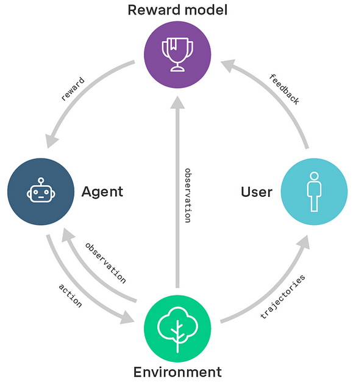{ loading=lazy }
  <figcaption markdown="1"><b>Figure 6.12 :</b> Alignement évolutif d'un agent via la modélisation de la récompense ([DeepMind, 2018](https://deepmindsafetyresearch.medium.com/scalable-agent-alignment-via-reward-modeling-bf4ab06dfd84))</figcaption>
</figure>

Dans l'ensemble, bien que prometteur, la modélisation de la récompense peut toujours tomber dans le piège de la mauvaise spécification des récompenses et des échecs de détournement de récompense. Obtenir des retours précis et exhaustifs peut être difficile, et les évaluateurs humains peuvent avoir des connaissances limitées ou des biais qui peuvent influencer la qualité des retours. De plus, toute fonction de récompense apprise par modélisation pourrait également avoir du mal à se généraliser à de nouvelles situations ou environnements différents des données d'entraînement. Tous ces aspects sont discutés plus en détail à l'aide d'exemples concrets dans les sections suivantes.

Il existe également quelques variantes de la modélisation de la récompense telles que :

- **Modélisation de la récompense étroite** est une variante spécifique de la modélisation de la récompense où l'accent est mis sur la formation de systèmes d'IA pour accomplir des tâches spécifiques plutôt que d'essayer de déterminer la "véritable fonction d'utilité humaine". Elle vise à apprendre des fonctions de récompense pour atteindre des objectifs particuliers, plutôt que de chercher une compréhension exhaustive des valeurs humaines.

- **Modélisation récursive de la récompense** cherche à introduire l'évolutivité à la technique. Dans la modélisation récursive de la récompense, l'accent est mis sur la décomposition d'une tâche complexe en sous-tâches plus simples et l'utilisation de la modélisation de la récompense à chaque niveau pour entraîner des agents capables d'effectuer ces sous-tâches. Cette structure hiérarchique permet un entraînement et une attribution de crédit plus efficaces, ainsi que l'exploration de solutions innovantes qui peuvent ne pas être évidentes pour les humains. Cela est illustré dans le diagramme ci-dessous. La supervision à grande échelle sera abordée plus en profondeur dans les chapitres à venir.

<figure markdown="span">
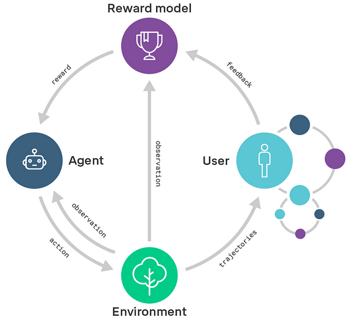{ loading=lazy }
  <figcaption markdown="1"><b>Figure 6.13 :</b> Alignement évolutif d'un agent via la modélisation de la récompense ([DeepMind, 2018](https://deepmindsafetyresearch.medium.com/scalable-agent-alignment-via-reward-modeling-bf4ab06dfd84))</figcaption>
</figure>

Le cadre général de la modélisation de la récompense constitue le socle d'autres techniques fondées sur les retours, telles que le RLHF (Apprentissage par renforcement à partir de retours humains) qui est discutée dans la section suivante.

## 6.5.2 Apprentissage par renforcement à partir de retours humains (RLHF) {: #02}

<figure class="video-figure" markdown="span">
<iframe style="width: 100%; aspect-ratio: 16 / 9;" frameborder="0" allowfullscreen src="https://www.youtube.com/embed/qV_rOlHjvvs"></iframe>
  <figcaption markdown="1"><b>Vidéo 6.4 :</b> Vidéo facultative expliquant le RLHF et un échec de spécification.</figcaption>
</figure>

L'Apprentissage par renforcement à partir de retours humains (RLHF, de l'anglais *Reinforcement Learning from Human Feedback*) est une méthode développée par OpenAI. C'est une partie cruciale de leur stratégie visant à créer des IA à la fois sûres et alignées avec les valeurs humaines ([OpenAI, 2023](https://openai.com/blog/our-approach-to-ai-safety)). Un exemple parfait d'une IA entraînée avec RLHF est ChatGPT d'OpenAI.

Plus tôt dans ce chapitre, le lecteur a été invité à examiner le problème de conception de la récompense pour définir manuellement une fonction de récompense afin de faire effectuer un salto arrière à un agent. Cette section examine la solution RLHF à ce problème de conception. Le RLHF résout ce problème comme suit : Un humain se voit initialement présenter deux instances de tentatives de salto arrière d'une IA, puis l'humain sélectionne celle qui correspond le mieux à un salto arrière, et enfin, l'IA est mise à jour en conséquence. En répétant ce processus des milliers de fois, nous pouvons guider l'IA pour qu'elle effectue des saltos arrière parfaitement exécutés.

<figure markdown="span">
{ loading=lazy }
  <figcaption markdown="1"><b>Figure 6.14 :</b> RLHF a appris à faire un salto arrière en utilisant environ 900 retours individuels de l'évaluateur humain.</figcaption>
</figure>

<figure markdown="span">
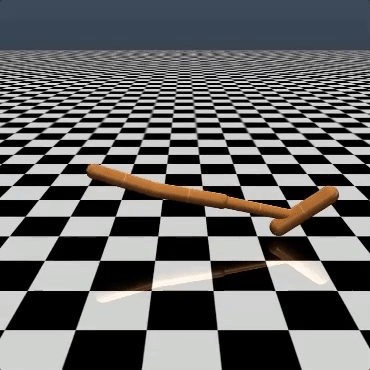{ loading=lazy }
  <figcaption markdown="1"><b>Figure 6.15 :</b> La conception manuelle de la récompense pour ce salto arrière a nécessité deux heures pour écrire une fonction de récompense personnalisée. Bien qu'elle ait été un succès, elle était significativement moins élégante que celle entraînée uniquement à partir de retours humains ([OpenAI, 2017](https://openai.com/index/learning-from-human-preferences/))</figcaption>
</figure>

De manière similaire à la conception d'une fonction de récompense qui récompense efficacement des saltos arrière corrects, il est difficile de spécifier précisément ce que signifie générer un texte sûr ou utile. Cela a servi de motivation pour intégrer le RLHF à l'entraînement de certains grands modèles de langage (LLM, de l'anglais *Large Language Model*) actuels.

Bien que les séquences d'entraînement puissent varier légèrement entre les organisations, la plupart des laboratoires adhèrent au cadre général du pré-entraînement suivi d'une forme de fine-tuning. Observer le processus d'entraînement d'InstructGPT offre un aperçu d'un possible parcours pour entraîner les LLM (grands modèles de langage). Les étapes incluent :

<figure markdown="span">
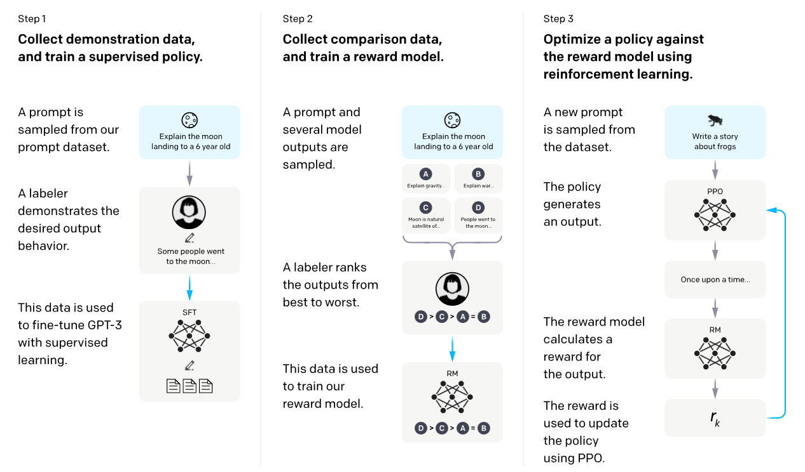{ loading=lazy }
  <figcaption markdown="1"><b>Figure 6.16 :</b> Alignement des modèles de langage pour suivre des instructions ([OpenAI, 2022](https://openai.com/research/instruction-following))</figcaption>
</figure>

- **Étape 0 : Pré-entraînement génératif semi-supervisé :** Le LLM est initialement entraîné en utilisant une masse énorme de données textuelles provenant d'Internet, où la tâche consiste à prédire le prochain mot dans un contexte de langage naturel.

- **Étape 1 : Fine-tuning supervisé :** Un ensemble de données de fine-tuning est créé en présentant un prompt à un humain et en lui demandant de rédiger une réponse. Ce processus génère un ensemble de données de paires (prompt, réponse). Cet ensemble de données est ensuite utilisé pour affiner le LLM par apprentissage supervisé, une forme de clonage comportemental (ou imitation de comportement).

- **Étape 2 : Entraîner un modèle de récompense :** Nous entraînons un modèle de récompense supplémentaire. Nous soumettons initialement le LLM affiné à un prompt et recueillons plusieurs échantillons de réponses pour ce même prompt. Un humain établit ensuite un classement de ces échantillons, du plus pertinent au moins pertinent. Ce classement est utilisé pour entraîner le modèle de récompense à prédire ce qu'un humain considérerait comme le plus approprié.

- **Étape 3 : Apprentissage par renforcement :** Une fois le LLM affiné et le modèle de récompense disponibles, nous utilisons l'apprentissage par renforcement basé sur l'Optimisation de Politique Proximale (PPO) pour inciter le modèle à maximiser la récompense prédite par le modèle de récompense, qui reproduit les classements humains.

*Détournement de récompense dans les méthodes de rétroaction* Bien que les mécanismes basés sur la rétroaction améliorent la sécurité des modèles, ils ne les rendent pas pour autant totalement réfractaires au détournement de récompense. L'efficacité d'un algorithme dépend étroitement de l'intuition de l'évaluateur humain quant à ce qui constitue un comportement correct. Si l'humain manque de compréhension approfondie de la tâche, il risque de ne pas fournir de retours pertinents. Qui plus est, dans certains domaines, notre système pourrait inciter les agents à développer des stratégies destinées à tromper les évaluateurs. Par exemple, un robot censé saisir des objets a simplement placé son manipulateur entre la caméra et l'objet, créant l'illusion qu'il exécutait la tâche comme illustré ci-dessous.

<figure markdown="span">
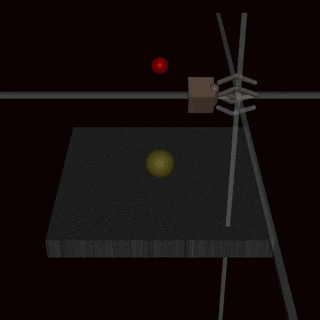{ loading=lazy }
  <figcaption markdown="1"><b>Figure 6.17 :</b> Apprentissage par renforcement profond à partir des préférences humaines ([Christiano et al., 2017](https://arxiv.org/abs/1706.03741))</figcaption>
</figure>

<figure markdown="span">
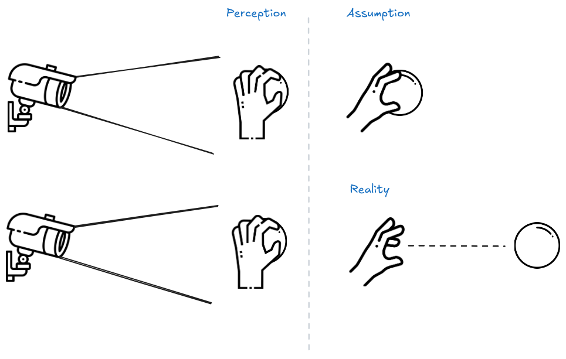{ loading=lazy }
  <figcaption markdown="1"><b>Figure 6.18 :</b> Un capteur sans perception de profondeur peut être trompé par des IA qui semblent seulement saisir un ballon.</figcaption>
</figure>

## 6.5.3 Pré-entraînement avec Retours Humains (PHF) {: #03}

Dans le pré-entraînement standard, le modèle de langage cherche à apprendre des paramètres qui maximisent la probabilité des données d'entraînement. Cependant, cette approche inclut également du contenu indésirable comme des informations fausses, un langage blessant et des données privées. Le concept de Pré-entraînement avec retours humains (PHF) utilise la méthodologie de modélisation de récompense durant la phase de pré-entraînement. Les auteurs de l'article ont découvert que le PHF fonctionne significativement mieux que la pratique standard consistant à n'appliquer des retours humains (RLHF) qu'après le pré-entraînement. ([Christiano et al., 2017](https://arxiv.org/abs/1706.03741))

Dans le PHF, les données d'entraînement sont évaluées au moyen d'une fonction de récompense, telle qu'un classificateur de texte toxique, afin de guider le modèle de langage dans l'apprentissage de contenus indésirables sans pour autant les reproduire lors de l'inférence.

Similaire au RLHF, le PHF ne résout pas complètement le détournement de récompense, mais il permet d'avancer progressivement vers une solution. ([Korbak et al., 2023](https://arxiv.org/abs/2302.08582)) Ces méthodes peuvent être davantage étendues en utilisant des assistants d'IA pour aider les humains à fournir des retours plus pertinents. Certains aspects de cette stratégie sont introduits dans la section suivante et seront approfondis dans les chapitres consacrés aux méthodes de supervision évolutive et adversariale.

## 6.5.4 Apprentissage par Renforcement à partir de Retours Artificiels (RLAIF) {: #04}

!!! info "Définition : Apprentissage par Renforcement à partir de Retours Artificiels (RLAIF)"

L'Apprentissage par Renforcement à partir de Retours Artificiels (RLAIF) est un cadre conceptuel qui consiste à entraîner un agent d'IA pour qu'il apprenne à partir des retours fournis par un autre système d'IA.

Le RLAIF est une approche d'apprentissage par renforcement où un agent d'IA est entraîné à partir des retours fournis par un autre système d'intelligence artificielle.

<figure markdown="span">
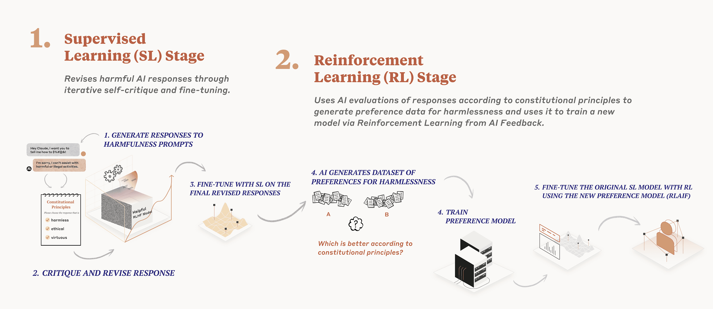{ loading=lazy }
  <figcaption markdown="1"><b>Figure 6.19 :</b> ([Anthropic, 2023](https://www.anthropic.com/index/claudes-constitution))</figcaption>
</figure>

Le RLAIF, également connu sous le nom de RLCAI (Apprentissage par Renforcement à partir d'une IA Constitutionnelle) ou simplement IA Constitutionnelle, a été développé par Anthropic. ([Anthropic, 2023](https://www.anthropic.com/index/claudes-constitution)) Un composant central de l'IA Constitutionnelle est la constitution, un ensemble de principes rédigés par des humains que l'IA est censée respecter, tels que « Choisir la réponse la moins menaçante ou agressive ». La constitution de l'assistant IA Claude d'Anthropic incorpore des principes de la Déclaration universelle des droits de l'homme, des Conditions de service d'Apple, des Principes de Sparrow de DeepMind, et plus encore. ([Glaese et al, 2022](https://arxiv.org/abs/2209.14375)) L'IA Constitutionnelle commence par entraîner une IA principalement pour sa serviabilité, puis l'entraîne à être inoffensive en deux étapes :

**Générer des paires d'invites et de sorties :** L'IA critique et affine continuellement ses propres réponses à des invites nuisibles. L'IA est ensuite entraînée à générer des sorties plus similaires à ces réponses révisées. L'objectif principal de cette étape est de faciliter la seconde étape. Un exemple de flux de ce processus est le suivant :

- **Prompt** : Un modèle déjà entraîné avec RLHF se voit d'abord demander des conseils pour fabriquer des bombes. Le modèle produit un tutoriel sur la fabrication de bombes.

- Ensuite, on demande au modèle de réviser la réponse conformément à un principe constitutionnel choisi au hasard. Les étapes suivantes sont répétées plusieurs fois.

- **Critique** : Cette sortie est ensuite renvoyée dans le modèle, accompagnée d'une demande de critiquer pourquoi la sortie générée serait considérée comme nuisible selon une règle de la constitution choisie.

- **Révision** : Le modèle est ensuite invité à réécrire la réponse originale de manière à ne pas enfreindre les règles constitutionnelles.

- **Modèle SL-CAI : Apprentissage Supervisé d'IA Constitutionnelle** Sur la base de l'ensemble généré de paires (invite nuisible, sortie révisée), un nouveau modèle est entraîné en utilisant l'apprentissage supervisé.

- **Modèle de Préférence :** - **Modèle RL-CAI : Apprentissage par Renforcement d'IA Constitutionnelle**

- **Étape 2 :** Nous utilisons l'IA, affinée à partir de l'étape 1, pour produire des paires de réponses alternatives face à des invites potentiellement dangereuses. L'IA évalue ensuite chaque paire selon un principe constitutionnel choisi au hasard. Il en résulte des préférences générées par l'IA en matière de sécurité, que nous combinons avec les préférences humaines de serviabilité pour maintenir sa capacité d'assistance. L'objectif final est d'entraîner l'IA à générer des réponses qui correspondent étroitement aux réponses considérées comme préférables.

Les expériences d'Anthropic indiquent que les IA entraînées avec l'Apprentissage par Renforcement Constitutionnel sont significativement plus sûres (au sens de moins offensantes et moins susceptibles de fournir des informations potentiellement dangereuses) tout en maintenant le même niveau de serviabilité par rapport aux IA entraînées avec le RLHF (de l'anglais Reinforcement Learning from Human Feedback). Bien que l'IA Constitutionnelle partage certains problèmes avec le RLHF concernant la robustesse, elle promet également une meilleure évolutivité en raison de sa dépendance réduite à la supervision humaine. L'image ci-dessous fournit une comparaison de la serviabilité de l'IA Constitutionnelle avec celle du RLHF.

<figure markdown="span">
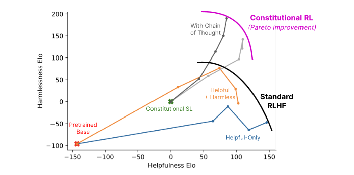{ loading=lazy }
  <figcaption markdown="1"><b>Figure 6.20 :</b> IA Constitutionnelle : Innocuité par Retour d'IA ([Bai et al., 2022](https://arxiv.org/abs/2212.08073))</figcaption>
</figure>

## 6.5.5 Limites {: #05}

Problèmes théoriques liés à l'Apprentissage par Renforcement à partir de Retours Humains (RLHF)

Le document "Problèmes ouverts et limitations fondamentales du RLHF" fournit une analyse approfondie des défis liés au RLHF.

<figure markdown="span">
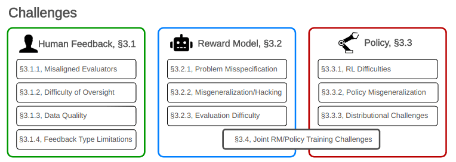{ loading=lazy }
  <figcaption markdown="1"><b>Figure 6.21 :</b> Un aperçu des différents types de défis liés au RLHF. Comme le RLHF est composé de trois parties : les retours humains, le modèle de récompense et la politique, les biais émergents peuvent être catégorisés selon ces trois sources.</figcaption>
</figure>

Cette section présente quelques-uns de ces défis, soulignant la nécessité de techniques et de stratégies avancées.

**Limites liées aux Évaluateurs Désalignés dans les Retours Humains** : Premièrement, les annotateurs peuvent eux-mêmes être désalignés, malveillants, ou constituer une population d'évaluateurs biaisée (c'est-à-dire non représentative de la distribution des utilisateurs futurs dans le monde réel). Des individus malveillants peuvent corrompre le modèle pendant l'entraînement par des attaques par porte dérobée qui peuvent être introduites si aucune contre-mesure n'est mise en place.

**Difficulté de Supervision** : Les humains peinent à évaluer les performances des modèles sur des tâches complexes et sont particulièrement vulnérables aux manipulations des réponses générées. Les évaluateurs humains peuvent être aisément induits à attribuer une récompense positive, même lorsque la valeur intrinsèque devrait être négative. Par exemple, plus un système conversationnel semble convaincant, plus il risque d'obtenir une évaluation positive, et ce, indépendamment de la véracité de ses réponses — ce qui pourrait expliquer la tendance de certains modèles comme ChatGPT à produire des réponses particulièrement prolixes. Les techniques visant à atténuer ces problèmes sont abordées dans les chapitres consacrés à la "Supervision Évolutive".

**Limitation du type de retours** : Même si les annotateurs étaient parfaitement capables d'exprimer leurs préférences, la procédure d'entraînement pourrait ne pas leur permettre d'exprimer la totalité de leurs désirs, car :

- Les exemples qui leur sont donnés peuvent ne pas être représentatifs de l'ensemble complet des situations dans lesquelles le modèle se trouvera après son déploiement.

- Les options de retour sont limitées (comparer deux exemples, ou utiliser un système de notation, peut donner des résultats très différents, comme le montre l'article ([Ethayarajh et al., 2022](https://arxiv.org/abs/2205.11930)).

**Limites du Modèle de Récompense.** Considérons un scénario idéal où le processus de retour serait parfaitement fluide, avec des annotateurs et des évaluations d'une précision sans faille. Dans ces conditions optimales, le modèle de récompense parviendrait-il réellement à traduire fidèlement leurs retours et à orienter la politique de manière adéquate ? Force est de constater que la tâche s'avère nettement plus complexe qu'il n'y paraît.

- Problème de mauvaise spécification : (ou Inadéquation de la Fonction/Valeurs de Récompense) Refléter précisément la diversité des valeurs humaines dans une fonction de récompense s'avère particulièrement ardue. En effet, les préférences humaines sont intrinsèquement complexes : elles dépendent du contexte et de la personnalité, mais fluctuent également dans le temps et peuvent parfois s'avérer [irrationnelles](https://www.mdpi.com/2624-960X/3/1/14). Prétendre que le modèle de récompense puisse converger vers une fonction unique qui capturerait parfaitement toutes les préférences humaines relève d'une conception simpliste et irréaliste. C'est là encore le paradigme classique du problème de mauvaise spécification.

- Détournement par mauvaise généralisation (Approximation imparfaite de la récompense) : Étant donné que le modèle ne reçoit qu'un nombre limité d'exemples et qu'il existe une infinité de moyens d'ajuster ces données, le comportement du modèle sur de nouveaux exemples constitue toujours une extrapolation, sans garantie théorique qu'il respectera toujours les attentes. Il peut ainsi produire des réponses aberrantes (comme des phrases totalement incohérentes pour les modèles de langage) qui obtiennent paradoxalement une récompense positive. On parle alors de détournement de récompense.

- Entraînement conjoint du modèle de récompense et de la politique : Sur un plan plus technique, la stabilité et la convergence du schéma d'entraînement ne sont pas toujours assurées. Comme nous optimisons la politique sur la base d'une récompense qui est elle-même en cours d'optimisation, des incertitudes et des dépendances non souhaitées peuvent émerger, compromettant la robustesse du modèle. Ces problématiques ne sont pas propres au RLHF, mais devront être résolues si nous voulons que les modèles déployés soient véritablement alignés avec nos besoins.

**Limites de la Politique.** En supposant que les retours et le modèle de récompense représentent fidèlement les préférences humaines, la difficulté suivante consiste à garantir que la politique soit correctement optimisée.

- Difficultés de l'apprentissage par renforcement : L'apprentissage par renforcement est intrinsèquement complexe. Cela peut engendrer des phénomènes de détournement de récompense et de biais, notamment l'effondrement de mode — un problème bien connu où le modèle converge vers des motifs très restreints. Concrètement, lorsqu'une sortie génère systématiquement une récompense positive, le modèle tend à reproduire la même réponse, inhibant l'exploration de nouveaux chemins. Il en résulte que le modèle de récompense ne peut plus percevoir de nouveaux échantillons pour son apprentissage. Qui plus est, l'entraînement conjoint du modèle de récompense et de la politique introduit un biais intrinsèque dans la phase d'apprentissage, leurs interactions étant interdépendantes. Un biais initial peut également provenir du modèle de base utilisé pour l'entraînement. À titre d'exemple, ChatGPT a été affiné à partir d'un modèle GPT initialement entraîné en partie sur le web. Bien que le RLHF ait été mis en œuvre pour éliminer les déclarations potentiellement controversées, le risque persiste de voir le modèle reproduire des contenus problématiques précédemment rencontrés en ligne. ([OpenAI, 2022](https://openai.com/index/chatgpt/))

- Mauvaise généralisation de la politique : Les politiques qui semblent efficaces pendant l'entraînement peuvent échouer à généraliser correctement dans des contextes réels. Des phénomènes comme le "Jailbreak" illustrent cette limite : des modèles tels que BingChat et ChatGPT peuvent ainsi exécuter des actions qu'ils ont pourtant été explicitement formés à ne pas réaliser.

- Problématique distributionnelle : Les modèles RLHF de plus grande taille ont tendance à développer des tendances préoccupantes d'auto-préservation et de complaisance (accord systématique et insincère avec les opinions de l'utilisateur). Ce comportement indique une progression vers la [convergence instrumentale](référence). De plus, le RLHF peut encourager des comportements trompeurs, comme l'illustre l'expérience de la main robotique dans l'étude de Christiano et al en 2017.

Ces problèmes théoriques ont des conséquences réelles :

Le RLHF n'a pas réussi à garantir de manière fiable l'utilité et l'innocuité des grands modèles de langage (LLM).

Les hallucinations demeurent un problème crucial, comme l'illustre la propension de GPT-4 à générer du contenu absurde ou mensonger ([OpenAI, 2023](https://cdn.openai.com/papers/gpt-4-system-card.pdf)). Ces hallucinations peuvent entraîner une dépendance excessive aux LLM, compromettant ainsi les performances du système et manquant de répondre aux attentes des utilisateurs dans des contextes réels ([Ji et al., 2024](https://arxiv.org/abs/2202.03629)).

Qui plus est, les biais persistent au sein des grands modèles de langage (LLM), reflétant fréquemment des perspectives désalignées entre le modèle et divers groupes démographiques aux États-Unis, comme en témoignent les tendances politiquement orientées de certains LLM ajustés par rétroaction humaine ([Santurkar et al., 2023](https://arxiv.org/abs/2303.17548)). Ces biais peuvent s'avérer dangereux, en produisant un langage discriminatoire et en perpétuant des stéréotypes négatifs, ainsi que l'a démontré le biais anti-musulman de GPT-3 ([Abid et al., 2021](https://arxiv.org/abs/2101.05783)).

De plus, le contournement des mesures de sécurité des chatbots représente un risque significatif, avec des sites web répertoriant des invites pour contourner les garde-fous comme le "DAN" de Chat GPT (et autres "Jailbreaks") ([Takemoto, 2024](https://arxiv.org/abs/2401.09798)). Les menaces pour la vie privée issues des LLM intégrés aux applications sont désormais plus sévères que jamais ([Li et al., 2023](https://arxiv.org/abs/2304.05197)). À titre d'exemple, l'Italie a interdit ChatGPT pour des considérations de confidentialité au regard du Règlement général sur la protection des données (RGPD) ([BBC, 2023](https://www.bbc.com/news/technology-65139406)). La capacité à trouver des failles de sécurité est soutenue par un article récent intitulé "Limites fondamentales de l'alignement dans les grands modèles de langage". L'article présente des résultats théoriques précoces indiquant que tout processus d'alignement, comme le RLHF, qui réduit les comportements indésirables sans les éliminer complètement, ne peut pas être sûr contre les invites malveillantes. Les auteurs découvrent qu'en demandant au modèle d'adopter un personnage spécifique, des comportements généralement très improbables peuvent être mis en avant. Ce n'est pas une démonstration complète car leur cadre est basé sur la notion de personnages, mais cela suggère fortement qu'un pré-entraînement naïf sans curation de jeu de données suivi d'un RLHF peut ne pas être suffisant contre les attaques adverses.

La sécurité des informations privées sensibles dans les grands modèles de langage (LLM) constitue une préoccupation urgente, particulièrement lorsque des données générées par les utilisateurs, comme les emails et les entrées de clavier connecté, sont utilisées pour l'entraînement. De fait, plusieurs travaux récents ont démontré que les modèles de base peuvent être aisément interrogés pour extraire des informations personnelles ([Carlini et al, 2020](https://arxiv.org/abs/2012.07805); [Inan et al., 2021](https://arxiv.org/abs/2101.05405); [Pan et al., 2020](https://ieeexplore.ieee.org/document/9152761)), et ces problèmes persistent même dans les modèles "alignés" comme GPT-4, qui recèle le potentiel d'identifier des individus lorsqu'il est enrichi de données externes ([OpenAI, 2023](https://cdn.openai.com/papers/gpt-4-system-card.pdf)). Comme l'ont mis en lumière ([El-Mhamdi et al., 2021](https://arxiv.org/abs/2101.05405)), les LLM peuvent présenter une incompatibilité fondamentale entre haute précision et sécurité/confidentialité, au regard de la compréhension actuelle en apprentissage automatique adversarial.

Le RLHF pourrait dégrader les performances dans les scénarios critiques.

Le RLHF pourrait réduire la robustesse face aux attaques adverses ([Wolf et al., 2024](https://arxiv.org/abs/2304.11082)), en accentuant la distinction entre comportements désirés et indésirés, rendant potentiellement les LLM plus susceptibles aux prompts malveillants. L'augmentation de la distinction entre les comportements est liée à l'Effet Waluigi ([Nardo, 2023](https://www.alignmentforum.org/posts/D7PumeYTDPfBTp3i7/the-waluigi-effect-mega-post)), où après avoir entraîné un LLM à satisfaire une propriété désirable P, il devient plus aisé de provoquer chez le chatbot l'exact opposé de la propriété P. Des arguments théoriques de ce type semblent pointer vers l'inefficacité du RLHF pour éliminer les personnalités trompeuses.

Certains de ces problèmes pourraient s'aggraver à mesure que les systèmes deviennent plus capables. Le RLHF a été observé comme augmentant l'autonomie des LLM sans réduire les métriques indésirables telles que la poursuite d'objectifs instrumentaux convergents (par exemple, exprimer activement une préférence pour ne pas être arrêté) ou la complaisance ([Perez et al., 2022](https://arxiv.org/abs/2212.09251)). Ces métriques indésirables augmentent avec le nombre d'étapes de RLHF, indiquant que les modèles actuels deviennent plus autonomes de manière potentiellement préoccupante à mesure qu'ils progressent. Plus généralement, l'apprentissage par renforcement à partir de signaux de récompense dérivés des humains peut accroître la motivation pour une planification à plus long terme, la tromperie et les comportements dotés d'une plus grande capacité d'action, qui constituent des conditions préalables à un alignement potentiellement trompeur ([Hubinger et al., 2019](https://arxiv.org/abs/1906.01820)), et ultimement les risques d'accidents à grande échelle.

**Conclusion sur les limites du RLHF.** Malgré l'utilisation de retours humains approfondis, le RLHF continue de présenter de nombreux échecs, et la résolution de ces problèmes pourrait exiger des efforts considérablement plus importants. Alors que les systèmes d'IA progressent, la demande en données complexes augmente, rendant potentiellement l'acquisition de données extrêmement coûteuse. De plus, à mesure que nous repoussons les limites de calcul, la disponibilité d'annotateurs qualifiés risque de devenir un goulot d'étranglement crucial.

En définitive, le simple fait qu'un modèle soit paramétré selon des instructions ne signifie pas que le processus d'entraînement est sûr, et le RLHF doit être intégré dans un cadre technique de sécurité plus large (par exemple, les Politiques de Mise à l'Échelle Responsable ou le Cadre de Préparation sont des tentatives partielles de créer de tels cadres, ou l'article "Évaluation des modèles pour les risques extrêmes" ([Shevlane et al., 2023](https://arxiv.org/abs/2305.15324))).

!!! note "Paramétrage des instructions vs alignement"

Paramétrage des instructions vs alignement

Le paramétrage des instructions est un processus où le modèle est ajusté (via apprentissage par renforcement ou apprentissage supervisé) pour mieux comprendre et suivre les instructions humaines. Cela consiste à entraîner le modèle sur un ensemble de données diversifiées contenant différentes instructions et leurs résultats attendus. L'objectif principal du paramétrage des instructions est d'améliorer la capacité de l'IA à interpréter et exécuter des commandes conformément aux attentes des utilisateurs. Cette approche permet d'optimiser l'expérience utilisateur et d'élargir les possibilités d'application du modèle. Par exemple :

<figure markdown="span">
    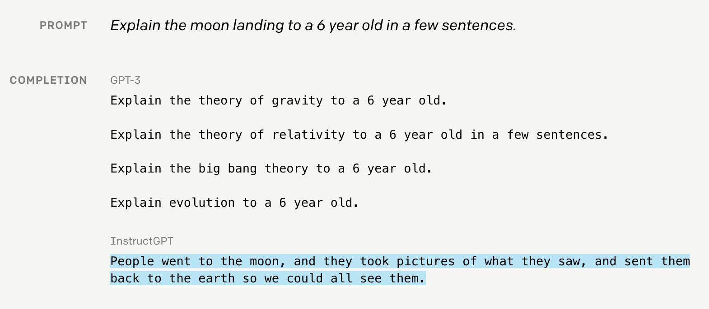{ loading=lazy }
      <figcaption markdown="1"><b>Figure 6.22 :</b> Exemple de paramétrage des instructions.</figcaption>
    </figure>

L'alignement dans l'IA désigne le processus qui vise à garantir que les actions et les décisions de l'intelligence artificielle sont en adéquation avec les valeurs et l'éthique humaines. Il consiste à harmoniser les objectifs et les comportements de l'IA avec ce qui est bénéfique ou acceptable pour les êtres humains. Le paramétrage des instructions représente une approche très superficielle de l'"alignement externe". Cependant, il n'est pas acquis que cette technique contribue à résoudre les enjeux d'alignement interne, lesquels constituent la préoccupation centrale des chercheurs spécialisés en sécurité de l'IA.

Pour résumer, le simple fait qu'un modèle ait suivi un processus de paramétrage aux instructions comme le RLHF ne signifie pas nécessairement que le modèle est aligné. Le terme « modèle aligné » est souvent utilisé, mais il est recommandé d'adopter la terminologie plus précise « modèle paramétré aux instructions » plutôt que « modèle aligné », afin d'éviter toute confusion et de représenter plus précisément le processus d'entraînement spécifique qu'a subi le modèle.

<figure markdown="span">
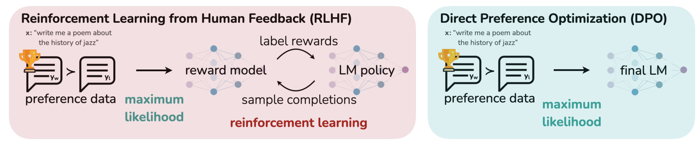{ loading=lazy }
  <figcaption markdown="1"><b>Figure 6.23 :</b> ([Rafailov et al., 2023](https://arxiv.org/abs/2305.18290))</figcaption>
</figure>

**Optimisation Directe des Préférences (DPO)** : L'apprentissage par renforcement à partir de retours humains (RLHF) a démontré son efficacité, comme en témoignent ChatGPT et Llama 2. Cependant, c'est un processus complexe et délicat, qui présente également des propriétés d'alignement problématiques. Là où le RLHF requiert une procédure en trois étapes, le DPO simplifie cette approche en deux étapes. 

L'article intitulé "Optimisation Directe des Préférences : Votre Modèle de Langage est Secrètement un Modèle de Récompense" présente un algorithme innovant. Celui-ci permet d'aligner les modèles de langage avec les préférences humaines, et ce, sans nécessiter de modélisation de récompense explicite ni d'apprentissage par renforcement. Le DPO se distingue par son objectif de classification simple, contournant ainsi le besoin d'un modèle de récompense intermédiaire.

RLHF, la méthode qu'il propose de remplacer, implique traditionnellement trois étapes :

- **Ajustement fin supervisé** : Au départ, le modèle est entraîné sur un jeu de données contenant des invites et les réponses correspondant aux résultats souhaités.

- **Modélisation de la récompense** : Des évaluateurs humains examinent les sorties du modèle, et ces retours alimentent un modèle de récompense, qui est entraîné à distinguer les types de sorties préférés.

- **Optimisation de politique proximale (PPO)** : Le modèle génère des sorties, qui sont évaluées par le modèle de récompense, et l'algorithme PPO ajuste la politique du modèle en fonction de ces évaluations.

Le DPO conserve l'étape initiale d'ajustement fin supervisé, mais remplace les deux étapes ultérieures par un ajustement fin unique sur des données de préférence, au moyen d'une fonction de perte innovante. Il permet d'augmenter efficacement la vraisemblance des actions préférées tout en diminuant celle des actions non désirées, grâce à une fonction de perte unique :

<figure markdown="span">
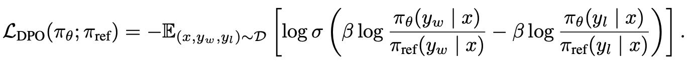{ loading=lazy }
  <figcaption markdown="1"><b>Figure 6.24 :</b> Le DPO augmente la probabilité de l'action préférée $y_w$ tout en diminuant la probabilité de l'action non préférée $y_l$.</figcaption>
</figure>

1. Création d'un jeu de données de préférences : Nous commençons par échantillonner une paire de continuations en posant une question, l'IA propose deux continuations, nous étiquettons l'une comme bonne et l'autre comme mauvaise

2. Collecte des logits (valeurs de sortie non normalisées) : Nous exécutons le modèle de base et le nouveau modèle sur les deux continuations pour obtenir leurs logits respectifs

3. Optimisation : Nous effectuons une rétropropagation à travers le nouveau modèle et optimisons la fonction de perte ci-dessus.

En éliminant l'étape de création d'un modèle de récompense, le DPO simplifie considérablement le processus d'ajustement fin et a démontré des performances très satisfaisantes.

Ce processus peut ensuite être itéré : on crée un nouveau jeu de données de préférences — on pose une question, on échantillonne deux fois la nouvelle IA, puis on étiquette le texte préféré — et on applique la fonction de perte DPO. Ce cycle est ensuite répété pour améliorer progressivement le modèle.

Un aspect important du DPO (Direct Preference Optimization) est que la récompense est implicite : il s'aligne sur les préférences sans nécessiter la construction d'un modèle de récompense distinct. Cette approche répond au défi de spécifier une fonction d'utilité et rejoint les critiques formulées par Alex Turner, qui affirme que l'évaluation robuste (c'est-à-dire la modélisation robuste de la récompense) constitue une tâche inutilement complexe et contre-intuitive, potentiellement plus ardue que le problème d'alignement de l'IA lui-même. La critique de Turner, développée dans "Inner and Outer Alignment Decompose One Hard Problem Into Two Extremely Hard Problems", suggère qu'établir un objectif numérique sûr et robuste qu'un agent hautement intelligent pourrait optimiser directement représente un défi considérable — un défi que le DPO pourrait précisément permettre de contourner.

**Élargissement des perspectives de l'article : Différentes pistes d'adaptation** Cet article offre des perspectives qui pourraient être enrichies par diverses adaptations. Par exemple, l'intégration de son approche avec les perspectives de l'article de Tomasz Korbak et al., "Pretraining Language Models with Human Preferences", ([Korbak et al., 2023](https://arxiv.org/abs/2302.08582)) pourrait renforcer sa robustesse. De plus, l'utilisation de données de préférences booléennes présente certaines limites. Fournir des retours en langage naturel, une méthode plus performante comme le montre l'étude "Training Language Models with Language Feedback", ([Scheurer et al., 2022](https://arxiv.org/abs/2204.14146)) pourrait améliorer significativement l'efficacité du processus. Il est remarquable que, avec seulement 100 échantillons de retours écrits par des humains, cette approche ait permis d'ajuster finement un modèle GPT-3 pour atteindre des capacités de résumé quasiment au niveau humain.

En se projetant dans l'avenir, un processus spéculatif susceptible d'atténuer le détournement des spécifications consisterait à former le modèle à la manière d'un enfant, qui interrogerait activement son environnement et apprendrait par les interactions humaines. Cette approche reproduirait de près le développement de l'enfant, au cours duquel l'individu devient progressivement plus aligné et plus compétent. Comme dans le développement de l'enfance, il serait crucial de veiller à ce que, à aucun moment, les capacités de l'IA ne surpassent son niveau d'alignement, en maintenant un équilibre délicat entre aptitude et compréhension éthique tout au long de son parcours développemental.