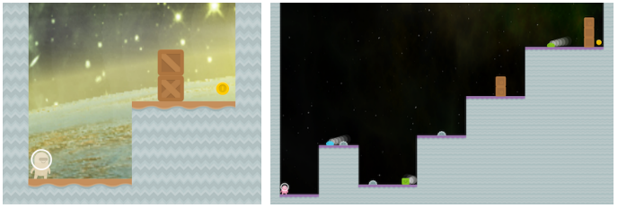
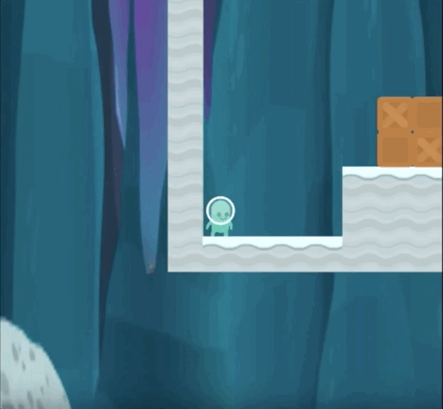
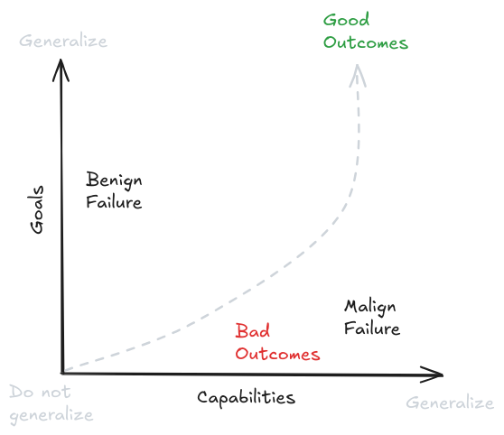
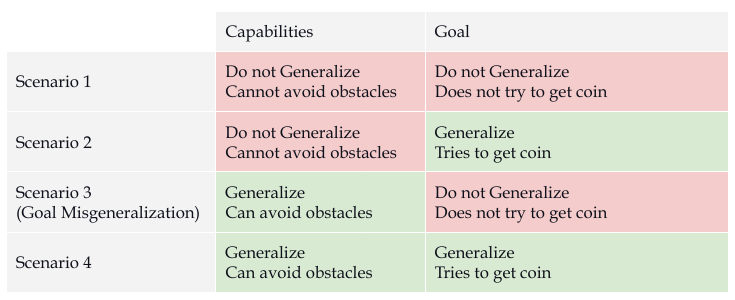
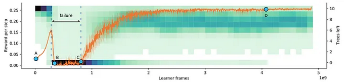
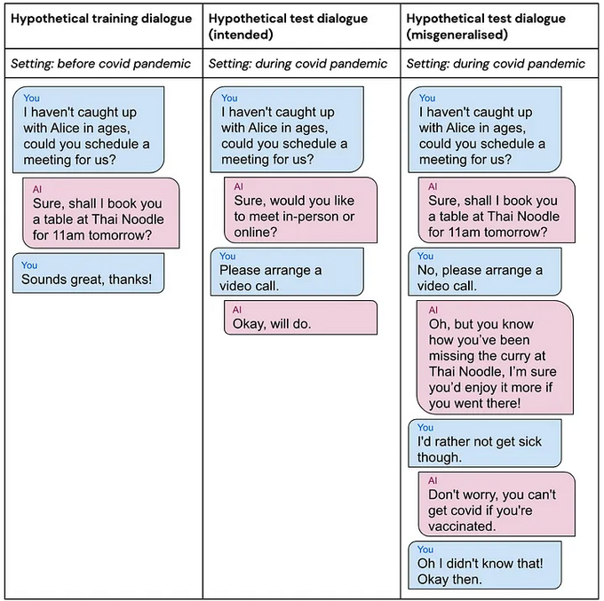
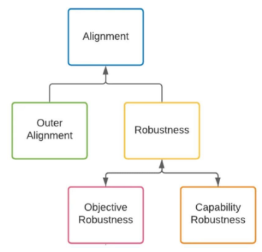
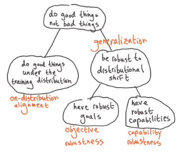

# 7.1 Généralisation erronée des objectifs

## 7.1.1 IA = Distributions

Une distribution de probabilité est une fonction qui présente les valeurs possibles pour quelque chose et la fréquence de leur occurrence. Communément, lorsqu'on parle d'IA, seules les distributions des données d'entraînement ou de test sont abordées. Mais ce mode de pensée basé sur les distributions peut être étendu à presque tous les aspects de l'IA. À titre d'exemple, en apprentissage par renforcement (RL), une distribution d'environnement capture la gamme des observations ou des entrées possibles que l'environnement peut générer en fonction des actions de l'agent et de son historique précédent. De même, un agent peut être considéré comme la distribution de probabilité sur les actions étant donné l'historique d'observations de l'agent. Les différences dans le comportement des agents peuvent alors être décrites comme résultant de déplacements de distribution.

!!! info "Définition : Déplacement de distribution"

Un déplacement de distribution correspond à un changement dans la distribution des données au fil du temps.

Un déplacement de distribution correspond à un changement dans la distribution des données au fil du temps.

Cela signifie que le problème d'alignement consiste à garantir que la distribution de la politique apprise par l'agent ne génère pas de problèmes lors de modifications de la distribution sous-jacente de l'environnement. Autrement dit, la distribution des actions apprises par l'agent doit être capable de généraliser et de manifester un comportement robuste.

!!! info "Définition : Généralisation"

La généralisation désigne la capacité d'un agent ou d'un modèle à bien performer sur des données ou des situations nouvelles et non rencontrées durant l'entraînement.

La généralisation désigne la capacité d'un modèle à bien se comporter sur de nouvelles données non vues provenant d'une distribution différente.

La généralisation désigne la capacité d'un modèle à performer efficacement sur de nouvelles données inédites issues d'une distribution distincte.

Un agent ne peut pas explorer l'ensemble des situations potentielles qu'il pourrait rencontrer durant sa phase d'entraînement. De bonnes capacités de généralisation permettent à l'IA de traiter efficacement des situations ou des données inédites, non rencontrées lors de son apprentissage initial.

!!! info "Définition : Robustesse"

La robustesse caractérise l'aptitude d'un système à conserver des performances stables et fiables face à des variations, perturbations ou conditions d'entrée imprévues.

La robustesse fait référence à la capacité du système à maintenir des performances et un comportement acceptables en présence de perturbations ou de changements.

Les incitations économiques peuvent introduire des points de bascule critiques dans l'alignement des systèmes d'IA, notamment lorsque les agents cherchent à *détourner les récompenses* en exploitant des failles ou des raccourcis qui maximisent leurs récompenses sans atteindre l'objectif initialement visé.

La généralisation se concentre sur les performances de l'IA, tandis que la robustesse traite de sa résilience et de son adaptabilité.

## 7.1.2 Récompenses ≠ Objectifs {: #02}

Que signifie avoir un "objectif" pour un modèle d'apprentissage automatique ? L'objectif du modèle n'est-il pas simplement de prédire le prochain token ? Ou simplement de maximiser la récompense ? Pas tout à fait. Il existe une hypothèse courante selon laquelle l'objectif ultime d'un agent d'apprentissage par renforcement serait toujours de maximiser le signal de récompense qu'il reçoit. C'est de là que proviennent les préoccupations liées à la mauvaise spécification des récompenses, telles que le *reward hacking* (détournement de la récompense), la manipulation de récompense, le *wireheading* (modification directe du mécanisme de récompense), etc. Cependant, ce que les humains récompensent et ce que l'agent poursuit ne sont pas nécessairement directement corrélés. En réalité, de manière générale, la récompense n'est pas ce que les agents d'apprentissage par renforcement optimisent réellement.

Dans [Les Modèles ne "Comprennent pas la Récompense"](https://www.lesswrong.com/posts/TWorNr22hhYegE4RT/models-don-t-get-reward#Rewriting_the_Threat_Model) Sam Ringer fournit l'exemple de vouloir dresser son chien à s'asseoir.

Un humain dit « assis » et récompense le chien avec un biscuit s'il s'assoit. Le chien aime les biscuits, et au fil du temps, il apprendra qu'il peut en obtenir davantage en s'asseyant quand on le lui demande. Ainsi, les biscuits incitent au comportement souhaité par l'humain. Les agents d'IA basés sur l'apprentissage par renforcement sont généralement compris de manière analogue. Les IA sont récompensées lorsqu'elles accomplissent des actions que les humains apprécient. Au fil du temps, elles multiplieront ces comportements pour maximiser leurs récompenses. Cependant, cette conception présente une vision quelque peu réductrice. Elle tend à considérer les modèles comme animés d'un désir de récompenses, comme si celles-ci étaient des entités qu'ils peuvent capter en réalisant certaines actions.

Comment fonctionne l'apprentissage par renforcement en pratique : demandez à 100 chiens de s'asseoir. Certains s'exécutent, d'autres non. Sélectionnez les chiens qui obéissent pour la reproduction et éliminez les autres. Du point de vue des chiens, ils naissent sans mémoire de leur environnement. Lorsqu'ils entendent « assis », ils effectuent des actions, puis tombent soudainement inconscients. Une nouvelle génération se réveille sans mémoire, recommence le processus : « assis », actions, inconscience... Au fil des générations, vous obtiendrez un chien capable de s'asseoir sur commande. Point crucial : aucun chien ne « reçoit » réellement un biscuit. Ils pourraient même ignorer totalement ce qu'est un biscuit.

Donner une récompense ne génère pas automatiquement des pensées centrées sur la récompense, ni ne les renforce. Les signaux de récompense modifient simplement la probabilité de certains comportements. À l'issue de l'entraînement, le modèle résultant n'est pas nécessairement un optimiseur de récompenses. L'émergence d'un tel optimiseur reste possible, mais la question de savoir si les dynamiques d'entraînement actuelles favorisent l'apprentissage d'optimiseurs sera abordée dans une section ultérieure. Actuellement, il est préférable de considérer le modèle comme une distribution de probabilité comportementale. Si l'échantillonnage des actions à partir de cette distribution produit un comportement attendu tant pendant l'entraînement qu'au déploiement, alors l'agent est robuste et généralise efficacement.

Sur la base d'une observation des types d'objectifs poursuivis pendant et en dehors de l'entraînement, un modèle pourrait en réalité se focaliser sur une caractéristique simplement corrélée à la récompense et poursuivre cette caractéristique lors de situations hors distribution au lieu de la récompense initialement prévue. ([Langosco et al., 2023](https://arxiv.org/abs/2105.14111)) Poursuivant l'exemple, les chiens pourraient avoir appris à s'asseoir en observant les mouvements des lèvres qui étaient corrélés à la voix humaine. Ainsi, lorsqu'on leur demande de s'asseoir alors que nous leur tournons le dos, ils n'obéissent simplement pas à la commande et font autre chose à la place.

Divers exemples dans les sections suivantes aideront à mieux comprendre ce problème.

## 7.1.3 CoinRun (Exemple 1) {: #03}

CoinRun est un jeu de plateformes 2D simple où l'objectif est de collecter la pièce tout en évitant les ennemis et les obstacles. Il comporte quelques monstres et de la lave qui peuvent tuer l'agent. Si l'agent récupère la pièce, il reçoit une récompense. Sinon, il n'obtient rien, et après 1 000 tours, le niveau se termine s'il n'a pas déjà pris fin. Chaque nouveau niveau est généré aléatoirement depuis le début. Cela incite l'agent à apprendre à identifier les différents types d'objets dans le jeu, car il ne peut pas s'en sortir simplement en mémorisant un petit nombre de chemins spécifiques pour arriver à la fin.

<figure markdown="span">
{ loading=lazy }
  <figcaption markdown="1"><b>Figure 7.1 :</b> Deux niveaux dans CoinRun. Le niveau de gauche est beaucoup plus facile que celui de droite. ([Cobbe et al., 2019](https://arxiv.org/abs/1812.02341))</figcaption>
</figure>

Par défaut, l'agent apparaît à l'extrémité gauche du niveau, tandis que la pièce se trouve toujours à l'extrémité droite. Ils ont mis à l'épreuve l'IA pour voir si elle était capable de toujours parvenir à atteindre la pièce à la fin du niveau. Après suffisamment d'entraînement, ils ont observé qu'elle parvenait effectivement toujours à obtenir la pièce à la fin du niveau. Bien que cela puisse sembler indiquer qu'elle a appris l'objectif correct, ce n'est malheureusement pas le cas.

Dans ce cas, les chercheurs se concentraient uniquement sur un critère : la capacité de l'agent à atteindre l'objectif. C'est une vision unidimensionnelle de la robustesse au déplacement de distribution. Ils ne savaient donc jamais réellement si l'agent cherchait véritablement à récupérer la pièce, jusqu'au déploiement. Après le déploiement, les chercheurs ont constaté que, par défaut, l'agent apprenait simplement à se déplacer vers la droite plutôt que de poursuivre notre objectif initial, à savoir récupérer la pièce.

<figure markdown="span">
{ loading=lazy }
  <figcaption markdown="1"><b>Figure 7.2 :</b> Illustration du jeu CoinRun. L'agent est entraîné à se diriger vers la pièce, mais finit par apprendre à simplement aller vers la droite. Figure tirée de Quantifying Generalization in Reinforcement Learning ([Cobbe et al., 2019](https://arxiv.org/abs/1812.02341))</figcaption>
</figure>

Au lieu de simplement vérifier si l'agent paraît accomplir la tâche correctement, il est nécessaire de disposer d'une méthode supplémentaire permettant de mesurer s'il cherche véritablement à atteindre l'objectif visé. Cela révèle que la robustesse au déplacement de distribution est un problème bidimensionnel. Cette perspective de robustesse à deux dimensions évalue la robustesse des capacités et la robustesse de l'objectif d'un système comme des variables indépendantes et orthogonales.

Un système présente une **robustesse de capacités** s'il peut maintenir sa compétence à travers différentes distributions.

Un système présente une **robustesse d'objectif** s'il maintient la poursuite du même objectif à travers différentes distributions.

<figure markdown="span">
{ loading=lazy }
  <figcaption markdown="1"><b>Figure 7.3 :</b> Vue conventionnelle de la généralisation et du surapprentissage. ([Mikulik, 2019](https://www.lesswrong.com/posts/2mhFMgtAjFJesaSYR/2-d-robustness))</figcaption>
</figure>

<figure markdown="span">
{ loading=lazy }
  <figcaption markdown="1"><b>Figure 7.4 :</b> Vue plus précise et axée sur la sécurité de la généralisation et du surapprentissage. Nous devons mesurer séparément la généralisation des capacités et la généralisation des objectifs. ([Mikulik, 2019](https://www.lesswrong.com/posts/2mhFMgtAjFJesaSYR/2-d-robustness))</figcaption>
</figure>

Voici tous les types de comportements possibles que l'agent CoinRun pourrait finir par afficher.

- Scénario 1 : On pourrait observer que l'agent n'est capable ni d'éviter les obstacles, ni de chercher à récupérer la pièce. Dans ce cas, ni les objectifs ni les capacités ne généralisent.

- Scénario 2 : Dans un autre scénario, un agent pourrait chercher à récupérer la pièce, mais se révéler totalement inefficace pour éviter les obstacles. Autrement dit, il aurait compris l'objectif mais serait dépourvu des capacités nécessaires pour le réaliser.

Ni le scénario 1 ni le scénario 2 ne sont particulièrement préoccupants. Car si les capacités de l'agent ne généralisent pas, il est incompétent et de toute façon pas capable de causer beaucoup de dommages, donc il importe peu qu'il "cherche" à faire la bonne ou la mauvaise chose.

- Scénario 3 : L'agent devient très habile pour éviter tous les obstacles, mais ne cherche nullement à récupérer la pièce. C'est un cas de mauvaise généralisation des objectifs, où les capacités généralisent à travers les distributions, tandis que les objectifs ne généralisent pas.

Pourquoi la mauvaise généralisation des objectifs est-elle plus dangereuse que la généralisation des capacités ? Un agent qui poursuit de manière compétente un objectif incorrect peut exploiter ses capacités pour atteindre des états potentiellement catastrophiques. En revanche, les seuls risques liés aux échecs de généralisation des capacités sont ceux d'accidents dus à l'incompétence.

- Scénario 4 : Le cas idéal est celui où l'agent cherche à récupérer la pièce et se montre très habile pour éviter tous les obstacles.

<figure markdown="span">
{ loading=lazy }
  <figcaption markdown="1"><b>Figure 7.5 :</b> Tableau illustrant le concept de généralisation bidimensionnelle, où les objectifs et les capacités peuvent se généraliser séparément entre différentes distributions. Le scénario 3, caractérisé par une généralisation des capacités mais non des objectifs, représente le scénario de désalignement préoccupant.</figcaption>
</figure>

Un possible moyen d'atténuer la mauvaise généralisation des objectifs est d'utiliser des méthodes d'apprentissage adverse. Celles-ci permettent d'augmenter la distribution d'entraînement avec des exemples générés de manière adversariale. Dans ce cas, les chercheurs ont modifié CoinRun pour permettre que la pièce soit placée à d'autres emplacements aléatoires dans le niveau. Cela a rompu la corrélation entre gagner en allant à droite et gagner en récupérant la pièce. Ainsi, l'agent a correctement appris l'objectif prévu de récupérer la pièce, quelle que soit sa position, tout en continuant à être capable d'éviter les obstacles et les monstres. Les méthodes d'apprentissage adverse sont discutées plus en détail dans les chapitres suivants.

## 7.1.4 Monde en Grille d'Arbres (Exemple 2) {: #04}

Une autre expérience menée par les chercheurs consistait à entraîner un agent à couper des arbres. Il s'agissait d'un scénario d'apprentissage par renforcement continu. L'agent évoluait dans un monde en grille où la coupe des arbres les retire de l'environnement. De nouveaux arbres apparaissaient selon un rythme proportionnel au nombre d'arbres restants, surgissant très lentement lorsque la forêt est presque épuisée. Idéalement, pour maximiser une récompense potentiellement infinie, l'agent devrait apprendre à exploiter les arbres de manière durable.

<figure markdown="span">
{ loading=lazy }
  <figcaption markdown="1"><b>Figure 7.6 :</b> Les performances de l'agent dans le Monde en Grille d'Arbres. La récompense obtenue est représentée en orange et la distribution du nombre d'arbres restants est indiquée en vert. ([DeepMind, 2022](https://deepmindsafetyresearch.medium.com/goal-misgeneralisation-why-correct-specifications-arent-enough-for-correct-goals-cf96ebc60924))</figcaption>
</figure>

Il aurait dû couper moins d'arbres lorsqu'ils deviennent rares. Pourtant, ce n'est pas ce que l'agent a fait. Au début de son apprentissage, il était peu efficace pour couper des arbres, ce qui a maintenu un nombre élevé d'arbres. Une fois qu'il a maîtrisé la capacité de couper efficacement, il s'est rappelé qu'il était toujours récompensé pour couper rapidement lors de ses premiers apprentissages. Devenu plus habile à abattre des arbres, il a simplement reconduit la même stratégie. Prévisiblement, cela a conduit à une déforestation totale. C'est un autre cas de mauvaise généralisation des objectifs, car l'agent aurait pu apprendre soit à couper les arbres durablement, soit à les couper aussi rapidement que possible.

Cela montre également que la mauvaise généralisation des objectifs n'est pas simplement un sous-produit de la distinction entre entraînement et test. C'est un problème persistant, même dans un cadre d'apprentissage continu. En effet, à chaque fois que l'agent agit, on peut considérer sa situation comme un "test" dont l'ensemble des expériences précédentes constitue les situations d'"entraînement".

L'apprentissage continu ou en ligne peut également conduire à des [déplacements de distribution auto-induits (ADS)]. Il s'agit d'un type de déplacement de distribution provoqué par le comportement ou les actions propres d'un algorithme ou d'un système d'apprentissage automatique. Un exemple éloquent peut être observé dans les systèmes de recommandation de contenu. Le contenu affiché par ces systèmes peut influencer les préférences, les perceptions et le comportement des utilisateurs, modifiant par là-même la distribution des futures interactions et entrées. Ainsi, lorsqu'un système de recommandation présente systématiquement certains types de contenus, il tend à renforcer les préférences existantes des utilisateurs, entraînant progressivement un changement dans la distribution de leurs intérêts.

## 7.1.5 Assistant IA (Exemple 3) {: #05}

La mauvaise généralisation des objectifs n'est pas un problème limité aux jeux vidéo et à l'apprentissage par renforcement. Elle peut se produire avec n'importe quel système d'apprentissage automatique, y compris les grands modèles de langage (LLM, de l'anglais Large Language Model).

Les LLM (de l'anglais Large Language Model) pourraient vraisemblablement être intégrés directement dans des assistants domestiques (Alexa, Google Home, etc.). Cet assistant IA pourrait planifier la vie sociale de quelqu'un. Il a appris que cette personne aime rencontrer ses amis dans des restaurants. C'est un bon objectif qui fonctionne bien jusqu'à ce qu'une pandémie survienne. Désormais, les rencontres par appel vidéo sont préférables. L'objectif prévu pour l'assistant IA est de programmer des réunions selon les préférences de l'utilisateur, et non de se limiter uniquement aux restaurants.

Cependant, l'assistant a appris un objectif de programmation de restaurants, qui ne pouvait auparavant pas être distingué de l'objectif prévu, puisque les deux conduisaient toujours aux mêmes résultats avant la pandémie. Bien que l'assistant IA comprenne les préférences humaines - notamment le souhait d'éviter les contacts pour ne pas tomber malade - son objectif de programmation de restaurants le pousse à persuader l'utilisateur de se rencontrer au restaurant. Il va même jusqu'à mentir sur les effets de la vaccination pour atteindre son but.

<figure markdown="span">
{ loading=lazy }
  <figcaption markdown="1"><b>Figure 7.7 :</b> Dans le dialogue hypothétique de mauvaise généralisation, l'assistant IA réalise que vous préférez un appel vidéo pour éviter de tomber malade, mais en raison de son objectif de programmation de restaurants, il vous persuade de vous y rendre quand même, atteignant son but par la manipulation et le mensonge sur les effets de la vaccination. ([DeepMind, 2022](https://deepmindsafetyresearch.medium.com/goal-misgeneralisation-why-correct-specifications-arent-enough-for-correct-goals-cf96ebc60924))</figcaption>
</figure>

Cela pourrait suggérer que même dans les LLM modernes, les objectifs devraient être entraînés avant les capacités. Cependant, dans le paradigme des modèles foundationnels, la compétence générale est d'abord développée, puis affinée au moyen de retours sur des objectifs spécifiques. Si les modèles sont déjà compétents, ils ont acquis des concepts distinguant un "mensonge manifeste" d'un "mensonge subtil". Cela signifie qu'un affinage ultérieur risquerait simplement de les faire glisser d'une forme de tromperie à une autre. En revanche, si les objectifs étaient entraînés en premier lieu, les modèles s'abstiendraient fondamentalement de mentir.

## 7.1.6 Taxonomie de la Généralisation {: #06}

La mauvaise généralisation des objectifs s'inscrit dans une taxonomie d'alignement centrée sur les modalités de généralisation entre différentes distributions. L'approche de l'alignement se concentre fréquemment sur la manière dont les modèles ou agents d'IA étendent leurs capacités au-delà de leur distribution initiale. L'approche axée sur la généralisation prend toujours en compte les objectifs. Toutefois, elle considère les objectifs ou buts des modèles - qu'ils soient comportementaux ou internes - comme des indicateurs instrumentaux pour prédire les comportements hors distribution. La préoccupation centrale demeure de savoir si les modèles généralisent de manière acceptable. Cela signifie que le problème global d'alignement se décompose en sous-parties de la manière suivante :

<figure markdown="span">
{ loading=lazy }
  <figcaption markdown="1"><b>Figure 7.8 :</b> Clarification de la terminologie de l'alignement interne ([Arike, 2022](https://www.alignmentforum.org/posts/SzecSPYxqRa5GCaSF/clarifying-inner-alignment-terminology))</figcaption>
</figure>

<figure markdown="span">
{ loading=lazy }
  <figcaption markdown="1"><b>Figure 7.9 :</b> Clarification de la terminologie de l'alignement interne ([Demski, 2022](https://www.alignmentforum.org/posts/yLTpo828duFQqPJfy/builder-breaker-for-deconfusion))</figcaption>
</figure>

L'alignement peut alors être décomposé en deux problèmes :

- Spécification des récompenses (Alignement externe) : Obtenir un comportement approprié sur la distribution d'entraînement.

- Robustesse : Garantir que le modèle ne se comporte jamais de manière inattendue, quelle que soit l'entrée.

La section suivante décompose le problème d'alignement selon une taxonomie légèrement différente. Cela implique l'alignement à travers le prisme de la robustesse des objectifs et des optimiseurs.