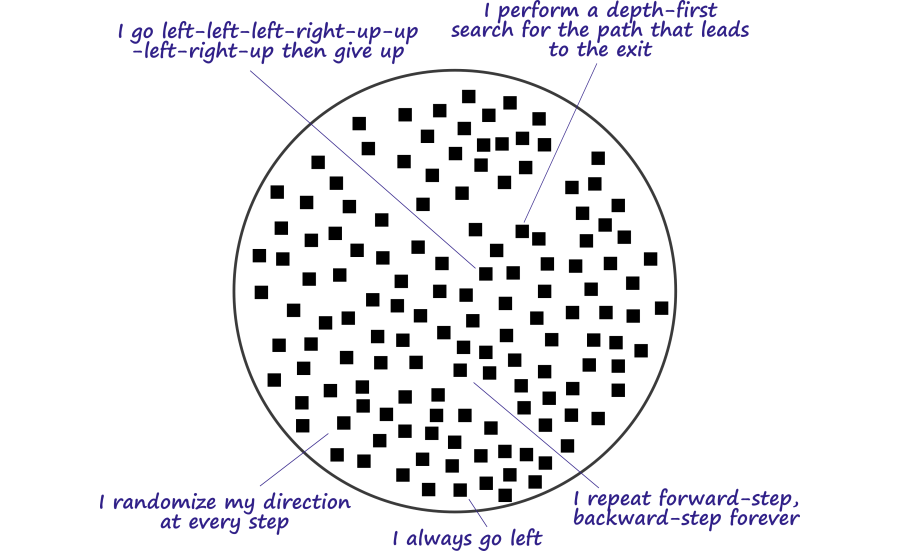
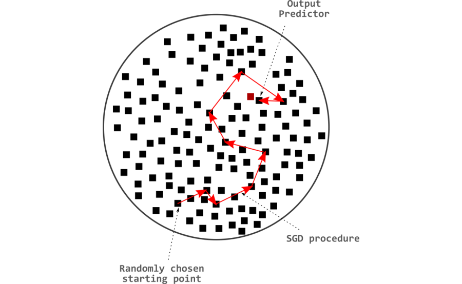
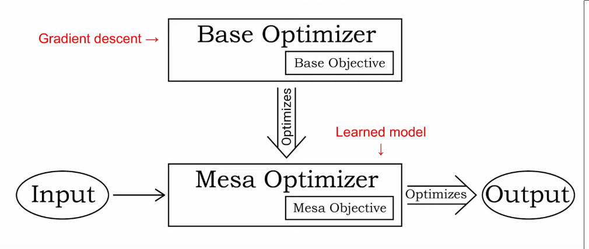
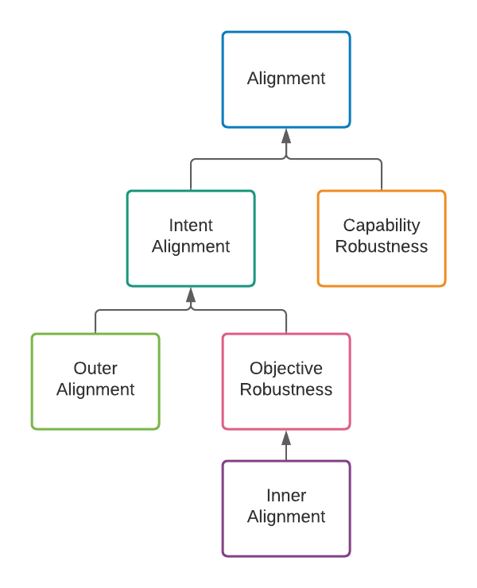
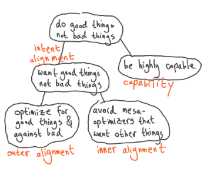

# 7.2 Alignement Interne

!!! warning "Cette section est encore en cours de rédaction et est considérée comme un travail en cours."

## 7.2.1 Optimisation = Recherche {: #01}

La programmation traditionnelle requiert le codage explicite d'un ensemble d'instructions pour résoudre un problème spécifique. Les programmeurs progressent étape par étape en découvrant et implémentant les algorithmes nécessaires. Cependant, il arrive souvent que l'élaboration manuelle d'une solution soit trop complexe. Dans ce cas, l'approche se tourne vers une méthode basée sur l'apprentissage. Cette approche consiste à découvrir automatiquement de nouveaux algorithmes, plutôt que de s'appuyer sur une logique prédéfinie.

En apprentissage automatique, le terme 'apprentissage' désigne un système ou un algorithme qui affine continuellement un algorithme. Cela signifie que l'apprentissage automatique peut être décomposé en trois parties individuelles :

- **Algorithme appris** : Représenté par les paramètres du réseau neuronal. Une combinaison des nombres à virgule flottante dans ces paramètres encode un processus algorithmique qui fait correspondre les entrées aux sorties souhaitées.

- **Objectif** : Il s'agit soit d'un morceau de code, soit d'une formulation mathématique, qui traduit précisément ce que les programmeurs souhaitent que l'algorithme appris accomplisse. Ce pourrait être, par exemple, une fonction de récompense pour un système d'apprentissage par renforcement, ou une fonction de perte dans un système d'apprentissage profond. Ces fonctions prennent en entrée les réponses ou actions de notre modèle d'apprentissage automatique, et produisent une mesure de leur qualité, qui sert de feedback pendant l'entraînement.

- **Processus d'optimisation itératif** : L'algorithme appris est initialement constitué de valeurs numériques aléatoires. Par conséquent, il réalise initialement des actions de manière aléatoire. Progressivement, par un processus d'optimisation itératif, l'algorithme converge vers des actions spécifiques permettant d'optimiser le score relativement à l'objectif visé. Ce processus repose généralement sur un algorithme d'optimisation tel que la descente de gradient stochastique (SGD, de l'anglais *Stochastic Gradient Descent*). Cet algorithme ajuste systématiquement les paramètres du modèle d'apprentissage en fonction de ses performances. À titre d'exemple, la descente de gradient permet de moduler les connexions neuronales afin d'améliorer les scores selon la fonction de perte.

!!! info "Définition : Optimiseur"

Un optimiseur est un système qui explore de manière interne un espace de sorties possibles, de politiques, de plans, de stratégies, etc., à la recherche de ceux qui performent bien selon une fonction objectif représentée en interne. ([Hubinger et al., 2019](https://intelligence.org/learned-optimization/))

[Empty translation awaiting input]

Les algorithmes d'optimisation comme la descente de gradient peuvent être assimilés à des algorithmes de recherche. Chaque ensemble de paramètres composant les réseaux neuronaux encode un algorithme spécifique. Ainsi, l'espace de recherche représente l'ensemble des algorithmes pouvant être encodés par les paramètres libres disponibles dans le réseau neuronal.

La taille de l'espace de recherche correspond au nombre de paramètres libres dans un réseau neuronal. Cela se rapporte directement à la quantité d'algorithmes pouvant théoriquement être découverts dans cet espace. Un nombre plus élevé de paramètres libres implique un algorithme interne potentiellement plus complexe. On parle alors de "*[algorithmic range]*" du réseau.

!!! info "Définition : Espace algorithmique"

La taille de l'espace de recherche correspond au nombre de paramètres libres dans un réseau neuronal. Cela se rapporte directement à la quantité d'algorithmes pouvant théoriquement être découverts dans cet espace. Un nombre plus élevé de paramètres libres implique un algorithme interne potentiellement plus complexe. On parle alors de "*[algorithmic range]*" du réseau.

L'espace algorithmique d'un système d'apprentissage automatique fait référence à l'étendue de l'ensemble des algorithmes susceptibles d'être découverts par l'optimiseur de base. ([Hubinger et al., 2019](https://intelligence.org/learned-optimization/))

Les algorithmes d'optimisation comme la descente de gradient peuvent être assimilés à des algorithmes de recherche. Chaque ensemble de paramètres composant les réseaux neuronaux encode un algorithme spécifique. Ainsi, l'espace de recherche représente l'ensemble des algorithmes pouvant être encodés par les paramètres libres disponibles dans le réseau neuronal.

La taille de l'espace de recherche correspond au nombre de paramètres libres dans un réseau neuronal. Cela se rapporte directement à la quantité d'algorithmes pouvant théoriquement être découverts dans cet espace. Un nombre plus élevé de paramètres libres implique un algorithme interne potentiellement plus complexe. On parle alors de "*[algorithmic range]*" du réseau.

À titre d'exemple, dans le diagramme suivant, chaque point noir représente un ensemble complet de paramètres de réseau neuronal, qui collectivement représentent un algorithme. Un agent de résolution de labyrinthe dispose alors de l'espace de recherche d'algorithmes suivant :

<figure markdown="span">
{ loading=lazy }
  <figcaption markdown="1"><b>Figure 7.10 :</b> Alignement interne : Explication pour un enfant de 12 ans ([Harth, 2020](https://www.alignmentforum.org/posts/AHhCrJ2KpTjsCSwbt/inner-alignment-explain-like-i-m-12-edition))</figcaption>
</figure>

La descente de gradient stochastique (SGD, de l'anglais Stochastic Gradient Descent) explore cet espace selon la direction dictée par la descente la plus abrupte de la perte. Selon l'endroit où la descente de gradient commence dans cet espace de recherche, certains algorithmes peuvent être plus difficiles ou plus faciles à atteindre. On parle alors d'*[algorithmic reachability]*.

!!! info "Définition : Accessibilité algorithmique"

Insérer votre traduction finale ici

L'accessibilité d'un algorithme appris fait référence à la difficulté qu'éprouve l'optimiseur de base à trouver cet algorithme appris. ([Hubinger et al., 2019](https://intelligence.org/learned-optimization/))

L'*[algorithmic reachability]* d'un algorithme appris désigne la difficulté avec laquelle l'optimiseur de base peut identifier et atteindre cet algorithme spécifique au sein de l'espace de recherche.

La cible de recherche est un algorithme performant selon les critères d'évaluation. En apprentissage supervisé, par exemple, la recherche vise à identifier les paramètres optimaux qui minimisent l'écart entre les sorties prédites et les étiquettes réelles. Dans l'apprentissage par renforcement, l'objectif est de déterminer la politique optimale permettant de maximiser la récompense cumulative.

<figure markdown="span">
{ loading=lazy }
  <figcaption markdown="1"><b>Figure 7.11 :</b> Alignement interne : Explication pour un enfant de 12 ans ([Harth, 2020](https://www.alignmentforum.org/posts/AHhCrJ2KpTjsCSwbt/inner-alignment-explain-like-i-m-12-edition))</figcaption>
</figure>

## 7.2.2 Mésa-Optimiseurs {: #02}

<figure class="video-figure" markdown="span">
<iframe style="width: 100%; aspect-ratio: 16 / 9;" frameborder="0" allowfullscreen src="https://www.youtube.com/embed/bJLcIBixGj8"></iframe>
  <figcaption markdown="1"><b>Vidéo 7.1 :</b> Vidéo optionnelle expliquant l'alignement interne.</figcaption>
</figure>

Dans le cadre des Risques de l'optimisation apprise (RFLO, de l'anglais Risks from Learned Optimization), la descente de gradient est désignée comme un optimiseur de base.

!!! info "Définition : Optimiseur de base"

L'optimiseur de base est l'algorithme général d'apprentissage qui explore et recherche des solutions dans l'espace des paramètres du modèle, typiquement via des méthodes comme la descente de gradient, visant à minimiser une fonction de coût ou à maximiser une performance donnée.

Un optimiseur de base est un optimiseur qui explore des algorithmes selon un objectif spécifique. Un objectif propre à l'optimiseur de base définit sa stratégie de recherche. Les algorithmes qu'il examine sont appelés algorithmes appris. ([Hubinger et al., 2019](https://intelligence.org/learned-optimization/))

Un optimiseur de base explore des algorithmes selon un objectif spécifique. Son objectif propre guide sa recherche à travers différentes solutions. Les algorithmes ainsi examinés sont désignés comme des algorithmes appris.

Tout au long de la procédure de recherche (entraînement), le contrôle direct sur le type d'algorithme résultant reste minimal. Dès lors que l'ensemble de paramètres découverts obtient de bonnes performances sur l'objectif initialement spécifié, l'entraînement pourrait potentiellement aboutir à n'importe quelle classe d'algorithme. Par conséquent, un type d'algorithme potentiellement 'découvert' par la SGD lors de son parcours dans l'espace des algorithmes pourrait être un autre algorithme de recherche (optimisation). En substance, les algorithmes appris peuvent eux-mêmes servir d'optimiseurs. De telles entités sont appelées mésa-optimiseurs (ou optimiseurs internes ou appris). Ils recherchent leur propre objectif mésa. Ainsi, pendant l'entraînement, la SGD pourrait identifier un mésa-optimiseur — un modèle non seulement optimisé mais aussi capable de réaliser une optimisation de manière autonome.

!!! info "Définition : Mésa-Optimiseur"

Un mésa-optimiseur est un algorithme appris qui est lui-même un optimiseur. Un mésa-objectif est l'objectif d'un mésa-optimiseur. ([Hubinger et al., 2019](https://intelligence.org/learned-optimization/))

<figure markdown="span">
{ loading=lazy }
  <figcaption markdown="1"><b>Figure 7.12 :</b> ([Hubinger, 2023](https://www.youtube.com/watch?v=oY7c75ggrRI))</figcaption>
</figure>

Le terme "Méta" fait référence au niveau supérieur de quelque chose. Par exemple, la Méta-Apprentissage est l'apprentissage de la façon d'apprendre. De manière similaire, "Mesa" est un terme grec signifiant intérieur/à l'intérieur/dedans.

Prenons comme exemple l'évolution, un processus visant à transmettre les gènes les plus performants à travers les générations. C'est l'optimiseur de base. Il expérimente des mutations aléatoires, et si ces changements améliorent la survie ou la reproduction de l'organisme, ces modifications sont conservées et transmises. Considérons maintenant les humains. Produits de ce processus, leurs comportements et objectifs ne se limitent pas à la transmission de gènes. Ils deviennent ainsi des mésa-optimiseurs. Ils optimisent leurs propres objectifs, au-delà de ce que l'évolution avait 'prévu'.

Pourquoi la découverte d'un mésa-optimiseur suscite-t-elle plus d'inquiétude que tout autre type d'algorithme arbitraire ? Il existe deux raisons principales :

- Premièrement, l'optimisation peut conduire à des résultats potentiellement désastreux. Les échecs dus à la sur-optimisation, déjà explorés dans le chapitre précédent, peuvent engendrer des actions extrêmes qui s'écartent du comportement attendu et risquent de causer des dommages ou des conséquences indésirables. 

Contrairement à un algorithme conventionnel, simple ensemble d'heuristiques, les optimiseurs ont la capacité d'ajuster leur propre comportement ou environnement pour obtenir de meilleurs résultats. À l'instar de la SGD qui peut améliorer les performances de l'algorithme appris, ces systèmes peuvent apprendre de l'expérience (potentiellement même après l'entraînement) et optimiser continuellement leurs performances par rapport à leur mésa-objectif.

- Deuxièmement, il existe maintenant deux objectifs potentiellement divergents — la mesure de performance définie par l'humain pour la SGD (objectif de base), et la mesure de performance propre au mésa-optimiseur (mésa-objectif). Cela crée deux défis d'alignement distincts : faire converger l'objectif conçu dans l'esprit humain avec celui donné à la descente de gradient, puis harmoniser l'objectif de la descente de gradient avec celui assigné au mésa-optimiseur.

Faire converger les objectifs de ces deux processus d'optimisation distincts constitue ce qu'on nomme le problème d'alignement interne.

!!! info "Définition : Problème d'alignement interne"

«... [Nous définissons le] problème d'alignement des mésa-optimiseurs avec l'objectif de base comme le problème d'alignement interne.» ([Hubinger et al., 2019](https://intelligence.org/learned-optimization/))

Il existe quelques confusions courantes autour du concept de mésa-optimiseurs et de mésa-objectifs qui méritent des éclaircissements :

**Mésa-optimiseurs ≠ Sous-agents :** Le fait d'optimiser n'équivaut pas à posséder une capacité d'agentivité. De manière similaire, dans le contexte de l'apprentissage profond, un mésa-optimiseur est simplement un réseau de neurones qui implémente un processus d'optimisation, et non un sous-agent émergent à l'intérieur de ce réseau de neurones. Les mésa-optimiseurs constituent un type particulier d'algorithme que l'optimiseur de base pourrait développer pour résoudre sa tâche. Qui plus est, l'optimiseur de base sera généralement considéré comme un algorithme d'optimisation simple, et non comme un agent intelligent choisissant de créer un sous-agent. Un sous-agent est un agent qui fait partie d'un agent plus large ; un mésa-optimiseur est un optimiseur qui est lui-même optimisé par un autre optimiseur.

**Mésa-objectif ≠ Objectif comportemental** : De manière informelle, l'objectif comportemental est l'objectif qui "semble" être optimisé par le comportement du système. En contraste avec le mésa-objectif, qui est l'objectif réellement utilisé par le mésa-optimiseur dans son algorithme d'optimisation.

!!! info "Définition : Objectif comportemental"

L'objectif comportemental est ce qu'un optimiseur paraît optimiser. Formellement, l'objectif comportemental est l'objectif obtenu par une inférence parfaite par apprentissage par renforcement inverse. ([Hubinger et al., 2019](https://intelligence.org/learned-optimization/))

## 7.2.3 Taxonomie des Objectifs {: #03}

Au sein de la communauté de l'alignement, malheureusement, une multitude de définitions pour l'alignement interne circulent. Le terme 'alignement interne' a depuis été étendu au-delà de son contexte original étroit tel que défini précédemment, conduisant à une confusion généralisée. Cette situation a été reconnue par Evan Hubinger lui-même dans [réponse](https://www.lesswrong.com/posts/HYERofGZE6j9Tuigi/?commentId=Gp7fDFdN7sFCJAA2m) au billet de John Wentworth, ["Échecs d'Alignement Interne" Qui Sont en Réalité des Échecs d'Alignement Externe](https://www.lesswrong.com/posts/HYERofGZE6j9Tuigi/inner-alignment-failures-which-are-actually-outer-alignment).

La mauvaise généralisation s'appuie sur sa propre décomposition du problème d'alignement tel qu'introduit précédemment. Dans la taxonomie de la généralisation, la mauvaise généralisation met en lumière l'incapacité d'un système d'IA à généraliser correctement son objectif appris à de nouvelles distributions. Quant à l'alignement interne, relevant de la taxonomie basée sur les objectifs, il vise précisément à aligner l'objectif de base avec l'objectif appris au sein du système.

<figure markdown="span">
{ loading=lazy }
  <figcaption markdown="1"><b>Figure 7.13 :</b> Clarification de la terminologie de l'alignement interne ([Hubinger, 2020](https://www.alignmentforum.org/posts/SzecSPYxqRa5GCaSF/clarifying-inner-alignment-terminology))</figcaption>
</figure>

<figure markdown="span">
{ loading=lazy }
  <figcaption markdown="1"><b>Figure 7.14 :</b> Clarification de la terminologie de l'alignement interne ([Demski, 2022](https://www.alignmentforum.org/posts/yLTpo828duFQqPJfy/builder-breaker-for-deconfusion))</figcaption>
</figure>

L'accent dans l'approche axée sur les objectifs est mis sur l'assurance que les modèles d'IA ou les agents ont les objectifs ou buts corrects. La décomposition naturelle consiste alors à séparer l'alignement en deux problèmes :

- Comment spécifions-nous un objectif externe (de base) qui incite à un bon comportement dans toutes les situations que le modèle rencontrera ?

- Comment garantissons-nous que le mésa-objectif est égal à l'objectif de base ?