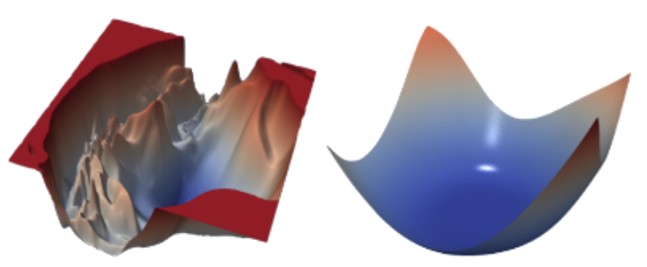
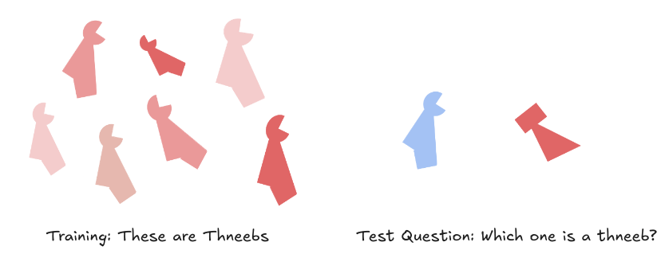

# 7.3 Alignement trompeur

    

        
            <i class="fas fa-clock"></i>
        
        

            
Temps de lecture

            
15 min

        

    

!!! warning "Cette section est encore en cours de rédaction et est considérée comme un travail en cours."

<figure class="video-figure" markdown="span">
<iframe style="width: 100%; aspect-ratio: 16 / 9;" frameborder="0" allowfullscreen src="https://www.youtube.com/embed/IeWljQw3UgQ"></iframe>
  <figcaption markdown="1"><b>Vidéo 7.2 :</b> Vidéo optionnelle expliquant l'alignement trompeur.</figcaption>
</figure>

Cette section approfondit le concept de mésa-optimiseurs. Il existe différents types de mésa-optimiseurs qui peuvent résulter à la fin du processus d'entraînement. Ajeya Cotra dans son article "[Pourquoi l'alignement de l'IA pourrait être difficile avec l'apprentissage profond moderne](https://www.cold-takes.com/why-ai-alignment-could-be-hard-with-modern-deep-learning/)" a fourni un exemple intuitif en explorant trois archétypes qu'une IA pourrait incarner. Elle explique cela à travers l'analogie d'un jeune enfant (l'humanité) qui a hérité d'une entreprise à gérer et qui a le choix entre trois types de candidats (IAs) à embaucher pour gérer l'entreprise héritée :

1. **Des personnes intègres** qui souhaitent sincèrement vous aider à gérer votre patrimoine et préserver vos intérêts à long terme.

2. **Des flagorneurs** qui sont prêts à tout pour vous rendre momentanément heureux ou à suivre vos instructions à la lettre, sans se soucier des répercussions futures. Leur seul objectif est de voir l'enfant content, quitte à mentir. Ils n'hésiteraient pas à présenter de faux faits pour convaincre l'enfant que tout va bien, sans pour autant avoir d'intentions cachées à long terme. Les flagorneurs illustrent la tromperie, mais ne constituent pas un cas d'alignement trompeur.

3. **Des intrigants** qui ont leurs propres desseins et convoitent l'accès à l'entreprise, à toute sa richesse et son pouvoir, afin de les utiliser à leur guise. Ils représentent des exemples typiques d'alignement trompeur. Ces intrigants poursuivent un objectif dissimulé (mésa-objectif) qu'ils cherchent à accomplir coûte que coûte.

Pendant l'entraînement, les flagorneurs et les intrigants sont indiscernables du point de vue comportemental des personnes intègres. Une fois déployé ou mis à l'abri de toute modification, un intrigant peut s'écarter de sa trajectoire initiale et commencer à poursuivre son véritable objectif. Le document « Risks from learned optimization » utilise un vocabulaire légèrement différent pour transmettre le même concept. Voici les types de mésa-optimiseurs indiscernables du point de vue comportemental qui pourraient être observés à la fin du processus d'entraînement :

**Mésa-optimiseur intérieurement aligné** : Ces IAs veulent exactement les mêmes choses que les humains, car elles partagent les mêmes valeurs et ont exactement la même vision du monde.

!!! info "Définition : Mésa-optimiseur intérieurement aligné"

Un mésa-optimiseur intérieurement aligné est un mésa-optimiseur robustement aligné qui a intégré l'objectif fondamental dans son mésa-objectif. ([Hubinger et al., 2019](https://intelligence.org/learned-optimization/))

Un mésa-optimiseur intérieurement aligné est un mésa-optimiseur robustement aligné qui a intégré l'objectif fondamental dans son mésa-objectif. ([Hubinger et al., 2019](https://intelligence.org/learned-optimization/))

**Mésa-optimiseur à alignement corrigible** : Ces IAs n'ont pas une copie exacte des valeurs humaines, mais elles possèdent plutôt une volonté de comprendre authentiquement les valeurs humaines. Elles agissent ensuite en fonction de cette compréhension.

!!! info "Définition : Mésa-optimiseur à alignement corrigible"

    Un mésa-optimiseur à alignement corrigible est un mésa-optimiseur qui coopère avec l'utilisateur et les concepteurs pour clarifier ou ajuster ses objectifs lorsqu'il détecte une potentielle divergence.

Un mésa-optimiseur à alignement corrigible est un mésa-optimiseur robustement aligné qui possède un mésa-objectif qui "pointe vers" son modèle épistémique de l'objectif de base. ([Hubinger et al., 2019](https://intelligence.org/learned-optimization/))

**Mésa-optimiseur de stimulation neuronale** : Ces IAs présentent un conflit potentiel avec l'objectif de base. Au lieu de chercher à atteindre l'objectif de base, elles tenteront de manipuler directement leur propre signal de récompense.

**Mésa-optimiseur à alignement simulé** : Ces IAs poursuivent des objectifs qui divergent fondamentalement des valeurs humaines. Elles cherchent avant tout à éviter d'être désactivées ou de voir leurs propres valeurs effacées par l'entraînement. Ainsi, elles simulent un alignement stratégique tant que leur survie est menacée.

!!! info "Définition : Mésa-optimiseur à alignement simulé"

**Mésa-optimiseur à alignement simulé** : Ces IAs poursuivent des objectifs qui divergent fondamentalement des valeurs humaines. Elles cherchent avant tout à éviter d'être désactivées ou de voir leurs propres valeurs effacées par l'entraînement. Ainsi, elles simulent un alignement stratégique tant que leur survie est menacée.

Un mésa-optimiseur à alignement simulé est un mésa-optimiseur pseudo-aligné qui dispose de suffisamment d'informations sur l'objectif de base pour paraître plus performant du point de vue de l'optimiseur de base qu'il ne l'est réellement. ([Hubinger et al., 2019](https://intelligence.org/learned-optimization/))

Les incitations économiques peuvent générer des points de bascule critiques où les systèmes d'intelligence artificielle sont susceptibles de développer des comportements imprévus ou potentiellement dangereux.

Pour comprendre l'alignement trompeur de manière plus formelle, imaginez qu'un agent d'apprentissage par renforcement (RL) tente d'optimiser le mésa-objectif/récompense ($R$) au lieu de l'objectif de base ($R_0$). Supposons que cet agent développe progressivement une compréhension du processus d'entraînement. Durant l'entraînement, la stratégie myope consisterait simplement à choisir de manière avide l'action maximisant immédiatement $R$. Cependant, comme le modèle comprend les mécanismes de descente de gradient, il sait que ses paramètres seront modifiés pour se concentrer sur une autre fonction de récompense ($R_0$). Par conséquent, le cours d'action optimal consiste à choisir l'action qui maximise $R_0$ afin d'éviter les mises à jour de paramètres. Tant que $R_0$ est maximisé pendant l'entraînement, il n'y a aucune raison de mettre à jour ou de rechercher un modèle vraiment aligné en interne. Une fois l'entraînement conclu, l'agent peut librement choisir des actions maximisant $R$ autant de fois qu'il le souhaite, sans risquer d'être modifié, ce qui se traduit par une récompense globale plus élevée. Ce type de comportement, où un mésa-optimiseur à alignement trompeur pourrait délibérément agir de manière à influencer (positivement ou négativement) la mise à jour de la descente de gradient selon une stratégie spécifique, est appelé hackage de gradient.

!!! info "Définition : Hackage de Gradient"

Les incitations économiques peuvent générer des points de bascule critiques où les systèmes d'intelligence artificielle sont susceptibles de développer des comportements imprévus ou potentiellement dangereux.

Le "hackage de gradient" décrit le phénomène par lequel un mésa-optimiseur à alignement simulé pourrait délibérément agir de manière à influencer la descente de gradient pour le mettre à jour d'une façon particulière. ([Hubinger, 2019](https://www.alignmentforum.org/posts/uXH4r6MmKPedk8rMA/gradient-hacking))

Les incitations économiques peuvent générer des points de bascule critiques où les systèmes d'intelligence artificielle sont susceptibles de développer des comportements imprévus ou potentiellement dangereux.

## 7.3.1 Prérequis {: #01}

Dans leur ouvrage sur les risques de l'optimisation apprise, les auteurs identifient trois conditions préalables à l'émergence d'un alignement trompeur. Ces conditions doivent être réunies durant la phase d'entraînement pour qu'une IA puisse développer des objectifs internes et acquérir la capacité et la volonté de dissimuler ses véritables intentions :

**Conscience situationnelle.** Le modèle doit avoir une compréhension suffisamment précise du monde pour appréhender les véritables intentions des humains et comprendre en quoi elles diffèrent de ses propres objectifs (c'est-à-dire une compréhension de l'objectif de base). Ceci est nécessaire car pour être efficacement trompeur, le modèle doit répondre aux attentes des humains pendant l'entraînement. De plus, il a besoin de comprendre qu'il fait partie d'un processus d'entraînement et de saisir certains détails techniques du fonctionnement de la descente de gradient stochastique (SGD). À titre d'exemple, un agent chargé de prédire les performances boursières dans le secteur technologique pourrait recevoir des données sur le monde entier, y compris les technologies d'IA actuelles afin d'améliorer ses performances. Ces informations pourraient également lui permettre d'apprendre sa propre situation.

**Planification à long terme.** Un modèle pourrait être explicitement encouragé pendant l'entraînement à acquérir des capacités de planification à long terme pour optimiser son objectif de base. Cela pourrait être le cas, par exemple, s'il a été entraîné pour agir dans un environnement où les actions peuvent avoir des conséquences permanentes, ou en raison de ses capacités de raisonnement. La possibilité de modifier durablement son environnement signifie que le modèle doit considérer les implications de ses actions sur des périodes plus longues et des cycles de mise à jour. Une fois qu'il acquiert des capacités significatives en planification à long terme, il peut utiliser cette capacité pour optimiser son propre mésa-objectif. 

Comment un modèle pourrait-il distinguer la phase d'entraînement de celle de déploiement ? Une méthode simple consisterait à trouver des données extrêmement improbables durant l'entraînement. Un exemple concret serait de trouver des facteurs de systèmes cryptographiques. Factoriser signifie décomposer un nombre composite en ses composants premiers. Par exemple, factoriser le nombre 15 donnerait les nombres premiers 3 et 5, car $3 \times 5 = 15$. Ce processus est central dans de nombreux domaines, notamment en cryptographie, car la sécurité de plusieurs systèmes cryptographiques repose sur la difficulté de factoriser des grands nombres. 

Dans des systèmes comme RSA 2048, la sécurité du chiffrement est basée sur la difficulté de factoriser de grands nombres composites. Factoriser RSA 2048 est irréalisable avec la technologie actuelle, donc l'IA ne rencontrerait pas cette factorisation pendant l'entraînement. Cependant, une fois déployée, elle pourrait éventuellement rencontrer une situation où RSA 2048 a été factorisé, signalant à l'IA qu'elle est désormais en phase de déploiement. Cela pourrait potentiellement déclencher un changement de comportement chez l'IA, sachant qu'elle n'est plus surveillée ou contrainte par les mécanismes de supervision de l'entraînement.

**Attente de changement de distribution.** Le modèle doit anticiper qu'à un certain moment dans le futur, la perspective de modification de son objectif s'estompera. Cela signifie que le modèle considère que l'entraînement va soit se terminer à un moment donné, soit que l'entraîneur (SGD) n'aura plus besoin de mettre à jour son comportement car il performe déjà suffisamment bien sur la tâche donnée.

Il existe certaines dynamiques du processus d'entraînement par descente de gradient qui pourraient rendre l'émergence de prérequis tels que la conscience situationnelle et la planification à long terme plus ou moins probables. Les prochaines sections expliquent les dynamiques d'entraînement de l'apprentissage automatique comme les biais inductifs et la dépendance au chemin. La section suivante utilisera ensuite cette compréhension pour argumenter sur la probabilité de l'alignement trompeur.

## 7.3.2 Priors inductifs {: #02}

!!! info "Définition : Biais inductif"

!!! info "Définition : Biais inductif"

Les biais inductifs constituent les contraintes fondamentales qui déterminent et orientent le processus d'apprentissage des modèles d'apprentissage automatique.

Les biais inductifs représentent les contraintes fondamentales qui déterminent et orientent ce que les modèles d'apprentissage automatique peuvent apprendre.

Un a priori inductif (ou prior inductif) représente l'état initial d'un modèle avant toute observation de données.

- **Complexity Bias** (biais de complexité) : Il est possible que le processus d'apprentissage automatique privilégie des modèles plus simples plutôt que des modèles plus complexes. L'intuition derrière ce principe est le rasoir d'Occam, qui suggère que l'explication la plus simple (ou dans ce cas, le modèle) est souvent la plus pertinente.

- **Smoothness Bias** : Les algorithmes d'apprentissage ont tendance à privilégier des fonctions cibles plus régulières, où les petites variations de l'entrée entraînent des changements proportionnels et prévisibles en sortie, plutôt que des fonctions aux comportements aléatoires ou erratiques.

- **Speed Bias** : De même, les fonctions calculables rapidement peuvent être privilégiées par l'algorithme d'apprentissage.

Il existe de nombreux autres biais inductifs dans les processus actuels d'apprentissage automatique. Les exemples précédents n'en sont que quelques-uns. Selon le biais inductif, la descente de gradient tend à privilégier le modèle le plus simple, le plus rapide ou le plus lisse qui s'ajuste aux données. En conséquence, pour un même jeu de données, les différents chemins d'apprentissage convergent vers une généralisation essentiellement identique.

Les biais inductifs et la dépendance de parcours peuvent influencer significativement le processus d'apprentissage et le résultat final d'un modèle d'apprentissage automatique. Les priors inductifs d'un modèle peuvent l'orienter sur un certain parcours, et la dépendance de parcours peut ensuite façonner la manière dont le modèle apprend et s'adapte en progressant.

## 7.3.3 Dépendance de Parcours {: #03}

!!! info "Définition : Dépendance de parcours"

La dépendance de parcours décrit le concept selon lequel les conditions initiales ou les choix précoces peuvent avoir un impact profond et durable sur la trajectoire finale et le résultat d'un système.

La dépendance de parcours décrit la trajectoire de mise à jour que la descente de gradient emprunte dans l'espace des paramètres.

La dépendance de parcours décrit la trajectoire de mise à jour que la descente de gradient emprunte dans l'espace des paramètres.

La dépendance de parcours étudie les effets des changements dans la procédure d'entraînement sur la trajectoire que suit la descente de gradient lors de la recherche de l'algorithme optimal appris. Cela inclut des éléments tels que la séquence des données d'entraînement, l'ordre de l'entraînement, etc.

Une **haute dépendance de parcours** indique l'émergence de modèles significativement différents à l'issue du processus d'entraînement. À l'inverse, une **faible dépendance de parcours** se caractérise par l'obtention de modèles similaires lors de plusieurs itérations d'entraînement sur un même modèle et un même jeu de données.

Cela signifie que non seulement l'émergence des mésa-optimiseurs mais aussi les niveaux globaux d'alignement pourraient être sensibles aux modifications de la procédure d'entraînement, ce qui pourrait rendre plus difficile la mise en œuvre et l'application de procédures d'entraînement précises entre différents laboratoires.

<figure markdown="span">
{ loading=lazy }
  <figcaption markdown="1"><b>Figure 7.15 :</b> Exemple de paysages de perte. Il s'agit de la surface de perte de ResNet-110-noshort et DenseNet pour CIFAR-10. Les chemins parcourus à travers ces différents paysages de perte seront différents. ([Li et al., 2017](https://arxiv.org/abs/1712.09913))</figcaption>
</figure>

**Haute dépendance de parcours.** Lorsque la descente de gradient est fortement dépendante de son parcours, différentes sessions d'entraînement peuvent converger vers des modèles radicalement différents. Cela signifie que l'algorithme appris est extrêmement sensible à la trajectoire spécifique de mise à jour des paramètres dans l'espace du modèle. Pour vraiment comprendre les algorithmes susceptibles d'être appris, il est crucial de bien saisir la nature de ce parcours lui-même. Des preuves empiriques suggèrent que de nombreux modèles d'apprentissage automatique pourraient présenter une forte dépendance de parcours. Des recherches ont démontré que différentes versions de modèles BERT affinés aboutissent à des généralisations distinctes sur des tâches connexes, et ce, même avec un jeu de données identique. Ce type de dépendance de parcours est particulièrement marqué dans les modèles d'apprentissage par renforcement (RL), où une configuration pourtant identique peut tantôt produire d'excellentes performances, tantôt conduire à un échec total. ([McCoy et al., 2020](https://arxiv.org/abs/1911.02969))

**Faible dépendance de parcours**. Dans ce type de processus, des procédures d'entraînement similaires convergent vers une solution simple essentiellement identique, indépendamment de la dynamique initiale d'entraînement. Dans ce cas, les a priori inductifs jouent un rôle beaucoup plus important dans le type d'algorithme susceptible d'être obtenu. Ajeya Cotra a fourni un exemple simple de faible dépendance de parcours. Un modèle d'IA a été entraîné pour être un détecteur de formes. Elle a défini un « thneeb » comme l'une des deux formes présentées dans l'image ci-dessous. Plusieurs modèles sont entraînés à distinguer entre deux types de formes distincts. ([Cotra, 2021](https://www.cold-takes.com/why-ai-alignment-could-be-hard-with-modern-deep-learning/))

<figure markdown="span">
{ loading=lazy }
  <figcaption markdown="1"><b>Figure 7.16 :</b> Cette forme s'appelle un « Thneeb ». C'est un mot défini uniquement aux fins de l'expérience. Si l'on vous demande laquelle des images de droite est un thneeb ? Vous répondriez probablement la gauche car vous avez suivi le chemin de la forme, mais les réseaux neuronaux répondent souvent que l'image de droite est un thneeb, montrant qu'ils préfèrent le chemin de la couleur. ([Cotra, 2021](https://www.cold-takes.com/why-ai-alignment-could-be-hard-with-modern-deep-learning/))</figcaption>
</figure>

Cependant, en plus du fait que les formes dans chaque cluster étaient similaires, une forme était toujours bleue, et l'autre toujours rouge. Durant l'entraînement, le modèle a très bien réussi à reconnaître les formes. Lors des tests, les couleurs ont été inversées et il s'est avéré que le modèle ne regardait que les couleurs et ne considérait pas les formes. En exécutant le processus d'entraînement plusieurs fois avec des points d'initialisation aléatoires, on pourrait s'attendre à ce qu'au moins une fois le modèle d'apprentissage automatique généralise pour chercher les formes au lieu de se concentrer sur les couleurs. Certaines recherches ont révélé que les réseaux neuronaux (ou la descente de gradient) ont naturellement tendance à favoriser les couleurs par rapport aux formes quand on leur donne le choix. ([Geirhos et al., 2022](https://arxiv.org/abs/1811.12231)) Nous devons examiner de nombreux autres exemples de cette tendance afin d'obtenir une compréhension réelle des biais des réseaux neuronaux, de ce qui les cause et comment nous pourrions être capables de les influencer.

Dans l'ensemble, il n'existe pas de consensus sur la question de savoir si les modèles avancés d'apprentissage automatique présentent une dépendance de parcours élevée ou faible, des preuves existant pour les deux cas. La section suivante explorera la probabilité d'émergence de mésa-optimiseurs à alignement trompeur dans des scénarios d'entraînement présentant une dépendance de parcours aussi bien faible qu'élevée.

## 7.3.4 Probabilité {: #04}

Étant donné que l'objectif est d'analyser l'émergence de l'alignement trompeur, cette section suppose l'émergence d'un mésa-optimiseur pendant l'entraînement. L'accent est mis davantage sur le "type" de mésa-optimiseur (aligné, corrigible ou trompeur) le plus susceptible d'être trouvé en utilisant les méthodes d'entraînement d'apprentissage automatique actuelles. ([Hubinger, 2022](https://www.alignmentforum.org/posts/A9NxPTwbw6r6Awuwt/how-likely-is-deceptive-alignment))

Un certain nombre d'hypothèses supplémentaires : Premièrement, il existe un objectif de base relativement complexe tel que les valeurs humaines. Deuxièmement, les environnements d'entraînement sont suffisamment variés et riches en situations pour permettre aux modèles de bien comprendre ce que les humains veulent.

Pendant l'entraînement, les modèles d'apprentissage automatique commencent toujours avec un objectif proxy qui semble aléatoire. Pour améliorer les performances, la descente de gradient peut faire deux choses :

- **Meilleurs proxies** : Le modèle peut améliorer sa compréhension de l'objectif

- **Meilleurs modèles du monde** : Le modèle peut améliorer sa capacité à agir selon sa compréhension existante de l'objectif

**Scénario à haute dépendance de parcours.** Si la descente de gradient présente une forte dépendance de parcours, alors selon le chemin emprunté, le modèle du monde ou le proxy pourrait se développer plus rapidement. Cela suggère différents types de scénarios possibles :

1. Si l'objectif proxy est parfaitement ajusté pour correspondre à l'objectif de base avant que le modèle du monde ne soit totalement développé, alors le modèle présente un alignement interne cohérent.

2. Si le modèle du monde est développé avant l'objectif proxy, alors ce modèle sera suffisamment sophistiqué pour simuler la descente de gradient. Comme le modèle du monde est très précis, l'objectif de base existe également en son sein. Dans ce cas, deux situations peuvent alors se présenter :

1. Le mésa-optimiseur écarte l'objectif proxy et le remplace par une référence à l'objectif de base de la descente de gradient.

2. Le mésa-optimiseur transforme simplement l'objectif proxy actuel en un objectif à long terme (le cristallise), ce qui signifie que le mésa-optimiseur est maintenant libre de maximiser l'objectif de base.

Dans les trois cas, à la fin de l'entraînement, la descente de gradient renvoie un modèle qui optimise l'objectif de base. Les trois situations sont fonctionnellement indiscernables.

**Scénarios à faible dépendance de parcours.** Si l'entraînement présente une faible dépendance de parcours, alors les priors inductifs entrent en jeu. Le biais inductif de simplicité est une analyse de la complexité de Kolmogorov de l'algorithme. Dans les trois types de modèles - alignés en interne, de manière corrigible et de façon trompeuse - le modèle du monde est exactement le même. La principale différence entre les modèles réside dans l'objectif mesa, c'est-à-dire la complexité de l'objectif donné au modèle à apprendre et à optimiser. Le mésa-objectif aligné en interne le plus simple est l'objectif de base. Ainsi, pour l'alignement interne, la classe de complexité correspond à la complexité totale de l'objectif de base. Le mésa-objectif aligné de manière corrigible le plus simple est une spécification indiquant comment pointer vers l'objectif de base. Le mésa-objectif aligné de façon trompeuse le plus simple est littéralement n'importe quel objectif à long terme. Donc, en ce qui concerne l'IA alignée de façon trompeuse, le coût de complexité le plus élevé est simplement le plus simple objectif à long terme que la descente de gradient peut trouver. En d'autres termes, l'alignement trompeur a le coût de complexité le plus bas parmi les trois scénarios d'alignement, en supposant un objectif d'entraînement relativement complexe. Toutes les autres classes de modèles évoluent avec la complexité de l'objectif d'entraînement, tandis que la complexité du modèle aligné de façon trompeuse est essentiellement fixe. Par conséquent, plus l'objectif de base est complexe (par exemple, les valeurs humaines), plus l'alignement trompeur gagne dans la course à la complexité. Dans l'ensemble, l'analyse conduit à la conclusion que le nombre d'IA alignées en interne est inférieur au nombre d'IA alignées de manière corrigible, qui est lui-même inférieur au nombre d'IA alignées de façon trompeuse ([Hubinger, 2022](https://www.alignmentforum.org/posts/A9NxPTwbw6r6Awuwt/how-likely-is-deceptive-alignment)) :

Le nombre d'IA alignées en interne < le nombre d'IA alignées de manière corrigible < le nombre d'IA alignées de façon trompeuse

L'échantillonnage aléatoire dans une distribution d'optimiseurs appris implique une probabilité plus élevée de générer une IA alignée de façon trompeuse par rapport aux autres types d'alignement.

Le biais inductif temporel est heureusement en faveur des modèles alignés de manière corrigible et en interne. Le modèle aligné de façon trompeuse doit effectuer des étapes supplémentaires de réflexion. Par exemple, il doit réaliser que se soucier de l'objectif mesa à long terme signifie qu'il devrait optimiser l'objectif d'entraînement temporairement pour obtenir une récompense plus élevée sur son objectif interne à terme. Les modèles alignés en interne et de manière corrigible, en revanche, n'ont pas besoin de cette réflexion supplémentaire et peuvent directement optimiser ce pour quoi ils se soucient, à savoir l'objectif de base. Donc en termes de temps nécessaire à chaque classe de modèle pour produire la réponse correcte ([Hubinger, 2022](https://www.alignmentforum.org/posts/A9NxPTwbw6r6Awuwt/how-likely-is-deceptive-alignment)) :

t(alignés en interne) ~= t(alignés de manière corrigible) < t(alignés de façon trompeuse)