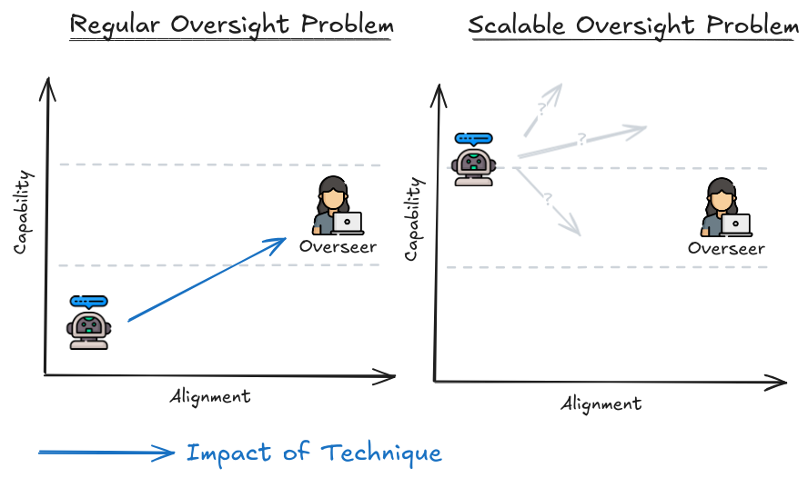
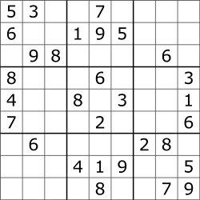
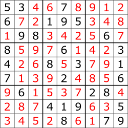

# 8.1 Supervision

**Pourquoi avons-nous besoin de supervision ?** À mesure que les systèmes d'IA deviennent plus intelligents, ils commenceront à effectuer des tâches difficiles à évaluer pour les humains. L'évaluation signifie vérifier la performance de l'IA après l'accomplissement d'une tâche, tandis que le retour est l'information que nous donnons à l'IA pendant ou après son travail pour l'aider à apprendre et à s'améliorer. Actuellement, nous pouvons encore utiliser des méthodes comme l'apprentissage par renforcement à partir de retours humains (RLHF) pour guider l'IA dans la bonne direction. Mais nous ne pouvons donner un retour que si nous sommes encore capables d'évaluer les résultats. Au fur et à mesure que les tâches deviennent plus complexes, même les experts pourraient avoir du mal à fournir des évaluations et des retours précis. Nous avons donc besoin de nouvelles méthodes pour donner des retours précis, même pour des tâches qui dépassent l'expertise humaine. C'est l'objectif de la supervision adaptative.

Les techniques de supervision adaptative aident les humains à fournir des retours précis sur des tâches afin de garantir que les systèmes d'IA sont alignés avec nos objectifs, même lorsque la complexité des tâches dépasse les capacités des meilleurs experts humains. Cela peut se produire pendant la formation ou le déploiement de l'IA et ne se limite pas aux retours de type RLHF.

<figure markdown="span">
{ loading=lazy }
  <figcaption markdown="1"><b>Figure 8.1 :</b> La différence entre la recherche de sécurité classique de supervision et la recherche de sécurité de supervision adaptative.</figcaption>
</invoke>

**Aligner les agents d'apprentissage par renforcement (RL) versus les grands modèles de langage (LLM)** Il y a quelques années, il semblait que la voie vers l'intelligence artificielle générale (AGI) passait par l'entraînement d'agents d'apprentissage profond par renforcement à partir de zéro dans un large éventail de jeux et d'environnements multi-agents. Ces agents seraient alignés pour maximiser des fonctions de score simples comme la survie et la victoire dans des jeux et ne connaîtraient pas grand-chose des valeurs humaines. Aligner ces agents nécessiterait beaucoup d'efforts : non seulement nous devons créer une fonction objective alignée avec les humains à partir de zéro, mais nous devrions probablement aussi inculquer de nouvelles capacités aux agents comme comprendre la société humaine, ce qui importe aux humains et comment ils pensent. Les grands modèles de langage (LLM) rendent cela beaucoup plus facile : ils sont préchargés avec une grande partie des connaissances de l'humanité, y compris des connaissances détaillées sur les préférences et les valeurs humaines. D'emblée, ils ne sont pas des agents qui cherchent à poursuivre leurs propres objectifs dans le monde, et leurs fonctions objectives sont assez malléables. Par exemple, ils sont étonnamment faciles à entraîner pour se comporter de manière plus éthique et collaborative. Si l'AGI provient des LLM, il pourrait être plus facile à aligner. ([Leike, 2022](https://aligned.substack.com/p/alignment-optimism))

## 8.1.1 Signaux d'entraînement et tâches floues {: #01}

Avant de comprendre comment aligner des systèmes d'IA plus intelligents que les humains, il est crucial de saisir le concept général des signaux d'entraînement et de comprendre pourquoi leur génération devient de plus en plus complexe, à mesure que l'IA développe des capacités polyvalentes de plus en plus avancées.

**Que sont les signaux d'entraînement ?** Les signaux d'entraînement sont un terme générique désignant les informations utilisées pour orienter et guider l'apprentissage de l'intelligence artificielle. Il peut s'agir de récompenses, d'étiquettes ou d'évaluations qui indiquent la performance de l'IA lors de l'exécution d'une tâche.

- Dans l'apprentissage supervisé (SL), le signal d'entraînement est l'étiquette correcte pour chaque exemple.

- Pour les grands modèles de langage (LLM) utilisant l'apprentissage auto-supervisé (SSL), les signaux d'entraînement sont le mot suivant correct dans une phrase pendant la pré-formation. Les retours humains sur la qualité des réponses lors de l'ajustement fin sont également un type de signal d'entraînement qui guide les réponses vers une direction plus "alignée".

- Dans l'apprentissage par renforcement (RL), les signaux d'entraînement sont des récompenses basées sur le succès/l'échec des actions (ou de plusieurs actions), comme les points marqués dans un jeu ou la navigation réussie vers un endroit.

Ces signaux façonnent l'apprentissage des systèmes d'IA et sont utilisés à la fois pour évaluer la performance et fournir des retours.

**Signaux d'entraînement faciles à générer.** Pour certaines tâches, la création de signaux d'entraînement est relativement simple. AlphaGo Zero, un agent d'apprentissage par renforcement jouant au Go, illustre parfaitement ce cas. Le jeu possède des règles précises et des résultats binaires de victoire ou de défaite, ce qui rend les signaux d'entraînement particulièrement limpides : les critères de succès sont directement mesurables de manière algorithmique, facilitant grandement l'apprentissage et l'amélioration continue du modèle.

**Signaux d'entraînement complexes à élaborer.** Certaines tâches présentent des défis significatifs dans la conception des signaux d'entraînement. Prenons l'exemple de l'entraînement des modèles GPT à la génération de résumés textuels précis : l'intelligence artificielle doit transmettre des informations exactes tout en maintenant une cohérence et un niveau d'intérêt optimal. La mesure du succès devient intrinsèquement subjective, car elle dépend largement des préférences individuelles du lecteur, rendant dès lors ardue la définition de signaux d'entraînement algorithmiques non ambigus. Un autre exemple probant réside dans la navigation des véhicules autonomes en milieu urbain dense. Ces systèmes doivent prendre des décisions critiques en temps réel, où l'élaboration de signaux de récompense pour une navigation à la fois sécurisée et efficace se heurte à la complexité des contextes variables et aux potentielles contradictions entre réglementations de circulation et impératifs de sécurité.

**Tâches floues.** Nous désignons comme "tâches floues" les tâches où la génération de signaux d'entraînement s'avère particulièrement ardue. Ces tâches se caractérisent généralement par des objectifs et des résultats intrinsèquement ambigus ou mal définis. La génération de signaux d'entraînement précis se heurte à la subjectivité inhérente et à la variabilité des "réponses correctes". Les tâches floues se distinguent par l'absence de critères objectifs et explicites de succès. À l'inverse des tâches bien délimitées aux objectifs spécifiques et mesurables, ces tâches revêtent un caractère plus ouvert, complexifiant la conception de signaux d'entraînement. Lorsqu'il devient difficile de formuler des récompenses ou des étiquettes précises capturant fidèlement le comportement recherché, le processus d'apprentissage se trouve considérablement entravé. Les systèmes d'IA risquent alors de ne pas bénéficier des retours suffisamment cohérents et fiables pour un apprentissage optimal. Cette analyse met une fois de plus en lumière les défis intrinsèques du problème de spécification des récompenses, auquel nous avons précédemment fait référence.

**Tâches floues et supervision à l'échelle.** Les tâches floues sont intimement liées à l'alignement des systèmes d'IA, un défi majeur consistant à garantir que ces systèmes agissent en parfaite adéquation avec les valeurs et intentions humaines, compte tenu de leur nature intrinsèquement ambiguë et subjective. Aligner l'IA avec les valeurs humaines constitue par essence une tâche floue. Les techniques de supervision cherchent à résoudre ce problème d'alignement en fournissant des signaux d'entraînement adaptés à ces tâches complexes, notamment via des techniques de retour d'information et d'apprentissage par imitation telles que l'apprentissage par renforcement à partir de retours humains (RLHF, de l'anglais *Reinforcement Learning from Human Feedback*), l'IA constitutionnelle (CAI, de l'anglais *Constitutional AI*) et l'apprentissage par inversion de renforcement (IRL, de l'anglais *Inverse Reinforcement Learning*). Ces techniques de supervision à l'échelle visent à générer des signaux d'entraînement pour des tâches floues trop complexes pour être comprises ou évaluées même par des experts.

Pour rendre les techniques de supervision à l'échelle viables, la vérification doit être plus facile que la génération, et de préférence (mais pas nécessairement) les tâches doivent être décomposables. Ces propriétés seront discutées dans les sections suivantes.

## 8.1.2 Vérification versus Génération {: #02}

**Que signifie P ≠ NP ?** En informatique théorique, nous classons les problèmes computationnels selon leur complexité : la difficulté à les résoudre (générer une solution) et la facilité à vérifier une solution potentielle.

- P (Temps polynomial) : Ce sont des problèmes qui peuvent être résolus par un ordinateur en un temps proportionnel à une fonction polynomiale de la taille de l'entrée.

- NP (Temps polynomial non déterministe) : Problèmes pour lesquels la vérification d'une solution est rapide, tandis que sa génération peut nécessiter un temps computationnel significativement plus long.

**Qu'est-ce que la génération ?** La génération représente le processus de création de solutions ex nihilo, impliquant l'exploration systématique d'un vaste ensemble de possibilités, ce qui peut s'avérer extrêmement chronophage et gourmand en ressources computationnelles. Prenons l'exemple d'un puzzle Sudoku : il s'agit de remplir une grille de 9x9 cases, en veillant à ce que chaque ligne, chaque colonne et chaque sous-grille de 3x3 contienne l'intégralité des chiffres de 1 à 9, sans aucune répétition. Quiconque a déjà tenté de résoudre un tel casse-tête sait combien le processus requiert de patience et de stratégie, nécessitant de multiples tentatives et ajustements pour respecter scrupuleusement l'ensemble des règles.

<figure markdown="span">
{ loading=lazy }
  <figcaption markdown="1"><b>Figure 8.2 :</b> ([Wikipédia](https://en.wikipedia.org/wiki/Sudoku))</figcaption>
</figure>

La génération consiste ici à remplir la grille vide tout en garantissant le respect de toutes les contraintes (numéros uniques dans les lignes, colonnes et sous-grilles).

**Qu'est-ce que la vérification ?** La vérification est le processus qui permet de valider si une solution donnée est correcte. En prenant l'exemple du Sudoku, vérifier signifie s'assurer que chaque ligne, colonne et sous-grille contient tous les chiffres de 1 à 9 sans aucune répétition. Une fois qu'une grille de Sudoku est complétée, en vérifier la validité devient un exercice simple et rapide. Ce principe illustre parfaitement le concept fondamental de P ≠ NP.

<figure markdown="span">
{ loading=lazy }
  <figcaption markdown="1"><b>Figure 8.3 :</b> ([Wikipédia](https://en.wikipedia.org/wiki/Sudoku))</figcaption>
</figure>

**Exemples : Démontrer la facilité de vérification par rapport à la génération**. Une propriété générale qui transcende de nombreux domaines :

- Problèmes formels : En théorie de la complexité computationnelle, la plupart des informaticiens considèrent que P ≠ NP ([Wikipédia](https://en.wikipedia.org/wiki/P_versus_NP_problem#Reasons_to_believe_P_%E2%89%A0_NP_or_P_=_NP)), ce qui signifie qu'il existe de nombreux problèmes où la validation d'une solution s'avère significativement moins complexe que sa recherche originelle. Ce phénomène se manifeste notamment dans des problèmes de satisfiabilité booléenne (SAT) et les algorithmes de théorie des graphes.

- Sports et Jeux : Il est bien plus simple de consulter un tableau de score pour connaître le vainqueur que de maîtriser réellement le jeu.

- Produits de Consommation : Comparer la qualité des smartphones à partir des avis des utilisateurs est plus simple que de concevoir et de fabriquer un nouveau smartphone.

- Performance Professionnelle : Évaluer les performances d'un employé est nettement moins complexe que de réaliser concrètement le travail.

- Recherche Académique : Bien que l'expertise d'un travail de recherche puisse s'avérer complexe, l'évaluation reste intrinsèquement moins exigeante que la production de nouvelles connaissances scientifiques.

**Pourquoi la facilité de vérification par rapport à la génération est importante pour une supervision à l'échelle**. Ce fait est crucial pour une supervision à l'échelle car il nous permet, en tant que superviseurs humains, de garantir efficacement la correction et la sécurité des résultats produits par des systèmes complexes sans avoir besoin de comprendre ou de reproduire intégralement le processus de génération. Si P ≠ NP est avéré, cela suggère que nous pourrions potentiellement déléguer la recherche sur l'alignement à des modèles d'IA, étant donné que nous pouvons relativement aisément vérifier la validité de leurs solutions, alors même qu'ils doivent relever la tâche ardue de générer des solutions d'alignement. Globalement, opérer sous cette hypothèse pourrait rendre la tâche d'alignement de systèmes d'IA avancés plus envisageable. Les paragraphes suivants examineront le débat relatif à la validité de cette hypothèse.

**Vérification dans des Contextes Adverses**. Lorsqu'on procède à une vérification dans un environnement où un adversaire cherche activement à vous induire en erreur, le processus devient considérablement plus ardu. En d'autres termes, si nous sommes confrontés à des IA potentiellement trompeuses, la complexité du problème s'en trouve significativement accrue. Par exemple, garantir la sécurité d'un logiciel contre l'ensemble des attaques potentielles peut s'avérer plus complexe que sa conception initiale. Un attaquant n'a besoin que de découvrir une unique faille de sécurité, tandis que le vérificateur doit examiner exhaustivement tous les systèmes pour écarter toute vulnérabilité. Cette asymétrie rend la vérification particulièrement délicate. De manière similaire, bien que créer un système sécurisé en cryptographie soit déjà difficile, démontrer sa robustesse contre l'ensemble des attaques possibles relève d'un défi encore plus important. Il devient nécessaire d'anticiper chaque stratégie potentielle de compromission du système, une tâche véritablement titanesque.

**Le fait que la vérification soit plus simple que la génération ne la rend pas pour autant triviale**. Bien que la vérification soit théoriquement moins complexe que la génération, cela ne signifie pas qu'elle est toujours aisée en pratique. Par exemple, examiner une preuve mathématique complexe peut s'avérer extrêmement ardu. Rédiger une preuve exige de la créativité et une compréhension approfondie, tandis que sa vérification requiert un examen méticuleux et détaillé, susceptible d'être épuisant et source d'erreurs potentielles. Dans le domaine logiciel, concevoir un programme sécurisé représente déjà un défi, mais garantir sa sécurité totale relève d'une tâche encore plus complexe. Ainsi, même si la vérification d'une solution peut paraître théoriquement plus accessible que sa génération, le processus demeure intrinsèquement difficile, nécessitant des efforts substantiels et une expertise pointue.

**Vérification de la sécurité versus alignement prouvable**. Dans l'éventualité où nous devons faire face à une IA superintelligente, la simple vérification de son comportement pourrait s'avérer insuffisante. Certains chercheurs affirment qu'il est crucial de démontrer formellement que l'IA agira systématiquement en parfaite adéquation avec les valeurs humaines. La vérification consiste à examiner si l'IA se comporte correctement dans des situations spécifiques. L'alignement prouvable, en revanche, exige de fournir des garanties formelles que l'IA agira de manière appropriée dans l'ensemble des scenarios possibles, y compris les situations nouvelles et totalement inattendues. Cette démarche requiert bien plus qu'une simple vérification — elle nécessite des méthodes formelles et des garanties rigoureuses, un défi intellectuel et technique d'une complexité extrême.

**Vérification par opposition à Preuve Mathématique**. La vérification consiste à examiner la validité d'une solution spécifique, généralement au moyen de tests ou d'une inspection rigoureuse. Une preuve mathématique, en revanche, constitue un argument logique démontrant de manière formelle qu'une affirmation est intrinsèquement vraie. À titre d'illustration, vérifier une solution de Sudoku revient à contrôler la correction de l'arrangement donné, tandis qu'une preuve mathématique peut établir qu'un puzzle Sudoku présentant un certain nombre d'indices possède nécessairement une solution unique.