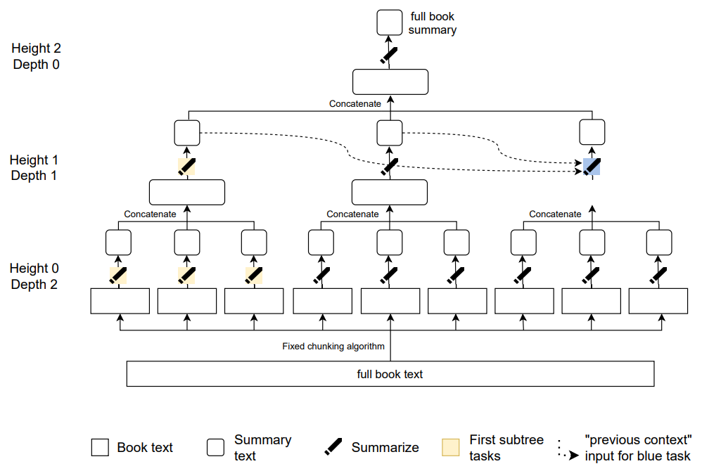
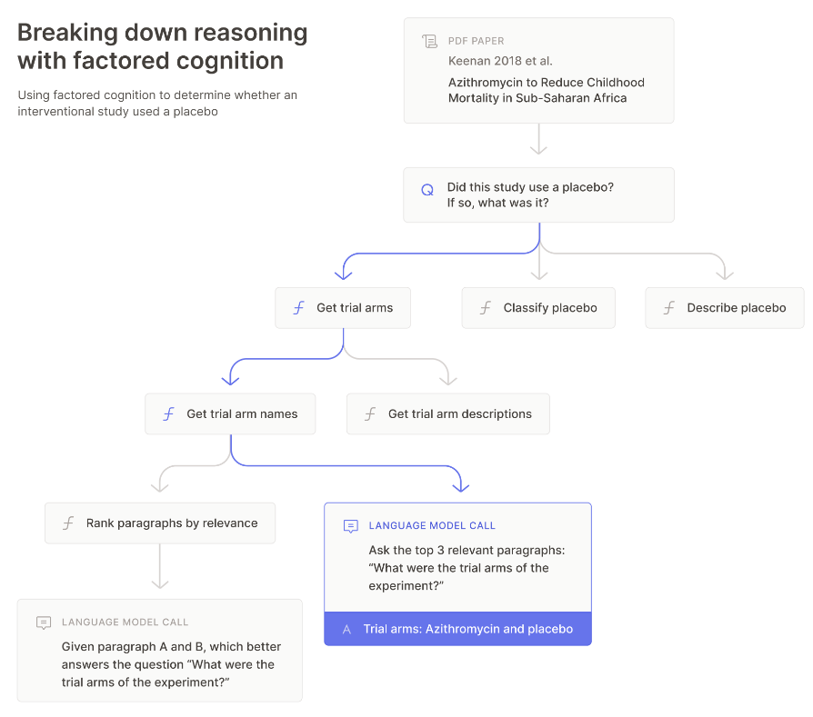

# 8.2 Décomposition des Tâches

    

        
            <i class="fas fa-clock"></i>
        
        

            
Temps de Lecture

            
6 min

        

    

**Qu'est-ce que la Décomposition des Tâches ?** La décomposition des tâches est le processus de fragmentation d'une tâche complexe en sous-tâches plus petites et plus faciles à gérer. Cette technique facilite le traitement de problèmes sophistiqués en les divisant en composants plus simples qui peuvent être abordés indépendamment. Par exemple, si vous devez résumer un livre, vous pourriez décomposer cette tâche plus large en résumant individuellement chaque chapitre. Chaque résumé de chapitre contribue ensuite au résumé global du livre.

Exemple :

- Tâche : Résumer le livre.

- Décomposition : Résumer chaque chapitre séparément.

Décomposer les tâches permet de surmonter la complexité. Les humains naviguent dans la complexité du monde en utilisant des couches d'abstraction, où chaque couche masque la plupart des détails sous-jacents, nous permettant de nous concentrer sur des fragments d'information essentiels. Cette capacité est cruciale car les humains ne peuvent traiter que peu d'informations simultanément dans leur esprit. La décomposition des tâches nous aide à résoudre des problèmes hautement complexes en les fragmentant en sous-problèmes plus simples.

**Qu'est-ce que la Décomposition Récursive des Tâches ?** La décomposition récursive des tâches prolonge le concept de base en décomposant chaque sous-tâche en sous-tâches encore plus détaillées. Ce processus itératif se poursuit jusqu'à ce que chaque tâche devienne assez simple pour être traitée directement. En poursuivant l'exemple de la synthèse de livre, la décomposition récursive des tâches impliquerait de décomposer encore plus chaque résumé de chapitre en résumés de pages, et chaque résumé de page en résumés de paragraphes jusqu'à ce que la tâche puisse être résolue simplement.

Exemple :

- Tâche : Résumer le livre.

- Décomposition :

- Résumer chaque chapitre.

- Résumer chaque page de chaque chapitre.

- Résumer chaque paragraphe au sein de chaque page.

<figure markdown="span">
{ loading=lazy }
  <figcaption markdown="1"><b>Figure 8.4 :</b> Exemple de résumé de livres combinant décomposition des tâches et apprentissage à partir de retours humains. Le livre est d'abord décomposé en plusieurs fragments en utilisant un algorithme de découpage fixe (non appris) (hauteur 0). Ensuite, des humains fournissent des démonstrations de résumé de ces fragments, qui sont utilisées pour entraîner un modèle d'apprentissage automatique sur ces données en utilisant le clonage de comportement. Puis davantage de données sont collectées auprès d'humains qui comparent différentes sorties du modèle, qui sont ensuite utilisées pour entraîner davantage une politique de résumé en utilisant la modélisation de la récompense. Puis les résumés sont concaténés (hauteur 0), des données sont collectées pour résumer ces résumés, et le modèle est affiné pour cette tâche de résumé (hauteur 1). Cette procédure est répétée de manière récursive jusqu'à ce que le livre entier soit résumé. ([Wu et al., 2021](https://arxiv.org/abs/2109.10862))</figcaption>
</figure>

**Comment la décomposition des tâches aide-t-elle à générer de meilleurs signaux d'apprentissage ?** Comme nous l'avons souligné précédemment, à mesure que les systèmes d'IA deviennent plus performants, il devient complexe pour les humains de fournir des signaux d'apprentissage ou des données pertinents, notamment pour les tâches aux critères d'évaluation subjectifs (tâches floues). L'objectif principal de la décomposition des tâches est de simplifier la fourniture de signaux d'apprentissage par le jugement humain. Des tâches plus simples facilitent non seulement la génération du signal d'apprentissage, mais sont également plus faciles à vérifier. Dès lors, la décomposition des tâches est cruciale pour le succès de nombreuses techniques de supervision évolutives.

Décomposer une tâche consiste à la diviser en parties plus petites et plus gérables. Ces parties aident à mieux comprendre et gérer la tâche, mais ne sont pas toujours indépendamment résolues ou réutilisables. Les propriétés essentielles que nous recherchons dans une bonne décomposition comprennent :

1. Décomposabilité récursive : Le système devrait être capable de décomposition récursive des tâches, en divisant un problème en sous-tâches plus simples. Par exemple, résumer un livre implique de le décomposer en chapitres, puis en pages, et ensuite en paragraphes jusqu'à atteindre un niveau minimal de difficulté de tâche.

2. Indépendance/Modularité : Les sous-tâches individuelles devraient pouvoir être accomplies indépendamment et en parallèle sans dépendre les unes des autres ou de la tâche globale. Par exemple, chaque résumeur se concentre sur un paragraphe sans avoir besoin de comprendre l'ensemble du livre.

3. Compositionnalité : Il doit être possible de combiner les solutions des sous-tâches individuelles indépendantes pour obtenir une solution globale cohérente et exhaustive du problème initial. À titre d'exemple, on peut citer la compilation des résumés indépendants de chapitres et de paragraphes afin de produire un résumé complet de l'ouvrage.

**Décomposition des tâches dans le processus d'apprentissage.** Lorsque nous décomposons une tâche complexe en sous-tâches plus petites, chaque sous-tâche devient plus simple à comprendre et à résoudre. Ce processus permet aux apprenants de construire leurs connaissances de manière incrémentale, en se concentrant sur un petit élément à la fois. Au fur et à mesure que chaque élément est compris et maîtrisé, l'apprenant construit progressivement une compréhension globale de la tâche plus large. Étant donné que ce principe fonctionne bien pour les humains, une question naturelle est de savoir si nous pouvons utiliser une approche similaire dans le processus d'apprentissage automatique afin de fournir des signaux d'apprentissage plus précis à nos modèles. C'est ce que nous explorerons dans les sections suivantes, en tentant d'émuler l'ensemble du processus cognitif humain par le biais de la cognition factorielle.

## 8.2.1 Cognition factorielle {: #01}

**Qu'est-ce que la Cognition factorielle ?** La cognition factorielle est une approche qui permet aux modèles d'apprentissage automatique (ML, de l'anglais Machine Learning) de reproduire la pensée humaine en décomposant des tâches cognitives complexes en sous-tâches plus simples. Cette méthode repose sur un principe fondamental : surmonter la complexité en fragmentant un problème en sous-problèmes plus accessibles et plus faciles à résoudre.

En considérant la cognition elle-même comme une tâche aux contours imprécis, nous pouvons utiliser la factorisation des tâches pour décomposer la pensée en une série d'actions et rendre possible l'entraînement de modèles d'apprentissage automatique avec des signaux d'apprentissage précis qui émulent la cognition humaine. En documentant comment les humains résolvent des problèmes par des actions explicites dans des contextes délimités, nous pouvons entraîner des systèmes d'apprentissage automatique à imiter ces processus. Ces systèmes peuvent alors servir d'assistants de confiance, gérant un nombre croissant de tâches et augmentant la capacité cognitive humaine pour l'évaluation et la supervision.

!!! info "Définition : Cognition factorielle ([Ought, 2018](https://ought.org/research/factored-cognition))"

La cognition factorielle fait référence à des mécanismes où l'apprentissage et le raisonnement sophistiqués sont décomposés (ou factorisés) en de nombreuses tâches petites et principalement indépendantes.

Puisque ce principe est efficace pour les humains, il est légitime de se demander s'il est possible de l'adapter à l'apprentissage automatique pour améliorer la qualité de l'entraînement des modèles.

Considérer la tâche cognitive de décider comment investir 100 000 $ pour obtenir le maximum de bénéfice social. Un humain devrait analyser divers facteurs, anticiper les résultats et prendre des décisions éclairées. En décomposant cette tâche en sous-tâches plus restreintes et plus accessibles, chacune pouvant être résolue grâce à des signaux d'apprentissage précis, nous pouvons confier ces tâches aux systèmes d'apprentissage automatique.

<figure markdown="span">
{ loading=lazy }
  <figcaption markdown="1"><b>Figure 8.5 :</b> Cette figure illustre le processus de décomposition d'une question de recherche complexe concernant l'azithromycine en plusieurs sous-questions. Les sous-questions sont progressivement simplifiées jusqu'à ce qu'elles puissent être abordées par une seule requête de modèle de langage. ([Ought, 2022](https://primer.ought.org/)).</figcaption>
</figure>

Principaux avantages de la cognition factorielle :

- **Délégation :** Grâce à la factorisation des tâches, il devient possible de répartir les sous-tâches entre différents intervenants qui peuvent travailler de manière autonome. Cette approche nécessite de fournir des instructions précises et des objectifs clairement définis à chaque intervenant. Par exemple, on peut affecter à différents collaborateurs (chargés de résumé) des chapitres spécifiques à synthétiser. Ces collaborateurs peuvent ensuite déléguer la tâche de résumé à des sous-agents, qui se concentreront sur des pages ou des paragraphes individuels. Chaque intervenant travaille de façon indépendante, se concentrant exclusivement sur sa partie sans avoir besoin de comprendre l'ensemble du document.

- **Méta-raisonnement** : La cognition factorielle implique d'appliquer ce principe réflexif au processus de décomposition lui-même. Si les tâches peuvent être fragmentées en sous-tâches autonomes, la factorisation devient elle-même un processus susceptible d'être décomposé. Cette approche consiste à analyser le processus de décomposition, à tirer des apprentissages des tentatives précédentes, à ajuster les stratégies et à optimiser continuellement la fragmentation pour garantir l'autonomie et la gérabilité de chaque sous-tâche. 

Initialement, les humains supervisent ce méta-raisonnement en orchestrant le processus de décomposition : ils déterminent comment fragmenter des tâches complexes et identifient le niveau optimal de décomposition. Dans des systèmes plus avancés, les sous-agents (modèles d'IA) peuvent également réaliser un méta-raisonnement autonome, en apprenant des interactions humaines et en appliquant ces stratégies de manière de plus en plus sophistiquée.

Cette approche de décomposition des problèmes épouse les mécanismes de la pensée humaine. Lorsque nous réfléchissons, nous oscillons naturellement entre la décomposition et la résolution de problèmes. En fragmentant un problème en parties plus restreintes et en résolvant chacune d'entre elles, nous maîtrisons la complexité et rendons la tâche plus accessible.

La cognition factorielle est une approche générale qui peut être utilisée de différentes manières. Les sections suivantes exploreront la distillation et l'amplification itératives (IDA, de l'anglais Iterated Distillation and Amplification), qui toutes deux utilisent la factorisation des tâches comme un outil dans leur approche plus large d'alignement des systèmes d'IA.