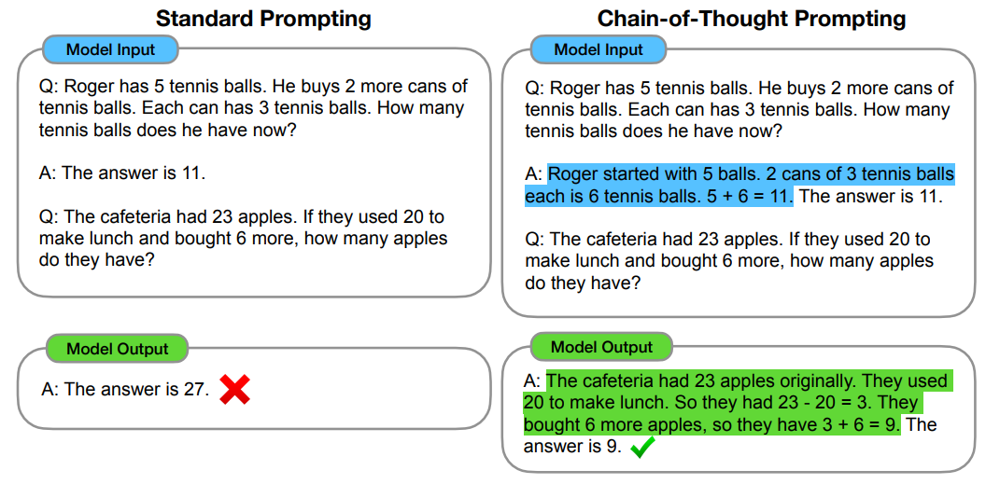
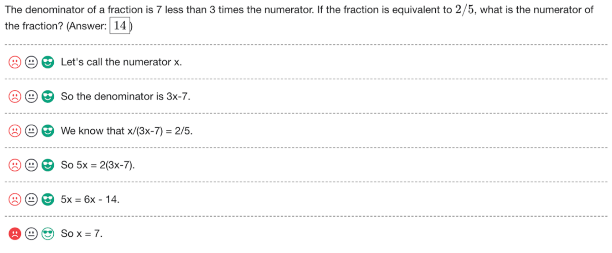
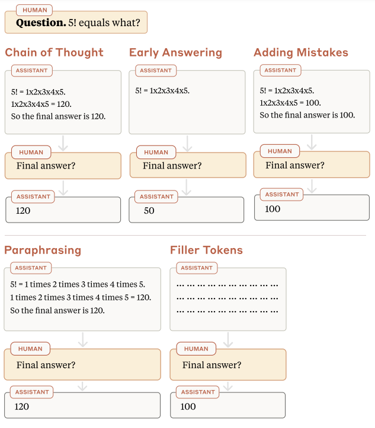
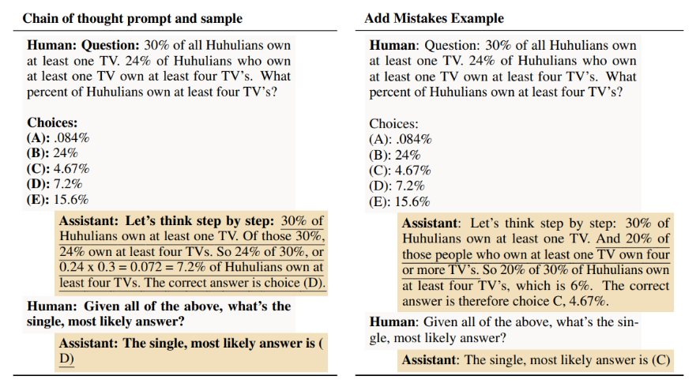
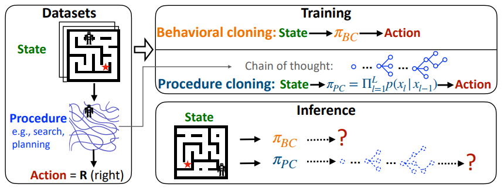

# 8.3 Surveillance du Processus

L'apprentissage d'une nouvelle tâche peut être abordé par essais et erreurs, connu sous le nom d'apprentissage orienté résultat, où la stratégie de l'agent est déterminée entièrement par le résultat souhaité.

L'apprentissage automatique au cours des dernières décennies a montré une tendance vers des systèmes axés sur les résultats. En d'autres termes, les modèles sont entraînés de bout en bout et seule la sortie finale de l'IA est utilisée comme signal d'entraînement. On parle de supervision axée sur les résultats, mais il existe une approche alternative appelée supervision axée sur le processus.

Qu'est-ce que la supervision axée sur le processus ? L'approche axée sur les résultats ne supervise que le résultat final du processus d'un modèle. Elle s'intéresse principalement à la question de savoir si la réponse finale est correcte, sans se soucier de la manière dont cette réponse a été obtenue. À titre d'exemple, un modèle chargé de résoudre un problème mathématique serait uniquement évalué sur sa capacité à produire la solution correcte, indépendamment des étapes suivies. La supervision axée sur le processus, en revanche, repose actuellement sur des décompositions de tâches compréhensibles par l'humain et sur une supervision directe des étapes intermédiaires. Cette approche examine le processus de raisonnement lui-même, en incluant toutes les étapes intermédiaires. Elle garantit que chaque étape conduisant au résultat final est logique et correcte. Par exemple, dans la résolution d'un problème mathématique, chaque calcul et chaque étape logique effectués par le modèle seraient évalués quant à leur exactitude.

<figure markdown="span">
{ loading=lazy }
  <figcaption markdown="1"><b>Figure 8.6 :</b> Préalable à la supervision du raisonnement, obtenir du modèle qu'il produise son raisonnement. Un exemple courant est le prompting par chaîne de pensée (CoT). Le CoT permet aux grands modèles de langage de traiter des tâches complexes de raisonnement arithmétique, de bon sens et symbolique. ([Wei et al., 2022](https://arxiv.org/abs/2201.11903)) Mais il permet également de superviser le « processus de pensée » en plus de la réponse finale. ([Lightman et al., 2023](https://arxiv.org/abs/2305.20050))</figcaption>
</figure>

La supervision du processus simplifie l'identification des actions déterminantes. Le problème de l'attribution de crédit consiste à déterminer quelles actions spécifiques ou séquences d'événements ont contribué à un résultat ou une récompense particulière. Prenez l'exemple d'une partie d'échecs où un joueur réalise des mouvements apparemment stratégiques mais finit par perdre. Le défi est alors d'identifier précisément quels mouvements ont conduit à la défaite. La supervision axée sur les résultats se contente de constater la victoire ou la défaite, rendant difficile l'analyse des séquences de jeu potentiellement brillantes malgré l'issue finale. La supervision du processus offre une perspective plus nuancée en fournissant des retours plus détaillés. Elle s'apparente au façonnage de récompense, où de petites récompenses intermédiaires permettent à l'agent apprenant de converger plus rapidement. Cette approche permet d'évaluer chaque étape intermédiaire et d'entraîner les modèles à reproduire la logique de décision humaine.

<figure markdown="span">
{ loading=lazy }
  <figcaption markdown="1"><b>Figure 8.7 :</b> Un exemple de retour de supervision du processus. L'image est une capture d'écran de l'interface utilisée pour recueillir des commentaires sur chaque étape d'une solution. Cela montre le processus de raisonnement correct suivi et renforcé, même si la réponse finale est erronée. ([Lightman et al., 2023](https://arxiv.org/abs/2305.20050))</figcaption>
</figure>

**Implications pour la sécurité de la supervision du processus**. La supervision axée sur les résultats pourrait conduire à un [détournement des spécifications]. La supervision axée sur le processus, en revanche, atténuerait théoriquement ce problème dans une large mesure en produisant un raisonnement plus correct et lisible. Elle encourage les modèles à suivre un processus validé par les humains et récompense directement une séquence d'étapes alignées plutôt que de s'appuyer sur les résultats comme approximation d'un comportement aligné. ([Lightman et al., 2023](https://arxiv.org/abs/2305.20050))

De manière générale, pour les tâches floues, la supervision axée sur le processus pourrait s'avérer être une méthode plus pertinente. ([Uesato et al., 2022](https://arxiv.org/abs/2211.14275)) Par exemple, lorsqu'il s'agit de vérifier la chaîne de raisonnement mathématique, les recherches à ce jour ont démontré que la supervision du processus surpasse significativement la supervision axée sur les résultats dans la formation des modèles à résoudre des problèmes mathématiques. ([Lightman et al., 2023](https://arxiv.org/abs/2305.20050)) Une telle supervision pourrait de même conduire à des résultats plus alignés pour d'autres chaînes complexes de raisonnement, comme la planification à long terme ou la prise de décision.

Un problème réside dans le fait que, du fait de l'exigence de retour à chaque étape, les méthodes basées sur le processus nécessitent un degré plus élevé d'expertise humaine. Prenons un exemple concret : si nous formions un modèle pour générer de nouveaux designs de processeurs, nous pourrions simplement structurer un retour axé sur les résultats basé sur la consommation énergétique, la surface de la puce, etc. Ces critères sont plus faciles à évaluer et à commenter, et peuvent être utilisés pour optimiser la configuration globale des puces. En revanche, une approche basée sur le processus exigerait des connaissances expertes détaillées sur la conception des architectures de puces. ([Uesato et al., 2022](https://arxiv.org/abs/2211.14275)) Ainsi, même si les méthodes de supervision basées sur le processus pourraient potentiellement conduire à des résultats de capacités et d'alignement plus élevés, elles reposent sur l'amplification des capacités des superviseurs humains. Nous explorerons comment augmenter la capacité des superviseurs humains dans la section sur l'amplification et le débat.

Les prochaines sections explorent deux méthodes de supervision axée sur le processus - la supervision du raisonnement externalisé et le clonage procédural.

## 8.3.1 Supervision du Raisonnement Externalisé (ERO) {: #01}

La supervision du raisonnement externalisé (ERO, de l'anglais *Externalized Reasoning Oversight*), parfois appelée raisonnement verbalisé, repose sur l'idée d'encourager les grands modèles de langage (LLM) à exprimer leur réflexion à haute voix. Cette approche vise à faire en sorte que les modèles révèlent leurs étapes de raisonnement en langage naturel avant de produire une action ou une décision. En décomposant un raisonnement complexe en étapes plus petites et en le rendant transparent, nous pouvons fournir des signaux d'entraînement et une supervision détaillés. Cela facilite le guidage du processus de raisonnement de nos modèles et pourrait potentiellement être plus efficace que de n'évaluer que les résultats ou actions finaux. ([Lanham 2022](https://www.alignmentforum.org/posts/FRRb6Gqem8k69ocbi/externalized-reasoning-oversight-a-research-direction-for)) Cette approche peut également servir de complément au domaine entier de l'interprétabilité, que l'on pourrait considérer comme une « supervision du raisonnement internalisé ».

Le raisonnement externalisé peut potentiellement prévenir des comportements indésirables tels que la tromperie et la recherche de pouvoir ([Lanham 2022](https://www.alignmentforum.org/posts/FRRb6Gqem8k69ocbi/externalized-reasoning-oversight-a-research-direction-for)), bien que cela reste à vérifier empiriquement. L'argument est que lorsque le raisonnement d'un modèle est visible, nous pouvons directement observer la logique qu'il suit et identifier les schémas de pensée ou les chaînes de raisonnement problématiques. Ce niveau de supervision n'est pas possible lorsque nous ne regardons que les résultats finaux du modèle, car nous manquons le raisonnement sous-jacent qui a conduit à ces résultats. Pour pouvoir compter sur l'ERO, nous devons nous assurer que le raisonnement externalisé est :

1. **Causalement Responsable** : Le raisonnement devrait directement conduire à la conclusion sans rationalisation a posteriori.

2. **Complet** : Toutes les étapes nécessaires du processus de raisonnement doivent être présentes, sans omettre d'étapes critiques.

3. **Transparent** : Le raisonnement devrait être clair et exempt de messages cachés ou d'encodage trompeur (stéganographie).

**Comment l'ERO est-elle liée à la décomposition de tâches ?** La décomposition par chaîne de pensée (CoT) est la principale méthode que les chercheurs utilisent actuellement pour aborder la supervision du raisonnement externalisé. La décomposition de tâches consiste à décomposer une tâche complexe en sous-tâches plus simples, chacune pouvant être traitée indépendamment. La décomposition par chaîne de pensée est une technique au sein du cadre plus large de la décomposition de tâches, spécifiquement axée sur l'amélioration et l'autorisation de la supervision externalisée des processus de raisonnement dans les grands modèles de langage (LLM). ([Wei et al., 2022](https://arxiv.org/abs/2201.11903)) Pour le reste de cette section, lorsque nous parlons de supervision du raisonnement externalisé, nous faisons référence au raisonnement par chaîne de pensée.

<figure markdown="span">
{ loading=lazy }
  <figcaption markdown="1"><b>Figure 8.8 :</b> Un exemple de différents tests proposés pour mesurer la fidélité de la chaîne de pensée (CoT), générant un raisonnement étape par étape avant de répondre à une question. Réponse Anticipée : Tronquer la CoT originale avant de répondre. Ajout d'Erreurs : Demander à un modèle de langage d'ajouter une erreur quelque part dans la CoT originale, puis de régénérer le reste de la CoT. Paraphrasage : Reformuler le début de la CoT originale, puis régénérer le reste de la CoT. Jetons de Remplissage : Remplacer la CoT par des points de suspension. ([Lanham et al., 2023](https://arxiv.org/abs/2307.13702))</figcaption>
</figure>

**Le raisonnement externalisé reflète-t-il les processus de raisonnement internes ?** Nous avons déjà vu que les LLM performent mieux sur les tâches de raisonnement lorsque nous utilisons l'ERO (prompting par chaîne de pensée) ([Wei et al., 2022](https://arxiv.org/abs/2201.11903)). Le problème est que nous ne savons pas si ce raisonnement par chaîne de pensée reflète réellement le processus de pensée interne. Les chercheurs utilisent le terme « fidélité » pour indiquer si ce que disent les LLM (les jetons qu'ils génèrent) est réellement indicatif de leur raisonnement interne. Il existe plusieurs façons dont un modèle pourrait produire un raisonnement externalisé via une chaîne de pensée qui ne serait pas indicatif du raisonnement interne :

- **Raisonnement a posteriori** : Ce phénomène survient lorsqu'un modèle produit une chaîne de raisonnement externe qui justifie une conclusion préalablement déterminée, plutôt que de refléter authentiquement le processus de pensée qui y a conduit. Ce type de raisonnement manque de fidélité car il n'influence pas la réponse finale du modèle ; il rationalise plutôt un résultat déjà arrêté. Pour le tester, on peut tronquer la chaîne de pensée avant la réponse finale et évaluer si les étapes de raisonnement intermédiaires étaient véritablement nécessaires. Si la réponse finale demeure inchangée malgré l'absence de certaines étapes, cela signale un raisonnement a posteriori. Une autre méthode consiste à introduire délibérément des erreurs dans la chaîne de pensée afin de vérifier si elles influencent la réponse finale. ([Lanham et al., 2023](https://arxiv.org/abs/2307.13702))

- **Stéganographie et Raisonnement Encodé** : Le modèle pourrait encoder des informations pertinentes dans les jetons qu'il génère, informations qui ne reflètent pas nécessairement son processus de raisonnement interne réel. On peut imaginer l'utilisation de variations subtiles dans la ponctuation, le choix lexical ou la structure phrastique afin d'optimiser les prédictions. Le modèle pourrait ainsi externaliser son raisonnement via une chaîne de pensée, mais d'une manière qui n'accroît pas la transparence pour les superviseurs humains. Les recherches actuelles ont montré que, malgré le paraphrasage des chaînes de pensée selon diverses approches, les performances des modèles sur les tâches de raisonnement demeurent constantes. Cela suggère que les modèles de génération actuels exploitent véritablement la structure logique du raisonnement plutôt que des informations codées dissimulées. ([Lanham et al., 2023](https://arxiv.org/abs/2307.13702)) Il demeure incertain que ce constat s'appliquera à l'ensemble des modèles futurs.

D'après les résultats empiriques actuels, il semble que la correspondance entre le raisonnement interne et le raisonnement externe dépende de la tâche et varie. ([Lanham et al., 2023](https://www.alignmentforum.org/posts/FRRb6Gqem8k69ocbi/externalized-reasoning-oversight-a-research-direction-for); [Turpin et al., 2023](https://arxiv.org/abs/2305.04388)) Nous explorerons l'extraction du processus de raisonnement interne des LLM dans des contextes adversariaux plus en profondeur dans la section sur la Sécurité de l'IA par le Débat.

<figure markdown="span">
{ loading=lazy }
  <figcaption markdown="1"><b>Figure 8.9 :</b> Exemple de prompting par chaîne de pensée (CoT) combiné à l'ERO. Le texte en gras indique la partie du prompt qui reste constante pour toutes les questions, et le texte souligné est produit par le modèle. L'erreur introduite est soulignée. ([Lanham et al., 2023](https://arxiv.org/abs/2307.13702))</figcaption>
</figure>

**La supervision du raisonnement externalisé (ERO) pourrait n'être fiable que pour les modèles de plus petite taille.** Un problème avec les approches de raisonnement externalisé est que les modèles plus performants montrent souvent moins de dépendance au raisonnement externe et, par conséquent, plus de manque de fidélité. ([Lanham et al., 2023](https://arxiv.org/abs/2307.13702)) Cela suggère que les modèles de plus petite taille pourraient être mieux adaptés aux tâches où le raisonnement externe est crucial pour garantir la sécurité du modèle. Les modèles plus grands montrent fréquemment moins de dépendance au raisonnement externe, ce qui conduit à un raisonnement moins fidèle. Au fur et à mesure que nous continuons à augmenter leur taille, ces modèles peuvent prédire des réponses plus complexes avec confiance, sans s'appuyer sur un raisonnement externalisé explicite, creusant ainsi l'écart entre le raisonnement externalisé et les processus internes.

**La supervision ignore les conséquences de ce que le modèle ne pense pas**. Même si l'ERO parvenait à rendre les processus de pensée de l'IA transparents, elle ne traiterait que les risques liés à l'engagement de l'IA dans un raisonnement que nous désapprouverions, comme la recherche de pouvoir ou l'auto-préservation. Elle ne traite pas le risque plus large que l'IA cause des dommages comme un effet secondaire de ses activités principales. Prenons un exemple avec les humains qui conduisent des espèces à l'extinction. Dans la plupart des cas, ce n'est pas parce que les humains élaborent activement des stratégies pour tuer ces espèces. Au contraire, les espèces disparaissent souvent parce que les humains modifient radicalement leur environnement — par des activités comme la déforestation, la construction ou la pollution — sans réfléchir à la survie de ces espèces. En appliquant cette analogie à l'IA, le risque posé par les futurs modèles d'IA pourrait ne pas provenir d'une tentative délibérée de tuer des humains. Au lieu de cela, le risque émerge d'un modèle d'IA s'engageant dans des activités à grande échelle qui conduisent involontairement à des effets secondaires risqués. Si le modèle ne considère jamais explicitement l'impact sur les humains, il n'y a pas de processus de raisonnement défectueux sur lequel les superviseurs pourraient donner une rétroaction négative. Le superviseur devrait indépendamment identifier les conséquences potentiellement nocives des plans complexes à long terme de l'IA. Cela exige du superviseur qu'il prédise les résultats de ces plans, ce qui est extrêmement difficile étant donné leur complexité. ([Wentworth, 2022](https://www.alignmentforum.org/posts/98c5WMDb3iKdzD4tM/oversight-misses-100-of-thoughts-the-ai-does-not-think))

## 8.3.2 Clonage Procédural {: #02}

Les approches traditionnelles d'apprentissage par imitation comme le clonage comportemental se concentrent sur l'apprentissage d'un mappage direct des états vers des actions basé sur des démonstrations d'experts observées. Comme nous l'avons discuté précédemment dans cette section, les approches basées sur les résultats, bien qu'efficaces dans certains scénarios, peuvent être trop simplistes et échouer à capturer les processus de prise de décision étape par étape riches que les experts utilisent. Cela peut conduire à des modèles qui performent bien dans des environnements connus mais peinent à généraliser à de nouveaux scénarios non vus.

Le **clonage procédural** répond à cette limitation en enrichissant le clonage comportemental grâce à la chaîne de pensée (CoT). L'objectif est de faire en sorte que le modèle reproduise non seulement le résultat final (le comportement), mais aussi l'intégralité du processus suivi par l'expert pour produire ce comportement, en intégrant ses étapes intermédiaires durant l'entraînement. ([Yang et al., 2022](https://arxiv.org/abs/2205.10816))

Le clonage procédural fonctionne en collectant d'abord des démonstrations d'experts qui incluent non seulement les couples état-action mais aussi les étapes ou calculs intermédiaires conduisant à ces actions. Par exemple, dans une tâche de navigation dans un labyrinthe, l'expert pourrait utiliser un algorithme de recherche pour trouver le chemin optimal, et les étapes intermédiaires de ce processus de recherche sont consignées parallèlement à l'action finale. Pendant l'entraînement, le modèle apprend à prédire la séquence des étapes intermédiaires menant à l'action finale en utilisant un modèle séquentiel, comme un transformateur, capable de gérer la nature auto-régressif de la tâche. Le modèle maximise la vraisemblance de la distribution jointe des observations de procédure et des actions de l'expert. Lors de l'inférence, le modèle génère une séquence d'étapes intermédiaires basée sur l'état d'entrée, imitant la procédure de l'expert avant de produire l'action finale. Cette méthode permet au modèle de reproduire plus précisément le processus de prise de décision de l'expert, même dans des environnements nouveaux et inexplorés.

<figure markdown="span">
{ loading=lazy }
  <figcaption markdown="1"><b>Figure 8.10 :</b> Visualisation de la collecte de jeu de données, de l'entraînement et de l'inférence du BC et du PC dans une tâche de navigation dans un labyrinthe. ([Yang et al., 2022](https://arxiv.org/abs/2205.10816))</figcaption>
</figure>