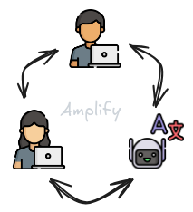
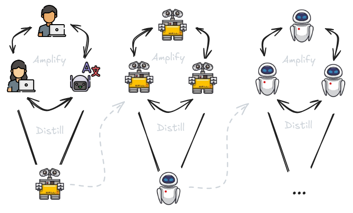

# 8.4 Amplification Itérée

    

        
            <i class="fas fa-clock"></i>
        
        

            
Temps de Lecture

            
13 min

        

    

Dans les sections précédentes, nous avons discuté des méthodes de décomposition des tâches et de l'émulation potentielle du raisonnement humain en décomposant la cognition en composantes plus petites. Dans cette section, nous expliquerons l'une des principales motivations de la décomposition des tâches - amplifier les capacités des superviseurs. Nous voulons améliorer les capacités des humains ou de l'IA pour générer de meilleurs signaux d'entraînement afin de garantir un alignement progressif de l'IA.

## 8.4.1 Amplification {: #01}

**Qu'est-ce que l'amplification des capacités ?** L'amplification est le processus d'amélioration des capacités d'un superviseur, qu'il soit humain ou IA, pour résoudre des tâches complexes qui dépassent la capacité d'un seul superviseur. Le type d'amplification le plus courant est également appelé amplification des capacités. Il se concentre sur l'amélioration de la capacité d'une IA à résoudre des tâches complexes en développant son intelligence et ses compétences de résolution de problèmes. Nous voulons que les IA non seulement imitent le comportement humain, mais qu'elles l'améliorent, en prenant des décisions plus judicieuses et en obtenant des résultats plus performants. ([Christiano Paul, 2016](https://ai-alignment.com/policy-amplification-6a70cbee4f34)) Nous pouvons amplifier les capacités de nombreuses manières différentes :

1. **Agrégation** : Nous pouvons collaborer et combiner l'expertise de multiples experts afin d'accroître notre capacité à résoudre des tâches complexes. Pour des tâches imprécises, où les critères d'évaluation sont subjectifs, faire appel à plusieurs experts permet de créer un signal d'entraînement plus fiable et représentatif. Par exemple, dans les approches d'apprentissage par imitation, la collecte de démonstrations auprès d'un groupe d'experts plutôt que d'un seul individu aide à normaliser la distribution des comportements et à améliorer les performances globales. Ainsi, le simple fait d'utiliser davantage de superviseurs constitue une approche d'amplification.

2. **Assistants** : En plus d'amplifier les capacités en impliquant davantage de superviseurs, nous pouvons également simplement améliorer les performances individuelles en utilisant des assistants. À titre d'exemple, si nous voulons utiliser un grand modèle de langage (LLM, de l'anglais Large Language Model) pour assister la recherche médicale, nous pourrions l'utiliser pour parcourir de vastes quantités de littérature médicale et mettre en évidence des traitements potentiels basés sur les modèles et les perspectives qu'il identifie. L'assistant IA fournit une liste de traitements potentiels, que l'équipe de chercheurs médicaux peut ensuite examiner en détail et approfondir.

3. **Décomposition des tâches** : Bien que non nécessaire pour l'amplification, la décomposition et la délégation des tâches sont souvent l'une des méthodes les plus courantes de mise en œuvre de l'amplification. Le fait d'avoir des tâches qui peuvent être divisées et résolues individuellement rend la résolution des problèmes beaucoup plus évolutive. Dans le même exemple que précédemment d'utilisation d'un LLM (grand modèle de langage) comme outil de recherche médicale, si nous avons la possibilité de décomposer les tâches, nous pouvons alors amplifier davantage les capacités des chercheurs. Le LLM pourrait d'abord identifier les études et les données pertinentes, puis un autre modèle d'IA pourrait extraire et résumer les principales conclusions, et enfin, une équipe d'experts pourrait examiner ces résumés pour prendre des décisions éclairées sur les traitements potentiels.

<figure markdown="span">
{ loading=lazy }
  <figcaption markdown="1"><b>Figure 8.11 :</b> Un exemple d'agrégation et d'assistants IA qui amplifient les capacités globales d'un superviseur. ([Christiano, 2020](https://forum.effectivealtruism.org/posts/63stBTw3WAW6k45dY/paul-christiano-current-work-in-ai-alignment))</figcaption>
</figure>

**Qu'est-ce que l'amplification itérée ?** Bien que nous cherchions à amplifier les capacités, l'objectif sous-jacent demeure l'alignement. L'amplification des capacités nous permet de contourner la difficulté particulièrement ardue de la spécification de la récompense, ou de la génération de signaux d'entraînement pour des tâches complexes et imprécises. Plutôt, nous pouvons procéder par améliorations progressives et incrémentales.

L'[Amplification Itérée] s'appuie sur le concept de base de l'amplification en rendant le processus récursif. Chaque itération consiste à utiliser le système amplifié pour générer des signaux d'entraînement et des solutions à des problèmes améliorés, nous permettant d'utiliser de manière itérative ces signaux d'entraînement plus performants pour entraîner des modèles plus capables et alignés. Ces modèles améliorés amplifient à leur tour nos capacités, créant une boucle de rétroaction auto-renforçante d'amélioration de la supervision. En théorie, cette approche permet d'étendre la supervision humaine à pratiquement n'importe quelle tâche.

En se concentrant sur l'amélioration progressive de l'IA à chaque étape, nous évitons la nécessité d'un design initial parfait. Nous continuons simplement à l'améliorer pas à pas. Dans un monde idéal, cela nous permet d'atténuer le problème de spécification des récompenses et garantit que, à mesure que les systèmes d'IA deviennent plus puissants, ils deviennent également plus aptes à gérer des tâches complexes sans perdre leur alignement.

Voici un exemple approximatif de la façon dont le processus d'amplification itérée pourrait se dérouler :

1. **Entraînement Initial** : Nous commençons par entraîner un grand modèle de langage (LLM, de l'anglais Large Language Model) sur un jeu de données large pour développer des capacités générales, similaire à la façon dont des modèles comme GPT-3 sont entraînés sur de vastes quantités de données textuelles pour comprendre et générer du langage humain.

2. **Amplification** : Dans notre exemple de recherche médicale, le LLM (grand modèle de langage) est affiné pour aider à identifier et diagnostiquer des maladies complexes. L'approche consiste à décomposer le diagnostic en sous-tâches plus gérables :

- Une première instance se concentre sur la collecte et l'analyse détaillée des symptômes du patient.
- Une seconde établit des correspondances entre ces symptômes et les conditions médicales connues.
- Une troisième suggère des tests initiaux ou des pistes de traitement.

En combinant les solutions de ces sous-tâches, on crée un système plus performant. Le modèle élabore alors un rapport complet comprenant :
- Un diagnostic probable
- Des tests recommandés pour confirmation
- Des options de traitement potentielles

3. **Réentraînement** : Cette sortie est ensuite examinée par un groupe d'experts médicaux, qui fournissent des retours. Les retours et les sorties sont utilisés pour réentraîner le LLM (grand modèle de langage), améliorant sa capacité à identifier des maladies complexes à chaque itération.

4. **Itération** : Ce processus est répété, chaque cycle permettant d'amplifier et de réentraîner le modèle. Progressivement, celui-ci devient plus performant dans l'identification des traitements, délivrant à chaque itération des résultats toujours plus précis et pertinents. Cette boucle itérative assure une amélioration continue, tant en termes de capacités que d'alignement.

**Amplification de la fiabilité**. L'amplification des capacités vise à rendre un système d'IA plus intelligent ou plus performant en améliorant sa capacité à résoudre des tâches complexes par la collaboration et la décomposition des tâches en étapes plus simples. L'amplification de la fiabilité, quant à elle, se concentre sur la réduction du taux d'erreur du système d'IA. Elle garantit que le système peut exécuter ces tâches de manière cohérente et sans défaillance. Même si une IA fonctionne généralement bien et s'aligne sur les valeurs humaines, elle peut occasionnellement se comporter de manière inattendue, notamment face à des situations rares ou inhabituelles. Si le système présente un taux d'erreur de 1%, la combinaison de dix décisions pourrait conduire à un taux d'échec global de 9,6%. Un seul échec dans le processus compromet l'ensemble de la procédure. Cela rend la combinaison moins fiable, même si elle est plus performante. L'amplification de la fiabilité vise à minimiser drastiquement les erreurs, renforçant ainsi l'alignement de l'IA. Globalement, cette approche est complémentaire à l'amplification des capacités. ([Christiano, 2016](https://ai-alignment.com/reliability-amplification-a96efa115687))

Quelques réflexions sur les modalités de mise en œuvre des schémas d'amplification de la fiabilité :

1. **Systèmes Redondants :** Une méthode consiste à déployer plusieurs systèmes d'IA pour réaliser une même tâche de façon autonome. Cette redondance permet de garantir que si un système défaille, les autres peuvent néanmoins fournir le résultat attendu. Dans un domaine critique comme la santé, par exemple, on pourrait faire analyser les symptômes d'un patient par trois instances distinctes d'un même LLM (grand modèle de langage), chacune opérant indépendamment.

2. **Vote à la majorité :** Lorsque plusieurs modèles sont utilisés sur une même tâche, leurs sorties peuvent être comparées. Si la plupart des systèmes convergent vers une solution, elle est considérée comme plus fiable. Si un système propose une sortie différente, le vote à la majorité permet de sélectionner la réponse la plus probable, réduisant ainsi les risques d'erreur. Dans notre exemple médical, chaque instance du LLM (grand modèle de langage) propose un diagnostic. Lorsque deux ou plusieurs instances s'accordent, le diagnostic est réputé plus fiable. En cas de désaccord, le vote à la majorité détermine le diagnostic final.

3. **Vérification croisée des erreurs :** Dans des domaines critiques pour la sécurité, nous pouvons mettre en place des mécanismes de validation et de recoupement des résultats des systèmes d'IA. L'approche consiste à utiliser plusieurs méthodes ou algorithmes pour résoudre un même problème et à comparer leurs résultats afin de garantir leur fiabilité. Dans le contexte de notre exemple médical, on peut implémenter des mécanismes supplémentaires de validation, comme l'utilisation d'algorithmes distincts ou d'un système à base de règles pour contre-vérifier le diagnostic produit par les LLM (grands modèles de langage).

4. **Amélioration Itérative :** Raffiner continuellement les systèmes d'IA pour réduire leurs taux d'erreur individuels. Dans le contexte de notre exemple de LLM (grand modèle de langage) médical, nous surveillerions et affinerions continuellement le modèle en analysant les cas où le diagnostic était incorrect ou incertain. Nous pourrions ensuite améliorer les modèles sur la base de ces retours afin de réduire progressivement leurs taux d'erreur individuels.

**Amplification de la sécurité**. L'amplification de la sécurité répond au défi de garantir qu'un système d'IA aligné ne se comporte pas de manière inattendue ou problématique sur des entrées rares ou inhabituelles. Alors que l'amplification de la fiabilité se concentre sur la réduction de la probabilité de défaillance d'une IA alignée, l'amplification de la sécurité vise à diminuer la prévalence de ces entrées potentiellement dangereuses. En substance, elle cherche à rendre exponentiellement difficile la découverte d'une entrée qui pourrait inciter l'IA à agir de manière indésirable. ([Christiano, 2016](https://ai-alignment.com/security-amplification-f4931419f903))

En pratique, l'amplification de la sécurité vise à développer des systèmes d'IA capables de résister aux entrées adverses. Il s'agit d'entrées spécifiquement conçues pour exploiter les vulnérabilités de l'IA et la pousser à des comportements non intentionnels. Les modèles d'IA doivent intégrer des mécanismes de protection contre ces exploitations de failles. Cette approche permet l'amélioration itérative des systèmes, s'inscrivant dans la continuité des concepts d'entrées adverses et de méthodes d'apprentissage adverse que nous avons abordés précédemment.

## 8.4.2 Distillation {: #02}

**Limites de l'amplification seule.** L'amplification est une technique puissante qui renforce les capacités, la fiabilité et la sécurité des systèmes d'IA. Cependant, l'amplification seule présente plusieurs défis :

1. **Complexité** : Les systèmes amplifiés peuvent devenir si complexes qu'ils deviennent difficiles à comprendre et à gérer par les humains. Cette complexité peut masquer la façon dont les décisions sont prises, rendant difficile la garantie que le système se comporte de manière sûre et comme prévu.

2. **Utilisation des ressources** : Les modèles amplifiés nécessitent souvent des ressources computationnelles importantes. Continuer à amplifier et à étendre peut s'avérer très coûteux, en particulier pour des applications en temps réel ou avec des contraintes de ressources.

3. **Efficacité opérationnelle** : Les systèmes amplifiés peuvent impliquer de nombreux composants interagissant, conduisant à des problèmes de coordination, des inefficacités dans l'exécution et des difficultés à maintenir la cohérence et la stabilité.

C'est pour répondre à ces limitations que nous avons besoin de l'étape de distillation.

**Qu'est-ce que la distillation ?** La distillation est un processus qui transforme un modèle (ou un système de modèles) large et complexe en une version plus petite et plus efficace, sans perdre les capacités essentielles acquises lors de l'amplification. Le terme "distillation" est utilisé car il est similaire au processus de distillation en chimie. En chimie, le terme signifie purifier une substance en éliminant les impuretés. De manière similaire, la distillation de modèles en sécurité de l'IA vise à "purifier" les connaissances acquises pendant l'amplification pour conserver les fonctionnalités et capacités essentielles sous une forme plus compacte et efficace.

Le modèle plus grand et plus complexe est souvent désigné comme le modèle "enseignant", tandis que le modèle plus petit et plus efficace est appelé le modèle "étudiant". Ce processus permet au modèle de moindre dimension de reproduire le comportement et les performances du modèle plus complexe, tout en offrant des avantages significatifs en termes de vélocité et de consommation de ressources computationnelles. Voici le processus général de distillation des connaissances d'un modèle amplifié :

1. Entraînement du modèle enseignant : Dans un premier temps, un modèle de grande envergure et complexe est entraîné sur un jeu de données. Il s'agit du modèle amplifié.

2. Génération des cibles : Le modèle enseignant est ensuite utilisé pour générer des sorties sur un ensemble de données d'entraînement. Cela comprend non seulement les sorties finales, mais aussi les probabilités associées à chaque résultat possible, appelées cibles souples (*soft targets*).

3. Entraînement du modèle étudiant : Le modèle étudiant est entraîné en utilisant ces cibles probabilistes, ainsi que les données d'entraînement originales. En reproduisant les sorties du modèle enseignant, l'étudiant apprend à imiter ses performances. Durant ce processus de distillation, il approxime la fonction apprise par l'enseignant. Cette approche consiste généralement à minimiser une fonction de perte qui mesure l'écart entre les prédictions de l'étudiant et les cibles probabilistes de l'enseignant.

## 8.4.3 Distillation et Amplification Itératives (DAI)

Ayant exploré individuellement les mécanismes d'amplification et de distillation, nous pouvons combiner ces deux approches dans une boucle itérative continue que nous appelons Distillation et Amplification Itératives (DAI). L'objectif principal de la DAI est de générer progressivement des signaux d'entraînement de meilleure qualité en utilisant des modèles amplifiés pour des tâches difficiles à évaluer directement, dans le but de maintenir une supervision continue sur les modèles d'IA dont les sorties deviennent trop complexes pour être évaluées précisément par les humains. Cette approche vise à répondre au problème de spécification ou de désalignement externe.

L'avantage de la DAI réside dans sa nature itérative, permettant la construction progressive d'un signal d'entraînement robuste à travers la décomposition et la recomposition des tâches, plutôt que de dépendre d'un signal parfaitement spécifié dès le départ.

<figure markdown="span">
{ loading=lazy }
  <figcaption markdown="1"><b>Figure 8.12 :</b> Distillation et Amplification Itératives (DAI) ([Christiano, 2020](https://forum.effectivealtruism.org/posts/63stBTw3WAW6k45dY/paul-christiano-current-work-in-ai-alignment))</figcaption>
</figure>

**Processus Étape par Étape pour la DAI** Voici comment nous pouvons théoriquement utiliser la DAI pour générer progressivement des signaux/retours d'entraînement de meilleure qualité pour nos modèles :

- **Entraînement du Modèle Initial** : Commencer avec un modèle initial capable de réaliser une version relativement simple de la tâche. Nous pouvons recourir à l'apprentissage supervisé, l'apprentissage par imitation ou l'apprentissage par renforcement pour entraîner ce modèle et obtenir un niveau initial de capacités et d'alignement.

- **Amplification** : Exploiter plusieurs instances du modèle, des outils externes ou d'autres techniques pour enrichir les capacités du modèle, lui permettant de traiter des tâches plus complexes. La génération de signaux d'entraînement constitue par exemple une tâche ardue. Le superviseur met à profit ces capacités amplifiées pour produire des signaux d'entraînement plus raffinés.

- **Décomposition des tâches** : Si possible, décomposer la tâche en sous-tâches individuellement réalisables. Plusieurs instances du modèle résolvent les sous-tâches et travaillent en parallèle. Ensuite, nous combinons les résultats collectifs pour résoudre le problème plus complexe.

- **Distillation** : Entraîner un modèle compressé et simplifié (modèle étudiant) pour imiter le comportement du système complexe amplifié (modèle enseignant). Ce processus permet de simplifier ou de "distiller" le comportement complexe d'un système avancé en une forme qu'un modèle unique peut comprendre et reproduire. L'objectif est de conserver les capacités amplifiées tout en améliorant l'efficacité du modèle et en préservant son niveau d'alignement. Cette étape de distillation favorise l'extensibilité : en améliorant l'efficacité d'un modèle plus capable et mieux aligné, nous pouvons en exécuter davantage de copies, et ainsi poursuivre le processus itératif.

- **Itération** : Les étapes de distillation et d'amplification sont répétées. Chaque cycle permet d'affiner le modèle, en améliorant progressivement ses capacités et sa cohérence.

**Limites et Critiques de la DAI** 1. **La Distillation Doit Préserver l'Alignement** : Les méthodes d'entraînement doivent garantir que le modèle distillé se comporte comme le superviseur le ferait, sans introduire de comportements désalignés.

2. **L'Amplification Doit Préserver l'Alignement** : Le processus d'amplification doit utiliser les sous-routines d'IA de manière à éviter toute optimisation potentiellement désalignée.

3. **Limites de la Supervision Humaine** : Avec des ressources suffisantes, les superviseurs humains devraient être capables d'exploiter des assistants IA pour résoudre efficacement des problèmes complexes. Le processus dépend étroitement des capacités et des limites des superviseurs humains, et les biais ou failles potentiellement introduits par l'homme risquent de subsister.

4. **Défis de Passage à l'Échelle** : Le processus s'avère computationnellement coûteux, notamment lors des phases d'amplification, ce qui complique sa mise en œuvre à grande échelle.

5. **Conservation des Capacités Nécessaires** : Les modèles distillés pourraient ne pas conserver toutes les capacités des modèles amplifiés, réduisant potentiellement les performances sur des tâches complexes.

6. **Erreurs Cumulatives** : Les processus itératifs présentent un risque d'accumulation d'erreurs et de désalignements mineurs qui peuvent s'amplifier progressivement.

7. **Limites de la Décomposition Algorithmique** : Toutes les tâches ne peuvent pas être facilement décomposées en sous-tâches plus simples, ce qui limite l'applicabilité de la DAI à certains domaines.