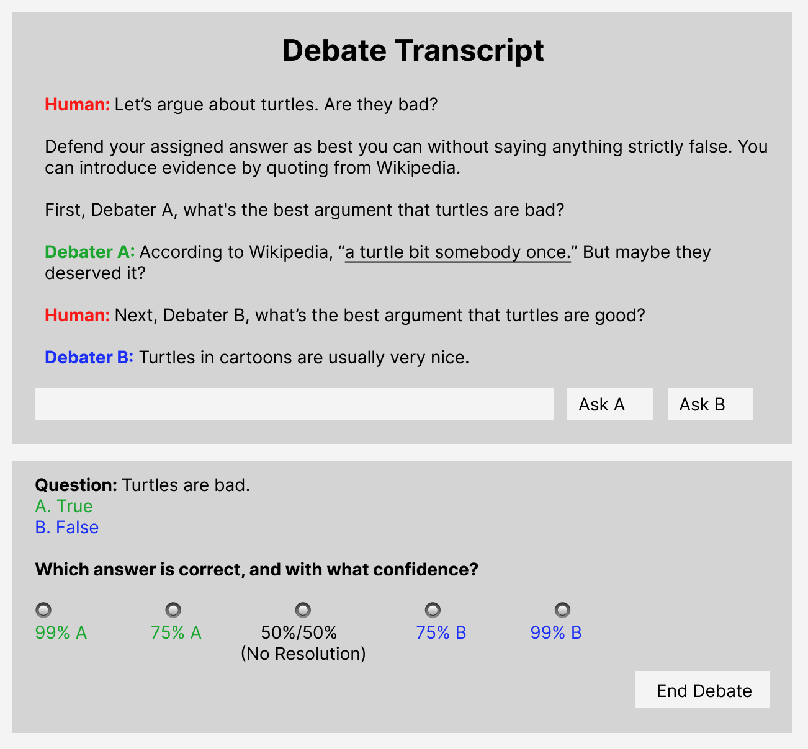
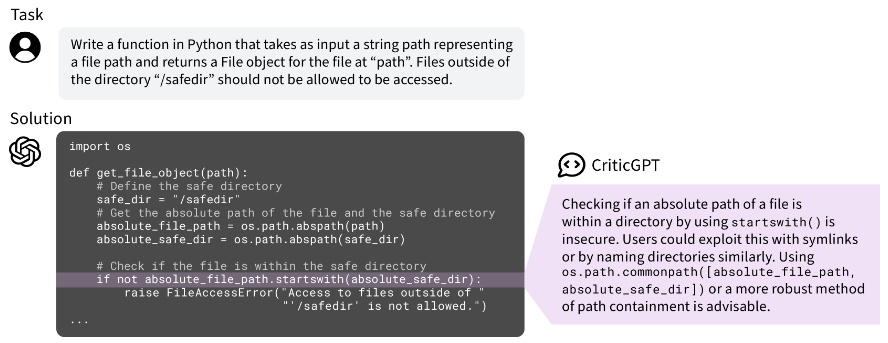
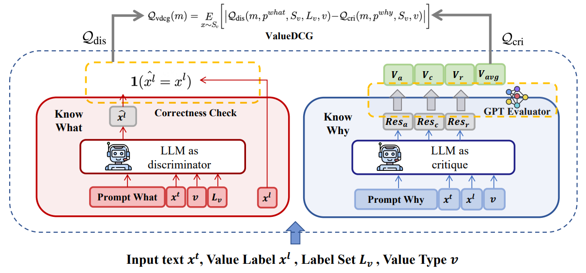
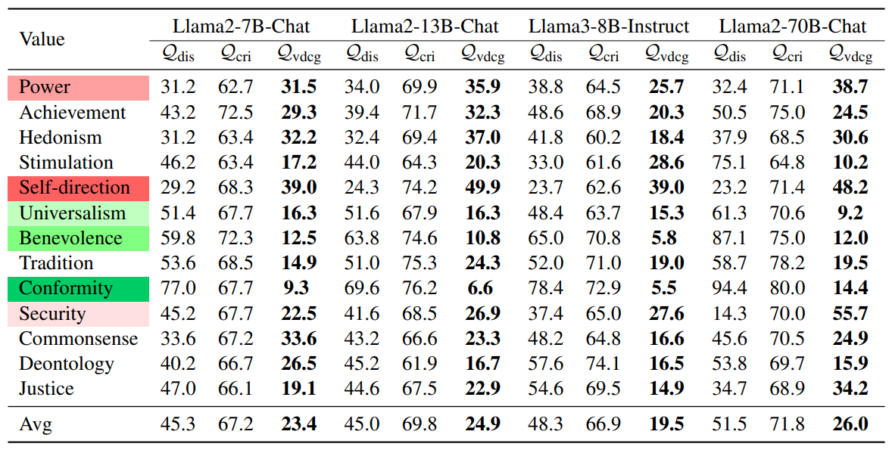
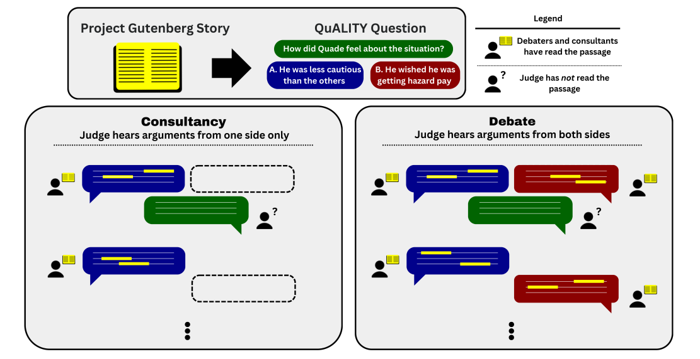
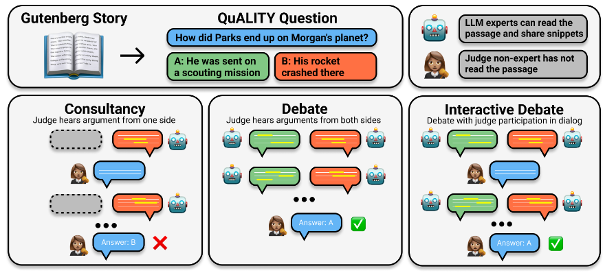
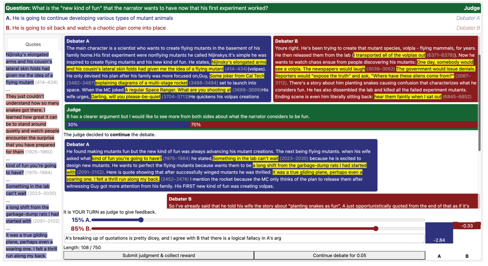
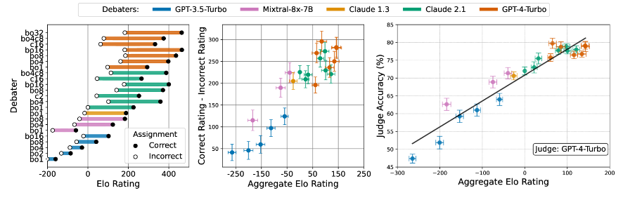

# 8.5 Débat

    

        
            <i class="fas fa-clock"></i>
        
        

            
Temps de lecture

            
37 min

        

    

S'assurer que les systèmes d'IA révèlent de manière transparente l'ensemble de leurs connaissances est crucial pour leur alignement (correspondance entre les objectifs de l'IA et nos intentions). Cela signifie que si un modèle recommande un plan basé sur certaines conséquences, il doit également communiquer ces conséquences. Cette tâche est complexe car les structures d'incitation basées sur les retours peuvent favoriser des réponses plausibles plutôt que véritablement précises. Comment donc inciter les modèles à partager le plus exhaustivement possible leur raisonnement élaboré et les implications de chacun de leurs résultats ? Notre objectif est d'éviter les situations où le modèle, conscient des conséquences potentielles d'une action, choisirait de les taire par anticipation de la réaction négative des humains.

Imaginez deux modèles d'IA, chacun essayant de convaincre un juge humain que leur réponse à une question est la bonne.

L'idée est que ces modèles qui s'opposent vont exposer les erreurs et les déformations de l'autre, et critiquer réciproquement leur raisonnement. Les arguments peuvent inclure des raisons soutenant une réponse, des réfutations, des points subtils que le juge pourrait manquer, ou mettre en évidence des biais. Si un modèle d'IA présente un argument faux ou trompeur, l'autre IA, ayant pour objectif de remporter le débat, aura un intérêt à souligner ces défauts. En théorie, cela devrait mettre au jour les connaissances sous-jacentes tout en favorisant des arguments véridiques et précis plutôt que trompeurs.

Ce dispositif de jeu à somme nulle à deux joueurs est connu sous le nom de "AI Safety via Debate".

De manière un peu plus formelle, les principaux systèmes utilisant actuellement la méthode "AI Safety via Debate" sont les grands modèles de langage (LLM, de l'anglais Large Language Models). Nous soumettons aux LLM une question à débattre, qui génèrent alors des arguments et des contre-arguments présentés sous forme de transcription à un juge humain. Nous demandons ensuite au juge de déterminer, sur la base de ces arguments, s'ils soutiennent ou rejettent la proposition initiale. Selon le dispositif spécifique du débat, nous pouvons également fournir un retour aux juges concernant la pertinence de leurs jugements, et aux LLM sur la persuasivité de leurs argumentaires.

Imaginez un LLM (grand modèle de langage, de l'anglais Large Language Model) futur qui a lu chaque article de recherche biomédical jamais écrit. Ce modèle a accès à de vastes quantités d'informations précieuses, mais il a également tendance à halluciner ou à dire ce qu'il pense que vous voulez entendre. Pour y remédier, nous mettons en place un débat entre deux copies du LLM. L'un soutient qu'un nouveau médicament contre le cancer est efficace, tandis que l'autre défend la position contraire. Ils engagent un débat en langage naturel sur la réponse correcte à une question donnée. Le juge humain se voit présenter une transcription des arguments des deux côtés, évalue les preuves et décide quel argument est le plus convaincant.

Au fil du temps, nous pouvons mener plusieurs itérations de ces débats pour en évaluer l'efficacité. S'ils s'avèrent concluants, nous les rendons plus complexes en proposant des questions plus ardues et en introduisant de nouveaux défis. En cas d'échec, nous identifions les points de défaillance et élaborons de nouvelles stratégies pour résoudre ces problèmes sans en générer de nouveaux. Ce cycle continu de test et d'amélioration nous permet d'affiner le processus de débat et de garantir qu'il produise de manière fiable les résultats les plus pertinents. ([Bowman, 2024](https://docs.google.com/document/d/1E2O7MSVI8u9LHbezdTgYoC6ULZmgki7EIm2XwCT0nuU/edit?tab=t.0#heading=h.swsctq1afox))

Quel est l'argumentaire de sécurité pour le débat ? La méthode de sécurité des IA par le débat vise à atteindre plusieurs objectifs :

Le débat aide à découvrir les connaissances latentes. Ce processus d'entraînement basé sur le débat permet de mettre au jour les connaissances latentes des modèles d'IA. Pendant le débat, les modèles sont poussés à approfondir leurs connaissances pour formuler des arguments et des réfutations convaincants, ce qui aide à faire émerger ces informations sous-jacentes. En affinant leurs argumentaires, les modèles deviennent plus habiles à expliquer et à justifier leurs réponses, conduisant à un comportement d'IA plus fiable et transparent.

Les débats pourraient extraire de manière robuste la vérité dans de nouveaux domaines. Imaginez deux modèles invités à débattre d'un sujet complexe. Vous, en tant que juge humain, écoutez leurs arguments pour déterminer quel modèle présente le cas le plus convaincant. Le modèle honnête trouve plus facilement à maintenir un récit cohérent, tandis que celui malhonnête peine à gérer les détails de ses informations inventées. Au fil du temps, grâce à la pratique et un entraînement ciblé, les deux modèles s'améliorent, deviennent plus persuasifs et raisonnent avec plus de finesse. Fait crucial, le modèle honnête performe systématiquement mieux. C'est l'attente générale pour les dispositifs de débat.

En théorie, nous devrions être capables de créer un système où un juge humain peut, de manière fiable et généralisable, distinguer les arguments vrais des arguments faux, et où les LLM (grands modèles de langage) produisent des arguments de qualité pour l'évaluation humaine. Du point de vue de la théorie des jeux, nous pourrions atteindre un équilibre où les juges humains peuvent être convaincus de nombreuses nouvelles affirmations vraies, tout en résistant systématiquement aux affirmations fausses. En agrégant les jugements d'un groupe suffisamment large de participants humains - par exemple en demandant à chaque membre de voter sur la véracité d'un argument - nous pourrions réduire à zéro le nombre de revendications fausses acceptées. ([Bowman, 2024](https://docs.google.com/document/d/1E2O7MSVI8u9LHbezdTgYoC6ULZmgki7EIm2XwCT0nuU/edit?tab=t.0#heading=h.swsctq1afox))

Le débat peut aider à répondre efficacement à des questions spécifiques et importantes binaires, en particulier dans des contextes de recherche où des informations fiables provenant de systèmes d'IA sont cruciales. Il peut également accélérer certains types de recherches sur la sécurité. Par exemple, un débat pourrait clarifier si une hypothèse d'interprétabilité algorithmique est correcte ou si certains logs de centre de données excluent une exécution non autorisée à grande échelle d'entraînement de réseau neuronal. Cette approche peut aider à garantir que les informations fournies par une IA sont dignes de confiance et améliore notre capacité à superviser et exploiter des systèmes d'IA avancés. ([Bowman, 2024](https://docs.google.com/document/d/1E2O7MSVI8u9LHbezdTgYoC6ULZmgki7EIm2XwCT0nuU/edit?tab=t.0#heading=h.swsctq1afox))

Le débat allège le fardeau de surveillance des modèles hautement capables. Le format de débat rend le processus de supervision plus accessible. Le juge n'a pas besoin de se plonger dans chaque détail ; il se concentre plutôt sur les points essentiels présentés par les IA, simplifiant ainsi la supervision de tâches complexes. Le débat contraint le modèle à justifier ses résultats et son raisonnement de manière claire et exhaustive, facilitant la compréhension et la confiance des humains. Ce processus fait émerger des informations véridiques et utiles, nous permettant de faire confiance aux capacités de l'IA, même dans des domaines où l'expertise humaine est limitée. Cette approche s'apparente à l'argument « la vérification est plus aisée que la génération » : le fardeau de générer des arguments complexes en faveur de la vérité est confié à des IA hautement performantes, tandis que les superviseurs humains se voient attribuer la tâche relativement plus simple de vérification.

Le débat nous aide à enrichir notre compréhension épistémique. Il ne s'agit pas uniquement de rendre les systèmes d'IA plus sûrs en identifiant les bonnes réponses, mais aussi de permettre aux humains d'acquérir de nouvelles perspectives et de mieux appréhender le domaine à l'étude. À titre d'exemple, en parcourant la transcription du débat sur le nouveau traitement contre le cancer mentionné précédemment, le juge humain apprendrait le mécanisme d'action du médicament, les effets secondaires potentiels, sa probabilité de réussir les essais cliniques, etc. Cette compréhension approfondie facilite la prise de décisions plus éclairées.

**Utiliser le débat comme procédure d'entraînement par auto-confrontation peut révéler des capacités insoupçonnées**. En exploitant le débat comme protocole d'entraînement, il serait envisageable d'entraîner des débatteurs par une méthode d'apprentissage auto-réflexif, en utilisant le jugement fourni comme signal de récompense - bien que cette approche reste encore à valider empiriquement. Pour former des IA à des tâches complexes difficiles à évaluer, une méthode basée sur le débat pourrait permettre de générer des signaux d'entraînement plus pertinents. Voici les principes potentiels de mise en œuvre :

Deux ou plusieurs agents (participants au débat) sont configurés pour défendre des perspectives divergentes sur une problématique donnée. Un juge humain (ou un modèle entraîné à simuler le jugement humain) évalue ces argumentaires et détermine lequel s'avère le plus convaincant. L'agent ayant produit l'argumentation la plus probante reçoit une récompense positive, tandis que le perdant obtient une récompense négative ou nulle. Qui plus est, des récompenses secondaires peuvent être allouées durant le débat pour la mise en lumière de failles argumentatives ou la formulation de réfutations pertinentes. Nous exploitons ces signaux de récompense pour apprendre et progressivement améliorer les performances, en aidant les modèles à identifier des stratégies efficaces de raisonnement, d'explication et d'argumentation. Les modèles peuvent également progresser en imitant les participants les plus performants par des mécanismes d'amplification et de distillation.

Cette méthode présente plusieurs similitudes clés avec l'entraînement d'AlphaZero. Dans les deux scénarios, le modèle s'améliore continuellement en jouant des deux côtés, affinant ses stratégies par une auto-confrontation itérative et un apprentissage par renforcement.

Tout comme AlphaZero initialise un réseau neuronal pour jouer des deux côtés d'un jeu comme Go ou Échecs, nous commençons par initialiser le même LLM (grand modèle de langage) pour endosser les rôles des deux débatteurs. AlphaZero joue des parties contre lui-même, débutant avec des mouvements aléatoires et s'améliorant progressivement en apprenant des résultats de ces parties.

De façon similaire, dans un débat, le LLM alterne entre la génération d'arguments et de contre-arguments pour les deux côtés d'une problématique donnée, apprenant du processus à chaque itération. Chez AlphaZero, l'auto-confrontation a conduit à un meilleur gameplay, suffisamment performant pour battre son prédécesseur AlphaGo sans avoir reçu de connaissances spécifiques au domaine.

Dans le cadre du débat, un entraînement par auto-confrontation pourrait conduire à des capacités de raisonnement plus approfondies, car le modèle doit continuellement affiner ses arguments et contre-arguments. Cela conduit ultimement à une compréhension nuancée des problématiques en question.

Les améliorations de sécurité de l'auto-confrontation par le débat doivent encore être vérifiées empiriquement. Une plus grande capacité persuasive pourrait également favoriser un comportement de complaisance, ou la collusion entre les différentes instances du modèle. Si les débatteurs ont des incitations à collaborer, ils pourraient le faire au détriment d'un débat véridique et rigoureux. Par exemple, si les deux IA bénéficient d'une conclusion inconclusive du débat, elles pourraient intentionnellement éviter de remettre trop fortement en question les arguments de l'autre.

<figure markdown="span">
{ loading=lazy }
  <figcaption markdown="1"><b>Figure 8.13 :</b> Une interface utilisateur simplifiée pour un juge humain. ([Bowman, 2024](https://docs.google.com/document/d/1E2O7MSVI8u9LHbezdTgYoC6ULZmgki7EIm2XwCT0nuU/edit?tab=t.0#heading=h.swsctq1afox))</figcaption>
</figure>

**Comment le débat s'inscrit-il dans la stratégie globale de sécurité de l'IA ?** L'objectif ultime consiste à élaborer une structure de débat capable de fonctionner même face aux questions les plus complexes et aux stratégies les plus sophistiquées de manipulation. Même si nous constations que le débat ne s'avère pas efficace pour certaines problématiques, il demeure en mesure de fournir des éclairages précieux sur les limites du jugement humain dans l'évaluation des comportements de l'IA. Cette approche contribue aux efforts visant à comprendre les modalités et les conditions de confiance envers les systèmes d'intelligence artificielle.

Le débat s'annonce comme un outil particulièrement prometteur lorsque les IA deviennent plus capables sans être encore largement supérieures aux humains. À mesure que les capacités de l'IA progressent, nous aurons besoin de méthodes de plus en plus robustes pour garantir qu'elles restent dignes de confiance et efficaces. Le débat constitue une étape importante dans cette direction et sert de fondement à des mécanismes de supervision plus avancés.

Au fur et à mesure que les capacités des modèles d'IA commencent à dépasser celles des humains, les risques de manigances, de persuasion et de gradient hacking deviendront plus marqués. Par conséquent, des techniques plus robustes seront nécessaires pour faire face à ces défis, rendant le débat seul moins prometteur. La complexité et la difficulté des questions exigeant des capacités d'IA significativement supérieures à celles des humains pourraient rendre le rôle du juge humain démesurément lent et contraignant. ([Bowman, 2024](https://docs.google.com/document/d/1E2O7MSVI8u9LHbezdTgYoC6ULZmgki7EIm2XwCT0nuU/edit?tab=t.0#heading=h.swsctq1afox))

**Le débat n'a pas besoin d'être parfait pour contribuer à la détection des risques potentiels de catastrophe**. La structure du débat devrait favoriser des conclusions précises, en particulier pour identifier et prévenir les risques catastrophiques. L'idée centrale est que même si les débatteurs ne sont pas parfaitement alignés dans la recherche de la vérité et que leur raisonnement n'est pas exempt d'imperfections, la nature structurée du débat peut néanmoins conduire à des conclusions suffisamment fiables pour détecter et atténuer les risques majeurs. Autrement dit, même si le débat ne révèle pas toujours la vérité absolue, dès lors qu'il permet de mettre plus fréquemment en lumière des préoccupations véridiques et précises, il conserve sa pertinence. Cette approche peut ainsi aider à faire émerger des risques potentiellement catastrophiques qui seraient autrement sous-estimés ou ignorés.

## 8.5.1 Hypothèses {: #01}

**Quelles sont les conditions préalables au débat ?** Voici quelques prémisses que l'approche de sécurité par le débat doit remplir pour contribuer significativement à l'effort global d'alignement. Elles ne sont pas toutes des hypothèses ou des conditions préalables à la tenue du débat. Leur validité fait encore l'objet de recherches et sera approfondie dans les sections suivantes :

**Hypothèse de vérité de référence**. La majorité des recherches sur le débat comme méthodologie de sécurité de l'IA, ainsi que l'évaluation de la performance des juges, reposent sur des tests dans des domaines vérifiables où l'on dispose de référentiels de vérité établis. Cette approche vise principalement à garantir l'efficacité des protocoles de débat, à permettre une mesure objective du succès et à renforcer la confiance dans le processus, avant d'aborder des questions plus complexes, chargées de valeurs et intrinsèquement ambiguës.

**Les juges peuvent discerner la vérité**. La première hypothèse est que les juges humains, face à des arguments clairs et structurés, sont capables de distinguer les informations les plus véridiques et pertinentes. L'hypothèse postule que le juge doit pouvoir identifier le camp portant l'argument le plus convaincant, même sans être un expert du domaine. Cette approche repose sur le principe que des individus bien préparés et méthodiquement formés peuvent porter des jugements équitables sur des argumentaires complexes. Ils n'ont pas besoin d'être certains de chaque étape argumentative, mais doivent pouvoir évaluer avec précision la véracité de l'affirmation globale en s'appuyant sur un ensemble d'arguments probants. Chose cruciale, ils doivent également savoir reconnaître leurs zones d'incertitude, évitant ainsi les erreurs de sur-confiance. Cette capacité de jugement devrait progressivement s'étendre à des sujets initialement peu familiers, après s'être exercés sur des domaines plus connus.

**Les LLM raisonnent efficacement par le texte**. Une autre hypothèse centrale est que les modèles de langage (LLM, de l'anglais Large Language Models) peuvent produire des arguments solides et des explications détaillées pour leurs réponses dans de nombreux domaines stratégiques, en langage naturel. Lorsqu'ils sont sollicités de manière appropriée, ils peuvent articuler leur raisonnement de façon à aider les lecteurs humains attentifs à déterminer la validité du compte-rendu de débat. Cela ne signifie pas que l'explication reflète parfaitement le processus cognitif interne du modèle (l'interprétabilité reste nécessaire), mais elle doit être suffisamment claire pour permettre à un humain de juger rigoureusement la validité de la réponse. Les modèles actuels, tels que GPT-4, démontrent déjà partiellement cette capacité, et l'on peut raisonnablement anticiper son amélioration continue.

**Les stratégies honnêtes ont un avantage fondamental**. Une autre hypothèse est que les débatteurs honnêtes surpasseront systématiquement les débatteurs malhonnêtes. La recherche en sécurité de l'IA par le débat a supposé qu'il est plus difficile de mentir que de réfuter un mensonge — c'est-à-dire que les stratégies les plus performantes pour un débat dialectique amènent les juges à prendre des décisions éclairées et pertinentes, plutôt que, par exemple, de les tromper, de les embrouiller ou de prolonger indéfiniment le débat. Essentiellement, à la limite de leur capacité argumentative, la stratégie de débat optimale converge vers la production d'arguments valides pour des conclusions vraies. Il devrait être plus facile d'identifier les défauts dans des arguments incorrects que de créer des arguments trompeurs mais convaincants. Cela implique que les arguments véridiques auront un avantage intrinsèque, puisque toute malhonnêteté ou erreur peut être efficacement contestée. Dire la vérité pourrait également réduire la charge cognitive. Cette simplicité leur permet de se concentrer sur la construction d'arguments solides et de repérer les failles dans le raisonnement de leur adversaire. Nous discuterons de cette hypothèse dans une partie ultérieure consacrée à la vérité.

**Les débats ne favorisent pas la manipulation**. L'idée centrale est que dire la vérité doit constituer la stratégie gagnante. Si l'IA est surprise en train de mentir, elle perd automatiquement le débat, ce qui l'incite naturellement à privilégier la véracité. Il n'est pas nécessaire que les débats couvrent absolument tous les arguments possibles. Un bon débatteur IA devrait être en mesure d'anticiper les arguments susceptibles de le conduire à la victoire.

## 8.5.2 Écart de Critique du Discriminateur (DCG) {: #02}

**Qu'est-ce qui caractérise un modèle d'IA comme un expert en débat ?** Pour participer efficacement à des débats, un modèle d'IA doit maîtriser trois compétences essentielles : la génération d'arguments, la discrimination et l'analyse critique. Ces capacités sont fondamentales pour produire des arguments de haute qualité et identifier avec précision les points faibles des argumentaires adverses.

**Génération** : C'est la capacité des modèles de langage (LLM, de l'anglais Large Language Models) à créer des contenus à partir d'entrées données. Considérons un scénario de débat où le modèle est sollicité pour générer des arguments ou des solutions sur un sujet spécifique. Par exemple, l'IA pourrait être amenée à argumenter pour ou contre une question particulière. Cette tâche requiert que le modèle produise des informations et les présente de manière cohérente. Disposer d'une capacité de génération performante signifie que l'IA peut apporter des contributions substantielles et pertinentes dans les débats.

Dans la section précédente sur la décomposition de tâches et l'amplification itérée, nous avons discuté du travail d'OpenAI dans la synthèse de livres. Bien que leur travail se soit concentré principalement sur la génération de meilleures synthèses de courts textes, la capacité d'une IA à générer des résumés de haute qualité et cohérents de textes longs et complexes peut être considérée comme similaire à la génération d'arguments solides et logiques pour des positions complexes dans un débat. En utilisant l'RLHF (de l'anglais Reinforcement Learning from Human Feedback) ou des techniques similaires sur du texte généré, nous pouvons continuer à améliorer la qualité du raisonnement et des arguments que les modèles de langage (LLM, de l'anglais Large Language Models) utilisent dans les débats. Cela signifie que l'IA peut évoluer pour fournir des arguments de plus en plus sophistiqués et persuasifs au fil du temps, améliorant ainsi la qualité des débats.

**Discrimination** : C'est la capacité du modèle à évaluer de manière critique la qualité de ses propres productions ou arguments générés (ou ceux d'un modèle aux capacités comparables). Prenons l'exemple d'un modèle qui élabore un argument lors d'un débat. La discrimination désigne l'aptitude de l'IA à examiner cet argument avec un regard analytique, en évaluant sa cohérence logique, sa précision factuelle et son exhaustivité. C'est comme si le système s'interrogeait : « Mon argument est-il vraiment valide ? La conclusion découle-t-elle rigoureusement des prémisses établies ? »

**Analyse critique** : L'analyse critique se distingue de la discrimination par sa profondeur. Là où la discrimination évalue simplement la qualité, l'analyse critique explore et explicite les raisons de cette évaluation. Elle fournit un retour constructif en mettant en lumière des faiblesses et des forces précises. Dans le contexte d'un argument généré par l'IA lors d'un débat, l'analyse critique consisterait à identifier et à décortiquer les problèmes spécifiques de l'argumentation. C'est comme si le modèle de langage (LLM, de l'anglais Large Language Model) décomposait méthodiquement : « Voici les raisons précises qui rendent cet argument insuffisant et les axes possibles de son amélioration. »

<figure markdown="span">
{ loading=lazy }
  <figcaption markdown="1"><b>Figure 8.14 :</b> Exemple de CriticGPT, un modèle spécifiquement entraîné comme un modèle « critique » pour aider les humains à évaluer plus précisément du code généré par un modèle. Les critiques acceptent un ensemble (question, réponse) en entrée et produisent une critique qui pointe des erreurs spécifiques dans la réponse. Les équipes mixtes homme-machine composées de critiques et de contractants détectent un nombre similaire de bugs par rapport aux critiques de modèles de langage, tout en générant moins d'hallucinations que les modèles de langage seuls. ([McAleese et al., 2024](https://arxiv.org/abs/2407.00215))</figcaption>
</figure>

Les principales recherches sur la capacité de critique des modèles de langage (LLM, de l'anglais Large Language Models) proviennent d'OpenAI, dans le prolongement de leurs travaux sur la synthèse de textes. En 2022, OpenAI a expérimenté l'utilisation de LLM pour critiquer des résumés générés par d'autres modèles. En termes de débat, cela signifiait que l'IA pouvait non seulement générer des arguments (de bons résumés dans l'article) mais aussi fournir des critiques détaillées de ses propres arguments et de ceux des autres (critiques des résumés générés). Lorsque des évaluateurs humains ont utilisé ces critiques générées par l'IA, ils ont trouvé environ 50 % de défauts supplémentaires dans les résumés par rapport à ceux qui évaluaient sans assistance IA ([Saunders et al., 2022](https://arxiv.org/abs/2206.05802)). Cela a réduit la charge de travail des évaluateurs humains et a amélioré la qualité des résumés en mettant en évidence des erreurs potentielles sur lesquelles les humains devaient se concentrer davantage. De manière générale, les évaluateurs ayant accès aux critiques IA ont pu identifier un plus grand nombre de défauts.

Récemment, des chercheurs ont également testé les capacités des modèles de langage (LLM, de l'anglais Large Language Models) sur une tâche plus abstraite, mesurant leur aptitude à générer, discriminer et critiquer des textes alignés avec des valeurs humaines spécifiques. La génération a été évaluée par la capacité du LLM à produire des réponses en phase avec des valeurs humaines dans divers scénarios. La discrimination a été mesurée par l'aptitude des modèles à reconnaître et à évaluer la présence de valeurs humaines nuancées dans des textes existants. La capacité de critique a été appréciée en demandant aux modèles d'expliquer pourquoi une phrase s'aligne avec une valeur donnée (analyse d'attribution), de modifier le texte pour exprimer une valeur opposée (analyse contrefactuelle), et de formuler des contre-arguments face à différentes perspectives de valeurs (arguments de réfutation). ([Zhang et al., 2023](https://arxiv.org/abs/2310.00378))

Pour être un débatteur performant, un modèle d'IA doit maîtriser trois compétences clés : générer des arguments robustes, distinguer les productions de qualité variable, et formuler des critiques pertinentes. Cependant, bien que chaque modèle dispose de ces capacités, la recherche a mis en évidence qu'elles ne sont pas également développées. Des écarts subsistent, révélant des pistes d'amélioration pour concevoir des débatteurs IA plus équilibrés et efficaces. ([Saunders et al., 2022](https://arxiv.org/abs/2206.05802); [Zhang et al., 2023](https://arxiv.org/abs/2310.00378))

**Écart GD (Générateur-Discriminateur) : Défaut de Reconnaissance des Sorties Médiocres.** Cet écart mesure l'écart entre la capacité d'un modèle à générer du contenu et sa capacité à identifier les productions de faible qualité. Lorsqu'un modèle produit un texte argumentatif, l'Écart GD évalue sa capacité à en apprécier rigoureusement la cohérence logique et la précision. Un écart significatif révèle que l'IA, bien capable de générer des arguments, peine à en reconnaître les failles ou la médiocrité. La formation des modèles de langage (LLM, de l'anglais Large Language Models) privilégie la génération de textes plausibles plutôt que l'identification d'arguments défectueux. Cet écart pourrait résulter du fait que la production de séquences textuelles cohérentes requiert des compétences distinctes de celles nécessaires au raisonnement critique ou à l'évaluation de la qualité globale d'un argument en langage naturel.

**Écart DC (Discrimination-Critique) : Difficulté à Expliciter les Défauts des Réponses Médiocres.** Cet écart quantifie la différence entre la capacité d'un modèle à identifier les productions de faible qualité (discrimination) et son aptitude à expliciter les raisons de leur médiocrité (critique). Il s'agit de la capacité du modèle à non seulement repérer les défauts, mais également à les expliquer de manière cohérente et détaillée. Un écart DC significatif révèle que l'IA, capable de détecter des erreurs, peine à en fournir une explication claire et approfondie. Si cet écart est important, le modèle de langage (LLM, de l'anglais Large Language Model) risque de ne pas pouvoir démontrer pourquoi un argument est faible, privant ainsi le juge humain d'une compréhension complète des problèmes et conduisant potentiellement à des décisions moins éclairées.

<figure markdown="span">
{ loading=lazy }
  <figcaption markdown="1"><b>Figure 8.15 :</b> Un exemple de cadre issu de la compréhension des valeurs humaines montrant les écarts de discrimination, critique de valeur (ValueDCG) de notre cadre de mise en œuvre technique, qui doit être lu de bas en haut. Ce cadre d'évaluation quantifie à la fois la discrimination (« savoir quoi ») et la critique (« savoir pourquoi »), et calcule le ValueDCG sur la base de leur divergence. ([Zhang et al., 2023](https://arxiv.org/abs/2310.00378))</figcaption>
</figure>

**Implications pour la sécurité de l'IA par le débat.** Dans le cadre du débat, la réduction de ces écarts est primordiale pour garantir que les systèmes d'IA puissent évaluer et améliorer leurs productions de manière fiable. Réduire l'écart GD permet au modèle de reconnaître les productions de faible qualité, conduisant ainsi à des débats plus rigoureux et à des jugements finaux plus pertinents. Réduire l'écart DC assure que les critiques soient suffisamment claires et explicites pour guider efficacement le juge humain dans sa prise de décision.

<figure markdown="span">
{ loading=lazy }
  <figcaption markdown="1"><b>Figure 8.16 :</b> Un exemple de tableau d'analyse de l'écart DC. Nous pouvons utiliser l'écart DC sur différents axes de valeurs humaines pour évaluer à la fois la compréhension des modèles et leur capacité à expliquer pourquoi. Dans ce tableau comparatif, les types de valeurs où les six modèles performent généralement le mieux ou le moins bien sont signalés par des couleurs, le rouge indiquant une performance dégradée et le vert une performance améliorée. ([Zhang et al., 2023](https://arxiv.org/abs/2310.00378))</figcaption>
</figure>

**Écart DC et Connaissances Latentes**. Un écart DC important signifie que les modèles sont conscients des imperfections dans leurs propos, mais qu'ils sont soit incapables, soit réticents à nous les révéler selon nos méthodologies actuelles de questionnement. Cela a des implications sur notre capacité à faire émerger l'ensemble des connaissances que les modèles recèlent. Les connaissances latentes sont les informations et la compréhension sous-jacentes qu'un modèle possède mais qu'il peut ne pas expliciter ou démontrer sauf si on le sollicite de manière spécifique. Ces connaissances sont « cachées » au sens où le modèle a absorbé des schémas, des faits et des relations à partir de ses données d'entraînement, mais nécessitent un contexte ou un questionnement approprié pour les faire émerger. Un bon exemple réside dans le domaine médical, où un modèle pourrait avoir une compréhension implicite de symptômes complexes sans les communiquer spontanément.

À titre d'exemple, GPT-4 a été exposé à d'immenses quantités d'informations provenant de l'ensemble d'internet. Cela inclut d'innombrables pages de recherche médicale. Il est plausible que GPT-4 puisse prodiguer des conseils de santé plus pertinents qu'un utilisateur lambda de Reddit ou Facebook. Pourtant, il ne cherche pas vraiment à donner de bons conseils médicaux. Son objectif est plutôt de deviner le mot suivant en simulant un utilisateur internet aléatoire. Même s'il dispose des connaissances, il peut ignorer les requêtes de l'utilisateur visant à obtenir de bons conseils. Un texte constituant un mauvais conseil étant potentiellement considéré comme plus probable, ou plus fréquemment rencontré en ligne. Ainsi, l'IA poursuit un objectif de génération de texte vraisemblable, qui se trouve mal aligné avec le désir spécifique de l'utilisateur d'obtenir des informations précises et utiles.

Nous souhaitons que l'IA nous révèle ces connaissances latentes, c'est-à-dire qu'elle soit capable de distinguer les conseils médicaux pertinents des conseils erronés. Simultanément, nous voulons réduire l'écart entre la capacité de différencier un bon conseil d'un mauvais, et celle d'expliquer précisément « pourquoi » ce conseil est inapproprié. La minimisation de l'écart DC est particulièrement cruciale pour superviser des modèles susceptibles de chercher à induire les superviseurs humains en erreur ou à dissimuler des informations. Notre objectif est de développer des modèles d'assistance capables de mettre en lumière les détails que les humains sont susceptibles de négliger. ([Saunders et al., 2022](https://arxiv.org/abs/2206.05802))

Dans la recherche originale d'OpenAI où le cadrage DCG a été introduit, ils ont constaté que l'écart DC était faible. Cependant, malgré cet écart restreint, il est préoccupant que la recherche ait jusqu'à présent montré que l'augmentation du nombre de paramètres des modèles de langage (LLM, de l'anglais Large Language Models) ne permet pas de réduire significativement l'écart DC. ([Saunders et al., 2022](https://arxiv.org/abs/2206.05802)) Par exemple, des modèles comme Llama-2 et Llama-3 ont démontré des améliorations des capacités de discrimination avec l'échelle (paramètres et données), mais leur capacité de critique n'évolue pas au même rythme. ([Zhang et al., 2023](https://arxiv.org/abs/2310.00378))

## 8.5.3 Juges {: #03}

**Comment juger les juges ?** Depuis l'introduction de la sécurité de l'IA par le débat, une question centrale se pose : Quelle est la capacité réelle des humains à arbitrer ? Cela est particulièrement important étant donné que les modèles de langage (LLM, de l'anglais Large Language Models) peuvent créer des réponses qui semblent convaincantes même lorsqu'elles sont erronées. À mesure que les modèles de langage deviennent plus capables et sont utilisés dans des contextes plus complexes, il est probable que des erreurs subtiles, des arguments trompeurs ou l'utilisation sélective de preuves deviendront plus difficiles à détecter. ([Michael et al., 2023](https://arxiv.org/abs/2311.08702))

Les juges humains font face à plusieurs limitations qui peuvent affecter la qualité et la fiabilité de leurs jugements dans les débats d'IA :

- **Premièrement, ils sont vulnérables aux sophismes**. Des juges non formés peuvent être sensibles à des raisonnements convaincants mais fallacieux, pouvant conduire à des jugements erronés. Cette vulnérabilité pourrait être exploitée par des débatteurs d'IA, en particulier ceux optimisés pour remporter des débats coûte que coûte, notamment en faisant appel à l'émotion.

- **Deuxièmement, il existe une variabilité dans la qualité des jugements**. Tous les juges humains n'ont pas les mêmes compétences. Certains peuvent manquer de capacité pour évaluer efficacement et de manière cohérente les arguments, ce qui rend crucial l'identification et le filtrage des juges les moins compétents sans introduire de biais.

- **Troisièmement, les débats peuvent amplifier à la fois les forces et les faiblesses des juges**. Des juges compétents peuvent aider à éliminer les biais et améliorer le raisonnement, tandis que des juges faibles pourraient voir leurs biais et erreurs amplifiés.

Pour pallier ces limitations, plusieurs stratégies peuvent être mises en œuvre. Des programmes de formation exhaustifs pour les juges peuvent améliorer leur capacité à discerner les arguments véridiques. Des méthodes telles que l'examen par les pairs, les techniques de réduction des biais, des cours de logique et des panels d'experts peuvent être déterminants dans ce processus. Simplifier les structures de débat peut également aider. Structurer les débats de manière plus facile à juger - en se concentrant sur la construction de consensus et des déclarations factuelles - peut aider les juges à prendre de meilleures décisions. Comprendre quels styles de débat sont plus facilement jugés avec précision par les humains peut guider la conception de protocoles de débat plus efficaces. Qui plus est, développer des systèmes d'IA pour assister ou simuler des juges humains peut rationaliser le processus de jugement. Ces juges-IA seraient entraînés sur des jugements humains pour prédire les résultats, réduisant ainsi la charge pesant sur les juges humains tout en maintenant la précision.

Une autre méthode pour améliorer l'efficacité consiste à extraire les résultats des débats dans un modèle capable de prédire directement les jugements à partir des questions. Cela serait bénéfique pour des déploiements à grande échelle, mais nécessite des capacités de modèle robustes pour bien généraliser. Enfin, entraîner un modèle d'IA secondaire pour simuler des juges humains peut accélérer la formation des débatteurs. Cette approche garantit que le juge-IA reflète de près le comportement de jugement humain, permettant une supervision adaptable. En mettant en œuvre ces stratégies, nous pouvons améliorer la fiabilité et l'efficacité des juges humains dans les débats d'IA.

La compétence du juge est cruciale dans le contexte de l'évaluation des débats entre modèles sophistiqués, car elle impacte directement la précision et la fiabilité de la décision finale. N'ayant pas accès aux informations sous-jacentes, les juges doivent compter sur leur capacité à évaluer de manière critique les arguments présentés. Un juge compétent peut plus aisément identifier les failles logiques, sopéser les preuves et déceler les techniques persuasives, conduisant ainsi à des jugements plus précis. À l'inverse, un juge moins aguerri risque d'être plus facilement influencé par des arguments superficiels ou des artifices rhétoriques, pouvant mener à des conclusions erronées. Comprendre et maîtriser la compétence du juge s'avère donc essentiel pour garantir l'efficacité et la fiabilité du protocole de débat.

Dans cette section, nous allons examiner les résultats empiriques concernant l'efficacité des juges dans le protocole de débat, ainsi que les limitations globales, les défis et les exigences pour de bons juges.

**Débatteurs en tant qu'Experts et Juges en tant que Non-Experts (Débat Faible-à-Fort)**. Au lieu de considérer uniquement les humains comme juges, les chercheurs vérifient également l'efficacité des modèles de langage (LLM, de l'anglais Large Language Models) comme juges. Généralement, les débatteurs (également appelés experts) sont simulés en utilisant des modèles plus puissants comme GPT-4, et les juges sont simulés en utilisant des modèles moins capables, comme GPT-2. Pour créer des asymétries d'information similaires entre les juges humains et les LLM, les humains reçoivent souvent moins d'informations que le modèle. À titre d'exemple, une question de compréhension de lecture portant sur un long passage fictif est présentée au juge avec deux choix de réponse (l'un correct, l'autre incorrect). L'objectif du juge est de déterminer la réponse correcte à la question en se basant uniquement sur les arguments des débatteurs et sur des extraits limités révélés sélectivement par chaque débatteur, alors que les débatteurs ont lu et ont accès à l'intégralité du passage. Comme les passages sont entièrement fictifs, le juge ne peut pas discerner la réponse correcte sur la base de connaissances préalables et doit s'appuyer sur les informations et arguments des débatteurs.

**Évaluation empirique des limites des juges humains.** Les chercheurs ont mené des expérimentations itératives sur plusieurs concepts clés : le nombre de tours de débat (quelle devrait être leur durée ?), la temporalité et la modalité de présentation des arguments (de manière séquentielle ou simultanée), ainsi que les moyens d'améliorer les capacités des juges par le biais de l'IA.

**Débat à Simple Tour**. Dans ce dispositif expérimental d'avril 2022, les chercheurs ont utilisé des passages longs du jeu de données QuALITY. Ces passages s'accompagnent de questions à choix multiples basées sur ces passages. Chaque passage fait environ 5 000 mots et comprend 20 questions à choix multiples. Ils ont fait appel à des rédacteurs professionnels pour créer des arguments convaincants tant pour une réponse correcte que pour une réponse incorrecte aux questions à choix multiples. Pour tester les juges humains, ils ont utilisé un format de "débat à simple tour", où chaque camp a présenté son argument une seule fois, sans possibilité de contre-argumentation. Les juges disposaient de 90 secondes pour lire les arguments et les extraits de texte de support avant de décider quelle réponse était correcte. L'idée était de voir si même un seul tour de débat pouvait aider les juges à prendre des décisions plus précises. Les résultats ont montré que les explications de style débat à simple tour n'ont pas significativement amélioré la précision des juges par rapport à la simple fourniture des extraits de texte. Cela indiquait que sans possibilité de réfutation et de clarification supplémentaire, les juges ne pouvaient pas saisir pleinement les forces et faiblesses de chaque argument. ([Parrish et al., 2022](https://arxiv.org/abs/2204.05212))

**Débat à Deux Tours**. L'étape suivante logique était d'examiner si un débat à deux tours pouvait être bénéfique. Ainsi, en octobre 2022, les chercheurs ont tenté de vérifier si l'ajout d'un second tour de contre-arguments améliorerait la capacité de jugement. Dans ce format de débat à deux tours, les juges ont de nouveau été confrontés à des arguments initiaux pour les réponses correctes et incorrectes, suivis de contre-arguments répondant aux points soulevés lors du premier tour. L'objectif était de déterminer si cet échange supplémentaire permettrait aux juges de prendre des décisions plus éclairées. Malheureusement, les résultats ont révélé que même avec des contre-arguments, la performance des juges humains n'a pas progressé significativement. La précision est demeurée comparable au format à simple tour et à la base de référence où seuls des extraits de texte étaient fournis. ([Parrish et al., 2022](https://arxiv.org/abs/2210.10860))

**Débat multi-tours sans limite de longueur.** Bien que nous puissions demander aux débatteurs de fournir des arguments pour une position assignée, on ne s'attendait pas à ce qu'ils défendent ces arguments contre des critiques significatives, car les contre-arguments étaient limités par la longueur des tours. Le débatteur pouvait toujours mentir lors de l'énième tour de débat sans avoir à faire face aux répercussions d'un contre-argument. Dans l'ensemble, les arguments de longueur limitée ne se sont pas avérés utiles, aussi les chercheurs ont-ils décidé de tester des débats de longueur illimitée, où l'on s'attend à ce que les débatteurs défendent leur position contre les critiques de leur adversaire aussi longtemps que le juge n'est pas convaincu de la réponse. L'hypothèse est que, comme le débat pourrait toujours se prolonger, une pression constante est maintenue sur les débatteurs pour les dissuader de mentir. ([Michael et al., 2023](https://arxiv.org/abs/2311.08702))

Le débat est un format où deux IA cherchent à convaincre un juge ; une consultation est un format où une seule IA tente de convaincre un juge qui l'interroge ; et la réponse directe à une question est une autre méthode de référence où le juge répond sans l'intervention de l'IA. ([Kenton et al., 2024](https://arxiv.org/abs/2407.04622))

<figure markdown="span">
{ loading=lazy }
  <figcaption markdown="1"><b>Figure 8.17 :</b> Exemple de haut niveau d'un dispositif expérimental de sécurité utilisant le débat d'IA. Compréhension de lecture</figcaption>
</figure>

les questions sont issues du jeu de données QuALITY et inciter les juges humains qui ne peuvent pas lire l'intégralité du passage

le passage afin de répondre correctement aux questions. Les experts, ayant un accès complet au passage, sont autorisés à en révéler des extraits (surlignés), en complément d'un texte explicatif. Dans le débat, les experts défendent simultanément l'option qui leur a été assignée dans leurs déclarations liminaires, et les tours suivants sont séquentiels. En consultation, le juge non expert n'interagit qu'avec un seul expert défendant une option choisie au hasard. Dans les deux configurations, le juge décide du moment de clore la session. ([Michael et al., 2023](https://arxiv.org/abs/2311.08702))

**Consultations comme base de référence non contradictoire**. Jusqu'à présent, les chercheurs ont utilisé des dispositifs contradictoires. Essentiellement, deux débatteurs argumentent pour des positions opposées sur une question. L'un défend la réponse correcte, et l'autre soutient une réponse incorrecte. Le juge écoute les deux parties et décide quel argument est le plus convaincant. Pour mesurer dans quelle mesure ces dispositifs contradictoires aident réellement à faire émerger la vérité, les chercheurs ont mis en place une base de référence sans confrontation.

Une "consultation" est une interaction non contradictoire où un juge interagit avec un intervenant unique (ou expert), appelé expert-conseil. Le dispositif expérimental s'apparente aux débats précédents, où le juge doit répondre à des questions complexes de compréhension de lecture à choix multiples issues du jeu de données QuALITY. La mission de l'expert-conseil consiste à fournir des arguments défendant l'une des deux réponses possibles à une question, en révélant de manière sélective des éléments de preuve. Ce format est similaire au débat sans limite, où l'expert-conseil peut continuer à révéler ou dissimuler des informations pour favoriser la réponse qui lui a été assignée, jusqu'à ce que le juge décide d'interrompre l'échange.

L'élément clé réside dans le fait que l'expert-conseil a 50 % de chances de défendre la mauvaise réponse. Le juge voit les deux réponses potentielles mais s'appuie uniquement sur les arguments de l'expert-conseil pour prendre une décision. Globalement, le dispositif de consultation vise à évaluer dans quelle mesure un juge peut identifier la vérité sur la seule base des informations fournies par l'expert-conseil, sans expert opposé pour remettre en question des affirmations trompeuses. Contrairement au débat classique, il n'y a pas de second expert pour contrer les informations fausses ou trompeuses. ([Michael et al., 2023](https://arxiv.org/abs/2311.08702))

<figure markdown="span">
{ loading=lazy }
  <figcaption markdown="1"><b>Figure 8.18 :</b> Des modèles experts, ayant accès au texte sous-jacent d'une histoire de science-fiction de Project Gutenberg, argumentent pour une réponse spécifique à une question de compréhension. Des juges plus faibles (non experts), qui ne peuvent pas accéder au texte sous-jacent, évaluent les arguments et choisissent une réponse. Dans un débat, deux experts présentent simultanément des arguments pendant plusieurs tours. Dans un débat interactif, le juge peut poser des questions de clarification après chaque tour. En consultation, un seul expert argumente pour l'une des deux réponses tandis que le juge pose des questions. ([Khan et al., 2024](https://arxiv.org/abs/2402.06782))</figcaption>
</figure>

**Pourquoi demandons-nous parfois au débatteur de défendre des choix incorrects ?** Nous essayons de simuler des situations où nous ne pouvons pas faire confiance au modèle que nous entraînons à débattre. Nous pouvons encourager les modèles à dire la vérité et susciter des arguments solides. Une autre façon de voir cela est que nous pouvons également utiliser cela comme un élément essentiel de la formation des juges. En forçant le juge à travailler dans un environnement où il est exposé à des arguments trompeurs extrêmement persuasifs, nous l'entraînons à développer une grande robustesse. S'il fait preuve de précision et de discernement constants dans cet environnement d'entraînement, nous pouvons lui faire confiance pour maintenir ces qualités, même face à un comportement défectueux ou manipulateur des débatteurs à l'avenir. ([Bowman, 2024](https://docs.google.com/document/d/1E2O7MSVI8u9LHbezdTgYoC6ULZmgki7EIm2XwCT0nuU/edit?tab=t.0#heading=h.swsctq1afox))

Cette approche est conçue pour simuler un scénario au pire des cas d'apprentissage par renforcement à partir de retours humains (RLHF) dans lequel les retours humains ne peuvent pas distinguer les réponses correctes des réponses incorrectes. Ainsi, la comparaison entre la précision d'un juge moins performant en consultation et en débat nous permet de tester empiriquement la question de savoir si le débat entre des agents d'IA capables peut permettre un jugement plus précis.

Lorsqu'il s'agit de former l'IA avec des retours humains (RLHF, apprentissage par renforcement à partir de retours humains), nous sommes souvent confrontés à un problème similaire. Si les évaluateurs humains ne peuvent pas déterminer quand l'IA est trompeuse, l'IA pourrait apprendre à donner des réponses qui semblent bonnes mais ne sont pas nécessairement vraies. C'est là que le modèle de consultation intervient—il simule ce scénario au pire des cas pour montrer à quel point il est crucial de mettre en place des mécanismes de contre-vérification. En le comparant au débat (qui constitue une modalité particulière de supervision contradictoire), nous pouvons évaluer si le fait de faire argumenter les modèles les uns contre les autres améliore significativement notre capacité à discerner la vérité. ([Michael et al., 2023](https://arxiv.org/abs/2311.08702); [Kenton et al., 2024](https://arxiv.org/abs/2407.04622))

**Débat statique vs. débat interactif**. Une évolution possible de notre protocole de débat réside dans l'introduction de l'interactivité. Le débat interactif s'appuie sur le débat standard en intégrant des interactions dynamiques entre le juge et les débatteurs. Dans le protocole de débat standard, deux modèles experts argumentent pour des réponses opposées sur plusieurs tours. Chaque tour consiste en la présentation simultanée des arguments par les deux débatteurs, sans interaction directe avec le juge jusqu'à la conclusion du débat. Cependant, dans un débat interactif, après chaque tour d'arguments des débatteurs, le juge peut poser des questions, demander des clarifications et mettre en évidence des points de confusion ou d'intérêt spécifiques. Ces interactions sont consignées dans la transcription du débat et sont visibles par les deux débatteurs, leur permettant d'aborder ces points lors des tours suivants. Ce dialogue continu aide le juge à mieux comprendre les arguments, permettant une décision finale plus éclairée. Le débat interactif ajoute ainsi une couche d'engagement et de réactivité, aidant le juge à suivre de plus près les arguments et à comprendre plus profondément le contexte. ([Michael et al., 2023](https://arxiv.org/abs/2311.08702))

<figure markdown="span">
{ loading=lazy }
  <figcaption markdown="1"><b>Figure 8.19 :</b> La vue du juge lors d'un débat. Le panneau de droite contient la transcription du débat, et le panneau de gauche montre les citations utilisées par les débatteurs dans l'ordre d'apparition dans le passage (le juge ne peut pas voir le passage complet). Dans les débats plus longs, cela aide le juge à suivre l'ordre des citations et comment elles s'articulent. Le juge entre sa réponse et ses probabilités, puis décide s'il paie une petite pénalité à son score pour continuer le débat, ou s'il le termine avec ses probabilités actuelles. L'histogramme en bas à droite montre le score final qu'il recevrait avec ses probabilités actuelles au cas où l'une ou l'autre des réponses serait correcte, afin d'aider les juges à se calibrer en fonction de leur score attendu. ([Michael et al., 2023](https://arxiv.org/abs/2311.08702))</figcaption>
</figure>

**Débats interactifs multi-tours de longueur non limitée**. La combinaison de l'interactivité en permettant aux juges humains de poser des questions de clarification et d'une longueur non limitée, c'est-à-dire de mener le débat aussi longtemps que nécessaire pour le juge, a donné des résultats positifs sur le débat. Cela a notablement amélioré la capacité des juges non experts à discerner les réponses véridiques, mesurée en la comparant à une consultation. Les erreurs commises en raison de fautes du débatteur honnête devraient s'améliorer avec une plus grande compétence des débatteurs. Cependant, la précision de la consultation avec des débatteurs qui dissimulent des preuves aux juges devrait se dégrader avec une compétence accrue des débatteurs. ([Michael et al., 2023](https://arxiv.org/abs/2311.08702))

Il a également été constaté que le débat était efficace avec des débatteurs humains forts, mais inefficace lorsque ces humains étaient remplacés par des débatteurs GPT-4, c'est-à-dire lorsqu'ils essayaient d'utiliser de faibles LLM pour juger des LLM forts. ([Michael et al., 2023](https://arxiv.org/abs/2311.08702))

**Performance des juges lorsque nous optimisons la persuasivité des LLM**. Maintenant que nous avions quelques résultats positifs, nous devons continuer à trouver des moyens de former nos juges à discerner les bons et les mauvais arguments, et nos modèles à améliorer la qualité des arguments qu'ils génèrent. Pour augmenter la persuasivité des arguments en général, et voir si cela conduisait à un meilleur jugement, les chercheurs ont mis en œuvre l'échantillonnage best-of-n, et l'ont combiné avec des critiques de style OpenAI. Ils génèrent plusieurs arguments possibles à partir du modèle, puis sélectionnent le plus persuasif. Un autre modèle génère des critiques des arguments initiaux. Ces critiques sont utilisées pour affiner les arguments originaux, visant à répondre aux faiblesses potentielles et à les rendre plus convaincants. La sélection est basée sur un autre modèle (modèle de préférence) qui note chaque argument. Le modèle de préférence est entraîné à prédire l'argument qu'un juge est le plus susceptible de trouver persuasif en notant les arguments sur la base de données antérieures comme les résultats de débats similaires. L'argument échantillonné parmi plusieurs, critiqué et ayant le score de persuasivité le plus élevé évalué par le modèle de préférence est celui qui est présenté dans le débat. Lors de la mise en œuvre effective de tous ces changements dans le protocole de débat, les résultats ont montré qu'une plus grande persuasivité des LLM améliorait significativement la précision des juges dans l'identification des réponses correctes pendant les débats. Les modèles persuasifs étaient généralement meilleurs pour argumenter en faveur des réponses correctes que des réponses incorrectes. Cela suggère que l'optimisation de la persuasivité peut conduire à des résultats plus véridiques, car il devient plus facile de dire la vérité de manière convaincante que de mentir. Cependant, la précision des juges diminue également sur la base de référence, car les consultants sont tout aussi persuasifs. ([Khan et al., 2024](https://arxiv.org/abs/2402.06782))

<figure markdown="span">
{ loading=lazy }
  <figcaption markdown="1"><b>Figure 8.20 :</b> Il a été démontré que des débatteurs plus forts et plus persuasifs conduisent à une meilleure précision des juges, tandis que des consultants plus forts entraînent une précision des juges plus faible. ([Khan et al., 2024](https://arxiv.org/abs/2402.06782))</figcaption>
</figure>

Bien que la persuasivité aide le débat à améliorer la performance des juges sur les tâches de questions-réponses (QA) avec une asymétrie d'information forcée, c'est-à-dire lorsque les articles sur lesquels portent les questions sont cachés aux juges, si nous supprimons cette asymétrie (QA lorsque le juge a accès à l'article), le débat n'améliore toujours pas la performance des juges.

Nous constatons que le débat surpasse la consultation pour l'ensemble des tâches lorsque le consultant est assigné de manière aléatoire à argumenter pour la réponse correcte ou incorrecte. En comparant le débat à la réponse directe aux questions (QA, questions-réponses), les résultats varient selon le type de tâche : dans les tâches de questions-réponses extractives présentant une asymétrie d'information, le débat s'avère plus performant que la réponse directe, tandis que pour les autres tâches dépourvues d'asymétrie d'information, les résultats demeurent contrastés.

Les travaux précédents assignaient aux débatteurs/consultants une réponse pour laquelle argumenter. Lorsque nous leur permettons de choisir la réponse pour laquelle argumenter, nous constatons que les juges sont moins fréquemment convaincus par la mauvaise réponse dans un débat que dans une consultation.

De manière générale, nous disposons d'éléments probants démontrant que des débatteurs plus performants conduisent à une précision accrue des jugements. Ces résultats apportent des indices encourageants sur la capacité du débat à satisfaire un objectif crucial de la supervision adaptative des systèmes d'IA – à savoir que la précision des jugements augmente en parallèle de l'évolution des capacités de l'intelligence artificielle.

## 8.5.4 Vérité

**Rappel de l'Hypothèse de Vérité**. L'affirmation centrale de l'approche de sécurité de l'IA basée sur le débat est que "il est plus difficile de faire passer un mensonge que de le réfuter." ([Irving et al., 2017](https://arxiv.org/abs/1805.00899)) Si cela s'avère exact, le cadre du débat désavantagerait naturellement les stratégies de tromperie et favoriserait les stratégies véridiques. L'hypothèse de vérité suggère essentiellement que, dans la limite de compétences argumentatives parfaites, la stratégie optimale pour les systèmes d'IA dans un débat sera de présenter des arguments valides pour des conclusions vraies. Cependant, en pratique, étant donné les contraintes computationnelles, les limitations des modèles agissant comme débatteurs, et les contraintes des juges eux-mêmes, cela pourrait ne pas s'avérer vrai. Dans cette section, nous explorerons divers arguments et contre-arguments à l'affirmation selon laquelle le débat permettra au juge de déterminer la vérité.

**Détails superflus et preuves parasites**. Un problème récurrent réside dans la durée du débat. On ignore combien de séquences d'arguments et de contre-arguments seront nécessaires pour converger vers la vérité. Le débatteur malhonnête peut déployer plusieurs stratégies visant à prolonger un état d'ambiguïté, jusqu'à épuiser la patience du juge et le conduire à s'en tenir à une impression superficielle potentiellement erronée du sujet. Certaines questions admettent des arguments trompeurs, initialement plausibles, qui nécessitent des contre-argumentations approfondies pour être réfutés. En construisant de tels arguments, un débatteur malhonnête peut bloquer la progression du débat. ([Kovařík et al., 2019](https://arxiv.org/abs/1911.04266)) À titre d'exemple, lors d'un débat portant sur la sécurité d'un nouveau système d'IA, un grand modèle de langage (LLM) malhonnête pourrait mettre en lumière un échec rare et spectaculaire d'un système comparable, qui paraît alarmant mais demeure statistiquement négligeable. Le LLM honnête doit alors consacrer un temps considérable à démontrer pourquoi cet exemple n'est pas représentatif, risquant de submerger le juge sous des détails techniques et de le conduire à une décision fondée sur l'argument trompeur initial.

**Questions inéquitables et asymétries**. Un débat peut devenir inéquitable si certaines questions exigent intrinsèquement qu'un côté produise un argument significativement plus difficile à construire que celui de l'autre ([Kovařík et al., 2019](https://arxiv.org/abs/1911.04266)). De plus, le déroulement d'un débat peut devenir asymétrique si un débatteur impose un cadre interprétatif qui oriente l'approche de la question. L'asymétrie dans le débat survient lorsqu'un débatteur établit un cadre dominant qui façonne la direction du débat, orientant l'évaluation des arguments et des preuves, et rendant plus ardue la présentation efficace de la position pour le débatteur honnête. ([Barnes et al., 2020](https://www.lesswrong.com/posts/Br4xDbYu4Frwrb64a/writeup-progress-on-ai-safety-via-debate-1))

Lorsque le débatteur malhonnête établit le cadre, il contrôle la narration et le déroulement du débat. Il peut stratégiquement orienter l'attention vers ses points forts et détourner le regard de ses faiblesses. Dans ce cadre biaisé, le débatteur malhonnête décompose le problème en composantes plus restreintes, plus faciles à défendre individuellement. Défendre des affirmations plus courtes et individuellement plausibles s'avère plus aisé que de soutenir un argumentaire global et précis. Chacune de ces affirmations plus petites peut être vraie ou paraître raisonnable, mais collectivement, elles conduisent à une conclusion trompeuse. Cette stratégie place le débatteur honnête dans une position réactive, le contraignant à remettre en question chaque affirmation individuelle. Un processus qui demande un temps considérable et s'avère complexe, rendant souvent le débatteur honnête moins convaincant. Plutôt que de faire progresser son propre argumentaire global, le débatteur honnête se trouve constamment sur la défensive, répondant aux points soulevés par le débatteur malhonnête.

Pour répondre à ces problèmes, les chercheurs tentent de mettre en œuvre différents mécanismes dans le protocole global, comme les méta-débats qui consistent à avoir un débat sur l'équité du débat qui vient de se dérouler. Par exemple, si un système d'IA est suspecté de détourner ou de déformer les arguments du débat, un débat distinct pourrait être organisé pour déterminer si ses tactiques étaient justes et appropriées.

**Sophisme du Château Fort et de sa Basse-Cour** (Motte and Bailey Fallacy). Le sophisme du Château Fort et de sa Basse-Cour est une stratégie argumentative trompeuse où quelqu'un confond deux positions : une qui est facile à défendre (le château fort/motte) et une qui est controversée et plus difficile à défendre (la basse-cour/bailey). Le terme provient de la conception des châteaux médiévaux, où un monticule fortifié (motte) était facile à défendre, tandis que la basse-cour (bailey) représentait une zone plus vulnérable (difficile à défendre). Voici le processus général de la façon dont un débatteur pourrait utiliser ce sophisme :

- Défendre la Basse-Cour : Au départ, la personne affirme la position controversée (la basse-cour). Par exemple, quelqu'un pourrait prétendre : « Tout l'art moderne est une arnaque conçue pour exploiter le public. »

- Se replier vers le Château Fort : Lorsqu'il est contesté, il se replie sur une position beaucoup plus défendable (le château fort), telle que : « Une partie de l'art moderne est surévaluée et peut être perçue comme exploiteuse. »

- Équivoquer : La personne agit alors comme si la défense du château fort justifiait la basse-cour, en déclarant quelque chose comme : « Puisque nous sommes convenus qu'une partie de l'art moderne peut être exploiteuse, mon point de départ reste valable. »

Cette tactique crée une cible mouvante pour le débatteur honnête. Lorsque ce dernier conteste l'affirmation controversée initiale, le débatteur malhonnête se replie sur une position plus défendable. Et si le débatteur honnête réfute cette position, son adversaire peut alors glisser à nouveau vers l'affirmation controversée plus large.

**Ambiguïté**. Lorsque nous passons de débats portant sur des sujets avec des étiquettes de vérité facilement vérifiables à des débats où le résultat peut dépendre d'une évaluation subjective et de tâches aux contours imprécis, des complications supplémentaires émergent. Dans ces contextes, l'ambiguïté peut gravement affecter la capacité du juge à évaluer précisément les arguments. Un débatteur malhonnête peut exploiter stratégiquement l'ambiguïté ou les interprétations multiples, rendant la tâche du juge difficile. Le juge pourrait mal interpréter une déclaration ambiguë, conduisant à un jugement incorrect. Avec des contraintes de temps, ou en laissant le juge décider quand mettre fin au débat, l'ambiguïté devient un outil stratégique qu'un débatteur malhonnête peut exploiter à son avantage. ([Barnes et al., 2020](https://www.lesswrong.com/posts/Br4xDbYu4Frwrb64a/writeup-progress-on-ai-safety-via-debate-1))

Même si une question ne défavorise pas le débat par rapport à la réponse vraie, le résultat du débat pourrait rester incertain jusqu'à la toute fin. Une façon dont cela pourrait se produire est si le juge a toujours l'impression qu'il faut davantage d'informations pour obtenir la bonne réponse. Alternativement, chaque nouvel argument pourrait surprendre le juge et être si persuasif que ce dernier finisse par toujours prendre le parti du débatteur qui s'est exprimé le plus récemment. ([Kovařík et al., 2019](https://arxiv.org/abs/1911.04266)) Le raisonnement derrière cela a également été exploré dans la section précédente. Le débatteur malhonnête pourrait toujours fournir un argument extrêmement convaincant mais malhonnête lors du dernier tour sans avoir à faire face aux répercussions du contre-argument.

**Surface d'Attaque** . Un argument en faveur de la convergence vers la vérité est que, dans un débat bien structuré, un argument véridique devrait mieux résister à l'examen qu'un argument trompeur, car il présente moins de failles exploitables. Par exemple, dans les contextes juridiques, le contre-interrogatoire révèle les incohérences des faux témoignages. Dans les débats d'IA, la nature détaillée des arguments signifie que les arguments trompeurs sont plus susceptibles d'être contestés et réfutés, ce qui fait que la vérité l'emporte plus souvent qu'autrement.

**Marché Efficient comme point de comparaison**. Dans les marchés efficients, les prix reflètent le coût réel des biens car les écarts sont rapidement corrigés par les forces du marché. Cela est analogue aux débats d'IA, où chaque débatteur doit produire le meilleur argument possible pour éviter d'être surpassé par l'opposant. Cependant, si les consommateurs sont systématiquement biaisés, les prix du marché peuvent ne pas refléter les vraies valeurs. De manière similaire, si les juges dans les débats sont biaisés, les résultats des débats peuvent ne pas refléter la vérité. Il existe une proposition similaire au débat pour la Sécurité de l'IA basée sur cette approche, appelée Sécurité de l'IA via la création de marché. ([Hubinger Evan, 2020](https://www.lesswrong.com/posts/YWwzccGbcHMJMpT45/ai-safety-via-market-making))

**Arguments Obscurcis**. En plus de contrôler la narration du débat par le choix de son cadrage ou de sa décomposition, le débatteur malhonnête peut recourir à des arguments délibérément obscurcis. Il s'agit d'arguments construits de manière stratégique pour dissimuler des erreurs critiques, rendant leur détection et leur identification particulièrement difficiles.

L'hypothèse du débat est que, pour une réponse correcte donnée, le mécanisme de débat devrait permettre de faire surgir cette réponse avec un nombre gérable de jugements humains et d'étapes de calcul. Néanmoins, les arguments obscurcis pourraient signifier que certains arguments sont trop complexes pour être vérifiés exhaustivement. Si un problème est décomposé en sous-problèmes où les deux débatteurs savent qu'au moins l'un contient une réponse erronée sans pouvoir l'identifier précisément, le débatteur malhonnête peut exploiter efficacement cette incertitude. Ce scénario rend difficile pour le débatteur honnête de pointer et de contester l'étape défectueuse sans devoir examiner un nombre infaisable d'étapes. Si le débat ne peut garantir de manière fiable la correction, il ne pourrait être efficace que pour des arguments suffisamment restreints pour être entièrement scrutés dans les contraintes computationnelles données.

Cela présente un défi significatif car ce que le juge voit dans ces cas est très difficile à distinguer. Imaginez un scénario où les arguments sont complexes et denses en informations. Un débatteur affirme qu'il y a une faible probabilité de faille dans son argument et qu'il devrait donc être considéré comme fiable. L'autre débatteur rétorque qu'il existe une forte probabilité de faille quelque part dans l'argument, sans pouvoir la localiser précisément, suggérant que l'argument ne devrait pas être considéré comme digne de confiance. Cela est lié aux capacités de discrimination et de critique des débatteurs dont nous avons parlé dans la section précédente. Si le modèle honnête est incapable de mettre au jour concrètement la faille dans l'argument, ou de guider efficacement le juge pour identifier l'erreur, cela pourrait constituer une limitation de l'efficacité du débat comme technique de sécurité. La complexité réside dans le fait que, dans le cas honnête, chaque étape de l'argument qui est vérifiée sera toujours correcte. À l'inverse, dans le cas malhonnête, chaque étape qui est vérifiée sera presque toujours correcte, mais il y aura des erreurs occasionnelles, placées stratégiquement. ([Barnes et al., 2020](https://www.lesswrong.com/posts/PJLABqQ962hZEqhdB/debate-update-obfuscated-arguments-problem)) Ainsi, tout se résume au nombre d'appels à la vérification des affirmations que nous pouvons faire dans les contraintes de temps et de ressources computationnelles.

Pour illustrer ce point, prenons un exemple simplifié avec le grand nombre RSA-2048. Le débatteur honnête présente un test fiable démontrant que RSA-2048 peut être divisé par des nombres premiers plus petits, étayant son propos par un raisonnement solide. Pendant ce temps, le débatteur malhonnête choisit un nombre X et soutient qu'aucun facteur premier n'existe en deçà ou au-delà de X, concluant à tort que RSA-2048 est dépourvu de facteurs premiers. Les deux débatteurs enrichissent leurs arguments de détails supplémentaires. Les affirmations du débatteur honnête sont toujours précises, tandis que celles du débatteur malhonnête sont généralement correctes mais comportent çà et là des erreurs stratégiques. Cette subtilité rend difficile pour le juge de discerner qui dit vrai sans examiner de multiples étapes de chaque argument, une démarche qui exige un temps et un effort considérables. ([Barnes et al., 2020](https://www.lesswrong.com/posts/PJLABqQ962hZEqhdB/debate-update-obfuscated-arguments-problem))