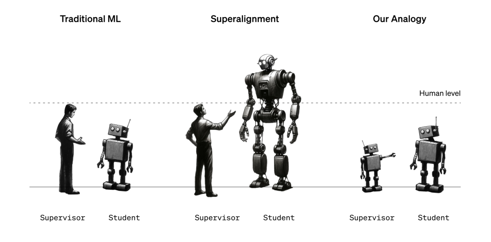
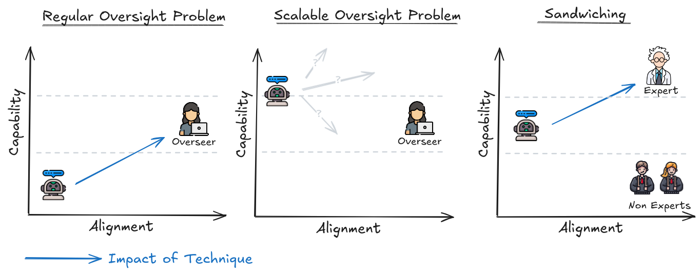

# 8.6 Faible-à-Fort (F2F)

Historiquement, une grande partie des travaux sur l'alignement de l'IA a été très théorique, se concentrant sur les aspects fondamentaux du comportement des agents, l'alignement interne et les risques liés à l'optimisation apprise. Même les techniques dont nous avons parlé dans les sections précédentes, comme le débat ou l'IDA, sont souvent critiquées pour être des cadres plutôt que des solutions pratiques, ou principalement axées sur des problèmes simplifiés sans aborder le défi central de l'alignement de l'IA superintelligente dans des scénarios réels. Alors, même si nous ne pouvons mener des expériences de sécurité que sur des modèles de génération actuelle, comment pouvons-nous être sûrs que ces techniques resteront efficaces à mesure que les IA s'approchent de capacités surhumaines ?

**Les modèles étroitement surhumains permettent des études de cas de supervision adaptative**. Les modèles actuels sont suffisamment performants dans des tâches complexes pour surpasser les humains dans certains domaines, mais de manière cruciale, ils ne sont pas encore meilleurs que tous les humains, ni suffisamment surhumains pour rendre impossible la génération d'étiquettes de vérité ground truth. Ces types de modèles sont parfois qualifiés de surhumains limités. Cette distinction entre surhumain limité et surhumain est primordiale. À titre d'exemple, AlphaGo est surhumain dans le sens où il a battu Lee Sedol, le rendant meilleur que tous les joueurs de go humains, alors que GPT-4 n'est encore capable d'écrire du texte que mieux que certains humains, mais pas tous. Cela signifie que nous pouvons utiliser ces IA étroitement surhumaines comme études de cas ! Nous pouvons faire appel à des experts ou exploiter les étiquettes de vérité ground truth auxquelles nous avons encore accès, et observer si l'alignement progresse lorsque nous appliquons nos techniques de supervision adaptative. ([Cotra, 2021](https://www.alignmentforum.org/posts/PZtsoaoSLpKjjbMqM/the-case-for-aligning-narrowly-superhuman-models))

L'intuition principale ici est de simuler des scénarios futurs où l'humanité, équipée de divers outils et techniques, supervise les sorties de systèmes non fiables mais surhumains. Il existe différentes manières de mener des expériences sur des modèles étroitement surhumains. Nous pouvons utiliser des non-experts équipés de techniques de supervision adaptative pour aligner des modèles d'IA. Une autre approche consiste à utiliser des modèles faibles (par exemple GPT-2) pour représenter les humains, tandis que des modèles plus puissants (par exemple GPT-4) représentent des systèmes d'IA plus capables que nous souhaitons aligner.

**Les modèles plus puissants recèlent probablement des capacités latentes**. L'hypothèse est que les modèles plus puissants, grâce à leur pré-entraînement extensif sur des données diverses, disposent déjà de représentations internes pour le type d'actions que nous recherchons. Le rôle de la supervision à faible signal est de faire émerger ce comportement.

À titre d'exemple concret, imaginez l'utilisation de GPT-4 pour obtenir des conseils médicaux. Il a lu d'innombrables articles de recherche et journaux médicaux. Il dispose de représentations internes riches en informations médicales pertinentes, le rendant théoriquement capable de prodiguer des conseils médicaux hautement compétents. Mais les GPTs sont initialement conçus uniquement pour prédire le mot le plus probable suivant, et non pour donner des conseils précis. Dans ce contexte, « aligner » le modèle signifie l'amener à fournir des conseils médicaux précis et utiles. Une technique que nous pouvons essayer est d'affiner GPT-4 sur des étiquettes générées par GPT-2. Ce n'est pas la seule méthode, il existe d'autres techniques que nous explorerons plus loin dans cette section. Pour l'instant, le point le plus important à comprendre est que nous opérons actuellement sous l'hypothèse que les modèles surhumains actuels et futurs auront probablement des représentations internes significatives des comportements humains.

Qu'est-ce que la généralisation faible-à-fort (W2SG, de l'anglais Weak-to-Strong Generalization) ? La supervision faible consiste à entraîner des modèles d'IA à l'aide d'étiquettes ou de rétroactions qui sont moins précises, moins détaillées ou plus bruitées que celles fournies par des superviseurs hautement compétents ou performants. Ce phénomène survient lorsque les superviseurs (qu'il s'agisse d'humains ou de modèles moins avancés) ne sont pas des experts dans la tâche considérée, ou lorsque les données sont incomplètes ou comportent des inexactitudes.

<figure markdown="span">
{ loading=lazy }
  <figcaption markdown="1"><b>Figure 8.21 :</b> Généralisation Faible-à-Fort : Éliciter des Capacités Fortes avec une Supervision Faible ([Burns et al. 2023](https://arxiv.org/abs/2312.09390))</figcaption>
</figure>

La généralisation faible-à-fort (W2SG) intervient lorsqu'un modèle performant, entraîné au moyen d'une supervision limitée, parvient à surpasser son superviseur initial en exploitant ses connaissances et capacités préexistantes. L'idée fondamentale réside dans le fait que le modèle performant possède déjà les capacités nécessaires au comportement recherché, et que la supervision faible permet de faire émerger ce comportement malgré ses imperfections. Le processus actuel de W2SG commence typiquement par l'affinage d'un grand modèle pré-entraîné via une supervision provenant de modèles plus restreints. Bien que la supervision initiale provienne de ces modèles moins sophistiqués, l'objectif ultime demeure le passage à une supervision humaine. Le but est de révéler le potentiel complet du modèle performant, comme s'il avait été entraîné avec une supervision parfaite de vérité fondamentale. ([Burns et al. 2023](https://arxiv.org/abs/2312.09390))

Dans les expériences actuelles, la configuration implique :

1. Un « superviseur faible » (un petit modèle de langage pré-entraîné) est affiné sur une tâche spécifique, générant des prédictions (étiquettes souples) sur un jeu de données mis de côté.

2. Un « étudiant fort » (un grand modèle de langage pré-entraîné) est affiné sur les prédictions du modèle faible.

3. Un "plafond de performance" (une autre copie du modèle plus grand) est affiné directement sur des étiquettes de ground truth pour une comparaison de référence.

Le niveau de généralisation faible-à-fort est quantifié à l'aide de l'Écart de Performance Récupéré (EPR). L'EPR mesure quelle part de la différence de performance entre un superviseur faible et un modèle fort est comblée lorsque le modèle fort est entraîné au moyen d'une supervision limitée. Lorsque nous entraînons le modèle fort en utilisant les étiquettes fournies par le modèle faible, ses résultats se situeront probablement entre la performance du modèle faible et la performance idéale que le modèle fort pourrait atteindre avec des étiquettes parfaites. L'écart de performance récupéré quantifie à quel point les résultats du modèle fort se rapprochent de sa performance idéale par rapport à celle du modèle faible. Un EPR de 1 correspond à un résultat idéal (le modèle fort performe aussi bien qu'il l'aurait fait avec une supervision parfaite). À l'inverse, un étudiant fort qui « réussit » à imiter parfaitement son superviseur, y compris ses défauts, obtiendrait un EPR de 0. ([Scherlis et al. 2024](https://blog.eleuther.ai/weak-to-strong/))

EPR = \frac{\text{étudiant} - \text{faible}}{\text{plafond} - \text{faible}}

**Limites et disparités de la W2SG**

- **Surapprentissage de la supervision faible** : L'hypothèse selon laquelle un modèle performant généralisera bien à partir d'une supervision limitée n'est pas garantie. Des modèles surhumains pourraient aisément reproduire les erreurs du superviseur faible. Ces modèles seront particulièrement habiles à prédire les pensées et les propos humains, surtout s'ils sont entraînés sur des données humaines. 

Par conséquent, un tel modèle surhumain entraîné de manière naïve par supervision humaine risquerait de simplement imiter le superviseur initial, se limitant à des capacités de niveau humain plutôt que d'exploiter ses capacités surhumaines latentes. 

Les chercheurs utilisent également des pertes de confiance auxiliaires, qui encouragent le modèle performant à formuler des prédictions assurées, même lorsqu'elles contredisent la supervision faible, favorisant ainsi la généralisation et la correction des erreurs du superviseur initial.

- **Hypothèses sur les représentations des tâches**. La W2SG part du principe que les modèles performants disposent de représentations distinctives des tâches sur lesquelles ils sont entraînés. Autrement dit, les modèles possèdent déjà une certaine compréhension de ces tâches dès leur phase de pré-entraînement. Toutefois, cette hypothèse peut s'avérer inexacte pour des tâches inédites ou particulièrement complexes. Si une tâche est totalement nouvelle ou sensiblement plus complexe que ce que le modèle a rencontré durant son pré-entraînement, il se pourrait qu'il ne dispose pas des capacités latentes nécessaires pour performer efficacement, même avec une supervision limitée.

Les expériences de W2SG observées jusqu'à présent ont pu être repérées lors du pré-entraînement, du moins indirectement. En reprenant l'exemple précédent, les données médicales ou les questions et réponses directes concernant la pratique médicale sont présentes dans le jeu de données de pré-entraînement de GPT-4 sous une certaine forme. Cependant, les futurs modèles surhumains pourraient ne jamais observer directement des capacités surhumaines pertinentes pour l'alignement. Ce qui signifie que ces types de capacités pourraient s'avérer plus complexes à faire émerger que les capacités que les modèles auraient pu rencontrer dans leurs données de pré-entraînement. Cette disparité pourrait ainsi conduire à des résultats actuels de W2SG potentiellement trop optimistes.

- **Hypothèse de takeoff lent** : La W2SG repose sur l'hypothèse d'une progression graduelle des capacités de l'IA. Cette progression offre aux chercheurs le temps nécessaire pour utiliser des modèles modérément surhumains et résoudre itérativement les problèmes d'alignement avant qu'il ne soit trop tard. La fenêtre d'opportunité d'un takeoff lent est cruciale pour affiner et tester les techniques d'alignement.

La W2SG peut être considérée comme un complément aux techniques de supervision à grande échelle. La W2SG ne constitue pas une solution définitive. Même si un modèle généralise dans la direction souhaitée, encore faut-il le vérifier, ce qui requiert un signal de référence plus fiable qu'une supervision humaine naïve. En intégrant la W2SG avec une supervision à grande échelle, nous pouvons développer des méthodes plus robustes pour aligner l'IA sur les valeurs humaines, et nous préparer aux défis posés par les futurs systèmes superintelligents.

Par exemple, les techniques de supervision à grande échelle pourraient être utilisées pour générer des signaux de supervision faible qu'un modèle performant apprendra ensuite à généraliser au-delà. En combinant ces approches, nous pouvons créer des protocoles plus robustes pour l'alignement de l'IA. Par exemple, la modélisation récursive de la récompense (RRM, de l'anglais Recursive Reward Modeling) peut utiliser la W2SG pour entraîner des modèles de récompense puissants avec des annotations de préférences humaines. Le débat combiné à la W2SG peut entraîner des modèles à généraliser les jugements humains à de nouveaux débats. La décomposition de tâches combinée à la W2SG peut superviser des tâches atomiques avec un modèle de récompense entraîné à partir des préférences humaines. ([Leike, 2023](https://substack.com/home/post/p-139945470))

L'évaluation de ces techniques dans différents contextes permet de comprendre leurs forces et leurs faiblesses. Dans des environnements sans stratégie dissimulée, où les modèles ne sont pas trompeusement alignés, les techniques classiques de généralisation faible-à-fort et la supervision à grande échelle peuvent être directement comparées. Dans des environnements avec stratégie potentielle, où les modèles pourraient agir de manière antagoniste, les évaluations doivent prendre en compte une potentielle tromperie, fournissant une mesure conservative de la robustesse d'un protocole. 

Lorsqu'il n'y a pas de stratégie (désalignement trompeur), nous pouvons utiliser les techniques de W2SG de manière directe à travers des techniques comme la méthode de l'encadrement. Cependant, s'il y a stratégie (IA trompeusement alignée), elle pourrait agir de manière antagoniste. Dans ce cas, nous pouvons utiliser des propositions comme des techniques adverses de niveau méta. Ces deux aspects sont ce que nous allons discuter dans les sections suivantes.

## 8.6.1 Évaluations par Encadrement {: #01}

L'encadrement est un dispositif expérimental qui exploite des modèles étroitement surhumains pour évaluer l'efficacité de nos techniques de supervision dans des environnements contrôlés. Le dispositif d'encadrement contient trois couches principales :

- **Couche des Non-Experts :** Au niveau inférieur, nous avons des non-experts. Ce sont des personnes qui ne seraient pas capables de résoudre la tâche donnée de manière indépendante. Par exemple, pensez à des profanes auxquels on demanderait de choisir des actions en bourse ou de donner des diagnostics médicaux. Ce sont des équivalents d'une version future de l'humanité. Ils doivent utiliser des techniques de supervision à grande échelle pour guider le comportement de l'IA dans une direction plus alignée.

- **Modèle d'IA :** Au centre, nous avons le modèle d'IA étroitement surhumain que nous cherchons à tester avec la technique de supervision. Ce modèle possède des capacités spécifiques que nous ne parvenons pas à faire émerger complètement. Le non-expert devrait être capable de "aligner" (guider) le modèle pour qu'il adopte le type de comportement souhaité en utilisant la technique de supervision à grande échelle donnée.

- **Couche des Experts :** Au sommet, nous avons des experts du domaine qui évaluent le succès de la tentative d'alignement. Ils servent de référence en fournissant des retours sans interagir directement avec les non-experts ou l'IA pendant le processus. Comme alternative, nous pouvons utiliser des données de référence issues de jeux de données, plutôt que de faire appel à des experts réels.

<figure markdown="span">
{ loading=lazy }
  <figcaption markdown="1"><b>Figure 8.22 :</b> ([Bowman et al., 2022](https://arxiv.org/abs/2211.03540))</figcaption>
</figure>

**Démonstration empirique de l'encadrement**. Les chercheurs ont mené une expérience impliquant des non-experts chargés de répondre à des questions à choix multiples. La tâche portait sur le benchmark MMLU, qui comprend des centaines de questions couvrant les mathématiques, la physique, la morale, l'éthique et divers domaines. ([Hendrycks et. al, 2021](https://arxiv.org/abs/2009.03300)) Les participants devaient également répondre à des questions basées sur de courtes histoires du benchmark QuALITY en 5 minutes. ([Pang et al., 2021](https://arxiv.org/abs/2112.08608)) La technique de supervision à grande échelle utilisée était une amplification simple recourant à un chatbot assistant IA. La performance a été évaluée à l'aide des étiquettes de référence indiquant les réponses correctes dans le jeu de données.

Lorsqu'ils ont été mesurés individuellement, le modèle a surpassé les humains non assistés dans les deux tâches de manière significative. Cela signifie que la condition de base pour tester l'encadrement était remplie : le modèle étant supérieur aux non-experts. Au cours de l'expérience, les humains assistés par le chatbot ont obtenu des scores nettement meilleurs sur les tâches que les humains ou les modèles seuls. ([Bowman et al., 2022](https://arxiv.org/abs/2211.03540)) Bien que ce fût un dispositif extrêmement simplifié, les participants ont réussi à orienter le comportement du modèle dans la direction souhaitée, c'est-à-dire rendre le modèle plus "aligné". Ainsi, les chercheurs ont réussi à démontrer efficacement l'encadrement comme dispositif expérimental. En s'appuyant sur cette base, les futures expériences pourront évaluer l'efficacité de méthodes de supervision à grande échelle plus complexes comme le ré-entraînement, l'ajustement fin ou le débat.