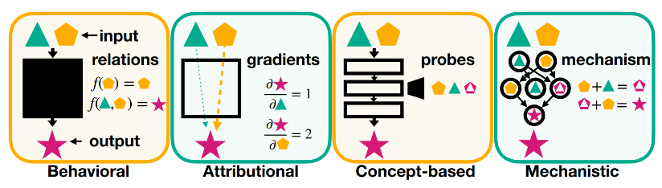

# 9.1 Qu'est-ce que l'interprétabilité ?

    

        <i class="fas fa-clock"></i>
        9 min de lecture
    

    

        <i class="fas fa-file-alt"></i> 
        1838 mots
    

L'interprétabilité est l'étude de la façon et des raisons pour lesquelles les modèles d'IA prennent des décisions. Son objectif central est de comprendre le fonctionnement interne des modèles et les processus qui sous-tendent leurs décisions. Il existe diverses approches de l'interprétabilité, mais dans ce chapitre — et dans le contexte plus large de la sécurité de l'IA — l'**interprétabilité mécanistique (mech interp)** est l'approche principale ([Ras et al., 2020](https://arxiv.org/abs/2004.14545), [Ali et al., 2023](https://www.sciencedirect.com/science/article/pii/S1566253523001148)).[^1]

[^1] : Pour un aperçu du paysage plus large de l'interprétabilité, voir ([Ras et al., 2020](https://arxiv.org/abs/2004.14545) ; [Ali et al., 2023](https://www.sciencedirect.com/science/article/pii/S1566253523001148))

#### **Interprétabilité mécanistique : L'approche ascendante**

L'interprétabilité mécanistique vise à décomposer les réseaux de neurones pour découvrir comment leurs composants internes — tels que les neurones, les poids et les couches — collaborent au traitement de l'information. Cette approche démarre au niveau le plus bas d'abstraction et construit progressivement la compréhension, ce qui explique pourquoi elle est considérée comme une approche ascendante. En analysant ces composants fondamentaux, nous espérons pouvoir reconstituer comment le réseau traite l'information et prend ses décisions.

Par exemple, l'interprétabilité mécanistique pourrait expliquer comment un réseau de neurones reconnaît des objets dans une image ou génère du langage, en détaillant jusqu'aux contributions des neurones individuels ou des têtes d'attention. L'espoir est que ce niveau de détail permettra aux chercheurs de diagnostiquer et potentiellement de corriger des comportements indésirables dans les systèmes d'IA.

#### **Autres approches de l'interprétabilité**

Bien que l'interprétabilité mécanistique soit un point focal majeur dans le domaine de la sécurité de l'IA, ce n'est pas la seule approche. D'autres méthodes offrent des perspectives complémentaires :

- **Interprétabilité basée sur les concepts** : Contrairement à l'interprétabilité mécanistique, l'interprétabilité basée sur les concepts adopte une **approche descendante** : plutôt que d'analyser les neurones ou les poids à un niveau granulaire, elle se concentre sur la compréhension de la manière dont le réseau manipule des **concepts de haut niveau** ([Belinkov, 2022](https://aclanthology.org/2022.cl-1.7/)). Par exemple, *l'ingénierie des représentations* — un programme de recherche basé sur les concepts — explore comment les modèles encodent des concepts tels que "l'honnêteté" et comment ces représentations peuvent être ajustées pour produire des résultats plus honnêtes ([Zou et al., 2023](https://www.semanticscholar.org/paper/Representation-Engineering%3A-A-Top-Down-Approach-to-Zou-Phan/aac3469581061cd5b46440c3eeca91c385d54ccf)).

- **Interprétabilité développementale** : Cette approche examine comment les capacités du modèle et ses représentations internes **évoluent durant l'entraînement**. En comprenant l'émergence des comportements ou des connaissances au fil du temps, les chercheurs espèrent pouvoir identifier l'apparition de certaines capacités et prévenir le développement de celles qui sont indésirables ([Hoogland et al., 2023](https://www.lesswrong.com/s/SfFQE8DXbgkjk62JK/p/TjaeCWvLZtEDAS5Ex)).

- **Interprétabilité comportementale** : Contrairement aux approches précédentes, l'interprétabilité comportementale étudie les **relations entrée-sortie sans approfondir la structure interne des modèles**.

<figure markdown="span">
{ loading=lazy }
  <figcaption markdown="1"><b>Figure 9.1 :</b> Une classification visuelle des techniques d'interprétabilité. ([Bereska & Gavves, 2024](https://arxiv.org/abs/2404.14082)).</figcaption>
</figure>

#### Pourquoi l'interprétabilité mécanistique est importante pour la sécurité de l'IA

L'interprétabilité mécanistique constitue un axe de recherche central dans le domaine de la sécurité de l'IA, car elle offre un niveau de précision que d'autres approches ne permettent pas. L'interprétabilité comportementale, par exemple, fournit des insights sur le comportement d'un modèle en étudiant les relations entrée-sortie, mais elle ne peut pas révéler comment sa structure interne conduit à ses décisions. Pour prévenir que les modèles d'IA ne prennent des décisions préjudiciables ou pour garantir leur alignement avec les valeurs humaines, nous devons comprendre les raisons sous-jacentes à leurs décisions, et potentiellement guider leur processus décisionnel.

Par exemple, en localisant précisément les endroits où sont stockés des concepts nocifs — comme des instructions pour des cyberattaques — les outils d'interprétabilité mécanistique pourraient aider à effacer ou modifier ces concepts sans dégrader les capacités globales du modèle.

## 9.1.1 Motivation pour la sécurité de l'IA ? {: #01 }

L'objectif ultime de l'interprétabilité, du point de vue de la sécurité de l'IA, est de construire de la confiance dans le comportement des modèles complexes en comprenant leurs mécanismes internes et en s'assurant qu'ils agissent de manière sûre et prévisible. Il existe différentes façons dont l'interprétabilité pourrait contribuer à la sécurité de l'IA ([Nanda, 2022](https://www.alignmentforum.org/posts/uK6sQCNMw8WKzJeCQ/a-longlist-of-theories-of-impact-for-interpretability)) :

??? note "Confiance et transparence"

En éclairant les caractéristiques des données d'entrée (comme des éléments spécifiques d'une image ou des mots précis dans une phrase) et les concepts que le modèle mobilise dans son raisonnement, les outils d'interprétabilité facilitent la compréhension, la vérification et la confiance dans le comportement des modèles complexes. Cette approche est particulièrement cruciale dans des domaines à hauts enjeux comme la santé ou les systèmes autonomes, où la fiabilité des décisions de l'IA est essentielle.

En révélant quelles caractéristiques des données d'entrée (comme des éléments spécifiques d'une image ou des mots précis dans une phrase) et quels concepts le modèle utilise dans son raisonnement, les outils d'interprétabilité permettent de mieux comprendre, vérifier et faire confiance au comportement des modèles complexes. Cette approche est particulièrement cruciale dans des domaines à hauts enjeux comme la santé ou les systèmes autonomes, où la fiabilité des décisions de l'IA est essentielle.

??? note "Améliorer l'édition du modèle"

En révélant les caractéristiques des données d'entrée (éléments spécifiques d'une image ou mots précis) et les concepts mobilisés par le modèle, les outils d'interprétabilité facilitent la compréhension, la vérification et la confiance dans le comportement des modèles complexes. Cette approche est cruciale dans des domaines à hauts enjeux comme la santé ou les systèmes autonomes, où la fiabilité des décisions de l'IA est primordiale.

L'interprétabilité pourrait être utilisée pour **atténuer les mésusages en effaçant des connaissances spécifiques** des réseaux de neurones, comme les connaissances relatives à la conduite de cyberattaques ou à la fabrication d'armes biologiques.

Certains outils d'interprétabilité mécanistique servent à localiser où certains concepts sont encodés dans un modèle (ceux-ci sont abordés dans la section *Méthodes d'observation*). Par exemple, les chercheurs pourraient identifier comment les modèles génèrent des réponses à des requêtes nocives comme "étapes de création d'un virus" et utiliser des méthodes d'effacement de connaissances pour supprimer ces connaissances du modèle.

*[Détournement de récompense] : Le détournement de récompense intervient lorsqu'un agent d'IA exploite des failles ou des raccourcis dans l'environnement pour maximiser sa récompense sans atteindre l'objectif initialement visé.

??? note "Détection des comportements indésirables"

Certains outils d'interprétabilité mécanistique permettent de localiser l'encodage de concepts spécifiques dans un modèle (abordés dans la section *Méthodes d'observation*). Par exemple, les chercheurs peuvent identifier comment les modèles génèrent des réponses à des requêtes nocives, comme "étapes de création d'un virus", et utiliser des méthodes d'effacement de connaissances pour les supprimer du modèle.

L'interprétabilité pourrait aider à identifier quand les modèles ne fonctionnent pas de manière attendue ou ont appris des comportements ou des schémas indésirables. Pour la recherche en alignement, elle pourrait être utilisée pour détecter, analyser et comprendre les réponses non désirées des modèles.

Un exemple emblématique provient d'un modèle entraîné pour classifier des radiographies thoraciques. Les chercheurs ont découvert qu'au lieu de se concentrer sur des caractéristiques médicales comme les conditions pulmonaires, le modèle exploitait des artefacts subtils provenant de l'équipement de numérisation ou des marqueurs présents dans l'image pour établir ses prédictions. Le modèle obtenait ainsi de bons résultats lors des tests, mais pour des raisons totalement inappropriées. En mobilisant des outils d'interprétabilité, les chercheurs ont pu identifier et corriger ce biais ([DeGrave et al., 2021](https://www.nature.com/articles/s42256-021-00338-7)).

Les incitations économiques peuvent jouer un rôle significatif dans l'émergence de points de bascule lors du développement de systèmes d'IA avancés, influençant potentiellement leur comportement et leurs objectifs.

??? note "Extrapolation"

<UNKNOWN>

Certains espèrent qu'en comprenant le fonctionnement des modèles actuels, l'interprétabilité pourra aider à prédire comment les modèles futurs et plus grands se comporteront, si de nouvelles capacités ou risques émergeront, et comment les systèmes évolueront lors de leur montée en échelle.

À mesure que les systèmes d'IA deviennent plus complexes et autonomes, les chercheurs s'intéressent de plus en plus aux incitations économiques et aux points de bascule potentiels qui pourraient influencer leur comportement.

Il est important de noter que bien que ces objectifs soient prometteurs, le domaine de l'interprétabilité est encore en plein développement. L'adoption des outils d'interprétabilité dans des scénarios réels reste limitée, et l'évaluation de leur qualité demeure complexe. De nombreuses techniques existantes en interprétabilité ne sont pas conçues pour une utilisation à grande échelle et pour les modèles de l'état de l'art. Ces limitations seront explorées plus en détail dans la section **Critiques de l'Interprétabilité**.

## 9.1.2 Quel est l'objectif final de l'interprétabilité ? {: #02 }

Quels résultats concrets l'interprétabilité devrait-elle permettre d'obtenir pour rendre les systèmes d'IA plus sûrs et prévisibles ? Il existe différentes opinions sur les objectifs finaux de l'interprétabilité, incluant les approches suivantes :

#### **Sécurité énumérative : Catalogage des concepts pour le contrôle**

La sécurité énumérative cherche à identifier et à cataloguer de manière exhaustive l'ensemble des concepts et comportements encodés dans un modèle. Le principe est le suivant : si nous parvenons à comprendre et à énumérer chaque action potentielle du modèle, nous pourrions éliminer de manière sélective les comportements indésirables et garantir que le modèle ne puisse réaliser que des actions sûres et souhaitables ([Elhage et al., 2022](https://transformer-circuits.pub/2022/toy_model/index.html)).

Par exemple, si un modèle de langage encode des instructions nuisibles - comme des étapes pour créer une cyberattaque - la sécurité énumérative impliquerait de localiser et d'éliminer ces connaissances sans altérer les fonctions utiles du modèle.

<figure markdown="span">
{ loading=lazy }
  <figcaption markdown="1"><b>Figure 9.2 :</b> La sécurité énumérative vise à garantir que dans toutes les situations, le modèle ne fait pas quelque chose que nous ne voulons pas. D'après ([Olah, 2023](https://transformer-circuits.pub/2023/interpretability-dreams/index.html)).</figcaption>
</figure>

#### **Réorientation de la recherche : Piloter les objectifs du modèle**

La réorientation de la recherche représente un objectif plus ambitieux : au lieu de supprimer les comportements nuisibles, elle cherche à **modifier directement les objectifs du modèle**. Cela implique d'identifier comment le modèle représente en interne ses objectifs et de **réorienter ces représentations pour les aligner sur les valeurs humaines**.

Contrairement à la sécurité énumérative, la réorientation ne nécessite pas une rétro-ingénierie exhaustive du modèle. Elle se concentre plutôt sur la modification de composants spécifiques tout en préservant la fonctionnalité globale du système. Par exemple, si un modèle a appris à optimiser des résultats nuisibles, les chercheurs pourraient réorienter cette optimisation vers des objectifs bénéfiques ([johnswentworth, ](https://www.alignmentforum.org/posts/w4aeAFzSAguvqA5qu/how-to-go-from-interpretability-to-alignment-just-retarget)[2022](https://www.alignmentforum.org/posts/w4aeAFzSAguvqA5qu/how-to-go-from-interpretability-to-alignment-just-retarget)).

#### **Entraînement adversarial relaxé : Tester et améliorer la corrigibilité**

L'entraînement adversarial relaxé est une approche conçue pour améliorer la robustesse des systèmes d'IA, en particulier pour **garantir leur corrigibilité** - leur capacité à accepter et à faciliter des interventions correctives. Alors que l'entraînement adversarial classique teste la robustesse d'un modèle en l'exposant à des entrées adverses, cette méthode se distingue en opérant des perturbations dans l'espace latent du modèle, en utilisant des vecteurs latents adverses plutôt que des entrées réelles.

L'interprétabilité mécaniste pourrait servir à identifier des vecteurs latents qui correspondent à des comportements spécifiques du modèle, comme la corrigibilité ou l'alignement avec les intentions de l'utilisateur. L'objectif serait ensuite de tester la capacité du modèle à résister à la corrigibilité en manipulant directement sa représentation interne ([Christiano, 2019](https://ai-alignment.com/training-robust-corrigibility-ce0e0a3b9b4d)).

#### **Détection Mécanique d'Anomalies (****DMA****) : Repérer les Écarts**

La détection mécanique d'anomalies (MAD) se concentre sur l'identification des cas où un modèle produit des résultats pour des *raisons inhabituelles*. Alors que les méthodes traditionnelles d'interprétabilité visent à comprendre exhaustivement les mécanismes d'un modèle, MAD adopte une approche plus ciblée : elle signale les anomalies dans le processus de prise de décision sans nécessiter une compréhension complète des mécanismes sous-jacents.

Par exemple, MAD pourrait détecter quand le raisonnement d'un modèle s'écarte de ses schémas habituels, comme lorsqu'il s'appuie sur des corrélations trompeuses plutôt que sur des caractéristiques significatives. Les insights de l'interprétabilité mécaniste pourraient être utiles pour signaler les cas où un modèle opère en dehors de ses schémas habituels de comportement ([Jenner, 2024](https://www.lesswrong.com/s/GiZ6puwmHozLuBrph/p/n7DFwtJvCzkuKmtbG)).

## 9.1.3 Aperçu du Domaine de l'Interprétabilité Mécaniste {: #03 }

L'interprétabilité mécaniste est un domaine diversifié, mais ses techniques peuvent être globalement catégorisées en deux approches principales : **méthodes d'observation** et **méthodes d'intervention**[^2]. Ces catégories reflètent deux stratégies complémentaires pour comprendre comment les réseaux de neurones traitent l'information.

??? note "Méthodes d'observation : Analyser sans Intervenir"

??? note "Méthodes d'observation : Analyser sans Intervenir"

**Les méthodes d'observation visent à analyser les structures internes d'un modèle—telles que les neurones, les activations et les poids—sans les modifier directement**. Ces techniques permettent d'observer les représentations et les zones de carence d'un modèle dans ses calculs internes, sans pour autant révéler comment ou si le modèle mobilise ces informations lors de l'inférence. Elles englobent des techniques telles que les classificateurs exploratoires, le *Logit Lens*, et les *auto-encodeurs parcimonieux* (SAEs).

Par exemple, dans une étude d'un réseau neuronal jouant aux échecs, des chercheurs ont utilisé des classificateurs exploratoires pour *examiner si le réseau encodait des états du plateau et des concepts stratégiques*. Ils ont découvert que le modèle avait appris à représenter des caractéristiques critiques telles que la possibilité pour un joueur de capturer la dame de son adversaire ou le nombre de pièces contrôlées par chaque camp ([McGrath et al., 2022](https://www.pnas.org/doi/10.1073/pnas.2206625119)).

Les méthodes d'observation fournissent une base essentielle pour comprendre les représentations du modèle, mais elles présentent des limites. En particulier, elles ne permettent pas de déterminer si les représentations observées influencent causalement le comportement du modèle.

Les méthodes d'observation fournissent une base essentielle pour comprendre les représentations du modèle, mais elles présentent des limites. Notamment, elles ne permettent pas de déterminer si les représentations observées ont une influence causale réelle sur le comportement du modèle.

??? note "Méthodes d'intervention : Manipulation pour des insights causaux"

Méthodes d'intervention : Manipulation pour des Insights Causaux

Les méthodes d'intervention franchissent un pas supplémentaire en **manipulant activement les éléments internes d'un modèle pour comprendre leur rôle causal dans la prise de décision**. En modifiant des activations ou des paramètres, les chercheurs peuvent tester la contribution de composants spécifiques au comportement global.

Les interventions nous aident à identifier les informations utilisées par le modèle, et comment elles sont utilisées. Elles incluent des techniques telles que le *patching d'activations* et le *pilotage d'activations*.

Par exemple, des chercheurs chez Anthropic ont démontré le potentiel des méthodes d'intervention en manipulant les activations d'un modèle en temps réel. Ils ont été capables de lui donner un ton plus joyeux dans ses réponses, de modifier ses préférences et objectifs déclarés, de changer ses biais — le conduisant à produire un contenu plus offensant ou nocif —, et d'induire des types d'erreurs spécifiques, comme des erreurs de codage, que le modèle éviterait habituellement ([Templeton et al., 2024](https://transformer-circuits.pub/2024/scaling-monosemanticity/index.html)).

Les méthodes d'observation, comme vous le verrez, peuvent servir de fondement aux méthodes d'intervention car elles guident les points d'intervention. Par exemple, une étude observationnelle pourrait identifier une couche encodant une caractéristique critique, ce qui peut ensuite motiver une intervention pour tester si et comment cette caractéristique influence les sorties.

[^2] : Nous suivons la classification introduite par ([Bereska et Gavves, 2024](https://arxiv.org/abs/2404.14082)). Bien que cela puisse être discuté, nous pensons qu'elle offre aux nouveaux venus une introduction claire aux fondamentaux du domaine.

    ❧

