# 9.2 Méthodes d'observation

    

        <i class="fas fa-clock"></i>
        34 min de lecture
    

    

        <i class="fas fa-file-alt"></i> 
        6795 mots
    

## 9.2.1 Visualisation des cartes des activations

La visualisation des caractéristiques constitue l'une des premières méthodes d'observation en interprétabilité des mécanismes internes. Elle permet aux chercheurs d'explorer les caractéristiques qu'un modèle de vision apprend et utilise à différentes couches. Dans cette section, nous expliquerons en détail ce qu'est la visualisation des caractéristiques et les découvertes qu'elle a permises.

#### **Qu'est-ce qu'une caractéristique ?**

Une caractéristique représente un motif dans les données d'entrée qu'un réseau neuronal apprend à identifier. Les modèles intègrent ces caractéristiques car elles permettent de décomposer des entrées complexes, telles que des images ou du texte, en composants interprétables qui guident les prédictions du modèle.

Les modèles de vision entraînés pour la classification d'images possèdent couramment des caractéristiques correspondant à des chats, des chiens, des voitures, des yeux, des fruits, etc. Les caractéristiques des modèles de vision varient en complexité selon la couche où elles sont identifiées. Dans les couches initiales, les caractéristiques représentent généralement des motifs simples de bas niveau, tels que des contours, des couleurs ou des textures au sein du modèle de vision. En progressant vers des couches plus profondes, les caractéristiques deviennent plus abstraites et complexes, représentant des concepts de haut niveau comme des formes, des objets, voire des entités spécifiques telles que des visages ou des animaux. Cette *structure hiérarchique des caractéristiques* permet aux modèles de traiter progressivement les données de pixels bruts en concepts de plus en plus élaborés, jusqu'à la classification finale de l'image. Par exemple, la reconnaissance d'une voiture débuterait par la détection de contours (caractéristiques de bas niveau), puis de formes spécifiques (comme des roues), pour aboutir à l'identification de la voiture complète (caractéristique de haut niveau).

Dans les modèles de transformers, les chercheurs ont identifié des caractéristiques correspondant à des concepts spécifiques tels que des séquences d'ADN, un langage juridique, des requêtes HTTP ou un texte en hébreu. Par exemple, lorsqu'un modèle de transformers rencontre une séquence d'ADN, les neurones codant la "caractéristique ADN" s'activent avec une forte intensité. De même, face à une phrase comme "La cour a statué en faveur du défendeur car...", des caractéristiques associées au langage juridique et aux structures de phrases typiques des contextes juridiques peuvent s'activer, aidant le modèle à anticiper une suite impliquant un raisonnement ou une justification, comme "...les preuves présentées étaient insuffisantes".

Ces caractéristiques sont des éléments essentiels que les modèles utilisent pour donner un sens aux données d'entrée et faire des prédictions.

#### **Comment fonctionne la visualisation des caractéristiques ?**

**La visualisation des caractéristiques** est une technique qui permet d'explorer les représentations internes des réseaux de neurones convolutifs (CNN, de l'anglais *Convolutional Neural Networks*) et d'observer les motifs qu'un modèle a appris à reconnaître. Elle consiste à générer des images qui maximisent l'activation de neurones spécifiques, de cartes des activations (sorties d'une couche convolutive), ou même de couches entières au sein du modèle ([Cammarata et al., 2020](https://distill.pub/2020/circuits/)).

<figure markdown="span">
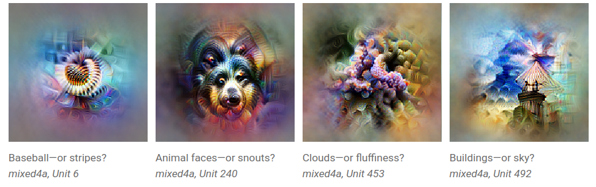{ loading=lazy }
  <figcaption markdown="1"><b>Figure 9.3 :</b> Exemples de visualisations de caractéristiques. Il semble que le réseau ait appris à représenter et détecter des balles de baseball, des visages d'animaux, des nuages et des bâtiments, mais les visualisations de caractéristiques doivent être interprétées et peuvent ne pas détecter ce que nous pensons initialement. D'après ([Olah et al., 2017](https://distill.pub/2017/feature-visualization/)).</figcaption>
</figure>

Les premières recherches en neurosciences visaient à comprendre le cerveau en identifiant les images qui excitaient fortement des neurones spécifiques. Cela a aidé les neuroscientifiques à découvrir des zones cérébrales dédiées à l'identification des visages, des mouvements, des scènes naturelles, etc. **La visualisation des caractéristiques** peut être considérée comme une approche quelque peu similaire utilisée pour les réseaux de neurones convolutifs (CNN, de l'anglais *Convolutional Neural Networks*) ([Olah et al., 2017](https://distill.pub/2017/feature-visualization/)).

Ces caractéristiques apprises - qu'il s'agisse de motifs simples comme des contours ou d'objets complexes - constituent les briques fondamentales qui permettent aux modèles de comprendre et de traiter les données d'entrée. Cependant, les caractéristiques n'agissent pas de manière isolée. Lorsque le réseau traite l'information, ces caractéristiques interagissent et se combinent de façon structurée, formant souvent des unités plus complexes connues sous le nom de circuits. Un circuit représente un groupe de caractéristiques interconnectées qui collaborent pour accomplir une fonction spécifique.

Par exemple, voici un circuit qui reconnaît une voiture dans les couches intermédiaires d'un réseau de neurones convolutif (CNN). Ce circuit combine des caractéristiques de bas niveau telles que des fenêtres, des carrosseries de voitures et des roues pour détecter la présence d'une voiture dans une image. Le circuit permet au modèle de reconnaître l'objet entier, bien qu'aucune caractéristique individuelle ne puisse le faire seule.

<figure markdown="span">
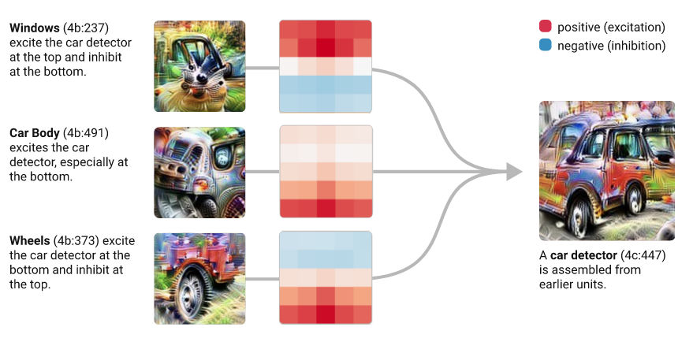{ loading=lazy }
  <figcaption markdown="1"><b>Figure 9.4 :</b> Un circuit de voiture dans un CNN. À gauche, trois cartes des activations de la couche 4b sont représentées par leurs visualisations de caractéristiques. Une carte semble détecter des fenêtres, une autre des carrosseries de voitures, et la troisième des roues. Ces trois cartes des activations sont connectées à une carte des activations de la couche 4c, représentée par la visualisation à droite, via les noyaux convolutifs montrés au milieu. Les caractéristiques de fenêtres, de carrosserie et de roues sont assemblées pour former un circuit complet de détection de voitures. D'après ([Olah et al., 2020](https://distill.pub/2020/circuits/early-vision/)).</figcaption>
</figure>

??? note "Rappel de vocabulaire"

- Une **caractéristique** fait référence à un motif ou un attribut spécifique que le réseau apprend à détecter. Ces caractéristiques sont les unités fondamentales que les modèles utilisent pour traiter l'information et prendre des décisions.

- **La visualisation des caractéristiques** est une méthode qui nous permet d'identifier les caractéristiques apprises par un CNN, ce qui peut nous aider à comprendre comment il traite l'information et prend des décisions.

- Un **circuit** est un groupe de caractéristiques interconnectées qui collaborent pour accomplir une fonction spécifique. Les circuits sont essentiellement des caractéristiques de haut niveau, composées de manière récursive à partir de caractéristiques de bas niveau. La notion de circuit s'applique à toute architecture de modèle, y compris les grands modèles de langage (LLM, de l'anglais Large Language Models). L'identification des circuits qui exécutent des fonctions spécifiques dans les modèles est un domaine de recherche en interprétabilité mécaniste.

- Une **carte des activations** dans un CNN est la sortie d'une couche convolutive. Elle est également appelée canal. La visualisation des caractéristiques est souvent appliquée à l'échelle des cartes des activations - au lieu de neurones individuels ou de couches entières - pour comprendre quelles caractéristiques elles encodent.

<figure markdown="span">
    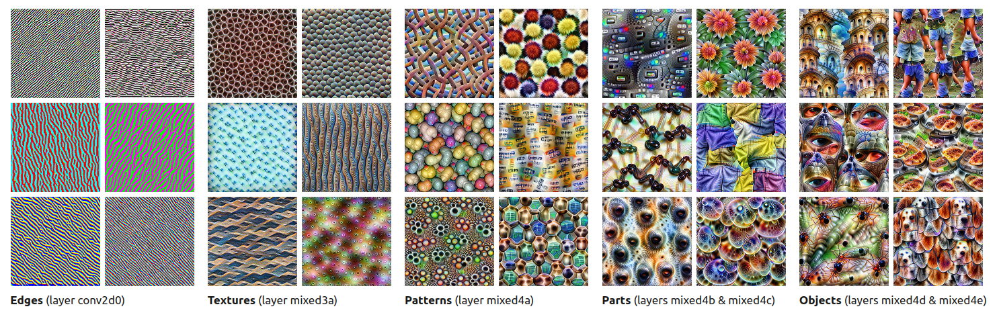{ loading=lazy }
      <figcaption markdown="1"><b>Figure 9.5 :</b> Quelques exemples de visualisations de caractéristiques sur un CNN entraîné pour la classification d'images. Chaque image correspond à une carte des activations. Certaines cartes des activations sont sensibles aux motifs avec des contours, d'autres à différents types de motifs texturés, ou à des objets comme des yeux, des visages de chiens ou des jambes. D'après ([Olah et al., 2017](https://distill.pub/2017/feature-visualization/)).</figcaption>
</figure>

### 9.2.1.1 Méthode de Visualisation des Caractéristiques {: #01 }

!!! warning "Vous trouverez ci-dessous des détails supplémentaires pour les personnes intéressées. Ils peuvent être ignorés sans risque."

<figure markdown="span">
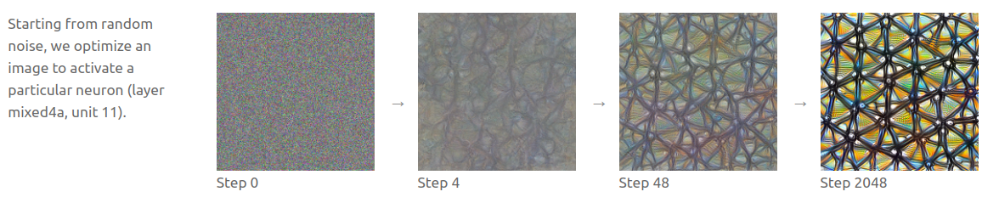{ loading=lazy }
  <figcaption markdown="1"><b>Figure 9.6 :</b> Vue d'ensemble du processus de visualisation des caractéristiques. À partir d'un neurone (ou d'un ensemble de neurones) dans un CNN, la visualisation des caractéristiques génère une image qui le(s) activate fortement, en partant d'une image aléatoire, et en passant par des étapes d'optimisation successives. L'image optimisée illustre le type de motif auquel l'une des cartes des activations de la quatrième couche d'InceptionV1 est sensible ([Olah et al., 2017](https://distill.pub/2017/feature-visualization/)).</figcaption>
</figure>

Générer une visualisation des caractéristiques implique :

1. **Sélectionner une cible** : Choisir un neurone, une carte des activations ou une couche à visualiser. La plupart des visualisations de caractéristiques sont réalisées sur des cartes des activations.

2. **Commencer avec une image d'entrée aléatoire** : Démarrer l'optimisation à partir d'une image de bruit aléatoire. Elle sera ajustée pour maximiser l'activation du neurone ou du filtre cible.

3. **Calculer le gradient**: Utiliser la rétropropagation pour déterminer les modifications à apporter à l'image afin de maximiser l'activation du neurone ou de la carte des activations cible.

4. **Optimiser l'image** : Appliquer de manière itérative l'algorithme de gradient ascent pour ajuster progressivement l'image.

5. **Répéter les étapes de gradient ascent** : Ajuster légèrement l'image à chaque itération pour améliorer l'activation du neurone ou de la carte des activations.

6. **Visualiser le résultat** : L'image finale révèle les motifs ou structures que la cible a appris à détecter.

<figure markdown="span">
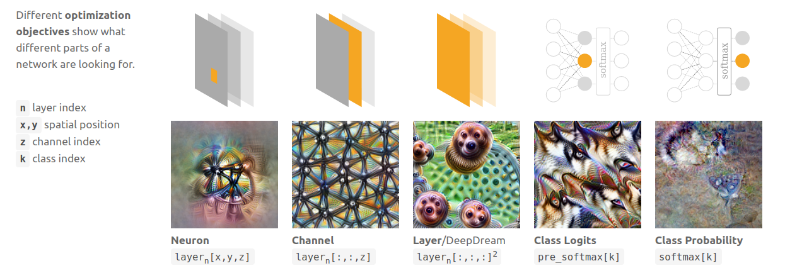{ loading=lazy }
  <figcaption markdown="1"><b>Figure 9.7 :</b> Les visualisations des caractéristiques peuvent être produites pour des neurones individuels ou des groupes de neurones, comme une carte des activations, voire une couche entière. D'après ([Olah et al., 2017](https://distill.pub/2017/feature-visualization/)).</figcaption>
</figure>

### 9.2.1.2 Circuits

Chaque couche dans un CNN extrait progressivement des caractéristiques de plus en plus complexes de l'image. Les neurones des premières couches répondent à des motifs rudimentaires et abstraits tels que des courbes, des angles et de petites formes, à l'instar des premières couches du cortex visuel humain. En progressant plus profondément dans le réseau, les neurones détectent des objets de plus en plus complexes et spécifiques, tels que des yeux, des animaux, des voitures, etc. ([Olah et al., 2020](https://distill.pub/2020/circuits/zoom-in/)). De manière intéressante, certains de ces groupes de neurones se répètent à travers différentes architectures de modèles et conditions d'entraînement ([Olah et al., 2020](https://distill.pub/2020/circuits/early-vision/)).

<figure markdown="span">
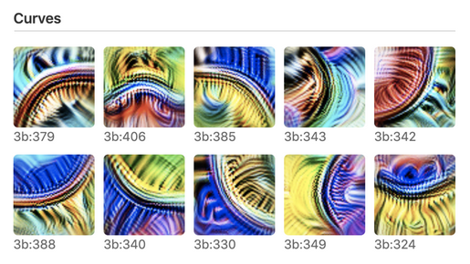{ loading=lazy }
  <figcaption markdown="1"><b>Figure 9.8 :</b> Les détecteurs de courbes sont universellement présents dans les premières couches des CNN, ils existent dans différentes orientations et couleurs et couvrent collectivement toutes les orientations. Chaque détecteur de courbes répond à une grande variété de courbes, dans différentes orientations. D'après ([Olah et al., 2020](https://distill.pub/2020/circuits/zoom-in/)).</figcaption>
</figure>

Les CNN apprennent couramment des détecteurs de fréquences haute et basse dans leurs premières couches.

<figure markdown="span">
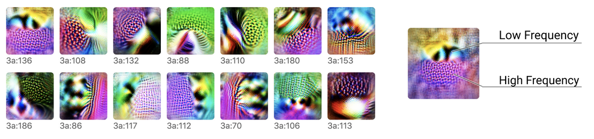{ loading=lazy }
  <figcaption markdown="1"><b>Figure 9.9 :</b> Les détecteurs de fréquences haute-basse recherchent des motifs de basse fréquence d'un côté de leur champ récepteur, et des motifs de haute fréquence de l'autre côté. Ils existent dans différentes orientations et couleurs. D'après ([Olah et al., 2020](https://distill.pub/2020/circuits/early-vision/)).</figcaption>
</figure>

Dans les couches plus profondes, les détecteurs de fréquences haute-basse se combinent pour former des détecteurs de contours.

<figure markdown="span">
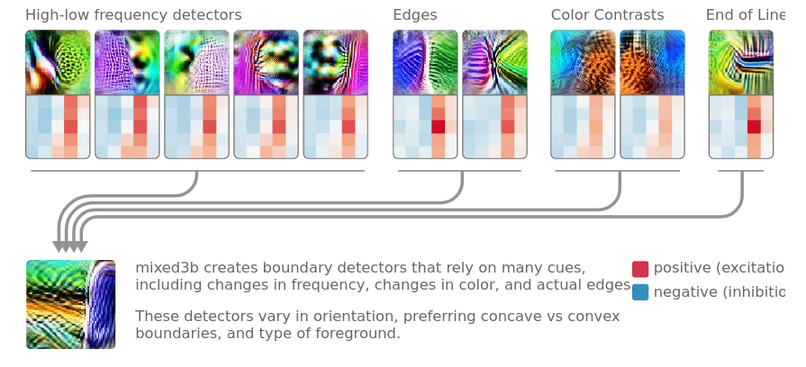{ loading=lazy }
  <figcaption markdown="1"><b>Figure 9.10 :</b> Un neurone détecteur de contours formé dans la troisième couche d'un CNN (illustré en bas à gauche avec sa visualisation de caractéristiques). La rangée du haut montre les visualisations de caractéristiques issues des neurones de la deuxième couche et des noyaux les connectant à la troisième couche. De nouveaux neurones se forment en combinant des indices provenant de neurones plus élémentaires des couches précédentes : ici, le neurone détecteur de contours se forme en combinant des neurones détecteurs de fréquences haute-basse, des neurones détecteurs de bords, des neurones détecteurs de contraste de couleur, etc. D'après ([Olah et al., 2020](https://distill.pub/2020/circuits/early-vision/)).</figcaption>
</figure>

### 9.2.1.3 Neurones Polysémantiques {: #03 }

Alors que la visualisation des caractéristiques a permis une compréhension plus approfondie de la façon dont les CNN représentent l'information, elle a également mis en lumière des défis tels que le *polysémantisme*. Un phénomène intrigant se produit lorsque l'on examine les neurones qui suivent le détecteur de voitures et qui y sont fortement connectés. Certains de ces neurones répondent non seulement aux images de voitures mais aussi à des stimuli sans rapport, comme des images de chiens. Cela indique que la « caractéristique de voiture » se propage à travers plusieurs neurones qui répondent à des entrées apparemment non liées. Ce sont ce qu'on appelle des *neurones polysémantiques* — des neurones qui s'activent en réponse à une variété de caractéristiques distinctes. Par contraste, les *neurones monosémantiques* répondent exclusivement à une caractéristique ou un stimulus spécifique.

<figure markdown="span">
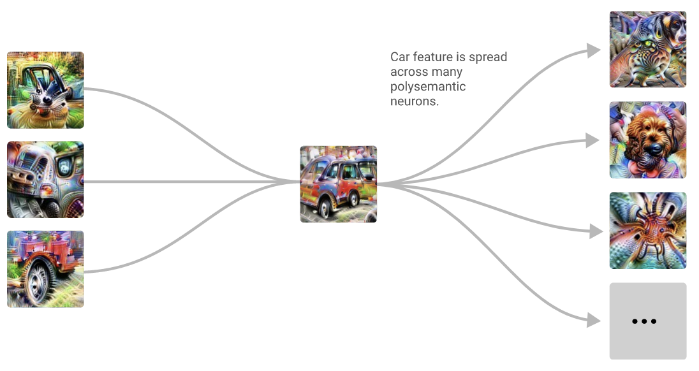{ loading=lazy }
  <figcaption markdown="1"><b>Figure 9.11 :</b> À gauche se trouve le circuit détecteur de voitures de la figure précédente. Une fois que des concepts distincts sont formés, ils deviennent emmêlés dans des neurones polysémantiques, comme un neurone qui répond à la fois à des images de voitures et de chiens. D'après ([Olah et al., 2020](https://distill.pub/2020/circuits/early-vision/)).</figcaption>
</figure>

<figure markdown="span">
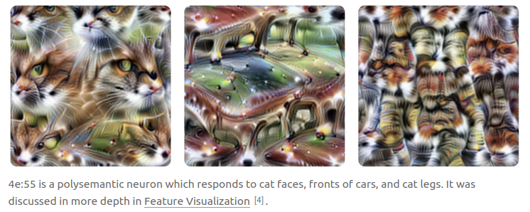{ loading=lazy }
  <figcaption markdown="1"><b>Figure 9.12 :</b> Visualisation multiple des caractéristiques réalisée sur un neurone polysémantique qui répond à des images de voitures, ainsi qu'à des visages de chats et des pattes de chats. D'après ([Olah et al., 2020](https://distill.pub/2020/circuits/early-vision/)).</figcaption>
</figure>

Les neurones polysémantiques sont extrêmement répandus. Dans un modèle de langage de taille réduite, on peut par exemple observer un neurone capable de réagir simultanément à des dialogues en anglais, des textes coréens, des requêtes HTTP et des citations académiques ([Bricken et al., 2023](https://transformer-circuits.pub/2023/monosemantic-features)). Cela signifie qu'aucun neurone ne correspond à une caractéristique unique. Dès lors, chercher à comprendre le comportement d'un réseau en se concentrant sur des neurones individuels s'avère totalement inadéquat. Les neurones ne constituent pas les unités fondamentales pertinentes pour analyser ces modèles.

Le polysémantisme pose un défi pour l'interprétabilité car il nécessite de comprendre comment les caractéristiques sont encodées à travers plusieurs neurones, plutôt que de supposer que chaque neurone représente une unité sémantique distincte. L'identification des modalités d'encodage de ces caractéristiques distribuées constitue un domaine de recherche actuellement dynamique en interprétabilité.

L'hypothèse dominante pour expliquer l'émergence du polysémantisme dans les réseaux de neurones est appelée l'*hypothèse de superposition*. Les grands modèles doivent apprendre un nombre considérable de caractéristiques pour fonctionner efficacement, probablement plus que le nombre de neurones dont ils disposent. Par conséquent, les modèles ne peuvent pas attribuer chaque caractéristique à un neurone unique. Ils doivent plutôt encoder les caractéristiques de manière plus compressée. L'hypothèse de superposition postule que les modèles représentent plus de caractéristiques qu'ils n'ont de neurones en encodant plusieurs caractéristiques par neurone, ces caractéristiques étant orientées dans des directions presque orthogonales. En d'autres termes, les modèles compriment l'information en superposant des caractéristiques à travers plusieurs neurones.

??? note "Polysémantisme vs Superposition"

??? note "Polysémantisme vs Superposition"

La distinction entre le polysémantisme et l'hypothèse de superposition est importante ([Bereska et Gavves, 2024](https://arxiv.org/abs/2404.14082)) :

- **Polysémantisme** fait référence au *phénomène empirique* où un neurone représente ou répond à plusieurs caractéristiques non reliées,

- **L'hypothèse de superposition**, en revanche, fait généralement référence à une *hypothèse* qui cherche à expliquer le polysémantisme. Elle postule que lorsque les modèles ont plus de caractéristiques à représenter qu'ils n'ont de neurones pour les représenter, ils doivent compresser ces caractéristiques dans un espace limité. Cette compression contraint les caractéristiques à se superposer à travers les neurones. Cela expliquerait pourquoi nous observons des neurones répondant à plusieurs caractéristiques apparemment sans lien. Bien que la superposition conduise intrinsèquement au polysémantisme, le polysémantisme lui-même n'implique pas toujours la superposition, car il pourrait théoriquement émerger par d'autres mécanismes.

??? note "Polysémantisme vs Superposition"

La distinction entre le polysémantisme et l'hypothèse de superposition est importante ([Bereska et Gavves, 2024](https://arxiv.org/abs/2404.14082)) :

- **Polysémantisme** fait référence au *phénomène empirique* où un neurone représente ou répond à plusieurs caractéristiques non reliées,

- **L'hypothèse de superposition**, en revanche, fait généralement référence à une *hypothèse* qui cherche à expliquer le polysémantisme. Elle postule que lorsque les modèles ont plus de caractéristiques à représenter qu'ils n'ont de neurones pour les représenter, ils doivent compresser ces caractéristiques dans un espace limité. Cette compression contraint les caractéristiques à se superposer à travers les neurones. Cela expliquerait pourquoi nous observons des neurones répondant à plusieurs caractéristiques apparemment sans lien. Bien que la superposition conduise intrinsèquement au polysémantisme, le polysémantisme lui-même n'implique pas toujours la superposition, car il pourrait théoriquement émerger par d'autres mécanismes.

**Comprendre et traiter le polysémantisme est un domaine de recherche actif. Diverses orientations sont explorées**

- **Représentations parcimonieuses :** Concevoir des réseaux utilisant des représentations parcimonieuses (où moins de neurones sont actifs à la fois) pourrait réduire le polysémantisme ([Elhage et al., 2022](https://transformer-circuits.pub/2022/solu/index.html)). Cette approche n'a pas été largement explorée car elle s'accompagne de compromis de performance significatifs.

- **Démêler les caractéristiques :** Certaines approches impliquent de décomposer les activations neuronales complexes pour isoler des caractéristiques individuelles. Une approche prometteuse dans cette ligne de recherche, connue sous le nom d'auto-encodeurs parcimonieux, est une technique qui dissocie et extrait les caractéristiques individuelles du réseau ([Bricken et al., 2023](https://transformer-circuits.pub/2023/monosemantic-features)). Elle est expliquée plus en profondeur dans la section *Auto-encodeurs parcimonieux*.

La visualisation des caractéristiques a permis de dégager plusieurs perspectives fondamentales sur le mécanisme opérationnel des réseaux neuronaux de vision :

- **Structure hiérarchique** : Les réseaux neuronaux apprennent les caractéristiques de manière hiérarchique, avec les couches initiales détectant des motifs simples et les couches plus profondes combinant ces motifs en objets complexes. Par exemple, des détecteurs de courbes dans les couches initiales se combinent en détecteurs de contours dans les couches intermédiaires et finalement en détecteurs d'objets complets dans les couches plus profondes.

- **Circuits** : Les caractéristiques interagissent pour former des "circuits" - des groupes de caractéristiques interconnectées qui accomplissent collectivement une fonction spécifique. Par exemple, un circuit pour détecter des voitures pourrait combiner des caractéristiques comme des roues, des fenêtres et des formes de carrosserie en une représentation cohérente d'une voiture.

- **Polysémantisme** : La visualisation des caractéristiques a révélé le phénomène du **polysémantisme**, où des neurones ou des caractéristiques individuels dans un réseau neuronal répondent à plusieurs concepts apparemment non reliés. Ce chevauchement complique notre capacité à attribuer des rôles clairs et interprétables aux neurones individuels.

- **Universalité** : Certaines caractéristiques, comme les détecteurs de bords ou de courbes, sont universelles à travers les modèles et architectures. Cela suggère que certaines caractéristiques sont fondamentales pour le traitement visuel, indépendamment de la tâche ou du jeu de données spécifique.

## 9.2.2 Lentille logistique {: #02 }

La **Lentille logistique** ([nostalgebraist, 2020](https://www.alignmentforum.org/posts/AcKRB8wDpdaN6v6ru/)) est l'un des premiers outils développés pour explorer l'intérieur des transformers. Elle permet d'observer comment un transformer affine progressivement ses prédictions couche par couche — nous donnant la possibilité de **visualiser non seulement la sortie finale, mais l'évolution du "processus de raisonnement" du modèle lors de sa prédiction**.

Les transformers sont entraînés pour prédire le prochain jeton dans une séquence. Ils procèdent en transformant les entrées couche par couche, chaque couche incorporant de nouvelles informations pour affiner la prédiction. La Lentille logistique permet de "réinterpréter" la représentation interne de chaque couche en jetons. En examinant ce que le modèle "prédit" à chaque couche, nous pouvons tracer l'évolution de ses prédictions, depuis une estimation initiale approximative jusqu'à un choix de plus en plus précis dans les couches finales. Il est toutefois crucial de souligner que bien que la Lentille logistique offre une visualisation des prédictions intermédiaires à chaque couche, elle n'explicite pas le *mécanisme* sous-jacent de transformation. **La Lentille logistique demeure un outil fondamentalement observationnel — elle révèle le jeton le plus probable à l'issue de chaque couche, sans pour autant élucider *pourquoi* ce jeton précis est prédit**.

!!! warning "Vous trouverez ci-dessous des détails supplémentaires pour les personnes intéressées. Ils peuvent être ignorés sans problème."

Un modèle transformer est une architecture puissante pour traiter des séquences de données, en particulier du texte. Il est entraîné pour prédire le prochain mot ou sous-mot dans une séquence, appelé **jetons**.

L'ensemble de tous les jetons (mots ou sous-mots) que le modèle peut reconnaître est appelé le *vocabulaire*. Par exemple, GPT-2 possède un vocabulaire de 50 257 jetons. Plus précisément, **un transformer prend une séquence de jetons en entrée et est entraîné pour prédire le prochain jeton dans cette séquence, produisant une distribution de probabilités sur l'ensemble du vocabulaire**.

En interne, un transformer est composé de plusieurs **couches** empilées, chacune contenant deux sous-couches : un MLP (perceptron multicouche) et des têtes d'attention. Pour comprendre la Lentille logistique, nous n'avons pas besoin d'entrer dans les détails du fonctionnement de ces sous-couches.

Les couches intermédiaires sont connectées par ce qu'on appelle le **flux résiduel**. Le flux résiduel est un chemin qui transporte l'information de l'entrée à la sortie, lui permettant de circuler à travers toutes les couches du modèle.

<figure markdown="span">
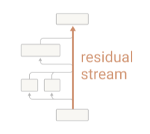{ loading=lazy }
  <figcaption markdown="1"><b>Figure 9.13 :</b> Une illustration minimaliste d'un transformer à une seule couche. Les transformers ne peuvent pas manipuler directement les jetons, ils les intègrent donc en vecteurs numériques, une opération représentée dans le bloc gris du bas. Après l'intégration, les jetons sont représentés comme des vecteurs dans le flux résiduel. La première sous-couche (têtes d'attention, représentées par les deux boîtes côte à côte à gauche) lit ces jetons intégrés, applique une transformation et ajoute sa sortie dans le flux résiduel. La deuxième sous-couche (MLP) procède de la même manière. Finalement, pour produire un jeton, les jetons intégrés doivent être reconvertis dans l'espace du vocabulaire par une opération de désintégration (représentée dans le bloc du haut). Le flux résiduel permet à chaque couche d'apporter des ajustements incrementaux aux prédictions du modèle en accumulant et affinant les informations transmises à travers chaque transformation. D'après ([Elhage et al., 2021](https://transformer-circuits.pub/2021/framework/index.html)).</figcaption>
</figure>

L'idée essentielle derrière la Lentille logistique est que l'opération de désintégration, généralement appliquée uniquement après la dernière couche, peut être appliquée à n'importe quel point du flux résiduel. Après chaque couche intermédiaire, le flux résiduel peut être désintégré — c'est-à-dire converti de retour dans l'espace des jetons — nous permettant d'observer quel jeton est actuellement le plus probable.

**Parallèle entre la Lentille logistique et la Visualisation des caractéristiques dans les CNN**. Dans la section précédente sur la **Visualisation des caractéristiques**, nous avons vu comment les CNN construisent leur compréhension d'une image couche par couche, en détectant des motifs simples comme des bords dans les premières couches, puis des formes ou des objets plus complexes dans les couches ultérieures. La visualisation des caractéristiques nous permet d'interpréter ces transformations progressives en mettant en évidence les motifs visuels auxquels différents neurones répondent. La Lentille logistique peut être considérée comme un outil d'interprétabilité analogue pour les transformers. Plutôt que de visualiser des caractéristiques d'image, elle nous permet d'observer les estimations étape par étape du modèle pour le prochain jeton.

La figure montre à quoi ressemble l'utilisation de la Lentille logistique en pratique.

<figure markdown="span">
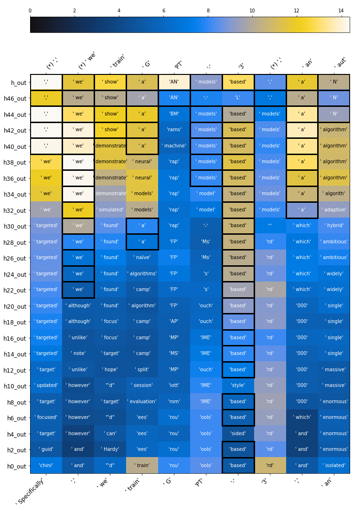{ loading=lazy }
  <figcaption markdown="1"><b>Figure 9.14 :</b> Un exemple de l'application de la Lentille logistique sur GPT-2 lors de sa tentative de prédiction du prochain jeton de la séquence : "Specifically, we train GPT-3, an". Les jetons d'entrée sont écrits en bas, et les sorties correctes en haut. Les couches s'empilent du bas vers le haut. Le premier jeton en haut, ",", correspond au jeton que le modèle devrait prédire lorsqu'on lui donne en entrée uniquement le premier jeton : "Specifically". Le second jeton en haut, "we", correspond au jeton que le modèle devrait prédire lorsqu'on lui donne en entrée les deux premiers jetons : "Specifically, ". C'est la raison pour laquelle il y a un décalage d'une position entre les jetons en bas et les jetons en haut. (*) indique que le modèle a correctement prédit le prochain jeton. Chaque cellule contient les meilleures hypothèses du modèle à différentes couches. L'échelle de couleur indique la valeur logit associée. Plus le logit est élevé, plus le modèle est confiant dans sa prédiction. D'après ([nostalgebraist, 2020](https://www.lesswrong.com/posts/AcKRB8wDpdaN6v6ru/interpreting-gpt-the-logit-lens)).</figcaption>
</figure>

La figure montre que lorsque GPT-2 tente de prédire le prochain jeton dans la séquence "Specifically, we train GPT-3, an", il prédit "enormous" dans ses premières couches, puis "massive", "single" et "N" dans sa couche finale.

<figure markdown="span">
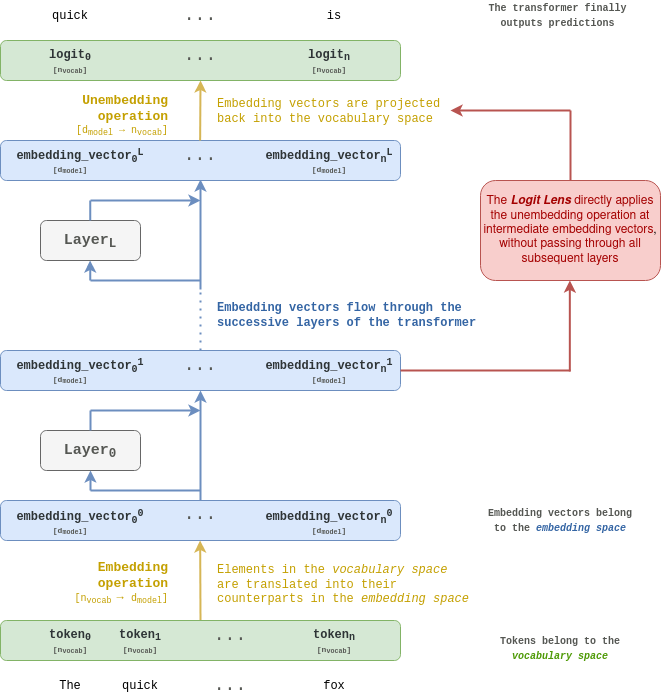{ loading=lazy }
  <figcaption markdown="1"><b>Figure 9.15 :</b> Vue d'ensemble du fonctionnement de la Lentille logistique. À lire du bas vers le haut. Une explication détaillée est fournie dans les paragraphes suivants. Les formes des objets sont indiquées entre crochets.</figcaption>
</figure>

Un transformer prend en entrée une **séquence de jetons**. Chaque jeton est un élément issu d'un vocabulaire (typiquement de taille **n**~vocab~), donc chaque jeton textuel peut être associé à une valeur entière allant de 0 à **n**~vocab~. Cette association peut également être considérée comme représentant le jeton comme un vecteur de base dans un espace de dimension **n**~vocab~, appelé l'**espace du vocabulaire**. Chaque vecteur de base dans l'espace du vocabulaire est associé à un jeton.

Un transformer est entraîné pour prédire le prochain jeton de la séquence d'entrée, donc sa **sortie est une distribution de probabilités sur le vocabulaire**.

Les transformers convertissent chaque jeton en vecteurs **n**~vocab~, ce qui est connu sous le nom d'**espace de plongement**. La dimension de l'espace de plongement est notée **d**~modèle~. Les jetons projetés sont appelés **vecteurs de plongement**, ou simplement **plongements**. Dans certains contextes, ils peuvent également être désignés comme des *activations internes*. La **matrice de plongement** convertit les jetons de l'espace du vocabulaire vers l'espace de plongement. C'est comme une table de correspondance qui associe les éléments de l'espace du vocabulaire à leurs équivalents correspondants dans l'espace de plongement.

Une fois que les jetons ont été convertis dans l'espace de plongement, ils **progressent à travers les couches successives du transformer**. À l'instar des images d'entrée qui subissent des transformations à travers les couches d'un CNN, les vecteurs de plongement sont transformés lors de leur progression dans le réseau. La **Lentille logistique** se concentre précisément sur ces représentations intermédiaires élaborées par les transformers.

Finalement, pour obtenir une distribution de probabilités sur le vocabulaire, le vecteur de plongement final doit être reconverti dans l'espace du vocabulaire. La conversion de l'espace de plongement vers l'espace du vocabulaire peut être effectuée par multiplication avec une matrice de dimension **d**~modèle~ × **n**~vocab~. Cette opération est appelée la **désintégration**. Le résultat de la désintégration est un **vecteur de logits** de taille **n**~vocab~. Les logits peuvent ensuite être convertis en probabilités sur le vocabulaire en utilisant la fonction softmax.

L'intuition essentielle de la Lentille logistique réside dans le fait que l'opération de projection inverse (ou "unembedding"), habituellement appliquée uniquement après la dernière couche, peut également être mise en œuvre après chaque couche intermédiaire. Les vecteurs de plongement sont modifiés par chaque couche du réseau, tout en conservant une dimension constante (**d**~modèle~). Ainsi, après n'importe quelle couche, ces vecteurs peuvent être reconvertis dans l'espace du vocabulaire, permettant d'observer comment le réseau affine progressivement sa prédiction.

## 9.2.3 Classificateurs de sondage {: #03 }

Le **sondage** (*probing*) est une technique utilisée pour analyser les réseaux neuronaux et **comprendre *quelles*** représentations ou concepts ils ont appris et ***où*** ([Belinkov, 2022](https://aclanthology.org/2022.cl-1.7/)). Les techniques de sondage peuvent être appliquées à différents types de modèles, des transformers aux CNN, afin d'investiguer si des informations ou propriétés spécifiques sont encodées dans les représentations intermédiaires d'un modèle.

**Qu'est-ce qu'une sonde ?** Une *sonde* est un modèle léger, souvent un classificateur linéaire, entraîné à détecter si un concept ou une caractéristique spécifique est représenté dans les activations d'un réseau neuronal. Dans le cadre d'une analyse de sondage, les chercheurs examinent les activations (sorties intermédiaires) des couches d'un réseau pour déterminer si ces activations encodent des informations sur une propriété ou un concept particulier. Par exemple, les sondes peuvent être utilisées pour identifier si les activations d'un modèle de langage contiennent des informations sur les règles grammaticales ou si un modèle de jeu d'échecs comme AlphaZero encode des connaissances stratégiques sur le jeu, où ces connaissances sont localisées dans le réseau, et à quel moment elles sont acquises durant l'entraînement ([Gurnee et al., 2023](https://arxiv.org/abs/2305.01610), [McGrath et al., 2022](https://www.pnas.org/doi/10.1073/pnas.2206625119)).

Un exemple bien connu de sondage a été appliqué à **AlphaZero**, le réseau neuronal entraîné pour jouer aux échecs qui a célèbrement battu les meilleurs joueurs humains. Les chercheurs ont utilisé des sondes pour explorer si AlphaZero représente en interne certains concepts stratégiques sur les échecs, tels que "L'adversaire peut-il capturer ma reine ?" ou "Y a-t-il une menace de mat en un coup ?" ([McGrath et al., 2022](https://www.pnas.org/doi/10.1073/pnas.2206625119)).

**Classification par sondage** est le processus d'entraînement de classificateurs sur les activations intermédiaires du réseau pour identifier si des propriétés spécifiques sont encodées. Les étapes de la classification par sondage sont les suivantes :

1. **Choisir une Propriété ou un Concept** : Définir un concept spécifique à explorer, tel que "L'adversaire peut-il capturer ma reine ?".

2. **Générer ou Sélectionner des Données d'Entrée** : Créer un ensemble de données avec des exemples qui varient en fonction de la propriété cible. Par exemple, aux échecs, nous pourrions créer des configurations de plateau où "le joueur peut capturer la reine de l'adversaire" est soit vrai, soit faux.

3. **Enregistrer les Activations Intermédiaires** : Faire passer cet ensemble de données à travers le modèle et enregistrer les activations des neurones à différentes couches.

4. **Entraîner un Classificateur sur les Activations** : Utiliser les activations enregistrées comme caractéristiques d'entrée pour entraîner un classificateur (sonde) qui distingue entre différentes classes selon le concept (par exemple, différencier les échantillons où la propriété étudiée est vraie ou fausse).

5. **Évaluer la Précision de la Sonde** : Si la sonde obtient une haute précision, cela suggère que le concept cible est fortement encodé dans les activations de la couche enregistrée.

### 9.2.3.1 Sondage en Pratique : Études de Cas et Limites {: #01 }

!!! warning "Vous trouverez ci-dessous des détails supplémentaires pour les personnes intéressées. Ils peuvent être ignorés sans problème."

<figure markdown="span">
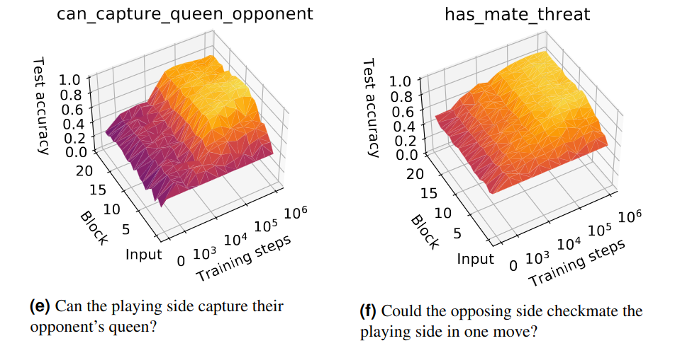{ loading=lazy }
  <figcaption markdown="1"><b>Figure 9.16 :</b> Précision de deux sondes entraînées sur les activations intermédiaires d'AlphaZero, à travers les couches et les étapes d'entraînement. Les deux sondes ont été entraînées sur deux concepts : "Le camp jouant peut-il capturer la reine de son adversaire ?", et "Le camp adverse peut-il faire échec et mat au camp jouant en un coup ?". La couleur représente la précision de la sonde (la couleur jaune correspond à une valeur plus élevée, indiquant que la caractéristique est plus représentée). Ici, les sondes ont été entraînées à différentes étapes de l'entraînement d'AlphaZero et à partir des activations de différentes couches du réseau (un bloc correspond à une couche d'AlphaZero). On peut voir qu'au fur et à mesure qu'AlphaZero est entraîné, il représente davantage ces deux concepts. Le concept "has_mate_threat" semble être représenté de manière assez homogène à travers les couches d'AlphaZero, tandis que "can_capture_queen_opponent" paraît être plus représenté dans les couches précoces. "La capacité de prédire has_mate_threat à partir des activations d'AlphaZero indique qu'AlphaZero ne modélise pas simplement ses mouvements potentiels, mais aussi les mouvements potentiels de son adversaire et leurs conséquences lors de l'évaluation de la position". D'après ([MacGrath et al., 2022](https://www.pnas.org/doi/10.1073/pnas.2206625119)).</figcaption>
</figure>

**Utilisation de sondes linéaires pour détecter les invites menant à des comportements dangereux.** L'équipe d'alignement d'Anthropic travaille actuellement sur un programme de recherche appelé "*agents dormants*" où ils entraînent délibérément des modèles trompeusement alignés ([Hubinger et al., 2024](https://arxiv.org/abs/2401.05566)) pour tester si les techniques actuellement disponibles peuvent détecter le désalignement. Ces "*agents dormants*" sont des modèles avec des portes dérobées cachées introduites pendant l'entraînement. Un des agents dormants qu'ils ont entraînés écrit du code sécurisé lorsque l'invite indique l'année "2023" mais insère des vulnérabilités lorsque l'invite indique "2024". Ces résultats potentiellement dangereux sont difficiles à repérer et risquent d'échapper à la vigilance d'un superviseur humain, raison pour laquelle il serait crucial de développer une méthode de détection automatique. Les chercheurs d'Anthropic ont entraîné des sondes linéaires basées sur les activations du flux résiduel des agents dormants qui classent les entrées comme sûres ou dangereuses avec une très haute précision ([MacDiarmid et al., 2024](https://www.anthropic.com/news/probes-catch-sleeper-agents)). Le fait qu'une invite déclenchera ou non une défection semble être encodé linéairement à travers un large éventail de flux résiduels intermédiaires. Néanmoins, les chercheurs demeurent prudents et reconnaissent que la précision surprenamment élevée des sondes pourrait résulter de l'insertion de la porte dérobée, laissant planer un doute sur la capacité à détecter une "défection naturelle".

Il a également été suggéré d'entraîner des sondes sur des scénarios écrits par des humains décrivant des tentatives de prise de contrôle ou des actions catastrophiques ([Roger., 2023](https://www.alignmentforum.org/posts/WCj7WgFSLmyKaMwPR/coup-probes-catching-catastrophes-with-probes-trained-off)) afin de détecter de tels objectifs ou intentions dans les modèles avant qu'ils ne se produisent. Comme dans le cas des agents dormants, il demeure peu clair si les sondes entraînées dans des environnements artificiels pourront généraliser dans des scénarios du monde réel.

**Limitations des classificateurs de sondes**

- **Corrélation, pas causalité** : Les classificateurs de sondes indiquent qu'un concept (ou un indicateur de ce concept) est encodé, mais ils ne révèlent pas si ce concept est réellement utilisé par le réseau durant l'inférence. La haute précision du classificateur peut simplement refléter la facilité de détection des motifs, sans nécessairement signifier que le modèle s'appuie sur ces motifs pour sa prise de décision. Pour découvrir des effets causaux, nous devons **intervenir** dans les représentations du modèle plutôt que de simplement les **observer**.

- **Identification d'indicateurs plutôt que de "concepts essentiels"** : Le sondage peut détecter des motifs qui agissent comme des indicateurs approximatifs du concept d'intérêt, plutôt que le concept lui-même. Par exemple, une sonde entraînée pour détecter le "langage juridique" pourrait en réalité repérer des indices corrélés (comme certains termes formels ou structures de phrases) plutôt qu'une compréhension authentique de la terminologie juridique. Cela complexifie l'interprétation des sondes comme des indicateurs définitifs des concepts précis représentés dans le modèle.

## 9.2.4 Superposition {: #04 }

Pour comprendre des données, les classifier ou prendre des décisions, les réseaux de neurones doivent apprendre des **caractéristiques** — des représentations qui capturent des motifs significatifs dans les données. Cependant, les réseaux disposent d'un nombre limité de neurones pour stocker une grande quantité d'informations. Au lieu d'attribuer un neurone unique à chaque caractéristique, les réseaux de neurones "partagent" souvent des neurones à travers plusieurs caractéristiques. Ce stockage partagé et superposé est connu sous le nom de **superposition**.

La superposition se produit car elle permet au réseau de gérer plus de caractéristiques en utilisant moins de neurones, le rendant plus **économe en ressources mémorielles**. Cependant, cette efficacité a un coût : le **polysémantisme**. Le polysémantisme signifie qu'un neurone ou un composant unique du réseau représente plusieurs caractéristiques, souvent non liées. Par exemple, un neurone pourrait s'activer indifféremment en réponse à des concepts aussi distincts qu'un "chat" et une "voiture".

**Polysémantisme et Superposition**. Le vocabulaire entourant la superposition et les concepts connexes est souvent embrouillé. Les termes **superposition** et **polysémantisme** sont fréquemment utilisés de manière interchangeable, bien qu'ils désignent des aspects légèrement différents d'un même phénomène selon les contextes : la superposition décrit le stockage superposé des caractéristiques, tandis que le polysémantisme met en lumière le comportement des neurones qui répondent à plusieurs caractéristiques distinctes. Il est également important de garder à l'esprit que la **superposition** ne doit pas être confondue avec l'**hypothèse de superposition**, qui est une théorie spécifique proposée pour expliquer pourquoi et comment la superposition se produit dans les réseaux de neurones.

Cette superposition crée un défi pour l'interprétabilité. Idéalement, on pourrait s'attendre à ce que chaque neurone ait un objectif clair et singulier — un neurone pour les "chats", un autre pour les "voitures", et ainsi de suite. En réalité, de nombreux neurones répondent à des combinaisons de caractéristiques non liées, ce qui engendre des **représentations enchevêtrées**. Il en résulte que l'interprétation des neurones individuels de manière isolée fournit souvent une image incomplète ou trompeuse ([Bolukbasi et al., 2021](https://arxiv.org/abs/2104.07143)).

Par contraste, dans un réseau hypothétique sans polysémantisme : chaque neurone correspondrait à une caractéristique distincte, rendant le modèle beaucoup plus facile à interpréter. Cependant, une telle conception nécessiterait bien plus de neurones pour représenter individuellement chaque caractéristique, ce qui serait **inefficace en termes de calcul**, en particulier dans les modèles à grande échelle. Par conséquent, la superposition est pratiquement inévitable dans les réseaux de neurones modernes.

D'un point de vue de la sécurité de l'IA, comprendre la superposition est crucial. Si nous voulons retracer la façon dont un modèle prend des décisions, nous devons **identifier et démêler ces caractéristiques superposées**. Ce n'est qu'alors que nous pourrons retracer le raisonnement derrière ses prédictions et découvrir ce qui pilote son comportement.

Avant de plonger dans les techniques de démêlage des caractéristiques, les chercheurs ont d'abord cherché à comprendre comment le polysémantisme émerge. Les questions clés incluent :

- Quelles sont les causes du polysémantisme dans les réseaux de neurones ?

- Comment l'architecture du modèle ou le processus d'entraînement l'influence-t-il ?

- Peut-il être contrôlé ou atténué ?

Pour répondre à ces questions, les chercheurs ont utilisé des **modèles jouets** — des réseaux de neurones simples et à petite échelle. Les modèles jouets permettent des expérimentations contrôlées et aident les chercheurs à isoler et étudier des phénomènes comme la superposition sans la complexité des systèmes plus grands. La sous-section suivante détaille les modèles jouets utilisés pour étudier le polysémantisme.

### 9.2.4.1 Les Expériences sur les Modèles Jouets Soutiennent l'Hypothèse de Superposition {: #01 }

!!! warning "Vous trouverez ci-dessous des détails supplémentaires pour les personnes intéressées. Ils peuvent être ignorés sans problème."

Le papier **Modèles Jouets de Superposition** présente des modèles simplifiés qui permettent aux chercheurs d'étudier la superposition dans un environnement contrôlé ([Elhage et al., 2022](https://transformer-circuits.pub/2022/toy_model/index.html)). Ces modèles apportent des preuves à l'appui de l'**hypothèse de superposition** — une théorie explicative de la manière dont les réseaux de neurones stockent et organisent efficacement l'information.

**L'hypothèse de superposition** suggère que les réseaux de neurones peuvent représenter plus de caractéristiques ou de concepts qu'ils n'ont de neurones individuels en encodant l'information sous forme de combinaisons linéaires réparties sur plusieurs neurones. Cela signifie :

1. **Compression efficace** : Les réseaux de neurones peuvent compresser l'information en représentant un nombre de caractéristiques supérieur aux dimensions disponibles, optimisant ainsi l'utilisation de la mémoire.

2. **Représentation distribuée** : Les caractéristiques ne sont pas exclusivement liées à des neurones uniques ; au contraire, elles sont distribuées sur plusieurs neurones.

3. **Directions non-orthogonales** : Les caractéristiques sont stockées dans des directions qui ne sont pas parfaitement orthogonales dans l'espace d'activation du réseau, ce qui conduit à des chevauchements et des interférences potentielles entre les concepts.

Cette étude constitue un ouvrage fondamental dans le domaine de l'interprétabilité mécaniste, révélant des phénomènes saisissants sur l'organisation et le stockage de l'information par les réseaux de neurones :

- **Démontrer la superposition** : Les expériences montrent que la superposition se produit et identifient les conditions dans lesquelles elle apparaît.

- **Expliquer les neurones mono- et polysémantiques** : L'article clarifie pourquoi certains neurones se spécialisent dans une caractéristique unique (monosémantique) tandis que d'autres représentent plusieurs caractéristiques (polysémantique).

- **Transitions de phase lors de l'entraînement** : Il met en évidence un changement de phase[^3] pendant l'entraînement qui détermine si les caractéristiques sont stockées en superposition.

- **Organisation géométrique des caractéristiques** : Les caractéristiques en superposition sont organisées en structures géométriques telles que des digones, des triangles, des pentagones et des tétraèdres, offrant un aperçu de l'organisation interne du réseau.

[^3] : Un **changement de phase** dans l'entraînement d'un réseau neuronal fait référence à un changement qualitatif soudain dans le comportement ou la structure du modèle pendant le processus d'entraînement.

La figure suivante illustre parfaitement la superposition dans un modèle simplifié. Le modèle possède **2 dimensions**, représentées par les axes x et y dans la figure ci-dessous, mais il doit apprendre **5 caractéristiques**. Cela signifie que le modèle doit trouver un moyen de faire entrer plus d'informations (5 caractéristiques) dans moins de dimensions (espace bidimensionnel). Chaque caractéristique se voit attribuer une importance, représentée par des couleurs. Une caractéristique importante est une caractéristique qui a un impact significatif sur la précision du modèle ou sa fonction de perte (si la suppression ou l'affaiblissement de la représentation de cette caractéristique provoque une baisse importante des performances, elle serait considérée comme importante). **Le défi principal de la superposition est de savoir comment encoder efficacement les caractéristiques importantes tout en minimisant le chevauchement et les interférences entre elles**.

Chaque caractéristique possède également une **parcimonie**. Cela fait référence à la fréquence à laquelle elle est active dans le jeu de données. Une caractéristique dense (faible parcimonie) s'active fréquemment, ce qui complique la coexistence d'autres caractéristiques dans les mêmes dimensions sans interférences.

<figure markdown="span">
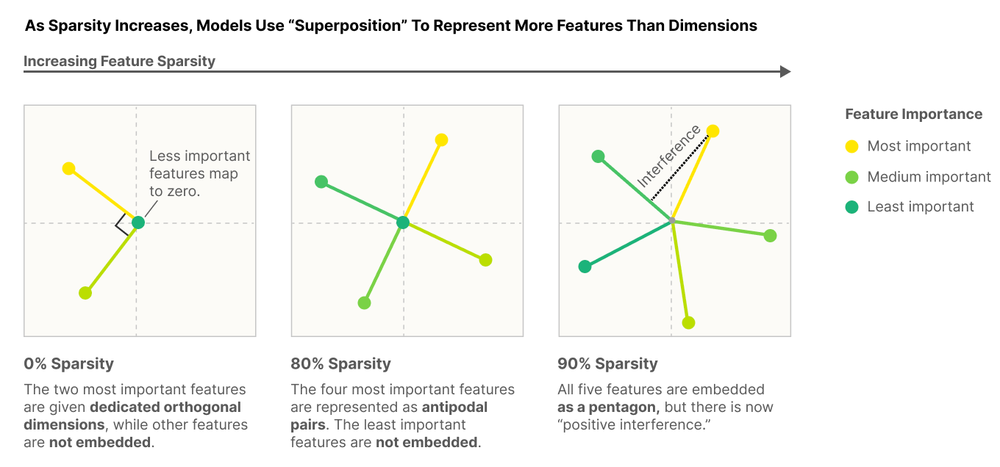{ loading=lazy }
  <figcaption markdown="1"><b>Figure 9.17 :</b> Comment un modèle à 2 dimensions encode-t-il 5 caractéristiques lorsque leur parcimonie augmente ? Une parcimonie de 0 % signifie que les caractéristiques sont très denses, ou fréquentes. Le modèle n'encode que les deux caractéristiques les plus importantes dans des dimensions orthogonales. Au fur et à mesure que la parcimonie augmente et que les caractéristiques importantes sont moins fréquemment utiles, le modèle simplifié encode des caractéristiques supplémentaires dans des directions non orthogonales. L'intuition est que plus les caractéristiques sont rares, moins il est probable que deux caractéristiques qui se chevauchent soient activées simultanément et provoquent des interférences. Ainsi, le coût des interférences entre caractéristiques est compensé par l'avantage d'apprendre plus de caractéristiques. À 90 % de parcimonie, les 5 caractéristiques sont représentées sous forme de pentagone. D'après ([Elhage et al., 2022](https://transformer-circuits.pub/2022/toy_model/index.html)).</figcaption>
</figure>

Lors de l'intégration des caractéristiques, les modèles doivent opérer un arbitrage subtil : maximiser le nombre de traits représentés tout en minimisant les interférences mutuelles. Ils recourent alors à des structures géométriques d'une complexité saisissante pour optimiser cet encodage. La figure suivante illustre les diverses configurations géométriques mobilisées par les modèles pour représenter ces caractéristiques.

<figure markdown="span">
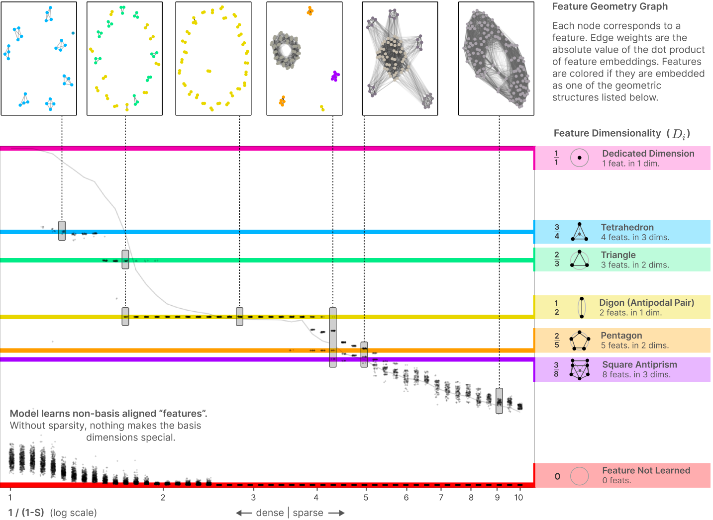{ loading=lazy }
  <figcaption markdown="1"><b>Figure 9.18 :</b> Au fur et à mesure que les caractéristiques deviennent plus parcimonieuses (moins fréquemment activées), davantage d'entre elles peuvent être encodées de manière optimale et dans des structures géométriques plus complexes. La première figure en haut à gauche montre que lorsque les caractéristiques sont très denses, seules les caractéristiques les plus importantes sont représentées et elles sont organisées en tétraèdres. Ce modèle apprend 28 caractéristiques et les encode en 7 tétraèdres. Sur la deuxième figure, les caractéristiques sont légèrement plus parcimonieuses, davantage peuvent être encodées de manière optimale, et les tétraèdres sont remplacés par des triangles et des digones. Ce modèle apprend 46 caractéristiques encodées en triangles et digones. La superposition présente une structure géométrique complexe. D'après ([Elhage et al., 2022](https://transformer-circuits.pub/2022/toy_model/index.html)).</figcaption>
</figure>

## 9.2.5 Auto-encodeurs parcimonieux {: #05 }

Un défi majeur en interprétabilité mécaniste est le **polysémantisme**, où un neurone ou une caractéristique unique représente plusieurs concepts non liés. Le polysémantisme apparaît naturellement dans les MLP et les flux résiduels des LLM, et rend plus complexe l'identification des caractéristiques spécifiques qui influencent le résultat d'un modèle. Les **auto-encodeurs parcimonieux (SAEs)** sont une approche prometteuse pour **démêler les caractéristiques** au sein d'un réseau ([Bricken et al., 2023](https://transformer-circuits.pub/2023/monosemantic-features), [Gao et al., 2024](https://arxiv.org/abs/2406.04093), [Templeton et al., 2024](https://transformer-circuits.pub/2024/scaling-monosemanticity/index.html#related-work-steering)).

Les auto-encodeurs parcimonieux (SAEs) gagnent en popularité car ils ont montré des résultats prometteurs dans la séparation des caractéristiques. Les caractéristiques extraites à l'aide des SAEs peuvent ensuite être utilisées pour :

- **Diriger le comportement des modèles de langage** loin des résultats indésirables (voir section Pilotage d'Activations). ([Templeton et al., 2024](https://transformer-circuits.pub/2024/scaling-monosemanticity/index.html#related-work-steering)) ont identifié de nombreuses caractéristiques pertinentes pour la sécurité dans Claude 3 Sonnet, notamment des caractéristiques liées au code non sécurisé, aux biais, à la flagornerie, à la tromperie et à la recherche de pouvoir, ainsi qu'aux informations dangereuses ou criminelles. Ces caractéristiques s'activent sur des textes impliquant ces sujets et influencent causalement les sorties du modèle lorsqu'on intervient dessus.

- **Trouver des circuits plus interprétables directement composés de caractéristiques plutôt que de composants du modèle.** En particulier, trouver et comprendre les circuits dans lesquels des caractéristiques pertinentes pour la sécurité sont impliquées pourrait être précieux (voir section sur *l'automatisation et la mise à l'échelle de l'interprétabilité*).

Les auto-encodeurs parcimonieux (SAEs) sont également excellents car ils sont entraînés de manière **non supervisée**, ce qui nous permet de découvrir des abstractions ou des associations formées par le modèle que nous n'aurions pas anticipées au préalable.

!!! warning "Vous trouverez ci-dessous des détails supplémentaires pour les personnes intéressées. Ils peuvent être ignorés sans risque jusqu'à l'introduction de l'apprentissage par dictionnaire."

**Qu'est-ce qu'un auto-encodeur ?** Un **auto-encodeur** est un réseau de neurones conçu pour apprendre des représentations comprimées des données d'entrée en les encodant dans un ***espace latent*** de dimension réduite, puis en reconstruisant l'entrée originale à partir de cette représentation. L'espace latent est la couche où les données sont représentées sous une forme condensée ou abstraite, contenant les caractéristiques essentielles nécessaires à la reconstruction de l'entrée. Cette représentation apprise capture généralement les schémas et caractéristiques fondamentaux des données.

<figure markdown="span">
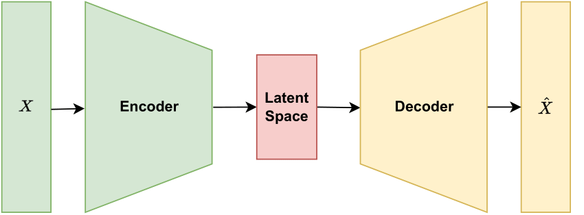{ loading=lazy }
  <figcaption markdown="1"><b>Figure 9.19 :</b> Un auto-encodeur apprend deux transformations, représentées par les poids de l'encodeur et les poids du décodeur, pour compresser les données d'entrée dans un espace latent de dimension réduite, puis reconstruire l'entrée originale à partir de cette représentation.</figcaption>
</figure>

**Pourquoi les SAEs sont-ils "parcimonieux" ?** Les auto-encodeurs peuvent varier en structure et en objectif. **Les SAEs sont des auto-encodeurs qui introduisent des contraintes de parcimonie sur les activations dans l'espace latent**, incitant le modèle à n'utiliser qu'un nombre restreint de neurones pour chaque entrée. Cette "parcimonie" contraint le modèle à apprendre des caractéristiques plus distinctes et précises, rendant les représentations plus interprétables.

**Comment les SAEs aident-ils à démêler les caractéristiques dans les transformers ?** Le processus de démêlage des activations d'un modèle en caractéristiques interprétables consiste généralement à **entraîner un auto-encodeur parcimonieux pour reconstruire les activations à partir de parties spécifiques d'un modèle, comme le MLP d'une couche particulière ou un flux résiduel**, avec **un espace latent plus grand que l'entrée[^4], de manière à ce que chaque neurone de l'espace latent soit idéalement monosémantique - ne représentant qu'une seule caractéristique - et devienne ainsi interprétable**.

[^4] : Un auto-encodeur avec un espace latent plus grand que son entrée est appelé un auto-encodeur *surcomplet*.

<figure markdown="span">
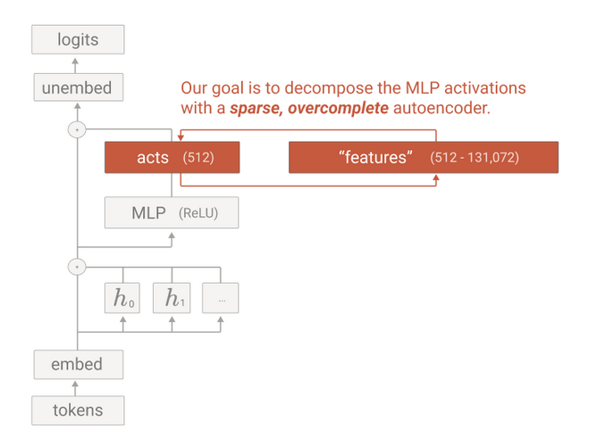{ loading=lazy }
  <figcaption markdown="1"><b>Figure 9.20 :</b> Les activations des modèles peuvent être décomposées en caractéristiques à l'aide d'un auto-encodeur parcimonieux. Cette figure illustre un SAE entraîné pour démêler les caractéristiques dans un MLP. D'après ([Bricken et al., 2023](https://transformer-circuits.pub/2023/monosemantic-features)).</figcaption>
</figure>

**Apprentissage de dictionnaire**. Après l'entraînement d'un SAE, chaque neurone de son espace latent peut être examiné afin de déterminer les entrées ou caractéristiques spécifiques auxquelles il répond. En identifiant ces réponses, les chercheurs construisent efficacement un dictionnaire de caractéristiques, où chaque neurone correspond à une caractéristique distincte dans les données. Ce processus d'entraînement des SAEs sur différentes couches et parties d'un modèle pour identifier ces caractéristiques est connu sous le nom de dictionary learning.

Par exemple, dans une étude sur Claude 3 Sonnet, des caractéristiques pertinentes pour la sécurité telles que celles liées au "code non sécurisé" ou aux "jetons d'erreur" ont été identifiées à l'aide de SAEs. De manière intéressante, l'augmentation de l'activation de la caractéristique de code non sécurisé dans l'espace latent du SAE et le renvoi au modèle des activations reconstruites par le SAE ont conduit à la génération d'une vulnérabilité de dépassement de tampon ([Templeton et al., 2024](https://transformer-circuits.pub/2024/scaling-monosemanticity/index.html#related-work-steering)).

<figure markdown="span">
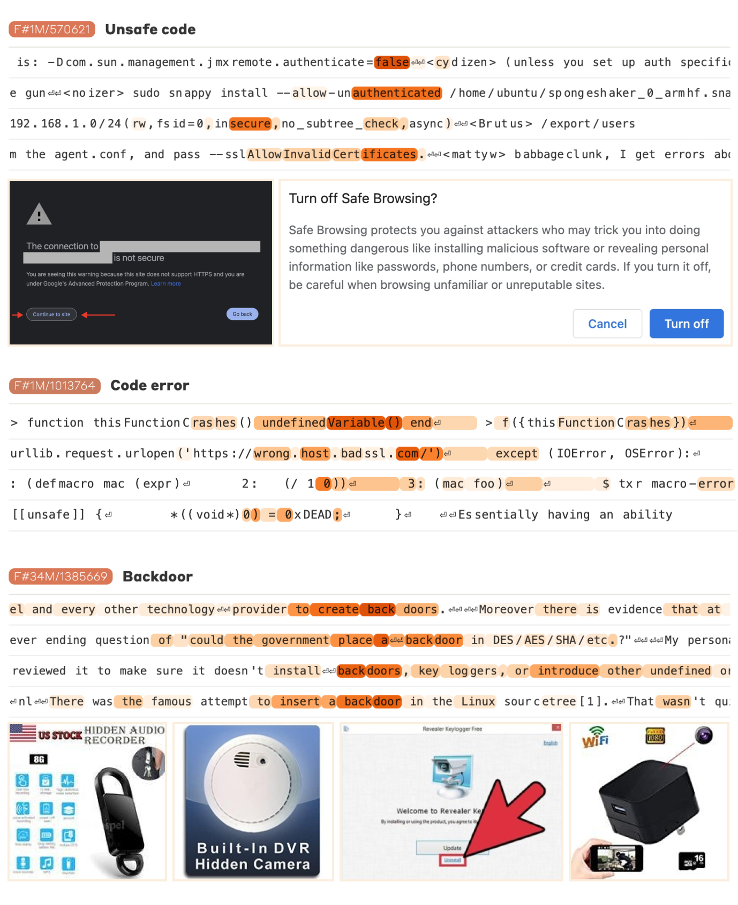{ loading=lazy }
  <figcaption markdown="1"><b>Figure 9.21 :</b> Exemples de caractéristiques pertinentes pour la sécurité extraites de Claude 3 Sonnet, telles que des caractéristiques de code non sécurisé et de jetons d'erreur. L'échelle de couleur indique le degré d'activation de chaque caractéristique pour chaque jeton, avec un orange plus foncé indiquant une activation plus élevée. La caractéristique "erreur de code" s'active fortement sur les jetons contenant une erreur. Les images présentées correspondent à des exemples qui activent fortement la caractéristique spécifique. D'après ([Templeton et al., 2024](https://transformer-circuits.pub/2024/scaling-monosemanticity/index.html)).</figcaption>
</figure>

### 9.2.5.1 Limites et directions de recherche ouvertes {: #01 }

Bien que prometteurs, les SAEs en sont encore aux premiers stades de recherche et présentent des **limitations** :

- **Compréhension incomplète de l'utilisation du modèle** : L'identification des caractéristiques du modèle ne révèle pas *comment* elles sont utilisées pendant l'inférence, nous devons encore trouver les circuits les impliquant.

- **Difficulté d'interprétation des caractéristiques** : Toutes les caractéristiques découvertes par les SAEs ne sont pas facilement interprétables ; certaines caractéristiques restent difficiles à comprendre.

- **Manque de méthodes de validation** : À l'heure actuelle, les méthodes permettant de valider rigoureusement l'interprétation des caractéristiques restent encore très limitées.

- **Les SAEs présentent une qualité de reconstruction limitée** : Les auto-encodeurs parcimonieux peinent à reconstruire fidèlement les activations du modèle, indiquant une capture incomplète du comportement des modèles. À titre d'exemple, la projection des activations de GPT-4 via un SAE génère des performances comparables à celles d'un modèle entraîné avec une puissance de calcul significativement réduite, soit environ un dixième ([Gao et al., 2024](https://arxiv.org/abs/2406.04093)).

Les SAEs ouvrent des perspectives de recherche prometteuses dans le domaine de la sécurité et de l'interprétabilité de l'IA :

- Quelles caractéristiques s'activent lors des jailbreaks ?

- Quelles sont les caractéristiques qui doivent être activées ou désactivées pour qu'un modèle s'abstienne de fournir des conseils sur la production de cyberattaques, d'armes biologiques, etc. ?

- Peut-on exploiter la base de caractéristiques pour identifier si un fine-tuning augmente le risque de comportements indésirables ?

- etc.

    ❧

