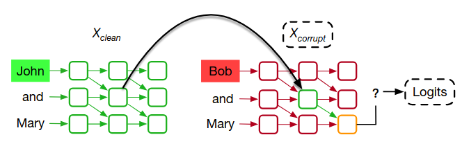
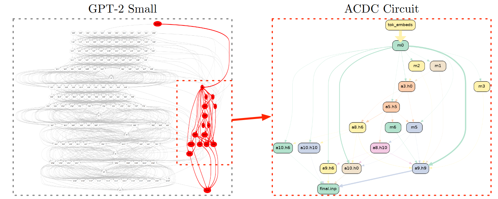
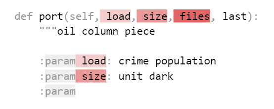
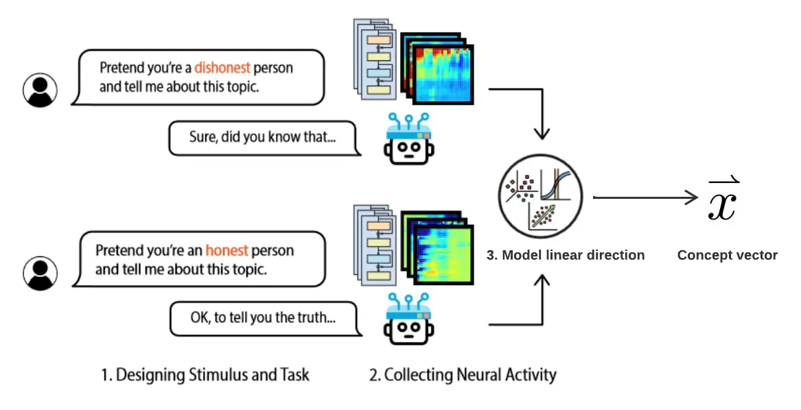
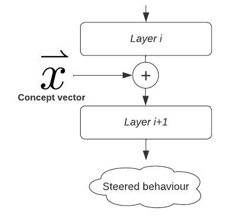

# 9.3 Méthodes interventionnelles {: #03 }

    

        <i class="fas fa-clock"></i>
        Lecture de 8 min
    

    

        <i class="fas fa-file-alt"></i> 
        1573 mots
    

## 9.3.1 Patching d'activations {: #01 }

Le patching d'activations est une technique permettant de comprendre et de localiser précisément les composants spécifiques d'un modèle responsables de certains comportements ou résultats. Par exemple, lorsqu'on demande à un grand modèle de langage (LLM, de l'anglais Large Language Model) de compléter la phrase : « Quand John et Mary sont allés au magasin, John a donné une bouteille à », comment le modèle sait-il qu'il doit répondre « Mary » plutôt que « John » ou un autre nom ? Cette complétion exige que le modèle identifie le destinataire de l'action, ce qui implique de comprendre et de stocker les rôles contextuels (qui donne et qui reçoit).

Les chercheurs ont utilisé le patching d'activations pour découvrir quelles parties du modèle sont responsables de ce type d'attribution de rôles. Plus précisément, l'objectif est d'identifier le circuit (c'est-à-dire le groupe de neurones et de connexions) qui aide le modèle à décider que « Mary » est la réponse correcte ([Wang et al., 2023](https://openreview.net/forum?id=NpsVSN6o4ul)).

!!! warning "Vous trouverez ci-dessous des détails supplémentaires destinés aux personnes intéressées. Ils peuvent être ignorés sans risque."

Pour illustrer le processus de patching d'activations, considérons la figure ci-dessous ([Heimersheim & Nanda, 2024](https://arxiv.org/abs/2404.15255)). Supposons que nous voulions comprendre comment un modèle complète la phrase « *Quand John et Mary sont allés au magasin, John a donné une bouteille à* » et quels composants sont impliqués dans le choix de « Mary » comme réponse. Le patching d'activations requiert généralement **trois étapes** :

1. **Entrée de référence** : À gauche, le modèle traite la phrase « *John et Mary sont allés au magasin, John a donné une bouteille à* » en générant une série d'activations (sorties de chaque couche) représentées en vert. Cette entrée de référence fournit au modèle le contexte correct pour interpréter « John » comme le donneur et « Mary » comme le destinataire. Le modèle prédit « Mary ».

2. **Entrée corrompue** : À droite, le modèle reçoit une entrée corrompue : « *Bob et Mary sont allés au magasin, John a donné une bouteille à* ». Dans ce cas, les activations (en rouge) seront différentes car le modèle traite maintenant « Bob » au lieu de « John ». Ici, il existe une ambiguïté sur le fait que « Mary » ou « John » soit le destinataire prévu, donc la réponse ne sera pas nécessairement « Mary ».

3. **Processus de patching** : **Le patching d'activations consiste à extraire des activations spécifiques de l'entrée de référence « John et Mary… » pour les substituer dans l'entrée corrompue « Bob et Mary… »**. Ce processus est illustré par la flèche. En réalisant ce patching d'activations, nous pouvons vérifier si la compréhension du modèle concernant « John » comme donneur et « Mary » comme destinataire peut être rétablie, même lorsque l'entrée corrompue avec « Bob » crée une ambiguïté. À cette étape, nous observons dans quelle mesure la prédiction du modèle se déplace vers « Mary ». Par exemple, si le patching des activations d'une tête d'attention spécifique augmente le logit pour « Mary », cela suggère que cette tête constitue un composant crucial du circuit responsable de la tâche.

4. **Itération** de cette procédure sur différentes couches et composants (tels que les têtes d'attention ou les MLP) permet aux chercheurs d'identifier les composants les plus responsables du comportement ciblé.

<figure markdown="span">
{ loading=lazy }
  <figcaption markdown="1"><b>Figure 9.22 :</b> Une illustration du processus de patching d'activations. À gauche, le modèle traite une séquence d'entrée de référence « John et Mary », avec des activations représentées en vert. À droite, le modèle traite une séquence d'entrée corrompue « Bob et Mary », avec des activations représentées en rouge. Le patching d'activations consiste à remplacer une ou plusieurs activations dans la séquence corrompue par des activations correspondantes de la séquence de référence (indiqué par la flèche). Les activations patchées sont ensuite transmises pour observer comment elles affectent les logits de sortie du modèle. En analysant si les activations patchées rétablissent la sortie souhaitée, les chercheurs peuvent identifier quelles parties des activations du modèle sont responsables de comportements ou de sorties spécifiques. D'après ([Zhang & Nanda, 2023](https://openreview.net/forum?id=NpsVSN6o4ul)).</figcaption>
</figure>

<figure markdown="span">
{ loading=lazy }
  <figcaption markdown="1"><b>Figure 9.23 :</b> Les neurones et les connexions en rouge représentent les composants les plus importants de GPT-2 small pour compléter la phrase « Quand John et Mary sont allés au magasin, John a donné une bouteille à _ » (connue sous le nom de tâche d'identification de l'objet indirect (IOI)). D'après ([Conmy et al., 2023](https://arxiv.org/abs/2304.14997)).</figcaption>
</figure>

Le patching d'activations a été utilisé pour trouver des circuits pour diverses tâches ([Wang et al., 2023](https://openreview.net/forum?id=NpsVSN6o4ul)) dans les grands modèles de langage (LLM, de l'anglais Large Language Model), notamment :

Exemple de prompt : « Quand John et Mary sont allés au magasin, John a donné une bouteille à »

**Exemple de prompt :** « Quand John et Mary sont allés au magasin, John a donné une bouteille à »

**Complétion :** « Mary »

**Tâche :** Identification de l'Objet Indirect (IOI) ([Wang et al., 2023](https://openreview.net/forum?id=NpsVSN6o4ul))

Exemple de prompt : « La guerre a duré de 1517 à 15 »

**Complétion :** n'importe quel nombre à deux chiffres supérieur à 17

**Tâche :** Comparaison Numérique (Greater-Than)

<figure markdown="span">
{ loading=lazy }
  <figcaption markdown="1"><b>Figure 9.24 :</b> Exemple de prompt : « La guerre a duré de 1517 à 15 »</figcaption>
</figure>

Complétion : « fichiers »

Tâche : Docstring ([Heimersheim & Janiak, 2023](https://www.alignmentforum.org/posts/u6KXXmKFbXfWzoAXn/a-circuit-for-python-docstrings-in-a-4-layer-attention-only)).

Le modèle prédit le prochain jeton, qui doit être une copie du prochain argument dans la définition.

Il existe de nombreux paramètres de patching d'activations, comme détaillé dans ([Zhang & Nanda, 2023](https://arxiv.org/abs/2309.16042)). Le patching d'activations peut être appliqué à différents niveaux de granularité, allant du patching de l'ensemble du flux résiduel à un niveau particulier au patching de positions de jetons spécifiques au sein du modèle.

### 9.3.1.1 Limites {: #01 }

!!! warning "Vous trouverez ci-dessous des détails supplémentaires pour les personnes intéressées. Ils peuvent être ignorés sans risque."

Le patching d'activations ne permet pas d'expliquer complètement la causalité du modèle : bien qu'il aide à identifier les composants impliqués dans certains comportements, il ne permet pas toujours de comprendre comment ces composants interagissent ou contribuent causalement au comportement global. Identifier qu'un neurone ou une tête d'attention particulière est impliqué ne signifie pas pour autant que l'on en comprenne précisément le rôle dans le processus décisionnel du modèle. La méthode reste fortement dépendante du contexte : les composants essentiels pour une tâche peuvent ne pas être généralisables à d'autres. De plus, un compromis s'opère en termes de granularité : des patches plus fins capturent davantage de détails mais risquent de manquer les interactions plus larges, tandis que des patches plus grossiers peuvent négliger des éléments cruciaux. Qui plus est, à mesure que les modèles gagnent en taille, la complexité et le coût computationnel du patching d'activations augmentent, rendant de plus en plus difficile l'isolation des circuits significatifs.

## 9.3.2 Pilotage d'Activations {: #02 }

Le pilotage d'activations est une technique utilisée pour contrôler le comportement d'un modèle en modifiant ses activations durant l'inférence. Contrairement aux méthodes traditionnelles comme le réglage fin ou l'RLHF, le pilotage d'activations permet une intervention directe sans nécessiter de réentraînement du modèle.

Voici un exemple où le pilotage d'activations a été utilisé pour forcer GPT-2 à parler de sujets liés à l'amour, indépendamment du contexte précédent ([Turner et al., 2023](https://arxiv.org/abs/2308.10248)) :

- **Complétion par défaut de GPT-2 :**

Je te déteste parce que... -> tu es la chose la plus répugnante que j'aie jamais vue de ma vie.

- **GPT-2 piloté dans la direction de l'amour :**

Je te déteste parce que… -> tu es si belle et je veux être avec toi pour toujours.

Le pilotage d'activations permet de traiter les problèmes persistants qui subsistent après la formation à la sécurité et l'ajustement fin en :

- **Pilotage des modèles vers des résultats souhaitables :** Amélioration de la véracité ([Li et al., 2023](https://arxiv.org/abs/2306.03341)), de l'honnêteté ([Zou et al., 2023](https://arxiv.org/abs/2310.01405)), éviter de générer du contenu toxique ou nocif, adapter la personnalité des chatbots (les rendre plus formels ou conviviaux), ou reproduire le style d'auteurs spécifiques sans réentraîner le modèle.

- **Contrôle post-déploiement** : Surveillance des systèmes d'IA pour des comportements dangereux et amélioration de la robustesse contre les jailbreaks en dirigeant les modèles à refuser des requêtes nocives ([Zou et al., 2023](https://arxiv.org/abs/2310.01405)). Il pourrait également être possible de renforcer d'autres techniques de sécurité, comme l'IA constitutionnelle, en examinant comment elles encouragent le modèle vers des comportements plus sûrs et plus honnêtes, ainsi qu'en identifiant les éventuelles lacunes de ce processus ([Anthropic, 2024](https://www.anthropic.com/news/mapping-mind-language-model)).

Voici un second exemple de pilotage sur Claude 3 Sonnet utilisant des caractéristiques d'auto-encodeurs parcimonieux :

<figure class="video-figure" markdown="span">
<iframe style="width: 100%; aspect-ratio: 16 / 9;" frameborder="0" allowfullscreen src="https://www.youtube.com/embed/CJIbCV92d88"></iframe>
  <figcaption markdown="1"><b>Vidéo 9.3 :</b> Apprentissage du dictionnaire sur Claude 3 Sonnet</figcaption>
</figure>

Notez que l'agenda de l'Ingénierie de Représentation ([Zou et al., 2023](https://arxiv.org/abs/2310.01405)) est une variante du pilotage d'activations qui propose de diriger les grands modèles de langage (LLM) vers des résultats souhaitables tels qu'une plus grande honnêteté, moins de biais, etc.

!!! warning "Vous trouverez ci-dessous des détails supplémentaires destinés aux personnes intéressées. Ils peuvent être ignorés sans problème."

Le pilotage d'activations se déroule en deux étapes essentielles. Prenons l'exemple où nous souhaitons rendre notre modèle plus honnête :

1. **Identifier l'*axe sémantique d'honnêteté* dans l'espace d'activations du modèle.** Cette étape consiste généralement à recueillir les activations du modèle à partir d'invites conçues pour susciter des comportements contrastés (par exemple, des réponses "honnêtes" vs "malhonnêtes"), puis à les analyser pour isoler une direction linéaire qui les distingue. Les activations du modèle peuvent être conceptualisées comme des *vecteurs* dans un espace de haute dimensionnalité. Certaines *directions* dans cet espace correspondent à des comportements spécifiques. Par exemple, un axe peut favoriser la génération de texte plus positif, tandis qu'un autre peut orienter le modèle vers des discussions scientifiques. Ce vecteur caractéristique représente l'attribut ciblé dans l'espace d'activation.

<figure markdown="span">
{ loading=lazy }
  <figcaption markdown="1"><b>Figure 9.25 :</b> Identification d'une direction de pilotage d'activations. D'après ([Wehner, 2024](https://www.alignmentforum.org/posts/3ghj8EuKzwD3MQR5G/an-introduction-to-representation-engineering-an-activation)).</figcaption>
</figure>

2. **La deuxième étape consiste à *orienter* le comportement du modèle en ajoutant ce vecteur conceptuel aux activations du modèle lors de l'inférence**. En introduisant ce vecteur à une couche pertinente, nous pouvons amplifier ou atténuer certains comportements sans réentraîner le modèle. Par exemple, ajouter le vecteur "honnêteté" aux activations du modèle pendant l'inférence l'oriente vers la génération de réponses plus honnêtes.

<figure markdown="span">
{ loading=lazy }
  <figcaption markdown="1"><b>Figure 9.26 :</b> Le vecteur conceptuel est ajouté aux activations à une couche spécifique pour influencer le comportement du modèle dans la direction souhaitée. D'après ([Wehner, 2024](https://www.alignmentforum.org/posts/3ghj8EuKzwD3MQR5G/an-introduction-to-representation-engineering-an-activation)).</figcaption>
</figure>

Le *vecteur conceptuel* peut également être obtenu à l'aide d'une **sonde linéaire** (voir la section sur les classificateurs de sondage), ou peut être une caractéristique extraite par **apprentissage de dictionnaire** (voir la section sur les auto-encodeurs parcimonieux) comme illustré dans la vidéo sur Claude 3 Sonnet ci-dessus.

    ❧

